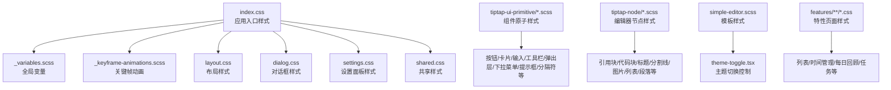
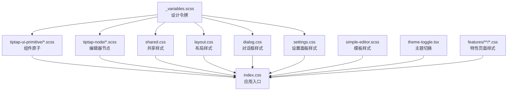
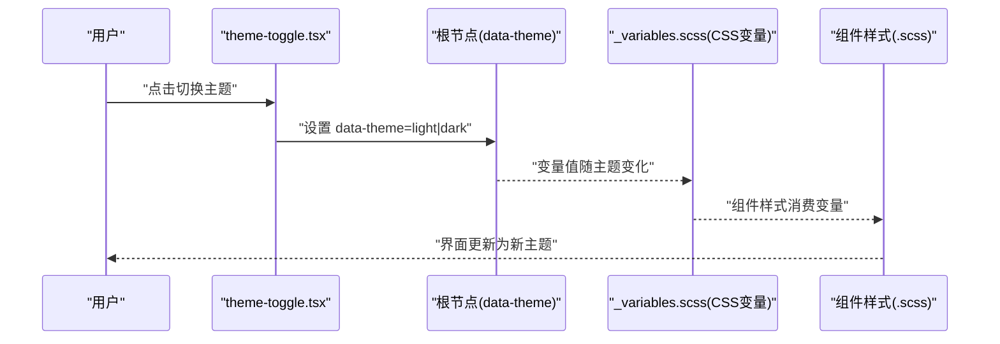
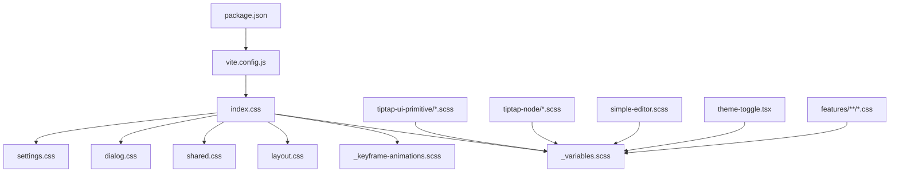

# 样式系统

<cite>
**本文引用的文件**   
- [src/styles/_variables.scss](file://src/styles/_variables.scss)
- [src/styles/_keyframe-animations.scss](file://src/styles/_keyframe-animations.scss)
- [src/index.css](file://src/index.css)
- [src/styles/layout.css](file://src/styles/layout.css)
- [src/styles/dialog.css](file://src/styles/dialog.css)
- [src/styles/settings.css](file://src/styles/settings.css)
- [src/styles/shared.css](file://src/styles/shared.css)
- [src/components/tiptap-ui-primitive/button.tsx](file://src/components/tiptap-ui-primitive/button.tsx)
- [src/components/tiptap-ui-primitive/button.scss](file://src/components/tiptap-ui-primitive/button.scss)
- [src/components/tiptap-ui-primitive/badge.tsx](file://src/components/tiptap-ui-primitive/badge.tsx)
- [src/components/tiptap-ui-primitive/badge.scss](file://src/components/tiptap-ui-primitive/badge.scss)
- [src/components/tiptap-ui-primitive/card.tsx](file://src/components/tiptap-ui-primitive/card.tsx)
- [src/components/tiptap-ui-primitive/card.scss](file://src/components/tiptap-ui-primitive/card.scss)
- [src/components/tiptap-ui-primitive/input.tsx](file://src/components/tiptap-ui-primitive/input.tsx)
- [src/components/tiptap-ui-primitive/input.scss](file://src/components/tiptap-ui-primitive/input.scss)
- [src/components/tiptap-ui-primitive/toolbar.tsx](file://src/components/tiptap-ui-primitive/toolbar.tsx)
- [src/components/tiptap-ui-primitive/toolbar.scss](file://src/components/tiptap-ui-primitive/toolbar.scss)
- [src/components/tiptap-ui-primitive/popover.tsx](file://src/components/tiptap-ui-primitive/popover.tsx)
- [src/components/tiptap-ui-primitive/popover.scss](file://src/components/tiptap-ui-primitive/popover.scss)
- [src/components/tiptap-ui-primitive/dropdown-menu.tsx](file://src/components/tiptap-ui-primitive/dropdown-menu.tsx)
- [src/components/tiptap-ui-primitive/dropdown-menu.scss](file://src/components/tiptap-ui-primitive/dropdown-menu.scss)
- [src/components/tiptap-ui-primitive/tooltip.tsx](file://src/components/tiptap-ui-primitive/tooltip.tsx)
- [src/components/tiptap-ui-primitive/tooltip.scss](file://src/components/tiptap-ui-primitive/tooltip.scss)
- [src/components/tiptap-ui-primitive/separator.tsx](file://src/components/tiptap-ui-primitive/separator.tsx)
- [src/components/tiptap-ui-primitive/separator.scss](file://src/components/tiptap-ui-primitive/separator.scss)
- [src/components/tiptap-ui-primitive/badge-group.scss](file://src/components/tiptap-ui-primitive/badge-group.scss)
- [src/components/tiptap-ui-primitive/button-group.scss](file://src/components/tiptap-ui-primitive/button-group.scss)
- [src/components/tiptap-ui-primitive/badge-colors.scss](file://src/components/tiptap-ui-primitive/badge-colors.scss)
- [src/components/tiptap-ui-primitive/button-colors.scss](file://src/components/tiptap-ui-primitive/button-colors.scss)
- [src/components/tiptap-node/blockquote-node.scss](file://src/components/tiptap-node/blockquote-node.scss)
- [src/components/tiptap-node/code-block-node.scss](file://src/components/tiptap-node/code-block-node.scss)
- [src/components/tiptap-node/heading-node.scss](file://src/components/tiptap-node/heading-node.scss)
- [src/components/tiptap-node/horizontal-rule-node.scss](file://src/components/tiptap-node/horizontal-rule-node.scss)
- [src/components/tiptap-node/image-node.scss](file://src/components/tiptap-node/image-node.scss)
- [src/components/tiptap-node/image-upload-node.scss](file://src/components/tiptap-node/image-upload-node.scss)
- [src/components/tiptap-node/list-node.scss](file://src/components/tiptap-node/list-node.scss)
- [src/components/tiptap-node/paragraph-node.scss](file://src/components/tiptap-node/paragraph-node.scss)
- [src/components/tiptap-templates/simple/simple-editor.scss](file://src/components/tiptap-templates/simple/simple-editor.scss)
- [src/components/tiptap-templates/simple/theme-toggle.tsx](file://src/components/tiptap-templates/simple/theme-toggle.tsx)
- [src/features/lists/lists.css](file://src/features/lists/lists.css)
- [src/features/time-management/timeManagement.css](file://src/features/time-management/timeManagement.css)
- [src/features/daily-review/dailyReview.css](file://src/features/daily-review/dailyReview.css)
- [src/features/mission/MissionPanel.css](file://src/features/mission/MissionPanel.css)
- [src/hooks/use-is-breakpoint.ts](file://src/hooks/use-is-breakpoint.ts)
- [vite.config.js](file://vite.config.js)
- [package.json](file://package.json)
</cite>

## 目录
1. [简介](#简介)
2. [项目结构](#项目结构)
3. [核心组件](#核心组件)
4. [架构总览](#架构总览)
5. [详细组件分析](#详细组件分析)
6. [依赖关系分析](#依赖关系分析)
7. [性能考虑](#性能考虑)
8. [故障排查指南](#故障排查指南)
9. [结论](#结论)
10. [附录](#附录)

## 简介
本文件系统化梳理 FishWorker 的样式体系，覆盖 SCSS/CSS 架构、变量与主题管理、混合宏与模块化组织、全局与组件样式约定、响应式与移动端适配、明暗主题切换机制、样式隔离策略、性能优化与浏览器兼容性处理，以及自定义主题开发与调试实践。目标是帮助开发者快速理解并高效扩展样式系统。

## 项目结构
FishWorker 采用“全局基础 + 组件原子 + 特性页面”的分层组织方式：
- 全局基础样式：位于 src/styles，包含变量、动画、布局、对话框、设置面板、共享样式等。
- 组件原子样式：位于 components/tiptap-ui-primitive，每个 UI 原语拥有独立的 .scss 与 .tsx 配对，便于复用与主题化。
- 编辑器节点样式：位于 components/tiptap-node，按节点类型拆分 SCSS，保持内容渲染样式清晰可维护。
- 模板与示例：components/tiptap-templates/simple 提供简单编辑器与主题切换演示。
- 特性页面样式：features 下各业务模块以独立 CSS 文件承载页面级样式，避免污染全局。
- 入口与构建：src/index.css 作为应用入口样式；Vite 配置负责 SCSS 编译与导入。



图表来源
- [src/index.css](file://src/index.css)
- [src/styles/_variables.scss](file://src/styles/_variables.scss)
- [src/styles/_keyframe-animations.scss](file://src/styles/_keyframe-animations.scss)
- [src/styles/layout.css](file://src/styles/layout.css)
- [src/styles/dialog.css](file://src/styles/dialog.css)
- [src/styles/settings.css](file://src/styles/settings.css)
- [src/styles/shared.css](file://src/styles/shared.css)
- [src/components/tiptap-ui-primitive/button.scss](file://src/components/tiptap-ui-primitive/button.scss)
- [src/components/tiptap-ui-primitive/card.scss](file://src/components/tiptap-ui-primitive/card.scss)
- [src/components/tiptap-ui-primitive/input.scss](file://src/components/tiptap-ui-primitive/input.scss)
- [src/components/tiptap-ui-primitive/toolbar.scss](file://src/components/tiptap-ui-primitive/toolbar.scss)
- [src/components/tiptap-ui-primitive/popover.scss](file://src/components/tiptap-ui-primitive/popover.scss)
- [src/components/tiptap-ui-primitive/dropdown-menu.scss](file://src/components/tiptap-ui-primitive/dropdown-menu.scss)
- [src/components/tiptap-ui-primitive/tooltip.scss](file://src/components/tiptap-ui-primitive/tooltip.scss)
- [src/components/tiptap-ui-primitive/separator.scss](file://src/components/tiptap-ui-primitive/separator.scss)
- [src/components/tiptap-node/blockquote-node.scss](file://src/components/tiptap-node/blockquote-node.scss)
- [src/components/tiptap-node/code-block-node.scss](file://src/components/tiptap-node/code-block-node.scss)
- [src/components/tiptap-node/heading-node.scss](file://src/components/tiptap-node/heading-node.scss)
- [src/components/tiptap-node/horizontal-rule-node.scss](file://src/components/tiptap-node/horizontal-rule-node.scss)
- [src/components/tiptap-node/image-node.scss](file://src/components/tiptap-node/image-node.scss)
- [src/components/tiptap-node/image-upload-node.scss](file://src/components/tiptap-node/image-upload-node.scss)
- [src/components/tiptap-node/list-node.scss](file://src/components/tiptap-node/list-node.scss)
- [src/components/tiptap-node/paragraph-node.scss](file://src/components/tiptap-node/paragraph-node.scss)
- [src/components/tiptap-templates/simple/simple-editor.scss](file://src/components/tiptap-templates/simple/simple-editor.scss)
- [src/components/tiptap-templates/simple/theme-toggle.tsx](file://src/components/tiptap-templates/simple/theme-toggle.tsx)
- [src/features/lists/lists.css](file://src/features/lists/lists.css)
- [src/features/time-management/timeManagement.css](file://src/features/time-management/timeManagement.css)
- [src/features/daily-review/dailyReview.css](file://src/features/daily-review/dailyReview.css)
- [src/features/mission/MissionPanel.css](file://src/features/mission/MissionPanel.css)

章节来源
- [src/index.css](file://src/index.css)
- [src/styles/_variables.scss](file://src/styles/_variables.scss)
- [src/styles/_keyframe-animations.scss](file://src/styles/_keyframe-animations.scss)
- [src/styles/layout.css](file://src/styles/layout.css)
- [src/styles/dialog.css](file://src/styles/dialog.css)
- [src/styles/settings.css](file://src/styles/settings.css)
- [src/styles/shared.css](file://src/styles/shared.css)
- [src/components/tiptap-ui-primitive/button.tsx](file://src/components/tiptap-ui-primitive/button.tsx)
- [src/components/tiptap-ui-primitive/button.scss](file://src/components/tiptap-ui-primitive/button.scss)
- [src/components/tiptap-ui-primitive/badge.tsx](file://src/components/tiptap-ui-primitive/badge.tsx)
- [src/components/tiptap-ui-primitive/badge.scss](file://src/components/tiptap-ui-primitive/badge.tsx)
- [src/components/tiptap-ui-primitive/card.tsx](file://src/components/tiptap-ui-primitive/card.tsx)
- [src/components/tiptap-ui-primitive/card.scss](file://src/components/tiptap-ui-primitive/card.scss)
- [src/components/tiptap-ui-primitive/input.tsx](file://src/components/tiptap-ui-primitive/input.tsx)
- [src/components/tiptap-ui-primitive/input.scss](file://src/components/tiptap-ui-primitive/input.scss)
- [src/components/tiptap-ui-primitive/toolbar.tsx](file://src/components/tiptap-ui-primitive/toolbar.tsx)
- [src/components/tiptap-ui-primitive/toolbar.scss](file://src/components/tiptap-ui-primitive/toolbar.scss)
- [src/components/tiptap-ui-primitive/popover.tsx](file://src/components/tiptap-ui-primitive/popover.tsx)
- [src/components/tiptap-ui-primitive/popover.scss](file://src/components/tiptap-ui-primitive/popover.scss)
- [src/components/tiptap-ui-primitive/dropdown-menu.tsx](file://src/components/tiptap-ui-primitive/dropdown-menu.tsx)
- [src/components/tiptap-ui-primitive/dropdown-menu.scss](file://src/components/tiptap-ui-primitive/dropdown-menu.scss)
- [src/components/tiptap-ui-primitive/tooltip.tsx](file://src/components/tiptap-ui-primitive/tooltip.tsx)
- [src/components/tiptap-ui-primitive/tooltip.scss](file://src/components/tiptap-ui-primitive/tooltip.scss)
- [src/components/tiptap-ui-primitive/separator.tsx](file://src/components/tiptap-ui-primitive/separator.tsx)
- [src/components/tiptap-ui-primitive/separator.scss](file://src/components/tiptap-ui-primitive/separator.scss)
- [src/components/tiptap-ui-primitive/badge-group.scss](file://src/components/tiptap-ui-primitive/badge-group.scss)
- [src/components/tiptap-ui-primitive/button-group.scss](file://src/components/tiptap-ui-primitive/button-group.scss)
- [src/components/tiptap-ui-primitive/badge-colors.scss](file://src/components/tiptap-ui-primitive/badge-colors.scss)
- [src/components/tiptap-ui-primitive/button-colors.scss](file://src/components/tiptap-ui-primitive/button-colors.scss)
- [src/components/tiptap-node/blockquote-node.scss](file://src/components/tiptap-node/blockquote-node.scss)
- [src/components/tiptap-node/code-block-node.scss](file://src/components/tiptap-node/code-block-node.scss)
- [src/components/tiptap-node/heading-node.scss](file://src/components/tiptap-node/heading-node.scss)
- [src/components/tiptap-node/horizontal-rule-node.scss](file://src/components/tiptap-node/horizontal-rule-node.scss)
- [src/components/tiptap-node/image-node.scss](file://src/components/tiptap-node/image-node.scss)
- [src/components/tiptap-node/image-upload-node.scss](file://src/components/tiptap-node/image-upload-node.scss)
- [src/components/tiptap-node/list-node.scss](file://src/components/tiptap-node/list-node.scss)
- [src/components/tiptap-node/paragraph-node.scss](file://src/components/tiptap-node/paragraph-node.scss)
- [src/components/tiptap-templates/simple/simple-editor.scss](file://src/components/tiptap-templates/simple/simple-editor.scss)
- [src/components/tiptap-templates/simple/theme-toggle.tsx](file://src/components/tiptap-templates/simple/theme-toggle.tsx)
- [src/features/lists/lists.css](file://src/features/lists/lists.css)
- [src/features/time-management/timeManagement.css](file://src/features/time-management/timeManagement.css)
- [src/features/daily-review/dailyReview.css](file://src/features/daily-review/dailyReview.css)
- [src/features/mission/MissionPanel.css](file://src/features/mission/MissionPanel.css)

## 核心组件
- 全局变量与主题
  - _variables.scss 集中定义颜色、字号、间距、圆角、阴影、断点等设计令牌，供组件与页面统一消费。
  - 通过 CSS 自定义属性（CSS Variables）暴露主题值，支持运行时切换明暗主题。
- 动画与过渡
  - _keyframe-animations.scss 封装常用关键帧动画，配合 CSS transition 实现平滑交互。
- 布局与共享
  - layout.css 定义网格、侧边栏、主内容区等布局规则。
  - shared.css 提供通用排版、重置、工具类。
- 对话框与设置
  - dialog.css 与 settings.css 分别管理模态对话框与设置面板的样式。
- 组件原子（tiptap-ui-primitive）
  - 每个原子组件由 .tsx 与 .scss 成对存在，命名一致，便于定位与维护。
  - 颜色变体与分组样式拆分为 badge-colors.scss、button-colors.scss、badge-group.scss、button-group.scss 等，提升组合能力。
- 编辑器节点（tiptap-node）
  - 按节点类型划分 SCSS，确保富文本渲染样式清晰可控。
- 模板与主题切换
  - simple-editor.scss 为简单编辑器模板样式。
  - theme-toggle.tsx 提供明暗主题切换逻辑，结合 CSS 变量实现无刷新换肤。

章节来源
- [src/styles/_variables.scss](file://src/styles/_variables.scss)
- [src/styles/_keyframe-animations.scss](file://src/styles/_keyframe-animations.scss)
- [src/styles/layout.css](file://src/styles/layout.css)
- [src/styles/shared.css](file://src/styles/shared.css)
- [src/styles/dialog.css](file://src/styles/dialog.css)
- [src/styles/settings.css](file://src/styles/settings.css)
- [src/components/tiptap-ui-primitive/button.tsx](file://src/components/tiptap-ui-primitive/button.tsx)
- [src/components/tiptap-ui-primitive/button.scss](file://src/components/tiptap-ui-primitive/button.scss)
- [src/components/tiptap-ui-primitive/badge.tsx](file://src/components/tiptap-ui-primitive/badge.tsx)
- [src/components/tiptap-ui-primitive/badge.scss](file://src/components/tiptap-ui-primitive/badge.tsx)
- [src/components/tiptap-ui-primitive/card.tsx](file://src/components/tiptap-ui-primitive/card.tsx)
- [src/components/tiptap-ui-primitive/card.scss](file://src/components/tiptap-ui-primitive/card.scss)
- [src/components/tiptap-ui-primitive/input.tsx](file://src/components/tiptap-ui-primitive/input.tsx)
- [src/components/tiptap-ui-primitive/input.scss](file://src/components/tiptap-ui-primitive/input.scss)
- [src/components/tiptap-ui-primitive/toolbar.tsx](file://src/components/tiptap-ui-primitive/toolbar.tsx)
- [src/components/tiptap-ui-primitive/toolbar.scss](file://src/components/tiptap-ui-primitive/toolbar.scss)
- [src/components/tiptap-ui-primitive/popover.tsx](file://src/components/tiptap-ui-primitive/popover.tsx)
- [src/components/tiptap-ui-primitive/popover.scss](file://src/components/tiptap-ui-primitive/popover.scss)
- [src/components/tiptap-ui-primitive/dropdown-menu.tsx](file://src/components/tiptap-ui-primitive/dropdown-menu.tsx)
- [src/components/tiptap-ui-primitive/dropdown-menu.scss](file://src/components/tiptap-ui-primitive/dropdown-menu.scss)
- [src/components/tiptap-ui-primitive/tooltip.tsx](file://src/components/tiptap-ui-primitive/tooltip.tsx)
- [src/components/tiptap-ui-primitive/tooltip.scss](file://src/components/tiptap-ui-primitive/tooltip.scss)
- [src/components/tiptap-ui-primitive/separator.tsx](file://src/components/tiptap-ui-primitive/separator.tsx)
- [src/components/tiptap-ui-primitive/separator.scss](file://src/components/tiptap-ui-primitive/separator.scss)
- [src/components/tiptap-ui-primitive/badge-group.scss](file://src/components/tiptap-ui-primitive/badge-group.scss)
- [src/components/tiptap-ui-primitive/button-group.scss](file://src/components/tiptap-ui-primitive/button-group.scss)
- [src/components/tiptap-ui-primitive/badge-colors.scss](file://src/components/tiptap-ui-primitive/badge-colors.scss)
- [src/components/tiptap-ui-primitive/button-colors.scss](file://src/components/tiptap-ui-primitive/button-colors.scss)
- [src/components/tiptap-node/blockquote-node.scss](file://src/components/tiptap-node/blockquote-node.scss)
- [src/components/tiptap-node/code-block-node.scss](file://src/components/tiptap-node/code-block-node.scss)
- [src/components/tiptap-node/heading-node.scss](file://src/components/tiptap-node/heading-node.scss)
- [src/components/tiptap-node/horizontal-rule-node.scss](file://src/components/tiptap-node/horizontal-rule-node.scss)
- [src/components/tiptap-node/image-node.scss](file://src/components/tiptap-node/image-node.scss)
- [src/components/tiptap-node/image-upload-node.scss](file://src/components/tiptap-node/image-upload-node.scss)
- [src/components/tiptap-node/list-node.scss](file://src/components/tiptap-node/list-node.scss)
- [src/components/tiptap-node/paragraph-node.scss](file://src/components/tiptap-node/paragraph-node.scss)
- [src/components/tiptap-templates/simple/simple-editor.scss](file://src/components/tiptap-templates/simple/simple-editor.scss)
- [src/components/tiptap-templates/simple/theme-toggle.tsx](file://src/components/tiptap-templates/simple/theme-toggle.tsx)

## 架构总览
样式架构遵循“变量驱动 + 组件原子 + 特性页面”的分层模型：
- 变量层：_variables.scss 提供设计令牌，并通过 CSS 变量暴露给运行时。
- 基础层：layout.css、shared.css、dialog.css、settings.css 提供布局与通用样式。
- 组件层：tiptap-ui-primitive 下的原子组件样式，使用变量与混合宏，保证一致性。
- 内容层：tiptap-node 下的节点样式，专注于富文本渲染。
- 模板与主题：simple-editor.scss 与 theme-toggle.tsx 演示主题切换。
- 特性层：features 下各模块的 CSS 文件，限定作用域，避免全局污染。



图表来源
- [src/styles/_variables.scss](file://src/styles/_variables.scss)
- [src/styles/shared.css](file://src/styles/shared.css)
- [src/styles/layout.css](file://src/styles/layout.css)
- [src/styles/dialog.css](file://src/styles/dialog.css)
- [src/styles/settings.css](file://src/styles/settings.css)
- [src/components/tiptap-ui-primitive/button.scss](file://src/components/tiptap-ui-primitive/button.scss)
- [src/components/tiptap-ui-primitive/card.scss](file://src/components/tiptap-ui-primitive/card.scss)
- [src/components/tiptap-ui-primitive/input.scss](file://src/components/tiptap-ui-primitive/input.scss)
- [src/components/tiptap-ui-primitive/toolbar.scss](file://src/components/tiptap-ui-primitive/toolbar.scss)
- [src/components/tiptap-ui-primitive/popover.scss](file://src/components/tiptap-ui-primitive/popover.scss)
- [src/components/tiptap-ui-primitive/dropdown-menu.scss](file://src/components/tiptap-ui-primitive/dropdown-menu.scss)
- [src/components/tiptap-ui-primitive/tooltip.scss](file://src/components/tiptap-ui-primitive/tooltip.scss)
- [src/components/tiptap-ui-primitive/separator.scss](file://src/components/tiptap-ui-primitive/separator.scss)
- [src/components/tiptap-node/blockquote-node.scss](file://src/components/tiptap-node/blockquote-node.scss)
- [src/components/tiptap-node/code-block-node.scss](file://src/components/tiptap-node/code-block-node.scss)
- [src/components/tiptap-node/heading-node.scss](file://src/components/tiptap-node/heading-node.scss)
- [src/components/tiptap-node/horizontal-rule-node.scss](file://src/components/tiptap-node/horizontal-rule-node.scss)
- [src/components/tiptap-node/image-node.scss](file://src/components/tiptap-node/image-node.scss)
- [src/components/tiptap-node/image-upload-node.scss](file://src/components/tiptap-node/image-upload-node.scss)
- [src/components/tiptap-node/list-node.scss](file://src/components/tiptap-node/list-node.scss)
- [src/components/tiptap-node/paragraph-node.scss](file://src/components/tiptap-node/paragraph-node.scss)
- [src/components/tiptap-templates/simple/simple-editor.scss](file://src/components/tiptap-templates/simple/simple-editor.scss)
- [src/components/tiptap-templates/simple/theme-toggle.tsx](file://src/components/tiptap-templates/simple/theme-toggle.tsx)
- [src/features/lists/lists.css](file://src/features/lists/lists.css)
- [src/features/time-management/timeManagement.css](file://src/features/time-management/timeManagement.css)
- [src/features/daily-review/dailyReview.css](file://src/features/daily-review/dailyReview.css)
- [src/features/mission/MissionPanel.css](file://src/features/mission/MissionPanel.css)
- [src/index.css](file://src/index.css)

## 详细组件分析

### 变量与主题管理（_variables.scss）
- 设计令牌
  - 颜色：语义化命名（如主色、强调色、背景色、文字色），区分明暗主题值。
  - 尺寸：字号、行高、间距、圆角、阴影等，形成统一的设计语言。
  - 断点：用于响应式布局的媒体查询阈值。
- 主题实现
  - 通过 CSS 自定义属性在根或组件作用域内声明，运行时切换 data-theme 或 class 即可更新变量值。
  - 明暗主题切换由 theme-toggle.tsx 触发，修改根节点属性，从而改变所有消费变量的组件外观。
- 最佳实践
  - 新增令牌时优先在 _variables.scss 中定义，避免硬编码。
  - 使用 CSS 变量而非 SCSS 变量进行运行时切换，SCSS 变量仅用于编译期计算。

章节来源
- [src/styles/_variables.scss](file://src/styles/_variables.scss)
- [src/components/tiptap-templates/simple/theme-toggle.tsx](file://src/components/tiptap-templates/simple/theme-toggle.tsx)

### 组件原子样式（tiptap-ui-primitive）
- 组织结构
  - 每个原子组件对应一个 .tsx 与 .scss 文件，命名一致，便于查找与维护。
  - 颜色变体与分组样式拆分为独立 SCSS（如 button-colors.scss、badge-colors.scss、button-group.scss、badge-group.scss）。
- 命名约定
  - 类名采用 BEM 风格或前缀命名（如 tiptap-button、tiptap-card），避免冲突。
  - 状态类（hover、active、disabled）与尺寸类（sm、md、lg）分离，提高组合性。
- 主题化
  - 组件样式消费 _variables.scss 中的颜色与尺寸令牌，确保与全局主题一致。
  - 通过 CSS 变量覆盖实现局部主题定制。

```mermaid
classDiagram
class Button {
+props : "variant, size, disabled"
+className : "tiptap-button"
+styles : "button.scss"
}
class Badge {
+props : "color, size"
+className : "tiptap-badge"
+styles : "badge.scss"
}
class Card {
+props : "padding, shadow"
+className : "tiptap-card"
+styles : "card.scss"
}
class Input {
+props : "size, variant"
+className : "tiptap-input"
+styles : "input.scss"
}
class Toolbar {
+props : "orientation"
+className : "tiptap-toolbar"
+styles : "toolbar.scss"
}
class Popover {
+props : "placement"
+className : "tiptap-popover"
+styles : "popover.scss"
}
class DropdownMenu {
+props : "align"
+className : "tiptap-dropdown-menu"
+styles : "dropdown-menu.scss"
}
class Tooltip {
+props : "position"
+className : "tiptap-tooltip"
+styles : "tooltip.scss"
}
class Separator {
+props : "orientation"
+className : "tiptap-separator"
+styles : "separator.scss"
}
Button --> "使用" : "变量与颜色"
Badge --> "使用" : "变量与颜色"
Card --> "使用" : "变量与尺寸"
Input --> "使用" : "变量与尺寸"
Toolbar --> "使用" : "变量与布局"
Popover --> "使用" : "变量与层级"
DropdownMenu --> "使用" : "变量与布局"
Tooltip --> "使用" : "变量与层级"
Separator --> "使用" : "变量与尺寸"
```

图表来源
- [src/components/tiptap-ui-primitive/button.tsx](file://src/components/tiptap-ui-primitive/button.tsx)
- [src/components/tiptap-ui-primitive/button.scss](file://src/components/tiptap-ui-primitive/button.scss)
- [src/components/tiptap-ui-primitive/badge.tsx](file://src/components/tiptap-ui-primitive/badge.tsx)
- [src/components/tiptap-ui-primitive/badge.scss](file://src/components/tiptap-ui-primitive/badge.tsx)
- [src/components/tiptap-ui-primitive/card.tsx](file://src/components/tiptap-ui-primitive/card.tsx)
- [src/components/tiptap-ui-primitive/card.scss](file://src/components/tiptap-ui-primitive/card.scss)
- [src/components/tiptap-ui-primitive/input.tsx](file://src/components/tiptap-ui-primitive/input.tsx)
- [src/components/tiptap-ui-primitive/input.scss](file://src/components/tiptap-ui-primitive/input.scss)
- [src/components/tiptap-ui-primitive/toolbar.tsx](file://src/components/tiptap-ui-primitive/toolbar.tsx)
- [src/components/tiptap-ui-primitive/toolbar.scss](file://src/components/tiptap-ui-primitive/toolbar.tsx)
- [src/components/tiptap-ui-primitive/popover.tsx](file://src/components/tiptap-ui-primitive/popover.tsx)
- [src/components/tiptap-ui-primitive/popover.scss](file://src/components/tiptap-ui-primitive/popover.tsx)
- [src/components/tiptap-ui-primitive/dropdown-menu.tsx](file://src/components/tiptap-ui-primitive/dropdown-menu.tsx)
- [src/components/tiptap-ui-primitive/dropdown-menu.scss](file://src/components/tiptap-ui-primitive/dropdown-menu.tsx)
- [src/components/tiptap-ui-primitive/tooltip.tsx](file://src/components/tiptap-ui-primitive/tooltip.tsx)
- [src/components/tiptap-ui-primitive/tooltip.scss](file://src/components/tiptap-ui-primitive/tooltip.tsx)
- [src/components/tiptap-ui-primitive/separator.tsx](file://src/components/tiptap-ui-primitive/separator.tsx)
- [src/components/tiptap-ui-primitive/separator.scss](file://src/components/tiptap-ui-primitive/separator.tsx)

章节来源
- [src/components/tiptap-ui-primitive/button.tsx](file://src/components/tiptap-ui-primitive/button.tsx)
- [src/components/tiptap-ui-primitive/button.scss](file://src/components/tiptap-ui-primitive/button.scss)
- [src/components/tiptap-ui-primitive/badge.tsx](file://src/components/tiptap-ui-primitive/badge.tsx)
- [src/components/tiptap-ui-primitive/badge.scss](file://src/components/tiptap-ui-primitive/badge.tsx)
- [src/components/tiptap-ui-primitive/card.tsx](file://src/components/tiptap-ui-primitive/card.tsx)
- [src/components/tiptap-ui-primitive/card.scss](file://src/components/tiptap-ui-primitive/card.scss)
- [src/components/tiptap-ui-primitive/input.tsx](file://src/components/tiptap-ui-primitive/input.tsx)
- [src/components/tiptap-ui-primitive/input.scss](file://src/components/tiptap-ui-primitive/input.scss)
- [src/components/tiptap-ui-primitive/toolbar.tsx](file://src/components/tiptap-ui-primitive/toolbar.tsx)
- [src/components/tiptap-ui-primitive/toolbar.scss](file://src/components/tiptap-ui-primitive/toolbar.tsx)
- [src/components/tiptap-ui-primitive/popover.tsx](file://src/components/tiptap-ui-primitive/popover.tsx)
- [src/components/tiptap-ui-primitive/popover.scss](file://src/components/tiptap-ui-primitive/popover.tsx)
- [src/components/tiptap-ui-primitive/dropdown-menu.tsx](file://src/components/tiptap-ui-primitive/dropdown-menu.tsx)
- [src/components/tiptap-ui-primitive/dropdown-menu.scss](file://src/components/tiptap-ui-primitive/dropdown-menu.tsx)
- [src/components/tiptap-ui-primitive/tooltip.tsx](file://src/components/tiptap-ui-primitive/tooltip.tsx)
- [src/components/tiptap-ui-primitive/tooltip.scss](file://src/components/tiptap-ui-primitive/tooltip.tsx)
- [src/components/tiptap-ui-primitive/separator.tsx](file://src/components/tiptap-ui-primitive/separator.tsx)
- [src/components/tiptap-ui-primitive/separator.scss](file://src/components/tiptap-ui-primitive/separator.tsx)

### 编辑器节点样式（tiptap-node）
- 按节点类型拆分 SCSS，包括引用块、代码块、标题、水平分割线、图片、图片上传、列表、段落等。
- 节点样式聚焦于内容渲染，尽量不侵入组件原子样式，保持职责清晰。
- 通过变量与共享样式保持一致的视觉风格。

章节来源
- [src/components/tiptap-node/blockquote-node.scss](file://src/components/tiptap-node/blockquote-node.scss)
- [src/components/tiptap-node/code-block-node.scss](file://src/components/tiptap-node/code-block-node.scss)
- [src/components/tiptap-node/heading-node.scss](file://src/components/tiptap-node/heading-node.scss)
- [src/components/tiptap-node/horizontal-rule-node.scss](file://src/components/tiptap-node/horizontal-rule-node.scss)
- [src/components/tiptap-node/image-node.scss](file://src/components/tiptap-node/image-node.scss)
- [src/components/tiptap-node/image-upload-node.scss](file://src/components/tiptap-node/image-upload-node.scss)
- [src/components/tiptap-node/list-node.scss](file://src/components/tiptap-node/list-node.scss)
- [src/components/tiptap-node/paragraph-node.scss](file://src/components/tiptap-node/paragraph-node.scss)

### 模板与主题切换（simple-editor 与 theme-toggle）
- simple-editor.scss 提供简单编辑器的容器与排版样式。
- theme-toggle.tsx 提供明暗主题切换逻辑，通过修改根节点属性（如 data-theme）来切换 CSS 变量值，从而实现无刷新换肤。



图表来源
- [src/components/tiptap-templates/simple/theme-toggle.tsx](file://src/components/tiptap-templates/simple/theme-toggle.tsx)
- [src/styles/_variables.scss](file://src/styles/_variables.scss)
- [src/components/tiptap-templates/simple/simple-editor.scss](file://src/components/tiptap-templates/simple/simple-editor.scss)

章节来源
- [src/components/tiptap-templates/simple/simple-editor.scss](file://src/components/tiptap-templates/simple/simple-editor.scss)
- [src/components/tiptap-templates/simple/theme-toggle.tsx](file://src/components/tiptap-templates/simple/theme-toggle.tsx)

### 特性页面样式（features）
- 各业务模块以独立 CSS 文件组织页面级样式，避免污染全局。
- 典型文件：lists.css、timeManagement.css、dailyReview.css、MissionPanel.css。
- 建议：页面样式尽量引用全局变量与共享类，减少重复定义。

章节来源
- [src/features/lists/lists.css](file://src/features/lists/lists.css)
- [src/features/time-management/timeManagement.css](file://src/features/time-management/timeManagement.css)
- [src/features/daily-review/dailyReview.css](file://src/features/daily-review/dailyReview.css)
- [src/features/mission/MissionPanel.css](file://src/features/mission/MissionPanel.css)

## 依赖关系分析
- 构建与导入
  - index.css 作为应用入口样式，导入全局变量、动画、布局、共享、对话框、设置等基础样式。
  - Vite 配置负责 SCSS 编译与自动导入，确保组件样式按需加载。
- 组件与变量
  - 组件原子样式依赖 _variables.scss 提供的变量，确保主题一致性。
  - 编辑器节点样式同样消费变量，保持内容与组件风格统一。
- 主题切换
  - theme-toggle.tsx 修改根节点属性，影响 CSS 变量，进而驱动所有组件样式更新。



图表来源
- [src/index.css](file://src/index.css)
- [src/styles/_variables.scss](file://src/styles/_variables.scss)
- [src/styles/_keyframe-animations.scss](file://src/styles/_keyframe-animations.scss)
- [src/styles/layout.css](file://src/styles/layout.css)
- [src/styles/shared.css](file://src/styles/shared.css)
- [src/styles/dialog.css](file://src/styles/dialog.css)
- [src/styles/settings.css](file://src/styles/settings.css)
- [src/components/tiptap-ui-primitive/button.scss](file://src/components/tiptap-ui-primitive/button.scss)
- [src/components/tiptap-ui-primitive/card.scss](file://src/components/tiptap-ui-primitive/card.scss)
- [src/components/tiptap-ui-primitive/input.scss](file://src/components/tiptap-ui-primitive/input.scss)
- [src/components/tiptap-ui-primitive/toolbar.scss](file://src/components/tiptap-ui-primitive/toolbar.scss)
- [src/components/tiptap-ui-primitive/popover.scss](file://src/components/tiptap-ui-primitive/popover.scss)
- [src/components/tiptap-ui-primitive/dropdown-menu.scss](file://src/components/tiptap-ui-primitive/dropdown-menu.scss)
- [src/components/tiptap-ui-primitive/tooltip.scss](file://src/components/tiptap-ui-primitive/tooltip.scss)
- [src/components/tiptap-ui-primitive/separator.scss](file://src/components/tiptap-ui-primitive/separator.scss)
- [src/components/tiptap-node/blockquote-node.scss](file://src/components/tiptap-node/blockquote-node.scss)
- [src/components/tiptap-node/code-block-node.scss](file://src/components/tiptap-node/code-block-node.scss)
- [src/components/tiptap-node/heading-node.scss](file://src/components/tiptap-node/heading-node.scss)
- [src/components/tiptap-node/horizontal-rule-node.scss](file://src/components/tiptap-node/horizontal-rule-node.scss)
- [src/components/tiptap-node/image-node.scss](file://src/components/tiptap-node/image-node.scss)
- [src/components/tiptap-node/image-upload-node.scss](file://src/components/tiptap-node/image-upload-node.scss)
- [src/components/tiptap-node/list-node.scss](file://src/components/tiptap-node/list-node.scss)
- [src/components/tiptap-node/paragraph-node.scss](file://src/components/tiptap-node/paragraph-node.scss)
- [src/components/tiptap-templates/simple/simple-editor.scss](file://src/components/tiptap-templates/simple/simple-editor.scss)
- [src/components/tiptap-templates/simple/theme-toggle.tsx](file://src/components/tiptap-templates/simple/theme-toggle.tsx)
- [src/features/lists/lists.css](file://src/features/lists/lists.css)
- [src/features/time-management/timeManagement.css](file://src/features/time-management/timeManagement.css)
- [src/features/daily-review/dailyReview.css](file://src/features/daily-review/dailyReview.css)
- [src/features/mission/MissionPanel.css](file://src/features/mission/MissionPanel.css)
- [vite.config.js](file://vite.config.js)
- [package.json](file://package.json)

章节来源
- [src/index.css](file://src/index.css)
- [vite.config.js](file://vite.config.js)
- [package.json](file://package.json)

## 性能考虑
- 样式体积与加载
  - 将变量与动画抽离到独立文件，避免重复定义。
  - 组件样式按模块拆分，利用 Vite 按需导入，减少首屏样式体积。
- 选择器与重绘
  - 使用具体且稳定的类名，避免深层嵌套与通配符选择器。
  - 合理使用 CSS 变量，减少运行时计算开销。
- 动画与过渡
  - 优先使用 transform 与 opacity 实现动画，避免触发布局重排。
  - 关键帧动画集中在 _keyframe-animations.scss，便于复用与优化。
- 浏览器兼容
  - 使用现代 CSS 特性时，注意目标浏览器支持情况，必要时添加前缀或降级方案。
  - 通过 Vite 插件与 PostCSS 自动化处理兼容性问题。

[本节为通用指导，无需特定文件来源]

## 故障排查指南
- 主题未生效
  - 检查 theme-toggle.tsx 是否正确修改根节点属性。
  - 确认 _variables.scss 中 CSS 变量已正确声明并在组件样式中被消费。
- 样式冲突
  - 检查组件类名前缀是否唯一，避免与其他库或特性页面样式冲突。
  - 使用浏览器开发者工具查看最终计算样式与作用域。
- 响应式异常
  - 核对断点变量与媒体查询的使用位置，确保与布局样式一致。
  - 使用 use-is-breakpoint.ts 辅助判断当前断点，验证逻辑与样式匹配。
- 构建问题
  - 确认 vite.config.js 中 SCSS 编译配置正确。
  - 检查 package.json 中相关依赖版本是否兼容。

章节来源
- [src/components/tiptap-templates/simple/theme-toggle.tsx](file://src/components/tiptap-templates/simple/theme-toggle.tsx)
- [src/styles/_variables.scss](file://src/styles/_variables.scss)
- [src/hooks/use-is-breakpoint.ts](file://src/hooks/use-is-breakpoint.ts)
- [vite.config.js](file://vite.config.js)
- [package.json](file://package.json)

## 结论
FishWorker 的样式系统以变量为核心，结合组件原子与特性页面分层组织，实现了良好的可维护性与可扩展性。通过 CSS 变量与主题切换机制，支持灵活的明暗主题；通过模块化与命名约定，保障样式的一致性与隔离性。建议在后续迭代中持续完善变量体系、增强响应式断点管理，并结合性能监控进一步优化样式加载与渲染效率。

[本节为总结性内容，无需特定文件来源]

## 附录
- 自定义主题开发
  - 在 _variables.scss 中新增或覆盖 CSS 变量，定义新主题的颜色、尺寸与断点。
  - 在 theme-toggle.tsx 中添加主题切换逻辑，绑定新的 data-theme 值。
  - 在组件样式中消费变量，确保新主题生效。
- 样式调试技巧
  - 使用浏览器开发者工具检查元素样式与作用域。
  - 通过临时类名与 !important 定位冲突，随后重构解决。
  - 利用 use-is-breakpoint.ts 验证响应式逻辑与样式匹配。

[本节为操作指南，无需特定文件来源]