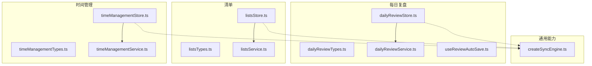
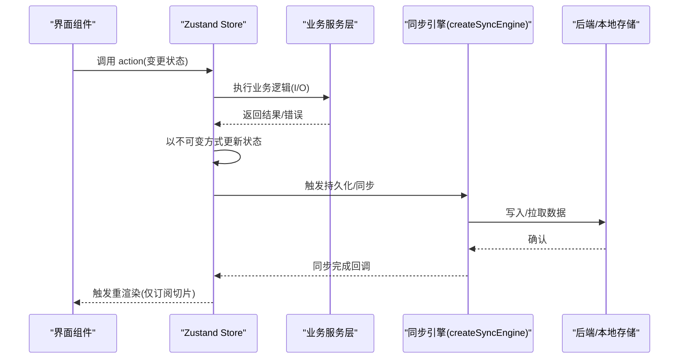
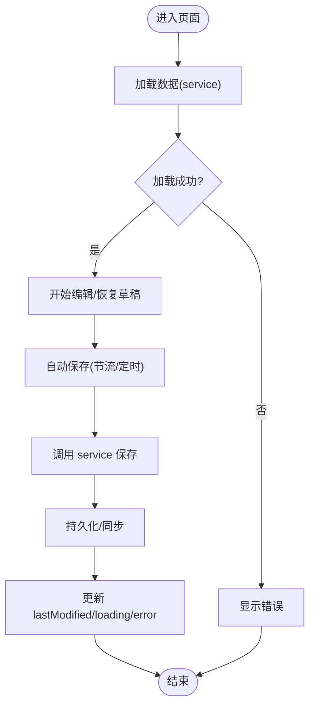
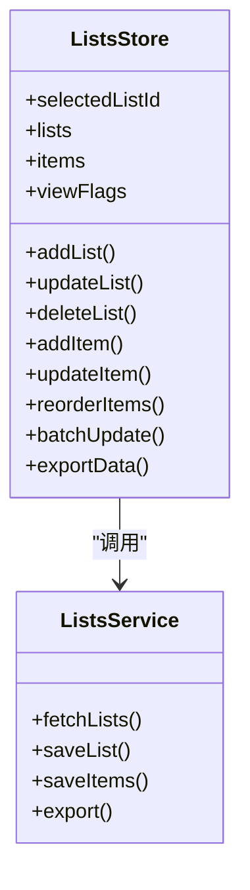
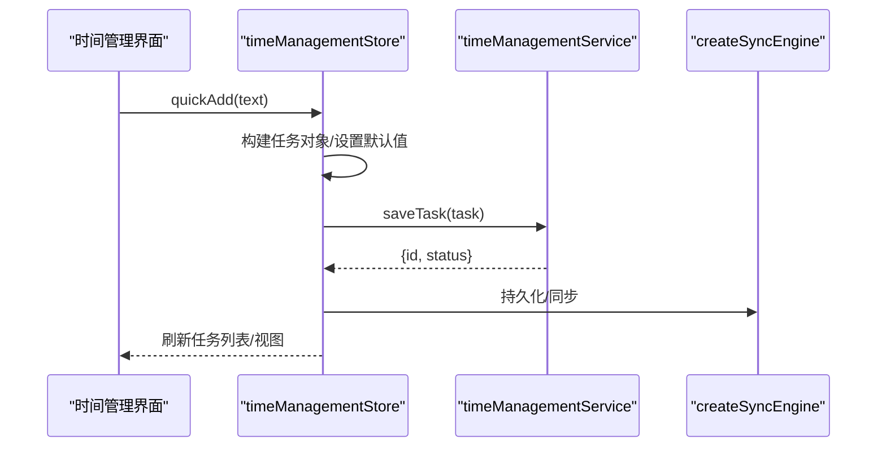
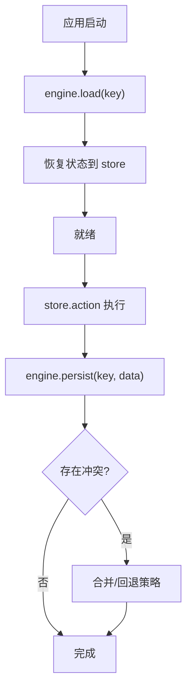
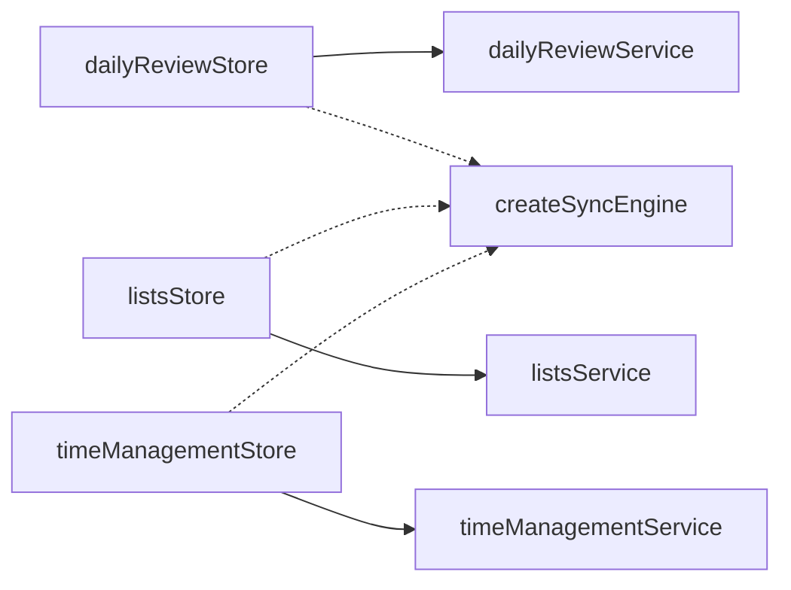

# 状态管理

<cite>
**本文引用的文件**   
- [dailyReviewStore.ts](file://src/features/daily-review/dailyReviewStore.ts)
- [dailyReviewTypes.ts](file://src/features/daily-review/dailyReviewTypes.ts)
- [dailyReviewService.ts](file://src/features/daily-review/dailyReviewService.ts)
- [useReviewAutoSave.ts](file://src/features/daily-review/useReviewAutoSave.ts)
- [listsStore.ts](file://src/features/lists/listsStore.ts)
- [listsTypes.ts](file://src/features/lists/listsTypes.ts)
- [listsService.ts](file://src/features/lists/listsService.ts)
- [timeManagementStore.ts](file://src/features/time-management/timeManagementStore.ts)
- [timeManagementTypes.ts](file://src/features/time-management/timeManagementTypes.ts)
- [timeManagementService.ts](file://src/features/time-management/timeManagementService.ts)
- [createSyncEngine.ts](file://src/lib/createSyncEngine.ts)
- [MissionStore.ts](file://src/features/mission/MissionStore.ts)
- [preferencesStore.ts](file://src/features/settings/preferencesStore.ts)
</cite>

## 目录
1. [简介](#简介)
2. [项目结构](#项目结构)
3. [核心组件](#核心组件)
4. [架构总览](#架构总览)
5. [详细组件分析](#详细组件分析)
6. [依赖关系分析](#依赖关系分析)
7. [性能考虑](#性能考虑)
8. [故障排查指南](#故障排查指南)
9. [结论](#结论)
10. [附录](#附录)

## 简介
本文件面向 FishWorker 的状态管理系统，聚焦基于 Zustand 的 store 组织方式与数据流设计。文档覆盖以下要点：
- Store 的组织方式与职责边界
- 各功能模块（每日复盘、清单、时间管理）的状态结构与更新流程
- 持久化机制与跨端同步策略
- 状态更新最佳实践与性能优化技巧
- 调试方法与测试策略
- 复杂状态场景处理方案与常见问题解答

## 项目结构
FishWorker 采用“按功能域划分”的 store 组织方式，每个功能域包含：
- types：领域类型定义
- store：Zustand store 定义与动作
- service：与后端或本地存储交互的服务层
- hooks：可选的专用 Hook（如自动保存）

图表来源
- [dailyReviewStore.ts](file://src/features/daily-review/dailyReviewStore.ts)
- [dailyReviewTypes.ts](file://src/features/daily-review/dailyReviewTypes.ts)
- [dailyReviewService.ts](file://src/features/daily-review/dailyReviewService.ts)
- [useReviewAutoSave.ts](file://src/features/daily-review/useReviewAutoSave.ts)
- [listsStore.ts](file://src/features/lists/listsStore.ts)
- [listsTypes.ts](file://src/features/lists/listsTypes.ts)
- [listsService.ts](file://src/features/lists/listsService.ts)
- [timeManagementStore.ts](file://src/features/time-management/timeManagementStore.ts)
- [timeManagementTypes.ts](file://src/features/time-management/timeManagementTypes.ts)
- [timeManagementService.ts](file://src/features/time-management/timeManagementService.ts)
- [createSyncEngine.ts](file://src/lib/createSyncEngine.ts)

章节来源
- [dailyReviewStore.ts](file://src/features/daily-review/dailyReviewStore.ts)
- [listsStore.ts](file://src/features/lists/listsStore.ts)
- [timeManagementStore.ts](file://src/features/time-management/timeManagementStore.ts)
- [createSyncEngine.ts](file://src/lib/createSyncEngine.ts)

## 核心组件
- dailyReviewStore：管理每日复盘内容、草稿、编辑态与自动保存触发点
- listsStore：管理清单集合、分组、排序、批量操作与导出等
- timeManagementStore：管理任务、四象限视图、周计划与时间块
- createSyncEngine：提供通用的持久化与同步能力（可被多个 store 复用）

章节来源
- [dailyReviewStore.ts](file://src/features/daily-review/dailyReviewStore.ts)
- [listsStore.ts](file://src/features/lists/listsStore.ts)
- [timeManagementStore.ts](file://src/features/time-management/timeManagementStore.ts)
- [createSyncEngine.ts](file://src/lib/createSyncEngine.ts)

## 架构总览
整体数据流遵循“单向数据流 + 服务层隔离”的模式：
- UI 通过订阅对应 store 的切片进行渲染
- 用户交互调用 store 中的 action
- action 内部调用 service 完成 I/O（数据库/网络/本地存储）
- 必要时通过 createSyncEngine 实现持久化与多端同步

图表来源
- [dailyReviewStore.ts](file://src/features/daily-review/dailyReviewStore.ts)
- [listsStore.ts](file://src/features/lists/listsStore.ts)
- [timeManagementStore.ts](file://src/features/time-management/timeManagementStore.ts)
- [createSyncEngine.ts](file://src/lib/createSyncEngine.ts)

## 详细组件分析

### 每日复盘(dailyReviewStore)
- 状态结构
  - 内容字段：标题、正文、标签、日期等
  - 编辑态：是否处于编辑、草稿版本、最近修改时间
  - 元信息：加载状态、错误信息、分页/历史快照（如有）
- 关键动作
  - 初始化/加载：从 service 读取并填充状态
  - 编辑/保存：合并草稿、校验、落盘
  - 自动保存：节流/防抖触发保存
- 数据流
  - 组件订阅 content、isEditing、error 等切片
  - 输入变化时更新 isDraft/content；定时或失焦时触发 save
  - save 调用 service，成功后更新 lastModified 与 loading/error

图表来源
- [dailyReviewStore.ts](file://src/features/daily-review/dailyReviewStore.ts)
- [dailyReviewService.ts](file://src/features/daily-review/dailyReviewService.ts)
- [useReviewAutoSave.ts](file://src/features/daily-review/useReviewAutoSave.ts)

章节来源
- [dailyReviewStore.ts](file://src/features/daily-review/dailyReviewStore.ts)
- [dailyReviewTypes.ts](file://src/features/daily-review/dailyReviewTypes.ts)
- [dailyReviewService.ts](file://src/features/daily-review/dailyReviewService.ts)
- [useReviewAutoSave.ts](file://src/features/daily-review/useReviewAutoSave.ts)

### 清单(listsStore)
- 状态结构
  - 列表集合：id、名称、描述、创建/更新时间
  - 条目集合：所属列表、分组、排序索引、完成状态、模板引用
  - 视图态：当前选中列表、搜索过滤、分组展开状态
- 关键动作
  - CRUD：新增/编辑/删除列表与条目
  - 排序与拖拽：维护 order/index 字段
  - 批量操作：批量完成/移动/导出
- 数据流
  - 组件订阅 selectedListId、items、viewFlags 等切片
  - 拖拽后计算新顺序，调用 service 批量更新
  - 导出前生成序列化数据，触发下载

图表来源
- [listsStore.ts](file://src/features/lists/listsStore.ts)
- [listsTypes.ts](file://src/features/lists/listsTypes.ts)
- [listsService.ts](file://src/features/lists/listsService.ts)

章节来源
- [listsStore.ts](file://src/features/lists/listsStore.ts)
- [listsTypes.ts](file://src/features/lists/listsTypes.ts)
- [listsService.ts](file://src/features/lists/listsService.ts)

### 时间管理(timeManagementStore)
- 状态结构
  - 任务集合：标题、优先级、四象限分类、起止时间、关联清单
  - 视图态：当前日期、周视图范围、筛选条件
  - 计划：周目标、里程碑、回顾记录
- 关键动作
  - 快速添加：解析文本到任务对象
  - 排程：根据四象限规则分配
  - 周计划：生成/更新周视图数据
- 数据流
  - 组件订阅 tasks、filters、weekRange 等切片
  - 快速添加后入队保存，service 落盘并返回 id
  - 排程完成后刷新视图与统计摘要

图表来源
- [timeManagementStore.ts](file://src/features/time-management/timeManagementStore.ts)
- [timeManagementTypes.ts](file://src/features/time-management/timeManagementTypes.ts)
- [timeManagementService.ts](file://src/features/time-management/timeManagementService.ts)
- [createSyncEngine.ts](file://src/lib/createSyncEngine.ts)

章节来源
- [timeManagementStore.ts](file://src/features/time-management/timeManagementStore.ts)
- [timeManagementTypes.ts](file://src/features/time-management/timeManagementTypes.ts)
- [timeManagementService.ts](file://src/features/time-management/timeManagementService.ts)

### 同步引擎(createSyncEngine)
- 职责
  - 统一持久化策略（内存/本地存储/后端）
  - 冲突解决与增量同步
  - 失败重试与降级策略
- 使用方式
  - store 在关键动作完成后调用 engine.persist(key, data)
  - 启动时调用 engine.load(key) 恢复状态
  - 监听同步事件用于 UI 提示与日志

图表来源
- [createSyncEngine.ts](file://src/lib/createSyncEngine.ts)

章节来源
- [createSyncEngine.ts](file://src/lib/createSyncEngine.ts)

### 其他相关 Store
- MissionStore：使命/目标管理，结构与上述模式一致
- preferencesStore：偏好设置（主题、语言、数据库连接等），通常轻量且高频读写

章节来源
- [MissionStore.ts](file://src/features/mission/MissionStore.ts)
- [preferencesStore.ts](file://src/features/settings/preferencesStore.ts)

## 依赖关系分析
- 低耦合：store 不直接访问 DOM 或第三方库，仅通过 service 与外部交互
- 高内聚：每个 store 只关注自身领域的数据与动作
- 可复用：createSyncEngine 作为通用能力被多 store 复用

图表来源
- [dailyReviewStore.ts](file://src/features/daily-review/dailyReviewStore.ts)
- [listsStore.ts](file://src/features/lists/listsStore.ts)
- [timeManagementStore.ts](file://src/features/time-management/timeManagementStore.ts)
- [createSyncEngine.ts](file://src/lib/createSyncEngine.ts)

章节来源
- [dailyReviewStore.ts](file://src/features/daily-review/dailyReviewStore.ts)
- [listsStore.ts](file://src/features/lists/listsStore.ts)
- [timeManagementStore.ts](file://src/features/time-management/timeManagementStore.ts)
- [createSyncEngine.ts](file://src/lib/createSyncEngine.ts)

## 性能考虑
- 选择器与切片订阅
  - 使用细粒度选择器订阅最小必要状态，避免整树重渲染
- 不可变更新
  - 所有状态更新采用不可变方式，确保浅比较命中
- 批处理与节流
  - 高频输入（如编辑器内容）使用节流/防抖减少保存频率
- 惰性加载
  - 大列表按需加载与虚拟滚动结合，减少初始渲染压力
- 并发控制
  - 对同一 key 的持久化请求进行去重与排队，避免竞态

[本节为通用指导，无需源码引用]

## 故障排查指南
- 常见症状
  - 状态不同步：检查 persist/load 的 key 一致性与服务层返回值
  - 重复渲染：确认选择器是否足够精确，避免返回新引用
  - 保存失败：查看 service 的错误分支与重试策略
- 定位方法
  - 在 store 中打印关键动作前后状态快照（开发环境）
  - 使用浏览器扩展或自定义 Hook 输出订阅路径
  - 对 createSyncEngine 增加日志钩子，观察持久化时序
- 回归测试
  - 针对关键动作编写单元测试，断言状态转换与副作用

章节来源
- [dailyReviewStore.ts](file://src/features/daily-review/dailyReviewStore.ts)
- [listsStore.ts](file://src/features/lists/listsStore.ts)
- [timeManagementStore.ts](file://src/features/time-management/timeManagementStore.ts)
- [createSyncEngine.ts](file://src/lib/createSyncEngine.ts)

## 结论
FishWorker 的状态管理以 Zustand 为核心，采用“按功能域拆分 store + 服务层隔离 + 通用同步引擎”的架构。该设计在保证清晰数据流的同时，具备良好的可扩展性与可测试性。通过细粒度订阅、不可变更新与合理的持久化策略，可在保证用户体验的前提下维持良好的性能表现。

[本节为总结性内容，无需源码引用]

## 附录
- 术语
  - Store：Zustand 管理的状态容器
  - Action：改变状态的函数
  - Service：封装 I/O 的业务服务层
  - Sync Engine：统一的持久化与同步抽象
- 参考文件
  - 类型定义：dailyReviewTypes.ts、listsTypes.ts、timeManagementTypes.ts
  - Store：dailyReviewStore.ts、listsStore.ts、timeManagementStore.ts
  - 服务层：dailyReviewService.ts、listsService.ts、timeManagementService.ts
  - 同步引擎：createSyncEngine.ts

[本节为补充说明，无需源码引用]