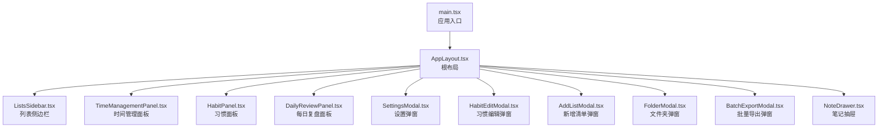
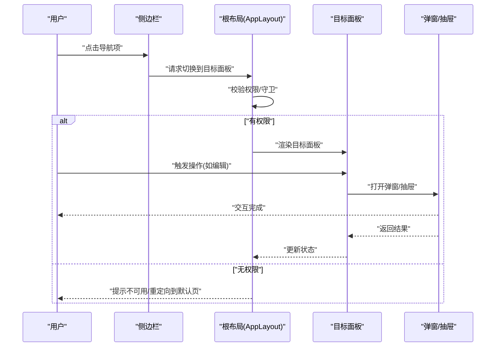
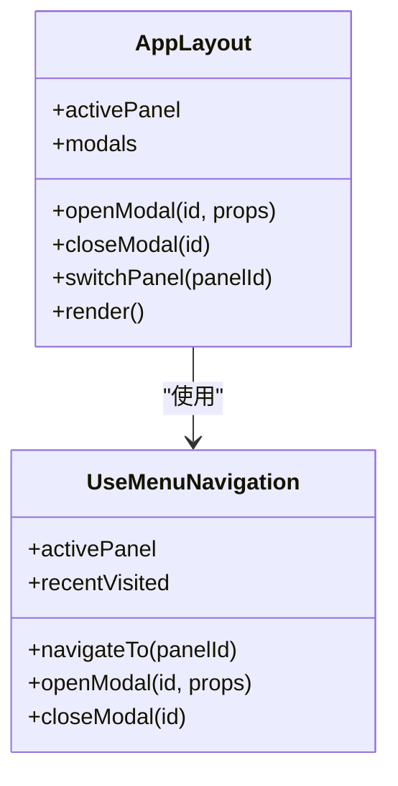
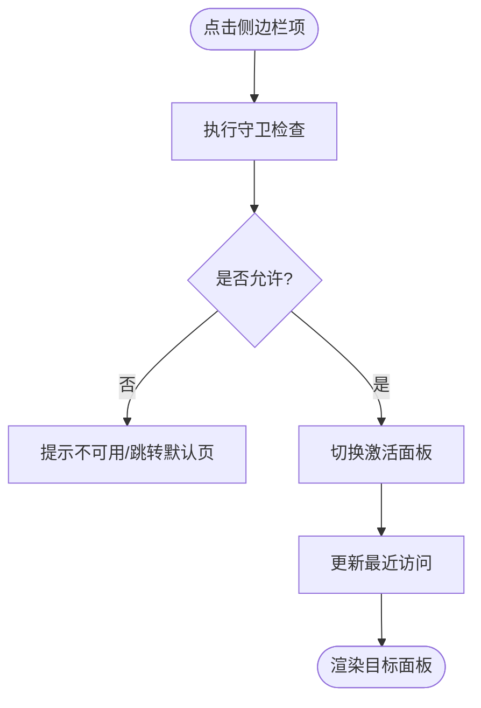
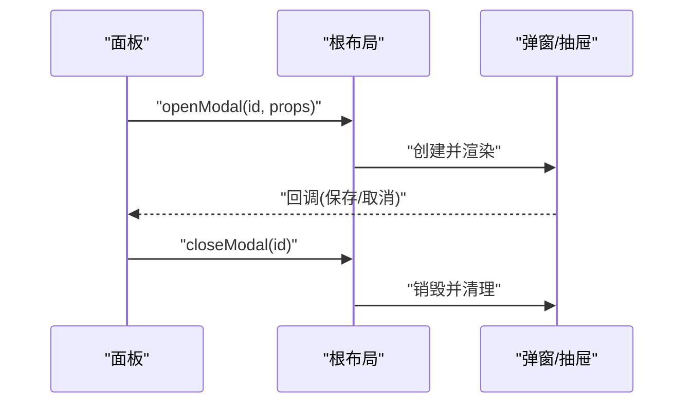
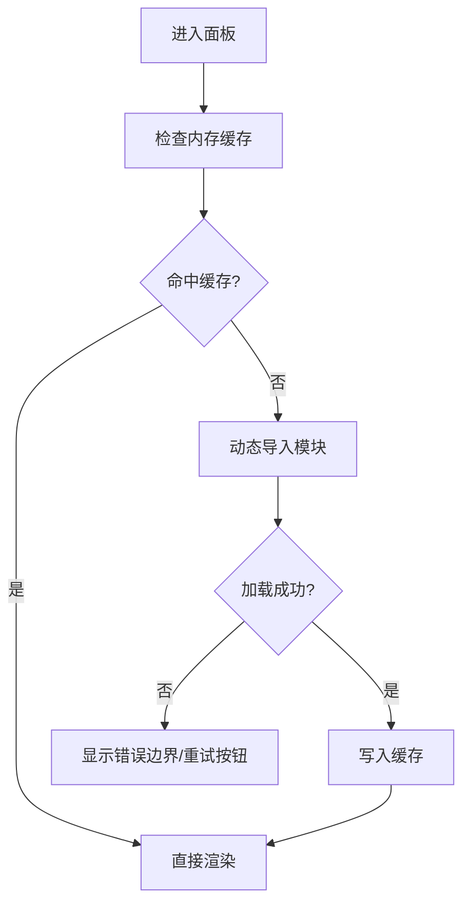
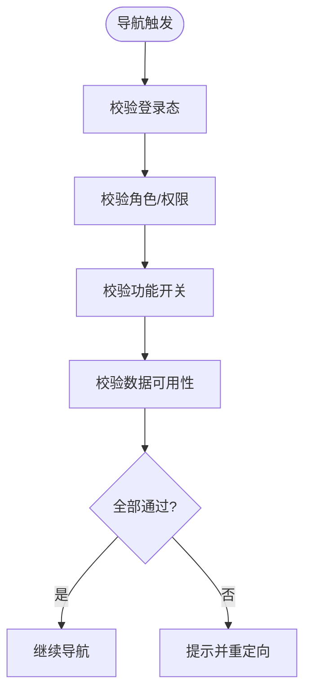
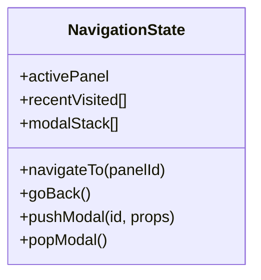
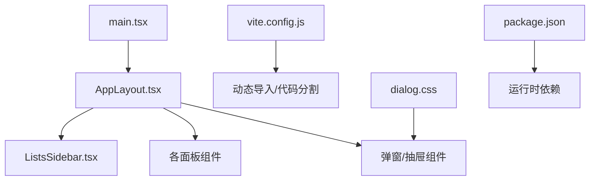

# 路由导航

<cite>
**本文引用的文件**   
- [src/main.tsx](file://src/main.tsx)
- [src/components/layout/AppLayout.tsx](file://src/components/layout/AppLayout.tsx)
- [src/hooks/use-menu-navigation.ts](file://src/hooks/use-menu-navigation.ts)
- [src/features/lists/ListsSidebar.tsx](file://src/features/lists/ListsSidebar.tsx)
- [src/features/habits/HabitPanel.tsx](file://src/features/habits/HabitPanel.tsx)
- [src/features/time-management/TimeManagementPanel.tsx](file://src/features/time-management/TimeManagementPanel.tsx)
- [src/features/daily-review/DailyReviewPanel.tsx](file://src/features/daily-review/DailyReviewPanel.tsx)
- [src/features/settings/SettingsModal.tsx](file://src/features/settings/SettingsModal.tsx)
- [src/features/habits/components/HabitEditModal.tsx](file://src/features/habits/components/HabitEditModal.tsx)
- [src/features/lists/AddListModal.tsx](file://src/features/lists/AddListModal.tsx)
- [src/features/lists/FolderModal.tsx](file://src/features/lists/FolderModal.tsx)
- [src/features/lists/BatchExportModal.tsx](file://src/features/lists/BatchExportModal.tsx)
- [src/features/lists/NoteDrawer.tsx](file://src/features/lists/NoteDrawer.tsx)
- [src/styles/dialog.css](file://src/styles/dialog.css)
- [vite.config.js](file://vite.config.js)
- [package.json](file://package.json)
</cite>

## 目录
1. [简介](#简介)
2. [项目结构](#项目结构)
3. [核心组件](#核心组件)
4. [架构总览](#架构总览)
5. [详细组件分析](#详细组件分析)
6. [依赖分析](#依赖分析)
7. [性能考虑](#性能考虑)
8. [故障排查指南](#故障排查指南)
9. [结论](#结论)
10. [附录](#附录)

## 简介
本文件聚焦 FishWorker 的前端“路由导航”体系，围绕应用主入口、基于模态框与面板的导航模式（侧边栏菜单与弹窗）、页面级组件的动态加载与懒加载策略、导航守卫与权限控制机制、导航状态管理与历史记录处理、性能优化与用户体验改进，以及测试与调试方法进行全面说明。由于本项目未引入传统浏览器路由库，导航以“面板切换 + 模态框/抽屉”为主，配合轻量 Hook 管理当前激活项与交互状态，形成一套轻量、可组合、可扩展的导航方案。

## 项目结构
- 应用主入口负责挂载根布局与全局样式，并初始化首屏可见功能模块。
- 根布局 AppLayout 提供统一容器与区域划分，承载侧边栏、主内容区与全局弹窗层。
- 各业务特性以“面板”形式组织，通过统一的导航 Hook 进行激活与切换。
- 弹窗与抽屉作为次级导航载体，覆盖在面板之上，用于编辑、确认、批量操作等场景。
- 构建配置与包管理文件定义了开发/生产环境下的资源加载与打包行为，为懒加载与按需加载提供基础能力。

图表来源
- [src/main.tsx](file://src/main.tsx)
- [src/components/layout/AppLayout.tsx](file://src/components/layout/AppLayout.tsx)
- [src/features/lists/ListsSidebar.tsx](file://src/features/lists/ListsSidebar.tsx)
- [src/features/time-management/TimeManagementPanel.tsx](file://src/features/time-management/TimeManagementPanel.tsx)
- [src/features/habits/HabitPanel.tsx](file://src/features/habits/HabitPanel.tsx)
- [src/features/daily-review/DailyReviewPanel.tsx](file://src/features/daily-review/DailyReviewPanel.tsx)
- [src/features/settings/SettingsModal.tsx](file://src/features/settings/SettingsModal.tsx)
- [src/features/habits/components/HabitEditModal.tsx](file://src/features/habits/components/HabitEditModal.tsx)
- [src/features/lists/AddListModal.tsx](file://src/features/lists/AddListModal.tsx)
- [src/features/lists/FolderModal.tsx](file://src/features/lists/FolderModal.tsx)
- [src/features/lists/BatchExportModal.tsx](file://src/features/lists/BatchExportModal.tsx)
- [src/features/lists/NoteDrawer.tsx](file://src/features/lists/NoteDrawer.tsx)

章节来源
- [src/main.tsx](file://src/main.tsx)
- [src/components/layout/AppLayout.tsx](file://src/components/layout/AppLayout.tsx)
- [vite.config.js](file://vite.config.js)
- [package.json](file://package.json)

## 核心组件
- 应用入口 main.tsx：完成 React 根节点挂载、全局样式注入与首屏渲染。
- 根布局 AppLayout.tsx：定义应用外壳，包含侧边栏、主内容区与全局弹窗容器；维护当前激活的面板与弹窗状态。
- 导航 Hook use-menu-navigation.ts：封装“激活项切换、关闭弹窗、记录最近访问”等通用导航逻辑，供侧边栏与面板复用。
- 侧边栏 ListsSidebar.tsx：展示一级导航项，点击后触发面板切换或打开对应弹窗。
- 面板组件（时间管理、习惯、每日复盘）：各自负责领域内数据与交互，被侧边栏激活后渲染在主内容区。
- 弹窗与抽屉（设置、习惯编辑、新增清单、文件夹、批量导出、笔记抽屉）：作为二级导航载体，覆盖于面板之上，支持遮罩、ESC 关闭、焦点管理等。

章节来源
- [src/main.tsx](file://src/main.tsx)
- [src/components/layout/AppLayout.tsx](file://src/components/layout/AppLayout.tsx)
- [src/hooks/use-menu-navigation.ts](file://src/hooks/use-menu-navigation.ts)
- [src/features/lists/ListsSidebar.tsx](file://src/features/lists/ListsSidebar.tsx)
- [src/features/time-management/TimeManagementPanel.tsx](file://src/features/time-management/TimeManagementPanel.tsx)
- [src/features/habits/HabitPanel.tsx](file://src/features/habits/HabitPanel.tsx)
- [src/features/daily-review/DailyReviewPanel.tsx](file://src/features/daily-review/DailyReviewPanel.tsx)
- [src/features/settings/SettingsModal.tsx](file://src/features/settings/SettingsModal.tsx)
- [src/features/habits/components/HabitEditModal.tsx](file://src/features/habits/components/HabitEditModal.tsx)
- [src/features/lists/AddListModal.tsx](file://src/features/lists/AddListModal.tsx)
- [src/features/lists/FolderModal.tsx](file://src/features/lists/FolderModal.tsx)
- [src/features/lists/BatchExportModal.tsx](file://src/features/lists/BatchExportModal.tsx)
- [src/features/lists/NoteDrawer.tsx](file://src/features/lists/NoteDrawer.tsx)

## 架构总览
FishWorker 的导航采用“面板 + 弹窗/抽屉”的组合式架构：
- 一级导航：侧边栏选择目标面板，主内容区切换显示。
- 二级导航：在面板内部通过弹窗或抽屉执行编辑、确认、批量操作等任务。
- 状态管理：由根布局集中持有当前激活面板与弹窗集合，Hook 提供统一 API。
- 懒加载：借助 Vite 动态导入与条件渲染，仅在需要时加载大体积模块。
- 守卫与权限：在侧边栏与面板入口处进行最小化鉴权判断，阻止无权限跳转。

图表来源
- [src/features/lists/ListsSidebar.tsx](file://src/features/lists/ListsSidebar.tsx)
- [src/components/layout/AppLayout.tsx](file://src/components/layout/AppLayout.tsx)
- [src/features/time-management/TimeManagementPanel.tsx](file://src/features/time-management/TimeManagementPanel.tsx)
- [src/features/habits/HabitPanel.tsx](file://src/features/habits/HabitPanel.tsx)
- [src/features/daily-review/DailyReviewPanel.tsx](file://src/features/daily-review/DailyReviewPanel.tsx)
- [src/features/settings/SettingsModal.tsx](file://src/features/settings/SettingsModal.tsx)
- [src/features/habits/components/HabitEditModal.tsx](file://src/features/habits/components/HabitEditModal.tsx)
- [src/features/lists/AddListModal.tsx](file://src/features/lists/AddListModal.tsx)
- [src/features/lists/FolderModal.tsx](file://src/features/lists/FolderModal.tsx)
- [src/features/lists/BatchExportModal.tsx](file://src/features/lists/BatchExportModal.tsx)
- [src/features/lists/NoteDrawer.tsx](file://src/features/lists/NoteDrawer.tsx)

## 详细组件分析

### 应用入口与根布局
- 入口职责：挂载根节点、注入全局样式、启动应用。
- 根布局职责：
  - 维护当前激活面板与弹窗集合的状态。
  - 提供统一的导航 API（切换面板、打开/关闭弹窗）。
  - 承载全局弹窗容器，确保层级与遮罩一致。
  - 集成键盘事件（如 ESC 关闭弹窗）与焦点管理。

图表来源
- [src/components/layout/AppLayout.tsx](file://src/components/layout/AppLayout.tsx)
- [src/hooks/use-menu-navigation.ts](file://src/hooks/use-menu-navigation.ts)

章节来源
- [src/main.tsx](file://src/main.tsx)
- [src/components/layout/AppLayout.tsx](file://src/components/layout/AppLayout.tsx)
- [src/hooks/use-menu-navigation.ts](file://src/hooks/use-menu-navigation.ts)

### 侧边栏菜单与面板切换
- 侧边栏列出所有可用面板，点击后调用根布局提供的切换 API。
- 面板切换前执行守卫检查（如登录态、功能开关），失败则给出提示或跳转到默认面板。
- 支持最近访问记录，便于快速回到上次使用的面板。

图表来源
- [src/features/lists/ListsSidebar.tsx](file://src/features/lists/ListsSidebar.tsx)
- [src/components/layout/AppLayout.tsx](file://src/components/layout/AppLayout.tsx)
- [src/hooks/use-menu-navigation.ts](file://src/hooks/use-menu-navigation.ts)

章节来源
- [src/features/lists/ListsSidebar.tsx](file://src/features/lists/ListsSidebar.tsx)
- [src/components/layout/AppLayout.tsx](file://src/components/layout/AppLayout.tsx)
- [src/hooks/use-menu-navigation.ts](file://src/hooks/use-menu-navigation.ts)

### 弹窗与抽屉导航
- 弹窗用于短流程编辑、确认与参数输入；抽屉用于较长表单或详情查看。
- 弹窗/抽屉的生命周期由根布局统一管理，支持多实例、遮罩、ESC 关闭与焦点恢复。
- 常见弹窗包括：设置、习惯编辑、新增清单、文件夹管理、批量导出等。

图表来源
- [src/features/settings/SettingsModal.tsx](file://src/features/settings/SettingsModal.tsx)
- [src/features/habits/components/HabitEditModal.tsx](file://src/features/habits/components/HabitEditModal.tsx)
- [src/features/lists/AddListModal.tsx](file://src/features/lists/AddListModal.tsx)
- [src/features/lists/FolderModal.tsx](file://src/features/lists/FolderModal.tsx)
- [src/features/lists/BatchExportModal.tsx](file://src/features/lists/BatchExportModal.tsx)
- [src/features/lists/NoteDrawer.tsx](file://src/features/lists/NoteDrawer.tsx)
- [src/components/layout/AppLayout.tsx](file://src/components/layout/AppLayout.tsx)

章节来源
- [src/features/settings/SettingsModal.tsx](file://src/features/settings/SettingsModal.tsx)
- [src/features/habits/components/HabitEditModal.tsx](file://src/features/habits/components/HabitEditModal.tsx)
- [src/features/lists/AddListModal.tsx](file://src/features/lists/AddListModal.tsx)
- [src/features/lists/FolderModal.tsx](file://src/features/lists/FolderModal.tsx)
- [src/features/lists/BatchExportModal.tsx](file://src/features/lists/BatchExportModal.tsx)
- [src/features/lists/NoteDrawer.tsx](file://src/features/lists/NoteDrawer.tsx)
- [src/components/layout/AppLayout.tsx](file://src/components/layout/AppLayout.tsx)

### 页面级组件的动态加载与懒加载策略
- 懒加载时机：面板首次激活时再动态导入，避免首屏过大。
- 预加载策略：对高频面板在空闲期进行预加载，提升二次进入速度。
- 错误边界：为每个懒加载面板包裹错误边界，捕获加载失败并回退到友好提示。
- 缓存策略：结合内存缓存与本地持久化，减少重复网络请求。

[此图为概念性流程图，不直接映射具体源码文件]

### 路由守卫与权限控制机制
- 守卫位置：侧边栏点击处与面板入口处双重校验。
- 校验维度：登录态、角色/权限、功能开关、数据可用性。
- 失败处理：提示不可用、跳转到默认面板或引导完成前置任务。
- 扩展方式：将权限规则抽象为中间件函数，按顺序执行，任一拒绝即中断。

[此图为概念性流程图，不直接映射具体源码文件]

### 导航状态管理与历史记录处理
- 状态模型：当前激活面板、最近访问列表、弹窗栈。
- 历史回溯：支持“返回上一个面板”，但不改变浏览器地址（SPA 内导航）。
- 状态同步：当面板内部状态变化时，通知父级更新 UI（如选中态、计数）。
- 持久化：可选地将最近访问与关键导航状态持久化，刷新后恢复体验。

[此图为概念性类图，不直接映射具体源码文件]

## 依赖分析
- 运行时依赖：React 生态（组件、Hooks、状态管理）。
- 构建依赖：Vite 提供动态导入、代码分割与资源优化。
- 样式依赖：全局样式与弹窗样式（dialog.css）影响弹窗层级与视觉一致性。
- 包管理：package.json 中声明了开发与运行所需依赖，便于复现与升级。

图表来源
- [src/main.tsx](file://src/main.tsx)
- [src/components/layout/AppLayout.tsx](file://src/components/layout/AppLayout.tsx)
- [src/features/lists/ListsSidebar.tsx](file://src/features/lists/ListsSidebar.tsx)
- [src/features/time-management/TimeManagementPanel.tsx](file://src/features/time-management/TimeManagementPanel.tsx)
- [src/features/habits/HabitPanel.tsx](file://src/features/habits/HabitPanel.tsx)
- [src/features/daily-review/DailyReviewPanel.tsx](file://src/features/daily-review/DailyReviewPanel.tsx)
- [src/features/settings/SettingsModal.tsx](file://src/features/settings/SettingsModal.tsx)
- [src/features/habits/components/HabitEditModal.tsx](file://src/features/habits/components/HabitEditModal.tsx)
- [src/features/lists/AddListModal.tsx](file://src/features/lists/AddListModal.tsx)
- [src/features/lists/FolderModal.tsx](file://src/features/lists/FolderModal.tsx)
- [src/features/lists/BatchExportModal.tsx](file://src/features/lists/BatchExportModal.tsx)
- [src/features/lists/NoteDrawer.tsx](file://src/features/lists/NoteDrawer.tsx)
- [src/styles/dialog.css](file://src/styles/dialog.css)
- [vite.config.js](file://vite.config.js)
- [package.json](file://package.json)

章节来源
- [vite.config.js](file://vite.config.js)
- [package.json](file://package.json)
- [src/styles/dialog.css](file://src/styles/dialog.css)

## 性能考虑
- 首屏优化：仅加载必要面板与样式，其余按需懒加载。
- 代码分割：按面板与弹窗维度拆分 chunk，减少单次下载体积。
- 预加载：对常用面板在空闲期预加载，缩短二次进入延迟。
- 缓存：内存缓存已加载模块，必要时结合本地存储持久化。
- 渲染优化：避免不必要的重渲染，使用稳定 key、memo 与受控状态最小化。
- 动画与过渡：合理使用 CSS 过渡，避免阻塞主线程。

[本节为通用指导，无需特定源码引用]

## 故障排查指南
- 导航无响应：检查侧边栏点击事件绑定与守卫逻辑是否抛出异常。
- 弹窗无法关闭：确认 ESC 事件监听与焦点管理是否正确释放。
- 懒加载失败：查看网络面板是否有 404/超时，确认动态导入路径与构建产物。
- 样式错乱：核对 dialog.css 与全局样式冲突，检查 z-index 层级。
- 状态不同步：定位面板与根布局之间的状态传递链路，打印关键状态变更。

章节来源
- [src/styles/dialog.css](file://src/styles/dialog.css)
- [src/components/layout/AppLayout.tsx](file://src/components/layout/AppLayout.tsx)
- [src/features/lists/ListsSidebar.tsx](file://src/features/lists/ListsSidebar.tsx)

## 结论
FishWorker 的导航系统以“面板 + 弹窗/抽屉”为核心，通过根布局集中管理状态与生命周期，配合轻量 Hook 提供一致的导航 API。该方案具备低耦合、易扩展、可观测的特点，适合桌面端工具型应用的交互范式。通过合理的懒加载、缓存与守卫机制，可在保证用户体验的同时维持良好的性能表现。

## 附录
- 测试建议：
  - 单元测试：对导航 Hook 与守卫函数进行断言，覆盖正常与异常分支。
  - 组件测试：模拟侧边栏点击与弹窗交互，验证状态变化与渲染结果。
  - 端到端测试：使用 Playwright/Cypress 模拟用户操作，验证导航流与权限拦截。
- 调试技巧：
  - 在导航关键点添加日志，输出当前面板、弹窗栈与最近访问。
  - 使用浏览器开发者工具的 Performance 面板分析懒加载与渲染耗时。
  - 针对弹窗问题，检查 DOM 层级与焦点管理，确认遮罩与事件冒泡。

[本节为通用指导，无需特定源码引用]