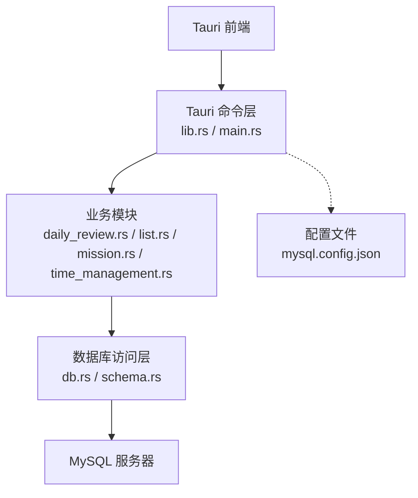
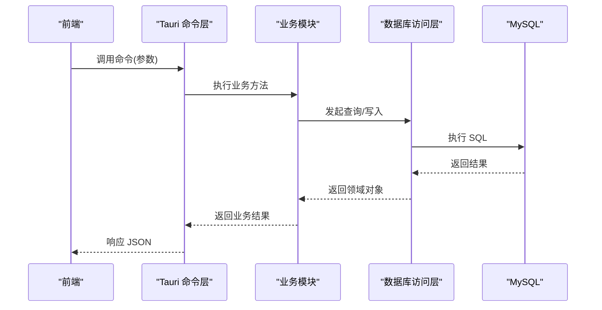
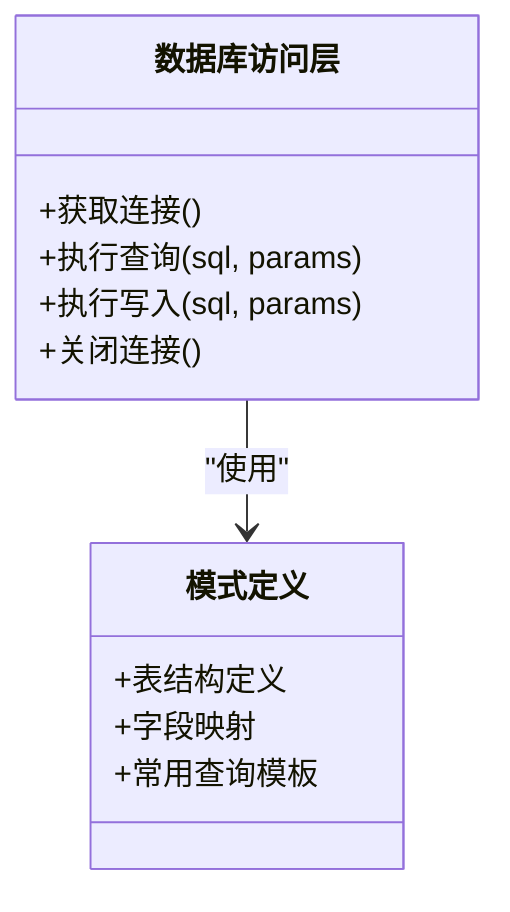
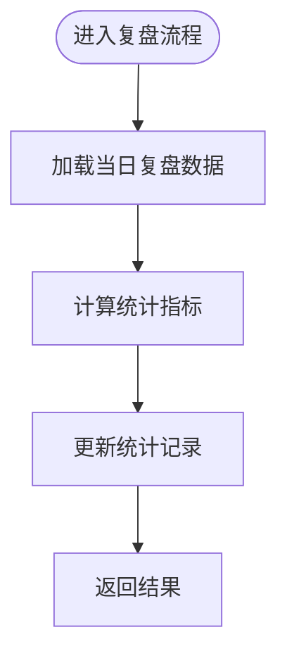
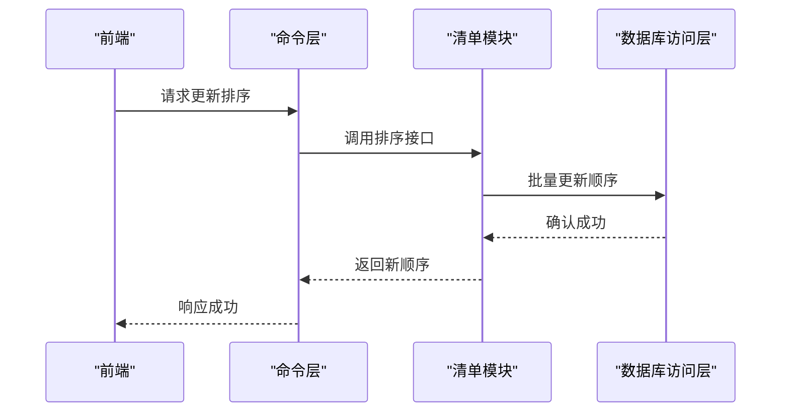
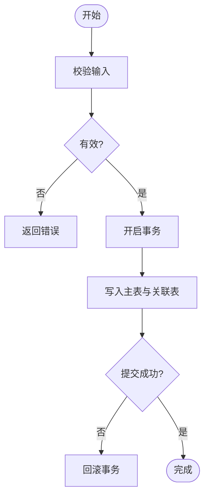
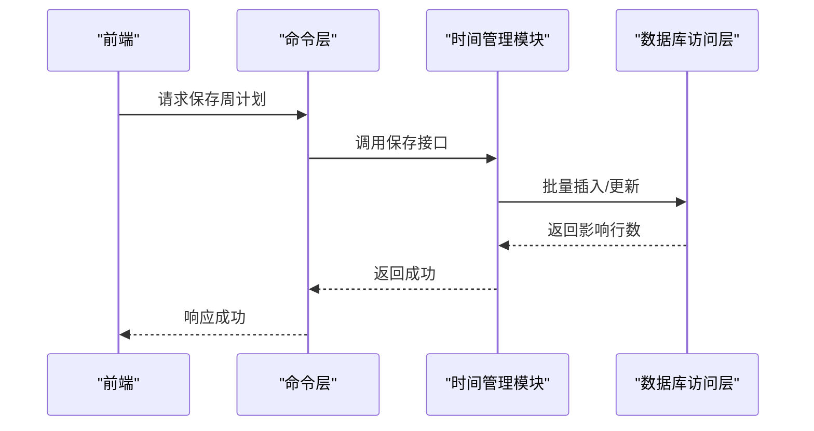
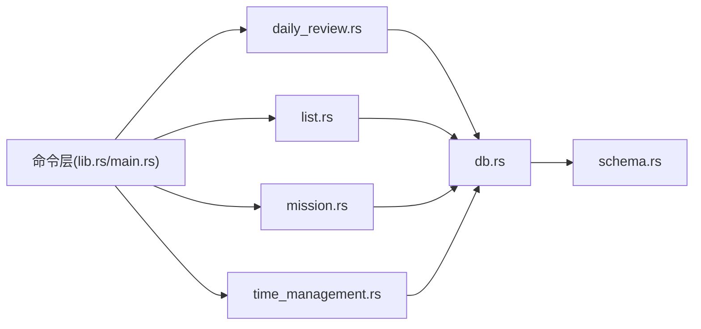

# Rust 后端模块

<cite>
**本文引用的文件**   
- [src-tauri/Cargo.toml](file://src-tauri/Cargo.toml)
- [src-tauri/src/main.rs](file://src-tauri/src/main.rs)
- [src-tauri/src/lib.rs](file://src-tauri/src/lib.rs)
- [src-tauri/src/db.rs](file://src-tauri/src/db.rs)
- [src-tauri/src/schema.rs](file://src-tauri/src/schema.rs)
- [src-tauri/src/daily_review.rs](file://src-tauri/src/daily_review.rs)
- [src-tauri/src/list.rs](file://src-tauri/src/list.rs)
- [src-tauri/src/mission.rs](file://src-tauri/src/mission.rs)
- [src-tauri/src/time_management.rs](file://src-tauri/src/time_management.rs)
- [src-tauri/mysql.config.json](file://src-tauri/mysql.config.json)
</cite>

## 目录
1. [简介](#简介)
2. [项目结构](#项目结构)
3. [核心组件](#核心组件)
4. [架构总览](#架构总览)
5. [详细组件分析](#详细组件分析)
6. [依赖关系分析](#依赖关系分析)
7. [性能考虑](#性能考虑)
8. [故障排查指南](#故障排查指南)
9. [结论](#结论)
10. [附录](#附录)

## 简介
本仓库采用 Tauri 作为桌面应用壳，Rust 作为后端服务层。Rust 后端通过 Tauri 命令暴露给前端调用，负责与 MySQL 数据库交互、业务逻辑处理以及数据模型定义。本文聚焦于 Rust 后端模块的架构设计、职责划分、接口契约、异步与并发策略、错误处理、日志调试、测试策略与性能监控等主题，帮助读者快速理解并高效扩展后端能力。

## 项目结构
Rust 后端位于 src-tauri 目录下，主要包含：
- 入口与装配：main.rs、lib.rs
- 数据库连接与配置：db.rs、schema.rs、mysql.config.json
- 业务模块（按领域划分）：daily_review.rs、list.rs、mission.rs、time_management.rs
- 构建与依赖：Cargo.toml、build.rs、tauri.conf.json

图表来源
- [src-tauri/src/lib.rs](file://src-tauri/src/lib.rs)
- [src-tauri/src/main.rs](file://src-tauri/src/main.rs)
- [src-tauri/src/db.rs](file://src-tauri/src/db.rs)
- [src-tauri/src/schema.rs](file://src-tauri/src/schema.rs)
- [src-tauri/src/daily_review.rs](file://src-tauri/src/daily_review.rs)
- [src-tauri/src/list.rs](file://src-tauri/src/list.rs)
- [src-tauri/src/mission.rs](file://src-tauri/src/mission.rs)
- [src-tauri/src/time_management.rs](file://src-tauri/src/time_management.rs)
- [src-tauri/mysql.config.json](file://src-tauri/mysql.config.json)

章节来源
- [src-tauri/Cargo.toml](file://src-tauri/Cargo.toml)
- [src-tauri/src/main.rs](file://src-tauri/src/main.rs)
- [src-tauri/src/lib.rs](file://src-tauri/src/lib.rs)
- [src-tauri/src/db.rs](file://src-tauri/src/db.rs)
- [src-tauri/src/schema.rs](file://src-tauri/src/schema.rs)
- [src-tauri/src/daily_review.rs](file://src-tauri/src/daily_review.rs)
- [src-tauri/src/list.rs](file://src-tauri/src/list.rs)
- [src-tauri/src/mission.rs](file://src-tauri/src/mission.rs)
- [src-tauri/src/time_management.rs](file://src-tauri/src/time_management.rs)
- [src-tauri/mysql.config.json](file://src-tauri/mysql.config.json)

## 核心组件
- 命令装配与注册
  - 负责将业务函数注册为 Tauri 命令，供前端调用。通常由 lib.rs 或 main.rs 完成命令注册与初始化。
- 数据库连接与配置
  - db.rs 提供连接池、查询封装；schema.rs 定义表结构与映射类型；mysql.config.json 提供连接参数。
- 业务模块
  - daily_review.rs：每日复盘相关的数据读写与聚合计算。
  - list.rs：清单/列表数据的增删改查与排序、分组等。
  - mission.rs：使命/目标管理相关的持久化与状态流转。
  - time_management.rs：时间管理任务、周计划、四象限等数据操作。
- 配置与构建
  - Cargo.toml 声明依赖（如 Tauri、数据库驱动、序列化库等）。
  - build.rs 用于代码生成或资源打包。
  - tauri.conf.json 控制 Tauri 行为与权限。

章节来源
- [src-tauri/src/lib.rs](file://src-tauri/src/lib.rs)
- [src-tauri/src/main.rs](file://src-tauri/src/main.rs)
- [src-tauri/src/db.rs](file://src-tauri/src/db.rs)
- [src-tauri/src/schema.rs](file://src-tauri/src/schema.rs)
- [src-tauri/src/daily_review.rs](file://src-tauri/src/daily_review.rs)
- [src-tauri/src/list.rs](file://src-tauri/src/list.rs)
- [src-tauri/src/mission.rs](file://src-tauri/src/mission.rs)
- [src-tauri/src/time_management.rs](file://src-tauri/src/time_management.rs)
- [src-tauri/Cargo.toml](file://src-tauri/Cargo.toml)
- [src-tauri/build.rs](file://src-tauri/build.rs)
- [src-tauri/mysql.config.json](file://src-tauri/mysql.config.json)

## 架构总览
整体采用“前端 UI -> Tauri 命令 -> 业务模块 -> 数据库”的分层架构。命令层仅做参数校验与路由转发，业务层专注领域逻辑，数据访问层统一封装 SQL 与模型映射。

图表来源
- [src-tauri/src/lib.rs](file://src-tauri/src/lib.rs)
- [src-tauri/src/daily_review.rs](file://src-tauri/src/daily_review.rs)
- [src-tauri/src/list.rs](file://src-tauri/src/list.rs)
- [src-tauri/src/mission.rs](file://src-tauri/src/mission.rs)
- [src-tauri/src/time_management.rs](file://src-tauri/src/time_management.rs)
- [src-tauri/src/db.rs](file://src-tauri/src/db.rs)
- [src-tauri/src/schema.rs](file://src-tauri/src/schema.rs)

## 详细组件分析

### 数据库访问层（db.rs / schema.rs）
- 职责
  - 建立与管理数据库连接池。
  - 提供统一的查询/写入 API。
  - 定义表结构映射与常用查询模板。
- 关键设计点
  - 连接池复用，避免频繁创建销毁连接。
  - 错误向上抛出，由上层统一处理。
  - 使用强类型模型减少字段错位风险。
- 复杂度与优化
  - 批量写入建议合并事务，降低 IO 次数。
  - 热点查询可引入内存缓存（注意一致性）。

图表来源
- [src-tauri/src/db.rs](file://src-tauri/src/db.rs)
- [src-tauri/src/schema.rs](file://src-tauri/src/schema.rs)

章节来源
- [src-tauri/src/db.rs](file://src-tauri/src/db.rs)
- [src-tauri/src/schema.rs](file://src-tauri/src/schema.rs)

### 每日复盘模块（daily_review.rs）
- 职责
  - 维护每日复盘记录、统计指标与历史趋势。
- 典型流程
  - 读取当日复盘 -> 计算汇总 -> 更新统计 -> 返回结果。

图表来源
- [src-tauri/src/daily_review.rs](file://src-tauri/src/daily_review.rs)
- [src-tauri/src/db.rs](file://src-tauri/src/db.rs)

章节来源
- [src-tauri/src/daily_review.rs](file://src-tauri/src/daily_review.rs)

### 清单模块（list.rs）
- 职责
  - 清单项的增删改查、拖拽排序、分组与批量操作。
- 并发与安全
  - 对共享状态进行必要的同步保护，避免竞态条件。
- 性能要点
  - 大列表分页加载与懒渲染配合后端分页查询。

图表来源
- [src-tauri/src/list.rs](file://src-tauri/src/list.rs)
- [src-tauri/src/db.rs](file://src-tauri/src/db.rs)

章节来源
- [src-tauri/src/list.rs](file://src-tauri/src/list.rs)

### 使命模块（mission.rs）
- 职责
  - 目标/使命的创建、编辑、归档与关联角色信息。
- 数据一致性
  - 涉及多表更新时使用事务保证一致性。

图表来源
- [src-tauri/src/mission.rs](file://src-tauri/src/mission.rs)
- [src-tauri/src/db.rs](file://src-tauri/src/db.rs)

章节来源
- [src-tauri/src/mission.rs](file://src-tauri/src/mission.rs)

### 时间管理模块（time_management.rs）
- 职责
  - 任务、日程、周计划与四象限视图的数据读写与聚合。
- 并发策略
  - 高并发场景下对写操作加锁或使用队列串行化。

图表来源
- [src-tauri/src/time_management.rs](file://src-tauri/src/time_management.rs)
- [src-tauri/src/db.rs](file://src-tauri/src/db.rs)

章节来源
- [src-tauri/src/time_management.rs](file://src-tauri/src/time_management.rs)

## 依赖关系分析
- 模块耦合
  - 业务模块依赖数据库访问层，不直接耦合具体驱动。
  - 命令层仅依赖业务模块，保持薄路由。
- 外部依赖
  - Tauri 运行时、MySQL 驱动、JSON 序列化库等。
- 潜在循环依赖
  - 当前按领域拆分，未见明显循环引用；若新增跨域聚合需抽象为公共服务。

图表来源
- [src-tauri/src/lib.rs](file://src-tauri/src/lib.rs)
- [src-tauri/src/main.rs](file://src-tauri/src/main.rs)
- [src-tauri/src/daily_review.rs](file://src-tauri/src/daily_review.rs)
- [src-tauri/src/list.rs](file://src-tauri/src/list.rs)
- [src-tauri/src/mission.rs](file://src-tauri/src/mission.rs)
- [src-tauri/src/time_management.rs](file://src-tauri/src/time_management.rs)
- [src-tauri/src/db.rs](file://src-tauri/src/db.rs)
- [src-tauri/src/schema.rs](file://src-tauri/src/schema.rs)

章节来源
- [src-tauri/src/lib.rs](file://src-tauri/src/lib.rs)
- [src-tauri/src/main.rs](file://src-tauri/src/main.rs)
- [src-tauri/src/db.rs](file://src-tauri/src/db.rs)
- [src-tauri/src/schema.rs](file://src-tauri/src/schema.rs)

## 性能考虑
- 连接池与批处理
  - 复用连接池，批量写入使用事务合并，减少往返开销。
- 索引与查询优化
  - 针对高频过滤字段建立索引，避免全表扫描。
- 异步与并发
  - 使用异步 I/O 提升吞吐；对共享状态进行细粒度同步。
- 缓存策略
  - 对只读且变化不频繁的数据引入本地缓存，设置合理过期策略。
- 资源管理
  - 及时释放连接与句柄，避免泄漏；限制最大并发数防止雪崩。

## 故障排查指南
- 常见问题定位
  - 连接失败：检查 mysql.config.json 配置与网络连通性。
  - 查询超时：查看慢查询日志与索引命中情况。
  - 数据不一致：核对事务边界与幂等性设计。
- 日志与调试
  - 在关键路径输出结构化日志（含上下文 ID、耗时、SQL 摘要）。
  - 为每个命令添加唯一追踪 ID，便于前后端联调。
- 错误处理建议
  - 定义统一错误类型，区分客户端错误、服务端错误与系统错误。
  - 对外返回稳定 JSON 结构，内部保留详细堆栈。

章节来源
- [src-tauri/mysql.config.json](file://src-tauri/mysql.config.json)
- [src-tauri/src/db.rs](file://src-tauri/src/db.rs)

## 结论
该 Rust 后端以清晰的层次划分和领域模块化组织，结合 Tauri 命令层实现前后端解耦。通过统一的数据库访问层与强类型模型，提升了可维护性与稳定性。建议在后续迭代中完善统一错误体系、结构化日志与性能埋点，并逐步补充单元测试与集成测试覆盖。

## 附录

### 异步编程与并发策略
- 使用异步 I/O 处理数据库与文件系统操作，避免阻塞事件循环。
- 对共享可变状态使用原子或互斥锁保护，必要时引入消息队列串行化写操作。
- 对长时间运行的任务采用后台任务与取消令牌，支持优雅退出。

### 错误类型与统一处理方案
- 建议分层错误类型：
  - 业务错误：参数非法、状态冲突等。
  - 数据错误：连接失败、约束违反等。
  - 系统错误：资源不足、超时等。
- 统一响应格式：
  - 包含 code、message、data、trace_id 等字段，便于前端展示与问题追踪。

### 日志与调试
- 分级日志：debug/info/warn/error，生产环境默认 info 及以上。
- 结构化日志：包含请求 ID、用户标识、耗时、SQL 摘要等。
- 调试开关：通过环境变量控制详细日志输出。

### 测试策略与单元测试编写指导
- 单元测试
  - 对纯函数与无副作用逻辑进行单测，覆盖边界与异常分支。
- 集成测试
  - 使用内存数据库或测试容器启动真实 MySQL，验证端到端流程。
- 模拟与隔离
  - 对数据库访问层提供 Mock 接口，便于快速断言。
- 覆盖率与质量门禁
  - 设定最低覆盖率阈值，CI 中自动运行测试与 lint。

### 性能监控与资源管理最佳实践
- 指标采集
  - QPS、P95/P99 延迟、错误率、连接池使用率、GC 频率。
- 告警规则
  - 错误率突增、慢查询比例过高、连接池耗尽等触发告警。
- 资源上限
  - 限制最大并发、队列长度与内存占用，防止雪崩。
- 压测与回归
  - 定期压测关键路径，回归性能基线。