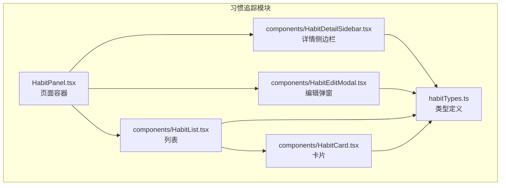
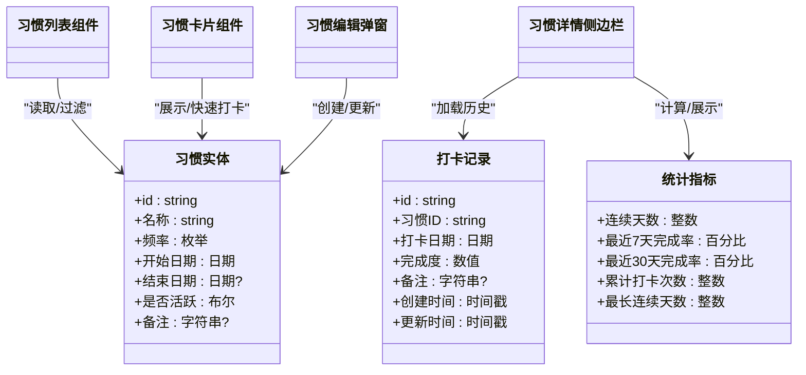
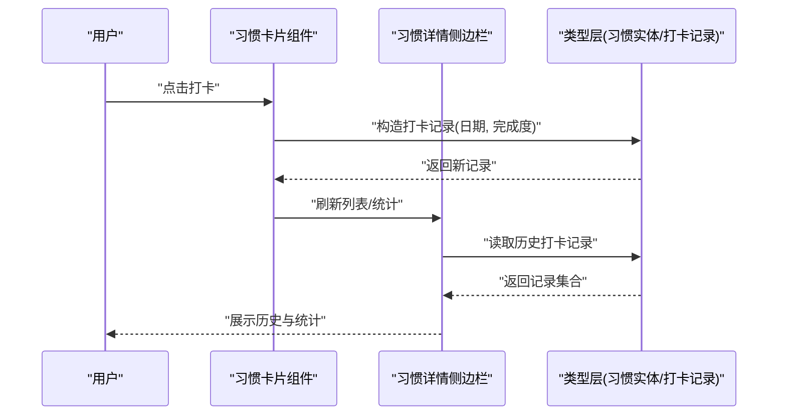
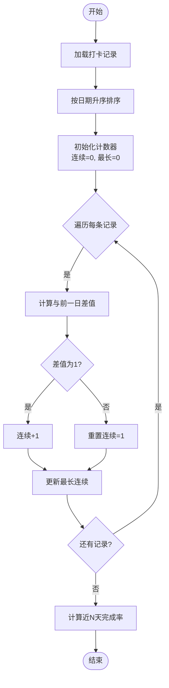
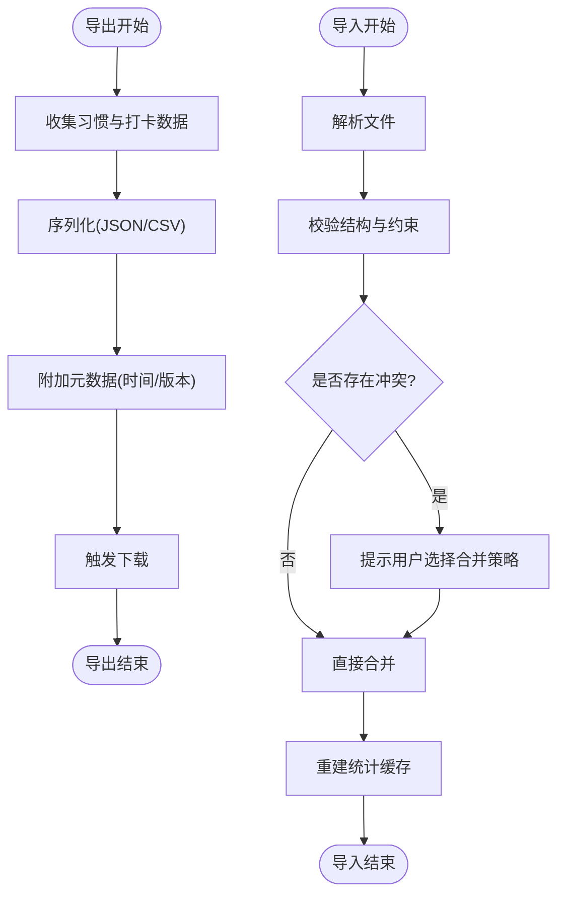
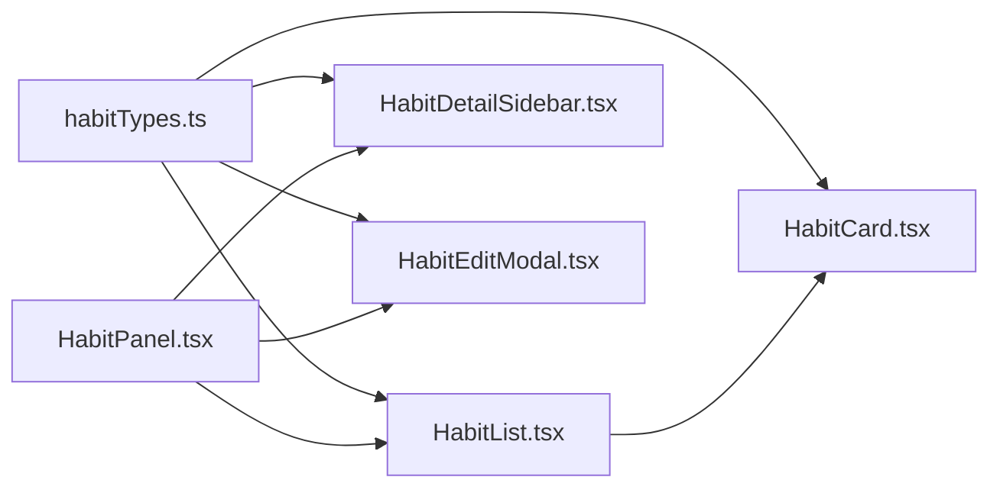

# 习惯追踪模块

<cite>
**本文引用的文件**   
- [habitTypes.ts](file://src/features/habits/habitTypes.ts)
- [HabitPanel.tsx](file://src/features/habits/HabitPanel.tsx)
- [HabitCard.tsx](file://src/features/habits/components/HabitCard.tsx)
- [HabitDetailSidebar.tsx](file://src/features/habits/components/HabitDetailSidebar.tsx)
- [HabitEditModal.tsx](file://src/features/habits/components/HabitEditModal.tsx)
- [HabitList.tsx](file://src/features/habits/components/HabitList.tsx)
- [habit_tracker.html](file://habit_tracker (1).html)
</cite>

## 目录
1. [简介](#简介)
2. [项目结构](#项目结构)
3. [核心组件](#核心组件)
4. [架构总览](#架构总览)
5. [详细组件分析](#详细组件分析)
6. [依赖分析](#依赖分析)
7. [性能考虑](#性能考虑)
8. [故障排查指南](#故障排查指南)
9. [结论](#结论)
10. [附录](#附录)

## 简介
本技术文档聚焦“习惯追踪模块”，围绕以下目标展开：
- 解释习惯实体的数据模型设计与字段约束
- 描述习惯打卡记录的存储结构与查询优化策略
- 记录进度跟踪算法与统计计算方法
- 说明历史记录的数据持久化与版本管理方案
- 明确数据验证规则与业务逻辑约束
- 提供数据导出与导入功能的实现细节

该模块采用前端 TypeScript/React 实现，UI 位于 features/habits 目录；当前仓库未包含后端 Rust 服务中关于习惯的专用实现，因此本文档以现有前端代码为依据进行梳理与扩展建议。

## 项目结构
习惯追踪模块的前端代码集中在 src/features/habits 下，主要包含类型定义、面板入口与若干 UI 子组件：
- habitTypes.ts：定义习惯实体、打卡记录、统计结果等核心类型
- HabitPanel.tsx：页面级容器，组合列表、详情、编辑弹窗等
- components/HabitList.tsx：习惯列表渲染与交互
- components/HabitCard.tsx：单条习惯卡片展示与快捷操作
- components/HabitDetailSidebar.tsx：习惯详情侧边栏（含打卡、统计等）
- components/HabitEditModal.tsx：新增/编辑习惯的弹窗表单

图表来源
- [habitTypes.ts](file://src/features/habits/habitTypes.ts)
- [HabitPanel.tsx](file://src/features/habits/HabitPanel.tsx)
- [HabitList.tsx](file://src/features/habits/components/HabitList.tsx)
- [HabitCard.tsx](file://src/features/habits/components/HabitCard.tsx)
- [HabitDetailSidebar.tsx](file://src/features/habits/components/HabitDetailSidebar.tsx)
- [HabitEditModal.tsx](file://src/features/habits/components/HabitEditModal.tsx)

章节来源
- [habitTypes.ts](file://src/features/habits/habitTypes.ts)
- [HabitPanel.tsx](file://src/features/habits/HabitPanel.tsx)
- [HabitList.tsx](file://src/features/habits/components/HabitList.tsx)
- [HabitCard.tsx](file://src/features/habits/components/HabitCard.tsx)
- [HabitDetailSidebar.tsx](file://src/features/habits/components/HabitDetailSidebar.tsx)
- [HabitEditModal.tsx](file://src/features/habits/components/HabitEditModal.tsx)

## 核心组件
- 类型层（habitTypes.ts）
  - 定义习惯实体、打卡记录、统计指标等数据结构，作为前后端契约与本地状态的基础
  - 通过类型约束保证字段完整性与取值范围，减少运行时错误
- 页面容器（HabitPanel.tsx）
  - 负责组合列表、详情、编辑弹窗，协调用户交互与数据流
- 列表与卡片（HabitList.tsx、HabitCard.tsx）
  - 列表负责批量渲染与筛选排序；卡片负责单条习惯的快速打卡与状态展示
- 详情侧边栏（HabitDetailSidebar.tsx）
  - 展示历史打卡、统计概览、趋势图（若集成可视化库）
- 编辑弹窗（HabitEditModal.tsx）
  - 承载新增/编辑习惯的表单，执行输入校验与提交

章节来源
- [habitTypes.ts](file://src/features/habits/habitTypes.ts)
- [HabitPanel.tsx](file://src/features/habits/HabitPanel.tsx)
- [HabitList.tsx](file://src/features/habits/components/HabitList.tsx)
- [HabitCard.tsx](file://src/features/habits/components/HabitCard.tsx)
- [HabitDetailSidebar.tsx](file://src/features/habits/components/HabitDetailSidebar.tsx)
- [HabitEditModal.tsx](file://src/features/habits/components/HabitEditModal.tsx)

## 架构总览
从职责划分看，模块遵循“类型驱动 + 组件组合”的前端分层：
- 类型层：集中定义领域模型与校验规则
- 视图层：列表、卡片、详情、编辑弹窗各司其职
- 交互层：由页面容器编排事件与状态更新

图表来源
- [habitTypes.ts](file://src/features/habits/habitTypes.ts)
- [HabitList.tsx](file://src/features/habits/components/HabitList.tsx)
- [HabitCard.tsx](file://src/features/habits/components/HabitCard.tsx)
- [HabitDetailSidebar.tsx](file://src/features/habits/components/HabitDetailSidebar.tsx)
- [HabitEditModal.tsx](file://src/features/habits/components/HabitEditModal.tsx)

## 详细组件分析

### 数据模型与字段约束（habitTypes.ts）
- 习惯实体
  - 关键字段：唯一标识、名称、频率（如每日/每周）、起止日期、活跃状态、备注
  - 约束建议：名称非空且长度限制；频率为有限枚举；起止日期需满足开始不晚于结束；活跃状态控制可见性与打卡可用性
- 打卡记录
  - 关键字段：唯一标识、关联习惯ID、打卡日期、完成度（0~1或百分比）、备注、创建/更新时间
  - 约束建议：打卡日期去重（同一天同一习惯仅一条记录）；完成度在有效区间内；时间戳用于审计与排序
- 统计指标
  - 关键字段：连续天数、近7/30天完成率、累计打卡次数、最长连续天数
  - 计算依据：基于打卡记录的时间序列与阈值判定

章节来源
- [habitTypes.ts](file://src/features/habits/habitTypes.ts)

### 打卡流程与交互（HabitCard.tsx、HabitDetailSidebar.tsx）
- 快速打卡
  - 用户在卡片上触发打卡动作，系统根据当前日期生成打卡记录并更新本地状态
  - 若当日已有记录，则更新完成度或备注
- 详情查看
  - 打开详情侧边栏后，加载该习惯的历史打卡记录，并按日期倒序排列
  - 同时计算并展示统计指标

图表来源
- [HabitCard.tsx](file://src/features/habits/components/HabitCard.tsx)
- [HabitDetailSidebar.tsx](file://src/features/habits/components/HabitDetailSidebar.tsx)
- [habitTypes.ts](file://src/features/habits/habitTypes.ts)

章节来源
- [HabitCard.tsx](file://src/features/habits/components/HabitCard.tsx)
- [HabitDetailSidebar.tsx](file://src/features/habits/components/HabitDetailSidebar.tsx)
- [habitTypes.ts](file://src/features/habits/habitTypes.ts)

### 进度跟踪算法与统计计算
- 连续天数
  - 将打卡记录按日期排序，遍历判断相邻日期是否连续，维护最大连续计数
- 完成率
  - 近N天完成率 = 实际打卡天数 / N（按自然日或工作日口径可配置）
- 累计打卡次数
  - 对打卡记录计数
- 最长连续天数
  - 在遍历过程中记录历史最大连续值

图表来源
- [habitTypes.ts](file://src/features/habits/habitTypes.ts)
- [HabitDetailSidebar.tsx](file://src/features/habits/components/HabitDetailSidebar.tsx)

章节来源
- [habitTypes.ts](file://src/features/habits/habitTypes.ts)
- [HabitDetailSidebar.tsx](file://src/features/habits/components/HabitDetailSidebar.tsx)

### 历史记录的数据持久化与版本管理
- 持久化策略
  - 当前仓库未见习惯相关的后端 Rust 实现，建议在前端使用浏览器本地存储（如 IndexedDB 或 localStorage）缓存习惯与打卡记录
  - 为提升可扩展性，可在本地引入轻量数据库（如 SQLite/WASM）或同步到远端服务
- 版本管理
  - 为习惯实体与打卡记录增加版本号字段，变更时递增
  - 合并冲突时采用“最后写入优先”或“增量合并”策略
  - 导出/导入时携带版本信息，便于跨设备迁移与回滚

章节来源
- [habitTypes.ts](file://src/features/habits/habitTypes.ts)

### 数据验证规则与业务逻辑约束
- 基本校验
  - 名称非空、长度上限
  - 频率为合法枚举值
  - 起止日期合法性（开始 ≤ 结束）
  - 完成度在有效区间内
- 业务约束
  - 同一天同一习惯仅允许一条打卡记录（覆盖更新时需保留审计时间戳）
  - 已归档/停止的习惯禁止新增打卡
  - 删除习惯前需确认存在关联打卡记录的处理策略（级联删除或软删除）

章节来源
- [habitTypes.ts](file://src/features/habits/habitTypes.ts)
- [HabitEditModal.tsx](file://src/features/habits/components/HabitEditModal.tsx)

### 数据导出与导入功能
- 导出
  - 将习惯实体与打卡记录序列化为 JSON/CSV
  - 包含元数据：导出时间、数据版本、应用版本
- 导入
  - 解析外部文件，校验结构与字段约束
  - 冲突处理：按 ID 合并或提示用户选择策略
  - 导入完成后重建索引与统计缓存

[此图为概念流程图，无需图表来源]

章节来源
- [habitTypes.ts](file://src/features/habits/habitTypes.ts)

## 依赖分析
- 组件耦合
  - HabitPanel 聚合多个子组件，属于高内聚低耦合的编排者
  - HabitList 与 HabitCard 强依赖 habitTypes 的类型定义
  - HabitDetailSidebar 与 HabitEditModal 均依赖 habitTypes 进行读写与校验
- 外部依赖
  - 当前未见习惯模块对外部服务的直接调用，建议后续通过统一的服务抽象层接入后端 API 或本地存储引擎

图表来源
- [habitTypes.ts](file://src/features/habits/habitTypes.ts)
- [HabitPanel.tsx](file://src/features/habits/HabitPanel.tsx)
- [HabitList.tsx](file://src/features/habits/components/HabitList.tsx)
- [HabitCard.tsx](file://src/features/habits/components/HabitCard.tsx)
- [HabitDetailSidebar.tsx](file://src/features/habits/components/HabitDetailSidebar.tsx)
- [HabitEditModal.tsx](file://src/features/habits/components/HabitEditModal.tsx)

章节来源
- [habitTypes.ts](file://src/features/habits/habitTypes.ts)
- [HabitPanel.tsx](file://src/features/habits/HabitPanel.tsx)
- [HabitList.tsx](file://src/features/habits/components/HabitList.tsx)
- [HabitCard.tsx](file://src/features/habits/components/HabitCard.tsx)
- [HabitDetailSidebar.tsx](file://src/features/habits/components/HabitDetailSidebar.tsx)
- [HabitEditModal.tsx](file://src/features/habits/components/HabitEditModal.tsx)

## 性能考虑
- 大数据量下的列表渲染
  - 使用虚拟滚动或分页加载，避免一次性渲染过多条目
- 统计计算优化
  - 对打卡记录建立日期索引，减少重复扫描
  - 增量更新统计缓存，仅在新增/修改打卡后局部重算
- 存储访问
  - 批量写入时使用事务，减少 I/O 开销
  - 定期清理过期或冗余数据

[本节为通用指导，无需章节来源]

## 故障排查指南
- 常见问题
  - 打卡失败：检查日期格式、完成度范围、同一天重复打卡策略
  - 统计异常：核对排序与连续性判断逻辑，确认边界日期处理
  - 导入失败：校验文件结构与必填字段，确认版本兼容
- 定位方法
  - 在关键路径添加日志输出（如打卡创建、统计计算、导入解析）
  - 使用浏览器开发者工具监控本地存储与网络请求（若接入后端）

[本节为通用指导，无需章节来源]

## 结论
本模块以类型驱动为核心，结合清晰的组件分工，实现了习惯管理与打卡的基本能力。建议在后续迭代中完善持久化与版本管理，增强统计计算的准确性与性能，并提供稳定的导入导出能力，以提升用户体验与数据可移植性。

[本节为总结，无需章节来源]

## 附录
- 参考原型页面
  - habit_tracker.html：可作为界面与交互设计的参考

章节来源
- [habit_tracker.html](file://habit_tracker (1).html)