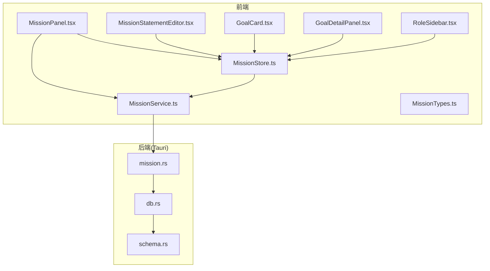
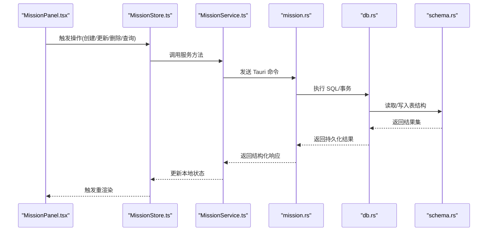
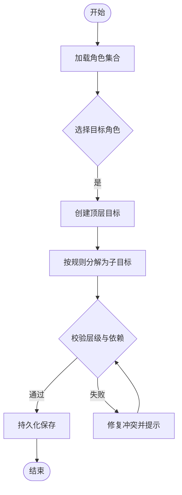
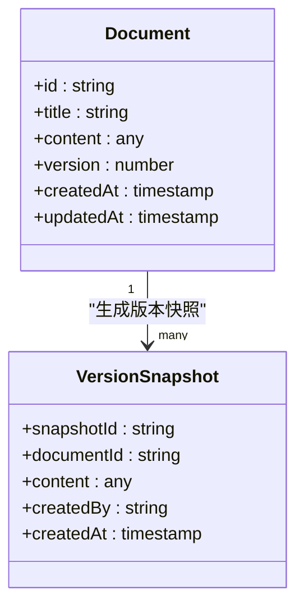
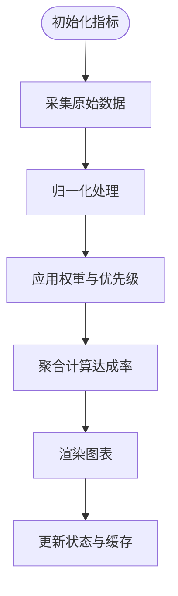
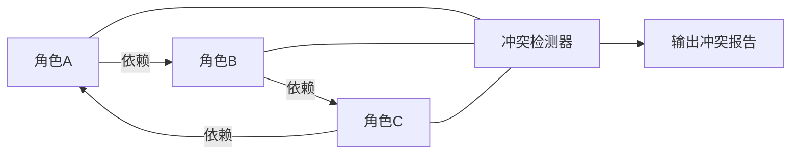
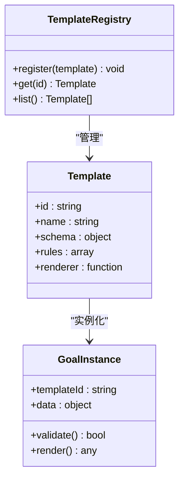
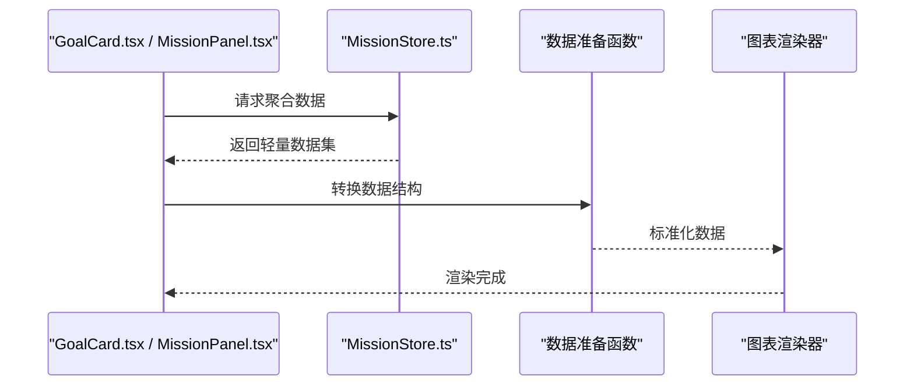
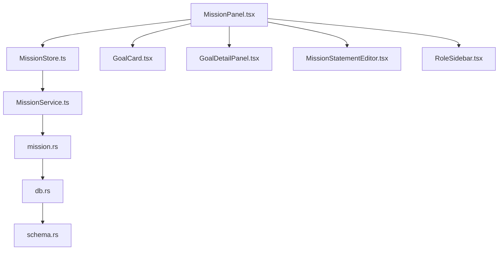

# 使命声明模块

<cite>
**本文引用的文件**   
- [MissionPanel.tsx](file://src/features/mission/MissionPanel.tsx)
- [MissionStore.ts](file://src/features/mission/MissionStore.ts)
- [MissionTypes.ts](file://src/features/mission/MissionTypes.ts)
- [MissionService.ts](file://src/features/mission/MissionService.ts)
- [MissionStatementEditor.tsx](file://src/features/mission/MissionStatementEditor.tsx)
- [GoalCard.tsx](file://src/features/mission/GoalCard.tsx)
- [GoalDetailPanel.tsx](file://src/features/mission/GoalDetailPanel.tsx)
- [RoleSidebar.tsx](file://src/features/mission/RoleSidebar.tsx)
- [MissionStore.test.ts](file://src/features/mission/MissionStore.test.ts)
- [mission.rs](file://src-tauri/src/mission.rs)
- [db.rs](file://src-tauri/src/db.rs)
- [schema.rs](file://src-tauri/src/schema.rs)
</cite>

## 目录
1. [简介](#简介)
2. [项目结构](#项目结构)
3. [核心组件](#核心组件)
4. [架构总览](#架构总览)
5. [详细组件分析](#详细组件分析)
6. [依赖关系分析](#依赖关系分析)
7. [性能考虑](#性能考虑)
8. [故障排查指南](#故障排查指南)
9. [结论](#结论)
10. [附录](#附录)

## 简介
本技术文档聚焦“使命声明”模块，围绕以下目标展开：
- 角色驱动的目标分解算法与层次结构管理
- 富文本内容的存储格式与版本控制
- 目标进度量化指标与达成率计算
- 角色间依赖关系与冲突检测机制
- 目标模板系统的扩展架构
- 可视化图表的数据准备与渲染优化

该模块采用前端 React + Tauri 后端（Rust）的混合架构，通过服务层与持久化层解耦业务逻辑与数据访问，支持多角色、多层级目标的创建、编辑、追踪与可视化。

## 项目结构
使命声明模块位于 features/mission 目录下，包含 UI 组件、状态管理、服务层与类型定义；后端 Rust 侧提供数据库交互与持久化能力。

图示来源
- [MissionPanel.tsx](file://src/features/mission/MissionPanel.tsx)
- [MissionStore.ts](file://src/features/mission/MissionStore.ts)
- [MissionService.ts](file://src/features/mission/MissionService.ts)
- [MissionStatementEditor.tsx](file://src/features/mission/MissionStatementEditor.tsx)
- [GoalCard.tsx](file://src/features/mission/GoalCard.tsx)
- [GoalDetailPanel.tsx](file://src/features/mission/GoalDetailPanel.tsx)
- [RoleSidebar.tsx](file://src/features/mission/RoleSidebar.tsx)
- [MissionTypes.ts](file://src/features/mission/MissionTypes.ts)
- [mission.rs](file://src-tauri/src/mission.rs)
- [db.rs](file://src-tauri/src/db.rs)
- [schema.rs](file://src-tauri/src/schema.rs)

章节来源
- [MissionPanel.tsx](file://src/features/mission/MissionPanel.tsx)
- [MissionStore.ts](file://src/features/mission/MissionStore.ts)
- [MissionService.ts](file://src/features/mission/MissionService.ts)
- [MissionTypes.ts](file://src/features/mission/MissionTypes.ts)
- [mission.rs](file://src-tauri/src/mission.rs)
- [db.rs](file://src-tauri/src/db.rs)
- [schema.rs](file://src-tauri/src/schema.rs)

## 核心组件
- 面板入口与编排：负责展示角色列表、目标树与编辑器，协调用户交互与状态更新。
- 状态管理：维护角色、目标、富文本内容、版本历史等全局状态，并提供增删改查与批量操作。
- 服务层：封装对后端的调用，处理序列化、错误重试与缓存策略。
- 编辑器：基于富文本编辑器实现使命声明与目标说明的编辑、预览与版本回滚。
- 卡片与详情：目标卡片展示关键指标与进度，详情页承载深度编辑与依赖配置。
- 角色侧边栏：按角色维度组织与筛选目标，支持角色切换与视图聚合。

章节来源
- [MissionPanel.tsx](file://src/features/mission/MissionPanel.tsx)
- [MissionStore.ts](file://src/features/mission/MissionStore.ts)
- [MissionService.ts](file://src/features/mission/MissionService.ts)
- [MissionStatementEditor.tsx](file://src/features/mission/MissionStatementEditor.tsx)
- [GoalCard.tsx](file://src/features/mission/GoalCard.tsx)
- [GoalDetailPanel.tsx](file://src/features/mission/GoalDetailPanel.tsx)
- [RoleSidebar.tsx](file://src/features/mission/RoleSidebar.tsx)

## 架构总览
整体采用“UI 组件 -> Store -> Service -> Tauri 命令 -> DB/Schema”的分层架构。Store 暴露响应式状态，Service 统一处理跨端通信与错误边界，Tauri 侧 mission.rs 暴露命令接口，db.rs 负责连接与事务，schema.rs 定义表结构与迁移。

图示来源
- [MissionPanel.tsx](file://src/features/mission/MissionPanel.tsx)
- [MissionStore.ts](file://src/features/mission/MissionStore.ts)
- [MissionService.ts](file://src/features/mission/MissionService.ts)
- [mission.rs](file://src-tauri/src/mission.rs)
- [db.rs](file://src-tauri/src/db.rs)
- [schema.rs](file://src-tauri/src/schema.rs)

## 详细组件分析

### 角色驱动的目标分解算法与层次结构管理
- 角色驱动：以角色为根节点组织目标树，每个角色可拥有多个一级目标，并可递归生成子目标，形成层级结构。
- 分解算法：从高层目标出发，依据角色职责与约束条件，将目标逐层拆解为可执行的子目标，直至满足粒度要求。
- 层次管理：提供层级插入、移动、合并与拆分操作，确保父子关系一致性与拓扑有序。

图示来源
- [MissionStore.ts](file://src/features/mission/MissionStore.ts)
- [MissionTypes.ts](file://src/features/mission/MissionTypes.ts)
- [RoleSidebar.tsx](file://src/features/mission/RoleSidebar.tsx)

章节来源
- [MissionStore.ts](file://src/features/mission/MissionStore.ts)
- [MissionTypes.ts](file://src/features/mission/MissionTypes.ts)
- [RoleSidebar.tsx](file://src/features/mission/RoleSidebar.tsx)

### 富文本内容的存储格式与版本控制
- 存储格式：富文本内容以结构化 JSON 或标准文档模型进行持久化，便于跨端传输与渲染。
- 版本控制：每次重要变更生成新版本快照，支持时间线回溯与差异对比。
- 同步策略：在编辑过程中采用增量提交与冲突合并策略，避免覆盖他人修改。

图示来源
- [MissionStatementEditor.tsx](file://src/features/mission/MissionStatementEditor.tsx)
- [MissionStore.ts](file://src/features/mission/MissionStore.ts)
- [MissionTypes.ts](file://src/features/mission/MissionTypes.ts)

章节来源
- [MissionStatementEditor.tsx](file://src/features/mission/MissionStatementEditor.tsx)
- [MissionStore.ts](file://src/features/mission/MissionStore.ts)
- [MissionTypes.ts](file://src/features/mission/MissionTypes.ts)

### 目标进度的量化指标与达成率计算
- 指标体系：包括完成度、权重、里程碑数量、实际产出与计划产出比值等。
- 达成率计算：综合各指标的加权得分，结合时间衰减与优先级系数得出最终达成率。
- 可视化：将达成率映射到进度条、环形图与趋势折线图中，支持按角色与时间维度聚合。

图示来源
- [MissionStore.ts](file://src/features/mission/MissionStore.ts)
- [GoalCard.tsx](file://src/features/mission/GoalCard.tsx)
- [MissionTypes.ts](file://src/features/mission/MissionTypes.ts)

章节来源
- [MissionStore.ts](file://src/features/mission/MissionStore.ts)
- [GoalCard.tsx](file://src/features/mission/GoalCard.tsx)
- [MissionTypes.ts](file://src/features/mission/MissionTypes.ts)

### 角色间依赖关系与冲突检测机制
- 依赖建模：以有向图表示角色间的依赖关系，支持前置、后置与并行依赖。
- 冲突检测：当新增或修改依赖时，检测环路与资源竞争，给出冲突报告与建议调整方案。
- 修复建议：自动识别最小改动路径，辅助用户解除环路或重新分配资源。

图示来源
- [MissionStore.ts](file://src/features/mission/MissionStore.ts)
- [MissionTypes.ts](file://src/features/mission/MissionTypes.ts)
- [RoleSidebar.tsx](file://src/features/mission/RoleSidebar.tsx)

章节来源
- [MissionStore.ts](file://src/features/mission/MissionStore.ts)
- [MissionTypes.ts](file://src/features/mission/MissionTypes.ts)
- [RoleSidebar.tsx](file://src/features/mission/RoleSidebar.tsx)

### 目标模板系统的扩展架构
- 模板定义：模板以结构化描述定义目标结构、字段默认值与验证规则。
- 动态实例化：根据模板快速生成目标对象，支持占位符替换与条件分支。
- 扩展点：提供插件式注册机制，允许第三方扩展模板类型与渲染器。

图示来源
- [MissionTypes.ts](file://src/features/mission/MissionTypes.ts)
- [MissionStore.ts](file://src/features/mission/MissionStore.ts)

章节来源
- [MissionTypes.ts](file://src/features/mission/MissionTypes.ts)
- [MissionStore.ts](file://src/features/mission/MissionStore.ts)

### 可视化图表的数据准备与渲染优化
- 数据准备：从 Store 中抽取聚合后的指标数据，转换为图表库所需的扁平化结构。
- 渲染优化：使用虚拟滚动、按需加载与增量更新减少重绘开销；对大数据集进行采样与分片。
- 主题适配：支持明暗主题与高对比度模式，保证可读性与无障碍体验。

图示来源
- [GoalCard.tsx](file://src/features/mission/GoalCard.tsx)
- [MissionPanel.tsx](file://src/features/mission/MissionPanel.tsx)
- [MissionStore.ts](file://src/features/mission/MissionStore.ts)

章节来源
- [GoalCard.tsx](file://src/features/mission/GoalCard.tsx)
- [MissionPanel.tsx](file://src/features/mission/MissionPanel.tsx)
- [MissionStore.ts](file://src/features/mission/MissionStore.ts)

## 依赖关系分析
前端模块内部依赖清晰：UI 组件依赖 Store，Store 依赖 Service，Service 依赖 Tauri 命令；后端命令依赖 db 与 schema。

图示来源
- [MissionPanel.tsx](file://src/features/mission/MissionPanel.tsx)
- [MissionStore.ts](file://src/features/mission/MissionStore.ts)
- [MissionService.ts](file://src/features/mission/MissionService.ts)
- [mission.rs](file://src-tauri/src/mission.rs)
- [db.rs](file://src-tauri/src/db.rs)
- [schema.rs](file://src-tauri/src/schema.rs)

章节来源
- [MissionPanel.tsx](file://src/features/mission/MissionPanel.tsx)
- [MissionStore.ts](file://src/features/mission/MissionStore.ts)
- [MissionService.ts](file://src/features/mission/MissionService.ts)
- [mission.rs](file://src-tauri/src/mission.rs)
- [db.rs](file://src-tauri/src/db.rs)
- [schema.rs](file://src-tauri/src/schema.rs)

## 性能考虑
- 状态更新节流：对高频编辑事件进行节流与去抖，降低重渲染频率。
- 局部更新：仅对受影响的目标与卡片进行细粒度更新，避免整树刷新。
- 懒加载与分页：对长列表与大图资源采用懒加载与分页策略。
- 后端批处理：批量写入与事务合并，减少 IO 次数与锁竞争。

## 故障排查指南
- 常见问题
  - 富文本版本回滚失败：检查版本快照是否完整、是否存在并发写冲突。
  - 依赖环路无法保存：查看冲突检测报告，定位环路边并进行调整。
  - 达成率异常：核对指标权重与归一化流程，确认数据源一致性。
- 调试建议
  - 启用 Store 日志，观察状态变更序列与副作用触发时机。
  - 在后端开启慢查询日志，定位数据库瓶颈。
  - 使用浏览器开发者工具的性能面板分析渲染热点。

章节来源
- [MissionStore.test.ts](file://src/features/mission/MissionStore.test.ts)
- [MissionStore.ts](file://src/features/mission/MissionStore.ts)
- [mission.rs](file://src-tauri/src/mission.rs)
- [db.rs](file://src-tauri/src/db.rs)

## 结论
使命声明模块通过角色驱动的目标分解、完善的富文本版本控制、科学的达成率计算与可靠的依赖冲突检测，构建了可扩展、可观测、可维护的目标管理体系。配合模板系统与可视化优化，能够满足复杂场景下的规划与执行需求。

## 附录
- 术语
  - 角色：承担特定职责的主体，作为目标组织的根节点。
  - 目标：可度量、可执行的任务单元，支持层级嵌套。
  - 富文本：结构化文档内容，支持样式与媒体嵌入。
  - 版本快照：某时刻的文档内容副本，用于回溯与对比。
  - 达成率：综合指标加权后的目标完成程度度量。