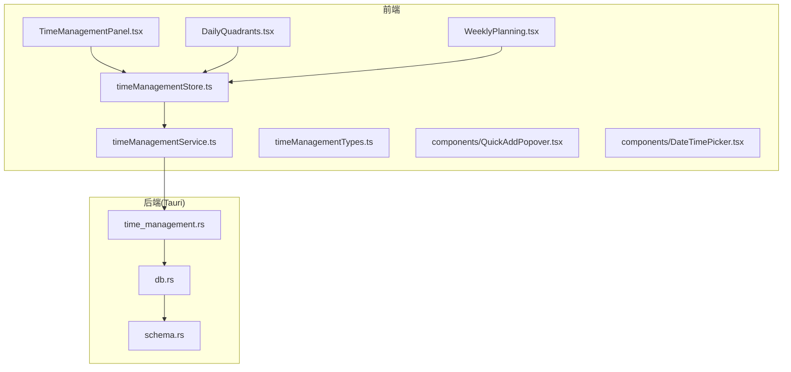
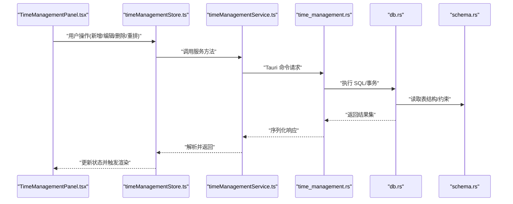
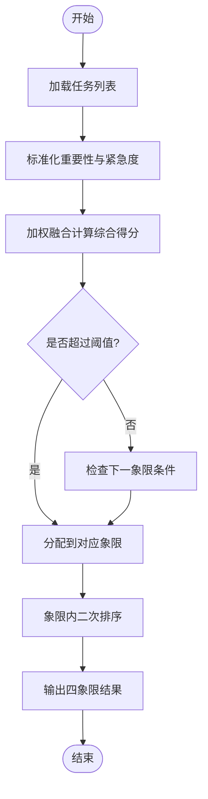
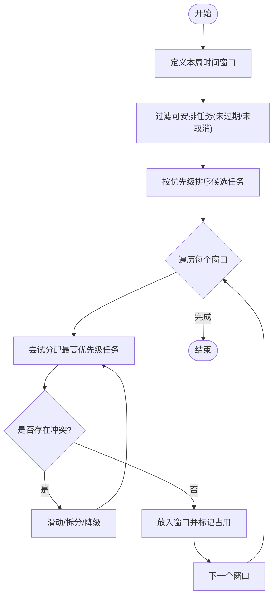
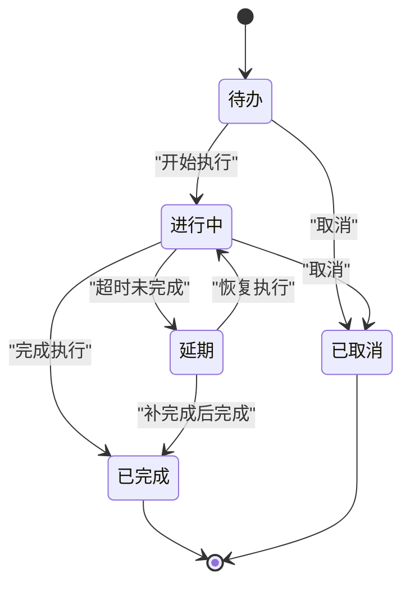
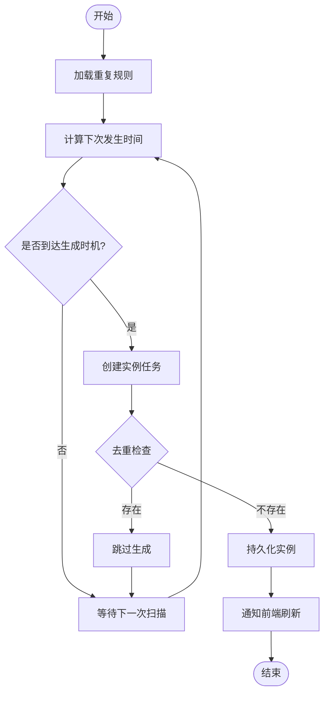
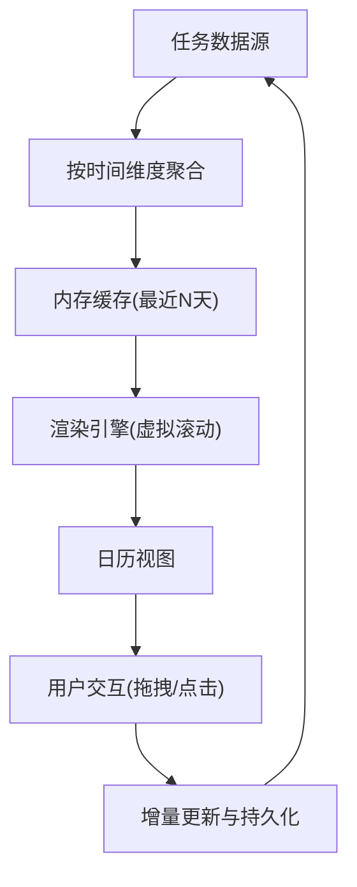
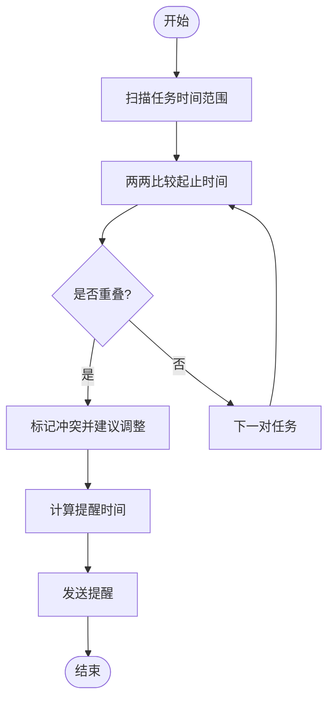
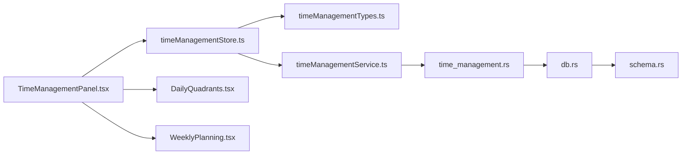

# 时间管理模块

<cite>
**本文引用的文件**   
- [src/features/time-management/TimeManagementPanel.tsx](file://src/features/time-management/TimeManagementPanel.tsx)
- [src/features/time-management/DailyQuadrants.tsx](file://src/features/time-management/DailyQuadrants.tsx)
- [src/features/time-management/WeeklyPlanning.tsx](file://src/features/time-management/WeeklyPlanning.tsx)
- [src/features/time-management/timeManagementStore.ts](file://src/features/time-management/timeManagementStore.ts)
- [src/features/time-management/timeManagementService.ts](file://src/features/time-management/timeManagementService.ts)
- [src/features/time-management/timeManagementTypes.ts](file://src/features/time-management/timeManagementTypes.ts)
- [src/features/time-management/components/QuickAddPopover.tsx](file://src/features/time-management/components/QuickAddPopover.tsx)
- [src/features/time-management/components/DateTimePicker.tsx](file://src/features/time-management/components/DateTimePicker.tsx)
- [src-tauri/src/time_management.rs](file://src-tauri/src/time_management.rs)
- [src-tauri/src/db.rs](file://src-tauri/src/db.rs)
- [src-tauri/src/schema.rs](file://src-tauri/src/schema.rs)
</cite>

## 目录
1. [简介](#简介)
2. [项目结构](#项目结构)
3. [核心组件](#核心组件)
4. [架构总览](#架构总览)
5. [详细组件分析](#详细组件分析)
6. [依赖关系分析](#依赖关系分析)
7. [性能考虑](#性能考虑)
8. [故障排查指南](#故障排查指南)
9. [结论](#结论)
10. [附录](#附录)

## 简介
本技术文档聚焦于“时间管理模块”，围绕以下目标展开：
- 任务四象限算法的实现逻辑与优先级计算
- 周计划生成的时间窗口划分与任务分配策略
- 任务状态流转的生命周期管理
- 重复任务的生成算法与调度机制
- 日历视图的数据聚合与渲染优化
- 时间冲突检测与智能提醒功能

该模块由前端 React 特性层、Tauri 后端服务与本地数据库组成，提供从数据模型、业务逻辑到持久化与 UI 展示的一体化实现。

## 项目结构
时间管理模块采用前后端分离的 Tauri 架构：
- 前端位于 src/features/time-management，包含面板、类型定义、状态存储与服务调用
- 后端位于 src-tauri/src，暴露 Rust 命令并访问本地数据库

图表来源
- [src/features/time-management/TimeManagementPanel.tsx](file://src/features/time-management/TimeManagementPanel.tsx)
- [src/features/time-management/DailyQuadrants.tsx](file://src/features/time-management/DailyQuadrants.tsx)
- [src/features/time-management/WeeklyPlanning.tsx](file://src/features/time-management/WeeklyPlanning.tsx)
- [src/features/time-management/timeManagementStore.ts](file://src/features/time-management/timeManagementStore.ts)
- [src/features/time-management/timeManagementService.ts](file://src/features/time-management/timeManagementService.ts)
- [src/features/time-management/timeManagementTypes.ts](file://src/features/time-management/timeManagementTypes.ts)
- [src/features/time-management/components/QuickAddPopover.tsx](file://src/features/time-management/components/QuickAddPopover.tsx)
- [src/features/time-management/components/DateTimePicker.tsx](file://src/features/time-management/components/DateTimePicker.tsx)
- [src-tauri/src/time_management.rs](file://src-tauri/src/time_management.rs)
- [src-tauri/src/db.rs](file://src-tauri/src/db.rs)
- [src-tauri/src/schema.rs](file://src-tauri/src/schema.rs)

章节来源
- [src/features/time-management/TimeManagementPanel.tsx](file://src/features/time-management/TimeManagementPanel.tsx)
- [src/features/time-management/timeManagementStore.ts](file://src/features/time-management/timeManagementStore.ts)
- [src/features/time-management/timeManagementService.ts](file://src/features/time-management/timeManagementService.ts)
- [src-tauri/src/time_management.rs](file://src-tauri/src/time_management.rs)
- [src-tauri/src/db.rs](file://src-tauri/src/db.rs)
- [src-tauri/src/schema.rs](file://src-tauri/src/schema.rs)

## 核心组件
- 类型定义（timeManagementTypes.ts）
  - 统一任务实体、四象限分类、周计划时间窗、重复规则等数据结构
  - 为前后端交互提供契约，确保字段一致性与校验前置
- 状态存储（timeManagementStore.ts）
  - 基于响应式状态管理，维护任务集合、筛选条件、四象限结果缓存
  - 提供增删改查、批量操作、重排与刷新接口
- 服务层（timeManagementService.ts）
  - 封装对 Tauri 后端的调用，负责参数序列化、错误处理与重试
- 面板与视图
  - TimeManagementPanel.tsx：主入口，组合各子视图与全局控制
  - DailyQuadrants.tsx：四象限视图，按重要性与紧急性分组展示
  - WeeklyPlanning.tsx：周计划视图，按时间窗分配任务
- 辅助组件
  - QuickAddPopover.tsx：快速添加任务弹窗
  - DateTimePicker.tsx：日期时间选择器，支持时区与格式转换

章节来源
- [src/features/time-management/timeManagementTypes.ts](file://src/features/time-management/timeManagementTypes.ts)
- [src/features/time-management/timeManagementStore.ts](file://src/features/time-management/timeManagementStore.ts)
- [src/features/time-management/timeManagementService.ts](file://src/features/time-management/timeManagementService.ts)
- [src/features/time-management/TimeManagementPanel.tsx](file://src/features/time-management/TimeManagementPanel.tsx)
- [src/features/time-management/DailyQuadrants.tsx](file://src/features/time-management/DailyQuadrants.tsx)
- [src/features/time-management/WeeklyPlanning.tsx](file://src/features/time-management/WeeklyPlanning.tsx)
- [src/features/time-management/components/QuickAddPopover.tsx](file://src/features/time-management/components/QuickAddPopover.tsx)
- [src/features/time-management/components/DateTimePicker.tsx](file://src/features/time-management/components/DateTimePicker.tsx)

## 架构总览
整体流程：UI 触发 → Store 更新 → Service 调用 → Tauri 命令 → DB 读写 → 返回结果 → 前端渲染。

图表来源
- [src/features/time-management/TimeManagementPanel.tsx](file://src/features/time-management/TimeManagementPanel.tsx)
- [src/features/time-management/timeManagementStore.ts](file://src/features/time-management/timeManagementStore.ts)
- [src/features/time-management/timeManagementService.ts](file://src/features/time-management/timeManagementService.ts)
- [src-tauri/src/time_management.rs](file://src-tauri/src/time_management.rs)
- [src-tauri/src/db.rs](file://src-tauri/src/db.rs)
- [src-tauri/src/schema.rs](file://src-tauri/src/schema.rs)

## 详细组件分析

### 四象限算法与优先级计算
- 输入维度
  - 重要性评分（来自任务属性或用户标记）
  - 紧急度评分（基于截止时间、剩余时间、逾期惩罚）
  - 预估耗时与当前可用时间窗口
- 计算步骤
  - 标准化评分：将原始分数映射到固定区间
  - 权重融合：重要性×w1 + 紧急度×w2，得到综合得分
  - 阈值分箱：根据得分阈值落入四个象限（重要且紧急、重要不紧急、紧急不重要、不紧急不重要）
  - 同象限排序：按剩余时间、预估耗时、创建时间等次要键排序
- 输出
  - 每个任务的四象限标签与排序位置
  - 用于 DailyQuadrants 视图渲染

图表来源
- [src/features/time-management/DailyQuadrants.tsx](file://src/features/time-management/DailyQuadrants.tsx)
- [src/features/time-management/timeManagementStore.ts](file://src/features/time-management/timeManagementStore.ts)
- [src/features/time-management/timeManagementTypes.ts](file://src/features/time-management/timeManagementTypes.ts)

章节来源
- [src/features/time-management/DailyQuadrants.tsx](file://src/features/time-management/DailyQuadrants.tsx)
- [src/features/time-management/timeManagementStore.ts](file://src/features/time-management/timeManagementStore.ts)
- [src/features/time-management/timeManagementTypes.ts](file://src/features/time-management/timeManagementTypes.ts)

### 周计划生成：时间窗口划分与任务分配
- 时间窗口划分
  - 以工作日为单位，按小时或自定义粒度切分
  - 排除非工作时间、会议占位、休息时段
- 任务分配策略
  - 优先匹配高优先级任务（四象限得分高的任务）
  - 考虑任务预估时长与窗口大小，尽量整块放置
  - 冲突检测：若重叠则尝试滑动或拆分；无法解决则降级至低优先级象限
- 生成流程
  - 扫描本周所有窗口
  - 遍历候选任务队列
  - 分配并记录占用情况
  - 输出周计划视图数据

图表来源
- [src/features/time-management/WeeklyPlanning.tsx](file://src/features/time-management/WeeklyPlanning.tsx)
- [src/features/time-management/timeManagementStore.ts](file://src/features/time-management/timeManagementStore.ts)
- [src/features/time-management/timeManagementTypes.ts](file://src/features/time-management/timeManagementTypes.ts)

章节来源
- [src/features/time-management/WeeklyPlanning.tsx](file://src/features/time-management/WeeklyPlanning.tsx)
- [src/features/time-management/timeManagementStore.ts](file://src/features/time-management/timeManagementStore.ts)
- [src/features/time-management/timeManagementTypes.ts](file://src/features/time-management/timeManagementTypes.ts)

### 任务状态流转的生命周期管理
- 状态集合
  - 待办、进行中、已完成、已取消、延期
- 流转规则
  - 待办 → 进行中：开始执行
  - 进行中 → 已完成：完成执行
  - 进行中 → 延期：超出截止仍未完成
  - 任意状态 → 已取消：用户主动取消
- 约束与审计
  - 禁止非法跳转（如直接从未开始跳到已完成）
  - 记录状态变更时间与原因，便于回溯

图表来源
- [src/features/time-management/timeManagementTypes.ts](file://src/features/time-management/timeManagementTypes.ts)
- [src/features/time-management/timeManagementStore.ts](file://src/features/time-management/timeManagementStore.ts)

章节来源
- [src/features/time-management/timeManagementTypes.ts](file://src/features/time-management/timeManagementTypes.ts)
- [src/features/time-management/timeManagementStore.ts](file://src/features/time-management/timeManagementStore.ts)

### 重复任务的生成算法与调度机制
- 重复规则
  - 每日、每周、每月、每年或自定义间隔
  - 可选结束条件：固定次数、指定截止日期、永不结束
- 生成算法
  - 基于起始时间与间隔计算下一次发生时间
  - 在到期前 N 分钟/小时生成实例任务
  - 去重策略：避免重复生成同一实例
- 调度机制
  - 定时任务在应用启动时初始化
  - 后台周期性扫描即将到期的重复任务
  - 生成实例后写入数据库并通知前端刷新

图表来源
- [src/features/time-management/timeManagementStore.ts](file://src/features/time-management/timeManagementStore.ts)
- [src/features/time-management/timeManagementTypes.ts](file://src/features/time-management/timeManagementTypes.ts)
- [src-tauri/src/time_management.rs](file://src-tauri/src/time_management.rs)

章节来源
- [src/features/time-management/timeManagementStore.ts](file://src/features/time-management/timeManagementStore.ts)
- [src/features/time-management/timeManagementTypes.ts](file://src/features/time-management/timeManagementTypes.ts)
- [src-tauri/src/time_management.rs](file://src-tauri/src/time_management.rs)

### 日历视图的数据聚合与渲染优化
- 数据聚合
  - 按日/周/月维度聚合任务数量、完成率、平均耗时
  - 合并重复任务实例，统计有效任务数
- 渲染优化
  - 虚拟滚动：仅渲染可视区域的任务卡片
  - 增量更新：仅变更受影响的时间块
  - 懒加载：按需加载历史数据
- 交互体验
  - 拖拽调整时间窗
  - 点击查看详情与快速编辑

图表来源
- [src/features/time-management/DailyQuadrants.tsx](file://src/features/time-management/DailyQuadrants.tsx)
- [src/features/time-management/WeeklyPlanning.tsx](file://src/features/time-management/WeeklyPlanning.tsx)
- [src/features/time-management/timeManagementStore.ts](file://src/features/time-management/timeManagementStore.ts)

章节来源
- [src/features/time-management/DailyQuadrants.tsx](file://src/features/time-management/DailyQuadrants.tsx)
- [src/features/time-management/WeeklyPlanning.tsx](file://src/features/time-management/WeeklyPlanning.tsx)
- [src/features/time-management/timeManagementStore.ts](file://src/features/time-management/timeManagementStore.ts)

### 时间冲突检测与智能提醒
- 冲突检测
  - 比较任务起止时间，判断是否重叠
  - 考虑缓冲时间（如准备/收尾）
- 智能提醒
  - 提前 N 分钟推送提醒
  - 根据任务优先级与剩余时间动态调整提醒频率
  - 支持静默模式与免打扰时段

图表来源
- [src/features/time-management/timeManagementStore.ts](file://src/features/time-management/timeManagementStore.ts)
- [src/features/time-management/components/QuickAddPopover.tsx](file://src/features/time-management/components/QuickAddPopover.tsx)
- [src/features/time-management/components/DateTimePicker.tsx](file://src/features/time-management/components/DateTimePicker.tsx)

章节来源
- [src/features/time-management/timeManagementStore.ts](file://src/features/time-management/timeManagementStore.ts)
- [src/features/time-management/components/QuickAddPopover.tsx](file://src/features/time-management/components/QuickAddPopover.tsx)
- [src/features/time-management/components/DateTimePicker.tsx](file://src/features/time-management/components/DateTimePicker.tsx)

## 依赖关系分析
- 前端内部依赖
  - Panel 依赖 Store 与 Service
  - Store 依赖 Types 与 Service
  - 视图组件依赖 Store 提供的派生数据
- 前后端集成
  - Service 通过 Tauri 命令与后端通信
  - 后端使用 db.rs 与 schema.rs 进行数据访问与结构校验

图表来源
- [src/features/time-management/TimeManagementPanel.tsx](file://src/features/time-management/TimeManagementPanel.tsx)
- [src/features/time-management/timeManagementStore.ts](file://src/features/time-management/timeManagementStore.ts)
- [src/features/time-management/timeManagementService.ts](file://src/features/time-management/timeManagementService.ts)
- [src/features/time-management/timeManagementTypes.ts](file://src/features/time-management/timeManagementTypes.ts)
- [src-tauri/src/time_management.rs](file://src-tauri/src/time_management.rs)
- [src-tauri/src/db.rs](file://src-tauri/src/db.rs)
- [src-tauri/src/schema.rs](file://src-tauri/src/schema.rs)

章节来源
- [src/features/time-management/TimeManagementPanel.tsx](file://src/features/time-management/TimeManagementPanel.tsx)
- [src/features/time-management/timeManagementStore.ts](file://src/features/time-management/timeManagementStore.ts)
- [src/features/time-management/timeManagementService.ts](file://src/features/time-management/timeManagementService.ts)
- [src-tauri/src/time_management.rs](file://src-tauri/src/time_management.rs)
- [src-tauri/src/db.rs](file://src-tauri/src/db.rs)
- [src-tauri/src/schema.rs](file://src-tauri/src/schema.rs)

## 性能考虑
- 减少不必要的重渲染：使用派生状态与选择性订阅
- 大数据量场景：启用虚拟滚动与分页加载
- 计算密集型：将四象限与周计划计算移至 Web Worker 或后端
- 缓存策略：对聚合结果设置短期缓存与失效策略
- 网络与 IO：批量写入与事务提交，降低磁盘开销

[本节为通用指导，无需特定文件引用]

## 故障排查指南
- 常见问题定位
  - 状态不同步：检查 Store 更新路径与 Service 返回值
  - 冲突误报：确认缓冲时间与边界条件处理
  - 重复任务未生成：核对生成时机与去重逻辑
- 日志与调试
  - 在服务层与后端命令处增加关键路径日志
  - 使用浏览器开发者工具跟踪状态变化
- 回滚与恢复
  - 对批量操作使用事务，失败时回滚
  - 保留状态变更审计记录以便追踪

章节来源
- [src/features/time-management/timeManagementStore.ts](file://src/features/time-management/timeManagementStore.ts)
- [src/features/time-management/timeManagementService.ts](file://src/features/time-management/timeManagementService.ts)
- [src-tauri/src/time_management.rs](file://src-tauri/src/time_management.rs)
- [src-tauri/src/db.rs](file://src-tauri/src/db.rs)

## 结论
时间管理模块通过清晰的分层架构与明确的职责划分，实现了四象限优先级、周计划生成、状态生命周期、重复任务调度、日历聚合与冲突检测等核心能力。建议在后续迭代中引入更完善的测试覆盖与性能基准，进一步提升稳定性与用户体验。

[本节为总结性内容，无需特定文件引用]

## 附录
- 术语说明
  - 四象限：按重要性与紧急性划分的任务分类
  - 时间窗口：计划中的时间段，用于任务分配
  - 重复任务：按规则周期性生成的任务实例
- 扩展建议
  - 引入 AI 辅助估算与自动排程
  - 增强多设备同步与离线优先策略

[本节为概念性内容，无需特定文件引用]