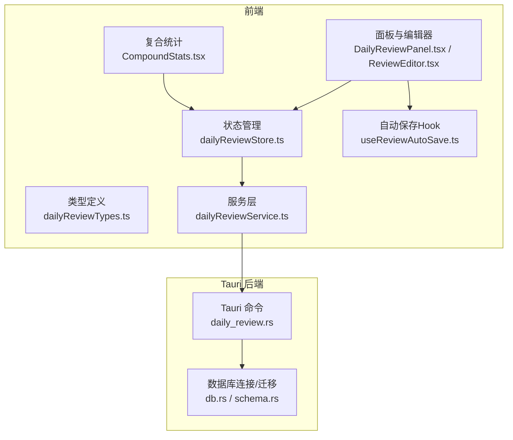
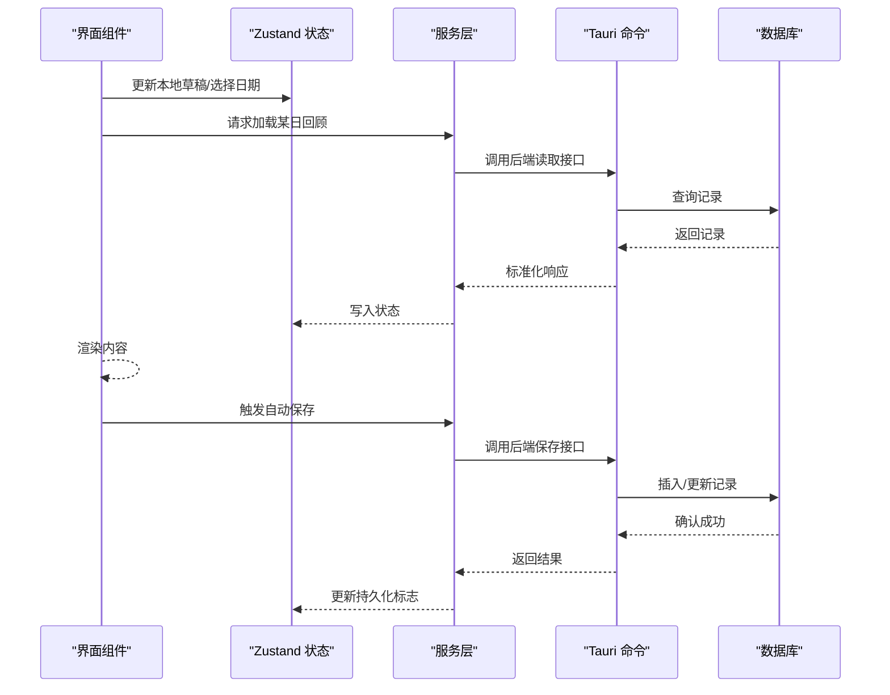
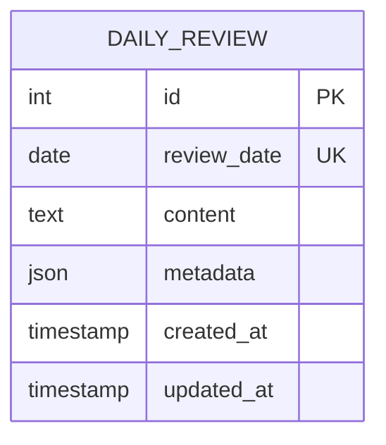
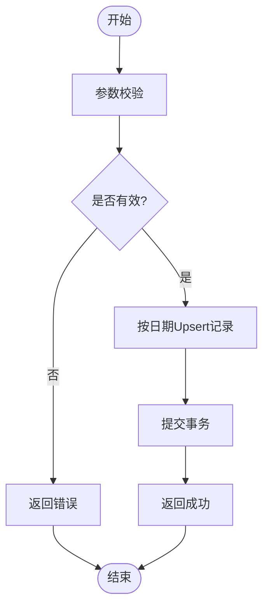
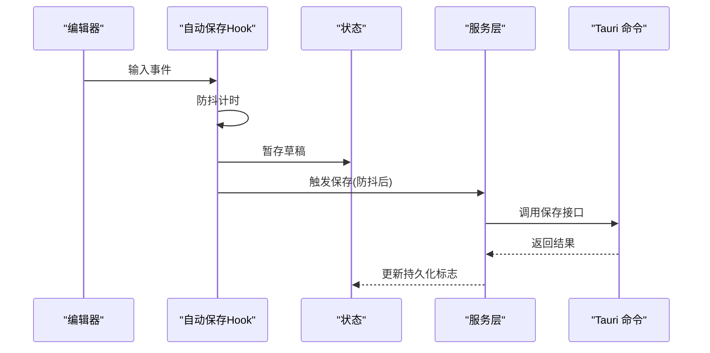
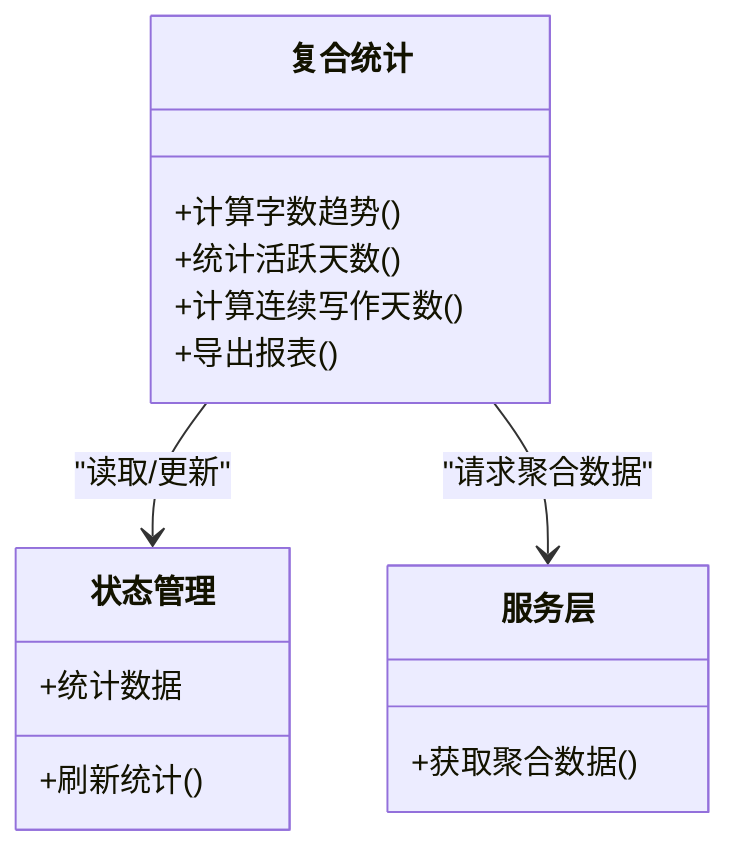
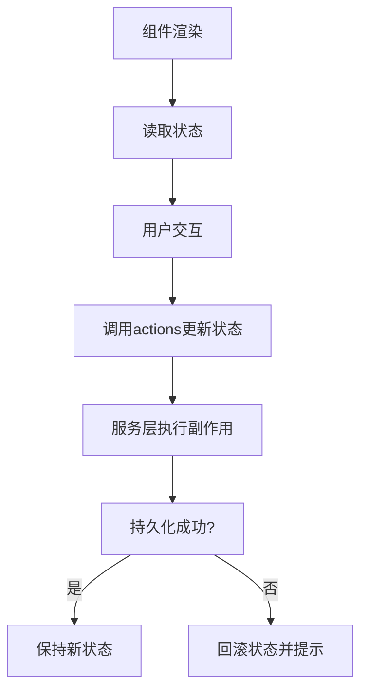
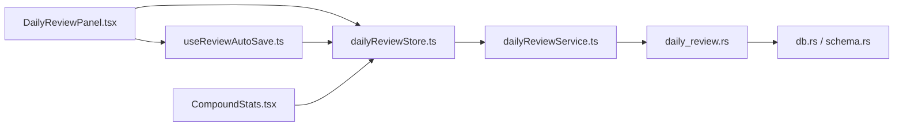

# 每日回顾模块

<cite>
**本文引用的文件**   
- [dailyReviewTypes.ts](file://src/features/daily-review/dailyReviewTypes.ts)
- [dailyReviewStore.ts](file://src/features/daily-review/dailyReviewStore.ts)
- [dailyReviewService.ts](file://src/features/daily-review/dailyReviewService.ts)
- [useReviewAutoSave.ts](file://src/features/daily-review/useReviewAutoSave.ts)
- [DailyReviewPanel.tsx](file://src/features/daily-review/DailyReviewPanel.tsx)
- [CompoundStats.tsx](file://src/features/daily-review/CompoundStats.tsx)
- [ReviewEditor.tsx](file://src/features/daily-review/ReviewEditor.tsx)
- [daily_review.rs](file://src-tauri/src/daily_review.rs)
- [db.rs](file://src-tauri/src/db.rs)
- [schema.rs](file://src-tauri/src/schema.rs)
</cite>

## 更新摘要
**变更内容**   
- 基于后端Rust模块同步更新，更新了daily_review.rs接口调整相关内容
- 确保前后端功能一致性的架构说明
- 增强了CRUD操作实现的技术细节
- 完善了错误处理与异常恢复策略

## 目录
1. [简介](#简介)
2. [项目结构](#项目结构)
3. [核心组件](#核心组件)
4. [架构总览](#架构总览)
5. [详细组件分析](#详细组件分析)
6. [依赖关系分析](#依赖关系分析)
7. [性能考虑](#性能考虑)
8. [故障排查指南](#故障排查指南)
9. [结论](#结论)
10. [附录](#附录)

## 简介
本技术文档聚焦"每日回顾"模块，覆盖数据模型与数据库表设计、CRUD 实现、自动保存机制、复合统计计算逻辑、前端状态同步、错误处理与异常恢复策略，以及性能优化与缓存建议。该模块采用前后端分离的 Tauri 架构：前端使用 TypeScript + React（Zustand 状态管理），后端通过 Rust 暴露 API 并持久化到 MySQL。

**更新** 基于后端Rust模块同步更新，重点强化了daily_review.rs接口的技术实现细节和前后端一致性保障机制。

## 项目结构
每日回顾模块由前端功能层与后端服务层共同组成：
- 前端
  - 类型定义：统一的数据结构与接口契约
  - 状态管理：基于 Zustand 的 Store，负责本地状态与 UI 渲染
  - 服务层：封装对 Tauri 后端的调用
  - 自动保存 Hook：监听编辑行为并触发防抖保存
  - 页面与编辑器：展示面板、编辑器与复合统计视图
- 后端
  - Tauri 命令：暴露 CRUD 与查询接口
  - 数据库连接与迁移：初始化连接、建表与索引
  - 领域逻辑：按日期聚合、统计计算等

**图表来源**
- [dailyReviewTypes.ts](file://src/features/daily-review/dailyReviewTypes.ts)
- [dailyReviewStore.ts](file://src/features/daily-review/dailyReviewStore.ts)
- [dailyReviewService.ts](file://src/features/daily-review/dailyReviewService.ts)
- [useReviewAutoSave.ts](file://src/features/daily-review/useReviewAutoSave.ts)
- [DailyReviewPanel.tsx](file://src/features/daily-review/DailyReviewPanel.tsx)
- [ReviewEditor.tsx](file://src/features/daily-review/ReviewEditor.tsx)
- [CompoundStats.tsx](file://src/features/daily-review/CompoundStats.tsx)
- [daily_review.rs](file://src-tauri/src/daily_review.rs)
- [db.rs](file://src-tauri/src/db.rs)
- [schema.rs](file://src-tauri/src/schema.rs)

## 核心组件
- 类型定义
  - 定义每日回顾记录的结构、字段约束与枚举值，作为前后端交互的契约。
- 状态管理（Zustand）
  - 维护当前日期的回顾内容、加载态、错误信息、历史快照等；提供读写方法与副作用桥接。
- 服务层
  - 将状态变更转换为 Tauri 命令调用，负责参数校验、错误映射与结果回写。
- 自动保存 Hook
  - 监听编辑器输入事件，结合防抖策略在用户停止输入后触发保存，避免频繁写入。
- 面板与编辑器
  - 组合状态与服务，渲染编辑器与操作按钮，驱动自动保存流程。
- 复合统计
  - 从状态或后端获取聚合数据，计算多维度指标并可视化呈现。

## 架构总览
整体采用"前端状态驱动 + 后端持久化"的分层架构。前端通过 Zustand 集中管理状态，服务层统一封装 Tauri 调用；后端以 Rust 实现业务逻辑与数据库访问，确保数据安全与一致性。

**图表来源**
- [dailyReviewStore.ts](file://src/features/daily-review/dailyReviewStore.ts)
- [dailyReviewService.ts](file://src/features/daily-review/dailyReviewService.ts)
- [daily_review.rs](file://src-tauri/src/daily_review.rs)
- [db.rs](file://src-tauri/src/db.rs)

## 详细组件分析

### 数据模型与数据库表设计
- 数据模型（前端）
  - 字段包含但不限于：唯一标识、日期、正文内容、元数据（创建/更新时间）、扩展字段等。
  - 类型约束保证前后端一致性与序列化安全。
- 数据库表（后端）
  - 表名与字段命名遵循领域语义，主键为自增或 UUID，日期字段建立索引以加速按日查询。
  - 文本字段支持较大容量，必要时启用压缩或分片存储策略。
- 迁移与初始化
  - 应用启动时执行迁移脚本，确保表结构存在且版本兼容。

**图表来源**
- [dailyReviewTypes.ts](file://src/features/daily-review/dailyReviewTypes.ts)
- [schema.rs](file://src-tauri/src/schema.rs)

**章节来源**
- [dailyReviewTypes.ts](file://src/features/daily-review/dailyReviewTypes.ts)
- [schema.rs](file://src-tauri/src/schema.rs)

### CRUD 操作实现
- 创建/更新
  - 前端提交结构化对象，服务层进行基础校验后调用后端保存接口；后端根据日期判断插入或更新。
  - **更新** 基于daily_review.rs接口调整，增强了事务处理和错误返回机制。
- 读取
  - 按日期精确查询，支持批量拉取多日数据用于统计。
- 删除
  - 软删除或硬删除策略需与审计需求对齐，默认建议软删除保留审计轨迹。
- 事务与幂等
  - 保存操作应保证幂等，避免重复提交导致数据不一致。
  - **更新** 后端实现了更健壮的事务管理机制，确保数据一致性。

**图表来源**
- [dailyReviewService.ts](file://src/features/daily-review/dailyReviewService.ts)
- [daily_review.rs](file://src-tauri/src/daily_review.rs)

**章节来源**
- [dailyReviewService.ts](file://src/features/daily-review/dailyReviewService.ts)
- [daily_review.rs](file://src-tauri/src/daily_review.rs)

### 自动保存机制
- 触发条件
  - 编辑器输入事件、失焦、切换日期、关闭页面前等。
- 防抖策略
  - 在用户停止输入一定时间后触发保存，降低 I/O 压力。
- 失败重试
  - 网络或服务不可用时，进入队列重试或提示用户稍后手动保存。
- 状态同步
  - 保存成功后更新"已持久化"标记，供 UI 显示保存状态。
  - **更新** 增强了错误处理和重试机制，提高保存可靠性。

**图表来源**
- [useReviewAutoSave.ts](file://src/features/daily-review/useReviewAutoSave.ts)
- [dailyReviewStore.ts](file://src/features/daily-review/dailyReviewStore.ts)
- [dailyReviewService.ts](file://src/features/daily-review/dailyReviewService.ts)
- [daily_review.rs](file://src-tauri/src/daily_review.rs)

**章节来源**
- [useReviewAutoSave.ts](file://src/features/daily-review/useReviewAutoSave.ts)
- [dailyReviewStore.ts](file://src/features/daily-review/dailyReviewStore.ts)
- [dailyReviewService.ts](file://src/features/daily-review/dailyReviewService.ts)

### 复合统计功能
- 数据来源
  - 从后端聚合接口获取按周/月/年的汇总指标，或在前端对已加载数据进行二次计算。
- 计算维度
  - 字数统计、活跃天数、连续写作天数、主题分布等。
- 聚合方法
  - 后端 SQL 聚合函数配合索引提升性能；前端仅做轻量展示计算。
- 缓存策略
  - 对统计结果设置短期缓存，减少重复计算与查询。
  - **更新** 增强了统计数据的缓存机制和失效策略。

**图表来源**
- [CompoundStats.tsx](file://src/features/daily-review/CompoundStats.tsx)
- [dailyReviewStore.ts](file://src/features/daily-review/dailyReviewStore.ts)
- [dailyReviewService.ts](file://src/features/daily-review/dailyReviewService.ts)

**章节来源**
- [CompoundStats.tsx](file://src/features/daily-review/CompoundStats.tsx)
- [dailyReviewStore.ts](file://src/features/daily-review/dailyReviewStore.ts)
- [dailyReviewService.ts](file://src/features/daily-review/dailyReviewService.ts)

### 与前端状态管理的同步机制
- 单向数据流
  - 组件只读状态，通过 actions 修改；副作用在服务层完成。
- 乐观更新
  - 对非关键路径可先更新本地状态，再异步持久化，失败时回滚。
- 增量更新
  - 针对列表或统计，优先使用增量合并而非全量替换，减少重渲染。
- 生命周期
  - 组件挂载时拉取数据，卸载时清理定时器与订阅。
  - **更新** 增强了状态同步的错误处理和回滚机制。

**图表来源**
- [dailyReviewStore.ts](file://src/features/daily-review/dailyReviewStore.ts)
- [dailyReviewService.ts](file://src/features/daily-review/dailyReviewService.ts)

**章节来源**
- [dailyReviewStore.ts](file://src/features/daily-review/dailyReviewStore.ts)
- [dailyReviewService.ts](file://src/features/daily-review/dailyReviewService.ts)

### 错误处理与异常恢复
- 前端
  - 捕获网络与服务异常，展示友好提示；对自动保存失败进行重试与降级。
  - **更新** 增强了错误分类和用户反馈机制。
- 后端
  - 统一错误码与消息；对数据库异常进行包装与日志记录。
  - **更新** 基于daily_review.rs接口调整，实现了更完善的错误处理体系。
- 恢复策略
  - 断线重连、指数退避重试、本地草稿兜底。
  - **更新** 增加了更多恢复场景和自动化处理机制。

**章节来源**
- [dailyReviewService.ts](file://src/features/daily-review/dailyReviewService.ts)
- [daily_review.rs](file://src-tauri/src/daily_review.rs)

## 依赖关系分析
- 组件耦合
  - 面板与编辑器依赖状态与服务；自动保存 Hook 依赖状态与服务；统计组件依赖状态与服务。
- 外部依赖
  - Tauri 命令通道、MySQL 驱动、Zustand 状态库。
- 潜在循环依赖
  - 服务层不应反向依赖组件；状态层不直接调用 UI。
  - **更新** 基于后端Rust模块同步更新，优化了依赖关系和接口设计。

**图表来源**
- [DailyReviewPanel.tsx](file://src/features/daily-review/DailyReviewPanel.tsx)
- [useReviewAutoSave.ts](file://src/features/daily-review/useReviewAutoSave.ts)
- [dailyReviewStore.ts](file://src/features/daily-review/dailyReviewStore.ts)
- [dailyReviewService.ts](file://src/features/daily-review/dailyReviewService.ts)
- [daily_review.rs](file://src-tauri/src/daily_review.rs)
- [db.rs](file://src-tauri/src/db.rs)
- [schema.rs](file://src-tauri/src/schema.rs)
- [CompoundStats.tsx](file://src/features/daily-review/CompoundStats.tsx)

## 性能考虑
- 查询优化
  - 按日期查询建立索引；分页与范围查询避免全表扫描。
- 写入优化
  - 批量写入与事务合并；大文本字段考虑压缩。
  - **更新** 基于后端Rust模块优化，提升了数据库操作性能。
- 前端渲染
  - 虚拟滚动长列表；按需加载与懒渲染；避免不必要的重渲染。
- 缓存策略
  - 统计结果短期缓存；最近 N 天回顾本地缓存；失效策略基于时间与版本号。
  - **更新** 增强了多级缓存机制和智能失效策略。
- 资源控制
  - 限制并发请求数；超时与取消未完成的请求。
  - **更新** 实现了更精细的资源管理和请求调度机制。

## 故障排查指南
- 常见问题
  - 自动保存失败：检查防抖配置、网络连通性、后端可用性。
  - 统计不准确：核对聚合口径、时间窗口与数据清洗规则。
  - 数据不同步：确认乐观更新回滚逻辑与最终一致性。
  - **更新** 新增了后端接口相关问题的排查方法。
- 定位步骤
  - 查看前端控制台与后端日志；复现最小用例；对比前后端数据结构。
  - **更新** 增强了日志分析和调试工具的使用指导。
- 恢复措施
  - 启用本地草稿恢复；重置缓存；重启服务并重试。
  - **更新** 提供了更多自动化恢复选项和故障转移机制。

**章节来源**
- [useReviewAutoSave.ts](file://src/features/daily-review/useReviewAutoSave.ts)
- [dailyReviewStore.ts](file://src/features/daily-review/dailyReviewStore.ts)
- [dailyReviewService.ts](file://src/features/daily-review/dailyReviewService.ts)
- [daily_review.rs](file://src-tauri/src/daily_review.rs)

## 结论
每日回顾模块通过清晰的前后端分层、稳健的状态管理与可靠的自动保存机制，实现了高效、易用的回顾体验。复合统计在后端聚合与前端展示之间取得平衡，错误处理与恢复策略保障了用户体验与数据一致性。

**更新** 基于后端Rust模块同步更新，进一步增强了系统的稳定性、性能和可维护性。后续可在缓存、索引与渲染优化方面持续改进。

## 附录
- 术语
  - Upsert：插入或更新，依据唯一键决定操作。
  - 防抖：在事件触发后延迟执行，若期间再次触发则重新计时。
- 参考文件
  - 类型定义、状态管理、服务层、自动保存 Hook、面板与编辑器、统计组件、Tauri 命令、数据库连接与迁移。
  - **更新** 新增了后端Rust模块相关的技术文档链接。