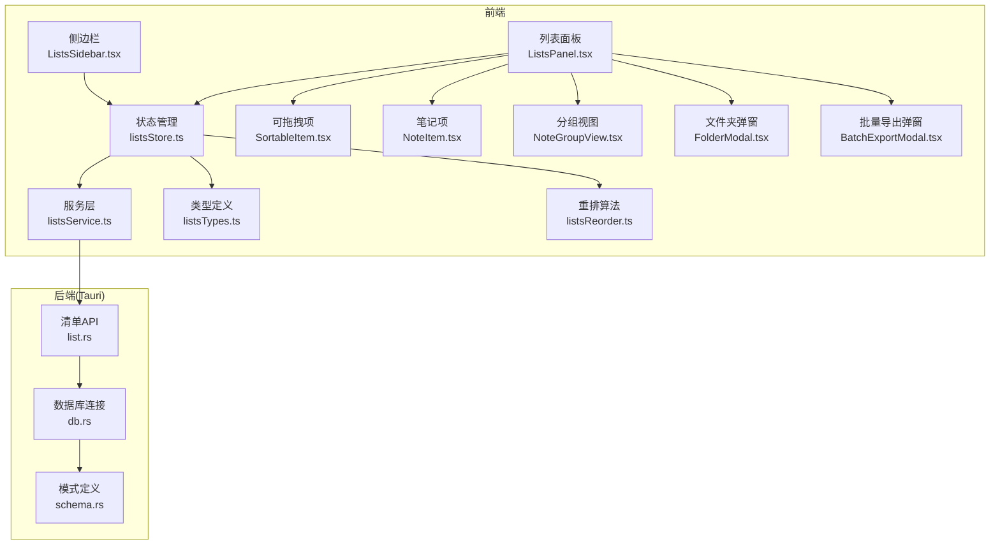
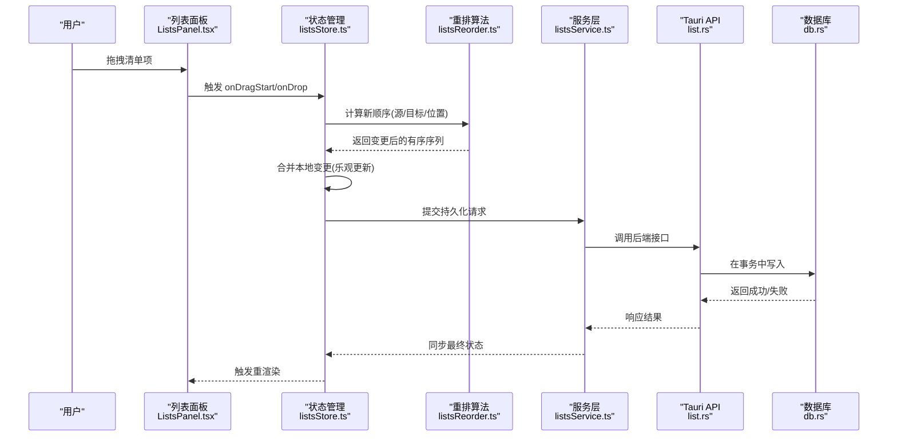
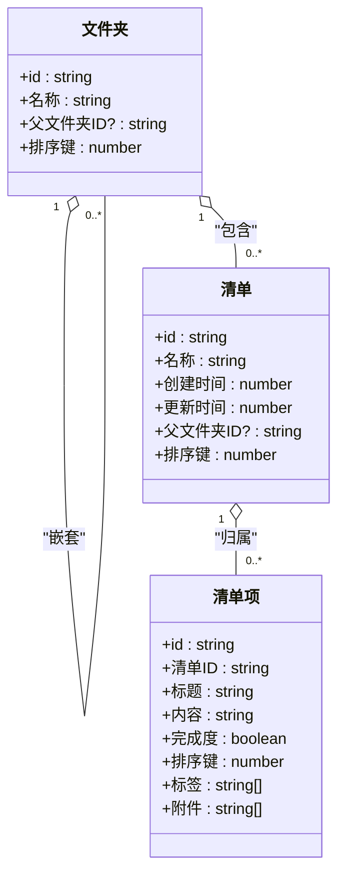
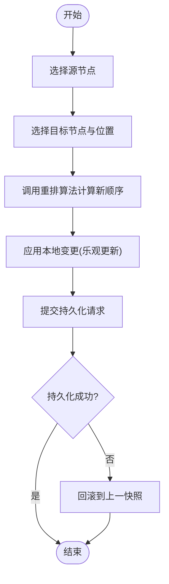
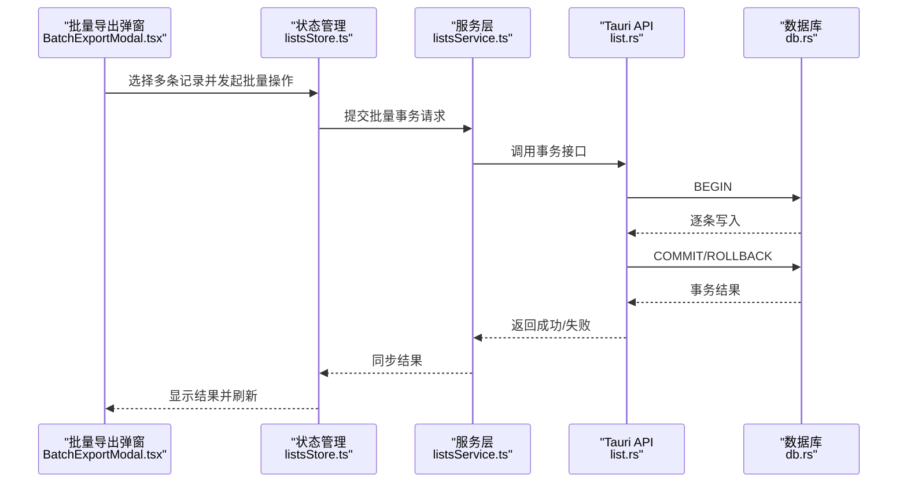
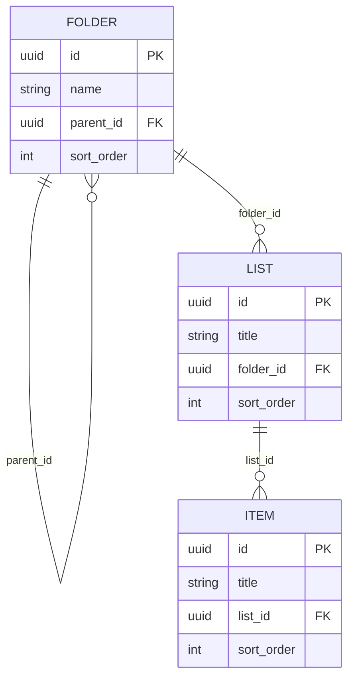
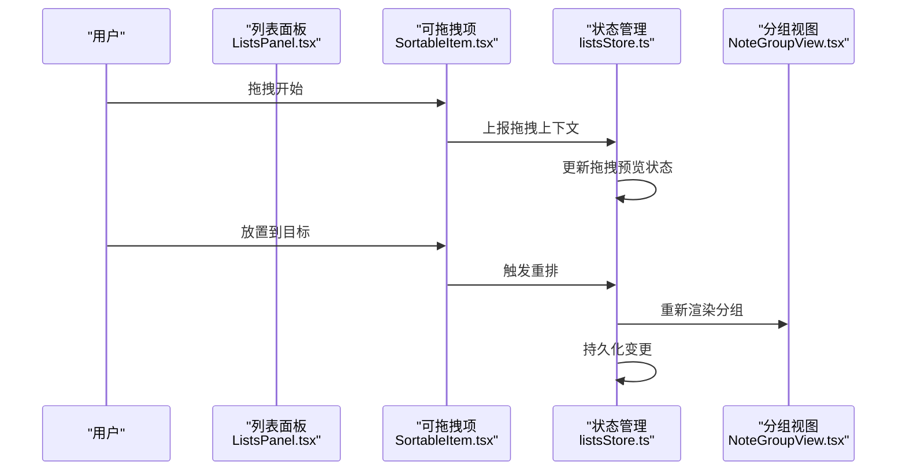
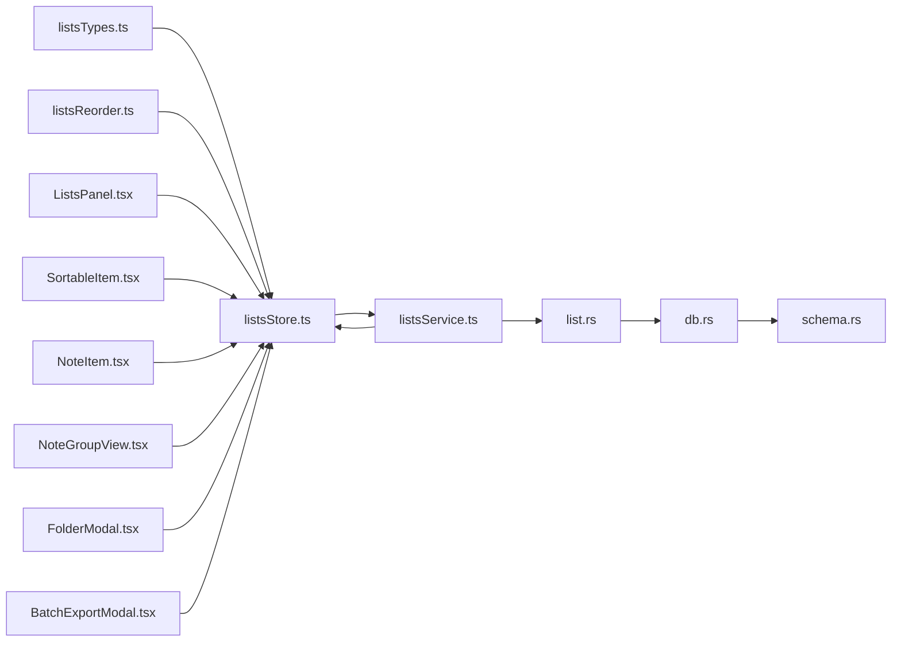

# 清单管理模块

<cite>
**本文引用的文件**   
- [src/features/lists/listsTypes.ts](file://src/features/lists/listsTypes.ts)
- [src/features/lists/listsStore.ts](file://src/features/lists/listsStore.ts)
- [src/features/lists/listsService.ts](file://src/features/lists/listsService.ts)
- [src/features/lists/listsReorder.ts](file://src/features/lists/listsReorder.ts)
- [src/features/lists/listsReorder.test.ts](file://src/features/lists/listsReorder.test.ts)
- [src/features/lists/SortableItem.tsx](file://src/features/lists/SortableItem.tsx)
- [src/features/lists/NoteItem.tsx](file://src/features/lists/NoteItem.tsx)
- [src/features/lists/NoteGroupView.tsx](file://src/features/lists/NoteGroupView.tsx)
- [src/features/lists/ListsPanel.tsx](file://src/features/lists/ListsPanel.tsx)
- [src/features/lists/ListsSidebar.tsx](file://src/features/lists/ListsSidebar.tsx)
- [src/features/lists/FolderModal.tsx](file://src/features/lists/FolderModal.tsx)
- [src/features/lists/BatchExportModal.tsx](file://src/features/lists/BatchExportModal.tsx)
- [src-tauri/src/list.rs](file://src-tauri/src/list.rs)
- [src-tauri/src/db.rs](file://src-tauri/src/db.rs)
- [src-tauri/src/schema.rs](file://src-tauri/src/schema.rs)
</cite>

## 目录
1. [简介](#简介)
2. [项目结构](#项目结构)
3. [核心组件](#核心组件)
4. [架构总览](#架构总览)
5. [详细组件分析](#详细组件分析)
6. [依赖关系分析](#依赖关系分析)
7. [性能考虑](#性能考虑)
8. [故障排查指南](#故障排查指南)
9. [结论](#结论)
10. [附录](#附录)

## 简介
本技术文档聚焦“清单管理模块”，围绕以下目标展开：
- 解释清单与清单项的层级数据结构设计（含文件夹分类树）
- 描述拖拽排序的算法实现与状态同步机制
- 记录批量操作的原子性保证与事务处理
- 说明文件夹分类的树形结构存储与查询优化
- 包含数据迁移与版本兼容性处理
- 提供搜索与过滤功能的索引策略

## 项目结构
清单管理模块采用前后端分离、分层清晰的组织方式：
- 前端特性层 features/lists：类型定义、状态管理、服务层、UI 组件、重排算法与测试
- 后端 Tauri 层 src-tauri：Rust 侧 API、数据库连接与模式定义
- 跨层契约通过 TypeScript 类型与 Rust 接口共同约束

图表来源
- [src/features/lists/ListsPanel.tsx](file://src/features/lists/ListsPanel.tsx)
- [src/features/lists/ListsSidebar.tsx](file://src/features/lists/ListsSidebar.tsx)
- [src/features/lists/listsStore.ts](file://src/features/lists/listsStore.ts)
- [src/features/lists/listsService.ts](file://src/features/lists/listsService.ts)
- [src/features/lists/listsTypes.ts](file://src/features/lists/listsTypes.ts)
- [src/features/lists/listsReorder.ts](file://src/features/lists/listsReorder.ts)
- [src/features/lists/SortableItem.tsx](file://src/features/lists/SortableItem.tsx)
- [src/features/lists/NoteItem.tsx](file://src/features/lists/NoteItem.tsx)
- [src/features/lists/NoteGroupView.tsx](file://src/features/lists/NoteGroupView.tsx)
- [src/features/lists/FolderModal.tsx](file://src/features/lists/FolderModal.tsx)
- [src/features/lists/BatchExportModal.tsx](file://src/features/lists/BatchExportModal.tsx)
- [src-tauri/src/list.rs](file://src-tauri/src/list.rs)
- [src-tauri/src/db.rs](file://src-tauri/src/db.rs)
- [src-tauri/src/schema.rs](file://src-tauri/src/schema.rs)

章节来源
- [src/features/lists/listsTypes.ts](file://src/features/lists/listsTypes.ts)
- [src/features/lists/listsStore.ts](file://src/features/lists/listsStore.ts)
- [src/features/lists/listsService.ts](file://src/features/lists/listsService.ts)
- [src/features/lists/listsReorder.ts](file://src/features/lists/listsReorder.ts)
- [src/features/lists/SortableItem.tsx](file://src/features/lists/SortableItem.tsx)
- [src/features/lists/NoteItem.tsx](file://src/features/lists/NoteItem.tsx)
- [src/features/lists/NoteGroupView.tsx](file://src/features/lists/NoteGroupView.tsx)
- [src/features/lists/ListsPanel.tsx](file://src/features/lists/ListsPanel.tsx)
- [src/features/lists/ListsSidebar.tsx](file://src/features/lists/ListsSidebar.tsx)
- [src/features/lists/FolderModal.tsx](file://src/features/lists/FolderModal.tsx)
- [src/features/lists/BatchExportModal.tsx](file://src/features/lists/BatchExportModal.tsx)
- [src-tauri/src/list.rs](file://src-tauri/src/list.rs)
- [src-tauri/src/db.rs](file://src-tauri/src/db.rs)
- [src-tauri/src/schema.rs](file://src-tauri/src/schema.rs)

## 核心组件
- 类型系统 listsTypes.ts：定义清单、清单项、文件夹等核心实体与关联关系，作为前后端契约的基础
- 状态管理 listsStore.ts：集中维护清单树、选中态、编辑态、拖拽态、筛选条件等；协调重排与服务调用
- 服务层 listsService.ts：封装对 Tauri 后端的调用，负责参数校验、错误映射与结果转换
- 重排算法 listsReorder.ts：纯函数实现拖拽插入位置计算，支持同层与跨层移动
- UI 组件：
  - ListsPanel.tsx / ListsSidebar.tsx：页面入口与导航
  - SortableItem.tsx / NoteItem.tsx：单条清单项渲染与交互
  - NoteGroupView.tsx：按文件夹分组展示
  - FolderModal.tsx：创建/编辑文件夹
  - BatchExportModal.tsx：批量操作入口（如导出）

章节来源
- [src/features/lists/listsTypes.ts](file://src/features/lists/listsTypes.ts)
- [src/features/lists/listsStore.ts](file://src/features/lists/listsStore.ts)
- [src/features/lists/listsService.ts](file://src/features/lists/listsService.ts)
- [src/features/lists/listsReorder.ts](file://src/features/lists/listsReorder.ts)
- [src/features/lists/SortableItem.tsx](file://src/features/lists/SortableItem.tsx)
- [src/features/lists/NoteItem.tsx](file://src/features/lists/NoteItem.tsx)
- [src/features/lists/NoteGroupView.tsx](file://src/features/lists/NoteGroupView.tsx)
- [src/features/lists/ListsPanel.tsx](file://src/features/lists/ListsPanel.tsx)
- [src/features/lists/ListsSidebar.tsx](file://src/features/lists/ListsSidebar.tsx)
- [src/features/lists/FolderModal.tsx](file://src/features/lists/FolderModal.tsx)
- [src/features/lists/BatchExportModal.tsx](file://src/features/lists/BatchExportModal.tsx)

## 架构总览
前后端通过 Tauri 桥接，前端以不可变更新策略驱动 UI，后端以事务保障一致性。

图表来源
- [src/features/lists/ListsPanel.tsx](file://src/features/lists/ListsPanel.tsx)
- [src/features/lists/listsStore.ts](file://src/features/lists/listsStore.ts)
- [src/features/lists/listsReorder.ts](file://src/features/lists/listsReorder.ts)
- [src/features/lists/listsService.ts](file://src/features/lists/listsService.ts)
- [src-tauri/src/list.rs](file://src-tauri/src/list.rs)
- [src-tauri/src/db.rs](file://src-tauri/src/db.rs)

## 详细组件分析

### 数据结构与层级模型
- 清单与清单项：通过唯一标识与父子引用形成树形结构；支持多字段元数据（标题、内容、时间戳、标签等）
- 文件夹分类：作为树节点承载清单项或子文件夹，便于分组与权限控制
- 排序键：使用稳定排序键（如浮点间隔或自增序号）避免频繁重编号带来的抖动

图表来源
- [src/features/lists/listsTypes.ts](file://src/features/lists/listsTypes.ts)
- [src-tauri/src/schema.rs](file://src-tauri/src/schema.rs)

章节来源
- [src/features/lists/listsTypes.ts](file://src/features/lists/listsTypes.ts)
- [src-tauri/src/schema.rs](file://src-tauri/src/schema.rs)

### 拖拽排序算法与状态同步
- 算法要点
  - 输入：源节点路径、目标节点路径、插入位置（前/后/内部）
  - 输出：新的有序序列（仅受影响分支），保持稳定性
  - 复杂度：O(n) 局部重排，避免全量重建
- 状态同步
  - 乐观更新：先应用本地变更，再异步持久化
  - 冲突回滚：若后端失败，恢复至上一快照
  - 去抖节流：高频拖拽时合并多次落盘

图表来源
- [src/features/lists/listsReorder.ts](file://src/features/lists/listsReorder.ts)
- [src/features/lists/listsStore.ts](file://src/features/lists/listsStore.ts)

章节来源
- [src/features/lists/listsReorder.ts](file://src/features/lists/listsReorder.ts)
- [src/features/lists/listsReorder.test.ts](file://src/features/lists/listsReorder.test.ts)
- [src/features/lists/listsStore.ts](file://src/features/lists/listsStore.ts)

### 批量操作的原子性与事务处理
- 前端
  - 将多个写操作打包为一次服务调用，减少往返
  - 使用事务上下文包装，失败时整体回滚
- 后端
  - 在数据库事务中执行多条写入，确保要么全部成功，要么全部失败
  - 异常捕获并返回统一错误码，前端据此进行提示与重试

图表来源
- [src/features/lists/BatchExportModal.tsx](file://src/features/lists/BatchExportModal.tsx)
- [src/features/lists/listsStore.ts](file://src/features/lists/listsStore.ts)
- [src/features/lists/listsService.ts](file://src/features/lists/listsService.ts)
- [src-tauri/src/list.rs](file://src-tauri/src/list.rs)
- [src-tauri/src/db.rs](file://src-tauri/src/db.rs)

章节来源
- [src/features/lists/BatchExportModal.tsx](file://src/features/lists/BatchExportModal.tsx)
- [src/features/lists/listsStore.ts](file://src/features/lists/listsStore.ts)
- [src/features/lists/listsService.ts](file://src/features/lists/listsService.ts)
- [src-tauri/src/list.rs](file://src-tauri/src/list.rs)
- [src-tauri/src/db.rs](file://src-tauri/src/db.rs)

### 文件夹分类的树形结构与查询优化
- 存储
  - 邻接表：每个节点保存父节点 ID，天然表达层级
  - 可选扩展：路径枚举或闭包表用于深度遍历优化
- 查询优化
  - 常用路径缓存：对热点文件夹的子树构建内存缓存
  - 预加载：进入页面时按需加载可见层级
  - 索引：对父节点 ID、排序键建立索引，加速排序与定位

图表来源
- [src-tauri/src/schema.rs](file://src-tauri/src/schema.rs)

章节来源
- [src-tauri/src/schema.rs](file://src-tauri/src/schema.rs)

### 数据迁移与版本兼容性
- 版本号
  - 在配置或元数据表中维护 schema_version
- 迁移策略
  - 启动时比对当前版本与期望版本，执行增量迁移脚本
  - 迁移失败则回滚并提示用户
- 兼容处理
  - 旧数据字段缺失时提供默认值
  - 保留向后兼容的读取逻辑，逐步废弃旧字段

章节来源
- [src-tauri/src/db.rs](file://src-tauri/src/db.rs)
- [src-tauri/src/schema.rs](file://src-tauri/src/schema.rs)

### 搜索与过滤的索引策略
- 前端
  - 基于内存索引：对标题、标签、完成度等字段建立倒排索引，支持快速过滤
  - 分页与虚拟滚动：大数据集下按需渲染
- 后端
  - 全文检索：对标题/内容建立全文索引
  - 组合查询：按文件夹、标签、时间范围等多维过滤
  - 缓存：对热点查询结果做短期缓存

章节来源
- [src/features/lists/listsStore.ts](file://src/features/lists/listsStore.ts)
- [src/features/lists/listsService.ts](file://src/features/lists/listsService.ts)
- [src-tauri/src/list.rs](file://src-tauri/src/list.rs)

### UI 组件与交互流程
- 列表面板与侧边栏：承载树形导航与主列表
- 可拖拽项与笔记项：封装拖拽事件与视觉反馈
- 分组视图：按文件夹聚合展示
- 文件夹弹窗：新增/编辑文件夹，联动树结构
- 批量导出弹窗：选择多条记录，触发批量事务

图表来源
- [src/features/lists/ListsPanel.tsx](file://src/features/lists/ListsPanel.tsx)
- [src/features/lists/SortableItem.tsx](file://src/features/lists/SortableItem.tsx)
- [src/features/lists/NoteGroupView.tsx](file://src/features/lists/NoteGroupView.tsx)
- [src/features/lists/listsStore.ts](file://src/features/lists/listsStore.ts)

章节来源
- [src/features/lists/ListsPanel.tsx](file://src/features/lists/ListsPanel.tsx)
- [src/features/lists/SortableItem.tsx](file://src/features/lists/SortableItem.tsx)
- [src/features/lists/NoteItem.tsx](file://src/features/lists/NoteItem.tsx)
- [src/features/lists/NoteGroupView.tsx](file://src/features/lists/NoteGroupView.tsx)
- [src/features/lists/FolderModal.tsx](file://src/features/lists/FolderModal.tsx)
- [src/features/lists/BatchExportModal.tsx](file://src/features/lists/BatchExportModal.tsx)

## 依赖关系分析
- 前端内聚
  - listsStore.ts 依赖 listsTypes.ts、listsService.ts、listsReorder.ts
  - UI 组件依赖 listsStore.ts 暴露的状态与方法
- 前后端耦合
  - listsService.ts 通过 Tauri 调用 list.rs
  - list.rs 依赖 db.rs 与 schema.rs
- 潜在循环
  - 确保 UI 不直接依赖 Service，避免 UI 与数据访问紧耦合

图表来源
- [src/features/lists/listsTypes.ts](file://src/features/lists/listsTypes.ts)
- [src/features/lists/listsStore.ts](file://src/features/lists/listsStore.ts)
- [src/features/lists/listsService.ts](file://src/features/lists/listsService.ts)
- [src/features/lists/listsReorder.ts](file://src/features/lists/listsReorder.ts)
- [src/features/lists/ListsPanel.tsx](file://src/features/lists/ListsPanel.tsx)
- [src/features/lists/SortableItem.tsx](file://src/features/lists/SortableItem.tsx)
- [src/features/lists/NoteItem.tsx](file://src/features/lists/NoteItem.tsx)
- [src/features/lists/NoteGroupView.tsx](file://src/features/lists/NoteGroupView.tsx)
- [src/features/lists/FolderModal.tsx](file://src/features/lists/FolderModal.tsx)
- [src/features/lists/BatchExportModal.tsx](file://src/features/lists/BatchExportModal.tsx)
- [src-tauri/src/list.rs](file://src-tauri/src/list.rs)
- [src-tauri/src/db.rs](file://src-tauri/src/db.rs)
- [src-tauri/src/schema.rs](file://src-tauri/src/schema.rs)

章节来源
- [src/features/lists/listsTypes.ts](file://src/features/lists/listsTypes.ts)
- [src/features/lists/listsStore.ts](file://src/features/lists/listsStore.ts)
- [src/features/lists/listsService.ts](file://src/features/lists/listsService.ts)
- [src/features/lists/listsReorder.ts](file://src/features/lists/listsReorder.ts)
- [src/features/lists/ListsPanel.tsx](file://src/features/lists/ListsPanel.tsx)
- [src/features/lists/SortableItem.tsx](file://src/features/lists/SortableItem.tsx)
- [src/features/lists/NoteItem.tsx](file://src/features/lists/NoteItem.tsx)
- [src/features/lists/NoteGroupView.tsx](file://src/features/lists/NoteGroupView.tsx)
- [src/features/lists/FolderModal.tsx](file://src/features/lists/FolderModal.tsx)
- [src/features/lists/BatchExportModal.tsx](file://src/features/lists/BatchExportModal.tsx)
- [src-tauri/src/list.rs](file://src-tauri/src/list.rs)
- [src-tauri/src/db.rs](file://src-tauri/src/db.rs)
- [src-tauri/src/schema.rs](file://src-tauri/src/schema.rs)

## 性能考虑
- 拖拽排序
  - 使用局部重排与稳定排序键，避免全量重建
  - 合并多次落盘，降低 I/O 压力
- 树形渲染
  - 虚拟滚动与分页加载，减少 DOM 节点数量
  - 懒加载深层级节点
- 搜索过滤
  - 前端倒排索引 + 后端全文索引
  - 热点查询结果缓存
- 批量操作
  - 事务批处理，减少网络往返
  - 失败重试与幂等设计

[本节为通用指导，无需列出具体文件来源]

## 故障排查指南
- 拖拽错位
  - 检查重排算法输入（源/目标/位置）与排序键是否一致
  - 确认本地乐观更新与后端返回的一致性
- 批量操作失败
  - 查看事务日志与错误码
  - 确认前端是否正确组装批量请求体
- 树形结构异常
  - 验证父节点 ID 与排序键
  - 检查是否存在环或孤立节点
- 搜索无结果
  - 核对索引字段与查询条件
  - 确认后端全文索引是否重建

章节来源
- [src/features/lists/listsReorder.ts](file://src/features/lists/listsReorder.ts)
- [src/features/lists/listsStore.ts](file://src/features/lists/listsStore.ts)
- [src/features/lists/listsService.ts](file://src/features/lists/listsService.ts)
- [src-tauri/src/list.rs](file://src-tauri/src/list.rs)
- [src-tauri/src/db.rs](file://src-tauri/src/db.rs)

## 结论
清单管理模块通过清晰的分层与强类型契约，实现了高内聚低耦合的架构。拖拽排序采用局部重排与乐观更新，兼顾体验与一致性；批量操作借助事务保障原子性；文件夹树以邻接表为主，辅以缓存与索引提升查询性能；搜索与过滤在前后端均具备高效索引策略。整体方案具备良好的可扩展性与可维护性。

[本节为总结性内容，无需列出具体文件来源]

## 附录
- 术语
  - 清单：一组相关清单项的集合
  - 清单项：最小可操作单元
  - 文件夹：用于分类与组织的树节点
- 参考文件
  - 类型定义：[src/features/lists/listsTypes.ts](file://src/features/lists/listsTypes.ts)
  - 状态管理：[src/features/lists/listsStore.ts](file://src/features/lists/listsStore.ts)
  - 服务层：[src/features/lists/listsService.ts](file://src/features/lists/listsService.ts)
  - 重排算法：[src/features/lists/listsReorder.ts](file://src/features/lists/listsReorder.ts)
  - 测试用例：[src/features/lists/listsReorder.test.ts](file://src/features/lists/listsReorder.test.ts)
  - UI 组件：[src/features/lists/ListsPanel.tsx](file://src/features/lists/ListsPanel.tsx)、[src/features/lists/SortableItem.tsx](file://src/features/lists/SortableItem.tsx)、[src/features/lists/NoteItem.tsx](file://src/features/lists/NoteItem.tsx)、[src/features/lists/NoteGroupView.tsx](file://src/features/lists/NoteGroupView.tsx)、[src/features/lists/FolderModal.tsx](file://src/features/lists/FolderModal.tsx)、[src/features/lists/BatchExportModal.tsx](file://src/features/lists/BatchExportModal.tsx)
  - 后端 API：[src-tauri/src/list.rs](file://src-tauri/src/list.rs)
  - 数据库：[src-tauri/src/db.rs](file://src-tauri/src/db.rs)
  - 模式定义：[src-tauri/src/schema.rs](file://src-tauri/src/schema.rs)