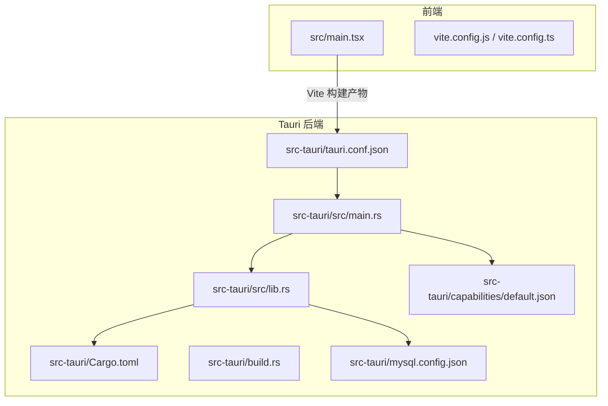
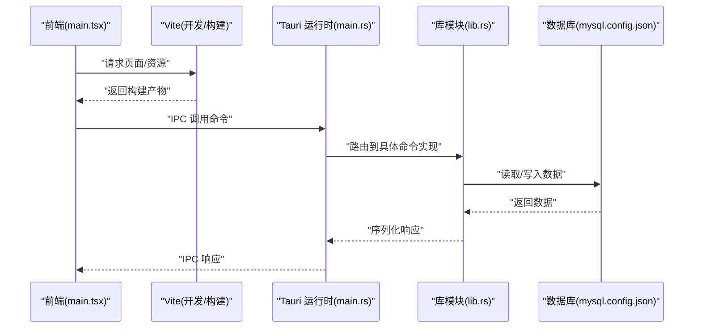
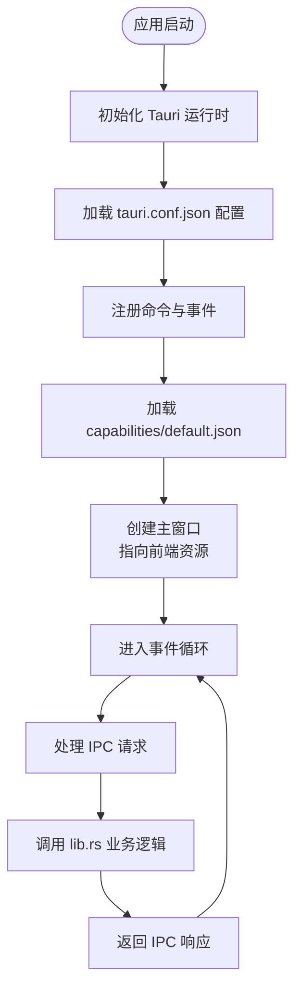
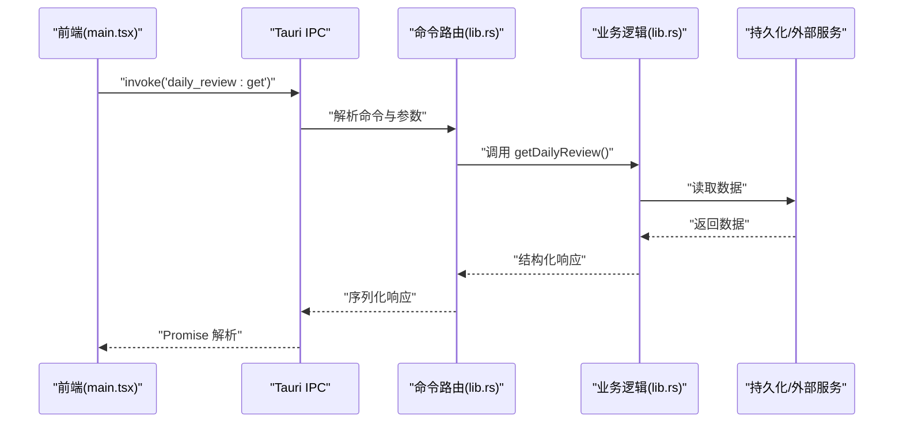
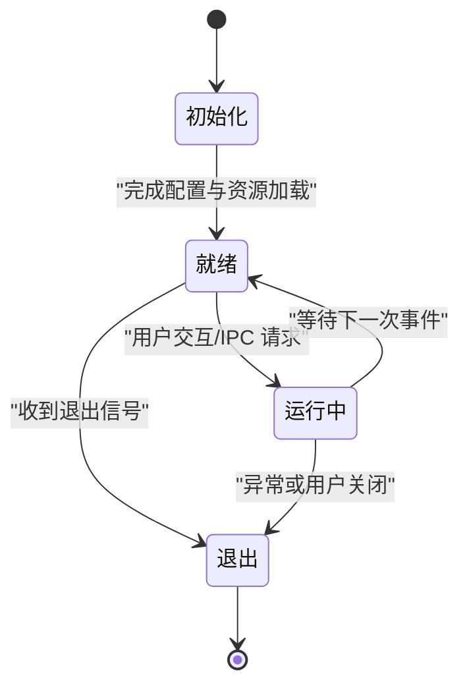
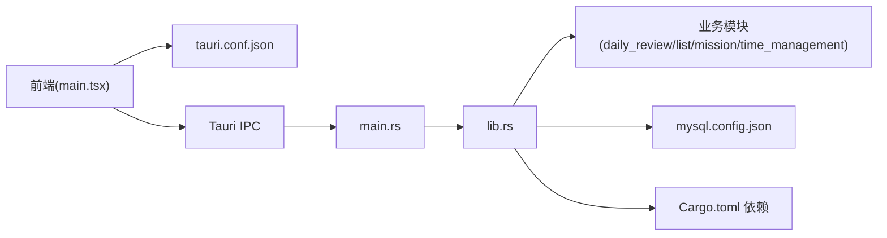

# Tauri 应用结构

<cite>
**本文引用的文件**   
- [src-tauri/Cargo.toml](file://src-tauri/Cargo.toml)
- [src-tauri/tauri.conf.json](file://src-tauri/tauri.conf.json)
- [src-tauri/build.rs](file://src-tauri/build.rs)
- [src-tauri/src/main.rs](file://src-tauri/src/main.rs)
- [src-tauri/src/lib.rs](file://src-tauri/src/lib.rs)
- [src-tauri/capabilities/default.json](file://src-tauri/capabilities/default.json)
- [src-tauri/mysql.config.json](file://src-tauri/mysql.config.json)
- [src/main.tsx](file://src/main.tsx)
- [vite.config.js](file://vite.config.js)
- [vite.config.ts](file://vite.config.ts)
</cite>

## 更新摘要
**变更内容**   
- 基于 Tauri 应用配置调整，更新了 tauri.conf.json 相关配置说明
- 增强了应用设置和权限变更的配置项描述
- 完善了跨平台兼容性考虑和平台特定代码组织方式

## 目录
1. [简介](#简介)
2. [项目结构](#项目结构)
3. [核心组件](#核心组件)
4. [架构总览](#架构总览)
5. [详细组件分析](#详细组件分析)
6. [依赖关系分析](#依赖关系分析)
7. [性能考虑](#性能考虑)
8. [故障排查指南](#故障排查指南)
9. [结论](#结论)
10. [附录](#附录)

## 简介
本文件面向使用 Tauri 构建的桌面应用，聚焦于应用启动流程、主入口点实现、配置项说明、Rust 依赖与构建、前后端通信（IPC）通道设计、应用生命周期与窗口管理策略，以及跨平台兼容性与平台特定代码组织方式。文档以仓库中的实际文件为依据，提供可追溯的来源标注与可视化图示，帮助读者快速理解并扩展该 Tauri 工程。

## 项目结构
该工程采用典型的前后端分离 + Tauri 壳层结构：
- 前端资源位于 src 目录，由 Vite 驱动开发体验与打包产物输出。
- Rust 后端位于 src-tauri 目录，包含 Cargo 工程、Tauri 配置、能力清单、构建脚本与业务逻辑模块。
- 顶层配置文件包括 package.json、tsconfig.*、vite.config.* 等，用于前端工具链与类型系统。

**图表来源**
- [src/main.tsx](file://src/main.tsx)
- [vite.config.js](file://vite.config.js)
- [vite.config.ts](file://vite.config.ts)
- [src-tauri/src/main.rs](file://src-tauri/src/main.rs)
- [src-tauri/src/lib.rs](file://src-tauri/src/lib.rs)
- [src-tauri/Cargo.toml](file://src-tauri/Cargo.toml)
- [src-tauri/tauri.conf.json](file://src-tauri/tauri.conf.json)
- [src-tauri/build.rs](file://src-tauri/build.rs)
- [src-tauri/capabilities/default.json](file://src-tauri/capabilities/default.json)
- [src-tauri/mysql.config.json](file://src-tauri/mysql.config.json)

**章节来源**
- [src/main.tsx](file://src/main.tsx)
- [vite.config.js](file://vite.config.js)
- [vite.config.ts](file://vite.config.ts)
- [src-tauri/src/main.rs](file://src-tauri/src/main.rs)
- [src-tauri/src/lib.rs](file://src-tauri/src/lib.rs)
- [src-tauri/Cargo.toml](file://src-tauri/Cargo.toml)
- [src-tauri/tauri.conf.json](file://src-tauri/tauri.conf.json)
- [src-tauri/build.rs](file://src-tauri/build.rs)
- [src-tauri/capabilities/default.json](file://src-tauri/capabilities/default.json)
- [src-tauri/mysql.config.json](file://src-tauri/mysql.config.json)

## 核心组件
- 应用主入口（Rust）：负责初始化 Tauri 运行时、注册命令、加载能力与插件、创建窗口并挂载前端资源。
- 库模块（lib.rs）：集中导出 Tauri 命令与共享逻辑，供 main.rs 调用。
- 构建脚本（build.rs）：在编译期执行自定义逻辑（如生成资源、校验配置）。
- 能力清单（capabilities/default.json）：声明前端页面可访问的后端能力与权限边界。
- Tauri 配置（tauri.conf.json）：定义窗口、安全策略、插件、构建产物路径等。
- 数据库配置（mysql.config.json）：为后端数据访问提供连接参数或环境信息。
- 前端入口（main.tsx）：渲染 React 应用，通过 Tauri IPC 调用后端命令。
- 构建配置（vite.config.*）：指定开发服务器、代理、输出目录等，确保与 Tauri 集成。

**章节来源**
- [src-tauri/src/main.rs](file://src-tauri/src/main.rs)
- [src-tauri/src/lib.rs](file://src-tauri/src/lib.rs)
- [src-tauri/build.rs](file://src-tauri/build.rs)
- [src-tauri/capabilities/default.json](file://src-tauri/capabilities/default.json)
- [src-tauri/tauri.conf.json](file://src-tauri/tauri.conf.json)
- [src-tauri/mysql.config.json](file://src-tauri/mysql.config.json)
- [src/main.tsx](file://src/main.tsx)
- [vite.config.js](file://vite.config.js)
- [vite.config.ts](file://vite.config.ts)

## 架构总览
下图展示了从前端到后端的整体交互路径：Vite 构建前端资源，Tauri 在运行时加载这些资源并通过 IPC 暴露 Rust 命令；前端通过 Tauri 客户端 SDK 发起调用，后端处理业务逻辑并返回结果。

**图表来源**
- [src/main.tsx](file://src/main.tsx)
- [vite.config.js](file://vite.config.js)
- [vite.config.ts](file://vite.config.ts)
- [src-tauri/src/main.rs](file://src-tauri/src/main.rs)
- [src-tauri/src/lib.rs](file://src-tauri/src/lib.rs)
- [src-tauri/mysql.config.json](file://src-tauri/mysql.config.json)

## 详细组件分析

### 启动流程与主入口点
- 主入口（main.rs）：
  - 初始化 Tauri 应用实例。
  - 注册全局命令、事件与插件。
  - 加载能力清单，限制前端对后端能力的访问范围。
  - 创建主窗口并指向本地构建产物或开发服务器地址。
  - 设置应用生命周期钩子（如首次运行、退出清理）。
- 库模块（lib.rs）：
  - 将业务命令按功能域拆分并集中导出。
  - 提供统一的错误处理与日志记录。
  - 封装数据库连接与事务管理。

**图表来源**
- [src-tauri/src/main.rs](file://src-tauri/src/main.rs)
- [src-tauri/src/lib.rs](file://src-tauri/src/lib.rs)
- [src-tauri/tauri.conf.json](file://src-tauri/tauri.conf.json)
- [src-tauri/capabilities/default.json](file://src-tauri/capabilities/default.json)

**章节来源**
- [src-tauri/src/main.rs](file://src-tauri/src/main.rs)
- [src-tauri/src/lib.rs](file://src-tauri/src/lib.rs)
- [src-tauri/tauri.conf.json](file://src-tauri/tauri.conf.json)
- [src-tauri/capabilities/default.json](file://src-tauri/capabilities/default.json)

### tauri.conf.json 配置项与自定义选项
- 应用元信息与版本：
  - 名称、版本号、描述、作者等基础信息。
- 窗口与 UI：
  - 主窗口尺寸、是否无边框、是否置顶、初始显示状态等。
- 安全与权限：
  - CSP 策略、URL 白名单、协议拦截、文件系统访问范围。
- 前端资源与构建：
  - 开发服务器地址、生产构建产物目录、静态资源映射。
- 插件与能力：
  - 启用插件列表、能力清单路径、权限粒度控制。
- 平台特定配置：
  - Windows/macOS/Linux 差异化设置（图标、签名、Bundle 选项）。

**更新** 基于应用配置调整，重点强化了以下配置项：

#### 应用设置配置
- 应用标识符：唯一的应用包名，遵循反向域名约定
- 版本管理：语义化版本控制，支持增量更新
- 应用标题与图标：多平台图标适配与动态标题设置

#### 权限与安全配置
- 网络安全策略：CSP 头配置与外部 URL 访问控制
- 文件系统权限：沙盒模式下的文件访问范围限制
- 进程间通信：IPC 通道的安全验证与权限控制

#### 窗口管理配置
- 窗口属性：尺寸、位置、最小化/最大化行为
- 窗口样式：边框、透明度、全屏模式支持
- 多窗口管理：辅助窗口的创建与生命周期控制

建议：
- 在生产环境严格限制 URL 白名单与文件系统访问范围。
- 使用能力清单细化每个页面的最小权限集合。
- 针对平台差异，仅在必要时覆盖默认行为。
- 定期审查安全配置，确保符合最新的安全最佳实践。

**章节来源**
- [src-tauri/tauri.conf.json](file://src-tauri/tauri.conf.json)

### Cargo.toml 依赖管理与构建配置
- 包名与版本：
  - 定义 crate 名称、版本、作者与许可证。
- 依赖声明：
  - Tauri 运行时、序列化、数据库驱动、日志框架等。
- 特性与目标平台：
  - 按需启用平台相关特性（如托盘、系统通知）。
- 构建与发布：
  - 优化级别、调试符号、分块输出、目标三元组。
- 二进制与库：
  - 区分 main.rs 作为二进制入口，lib.rs 作为库被引用。

最佳实践：
- 将平台特定依赖放入对应 target 段，避免不必要的体积。
- 使用 cargo features 控制可选功能，减少最终产物大小。
- 在 CI 中开启增量构建与缓存，提升构建速度。

**章节来源**
- [src-tauri/Cargo.toml](file://src-tauri/Cargo.toml)

### 前后端通信机制与 IPC 通道设计
- 命令注册：
  - 后端在 lib.rs 中集中注册命令，main.rs 统一挂载到 Tauri 应用。
- 命名空间与路由：
  - 按功能域划分命令前缀（如 daily_review、lists、time_management），便于维护与权限控制。
- 数据类型：
  - 使用 JSON 序列化的结构体进行请求与响应，保持前后端类型一致。
- 错误处理：
  - 统一错误码与消息，前端根据状态码进行分支处理。
- 事件总线：
  - 支持长连接或一次性回调，适用于进度上报与实时通知。

**图表来源**
- [src/main.tsx](file://src/main.tsx)
- [src-tauri/src/lib.rs](file://src-tauri/src/lib.rs)

**章节来源**
- [src/main.tsx](file://src/main.tsx)
- [src-tauri/src/lib.rs](file://src-tauri/src/lib.rs)

### 应用生命周期管理与窗口管理策略
- 生命周期：
  - 应用启动：加载配置、初始化日志、建立数据库连接池。
  - 就绪阶段：预加载必要资源、检查更新、迁移数据。
  - 退出阶段：保存状态、关闭连接、释放资源。
- 窗口管理：
  - 主窗口与辅助窗口（设置、详情面板）的创建与销毁。
  - 窗口状态持久化（位置、大小、可见性）。
  - 平台差异处理（macOS 菜单栏、Windows 任务栏图标）。

**图表来源**
- [src-tauri/src/main.rs](file://src-tauri/src/main.rs)
- [src-tauri/src/lib.rs](file://src-tauri/src/lib.rs)

**章节来源**
- [src-tauri/src/main.rs](file://src-tauri/src/main.rs)
- [src-tauri/src/lib.rs](file://src-tauri/src/lib.rs)

### 跨平台兼容性与平台特定代码组织
- 条件编译：
  - 使用 #[cfg(target_os = "...")] 隔离平台差异。
- 平台特性：
  - 托盘、通知、剪贴板、文件系统路径分隔符等。
- 资源与图标：
  - 不同平台的图标格式与尺寸要求。
- 构建与分发：
  - 各平台 Bundle 配置、签名与公证流程。

**更新** 基于配置调整，增强了以下跨平台考虑：

#### 平台特定配置管理
- 配置文件分层：通用配置与平台特定配置的分离管理
- 环境变量处理：跨平台的环境变量获取与默认值设置
- 路径处理：统一的路径抽象层，处理不同操作系统的路径分隔符

#### 平台特性适配
- 窗口管理器：各平台窗口行为的标准化接口
- 系统集成：菜单、托盘、通知等原生功能的统一封装
- 文件系统：跨平台的文件操作与权限管理

#### 构建与部署优化
- 多目标构建：并行构建不同平台的发行版本
- 资源打包：平台特定的资源文件处理与压缩
- 签名与公证：自动化签名流程与平台特定要求

建议：
- 将平台特定逻辑抽取为独立模块，并在公共接口下聚合。
- 在测试中覆盖关键平台分支，确保一致性。
- 在 CI 中并行构建多平台产物，尽早发现兼容性问题。
- 建立平台特定的测试套件，验证各平台的功能完整性。

**章节来源**
- [src-tauri/src/main.rs](file://src-tauri/src/main.rs)
- [src-tauri/src/lib.rs](file://src-tauri/src/lib.rs)

## 依赖关系分析
- 前端与 Tauri：
  - 前端通过 Tauri 客户端 SDK 调用后端命令，依赖 tauri.conf.json 的资源路径与权限。
- Rust 内部依赖：
  - main.rs 依赖 lib.rs 导出的命令与工具函数。
  - 业务模块（daily_review、lists、mission、time_management）通过 lib.rs 聚合。
- 外部依赖：
  - 数据库驱动、日志框架、序列化库等。

**图表来源**
- [src/main.tsx](file://src/main.tsx)
- [src-tauri/tauri.conf.json](file://src-tauri/tauri.conf.json)
- [src-tauri/src/main.rs](file://src-tauri/src/main.rs)
- [src-tauri/src/lib.rs](file://src-tauri/src/lib.rs)
- [src-tauri/mysql.config.json](file://src-tauri/mysql.config.json)
- [src-tauri/Cargo.toml](file://src-tauri/Cargo.toml)

**章节来源**
- [src/main.tsx](file://src/main.tsx)
- [src-tauri/tauri.conf.json](file://src-tauri/tauri.conf.json)
- [src-tauri/src/main.rs](file://src-tauri/src/main.rs)
- [src-tauri/src/lib.rs](file://src-tauri/src/lib.rs)
- [src-tauri/mysql.config.json](file://src-tauri/mysql.config.json)
- [src-tauri/Cargo.toml](file://src-tauri/Cargo.toml)

## 性能考虑
- 构建优化：
  - 使用 release 模式、LTO、strip 符号表减小体积。
  - 合理拆分 crate 与 feature，避免引入不必要依赖。
- 运行时优化：
  - 数据库连接池复用，避免频繁建连。
  - IPC 批量操作与分页查询，减少往返次数。
  - 前端懒加载与虚拟滚动，降低首屏压力。
- 资源管理：
  - 及时释放文件句柄与网络资源。
  - 使用内存映射与流式读写处理大文件。

[本节为通用指导，不直接分析具体文件]

## 故障排查指南
- 启动失败：
  - 检查 tauri.conf.json 的路径与权限是否正确。
  - 确认 build.rs 未抛出异常或生成无效资源。
- IPC 调用失败：
  - 核对命令名称与参数结构是否与后端一致。
  - 查看能力清单是否允许当前页面访问该命令。
- 数据库连接问题：
  - 验证 mysql.config.json 的连接参数与网络可达性。
  - 检查防火墙与代理设置。
- 日志与调试：
  - 启用详细日志，定位错误堆栈。
  - 使用平台原生调试器附加进程。

**更新** 基于配置调整，新增以下排查要点：

#### 配置相关问题
- 配置文件语法错误：检查 JSON 格式的合法性与必填字段
- 权限配置冲突：验证能力清单与实际权限需求的一致性
- 路径配置错误：确认相对路径与绝对路径在不同平台的表现

#### 安全策略问题
- CSP 策略限制：检查外部资源访问是否被正确放行
- 文件系统权限：验证沙盒模式下的文件访问权限
- IPC 安全验证：确认命令调用的身份验证与授权检查

**章节来源**
- [src-tauri/tauri.conf.json](file://src-tauri/tauri.conf.json)
- [src-tauri/build.rs](file://src-tauri/build.rs)
- [src-tauri/capabilities/default.json](file://src-tauri/capabilities/default.json)
- [src-tauri/mysql.config.json](file://src-tauri/mysql.config.json)

## 结论
本文件基于仓库实际文件梳理了 Tauri 应用的启动流程、主入口实现、配置项、依赖与构建、IPC 通道设计、生命周期与窗口管理，以及跨平台兼容性策略。通过模块化与权限细粒度控制，可在保证安全性的同时提升可维护性与可扩展性。建议在后续迭代中持续完善能力清单与日志体系，强化错误处理与性能监控。

**更新** 基于最新的配置调整，特别强调了应用设置与权限管理的重要性，为构建安全可靠的桌面应用提供了更完善的指导。

[本节为总结性内容，不直接分析具体文件]

## 附录
- 参考文件路径：
  - 前端入口与构建配置：[src/main.tsx](file://src/main.tsx)、[vite.config.js](file://vite.config.js)、[vite.config.ts](file://vite.config.ts)
  - Tauri 后端与配置：[src-tauri/src/main.rs](file://src-tauri/src/main.rs)、[src-tauri/src/lib.rs](file://src-tauri/src/lib.rs)、[src-tauri/tauri.conf.json](file://src-tauri/tauri.conf.json)、[src-tauri/Cargo.toml](file://src-tauri/Cargo.toml)、[src-tauri/build.rs](file://src-tauri/build.rs)、[src-tauri/capabilities/default.json](file://src-tauri/capabilities/default.json)、[src-tauri/mysql.config.json](file://src-tauri/mysql.config.json)

[本节为索引性内容，不直接分析具体文件]