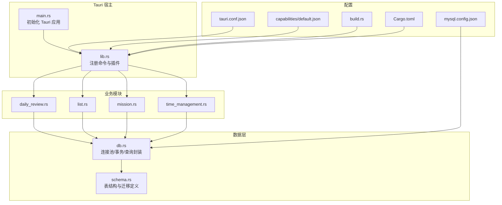
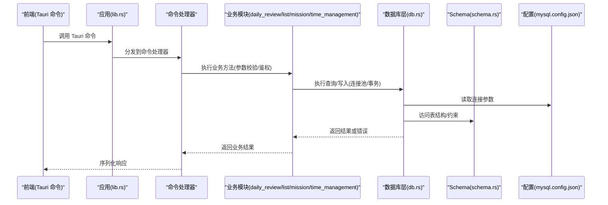
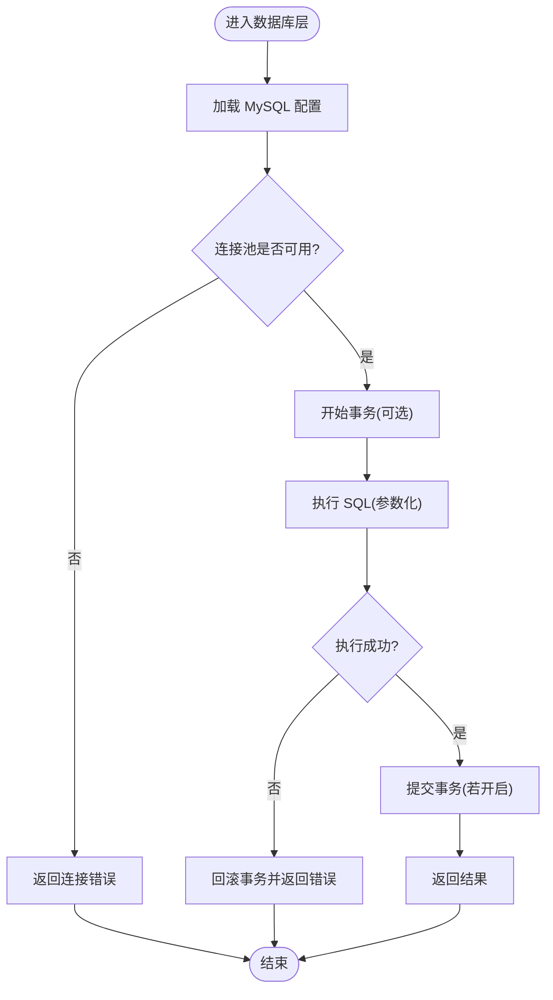
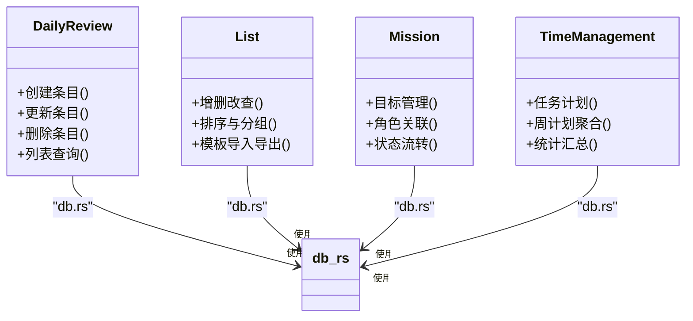
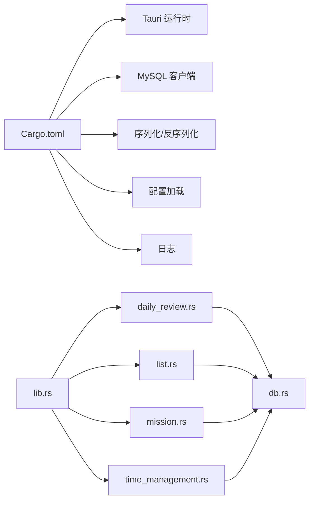

# 后端架构

<cite>
**本文引用的文件**   
- [src-tauri/Cargo.toml](file://src-tauri/Cargo.toml)
- [src-tauri/tauri.conf.json](file://src-tauri/tauri.conf.json)
- [src-tauri/capabilities/default.json](file://src-tauri/capabilities/default.json)
- [src-tauri/mysql.config.json](file://src-tauri/mysql.config.json)
- [src-tauri/build.rs](file://src-tauri/build.rs)
- [src-tauri/src/main.rs](file://src-tauri/src/main.rs)
- [src-tauri/src/lib.rs](file://src-tauri/src/lib.rs)
- [src-tauri/src/db.rs](file://src-tauri/src/db.rs)
- [src-tauri/src/schema.rs](file://src-tauri/src/schema.rs)
- [src-tauri/src/daily_review.rs](file://src-tauri/src/daily_review.rs)
- [src-tauri/src/list.rs](file://src-tauri/src/list.rs)
- [src-tauri/src/mission.rs](file://src-tauri/src/mission.rs)
- [src-tauri/src/time_management.rs](file://src-tauri/src/time_management.rs)
</cite>

## 目录
1. [简介](#简介)
2. [项目结构](#项目结构)
3. [核心组件](#核心组件)
4. [架构总览](#架构总览)
5. [详细组件分析](#详细组件分析)
6. [依赖分析](#依赖分析)
7. [性能考虑](#性能考虑)
8. [故障排查指南](#故障排查指南)
9. [结论](#结论)
10. [附录](#附录)

## 简介
本文件面向 FishWorker 的后端部分，聚焦于基于 Rust 与 Tauri 的桌面应用后端架构。文档覆盖异步编程模型、数据库连接管理与 MySQL 集成、API 接口设计、错误处理机制、安全与权限控制、数据库 Schema 设计与索引优化策略、Rust 代码组织与模块划分，以及第三方 crate 依赖与版本管理。目标是帮助开发者快速理解系统整体设计并指导后续演进。

## 项目结构
FishWorker 采用 Tauri 作为宿主框架，Rust 实现后端逻辑，前端通过 Tauri 命令调用后端能力。后端源码位于 src-tauri/src 下，按功能域划分为多个模块；配置集中在 tauri.conf.json、capabilities/default.json 与 mysql.config.json；构建脚本为 build.rs；依赖声明在 Cargo.toml。

图表来源
- [src-tauri/src/main.rs](file://src-tauri/src/main.rs)
- [src-tauri/src/lib.rs](file://src-tauri/src/lib.rs)
- [src-tauri/src/db.rs](file://src-tauri/src/db.rs)
- [src-tauri/src/schema.rs](file://src-tauri/src/schema.rs)
- [src-tauri/src/daily_review.rs](file://src-tauri/src/daily_review.rs)
- [src-tauri/src/list.rs](file://src-tauri/src/list.rs)
- [src-tauri/src/mission.rs](file://src-tauri/src/mission.rs)
- [src-tauri/src/time_management.rs](file://src-tauri/src/time_management.rs)
- [src-tauri/tauri.conf.json](file://src-tauri/tauri.conf.json)
- [src-tauri/capabilities/default.json](file://src-tauri/capabilities/default.json)
- [src-tauri/mysql.config.json](file://src-tauri/mysql.config.json)
- [src-tauri/build.rs](file://src-tauri/build.rs)
- [src-tauri/Cargo.toml](file://src-tauri/Cargo.toml)

章节来源
- [src-tauri/src/main.rs](file://src-tauri/src/main.rs)
- [src-tauri/src/lib.rs](file://src-tauri/src/lib.rs)
- [src-tauri/tauri.conf.json](file://src-tauri/tauri.conf.json)
- [src-tauri/capabilities/default.json](file://src-tauri/capabilities/default.json)
- [src-tauri/mysql.config.json](file://src-tauri/mysql.config.json)
- [src-tauri/build.rs](file://src-tauri/build.rs)
- [src-tauri/Cargo.toml](file://src-tauri/Cargo.toml)

## 核心组件
- Tauri 应用入口与命令注册：负责启动应用、加载配置、注册前端可调用的命令，并将请求路由到具体业务模块。
- 数据库层：提供连接池、事务、通用查询封装，统一错误类型与日志记录。
- 领域模块：每日回顾、清单、使命、时间管理等业务能力的 API 实现。
- 配置与能力：Tauri 能力白名单、MySQL 连接参数、构建期行为。
- 依赖与构建：Cargo 依赖声明与锁定、构建脚本。

章节来源
- [src-tauri/src/lib.rs](file://src-tauri/src/lib.rs)
- [src-tauri/src/db.rs](file://src-tauri/src/db.rs)
- [src-tauri/src/daily_review.rs](file://src-tauri/src/daily_review.rs)
- [src-tauri/src/list.rs](file://src-tauri/src/list.rs)
- [src-tauri/src/mission.rs](file://src-tauri/src/mission.rs)
- [src-tauri/src/time_management.rs](file://src-tauri/src/time_management.rs)
- [src-tauri/tauri.conf.json](file://src-tauri/tauri.conf.json)
- [src-tauri/capabilities/default.json](file://src-tauri/capabilities/default.json)
- [src-tauri/mysql.config.json](file://src-tauri/mysql.config.json)
- [src-tauri/Cargo.toml](file://src-tauri/Cargo.toml)

## 架构总览
下图展示了从前端到后端的完整调用链路：前端通过 Tauri 命令发起请求，命令处理器解析参数并调用对应业务模块，业务模块使用数据库层进行持久化操作，最终返回结果给前端。

图表来源
- [src-tauri/src/lib.rs](file://src-tauri/src/lib.rs)
- [src-tauri/src/daily_review.rs](file://src-tauri/src/daily_review.rs)
- [src-tauri/src/list.rs](file://src-tauri/src/list.rs)
- [src-tauri/src/mission.rs](file://src-tauri/src/mission.rs)
- [src-tauri/src/time_management.rs](file://src-tauri/src/time_management.rs)
- [src-tauri/src/db.rs](file://src-tauri/src/db.rs)
- [src-tauri/src/schema.rs](file://src-tauri/src/schema.rs)
- [src-tauri/mysql.config.json](file://src-tauri/mysql.config.json)

## 详细组件分析

### 应用入口与命令注册
- 职责：初始化 Tauri 应用、加载配置、注册命令、挂载能力。
- 关键点：命令命名空间与参数绑定、错误向前的统一包装、跨平台路径与资源访问控制。

章节来源
- [src-tauri/src/main.rs](file://src-tauri/src/main.rs)
- [src-tauri/src/lib.rs](file://src-tauri/src/lib.rs)
- [src-tauri/tauri.conf.json](file://src-tauri/tauri.conf.json)
- [src-tauri/capabilities/default.json](file://src-tauri/capabilities/default.json)

### 数据库层（连接池与事务）
- 职责：维护 MySQL 连接池、提供事务边界、封装常用 CRUD 与批量操作、统一错误类型与日志。
- 关键点：连接参数来源、连接池大小与超时、重试与退避、SQL 注入防护（参数化）、事务回滚策略。

图表来源
- [src-tauri/src/db.rs](file://src-tauri/src/db.rs)
- [src-tauri/mysql.config.json](file://src-tauri/mysql.config.json)

章节来源
- [src-tauri/src/db.rs](file://src-tauri/src/db.rs)
- [src-tauri/mysql.config.json](file://src-tauri/mysql.config.json)

### 领域模块（每日回顾/清单/使命/时间管理）
- 职责：暴露 Tauri 命令，实现领域逻辑，协调数据库层完成读写。
- 关键点：输入校验、权限判断、分页/过滤、并发安全、错误分类与提示。

图表来源
- [src-tauri/src/daily_review.rs](file://src-tauri/src/daily_review.rs)
- [src-tauri/src/list.rs](file://src-tauri/src/list.rs)
- [src-tauri/src/mission.rs](file://src-tauri/src/mission.rs)
- [src-tauri/src/time_management.rs](file://src-tauri/src/time_management.rs)
- [src-tauri/src/db.rs](file://src-tauri/src/db.rs)

章节来源
- [src-tauri/src/daily_review.rs](file://src-tauri/src/daily_review.rs)
- [src-tauri/src/list.rs](file://src-tauri/src/list.rs)
- [src-tauri/src/mission.rs](file://src-tauri/src/mission.rs)
- [src-tauri/src/time_management.rs](file://src-tauri/src/time_management.rs)

### 配置与能力
- Tauri 配置：窗口、菜单、命令白名单、资源路径等。
- 能力白名单：限制可访问的系统能力，最小权限原则。
- MySQL 配置：主机、端口、用户、密码、库名、SSL 选项等。

章节来源
- [src-tauri/tauri.conf.json](file://src-tauri/tauri.conf.json)
- [src-tauri/capabilities/default.json](file://src-tauri/capabilities/default.json)
- [src-tauri/mysql.config.json](file://src-tauri/mysql.config.json)

### 构建与依赖
- 构建脚本：可在构建期生成代码或调整产物。
- 依赖管理：Cargo.toml 声明运行时与开发依赖，Cargo.lock 锁定版本。

章节来源
- [src-tauri/build.rs](file://src-tauri/build.rs)
- [src-tauri/Cargo.toml](file://src-tauri/Cargo.toml)

## 依赖分析
- 外部依赖：Tauri 运行时、MySQL 客户端、JSON 序列化、配置加载、日志等。
- 内部耦合：命令注册层对业务模块低耦合，业务模块仅依赖数据库层与公共类型。
- 潜在风险：循环依赖应避免；对外部 crate 的版本升级需回归测试。

图表来源
- [src-tauri/Cargo.toml](file://src-tauri/Cargo.toml)
- [src-tauri/src/lib.rs](file://src-tauri/src/lib.rs)
- [src-tauri/src/daily_review.rs](file://src-tauri/src/daily_review.rs)
- [src-tauri/src/list.rs](file://src-tauri/src/list.rs)
- [src-tauri/src/mission.rs](file://src-tauri/src/mission.rs)
- [src-tauri/src/time_management.rs](file://src-tauri/src/time_management.rs)
- [src-tauri/src/db.rs](file://src-tauri/src/db.rs)

章节来源
- [src-tauri/Cargo.toml](file://src-tauri/Cargo.toml)
- [src-tauri/src/lib.rs](file://src-tauri/src/lib.rs)

## 性能考虑
- 异步模型：使用 Tauri 的命令调度与 Tokio 运行时，避免阻塞 UI 线程；I/O 密集操作走异步通道。
- 连接池：合理设置最大连接数、空闲超时与获取超时，避免连接风暴与饥饿。
- 事务粒度：尽量缩小事务范围，减少锁持有时间；批量写入合并事务。
- 查询优化：使用参数化查询、分页与必要索引；避免 N+1 查询。
- 缓存策略：热点数据本地缓存（如最近列表），注意失效与一致性。
- 序列化：按需选择轻量序列化格式，减少 CPU 与内存占用。
- 日志采样：生产环境降低日志级别，关键路径保留结构化日志。

[本节为通用性能建议，不直接分析具体文件]

## 故障排查指南
- 连接失败：检查 mysql.config.json 中的主机、端口、用户名、密码与 SSL 配置；确认网络可达与防火墙规则。
- 权限不足：核对 capabilities/default.json 与 tauri.conf.json 中命令与系统能力白名单。
- 事务异常：定位回滚点，检查业务逻辑分支与错误传播路径。
- 性能问题：观察连接池等待、慢查询与序列化开销；启用慢查询日志与指标收集。
- 构建错误：查看 build.rs 输出与 Cargo.lock 冲突；清理 target 后重试。

章节来源
- [src-tauri/mysql.config.json](file://src-tauri/mysql.config.json)
- [src-tauri/capabilities/default.json](file://src-tauri/capabilities/default.json)
- [src-tauri/tauri.conf.json](file://src-tauri/tauri.conf.json)
- [src-tauri/build.rs](file://src-tauri/build.rs)

## 结论
FishWorker 后端以 Tauri 为宿主，Rust 为核心，采用模块化与分层设计，将命令注册、业务逻辑与数据访问解耦。通过连接池与事务封装提升稳定性与可维护性，结合能力白名单与最小权限原则保障安全性。建议在后续迭代中完善 Schema 与索引策略、引入更完善的错误分类与监控指标，并对高频路径进行基准测试与压测验证。

[本节为总结性内容，不直接分析具体文件]

## 附录

### 数据库 Schema 与索引优化策略
- 表结构设计：围绕“每日回顾”“清单”“使命”“时间管理”四大域建模，明确主键、外键与唯一约束。
- 索引策略：
  - 高频查询字段建立单列或多列复合索引。
  - 前缀匹配场景使用前缀索引或全文索引。
  - 避免过度索引，关注写入放大与存储成本。
- 分区与归档：历史数据按时间分区，冷热分离，定期归档。
- 迁移管理：集中式 schema 定义与版本化迁移，确保多环境一致性。

章节来源
- [src-tauri/src/schema.rs](file://src-tauri/src/schema.rs)

### API 接口设计与错误处理
- 接口风格：基于 Tauri 命令的 RPC 风格，统一入参出参与错误码。
- 错误分类：网络/连接错误、业务校验错误、数据一致性错误、权限错误。
- 幂等与重试：写操作支持幂等键，必要时配合重试与补偿。
- 审计与追踪：关键操作记录审计日志与请求 ID。

章节来源
- [src-tauri/src/lib.rs](file://src-tauri/src/lib.rs)
- [src-tauri/src/db.rs](file://src-tauri/src/db.rs)

### 安全与权限控制
- 能力白名单：仅在 capabilities/default.json 中开放必要能力。
- 输入校验：严格校验命令参数，拒绝非法值。
- 最小权限：数据库账号遵循最小权限原则，禁止授予不必要权限。
- 敏感信息：配置文件加密或环境变量注入，避免硬编码。

章节来源
- [src-tauri/capabilities/default.json](file://src-tauri/capabilities/default.json)
- [src-tauri/mysql.config.json](file://src-tauri/mysql.config.json)

### Rust 代码组织与模块划分
- 分层清晰：命令注册层、业务层、数据层分离。
- 命名规范：模块按领域命名，函数与方法语义明确。
- 错误类型：统一错误枚举，便于上层处理与展示。
- 测试策略：单元测试覆盖核心算法与边界条件，集成测试覆盖数据库交互。

章节来源
- [src-tauri/src/lib.rs](file://src-tauri/src/lib.rs)
- [src-tauri/src/daily_review.rs](file://src-tauri/src/daily_review.rs)
- [src-tauri/src/list.rs](file://src-tauri/src/list.rs)
- [src-tauri/src/mission.rs](file://src-tauri/src/mission.rs)
- [src-tauri/src/time_management.rs](file://src-tauri/src/time_management.rs)
- [src-tauri/src/db.rs](file://src-tauri/src/db.rs)

### 第三方 Crate 依赖与版本管理
- 依赖声明：在 Cargo.toml 中声明运行时与开发依赖，固定主要版本。
- 版本锁定：使用 Cargo.lock 锁定精确版本，保证可重现构建。
- 安全更新：定期扫描依赖漏洞，评估升级影响并回归测试。
- 最小化依赖：移除未使用依赖，减小二进制体积与攻击面。

章节来源
- [src-tauri/Cargo.toml](file://src-tauri/Cargo.toml)