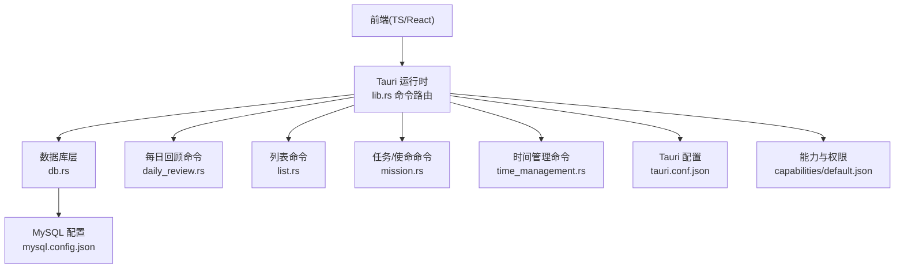
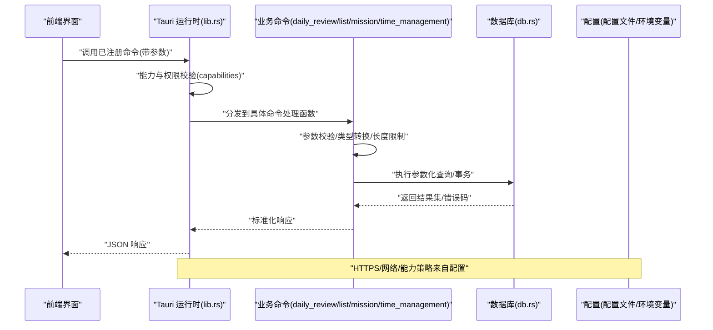
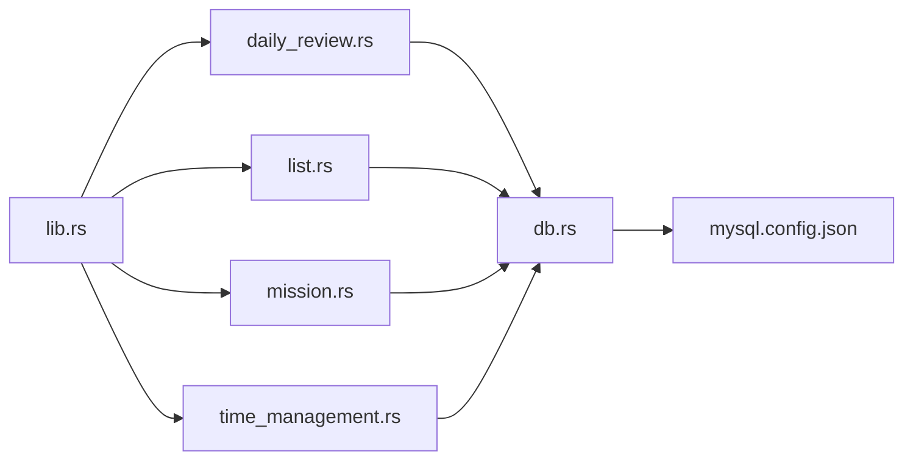

# 安全与权限

<cite>
**本文引用的文件**   
- [src-tauri/tauri.conf.json](file://src-tauri/tauri.conf.json)
- [src-tauri/capabilities/default.json](file://src-tauri/capabilities/default.json)
- [src-tauri/src/lib.rs](file://src-tauri/src/lib.rs)
- [src-tauri/src/main.rs](file://src-tauri/src/main.rs)
- [src-tauri/Cargo.toml](file://src-tauri/Cargo.toml)
- [src-tauri/mysql.config.json](file://src-tauri/mysql.config.json)
- [src-tauri/src/db.rs](file://src-tauri/src/db.rs)
- [src-tauri/src/daily_review.rs](file://src-tauri/src/daily_review.rs)
- [src-tauri/src/list.rs](file://src-tauri/src/list.rs)
- [src-tauri/src/mission.rs](file://src-tauri/src/mission.rs)
- [src-tauri/src/time_management.rs](file://src-tauri/src/time_management.rs)
</cite>

## 目录
1. [简介](#简介)
2. [项目结构](#项目结构)
3. [核心组件](#核心组件)
4. [架构总览](#架构总览)
5. [详细组件分析](#详细组件分析)
6. [依赖关系分析](#依赖关系分析)
7. [性能与安全权衡](#性能与安全权衡)
8. [故障排查指南](#故障排查指南)
9. [结论](#结论)
10. [附录](#附录)

## 简介
本文件聚焦于 Tauri 能力系统与权限模型、命令白名单机制、安全边界定义，以及用户输入验证、SQL 注入防护、敏感数据处理与加密存储、文件系统访问控制与路径校验、网络安全配置与 HTTPS 支持、安全审计与漏洞检测最佳实践。文档面向开发者与运维人员，既提供高层设计说明，也给出可落地的实现建议与检查清单。

## 项目结构
本项目采用前后端分离的 Tauri 应用结构：前端位于 src，后端 Rust 代码位于 src-tauri。Tauri 的安全策略通过 tauri.conf.json 与 capabilities 管理；Rust 侧通过 lib.rs 注册命令并暴露给前端。数据库连接与业务命令分别由 db.rs 与各功能模块（daily_review.rs、list.rs、mission.rs、time_management.rs）承担。

图示来源
- [src-tauri/src/lib.rs](file://src-tauri/src/lib.rs)
- [src-tauri/tauri.conf.json](file://src-tauri/tauri.conf.json)
- [src-tauri/capabilities/default.json](file://src-tauri/capabilities/default.json)
- [src-tauri/src/db.rs](file://src-tauri/src/db.rs)
- [src-tauri/src/daily_review.rs](file://src-tauri/src/daily_review.rs)
- [src-tauri/src/list.rs](file://src-tauri/src/list.rs)
- [src-tauri/src/mission.rs](file://src-tauri/src/mission.rs)
- [src-tauri/src/time_management.rs](file://src-tauri/src/time_management.rs)

章节来源
- [src-tauri/tauri.conf.json](file://src-tauri/tauri.conf.json)
- [src-tauri/capabilities/default.json](file://src-tauri/capabilities/default.json)
- [src-tauri/src/lib.rs](file://src-tauri/src/lib.rs)

## 核心组件
- Tauri 配置与能力系统
  - tauri.conf.json：定义应用窗口、协议、插件、构建产物等全局安全相关设置。
  - capabilities/default.json：声明前端页面或域可用的能力集合，用于细粒度授权。
- 命令路由与白名单
  - lib.rs：集中注册所有后端命令，作为“命令白名单”的单一入口，仅允许显式注册的命令被调用。
- 数据库与 SQL 安全
  - db.rs：封装数据库连接、事务、参数化查询等通用能力，统一执行 SQL 的入口。
  - daily_review.rs、list.rs、mission.rs、time_management.rs：各业务命令在 db.rs 之上进行参数校验与数据操作。
- 敏感配置
  - mysql.config.json：存放数据库连接信息，应视为敏感配置，避免硬编码与明文提交到仓库。

章节来源
- [src-tauri/tauri.conf.json](file://src-tauri/tauri.conf.json)
- [src-tauri/capabilities/default.json](file://src-tauri/capabilities/default.json)
- [src-tauri/src/lib.rs](file://src-tauri/src/lib.rs)
- [src-tauri/src/db.rs](file://src-tauri/src/db.rs)
- [src-tauri/src/daily_review.rs](file://src-tauri/src/daily_review.rs)
- [src-tauri/src/list.rs](file://src-tauri/src/list.rs)
- [src-tauri/src/mission.rs](file://src-tauri/src/mission.rs)
- [src-tauri/src/time_management.rs](file://src-tauri/src/time_management.rs)
- [src-tauri/mysql.config.json](file://src-tauri/mysql.config.json)

## 架构总览
下图展示了从前端到后端命令、再到数据库的完整请求链路，以及能力与权限的校验点。

图示来源
- [src-tauri/src/lib.rs](file://src-tauri/src/lib.rs)
- [src-tauri/capabilities/default.json](file://src-tauri/capabilities/default.json)
- [src-tauri/src/db.rs](file://src-tauri/src/db.rs)
- [src-tauri/src/daily_review.rs](file://src-tauri/src/daily_review.rs)
- [src-tauri/src/list.rs](file://src-tauri/src/list.rs)
- [src-tauri/src/mission.rs](file://src-tauri/src/mission.rs)
- [src-tauri/src/time_management.rs](file://src-tauri/src/time_management.rs)

## 详细组件分析

### Tauri 能力系统与权限模型
- 能力声明
  - capabilities/default.json 用于声明当前上下文可用的能力集合。建议最小权限原则，仅授予必要能力。
- 配置绑定
  - tauri.conf.json 中可关联能力策略，结合 window、protocol、plugins 等字段限定资源访问范围。
- 建议
  - 为不同页面/域创建独立能力集，避免使用默认宽泛策略。
  - 对需要文件系统、网络、原生能力的场景，明确列出并限制作用域。

章节来源
- [src-tauri/capabilities/default.json](file://src-tauri/capabilities/default.json)
- [src-tauri/tauri.conf.json](file://src-tauri/tauri.conf.json)

### 命令白名单机制与安全边界
- 白名单入口
  - lib.rs 是命令注册的唯一入口，只有在此处显式注册的命令才能被前端调用，天然形成“命令白名单”。
- 安全边界
  - 所有跨进程调用必须经过 lib.rs 路由，便于统一鉴权、日志、限流与错误处理。
- 建议
  - 禁止动态拼接命令名或反射调用未注册接口。
  - 对高敏命令增加二次确认或额外鉴权参数。

章节来源
- [src-tauri/src/lib.rs](file://src-tauri/src/lib.rs)

### 用户输入验证与 SQL 注入防护
- 输入验证
  - 在各业务命令（daily_review.rs、list.rs、mission.rs、time_management.rs）入口处进行类型校验、长度限制、格式正则匹配、枚举值白名单校验。
- SQL 注入防护
  - 统一在 db.rs 中执行参数化查询，严禁字符串拼接 SQL。
  - 对表名、列名等不可参数化的标识符，使用白名单映射或严格正则校验后再拼入语句。
- 建议
  - 建立统一的输入校验中间件或工具函数，减少重复逻辑。
  - 对异常输入记录审计日志，便于追踪与告警。

章节来源
- [src-tauri/src/daily_review.rs](file://src-tauri/src/daily_review.rs)
- [src-tauri/src/list.rs](file://src-tauri/src/list.rs)
- [src-tauri/src/mission.rs](file://src-tauri/src/mission.rs)
- [src-tauri/src/time_management.rs](file://src-tauri/src/time_management.rs)
- [src-tauri/src/db.rs](file://src-tauri/src/db.rs)

### 敏感数据处理与加密存储方案
- 敏感配置
  - mysql.config.json 包含数据库凭据，不应随源码提交；建议使用环境变量或受保护的密钥管理服务。
- 传输加密
  - 若涉及远程服务，强制使用 TLS/HTTPS，禁用弱密码套件。
- 静态数据加密
  - 对本地持久化的敏感字段（如令牌、个人身份信息），采用强加密算法（如 AES-GCM）并结合设备绑定密钥或操作系统密钥库。
- 建议
  - 对密钥材料进行最小可见性管理，仅在必要时解密并在内存中尽快清零。
  - 定期轮换密钥，记录密钥版本以便兼容旧数据。

章节来源
- [src-tauri/mysql.config.json](file://src-tauri/mysql.config.json)

### 文件系统访问控制与路径验证
- 访问控制
  - 通过 capabilities 限制文件系统能力的作用域，仅开放必要的目录。
- 路径校验
  - 对用户提供的路径进行规范化与白名单校验，防止目录穿越（..）与越权访问。
- 建议
  - 将用户文件隔离在沙箱目录内，避免直接读写系统关键路径。
  - 对文件名进行白名单过滤，拒绝危险字符与可执行后缀。

章节来源
- [src-tauri/capabilities/default.json](file://src-tauri/capabilities/default.json)
- [src-tauri/tauri.conf.json](file://src-tauri/tauri.conf.json)

### 网络安全配置与 HTTPS 支持
- 本地开发
  - 如需本地调试 HTTPS，可在 tauri.conf.json 中配置自签证书与端口，但生产环境需使用可信 CA。
- 外部通信
  - 对外部 API 强制启用 HTTPS，校验证书链，禁用重定向到 HTTP。
- 建议
  - 启用 HSTS、CSP 等头部策略（若嵌入 Web 视图）。
  - 对第三方域名进行白名单管理，避免任意重定向。

章节来源
- [src-tauri/tauri.conf.json](file://src-tauri/tauri.conf.json)

### 安全审计与漏洞检测最佳实践
- 依赖安全
  - 使用 Cargo audit 扫描 Rust 依赖漏洞；对前端依赖使用 npm/yarn/pnpm 的漏洞扫描工具。
- 代码质量
  - 引入 Clippy 规则与自定义安全规则，开启严格警告级别。
- 运行时防护
  - 在命令层添加结构化日志与审计事件，记录关键操作的用户、时间、IP（如有）、结果。
- 建议
  - 将安全扫描纳入 CI 流水线，阻断高危漏洞合并。
  - 定期进行渗透测试与红蓝对抗演练。

章节来源
- [src-tauri/Cargo.toml](file://src-tauri/Cargo.toml)

## 依赖关系分析
- 组件耦合
  - lib.rs 作为命令路由中心，低耦合地聚合各业务命令模块；db.rs 作为数据访问抽象，降低业务层与驱动细节的耦合。
- 外部依赖
  - Cargo.toml 声明了 Rust 依赖，建议锁定版本并定期更新以修复已知漏洞。
- 潜在风险
  - 避免在命令层直接拼装 SQL；确保 db.rs 是唯一的数据访问入口。
  - 避免在 capabilities 中授予过度权限。

图示来源
- [src-tauri/src/lib.rs](file://src-tauri/src/lib.rs)
- [src-tauri/src/daily_review.rs](file://src-tauri/src/daily_review.rs)
- [src-tauri/src/list.rs](file://src-tauri/src/list.rs)
- [src-tauri/src/mission.rs](file://src-tauri/src/mission.rs)
- [src-tauri/src/time_management.rs](file://src-tauri/src/time_management.rs)
- [src-tauri/src/db.rs](file://src-tauri/src/db.rs)
- [src-tauri/mysql.config.json](file://src-tauri/mysql.config.json)

章节来源
- [src-tauri/Cargo.toml](file://src-tauri/Cargo.toml)
- [src-tauri/src/lib.rs](file://src-tauri/src/lib.rs)
- [src-tauri/src/db.rs](file://src-tauri/src/db.rs)

## 性能与安全权衡
- 参数化查询可能带来轻微开销，但显著降低注入风险，收益远大于成本。
- 频繁加解密会影响性能，建议对热点路径使用缓存与批量处理，并对非敏感数据避免不必要的加密。
- 严格的输入校验会增加 CPU 消耗，可通过预编译正则与白名单映射优化。

## 故障排查指南
- 常见问题
  - 命令未注册：检查 lib.rs 是否注册了对应命令。
  - 权限不足：核对 capabilities/default.json 与 tauri.conf.json 的能力声明。
  - SQL 报错：确认 db.rs 的参数化查询与标识符白名单。
  - 证书问题：检查 HTTPS 配置与证书链有效性。
- 定位步骤
  - 查看命令层日志与错误码。
  - 复现最小用例，逐步关闭非必要能力缩小范围。
  - 使用 Cargo audit 与依赖扫描工具定位漏洞。

章节来源
- [src-tauri/src/lib.rs](file://src-tauri/src/lib.rs)
- [src-tauri/capabilities/default.json](file://src-tauri/capabilities/default.json)
- [src-tauri/tauri.conf.json](file://src-tauri/tauri.conf.json)
- [src-tauri/src/db.rs](file://src-tauri/src/db.rs)

## 结论
通过 Tauri 的能力系统与命令白名单，配合严格的输入校验、参数化查询与最小权限原则，可有效收敛攻击面。结合敏感配置管理、HTTPS 强制与持续安全扫描，能显著提升整体安全性与可维护性。建议在研发流程中固化安全基线与自动化检查，持续演进安全策略。

## 附录
- 安全检查清单
  - 能力最小化：仅授予必要能力与作用域。
  - 命令白名单：所有命令在 lib.rs 显式注册。
  - 输入校验：类型、长度、格式、枚举白名单全覆盖。
  - SQL 安全：统一参数化查询，标识符白名单。
  - 敏感数据：配置外置、传输加密、静态加密。
  - 文件系统：作用域限制、路径规范化与白名单。
  - 网络安全：强制 HTTPS、证书校验、重定向限制。
  - 审计与扫描：CI 集成 Cargo audit 与前端漏洞扫描。