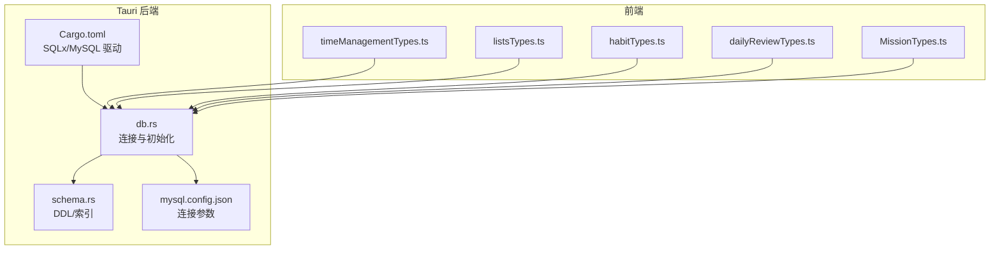
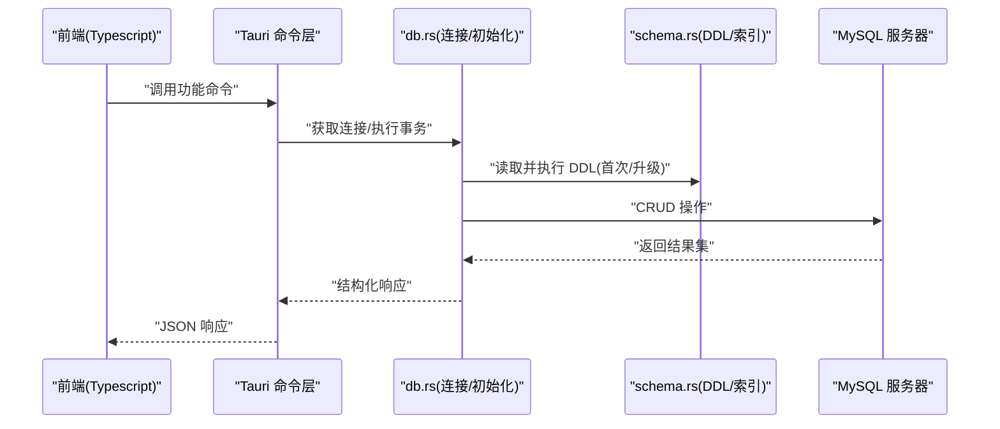
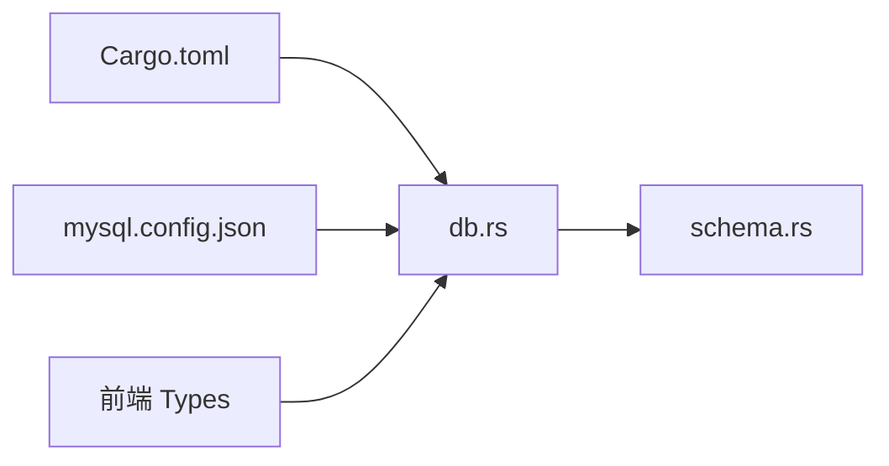

# 数据库架构设计

<cite>
**本文引用的文件**   
- [src-tauri/src/db.rs](file://src-tauri/src/db.rs)
- [src-tauri/src/schema.rs](file://src-tauri/src/schema.rs)
- [src-tauri/Cargo.toml](file://src-tauri/Cargo.toml)
- [src-tauri/mysql.config.json](file://src-tauri/mysql.config.json)
- [src/features/time-management/timeManagementTypes.ts](file://src/features/time-management/timeManagementTypes.ts)
- [src/features/lists/listsTypes.ts](file://src/features/lists/listsTypes.ts)
- [src/features/habits/habitTypes.ts](file://src/features/habits/habitTypes.ts)
- [src/features/daily-review/dailyReviewTypes.ts](file://src/features/daily-review/dailyReviewTypes.ts)
- [src/features/mission/MissionTypes.ts](file://src/features/mission/MissionTypes.ts)
</cite>

## 目录
1. [引言](#引言)
2. [项目结构](#项目结构)
3. [核心组件](#核心组件)
4. [架构总览](#架构总览)
5. [详细组件分析](#详细组件分析)
6. [依赖关系分析](#依赖关系分析)
7. [性能考虑](#性能考虑)
8. [故障排查指南](#故障排查指南)
9. [结论](#结论)
10. [附录](#附录)

## 引言
本技术文档聚焦于 FishWorker 项目的数据库架构设计，目标包括：
- 描述数据表的结构定义、字段类型与约束条件
- 解释表间关系设计与外键约束
- 记录主键策略与索引设计方案
- 说明数据模型的业务含义与实体关系映射
- 阐述数据库规范化原则与反范式化考虑
- 提供数据完整性约束与业务规则验证建议
- 描述数据库版本迁移策略与向后兼容性保证

本项目采用 Tauri + Rust 后端与 MySQL 作为持久化存储。Rust 侧通过 SQLx 访问 MySQL，并在 schema.rs 中集中维护建表语句与索引定义；前端 TypeScript 类型定义用于对齐领域模型与接口契约。

## 项目结构
与数据库相关的核心代码位于 src-tauri 目录：
- db.rs：数据库连接、初始化与通用操作封装
- schema.rs：DDL（建表、索引）与可能的初始数据脚本
- Cargo.toml：MySQL 驱动与 SQLx 等依赖声明
- mysql.config.json：MySQL 连接配置（主机、端口、用户名、密码、库名等）

图表来源
- [src-tauri/src/db.rs](file://src-tauri/src/db.rs)
- [src-tauri/src/schema.rs](file://src-tauri/src/schema.rs)
- [src-tauri/Cargo.toml](file://src-tauri/Cargo.toml)
- [src-tauri/mysql.config.json](file://src-tauri/mysql.config.json)
- [src/features/time-management/timeManagementTypes.ts](file://src/features/time-management/timeManagementTypes.ts)
- [src/features/lists/listsTypes.ts](file://src/features/lists/listsTypes.ts)
- [src/features/habits/habitTypes.ts](file://src/features/habits/habitTypes.ts)
- [src/features/daily-review/dailyReviewTypes.ts](file://src/features/daily-review/dailyReviewTypes.ts)
- [src/features/mission/MissionTypes.ts](file://src/features/mission/MissionTypes.ts)

章节来源
- [src-tauri/src/db.rs](file://src-tauri/src/db.rs)
- [src-tauri/src/schema.rs](file://src-tauri/src/schema.rs)
- [src-tauri/Cargo.toml](file://src-tauri/Cargo.toml)
- [src-tauri/mysql.config.json](file://src-tauri/mysql.config.json)

## 核心组件
- 数据库连接与初始化（db.rs）
  - 负责建立与 MySQL 的连接池、执行初始化脚本、提供事务与查询的便捷方法
  - 在应用启动时加载并执行 schema.rs 中的 DDL，确保表结构与索引存在
- 数据模型与 DDL（schema.rs）
  - 集中管理所有表的 CREATE TABLE 语句、主键与唯一性约束、索引定义
  - 可能包含初始数据插入或字典表初始化脚本
- 依赖与驱动（Cargo.toml）
  - 引入 sqlx、mysql 驱动、时间处理等依赖，支撑异步数据库访问
- 连接配置（mysql.config.json）
  - 保存 MySQL 主机、端口、用户、密码、数据库名等连接信息
- 前端类型定义（各 feature 下的 Types）
  - 与后端表结构保持语义一致，便于前后端协作与校验

章节来源
- [src-tauri/src/db.rs](file://src-tauri/src/db.rs)
- [src-tauri/src/schema.rs](file://src-tauri/src/schema.rs)
- [src-tauri/Cargo.toml](file://src-tauri/Cargo.toml)
- [src-tauri/mysql.config.json](file://src-tauri/mysql.config.json)

## 架构总览
下图展示了从前端到后端的请求路径以及数据库交互点：

图表来源
- [src-tauri/src/db.rs](file://src-tauri/src/db.rs)
- [src-tauri/src/schema.rs](file://src-tauri/src/schema.rs)

## 详细组件分析

### 数据表与字段定义（基于 schema.rs）
- 表清单与用途
  - 任务与时间管理类表：用于存储每日/每周计划、任务状态、优先级、时间块等
  - 清单类表：用于存储列表、条目分组、排序与元数据
  - 习惯追踪表：用于记录习惯项、打卡历史、统计聚合
  - 每日复盘表：用于记录每日回顾内容、标签、关联任务
  - 使命与目标表：用于记录使命陈述、角色、目标分解与进度
- 字段类型与约束
  - 主键：统一使用自增整数或 UUID（以 schema.rs 为准），确保全局唯一
  - 非空与默认值：关键字段设置 NOT NULL 与合理默认值，避免脏数据
  - 唯一性：对业务键（如名称、编码）添加 UNIQUE 约束
  - 外键：为跨表引用添加 ON DELETE/ON UPDATE 策略，保障一致性
  - 时间戳：创建时间与更新时间使用 TIMESTAMP/DATETIME，并设置自动更新
- 索引设计
  - 单列索引：高频查询字段（如日期、状态、分类）
  - 复合索引：组合查询条件（如“日期+状态”、“列表ID+排序”）
  - 覆盖索引：针对常用报表查询优化
  - 唯一索引：防止重复数据写入
- 示例参考路径
  - 任务与时间管理：[src-tauri/src/schema.rs](file://src-tauri/src/schema.rs)
  - 清单与条目：[src-tauri/src/schema.rs](file://src-tauri/src/schema.rs)
  - 习惯与打卡：[src-tauri/src/schema.rs](file://src-tauri/src/schema.rs)
  - 每日复盘：[src-tauri/src/schema.rs](file://src-tauri/src/schema.rs)
  - 使命与目标：[src-tauri/src/schema.rs](file://src-tauri/src/schema.rs)

章节来源
- [src-tauri/src/schema.rs](file://src-tauri/src/schema.rs)

### 实体关系与外键约束
- 一对多关系
  - 列表 -> 条目：一个列表包含多个条目
  - 周计划 -> 日计划：一周包含若干天
  - 习惯 -> 打卡记录：一个习惯有多条打卡历史
- 多对多关系
  - 任务 <-> 标签：通过中间表实现
  - 目标 <-> 里程碑：通过中间表或子表实现
- 外键策略
  - 删除策略：根据业务选择 RESTRICT、CASCADE 或 SET NULL
  - 更新策略：通常使用 NO ACTION 或 CASCADE，避免级联更新导致不一致
- 示例参考路径
  - 关系建模与外键定义：[src-tauri/src/schema.rs](file://src-tauri/src/schema.rs)

章节来源
- [src-tauri/src/schema.rs](file://src-tauri/src/schema.rs)

### 主键策略与索引方案
- 主键策略
  - 自增整数：适合顺序写入与范围扫描
  - UUID：适合分布式与合并场景，避免冲突
- 索引方案
  - 查询热点优先：按 WHERE、JOIN、ORDER BY 的常见模式设计
  - 选择性高的字段优先：区分度越高，索引效果越好
  - 避免过度索引：权衡写入性能与空间占用
- 示例参考路径
  - 主键与索引定义：[src-tauri/src/schema.rs](file://src-tauri/src/schema.rs)

章节来源
- [src-tauri/src/schema.rs](file://src-tauri/src/schema.rs)

### 数据模型的业务含义与实体关系映射
- 时间管理
  - 任务：标题、描述、优先级、截止日期、状态、所属列表/项目
  - 周/日视图：时间块、时间段划分、完成标记
- 清单
  - 列表：名称、描述、可见性、排序
  - 条目：内容、附件、标签、分组、排序
- 习惯
  - 习惯项：名称、频率、提醒、目标次数
  - 打卡记录：日期、是否完成、备注
- 每日复盘
  - 复盘内容：文本、标签、关联任务、情绪评分
- 使命与目标
  - 使命陈述：愿景、价值观、角色
  - 目标：周期、指标、进度、里程碑
- 前端类型对齐
  - 时间管理类型：[src/features/time-management/timeManagementTypes.ts](file://src/features/time-management/timeManagementTypes.ts)
  - 清单类型：[src/features/lists/listsTypes.ts](file://src/features/lists/listsTypes.ts)
  - 习惯类型：[src/features/habits/habitTypes.ts](file://src/features/habits/habitTypes.ts)
  - 每日复盘类型：[src/features/daily-review/dailyReviewTypes.ts](file://src/features/daily-review/dailyReviewTypes.ts)
  - 使命类型：[src/features/mission/MissionTypes.ts](file://src/features/mission/MissionTypes.ts)

章节来源
- [src/features/time-management/timeManagementTypes.ts](file://src/features/time-management/timeManagementTypes.ts)
- [src/features/lists/listsTypes.ts](file://src/features/lists/listsTypes.ts)
- [src/features/habits/habitTypes.ts](file://src/features/habits/habitTypes.ts)
- [src/features/daily-review/dailyReviewTypes.ts](file://src/features/daily-review/dailyReviewTypes.ts)
- [src/features/mission/MissionTypes.ts](file://src/features/mission/MissionTypes.ts)

### 规范化与反范式化
- 规范化原则
  - 消除冗余：将公共属性抽取到独立表
  - 原子性：每个字段不可再分
  - 减少更新异常：通过外键与约束保证一致性
- 反范式化考虑
  - 预聚合：为高频统计字段（如打卡计数、完成率）增加冗余字段
  - 宽表：为报表查询构建快照表，降低 JOIN 开销
  - 分区与归档：按时间维度拆分大表，提升查询与维护效率

### 数据完整性与业务规则验证
- 约束层面
  - 非空、唯一、检查约束（CHECK）、外键约束
- 应用层验证
  - 输入校验：长度、格式、取值范围
  - 业务规则：状态机转换、权限控制、并发控制（乐观锁版本号）
- 示例参考路径
  - 约束与检查逻辑：[src-tauri/src/schema.rs](file://src-tauri/src/schema.rs)

章节来源
- [src-tauri/src/schema.rs](file://src-tauri/src/schema.rs)

### 数据库版本迁移与向后兼容
- 迁移策略
  - 增量式 DDL：新增字段、索引、表时提供向上迁移脚本
  - 回滚支持：保留向下迁移脚本，便于紧急恢复
  - 幂等执行：使用 IF NOT EXISTS 或条件判断，避免重复执行失败
- 兼容性保证
  - 字段扩展：新增可选字段，不破坏旧客户端
  - 枚举扩展：新增枚举值，兼容旧值
  - 渐进发布：先部署只读变更，再逐步启用写逻辑
- 示例参考路径
  - 迁移脚本组织与执行入口：[src-tauri/src/db.rs](file://src-tauri/src/db.rs)、[src-tauri/src/schema.rs](file://src-tauri/src/schema.rs)

章节来源
- [src-tauri/src/db.rs](file://src-tauri/src/db.rs)
- [src-tauri/src/schema.rs](file://src-tauri/src/schema.rs)

## 依赖关系分析
- 运行时依赖
  - SQLx 与 MySQL 驱动：由 Cargo.toml 声明，提供异步数据库访问能力
- 配置依赖
  - mysql.config.json：提供连接参数，供 db.rs 在启动时读取
- 前端契约依赖
  - 各 feature 的 Types 文件：与后端表结构保持一致，减少序列化/反序列化错误

图表来源
- [src-tauri/Cargo.toml](file://src-tauri/Cargo.toml)
- [src-tauri/mysql.config.json](file://src-tauri/mysql.config.json)
- [src-tauri/src/db.rs](file://src-tauri/src/db.rs)
- [src-tauri/src/schema.rs](file://src-tauri/src/schema.rs)

章节来源
- [src-tauri/Cargo.toml](file://src-tauri/Cargo.toml)
- [src-tauri/mysql.config.json](file://src-tauri/mysql.config.json)
- [src-tauri/src/db.rs](file://src-tauri/src/db.rs)
- [src-tauri/src/schema.rs](file://src-tauri/src/schema.rs)

## 性能考虑
- 索引优化
  - 针对热点查询建立合适索引，避免全表扫描
  - 合理使用复合索引，匹配查询谓词顺序
- 查询优化
  - 避免 SELECT *，仅选取必要字段
  - 分页与限制返回行数，减少网络传输
- 连接池
  - 合理配置最大连接数与空闲超时，避免资源耗尽
- 写入优化
  - 批量插入与事务合并，减少往返开销
- 缓存与预计算
  - 对热点统计数据进行缓存或预聚合，降低实时计算压力

## 故障排查指南
- 连接问题
  - 检查 mysql.config.json 中的主机、端口、用户名、密码、库名是否正确
  - 确认防火墙与安全组允许访问 MySQL 端口
- 初始化失败
  - 查看 db.rs 初始化流程与 schema.rs 的 DDL 语法
  - 确认 MySQL 版本与 SQL 语法兼容性
- 约束冲突
  - 唯一性冲突：检查业务键是否重复
  - 外键约束：确认被引用记录是否存在
- 性能问题
  - 使用 EXPLAIN 分析慢查询，补充或调整索引
  - 监控连接池使用情况，避免连接泄漏

章节来源
- [src-tauri/mysql.config.json](file://src-tauri/mysql.config.json)
- [src-tauri/src/db.rs](file://src-tauri/src/db.rs)
- [src-tauri/src/schema.rs](file://src-tauri/src/schema.rs)

## 结论
FishWorker 的数据库架构围绕 Tauri + Rust + MySQL 展开，通过 schema.rs 集中管理 DDL 与索引，db.rs 负责连接与初始化，配合前端 Types 保持领域模型一致性。建议在后续迭代中持续完善迁移脚本、索引策略与性能监控，确保数据一致性与系统可扩展性。

## 附录
- 关键文件路径
  - 数据库连接与初始化：[src-tauri/src/db.rs](file://src-tauri/src/db.rs)
  - 数据模型与 DDL：[src-tauri/src/schema.rs](file://src-tauri/src/schema.rs)
  - 依赖声明：[src-tauri/Cargo.toml](file://src-tauri/Cargo.toml)
  - 连接配置：[src-tauri/mysql.config.json](file://src-tauri/mysql.config.json)
  - 前端类型定义：
    - [src/features/time-management/timeManagementTypes.ts](file://src/features/time-management/timeManagementTypes.ts)
    - [src/features/lists/listsTypes.ts](file://src/features/lists/listsTypes.ts)
    - [src/features/habits/habitTypes.ts](file://src/features/habits/habitTypes.ts)
    - [src/features/daily-review/dailyReviewTypes.ts](file://src/features/daily-review/dailyReviewTypes.ts)
    - [src/features/mission/MissionTypes.ts](file://src/features/mission/MissionTypes.ts)