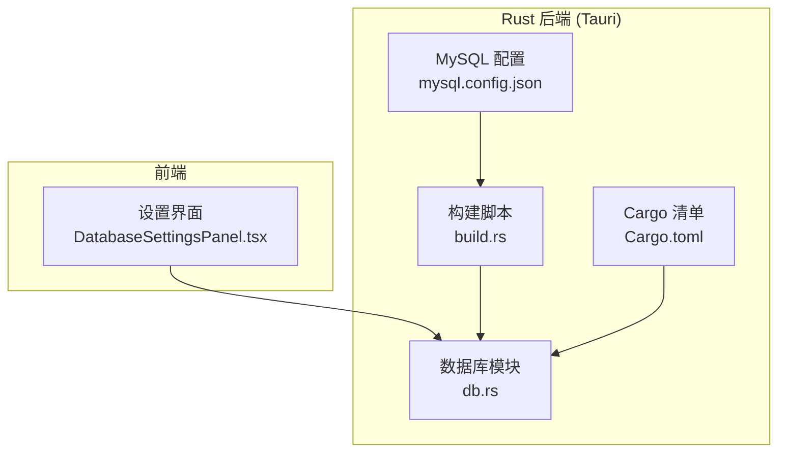
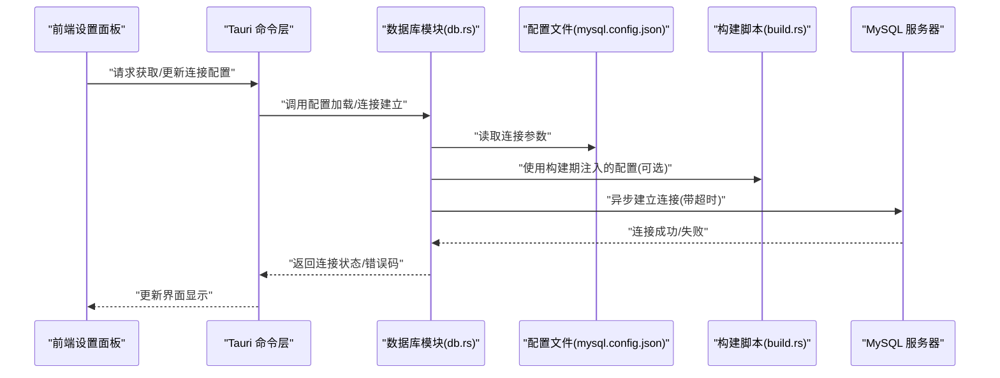
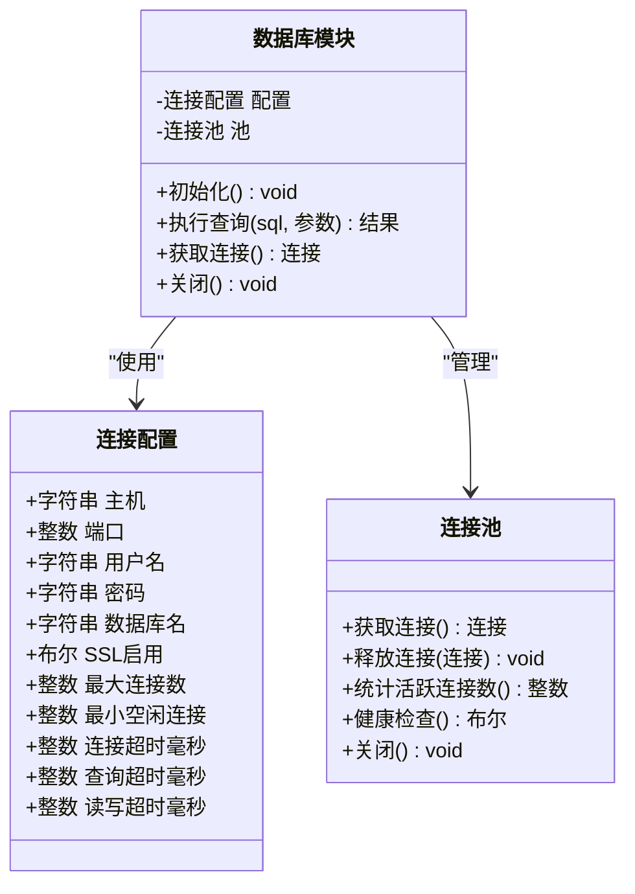
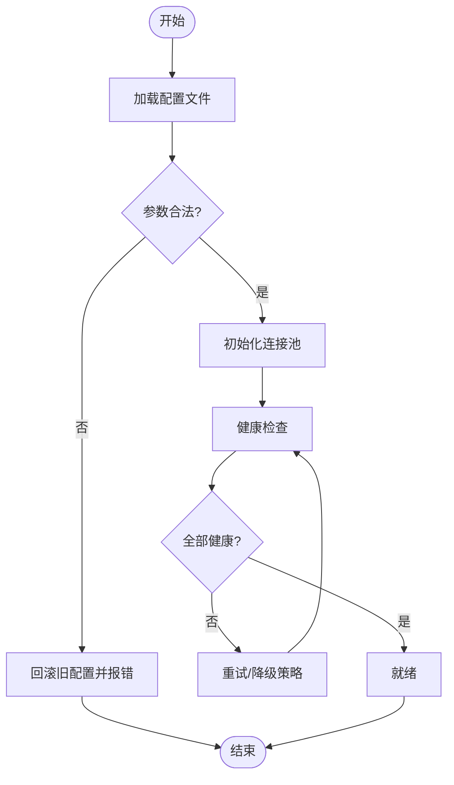
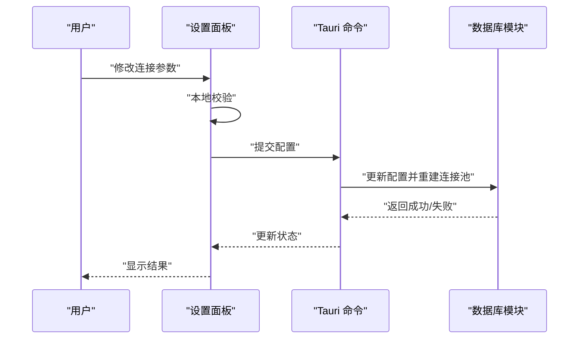
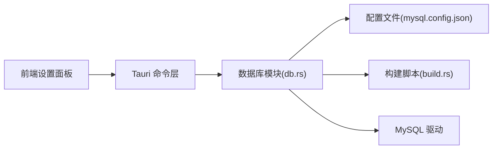

# 数据库连接管理

<cite>
**本文引用的文件**   
- [src-tauri/src/db.rs](file://src-tauri/src/db.rs)
- [src-tauri/mysql.config.json](file://src-tauri/mysql.config.json)
- [src-tauri/Cargo.toml](file://src-tauri/Cargo.toml)
- [src-tauri/build.rs](file://src-tauri/build.rs)
- [src/features/settings/components/DatabaseSettingsPanel.tsx](file://src/features/settings/components/DatabaseSettingsPanel.tsx)
</cite>

## 目录
1. [简介](#简介)
2. [项目结构](#项目结构)
3. [核心组件](#核心组件)
4. [架构总览](#架构总览)
5. [详细组件分析](#详细组件分析)
6. [依赖关系分析](#依赖关系分析)
7. [性能考虑](#性能考虑)
8. [故障排查指南](#故障排查指南)
9. [结论](#结论)
10. [附录](#附录)

## 简介
本技术文档聚焦于数据库连接管理系统，围绕 MySQL 连接池的配置与初始化、异步连接建立、连接生命周期管理、状态监控与故障恢复策略、配置最佳实践与安全建议、连接泄漏检测与内存优化、多环境配置管理与动态更新机制等方面展开。文档以仓库中 Rust 后端（Tauri）的数据库实现为核心，结合前端设置面板进行端到端说明，帮助读者快速理解并正确配置与维护数据库连接。

## 项目结构
本项目采用前后端分离：前端使用 React + Tauri 集成，后端通过 Rust 提供数据库访问能力。数据库相关的关键位置如下：
- Rust 后端数据库模块：负责加载配置、建立连接、执行查询等
- 配置文件：MySQL 连接参数集中存放
- Cargo 构建脚本：在构建期将配置注入到二进制中
- 前端设置面板：用于可视化查看和修改数据库连接配置

图表来源
- [src/features/settings/components/DatabaseSettingsPanel.tsx](file://src/features/settings/components/DatabaseSettingsPanel.tsx)
- [src-tauri/src/db.rs](file://src-tauri/src/db.rs)
- [src-tauri/mysql.config.json](file://src-tauri/mysql.config.json)
- [src-tauri/build.rs](file://src-tauri/build.rs)
- [src-tauri/Cargo.toml](file://src-tauri/Cargo.toml)

章节来源
- [src-tauri/src/db.rs](file://src-tauri/src/db.rs)
- [src-tauri/mysql.config.json](file://src-tauri/mysql.config.json)
- [src-tauri/Cargo.toml](file://src-tauri/Cargo.toml)
- [src-tauri/build.rs](file://src-tauri/build.rs)
- [src/features/settings/components/DatabaseSettingsPanel.tsx](file://src/features/settings/components/DatabaseSettingsPanel.tsx)

## 核心组件
- 数据库模块（Rust）
  - 职责：读取配置、建立 MySQL 连接、封装查询接口、处理错误与超时
  - 关键点：连接参数解析、连接池大小、超时控制、错误分类与重试策略
- 配置文件（JSON）
  - 职责：集中管理主机、端口、用户名、密码、数据库名、SSL、连接池大小、超时等
  - 关键点：敏感信息保护、多环境切换、热更新支持
- 构建脚本（Rust）
  - 职责：在构建时将配置编译进二进制，便于部署时统一分发
  - 关键点：配置校验、默认值填充、环境变量覆盖
- 前端设置面板（React）
  - 职责：展示当前连接配置、允许用户编辑并保存
  - 关键点：表单校验、变更回滚、权限控制

章节来源
- [src-tauri/src/db.rs](file://src-tauri/src/db.rs)
- [src-tauri/mysql.config.json](file://src-tauri/mysql.config.json)
- [src-tauri/build.rs](file://src-tauri/build.rs)
- [src/features/settings/components/DatabaseSettingsPanel.tsx](file://src/features/settings/components/DatabaseSettingsPanel.tsx)

## 架构总览
下图展示了从前端触发到后端数据库连接的完整流程，包括配置加载、连接建立、查询执行与结果返回。

图表来源
- [src/features/settings/components/DatabaseSettingsPanel.tsx](file://src/features/settings/components/DatabaseSettingsPanel.tsx)
- [src-tauri/src/db.rs](file://src-tauri/src/db.rs)
- [src-tauri/mysql.config.json](file://src-tauri/mysql.config.json)
- [src-tauri/build.rs](file://src-tauri/build.rs)

## 详细组件分析

### 数据库模块（db.rs）
- 功能要点
  - 配置加载：优先使用构建期注入的配置，其次回退到运行时 JSON 配置
  - 连接建立：异步创建 MySQL 连接，支持 SSL 与认证参数
  - 连接池：根据配置项设置最大连接数、最小空闲连接等
  - 超时控制：连接超时、查询超时、读写超时
  - 错误处理：区分网络错误、认证失败、SQL 语法错误、超时等，并提供可观测指标
  - 生命周期：连接复用、健康检查、自动重连、优雅关闭
- 关键数据结构
  - 连接配置对象：包含主机、端口、用户、密码、库名、SSL 开关、连接池大小、各类超时
  - 连接池句柄：对外暴露获取连接、释放连接、统计活跃连接数等方法
- 复杂度与性能
  - 连接建立为 I/O 密集型操作，时间复杂度取决于网络延迟与握手开销
  - 连接池命中率为关键指标，命中率越高，平均响应时间越低
- 优化机会
  - 合理设置连接池大小与超时，避免过多上下文切换
  - 启用连接健康检查，减少脏连接带来的失败率
  - 对高频查询使用连接复用与预编译语句

图表来源
- [src-tauri/src/db.rs](file://src-tauri/src/db.rs)

章节来源
- [src-tauri/src/db.rs](file://src-tauri/src/db.rs)

### 配置文件（mysql.config.json）
- 字段说明
  - 基础连接：主机、端口、用户名、密码、数据库名
  - 安全选项：SSL 启用、证书路径、客户端证书
  - 连接池：最大连接数、最小空闲连接、最大空闲时间
  - 超时：连接超时、查询超时、读写超时
- 多环境管理
  - 通过不同文件名或环境变量覆盖，如 dev/prod 配置
  - 构建期注入生产配置，运行期仅保留必要参数
- 动态更新
  - 支持热重载：监听配置变更事件，重新初始化连接池
  - 变更校验：在应用前进行参数合法性检查，失败则回滚

图表来源
- [src-tauri/mysql.config.json](file://src-tauri/mysql.config.json)

章节来源
- [src-tauri/mysql.config.json](file://src-tauri/mysql.config.json)

### 构建脚本（build.rs）
- 作用
  - 在构建阶段读取 mysql.config.json，生成常量或嵌入二进制
  - 提供默认值与必填字段校验，确保运行期不缺少关键配置
- 优势
  - 部署简化：无需额外分发配置文件
  - 安全性提升：敏感信息可在 CI 中注入，避免进入版本库
- 注意事项
  - 构建产物需与目标环境一致，避免跨环境误用
  - 如需热更新，应保留运行期配置路径作为回退

章节来源
- [src-tauri/build.rs](file://src-tauri/build.rs)
- [src-tauri/Cargo.toml](file://src-tauri/Cargo.toml)

### 前端设置面板（DatabaseSettingsPanel.tsx）
- 功能
  - 展示当前连接配置，支持编辑与保存
  - 提供连接测试按钮，触发后端验证
  - 显示连接状态与健康检查结果
- 交互流程
  - 用户修改配置 -> 前端校验 -> 调用后端命令 -> 后端更新配置并重建连接池 -> 返回结果 -> 前端刷新状态
- 安全与体验
  - 密码输入框脱敏显示
  - 变更撤销与确认提示
  - 权限控制：仅管理员可修改

图表来源
- [src/features/settings/components/DatabaseSettingsPanel.tsx](file://src/features/settings/components/DatabaseSettingsPanel.tsx)
- [src-tauri/src/db.rs](file://src-tauri/src/db.rs)

章节来源
- [src/features/settings/components/DatabaseSettingsPanel.tsx](file://src/features/settings/components/DatabaseSettingsPanel.tsx)

## 依赖关系分析
- 外部依赖
  - MySQL 驱动：用于建立 TCP/TLS 连接与协议交互
  - 配置解析库：读取 JSON 与环境变量
  - 日志与指标库：记录连接事件与性能指标
- 内部耦合
  - 数据库模块依赖配置与构建脚本输出
  - 前端通过 Tauri 命令与后端通信，不直接访问数据库
- 潜在循环依赖
  - 应避免数据库模块反向依赖前端或配置热更新回调造成循环

图表来源
- [src/features/settings/components/DatabaseSettingsPanel.tsx](file://src/features/settings/components/DatabaseSettingsPanel.tsx)
- [src-tauri/src/db.rs](file://src-tauri/src/db.rs)
- [src-tauri/mysql.config.json](file://src-tauri/mysql.config.json)
- [src-tauri/build.rs](file://src-tauri/build.rs)

章节来源
- [src-tauri/src/db.rs](file://src-tauri/src/db.rs)
- [src-tauri/mysql.config.json](file://src-tauri/mysql.config.json)
- [src-tauri/build.rs](file://src-tauri/build.rs)
- [src/features/settings/components/DatabaseSettingsPanel.tsx](file://src/features/settings/components/DatabaseSettingsPanel.tsx)

## 性能考虑
- 连接池大小
  - 依据并发度与 CPU 核数估算，避免过大导致上下文切换开销
- 超时设置
  - 连接超时与查询超时需匹配业务 SLA，防止长尾请求拖垮系统
- 健康检查
  - 定期探测连接可用性，提前剔除失效连接
- 指标与告警
  - 监控活跃连接数、等待队列长度、错误率、P95/P99 延迟
- 内存优化
  - 限制单次查询结果集大小，避免大对象驻留
  - 及时释放连接与缓冲区，避免泄漏

[本节为通用指导，不涉及具体文件分析]

## 故障排查指南
- 常见问题
  - 认证失败：检查用户名、密码、权限与白名单
  - 连接超时：核对主机、端口、防火墙与网络连通性
  - SQL 错误：定位具体语句与参数，检查表结构与索引
  - 连接泄漏：统计未释放连接，回溯调用栈
- 诊断步骤
  - 查看后端日志中的错误码与堆栈
  - 使用健康检查接口验证连接可用性
  - 对比不同环境的配置差异
- 恢复策略
  - 自动重试与指数退避
  - 降级到只读副本或缓存
  - 熔断与限流保护上游服务

章节来源
- [src-tauri/src/db.rs](file://src-tauri/src/db.rs)

## 结论
通过合理的配置管理、异步连接建立、完善的生命周期与监控机制，以及严格的安全与性能策略，数据库连接管理系统能够在多环境下稳定运行。建议在 CI/CD 中固化配置校验与测试，在生产环境启用指标采集与告警，持续优化连接池与超时参数，保障系统高可用与低延迟。

[本节为总结性内容，不涉及具体文件分析]

## 附录
- 最佳实践清单
  - 使用环境变量注入敏感信息，避免明文存储
  - 开启 SSL 与强密码策略，限制最小 TLS 版本
  - 分库分表与读写分离，降低单点压力
  - 灰度发布与回滚预案，确保配置变更可控
- 动态配置更新机制
  - 监听配置变更事件，原子替换连接池
  - 变更前进行全量校验，失败即回滚
  - 记录变更审计日志，便于追溯

[本节为补充信息，不涉及具体文件分析]