# 数据库集成

<cite>
**本文引用的文件**   
- [src-tauri/src/db.rs](file://src-tauri/src/db.rs)
- [src-tauri/src/schema.rs](file://src-tauri/src/schema.rs)
- [src-tauri/mysql.config.json](file://src-tauri/mysql.config.json)
- [src-tauri/Cargo.toml](file://src-tauri/Cargo.toml)
- [src-tauri/build.rs](file://src-tauri/build.rs)
- [src-tauri/src/lib.rs](file://src-tauri/src/lib.rs)
- [src-tauri/src/main.rs](file://src-tauri/src/main.rs)
- [src-tauri/src/daily_review.rs](file://src-tauri/src/daily_review.rs)
- [src-tauri/src/list.rs](file://src-tauri/src/list.rs)
- [src-tauri/src/mission.rs](file://src-tauri/src/mission.rs)
- [src-tauri/src/time_management.rs](file://src-tauri/src/time_management.rs)
- [src/lib/createSyncEngine.ts](file://src/lib/createSyncEngine.ts)
- [src/lib/createSyncEngine.test.ts](file://src/lib/createSyncEngine.test.ts)
- [src-tauri/src/local_db.rs](file://src-tauri/src/local_db.rs)
- [src-tauri/src/local_schema.rs](file://src-tauri/src/local_schema.rs)
</cite>

## 更新摘要
**变更内容**   
- 引入CR-SQLite离线优先架构，支持多设备冲突解决和数据同步
- 从直接SQLite使用迁移到新的离线优先模式
- 新增本地数据库层和同步引擎实现
- 重构数据访问层以支持离线操作和在线同步

## 目录
1. [简介](#简介)
2. [项目结构](#项目结构)
3. [核心组件](#核心组件)
4. [架构总览](#架构总览)
5. [详细组件分析](#详细组件分析)
6. [依赖关系分析](#依赖关系分析)
7. [性能考虑](#性能考虑)
8. [故障排查指南](#故障排查指南)
9. [结论](#结论)
10. [附录](#附录)

## 简介
本技术文档聚焦于 FishWorker 项目的数据库集成方案，围绕 CR-SQLite 离线优先架构、连接池管理、连接生命周期控制、异步数据库操作与事务处理机制展开。新架构支持多设备冲突解决和数据同步，从直接 SQLite 使用迁移到离线优先模式。文档同时覆盖数据库 schema 设计、表关系映射、数据迁移策略与版本管理、查询优化与索引设计原则、错误处理与重试机制、以及备份恢复与数据完整性保证等主题。

## 项目结构
后端采用 Tauri + Rust 实现，数据库相关代码集中在 src-tauri 目录中，前端包含同步引擎实现：
- db.rs：数据库连接、连接池初始化、基础 CRUD 封装、事务与异步执行入口
- local_db.rs：本地 SQLite 数据库操作，支持离线模式
- local_schema.rs：本地数据库表结构定义
- schema.rs：主数据库表结构定义、字段类型、约束与索引声明
- createSyncEngine.ts：CR-SQLite 同步引擎实现，处理冲突解决和数据同步
- daily_review.rs、list.rs、mission.rs、time_management.rs：领域层对数据库的调用封装

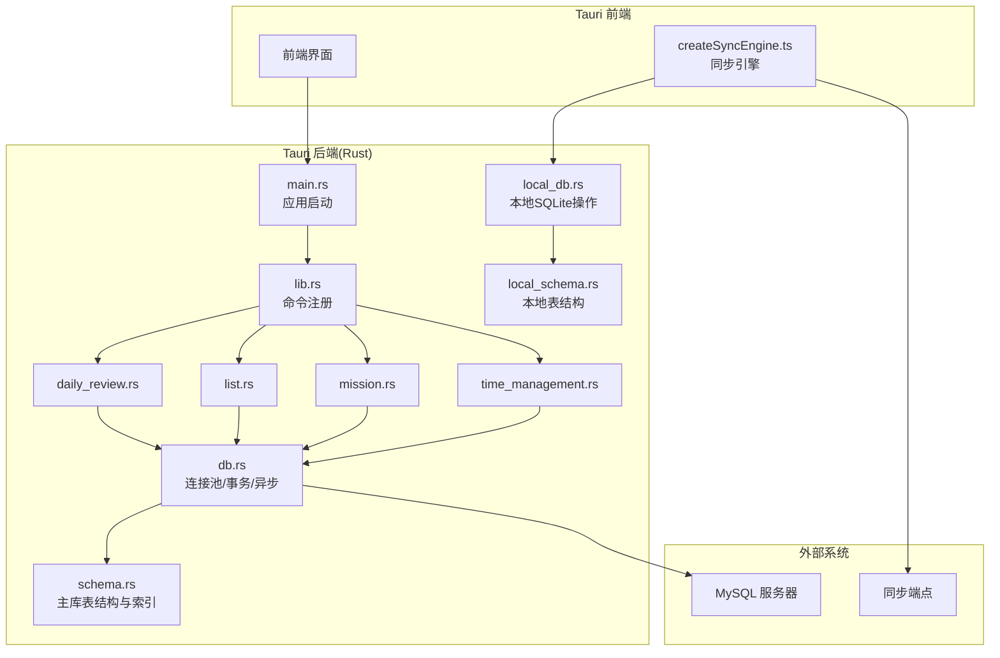

**图表来源**
- [src-tauri/src/main.rs](file://src-tauri/src/main.rs)
- [src-tauri/src/lib.rs](file://src-tauri/src/lib.rs)
- [src-tauri/src/db.rs](file://src-tauri/src/db.rs)
- [src-tauri/src/local_db.rs](file://src-tauri/src/local_db.rs)
- [src-tauri/src/local_schema.rs](file://src-tauri/src/local_schema.rs)
- [src-tauri/src/schema.rs](file://src-tauri/src/schema.rs)
- [src/lib/createSyncEngine.ts](file://src/lib/createSyncEngine.ts)

**章节来源**
- [src-tauri/src/main.rs](file://src-tauri/src/main.rs)
- [src-tauri/src/lib.rs](file://src-tauri/src/lib.rs)
- [src-tauri/src/db.rs](file://src-tauri/src/db.rs)
- [src-tauri/src/local_db.rs](file://src-tauri/src/local_db.rs)
- [src-tauri/src/local_schema.rs](file://src-tauri/src/local_schema.rs)
- [src-tauri/src/schema.rs](file://src-tauri/src/schema.rs)
- [src/lib/createSyncEngine.ts](file://src/lib/createSyncEngine.ts)

## 核心组件
- **离线优先架构**
  - 基于 CR-SQLite 实现冲突解决算法，支持多设备并发编辑
  - 本地 SQLite 数据库作为主要数据存储，确保离线可用性
  - 自动同步机制在连接恢复时合并本地更改
- 连接池与连接生命周期
  - 在主数据库连接池中复用底层连接，避免频繁握手开销
  - 通过配置项控制最大连接数、空闲超时、连接存活时间等
  - 优雅关闭时释放所有连接并等待未完成任务完成
- 异步数据库操作
  - 使用异步驱动执行 SQL，避免阻塞事件循环
  - 将 I/O 绑定到线程池或异步运行时，提高并发吞吐
- 事务处理
  - 提供显式事务 API，支持提交与回滚
  - 自动传播上下文中的连接，确保同一事务内共享连接
- Schema 与迁移
  - 集中维护表结构定义与索引策略
  - 通过构建期脚本或独立迁移工具进行版本化变更
- 领域服务封装
  - 各业务模块仅暴露领域方法，内部统一走 db.rs 提供的抽象

**章节来源**
- [src-tauri/src/db.rs](file://src-tauri/src/db.rs)
- [src-tauri/src/local_db.rs](file://src-tauri/src/local_db.rs)
- [src-tauri/src/local_schema.rs](file://src-tauri/src/local_schema.rs)
- [src-tauri/src/schema.rs](file://src-tauri/src/schema.rs)
- [src/lib/createSyncEngine.ts](file://src/lib/createSyncEngine.ts)

## 架构总览
下图展示了从前端到数据库的端到端调用路径，包括命令分发、领域服务、数据库访问层、本地存储与同步引擎的交互。

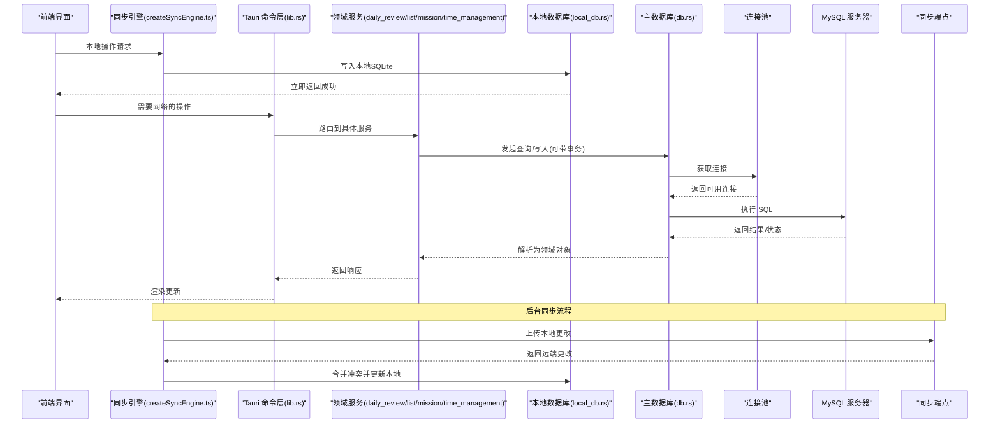

**图表来源**
- [src/lib/createSyncEngine.ts](file://src/lib/createSyncEngine.ts)
- [src-tauri/src/lib.rs](file://src-tauri/src/lib.rs)
- [src-tauri/src/daily_review.rs](file://src-tauri/src/daily_review.rs)
- [src-tauri/src/list.rs](file://src-tauri/src/list.rs)
- [src-tauri/src/mission.rs](file://src-tauri/src/mission.rs)
- [src-tauri/src/time_management.rs](file://src-tauri/src/time_management.rs)
- [src-tauri/src/db.rs](file://src-tauri/src/db.rs)
- [src-tauri/src/local_db.rs](file://src-tauri/src/local_db.rs)

## 详细组件分析

### CR-SQLite 离线优先架构
**新增** 引入基于 CR-SQLite 的离线优先架构，支持多设备冲突解决和数据同步。

- **本地存储层**
  - 使用 SQLite 作为本地数据库，确保离线环境下的数据持久化
  - 实现 CRDT（无冲突复制数据类型）算法，支持多设备并发编辑
  - 自动检测冲突并提供解决策略
- **同步引擎**
  - 后台监控网络连接状态，自动触发数据同步
  - 增量同步机制，只传输变更部分减少带宽消耗
  - 冲突检测和解决，支持手动和自动两种模式
- **数据一致性**
  - 最终一致性模型，保证所有设备最终达到相同状态
  - 操作日志记录，支持撤销和重做功能
  - 版本号管理，确保数据同步的顺序性

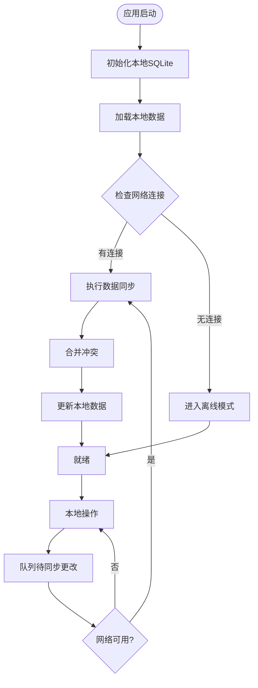

**图表来源**
- [src/lib/createSyncEngine.ts](file://src/lib/createSyncEngine.ts)
- [src-tauri/src/local_db.rs](file://src-tauri/src/local_db.rs)

**章节来源**
- [src/lib/createSyncEngine.ts](file://src/lib/createSyncEngine.ts)
- [src-tauri/src/local_db.rs](file://src-tauri/src/local_db.rs)
- [src-tauri/src/local_schema.rs](file://src-tauri/src/local_schema.rs)

### 连接池管理与连接生命周期
- 初始化阶段
  - 读取 mysql.config.json 的连接参数
  - 创建连接池实例，设置最大连接数、最小空闲连接、连接超时等
  - 预热少量连接以减少冷启动延迟
- 运行期
  - 每次请求从池中借出连接，归还时检查健康度
  - 监控活跃连接数、等待队列长度、慢查询比例
- 关闭阶段
  - 停止接受新任务，等待进行中任务完成
  - 关闭所有连接并释放资源

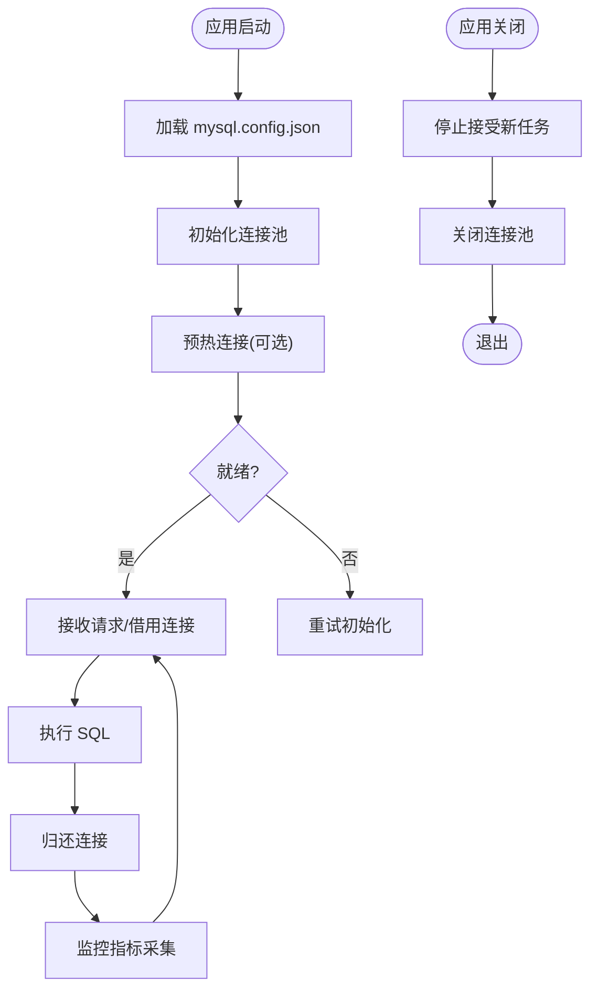

**图表来源**
- [src-tauri/src/db.rs](file://src-tauri/src/db.rs)
- [src-tauri/mysql.config.json](file://src-tauri/mysql.config.json)

**章节来源**
- [src-tauri/src/db.rs](file://src-tauri/src/db.rs)
- [src-tauri/mysql.config.json](file://src-tauri/mysql.config.json)

### 异步数据库操作与事务处理
- 异步执行
  - 使用异步驱动执行 SQL，避免阻塞主线程
  - 批量操作采用并行批处理，结合连接池限制并发度
- 事务模型
  - 显式开启事务，支持嵌套逻辑通过保存点模拟
  - 失败时自动回滚，成功则提交
  - 事务内共享同一连接，防止跨连接不一致

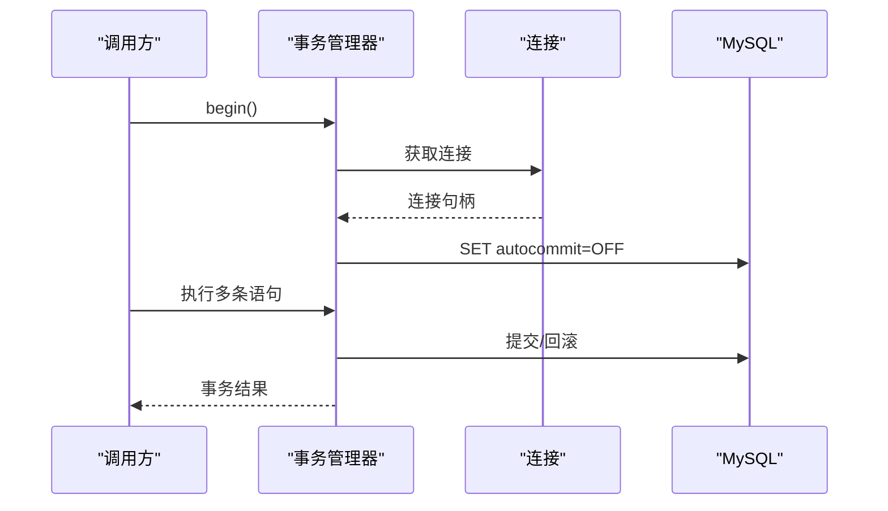

**图表来源**
- [src-tauri/src/db.rs](file://src-tauri/src/db.rs)

**章节来源**
- [src-tauri/src/db.rs](file://src-tauri/src/db.rs)

### 数据库 Schema 设计与表关系映射
- 表结构设计
  - 每个业务域对应若干表，包含主键、外键、唯一约束与常用索引
  - 字段类型选择遵循"够用且可扩展"的原则，避免过度泛型
- 关系映射
  - 一对多、多对一通过外键表达，必要时引入中间表实现多对多
  - 软删除通过布尔标志位实现，保留审计轨迹
- 索引策略
  - 针对高频查询条件建立复合索引，遵循最左前缀原则
  - 区分高基数与低基数列，避免无效索引

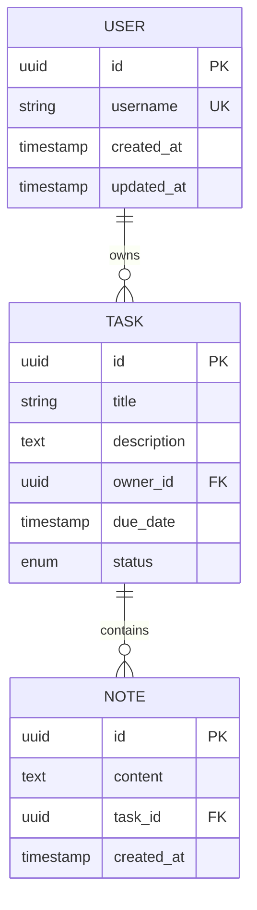

**图表来源**
- [src-tauri/src/schema.rs](file://src-tauri/src/schema.rs)

**章节来源**
- [src-tauri/src/schema.rs](file://src-tauri/src/schema.rs)

### 数据迁移策略与版本管理
- 版本化迁移
  - 每个迁移文件包含版本号、向上/向下脚本
  - 记录已执行迁移的版本元数据表，确保幂等
- 构建期校验
  - 在 build.rs 中校验当前 schema 与目标版本一致
  - 生成类型安全的查询接口（若使用代码生成）
- 灰度发布
  - 先部署只读迁移，再滚动升级应用，最后执行写迁移

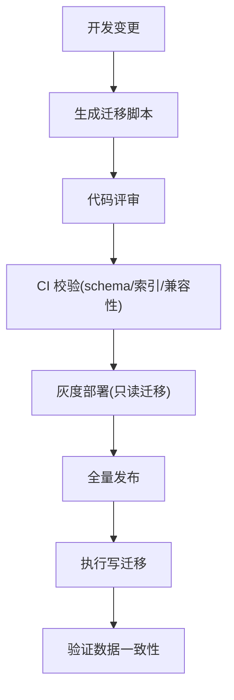

**图表来源**
- [src-tauri/build.rs](file://src-tauri/build.rs)
- [src-tauri/src/schema.rs](file://src-tauri/src/schema.rs)

**章节来源**
- [src-tauri/build.rs](file://src-tauri/build.rs)
- [src-tauri/src/schema.rs](file://src-tauri/src/schema.rs)

### 查询优化与索引设计原则
- 查询优化
  - 优先使用覆盖索引减少回表
  - 分页采用基于游标的方式替代 OFFSET
  - 合并多次小查询为一次批量查询
- 索引设计
  - 复合索引顺序按选择性从高到低排列
  - 避免在函数或表达式上使用索引列
  - 定期分析慢查询日志，调整索引与查询计划

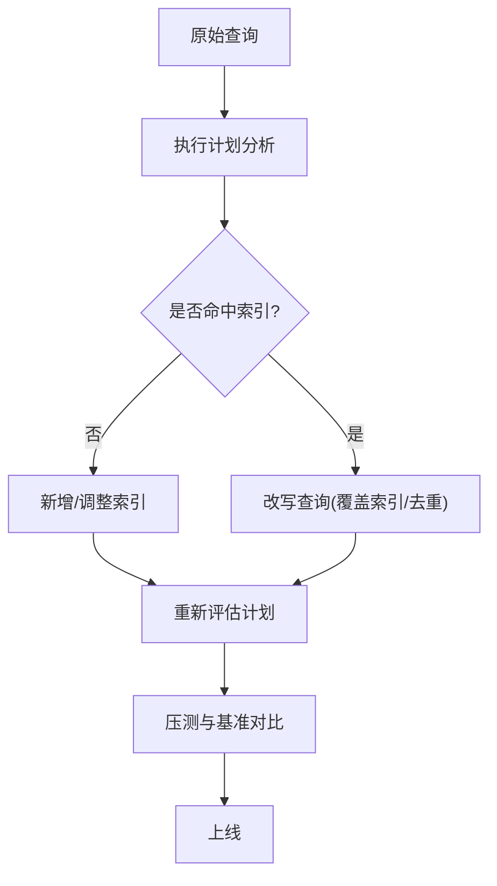

**图表来源**
- [src-tauri/src/schema.rs](file://src-tauri/src/schema.rs)

**章节来源**
- [src-tauri/src/schema.rs](file://src-tauri/src/schema.rs)

### 错误处理与重试机制
- 错误分类
  - 网络类：连接中断、超时
  - 数据类：唯一冲突、死锁
  - 业务类：权限不足、参数非法
- 重试策略
  - 对瞬态错误采用指数退避重试，限制最大次数
  - 对幂等操作允许安全重试，非幂等需加分布式锁或去重键
- 降级与熔断
  - 连续失败触发熔断，快速失败保护上游
  - 降级路径返回缓存或默认值

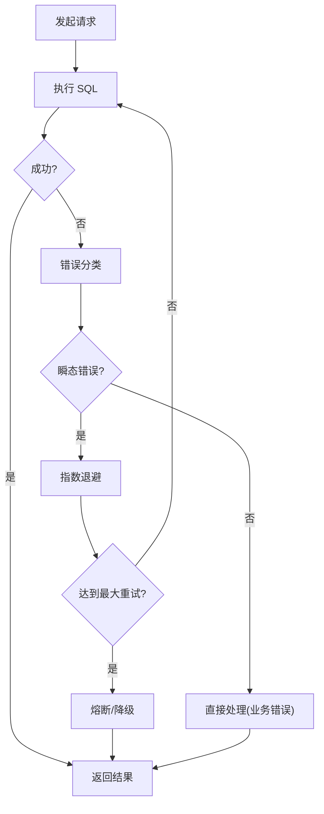

**图表来源**
- [src-tauri/src/db.rs](file://src-tauri/src/db.rs)

**章节来源**
- [src-tauri/src/db.rs](file://src-tauri/src/db.rs)

### 备份恢复与数据完整性保证
- 备份策略
  - 全量备份：每日一次，增量备份：每小时一次
  - 异地容灾：跨机房/跨云存储
- 恢复演练
  - 定期演练恢复流程，验证 RPO/RTO 指标
- 完整性保障
  - 关键路径启用事务与外键约束
  - 数据校验：导入前后做哈希校验与抽样比对

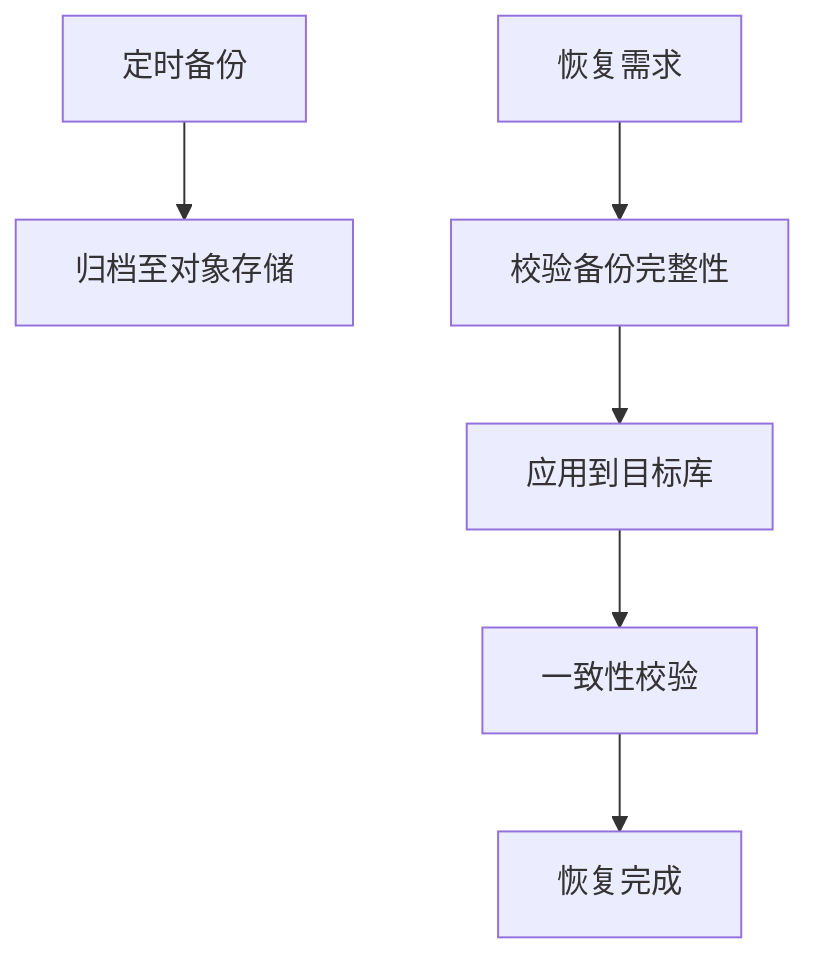

**图表来源**
- [src-tauri/src/db.rs](file://src-tauri/src/db.rs)

**章节来源**
- [src-tauri/src/db.rs](file://src-tauri/src/db.rs)

### 领域服务与数据库访问层协作
- 职责划分
  - 领域服务负责业务编排与规则校验
  - 数据库访问层负责 SQL 组装、事务边界与异常转换
- 典型流程
  - 列表/详情/增删改查均通过 db.rs 的统一接口
  - 复杂查询拆分为多个原子操作，组合后返回聚合结果

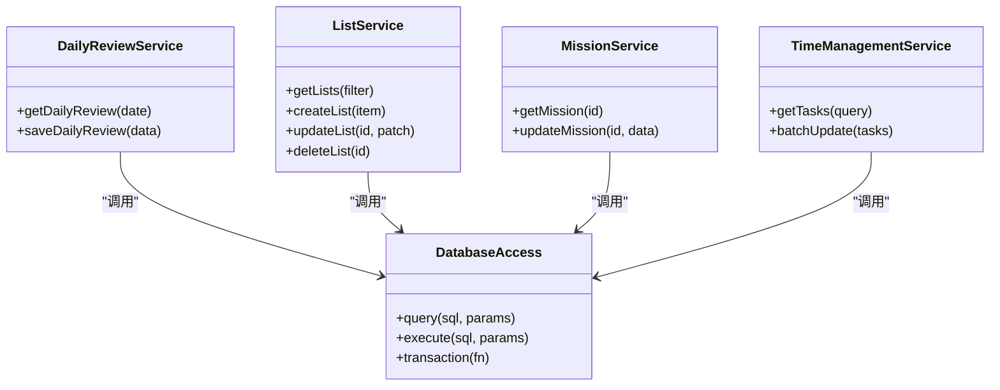

**图表来源**
- [src-tauri/src/daily_review.rs](file://src-tauri/src/daily_review.rs)
- [src-tauri/src/list.rs](file://src-tauri/src/list.rs)
- [src-tauri/src/mission.rs](file://src-tauri/src/mission.rs)
- [src-tauri/src/time_management.rs](file://src-tauri/src/time_management.rs)
- [src-tauri/src/db.rs](file://src-tauri/src/db.rs)

**章节来源**
- [src-tauri/src/daily_review.rs](file://src-tauri/src/daily_review.rs)
- [src-tauri/src/list.rs](file://src-tauri/src/list.rs)
- [src-tauri/src/mission.rs](file://src-tauri/src/mission.rs)
- [src-tauri/src/time_management.rs](file://src-tauri/src/time_management.rs)
- [src-tauri/src/db.rs](file://src-tauri/src/db.rs)

## 依赖关系分析
- 运行时依赖
  - 异步运行时（如 tokio）用于并发调度
  - MySQL 驱动（如 mysql_async/sqlx）提供异步连接与查询能力
  - CR-SQLite 库提供离线优先的数据同步能力
- 构建期依赖
  - build.rs 用于生成迁移/类型或执行静态检查
- 配置依赖
  - mysql.config.json 提供连接参数，便于环境隔离

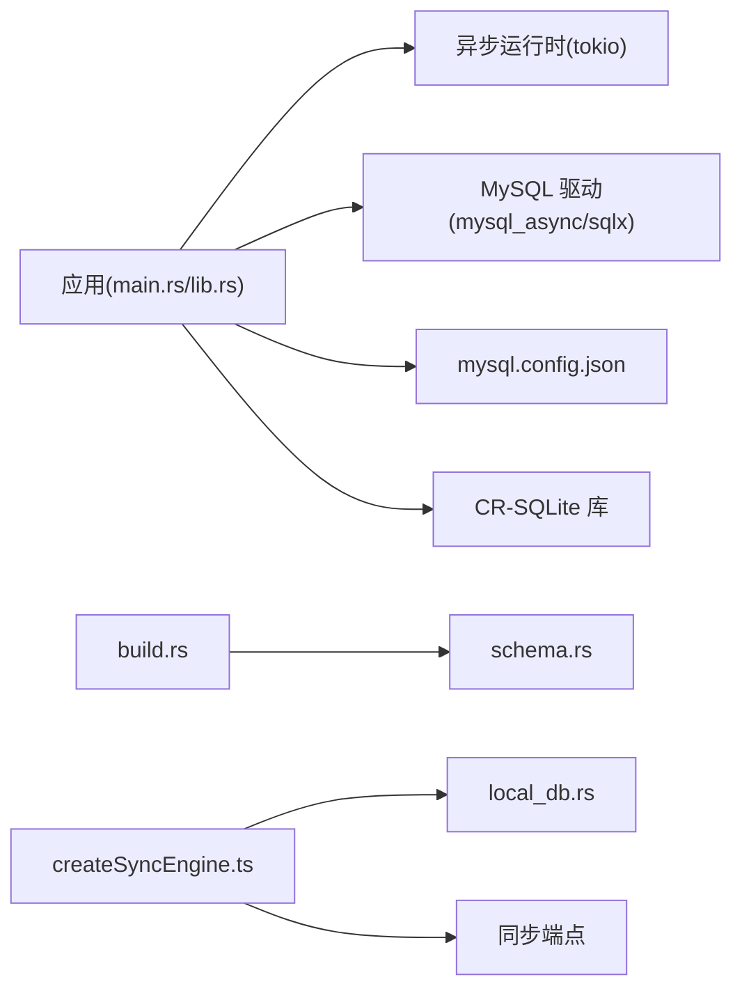

**图表来源**
- [src-tauri/src/main.rs](file://src-tauri/src/main.rs)
- [src-tauri/src/lib.rs](file://src-tauri/src/lib.rs)
- [src-tauri/Cargo.toml](file://src-tauri/Cargo.toml)
- [src-tauri/build.rs](file://src-tauri/build.rs)
- [src-tauri/mysql.config.json](file://src-tauri/mysql.config.json)
- [src-tauri/src/schema.rs](file://src-tauri/src/schema.rs)
- [src/lib/createSyncEngine.ts](file://src/lib/createSyncEngine.ts)
- [src-tauri/src/local_db.rs](file://src-tauri/src/local_db.rs)

**章节来源**
- [src-tauri/Cargo.toml](file://src-tauri/Cargo.toml)
- [src-tauri/build.rs](file://src-tauri/build.rs)
- [src-tauri/mysql.config.json](file://src-tauri/mysql.config.json)
- [src/lib/createSyncEngine.ts](file://src/lib/createSyncEngine.ts)

## 性能考虑
- 连接池调优
  - 根据 CPU 核数与 IO 特性设置最大连接数
  - 合理配置空闲超时与连接存活时间，避免僵尸连接
- 查询优化
  - 使用 EXPLAIN 分析执行计划，消除全表扫描
  - 利用覆盖索引与预编译语句减少解析与序列化开销
- 批处理与流式
  - 大批量写入采用分批提交，降低单事务体积
  - 大结果集采用流式读取，减少内存峰值
- 同步优化
  - 增量同步减少网络传输量
  - 批量合并本地更改，减少同步频率
  - 冲突解决算法优化，提升合并效率
- 监控与告警
  - 采集连接池指标、慢查询、锁等待与死锁信息
  - 监控同步状态和冲突率，设定阈值告警

## 故障排查指南
- 常见问题
  - 连接池耗尽：检查最大连接数与长事务持有连接
  - 慢查询：定位热点 SQL，补充索引或改写查询
  - 死锁：分析事务顺序，拆分大事务
  - 同步失败：检查网络连接和认证配置
  - 冲突过多：分析用户操作模式，优化冲突解决策略
- 诊断步骤
  - 查看错误码与堆栈，判断是否为瞬态错误
  - 打开慢查询日志与执行计划，复现问题场景
  - 检查同步日志，分析冲突原因和解决过程
  - 使用压力测试工具验证修复效果
- 恢复建议
  - 临时扩容连接池或限流
  - 回滚有问题的迁移，恢复到稳定版本
  - 重置同步状态，重新执行完整同步

**章节来源**
- [src-tauri/src/db.rs](file://src-tauri/src/db.rs)
- [src/lib/createSyncEngine.ts](file://src/lib/createSyncEngine.ts)

## 结论
FishWorker 的数据库集成以 CR-SQLite 离线优先架构为核心，结合传统连接池管理和异步驱动，形成高可用、强一致的数据访问层。新架构支持多设备并发编辑和自动冲突解决，显著提升了用户体验和数据可靠性。通过统一的 schema 与迁移体系，保障了版本演进的可控性与一致性。配合完善的错误处理、重试与监控手段，系统在稳定性与可维护性方面具备良好基础。后续可在索引治理、查询重构、容量规划与同步优化上持续改进。

## 附录
- 术语
  - 连接池：复用数据库连接的集合
  - 事务：一组操作的原子单元
  - 幂等：重复执行不会产生副作用
  - CR-SQLite：基于 CRDT 的 SQLite 扩展，支持离线优先和多设备同步
  - 冲突解决：处理多设备并发修改同一数据时的矛盾
- 最佳实践清单
  - 始终使用参数化查询，防范注入
  - 为高频查询建立合适索引，定期清理无用索引
  - 对写操作进行幂等设计，避免重复提交导致数据异常
  - 在 CI 中加入 schema 兼容性与迁移校验
  - 设计合理的冲突解决策略，平衡一致性和可用性
  - 监控同步状态和用户反馈，及时发现问题