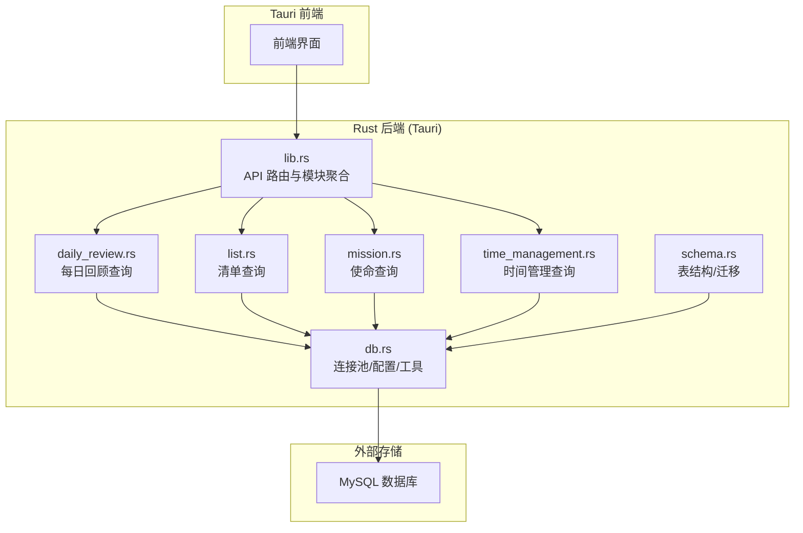
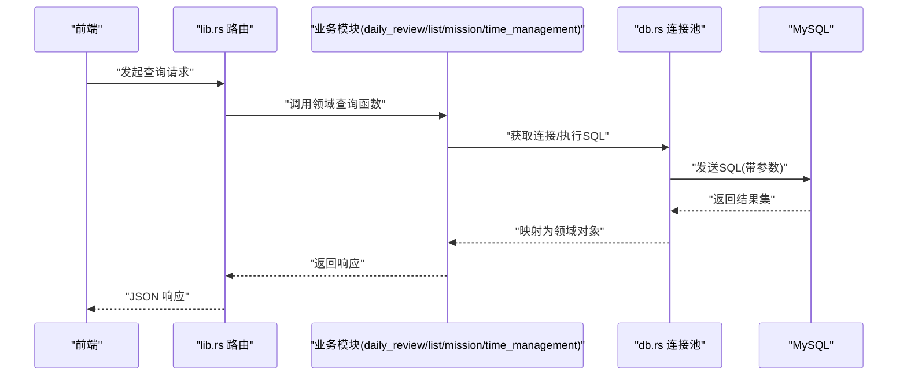
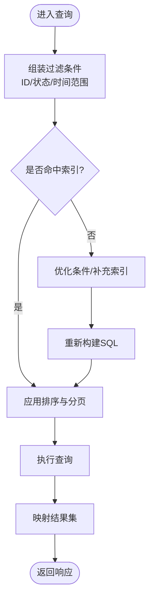
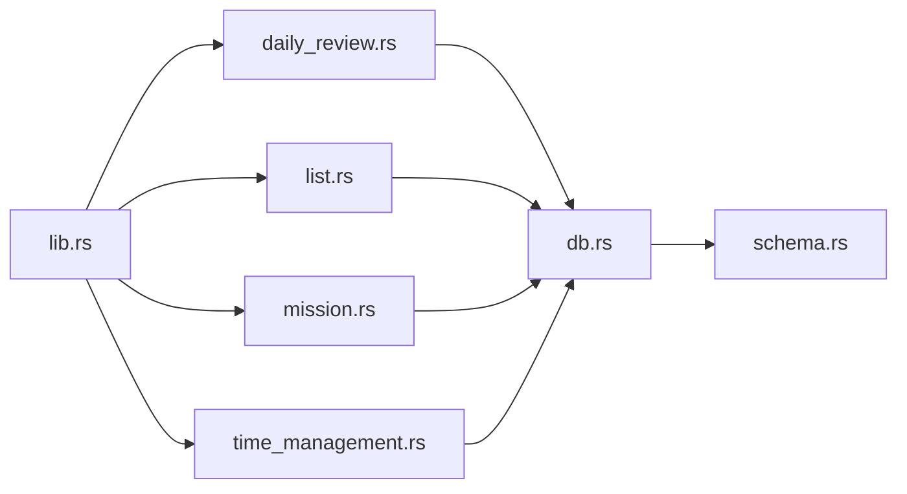

# 查询优化与性能

<cite>
**本文引用的文件**   
- [src-tauri/src/db.rs](file://src-tauri/src/db.rs)
- [src-tauri/src/schema.rs](file://src-tauri/src/schema.rs)
- [src-tauri/src/lib.rs](file://src-tauri/src/lib.rs)
- [src-tauri/src/daily_review.rs](file://src-tauri/src/daily_review.rs)
- [src-tauri/src/list.rs](file://src-tauri/src/list.rs)
- [src-tauri/src/mission.rs](file://src-tauri/src/mission.rs)
- [src-tauri/src/time_management.rs](file://src-tauri/src/time_management.rs)
- [src-tauri/mysql.config.json](file://src-tauri/mysql.config.json)
</cite>

## 目录
1. [简介](#简介)
2. [项目结构](#项目结构)
3. [核心组件](#核心组件)
4. [架构总览](#架构总览)
5. [详细组件分析](#详细组件分析)
6. [依赖关系分析](#依赖关系分析)
7. [性能考量](#性能考量)
8. [故障排查指南](#故障排查指南)
9. [结论](#结论)
10. [附录](#附录)

## 简介
本文件面向数据库查询优化与性能调优，结合仓库中的 Rust/Tauri 后端代码，系统梳理慢查询识别与分析方法、索引优化策略、查询计划分析、批量操作与事务合并、缓存与数据预加载、分页与大结果集处理、监控指标与基准测试、连接复用与批处理最佳实践，以及常见性能问题的诊断与解决方案。文档以“从现象到根因、从策略到落地”的方式组织，既提供高层方法论，也给出可直接落地的工程建议。

## 项目结构
本项目采用 Tauri + Rust 的后端架构，数据库访问集中在 src-tauri 中：
- 数据库配置与连接管理位于 db.rs
- 表结构与迁移定义位于 schema.rs
- 业务模块（每日回顾、清单、任务、使命等）通过 lib.rs 暴露 API，并在各自 .rs 文件中实现具体查询逻辑
- MySQL 连接参数由 mysql.config.json 提供

图表来源
- [src-tauri/src/lib.rs](file://src-tauri/src/lib.rs)
- [src-tauri/src/db.rs](file://src-tauri/src/db.rs)
- [src-tauri/src/schema.rs](file://src-tauri/src/schema.rs)
- [src-tauri/src/daily_review.rs](file://src-tauri/src/daily_review.rs)
- [src-tauri/src/list.rs](file://src-tauri/src/list.rs)
- [src-tauri/src/mission.rs](file://src-tauri/src/mission.rs)
- [src-tauri/src/time_management.rs](file://src-tauri/src/time_management.rs)

章节来源
- [src-tauri/src/db.rs](file://src-tauri/src/db.rs)
- [src-tauri/src/schema.rs](file://src-tauri/src/schema.rs)
- [src-tauri/src/lib.rs](file://src-tauri/src/lib.rs)
- [src-tauri/src/daily_review.rs](file://src-tauri/src/daily_review.rs)
- [src-tauri/src/list.rs](file://src-tauri/src/list.rs)
- [src-tauri/src/mission.rs](file://src-tauri/src/mission.rs)
- [src-tauri/src/time_management.rs](file://src-tauri/src/time_management.rs)
- [src-tauri/mysql.config.json](file://src-tauri/mysql.config.json)

## 核心组件
- 数据库连接与配置
  - 负责解析配置文件、建立连接池、提供统一的数据访问入口。
  - 关注点：连接池大小、超时、重试、错误传播。
- 模式与迁移
  - 集中维护表结构、字段类型、约束与索引声明，确保 DDL 变更可追踪。
- 业务查询层
  - 按领域划分（每日回顾、清单、使命、时间管理），封装 SQL 构建、参数绑定、结果映射。
  - 关注点：SQL 可读性、执行计划友好性、分页与过滤条件组合。

章节来源
- [src-tauri/src/db.rs](file://src-tauri/src/db.rs)
- [src-tauri/src/schema.rs](file://src-tauri/src/schema.rs)
- [src-tauri/src/daily_review.rs](file://src-tauri/src/daily_review.rs)
- [src-tauri/src/list.rs](file://src-tauri/src/list.rs)
- [src-tauri/src/mission.rs](file://src-tauri/src/mission.rs)
- [src-tauri/src/time_management.rs](file://src-tauri/src/time_management.rs)

## 架构总览
下图展示了从前端请求到数据库执行的端到端路径，并标注了关键的性能控制点（如连接池、SQL 构建、分页、事务）。

图表来源
- [src-tauri/src/lib.rs](file://src-tauri/src/lib.rs)
- [src-tauri/src/db.rs](file://src-tauri/src/db.rs)
- [src-tauri/src/daily_review.rs](file://src-tauri/src/daily_review.rs)
- [src-tauri/src/list.rs](file://src-tauri/src/list.rs)
- [src-tauri/src/mission.rs](file://src-tauri/src/mission.rs)
- [src-tauri/src/time_management.rs](file://src-tauri/src/time_management.rs)

## 详细组件分析

### 数据库连接与配置（db.rs）
- 职责
  - 读取 mysql.config.json 的连接信息
  - 初始化连接池（大小、空闲超时、最大生命周期等）
  - 提供统一的查询/更新接口
- 优化要点
  - 根据并发量与平均延迟调整连接池上限，避免过多连接导致上下文切换开销
  - 合理设置连接空闲回收与最大生命周期，降低僵尸连接风险
  - 对高频短查询启用语句缓存（若驱动支持）
  - 将只读查询与写查询分离（读写分离场景）

章节来源
- [src-tauri/src/db.rs](file://src-tauri/src/db.rs)
- [src-tauri/mysql.config.json](file://src-tauri/mysql.config.json)

### 模式与迁移（schema.rs）
- 职责
  - 定义表结构、字段类型、主键/外键、唯一约束
  - 集中索引声明，保证一致性
- 优化要点
  - 优先在 DDL 阶段完成索引设计，避免运行时临时排序/扫描
  - 使用覆盖索引减少回表
  - 对高基数列建普通索引，低基数列谨慎建索引
  - 复合索引遵循最左前缀原则，按查询过滤顺序排列

章节来源
- [src-tauri/src/schema.rs](file://src-tauri/src/schema.rs)

### 业务查询层（daily_review.rs / list.rs / mission.rs / time_management.rs）
- 职责
  - 将前端筛选条件转换为 SQL 过滤条件
  - 实现分页、排序、聚合统计
  - 必要时开启事务进行批量写入
- 优化要点
  - 分页：优先使用基于游标或范围的条件分页，避免深分页 OFFSET 过大
  - 过滤：尽量利用索引列作为 WHERE 条件；避免在索引列上使用函数或隐式类型转换
  - 排序：ORDER BY 与 WHERE 共用同一索引前缀可减少 filesort
  - 聚合：先过滤再聚合，减少中间结果集
  - 事务：将多次小写合并为一次事务，减少提交开销

章节来源
- [src-tauri/src/daily_review.rs](file://src-tauri/src/daily_review.rs)
- [src-tauri/src/list.rs](file://src-tauri/src/list.rs)
- [src-tauri/src/mission.rs](file://src-tauri/src/mission.rs)
- [src-tauri/src/time_management.rs](file://src-tauri/src/time_management.rs)

### 典型查询流程（示例：清单列表分页）

图表来源
- [src-tauri/src/list.rs](file://src-tauri/src/list.rs)
- [src-tauri/src/db.rs](file://src-tauri/src/db.rs)

## 依赖关系分析
- 模块耦合
  - lib.rs 作为路由聚合层，依赖各业务模块
  - 业务模块依赖 db.rs 提供的连接与执行能力
  - schema.rs 被 db.rs 用于初始化/迁移
- 潜在风险
  - 若业务模块直接持有连接实例而非通过连接池，可能导致连接泄漏
  - 跨模块共享全局状态需谨慎，避免竞争条件

图表来源
- [src-tauri/src/lib.rs](file://src-tauri/src/lib.rs)
- [src-tauri/src/db.rs](file://src-tauri/src/db.rs)
- [src-tauri/src/schema.rs](file://src-tauri/src/schema.rs)
- [src-tauri/src/daily_review.rs](file://src-tauri/src/daily_review.rs)
- [src-tauri/src/list.rs](file://src-tauri/src/list.rs)
- [src-tauri/src/mission.rs](file://src-tauri/src/mission.rs)
- [src-tauri/src/time_management.rs](file://src-tauri/src/time_management.rs)

## 性能考量

### 慢查询识别与分析
- 采集方式
  - 在业务层埋点记录关键查询的耗时、影响行数、参数摘要
  - 开启数据库慢查询日志（阈值建议 100ms~500ms，视负载而定）
  - 定期导出慢查询样本，按 QPS 与 P95/P99 排序定位热点
- 分析方法
  - 使用 EXPLAIN/EXPLAIN ANALYZE 查看执行计划，关注全表扫描、临时表、文件排序、回表
  - 检查索引选择性与覆盖度，评估是否需要新增/调整索引
  - 对比不同 SQL 变体的计划差异，选择更优写法

章节来源
- [src-tauri/src/db.rs](file://src-tauri/src/db.rs)
- [src-tauri/src/daily_review.rs](file://src-tauri/src/daily_review.rs)
- [src-tauri/src/list.rs](file://src-tauri/src/list.rs)
- [src-tauri/src/mission.rs](file://src-tauri/src/mission.rs)
- [src-tauri/src/time_management.rs](file://src-tauri/src/time_management.rs)

### 索引优化策略
- 单列索引
  - 高选择性列优先；避免在低基数列上过度建索引
- 复合索引
  - 按 WHERE 过滤顺序与 JOIN 关联顺序设计
  - 遵循最左前缀原则，避免跳过前导列
- 覆盖索引
  - 将 SELECT 字段纳入索引，减少回表
- 函数与表达式
  - 避免在索引列上使用函数或隐式转换；必要时创建生成列+索引
- 维护成本
  - 索引越多，写入越慢；权衡读写比例与空间占用

章节来源
- [src-tauri/src/schema.rs](file://src-tauri/src/schema.rs)

### 查询计划分析
- 关注点
  - type：ALL/INDEX/MERGE/RANGE/REF/const 等
  - rows：预估扫描行数
  - Extra：Using index/Using where/Using temporary/Using filesort
- 改进方向
  - 消除 Using filesort：调整 ORDER BY 与索引前缀一致
  - 消除 Using temporary：改写子查询或引入中间表/物化视图
  - 减少回表：使用覆盖索引

章节来源
- [src-tauri/src/db.rs](file://src-tauri/src/db.rs)
- [src-tauri/src/list.rs](file://src-tauri/src/list.rs)

### 批量操作优化与事务合并
- 批量插入/更新
  - 使用单次多值 INSERT/REPLACE INTO，减少网络往返
  - 分批提交（每批 500~2000 行），平衡吞吐与内存占用
- 事务合并
  - 将多个小写合并为一个事务，减少 fsync 次数
  - 注意长事务锁竞争与 undo log 膨胀
- 幂等与重试
  - 对重复提交做幂等设计；失败时指数退避重试

章节来源
- [src-tauri/src/db.rs](file://src-tauri/src/db.rs)
- [src-tauri/src/daily_review.rs](file://src-tauri/src/daily_review.rs)
- [src-tauri/src/list.rs](file://src-tauri/src/list.rs)
- [src-tauri/src/mission.rs](file://src-tauri/src/mission.rs)
- [src-tauri/src/time_management.rs](file://src-tauri/src/time_management.rs)

### 缓存策略与数据预加载
- 多级缓存
  - 进程内缓存（LRU）：热点字典、配置项
  - 本地缓存（Redis/Memcached）：会话、排行榜、热门列表
- 失效策略
  - TTL + 主动失效（写后删/更新）
  - 布隆过滤器防穿透
- 预加载
  - 页面级预取：首屏所需数据提前拉取
  - 懒加载：滚动触底按需加载

章节来源
- [src-tauri/src/db.rs](file://src-tauri/src/db.rs)
- [src-tauri/src/lib.rs](file://src-tauri/src/lib.rs)

### 分页查询优化与大结果集处理
- 分页
  - 优先使用基于游标的分页（WHERE id > last_id LIMIT N）
  - 避免大 OFFSET；必要时用“近似计数”或异步统计
- 大结果集
  - 流式读取，逐条处理，避免一次性加载到内存
  - 服务端侧聚合/裁剪后再返回

章节来源
- [src-tauri/src/list.rs](file://src-tauri/src/list.rs)
- [src-tauri/src/time_management.rs](file://src-tauri/src/time_management.rs)

### 监控指标与基准测试
- 监控指标
  - 连接池：活跃连接数、等待队列长度、获取/归还耗时
  - 查询：QPS、P50/P95/P99 延迟、错误率、慢查询占比
  - 资源：CPU、IO、锁等待、缓冲命中率
- 基准测试
  - 压测脚本：模拟真实流量分布（读写比、热点键）
  - 回归基线：每次变更前后对比关键指标

章节来源
- [src-tauri/src/db.rs](file://src-tauri/src/db.rs)
- [src-tauri/src/lib.rs](file://src-tauri/src/lib.rs)

### 连接复用与查询批处理最佳实践
- 连接复用
  - 使用连接池，避免频繁创建销毁连接
  - 区分读写连接池，限制只读查询走只读副本
- 查询批处理
  - 合并多条独立查询为一条（UNION ALL/JOIN）
  - 使用 IN 批量参数，但注意 IN 列表过长需分片

章节来源
- [src-tauri/src/db.rs](file://src-tauri/src/db.rs)

## 故障排查指南
- 症状：接口延迟突增
  - 排查步骤：查看慢查询日志 → EXPLAIN 分析 → 检查索引缺失/失效 → 评估连接池饱和
- 症状：写入抖动
  - 排查步骤：检查长事务与锁等待 → 拆分批量写入 → 调整事务边界
- 症状：内存峰值过高
  - 排查步骤：确认是否一次性加载大结果集 → 改为流式/分页 → 增加服务端裁剪
- 症状：死锁频发
  - 排查步骤：统一加锁顺序 → 缩短事务 → 拆分热点行写入

章节来源
- [src-tauri/src/db.rs](file://src-tauri/src/db.rs)
- [src-tauri/src/daily_review.rs](file://src-tauri/src/daily_review.rs)
- [src-tauri/src/list.rs](file://src-tauri/src/list.rs)
- [src-tauri/src/mission.rs](file://src-tauri/src/mission.rs)
- [src-tauri/src/time_management.rs](file://src-tauri/src/time_management.rs)

## 结论
通过“可观测—可分析—可优化”的闭环，结合合理的索引设计、分页与批处理策略、连接池与事务调优，以及完善的监控与基准体系，可以显著提升查询性能与系统稳定性。建议在每次重大变更前后运行基准测试，并将关键指标纳入持续集成与告警体系。

## 附录
- 术语
  - 覆盖索引：查询所需字段全部存在于索引中，无需回表
  - 游标分页：基于上次最后一条记录的键值进行下一页查询
  - 文件排序：无法使用索引排序时的磁盘排序
- 参考
  - 数据库慢查询日志与 EXPLAIN 官方文档
  - 连接池与事务隔离级别相关规范