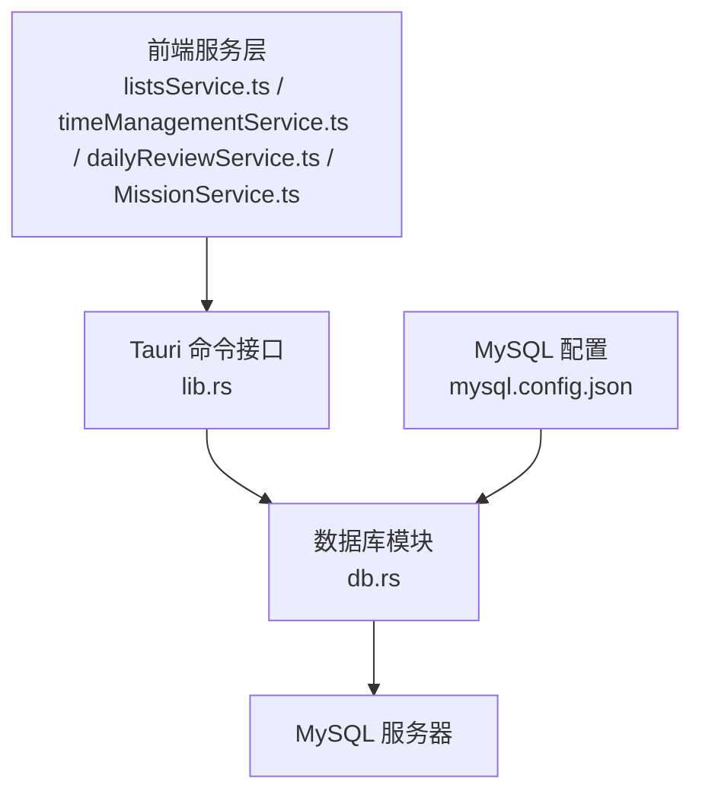
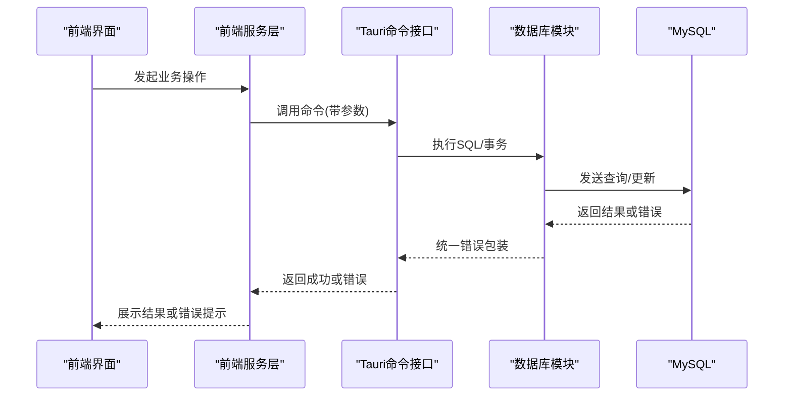
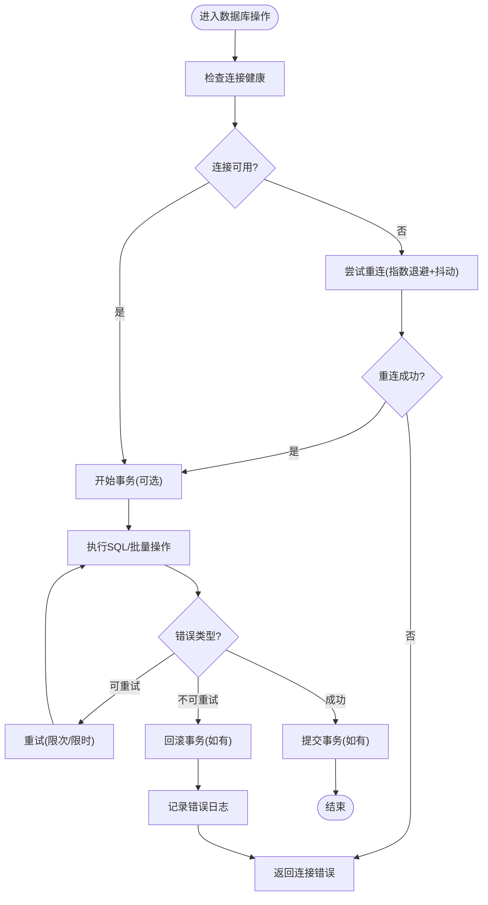
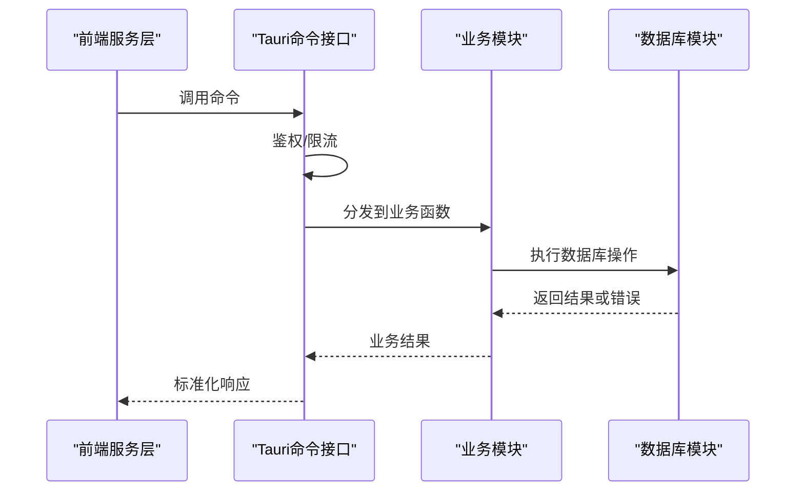
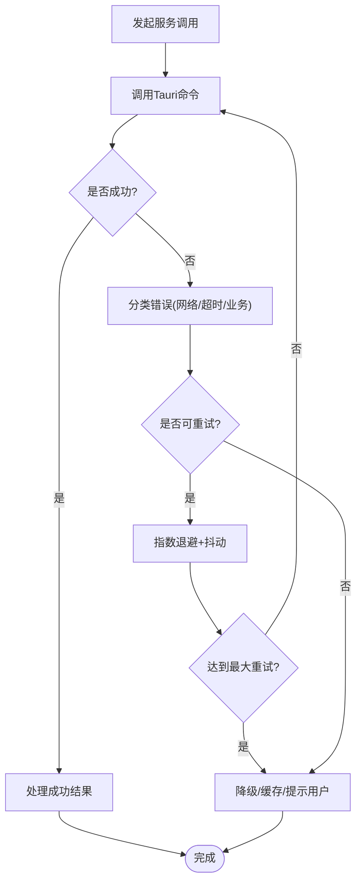
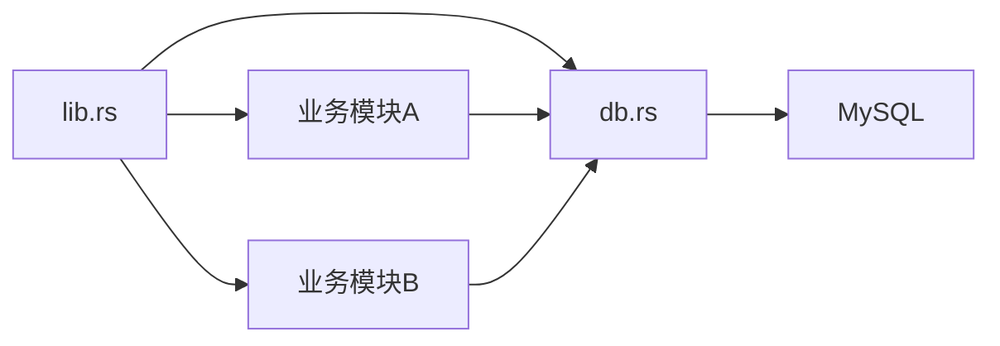

# 错误处理与恢复

<cite>
**本文引用的文件**   
- [src-tauri/src/db.rs](file://src-tauri/src/db.rs)
- [src-tauri/src/lib.rs](file://src-tauri/src/lib.rs)
- [src-tauri/Cargo.toml](file://src-tauri/Cargo.toml)
- [src-tauri/mysql.config.json](file://src-tauri/mysql.config.json)
- [src/features/lists/listsService.ts](file://src/features/lists/listsService.ts)
- [src/features/time-management/timeManagementService.ts](file://src/features/time-management/timeManagementService.ts)
- [src/features/daily-review/dailyReviewService.ts](file://src/features/daily-review/dailyReviewService.ts)
- [src/features/mission/MissionService.ts](file://src/features/mission/MissionService.ts)
</cite>

## 目录
1. [简介](#简介)
2. [项目结构](#项目结构)
3. [核心组件](#核心组件)
4. [架构总览](#架构总览)
5. [详细组件分析](#详细组件分析)
6. [依赖关系分析](#依赖关系分析)
7. [性能考量](#性能考量)
8. [故障排查指南](#故障排查指南)
9. [结论](#结论)
10. [附录](#附录)

## 简介
本文件聚焦于FishWorker项目的数据库错误处理与系统恢复机制，覆盖异常识别、重试与退避、事务回滚与一致性、连接断开自动重连、数据损坏检测与修复、错误日志与监控告警、备份恢复与灾难恢复预案，以及数据完整性验证与修复工具。文档以Tauri后端（Rust）为核心，结合前端服务层调用路径进行端到端说明，并提供可操作的排障建议与最佳实践。

## 项目结构
本项目采用前后端分离的桌面应用架构：前端通过Tauri命令调用后端Rust模块访问MySQL数据库。与错误处理和恢复相关的关键位置包括：
- Tauri后端数据库连接与配置
- 业务模块对数据库的调用封装
- 前端服务层对后端命令的错误处理与重试策略

**图表来源**
- [src-tauri/src/lib.rs](file://src-tauri/src/lib.rs)
- [src-tauri/src/db.rs](file://src-tauri/src/db.rs)
- [src-tauri/mysql.config.json](file://src-tauri/mysql.config.json)
- [src/features/lists/listsService.ts](file://src/features/lists/listsService.ts)
- [src/features/time-management/timeManagementService.ts](file://src/features/time-management/timeManagementService.ts)
- [src/features/daily-review/dailyReviewService.ts](file://src/features/daily-review/dailyReviewService.ts)
- [src/features/mission/MissionService.ts](file://src/features/mission/MissionService.ts)

**章节来源**
- [src-tauri/src/db.rs](file://src-tauri/src/db.rs)
- [src-tauri/src/lib.rs](file://src-tauri/src/lib.rs)
- [src-tauri/mysql.config.json](file://src-tauri/mysql.config.json)
- [src/features/lists/listsService.ts](file://src/features/lists/listsService.ts)
- [src/features/time-management/timeManagementService.ts](file://src/features/time-management/timeManagementService.ts)
- [src/features/daily-review/dailyReviewService.ts](file://src/features/daily-review/dailyReviewService.ts)
- [src/features/mission/MissionService.ts](file://src/features/mission/MissionService.ts)

## 核心组件
- 数据库连接与配置管理：负责加载MySQL配置、建立连接池、统一错误包装与上下文信息。
- Tauri命令路由：将前端请求转发到具体业务模块，并统一捕获与返回错误。
- 前端服务层：封装Tauri命令调用，实现幂等性、重试与用户提示。
- 业务模块：按领域划分（列表、时间管理、每日回顾、使命），在各自模块内组织SQL与事务边界。

关键职责与交互要点：
- 所有数据库操作应通过统一的错误类型进行包装，包含错误码、错误消息、原始错误上下文。
- 连接失败、超时、死锁、唯一约束冲突等异常需分类处理，分别触发不同策略（重试、降级、回滚、告警）。
- 事务边界清晰，确保原子性与一致性；失败时自动回滚并记录审计日志。

**章节来源**
- [src-tauri/src/db.rs](file://src-tauri/src/db.rs)
- [src-tauri/src/lib.rs](file://src-tauri/src/lib.rs)
- [src-tauri/mysql.config.json](file://src-tauri/mysql.config.json)
- [src/features/lists/listsService.ts](file://src/features/lists/listsService.ts)
- [src/features/time-management/timeManagementService.ts](file://src/features/time-management/timeManagementService.ts)
- [src/features/daily-review/dailyReviewService.ts](file://src/features/daily-review/dailyReviewService.ts)
- [src/features/mission/MissionService.ts](file://src/features/mission/MissionService.ts)

## 架构总览
下图展示了从前端到数据库的完整调用链及错误处理关键点：

**图表来源**
- [src-tauri/src/lib.rs](file://src-tauri/src/lib.rs)
- [src-tauri/src/db.rs](file://src-tauri/src/db.rs)
- [src/features/lists/listsService.ts](file://src/features/lists/listsService.ts)
- [src/features/time-management/timeManagementService.ts](file://src/features/time-management/timeManagementService.ts)
- [src/features/daily-review/dailyReviewService.ts](file://src/features/daily-review/dailyReviewService.ts)
- [src/features/mission/MissionService.ts](file://src/features/mission/MissionService.ts)

## 详细组件分析

### 数据库模块（db.rs）
- 连接与配置
  - 从配置文件读取MySQL连接参数，建立连接池。
  - 提供统一的连接获取方法，支持健康检查与快速失败。
- 错误处理
  - 定义错误枚举与上下文字段（如错误码、SQL状态、耗时、请求ID）。
  - 对常见异常进行分类：网络错误、认证失败、超时、死锁、唯一键冲突、权限不足、数据校验失败等。
- 事务与一致性
  - 使用显式事务包裹多步写操作，失败时回滚。
  - 在事务中设置隔离级别与锁策略，避免脏读与不可重复读。
- 重试与退避
  - 针对可重试错误（如死锁、临时网络抖动）实施指数退避+抖动策略。
  - 限制最大重试次数与总等待时间，防止雪崩。
- 连接断开自动重连
  - 连接池配置最小空闲连接与最大生命周期。
  - 心跳探测与断线重连逻辑，失败时快速切换备用节点（若配置）。
- 数据损坏检测与修复
  - 提供完整性校验入口：扫描表统计、外键一致性、索引重建。
  - 对可修复问题（如索引损坏）提供修复流程，并在修复前创建快照。
- 日志与监控
  - 结构化日志输出：包含时间戳、模块、操作、影响行数、错误码、耗时。
  - 暴露指标：连接数、慢查询、错误率、重试次数、事务回滚率。

**图表来源**
- [src-tauri/src/db.rs](file://src-tauri/src/db.rs)

**章节来源**
- [src-tauri/src/db.rs](file://src-tauri/src/db.rs)

### Tauri命令接口（lib.rs）
- 命令注册与路由：将前端调用映射到后端函数。
- 统一错误捕获：捕获未处理异常，转换为标准错误响应。
- 鉴权与限流：在命令入口处校验权限与速率限制，减少恶意或异常流量。
- 审计日志：记录每次命令调用的输入摘要与结果状态。

**图表来源**
- [src-tauri/src/lib.rs](file://src-tauri/src/lib.rs)
- [src-tauri/src/db.rs](file://src-tauri/src/db.rs)

**章节来源**
- [src-tauri/src/lib.rs](file://src-tauri/src/lib.rs)

### 前端服务层（listsService.ts / timeManagementService.ts / dailyReviewService.ts / MissionService.ts）
- 调用封装：统一封装Tauri命令调用，处理返回值与错误对象。
- 重试策略：对幂等操作（如只读查询）实施有限重试；对写操作谨慎重试，必要时由后端保证幂等。
- 用户反馈：根据错误类型显示友好提示，并提供“重试”、“联系管理员”等动作。
- 缓存与降级：在网络不可用时使用本地缓存或离线模式，待恢复后同步。

**图表来源**
- [src/features/lists/listsService.ts](file://src/features/lists/listsService.ts)
- [src/features/time-management/timeManagementService.ts](file://src/features/time-management/timeManagementService.ts)
- [src/features/daily-review/dailyReviewService.ts](file://src/features/daily-review/dailyReviewService.ts)
- [src/features/mission/MissionService.ts](file://src/features/mission/MissionService.ts)

**章节来源**
- [src/features/lists/listsService.ts](file://src/features/lists/listsService.ts)
- [src/features/time-management/timeManagementService.ts](file://src/features/time-management/timeManagementService.ts)
- [src/features/daily-review/dailyReviewService.ts](file://src/features/daily-review/dailyReviewService.ts)
- [src/features/mission/MissionService.ts](file://src/features/mission/MissionService.ts)

### 配置与环境（mysql.config.json）
- 连接参数：主机、端口、用户名、密码、数据库名、SSL选项。
- 连接池：最大连接数、最小空闲、连接超时、语句超时。
- 高可用：主备节点、故障转移策略、读写分离（若启用）。
- 安全：敏感信息加密存储、环境变量注入、密钥轮换。

**章节来源**
- [src-tauri/mysql.config.json](file://src-tauri/mysql.config.json)

### 构建与依赖（Cargo.toml）
- 数据库驱动：选择稳定且具备良好错误模型的驱动（如sqlx、mysql_async）。
- 重试库：集成通用重试库（如retry）以简化退避策略。
- 日志框架：使用结构化日志（如tracing、log）便于监控与排障。
- 版本锁定：固定依赖版本以避免升级引入的不兼容错误。

**章节来源**
- [src-tauri/Cargo.toml](file://src-tauri/Cargo.toml)

## 依赖关系分析
- 模块耦合
  - lib.rs作为命令入口，低耦合地调用各业务模块与数据库模块。
  - db.rs集中处理连接、错误与重试，降低业务模块复杂度。
- 外部依赖
  - MySQL驱动与连接池库决定底层错误语义与性能特性。
  - 日志与监控库影响可观测性与排障效率。
- 潜在循环依赖
  - 保持业务模块仅依赖db.rs与公共错误类型，避免反向依赖。

**图表来源**
- [src-tauri/src/lib.rs](file://src-tauri/src/lib.rs)
- [src-tauri/src/db.rs](file://src-tauri/src/db.rs)

**章节来源**
- [src-tauri/src/lib.rs](file://src-tauri/src/lib.rs)
- [src-tauri/src/db.rs](file://src-tauri/src/db.rs)

## 性能考量
- 连接池调优：根据并发量调整最大连接数与超时，避免连接饥饿。
- 慢查询治理：开启慢查询日志，定期分析与优化。
- 批处理与分页：大批量写入使用批处理，读取使用分页与索引优化。
- 重试风暴防护：全局熔断与退避上限，防止级联失败。
- 资源监控：跟踪CPU、内存、IO与数据库连接使用率，设定阈值告警。

[本节为通用指导，不直接分析具体文件]

## 故障排查指南
- 常见问题定位
  - 连接失败：检查配置、网络连通、防火墙与证书。
  - 超时：查看语句超时与连接超时设置，分析慢查询。
  - 死锁：获取死锁详情，调整事务范围与锁粒度。
  - 唯一键冲突：确认业务幂等与去重逻辑。
- 日志与指标
  - 收集错误日志与指标，关注错误码分布与趋势。
  - 使用请求ID追踪跨层调用链路。
- 恢复步骤
  - 先恢复连接与基本可用性，再逐步恢复业务功能。
  - 对受损数据进行校验与修复，必要时回滚至最近一致快照。

**章节来源**
- [src-tauri/src/db.rs](file://src-tauri/src/db.rs)
- [src-tauri/src/lib.rs](file://src-tauri/src/lib.rs)

## 结论
通过统一的错误模型、健壮的重试与退避、明确的事务边界与回滚策略、自动重连与高可用配置、完善的日志与监控、以及备份恢复与数据完整性校验流程，FishWorker能够在数据库异常与系统故障场景下保持稳定与可恢复。建议在持续演进中完善自动化测试与演练，提升整体韧性。

[本节为总结，不直接分析具体文件]

## 附录

### 错误分类与处理策略速查
- 网络错误：指数退避+抖动，限次重试；失败转降级。
- 超时：缩短请求范围、增加超时阈值、拆分任务。
- 死锁：缩小事务、调整锁顺序、重试一次。
- 唯一键冲突：幂等写入、去重前置、业务提示。
- 权限不足：权限校验前置、错误提示与工单流转。
- 数据校验失败：前端校验增强、后端二次校验、错误明细返回。

[本节为概念性内容，不直接分析具体文件]

### 备份恢复与灾难恢复预案
- 备份策略：全量+增量，定时备份，异地容灾。
- 恢复演练：定期演练恢复流程，验证RTO/RPO目标。
- 灾难恢复：主备切换、数据一致性校验、灰度发布与回滚。

[本节为概念性内容，不直接分析具体文件]

### 数据完整性验证与修复工具
- 校验入口：表统计对比、外键一致性检查、索引重建。
- 修复流程：创建快照→执行修复→差异比对→回滚预案。
- 监控告警：校验失败立即告警，附带修复建议与一键修复开关。

[本节为概念性内容，不直接分析具体文件]