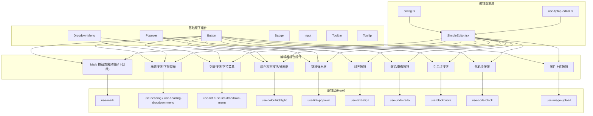
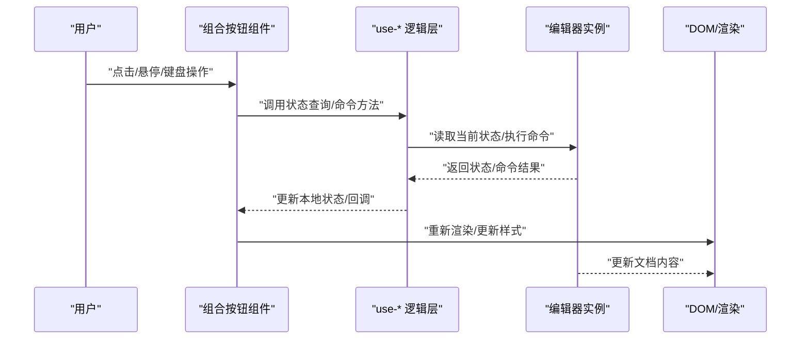
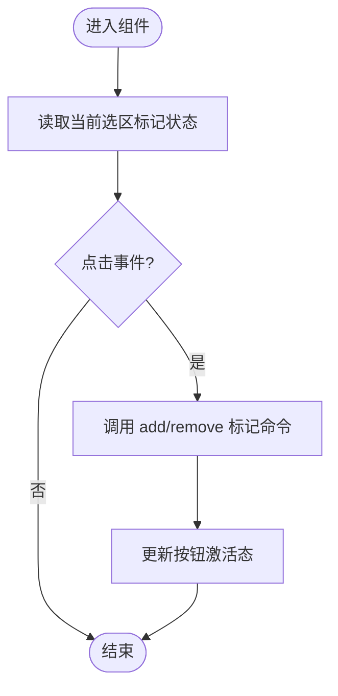
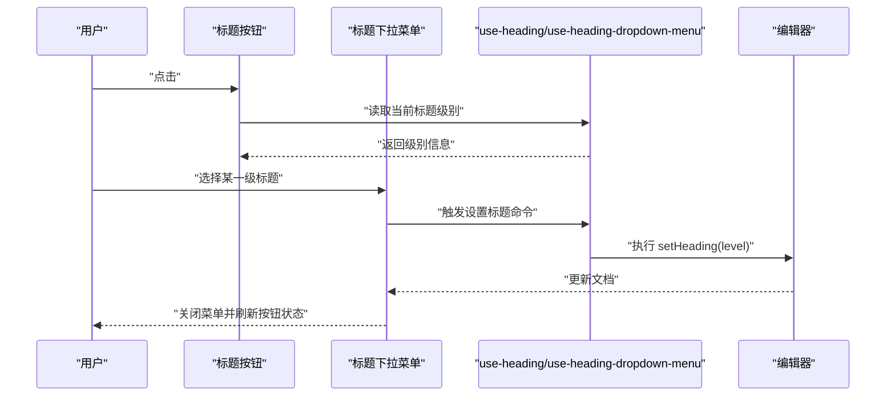
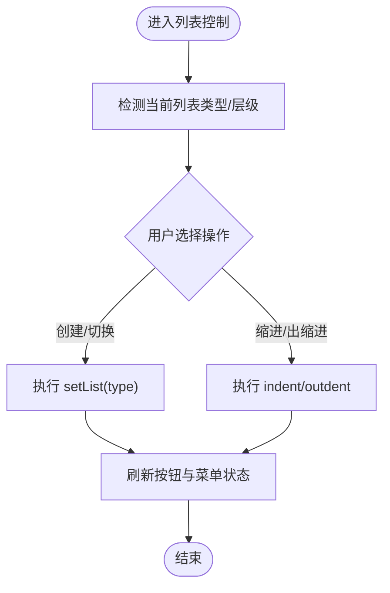
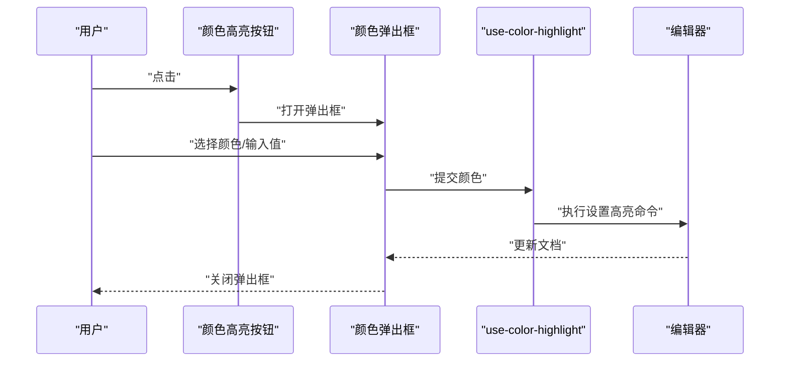
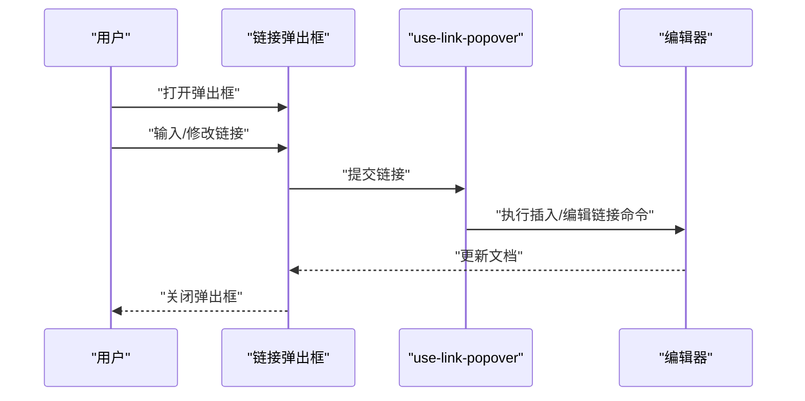
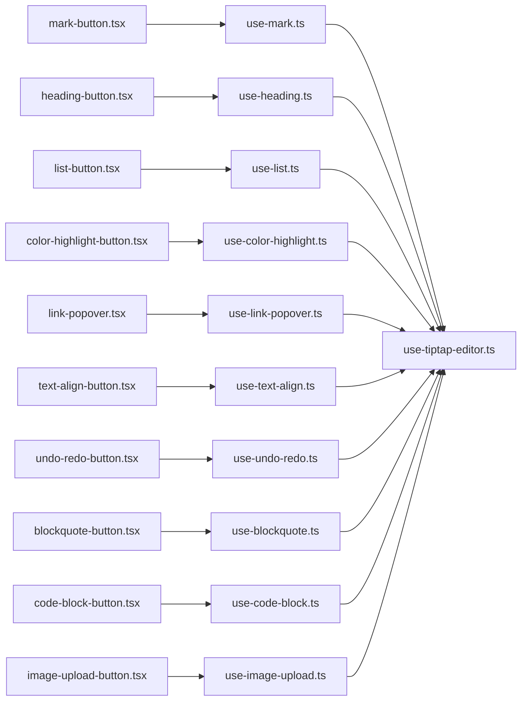

# UI 控件库

<cite>
**本文引用的文件**
- [src/components/tiptap-ui/index.tsx](file://src/components/tiptap-ui/index.tsx)
- [src/components/tiptap-ui/mark-button.tsx](file://src/components/tiptap-ui/mark-button.tsx)
- [src/components/tiptap-ui/use-mark.ts](file://src/components/tiptap-ui/use-mark.ts)
- [src/components/tiptap-ui/heading-button.tsx](file://src/components/tiptap-ui/heading-button.tsx)
- [src/components/tiptap-ui/heading-dropdown-menu.tsx](file://src/components/tiptap-ui/heading-dropdown-menu.tsx)
- [src/components/tiptap-ui/use-heading.ts](file://src/components/tiptap-ui/use-heading.ts)
- [src/components/tiptap-ui/use-heading-dropdown-menu.ts](file://src/components/tiptap-ui/use-heading-dropdown-menu.ts)
- [src/components/tiptap-ui/list-button.tsx](file://src/components/tiptap-ui/list-button.tsx)
- [src/components/tiptap-ui/list-dropdown-menu.tsx](file://src/components/tiptap-ui/list-dropdown-menu.tsx)
- [src/components/tiptap-ui/use-list.ts](file://src/components/tiptap-ui/use-list.ts)
- [src/components/tiptap-ui/use-list-dropdown-menu.ts](file://src/components/tiptap-ui/use-list-dropdown-menu.ts)
- [src/components/tiptap-ui/color-highlight-button.tsx](file://src/components/tiptap-ui/color-highlight-button.tsx)
- [src/components/tiptap-ui/color-highlight-popover.tsx](file://src/components/tiptap-ui/color-highlight-popover.tsx)
- [src/components/tiptap-ui/use-color-highlight.ts](file://src/components/tiptap-ui/use-color-highlight.ts)
- [src/components/tiptap-ui/link-popover.tsx](file://src/components/tiptap-ui/link-popover.tsx)
- [src/components/tiptap-ui/use-link-popover.ts](file://src/components/tiptap-ui/use-link-popover.ts)
- [src/components/tiptap-ui/text-align-button.tsx](file://src/components/tiptap-ui/text-align-button.tsx)
- [src/components/tiptap-ui/use-text-align.ts](file://src/components/tiptap-ui/use-text-align.ts)
- [src/components/tiptap-ui/undo-redo-button.tsx](file://src/components/tiptap-ui/undo-redo-button.tsx)
- [src/components/tiptap-ui/use-undo-redo.ts](file://src/components/tiptap-ui/use-undo-redo.ts)
- [src/components/tiptap-ui/blockquote-button.tsx](file://src/components/tiptap-ui/blockquote-button.tsx)
- [src/components/tiptap-ui/use-blockquote.ts](file://src/components/tiptap-ui/use-blockquote.ts)
- [src/components/tiptap-ui/code-block-button.tsx](file://src/components/tiptap-ui/code-block-button.tsx)
- [src/components/tiptap-ui/use-code-block.ts](file://src/components/tiptap-ui/use-code-block.ts)
- [src/components/tiptap-ui/image-upload-button.tsx](file://src/components/tiptap-ui/image-upload-button.tsx)
- [src/components/tiptap-ui/use-image-upload.ts](file://src/components/tiptap-ui/use-image-upload.ts)
- [src/components/tiptap-ui-primitive/button.tsx](file://src/components/tiptap-ui-primitive/button.tsx)
- [src/components/tiptap-ui-primitive/dropdown-menu.tsx](file://src/components/tiptap-ui-primitive/dropdown-menu.tsx)
- [src/components/tiptap-ui-primitive/popover.tsx](file://src/components/tiptap-ui-primitive/popover.tsx)
- [src/components/tiptap-ui-primitive/badge.tsx](file://src/components/tiptap-ui-primitive/badge.tsx)
- [src/components/tiptap-ui-primitive/input.tsx](file://src/components/tiptap-ui-primitive/input.tsx)
- [src/components/tiptap-ui-primitive/toolbar.tsx](file://src/components/tiptap-ui-primitive/toolbar.tsx)
- [src/components/tiptap-ui-primitive/tooltip.tsx](file://src/components/tiptap-ui-primitive/tooltip.tsx)
- [src/hooks/use-tiptap-editor.ts](file://src/hooks/use-tiptap-editor.ts)
- [src/features/tiptap/SimpleEditor.tsx](file://src/features/tiptap/SimpleEditor.tsx)
- [src/features/tiptap/config.ts](file://src/features/tiptap/config.ts)
</cite>

## 目录
1. [简介](#简介)
2. [项目结构](#项目结构)
3. [核心组件](#核心组件)
4. [架构总览](#架构总览)
5. [详细组件分析](#详细组件分析)
6. [依赖关系分析](#依赖关系分析)
7. [性能考虑](#性能考虑)
8. [故障排查指南](#故障排查指南)
9. [结论](#结论)
10. [附录](#附录)

## 简介
本技术文档聚焦于富文本编辑器的 UI 控件库，围绕工具栏与交互元素（按钮、下拉菜单、弹出框等）的设计模式展开，系统梳理标记按钮（加粗、斜体、下划线）、标题选择器、列表控制、颜色高亮、链接编辑等编辑控件的实现方式。文档同时解释控件如何与编辑器集成，如何通过命令模式调用编辑器能力，并覆盖状态管理、快捷键绑定、无障碍访问支持，以及控件定制与主题适配方案。

## 项目结构
UI 控件库采用“基础原子组件 + 业务组合组件 + 逻辑 Hook”的分层组织方式：
- 基础原子组件位于 tiptap-ui-primitive，提供 Button、DropdownMenu、Popover、Badge、Input、Toolbar、Tooltip 等通用 UI 原语。
- 编辑器相关组合组件位于 tiptap-ui，封装具体编辑功能（如 mark、heading、list、color highlight、link popover 等），并通过 use-* Hook 管理状态与命令调用。
- 编辑器集成入口在 features/tiptap 中，通过 SimpleEditor 将配置与工具栏组装起来。

图表来源
- [src/components/tiptap-ui/index.tsx](file://src/components/tiptap-ui/index.tsx)
- [src/components/tiptap-ui-primitive/button.tsx](file://src/components/tiptap-ui-primitive/button.tsx)
- [src/components/tiptap-ui-primitive/dropdown-menu.tsx](file://src/components/tiptap-ui-primitive/dropdown-menu.tsx)
- [src/components/tiptap-ui-primitive/popover.tsx](file://src/components/tiptap-ui-primitive/popover.tsx)
- [src/components/tiptap-ui/mark-button.tsx](file://src/components/tiptap-ui/mark-button.tsx)
- [src/components/tiptap-ui/heading-button.tsx](file://src/components/tiptap-ui/heading-button.tsx)
- [src/components/tiptap-ui/heading-dropdown-menu.tsx](file://src/components/tiptap-ui/heading-dropdown-menu.tsx)
- [src/components/tiptap-ui/list-button.tsx](file://src/components/tiptap-ui/list-button.tsx)
- [src/components/tiptap-ui/list-dropdown-menu.tsx](file://src/components/tiptap-ui/list-dropdown-menu.tsx)
- [src/components/tiptap-ui/color-highlight-button.tsx](file://src/components/tiptap-ui/color-highlight-button.tsx)
- [src/components/tiptap-ui/color-highlight-popover.tsx](file://src/components/tiptap-ui/color-highlight-popover.tsx)
- [src/components/tiptap-ui/link-popover.tsx](file://src/components/tiptap-ui/link-popover.tsx)
- [src/components/tiptap-ui/text-align-button.tsx](file://src/components/tiptap-ui/text-align-button.tsx)
- [src/components/tiptap-ui/undo-redo-button.tsx](file://src/components/tiptap-ui/undo-redo-button.tsx)
- [src/components/tiptap-ui/blockquote-button.tsx](file://src/components/tiptap-ui/blockquote-button.tsx)
- [src/components/tiptap-ui/code-block-button.tsx](file://src/components/tiptap-ui/code-block-button.tsx)
- [src/components/tiptap-ui/image-upload-button.tsx](file://src/components/tiptap-ui/image-upload-button.tsx)
- [src/features/tiptap/SimpleEditor.tsx](file://src/features/tiptap/SimpleEditor.tsx)
- [src/features/tiptap/config.ts](file://src/features/tiptap/config.ts)
- [src/hooks/use-tiptap-editor.ts](file://src/hooks/use-tiptap-editor.ts)

章节来源
- [src/components/tiptap-ui/index.tsx](file://src/components/tiptap-ui/index.tsx)
- [src/features/tiptap/SimpleEditor.tsx](file://src/features/tiptap/SimpleEditor.tsx)
- [src/features/tiptap/config.ts](file://src/features/tiptap/config.ts)

## 核心组件
本节从设计模式角度概述关键组件的职责与协作关系：
- 基础原子组件
  - Button：统一样式与可访问性属性，作为所有工具栏按钮的载体。
  - DropdownMenu：提供键盘导航与焦点管理的下拉容器。
  - Popover：用于悬浮面板（如颜色选择、链接编辑）。
  - Badge/Tooltip/Input/Toolbar：辅助展示与布局。
- 编辑器组合组件
  - Mark 按钮：对选中文本应用或移除标记（加粗、斜体、下划线等）。
  - Heading 按钮/下拉菜单：切换段落为不同级别标题。
  - List 按钮/下拉菜单：创建有序/无序/任务列表，支持嵌套与层级切换。
  - Color Highlight 按钮/弹出框：为选中内容设置背景色。
  - Link 弹出框：插入或编辑链接，支持校验与预览。
  - Text Align 按钮：切换段落对齐方式。
  - Undo/Redo 按钮：触发撤销/重做。
  - Blockquote/Code Block/Image Upload：块级节点操作。
- 逻辑层 Hook
  - use-mark/use-heading/use-list/use-color-highlight/use-link-popover/use-text-align/use-undo-redo/use-blockquote/use-code-block/use-image-upload：封装与编辑器的交互、状态查询与命令执行。

章节来源
- [src/components/tiptap-ui/mark-button.tsx](file://src/components/tiptap-ui/mark-button.tsx)
- [src/components/tiptap-ui/use-mark.ts](file://src/components/tiptap-ui/use-mark.ts)
- [src/components/tiptap-ui/heading-button.tsx](file://src/components/tiptap-ui/heading-button.tsx)
- [src/components/tiptap-ui/heading-dropdown-menu.tsx](file://src/components/tiptap-ui/heading-dropdown-menu.tsx)
- [src/components/tiptap-ui/use-heading.ts](file://src/components/tiptap-ui/use-heading.ts)
- [src/components/tiptap-ui/use-heading-dropdown-menu.ts](file://src/components/tiptap-ui/use-heading-dropdown-menu.ts)
- [src/components/tiptap-ui/list-button.tsx](file://src/components/tiptap-ui/list-button.tsx)
- [src/components/tiptap-ui/list-dropdown-menu.tsx](file://src/components/tiptap-ui/list-dropdown-menu.tsx)
- [src/components/tiptap-ui/use-list.ts](file://src/components/tiptap-ui/use-list.ts)
- [src/components/tiptap-ui/use-list-dropdown-menu.ts](file://src/components/tiptap-ui/use-list-dropdown-menu.ts)
- [src/components/tiptap-ui/color-highlight-button.tsx](file://src/components/tiptap-ui/color-highlight-button.tsx)
- [src/components/tiptap-ui/color-highlight-popover.tsx](file://src/components/tiptap-ui/color-highlight-popover.tsx)
- [src/components/tiptap-ui/use-color-highlight.ts](file://src/components/tiptap-ui/use-color-highlight.ts)
- [src/components/tiptap-ui/link-popover.tsx](file://src/components/tiptap-ui/link-popover.tsx)
- [src/components/tiptap-ui/use-link-popover.ts](file://src/components/tiptap-ui/use-link-popover.ts)
- [src/components/tiptap-ui/text-align-button.tsx](file://src/components/tiptap-ui/text-align-button.tsx)
- [src/components/tiptap-ui/use-text-align.ts](file://src/components/tiptap-ui/use-text-align.ts)
- [src/components/tiptap-ui/undo-redo-button.tsx](file://src/components/tiptap-ui/undo-redo-button.tsx)
- [src/components/tiptap-ui/use-undo-redo.ts](file://src/components/tiptap-ui/use-undo-redo.ts)
- [src/components/tiptap-ui/blockquote-button.tsx](file://src/components/tiptap-ui/blockquote-button.tsx)
- [src/components/tiptap-ui/use-blockquote.ts](file://src/components/tiptap-ui/use-blockquote.ts)
- [src/components/tiptap-ui/code-block-button.tsx](file://src/components/tiptap-ui/code-block-button.tsx)
- [src/components/tiptap-ui/use-code-block.ts](file://src/components/tiptap-ui/use-code-block.ts)
- [src/components/tiptap-ui/image-upload-button.tsx](file://src/components/tiptap-ui/image-upload-button.tsx)
- [src/components/tiptap-ui/use-image-upload.ts](file://src/components/tiptap-ui/use-image-upload.ts)

## 架构总览
下图展示了从用户交互到编辑器命令执行的完整链路：UI 组合组件通过 Hook 调用编辑器 API，完成状态读取与命令执行；基础原子组件负责呈现与可访问性。

图表来源
- [src/components/tiptap-ui/mark-button.tsx](file://src/components/tiptap-ui/mark-button.tsx)
- [src/components/tiptap-ui/use-mark.ts](file://src/components/tiptap-ui/use-mark.ts)
- [src/components/tiptap-ui/heading-button.tsx](file://src/components/tiptap-ui/heading-button.tsx)
- [src/components/tiptap-ui/use-heading.ts](file://src/components/tiptap-ui/use-heading.ts)
- [src/components/tiptap-ui/list-button.tsx](file://src/components/tiptap-ui/list-button.tsx)
- [src/components/tiptap-ui/use-list.ts](file://src/components/tiptap-ui/use-list.ts)
- [src/components/tiptap-ui/color-highlight-button.tsx](file://src/components/tiptap-ui/color-highlight-button.tsx)
- [src/components/tiptap-ui/use-color-highlight.ts](file://src/components/tiptap-ui/use-color-highlight.ts)
- [src/components/tiptap-ui/link-popover.tsx](file://src/components/tiptap-ui/link-popover.tsx)
- [src/components/tiptap-ui/use-link-popover.ts](file://src/components/tiptap-ui/use-link-popover.ts)
- [src/hooks/use-tiptap-editor.ts](file://src/hooks/use-tiptap-editor.ts)

## 详细组件分析

### 标记按钮（加粗、斜体、下划线）
- 职责
  - 根据当前选区是否包含对应标记，切换激活态。
  - 点击时以事务方式执行添加/移除标记的命令。
- 状态管理
  - 使用 use-mark Hook 获取当前选区的标记状态与命令方法。
- 快捷键
  - 通常与编辑器全局快捷键联动（例如 Ctrl/Cmd+B/I/U），由编辑器侧注册，按钮仅反映状态。
- 无障碍
  - 提供 aria-pressed、aria-label、role="button" 等属性，确保屏幕阅读器可读。
- 集成方式
  - 在工具栏中直接引入 Mark 按钮组件，传入图标与提示文案。

图表来源
- [src/components/tiptap-ui/mark-button.tsx](file://src/components/tiptap-ui/mark-button.tsx)
- [src/components/tiptap-ui/use-mark.ts](file://src/components/tiptap-ui/use-mark.ts)

章节来源
- [src/components/tiptap-ui/mark-button.tsx](file://src/components/tiptap-ui/mark-button.tsx)
- [src/components/tiptap-ui/use-mark.ts](file://src/components/tiptap-ui/use-mark.ts)

### 标题选择器（按钮 + 下拉菜单）
- 职责
  - 按钮显示当前段落标题级别；下拉菜单提供各级标题选项。
- 状态管理
  - use-heading 提供当前标题级别判断；use-heading-dropdown-menu 管理下拉菜单打开/关闭与键盘导航。
- 交互流程
  - 点击按钮或下拉项后，调用编辑器命令将当前段落设置为指定级别。
- 无障碍
  - 下拉菜单遵循 WAI-ARIA 实践，支持方向键与回车确认。

图表来源
- [src/components/tiptap-ui/heading-button.tsx](file://src/components/tiptap-ui/heading-button.tsx)
- [src/components/tiptap-ui/heading-dropdown-menu.tsx](file://src/components/tiptap-ui/heading-dropdown-menu.tsx)
- [src/components/tiptap-ui/use-heading.ts](file://src/components/tiptap-ui/use-heading.ts)
- [src/components/tiptap-ui/use-heading-dropdown-menu.ts](file://src/components/tiptap-ui/use-heading-dropdown-menu.ts)

章节来源
- [src/components/tiptap-ui/heading-button.tsx](file://src/components/tiptap-ui/heading-button.tsx)
- [src/components/tiptap-ui/heading-dropdown-menu.tsx](file://src/components/tiptap-ui/heading-dropdown-menu.tsx)
- [src/components/tiptap-ui/use-heading.ts](file://src/components/tiptap-ui/use-heading.ts)
- [src/components/tiptap-ui/use-heading-dropdown-menu.ts](file://src/components/tiptap-ui/use-heading-dropdown-menu.ts)

### 列表控制（按钮 + 下拉菜单）
- 职责
  - 支持创建/切换有序、无序、任务列表，并可进行缩进/出缩进操作。
- 状态管理
  - use-list 提供当前列表类型与层级信息；use-list-dropdown-menu 管理菜单行为。
- 交互流程
  - 选择列表类型后，调用编辑器命令创建或转换列表；缩进/出缩进通过相应命令调整层级。
- 无障碍
  - 列表项与菜单项均具备合适的 role 与 tabindex，支持键盘操作。

图表来源
- [src/components/tiptap-ui/list-button.tsx](file://src/components/tiptap-ui/list-button.tsx)
- [src/components/tiptap-ui/list-dropdown-menu.tsx](file://src/components/tiptap-ui/list-dropdown-menu.tsx)
- [src/components/tiptap-ui/use-list.ts](file://src/components/tiptap-ui/use-list.ts)
- [src/components/tiptap-ui/use-list-dropdown-menu.ts](file://src/components/tiptap-ui/use-list-dropdown-menu.ts)

章节来源
- [src/components/tiptap-ui/list-button.tsx](file://src/components/tiptap-ui/list-button.tsx)
- [src/components/tiptap-ui/list-dropdown-menu.tsx](file://src/components/tiptap-ui/list-dropdown-menu.tsx)
- [src/components/tiptap-ui/use-list.ts](file://src/components/tiptap-ui/use-list.ts)
- [src/components/tiptap-ui/use-list-dropdown-menu.ts](file://src/components/tiptap-ui/use-list-dropdown-menu.ts)

### 颜色高亮（按钮 + 弹出框）
- 职责
  - 为选中文本设置背景色；弹出框提供色板与自定义输入。
- 状态管理
  - use-color-highlight 维护当前高亮色与命令方法；弹出框组件负责展示与提交。
- 交互流程
  - 点击按钮打开弹出框，选择颜色后调用编辑器命令应用高亮。
- 无障碍
  - 色板项具备 aria-label 与键盘可达性，输入框支持验证与错误提示。

图表来源
- [src/components/tiptap-ui/color-highlight-button.tsx](file://src/components/tiptap-ui/color-highlight-button.tsx)
- [src/components/tiptap-ui/color-highlight-popover.tsx](file://src/components/tiptap-ui/color-highlight-popover.tsx)
- [src/components/tiptap-ui/use-color-highlight.ts](file://src/components/tiptap-ui/use-color-highlight.ts)

章节来源
- [src/components/tiptap-ui/color-highlight-button.tsx](file://src/components/tiptap-ui/color-highlight-button.tsx)
- [src/components/tiptap-ui/color-highlight-popover.tsx](file://src/components/tiptap-ui/color-highlight-popover.tsx)
- [src/components/tiptap-ui/use-color-highlight.ts](file://src/components/tiptap-ui/use-color-highlight.ts)

### 链接编辑（弹出框）
- 职责
  - 插入或编辑链接，支持 URL 校验与预览。
- 状态管理
  - use-link-popover 管理弹出框显隐、当前链接信息与命令方法。
- 交互流程
  - 选中文本后打开弹出框，填写链接并提交，调用编辑器命令插入链接。
- 无障碍
  - 表单字段具备标签关联与错误提示，支持键盘导航。

图表来源
- [src/components/tiptap-ui/link-popover.tsx](file://src/components/tiptap-ui/link-popover.tsx)
- [src/components/tiptap-ui/use-link-popover.ts](file://src/components/tiptap-ui/use-link-popover.ts)

章节来源
- [src/components/tiptap-ui/link-popover.tsx](file://src/components/tiptap-ui/link-popover.tsx)
- [src/components/tiptap-ui/use-link-popover.ts](file://src/components/tiptap-ui/use-link-popover.ts)

### 其他常用控件
- 文本对齐按钮：use-text-align 提供对齐状态与命令，按钮切换左/中/右/两端对齐。
- 撤销/重做按钮：use-undo-redo 提供 undo/redo 方法与状态，按钮禁用态与可用性同步。
- 引用块/代码块按钮：分别通过 use-blockquote/use-code-block 切换块级节点。
- 图片上传按钮：use-image-upload 处理文件选择与上传流程，完成后插入图片节点。

章节来源
- [src/components/tiptap-ui/text-align-button.tsx](file://src/components/tiptap-ui/text-align-button.tsx)
- [src/components/tiptap-ui/use-text-align.ts](file://src/components/tiptap-ui/use-text-align.ts)
- [src/components/tiptap-ui/undo-redo-button.tsx](file://src/components/tiptap-ui/undo-redo-button.tsx)
- [src/components/tiptap-ui/use-undo-redo.ts](file://src/components/tiptap-ui/use-undo-redo.ts)
- [src/components/tiptap-ui/blockquote-button.tsx](file://src/components/tiptap-ui/blockquote-button.tsx)
- [src/components/tiptap-ui/use-blockquote.ts](file://src/components/tiptap-ui/use-blockquote.ts)
- [src/components/tiptap-ui/code-block-button.tsx](file://src/components/tiptap-ui/code-block-button.tsx)
- [src/components/tiptap-ui/use-code-block.ts](file://src/components/tiptap-ui/use-code-block.ts)
- [src/components/tiptap-ui/image-upload-button.tsx](file://src/components/tiptap-ui/image-upload-button.tsx)
- [src/components/tiptap-ui/use-image-upload.ts](file://src/components/tiptap-ui/use-image-upload.ts)

## 依赖关系分析
- 组件耦合
  - 组合组件强依赖对应 use-* Hook，弱依赖基础原子组件（Button/DropdownMenu/Popover）。
  - Hook 依赖编辑器实例（通过 use-tiptap-editor 注入），实现与编辑器的松耦合。
- 外部依赖
  - 编辑器能力来自底层编辑器库（Tiptap），通过 Hook 暴露的状态与命令进行交互。
- 循环依赖
  - 通过分层（UI/Hook/Editor）避免循环依赖；Hook 不反向依赖 UI 组件。

图表来源
- [src/components/tiptap-ui/mark-button.tsx](file://src/components/tiptap-ui/mark-button.tsx)
- [src/components/tiptap-ui/use-mark.ts](file://src/components/tiptap-ui/use-mark.ts)
- [src/components/tiptap-ui/heading-button.tsx](file://src/components/tiptap-ui/heading-button.tsx)
- [src/components/tiptap-ui/use-heading.ts](file://src/components/tiptap-ui/use-heading.ts)
- [src/components/tiptap-ui/list-button.tsx](file://src/components/tiptap-ui/list-button.tsx)
- [src/components/tiptap-ui/use-list.ts](file://src/components/tiptap-ui/use-list.ts)
- [src/components/tiptap-ui/color-highlight-button.tsx](file://src/components/tiptap-ui/color-highlight-button.tsx)
- [src/components/tiptap-ui/use-color-highlight.ts](file://src/components/tiptap-ui/use-color-highlight.ts)
- [src/components/tiptap-ui/link-popover.tsx](file://src/components/tiptap-ui/link-popover.tsx)
- [src/components/tiptap-ui/use-link-popover.ts](file://src/components/tiptap-ui/use-link-popover.ts)
- [src/components/tiptap-ui/text-align-button.tsx](file://src/components/tiptap-ui/text-align-button.tsx)
- [src/components/tiptap-ui/use-text-align.ts](file://src/components/tiptap-ui/use-text-align.ts)
- [src/components/tiptap-ui/undo-redo-button.tsx](file://src/components/tiptap-ui/undo-redo-button.tsx)
- [src/components/tiptap-ui/use-undo-redo.ts](file://src/components/tiptap-ui/use-undo-redo.ts)
- [src/components/tiptap-ui/blockquote-button.tsx](file://src/components/tiptap-ui/blockquote-button.tsx)
- [src/components/tiptap-ui/use-blockquote.ts](file://src/components/tiptap-ui/use-blockquote.ts)
- [src/components/tiptap-ui/code-block-button.tsx](file://src/components/tiptap-ui/code-block-button.tsx)
- [src/components/tiptap-ui/use-code-block.ts](file://src/components/tiptap-ui/use-code-block.ts)
- [src/components/tiptap-ui/image-upload-button.tsx](file://src/components/tiptap-ui/image-upload-button.tsx)
- [src/components/tiptap-ui/use-image-upload.ts](file://src/components/tiptap-ui/use-image-upload.ts)
- [src/hooks/use-tiptap-editor.ts](file://src/hooks/use-tiptap-editor.ts)

章节来源
- [src/hooks/use-tiptap-editor.ts](file://src/hooks/use-tiptap-editor.ts)

## 性能考虑
- 状态订阅粒度
  - 各 Hook 应仅订阅必要的编辑器状态变化，避免不必要的重渲染。
- 批量命令
  - 复杂操作（如批量设置格式）尽量合并为单次事务，减少重排与重绘。
- 懒加载与虚拟化
  - 对于大量列表项或色板项，可采用虚拟滚动或按需渲染。
- 事件节流/防抖
  - 高频输入场景（如链接输入、颜色搜索）建议加入节流/防抖策略。
- 资源优化
  - 图标与样式按需引入，避免打包体积膨胀。

[本节为通用指导，不涉及具体文件分析]

## 故障排查指南
- 按钮状态不同步
  - 检查对应 Hook 是否正确订阅编辑器状态变更。
  - 确认命令执行是否在事务内，避免状态不一致。
- 快捷键无效
  - 核对编辑器快捷键注册位置与作用域，确保未与其他插件冲突。
- 弹出框无法定位
  - 检查 Popover 的定位容器与 z-index，确保不被遮挡。
- 无障碍问题
  - 为所有交互元素补充 aria-* 属性与键盘事件处理，确保屏幕阅读器可用。
- 链接校验失败
  - 检查正则或校验函数逻辑，确保兼容常见 URL 格式。

章节来源
- [src/components/tiptap-ui/link-popover.tsx](file://src/components/tiptap-ui/link-popover.tsx)
- [src/components/tiptap-ui/use-link-popover.ts](file://src/components/tiptap-ui/use-link-popover.ts)
- [src/components/tiptap-ui-primitive/popover.tsx](file://src/components/tiptap-ui-primitive/popover.tsx)
- [src/components/tiptap-ui-primitive/button.tsx](file://src/components/tiptap-ui-primitive/button.tsx)

## 结论
本 UI 控件库通过“原子组件 + 组合组件 + Hook”的分层架构，实现了与编辑器的松耦合集成。各编辑控件以命令模式驱动编辑器能力，配合完善的状态管理与无障碍支持，提供了可扩展、可定制的工具栏体验。建议在后续迭代中持续优化状态订阅粒度与事件处理策略，进一步提升性能与用户体验。

[本节为总结，不涉及具体文件分析]

## 附录

### 控件定制指南
- 替换图标与文案
  - 在组合组件中传入自定义图标与提示文案，保持语义化描述。
- 扩展新命令
  - 新增 use-* Hook 封装编辑器命令，并在工具栏中引入对应按钮。
- 主题适配
  - 基于 CSS 变量或主题上下文，为 Button/Badge/Popover 等原子组件提供主题开关。
- 国际化
  - 将按钮文案与提示信息抽离为语言包，按运行时语言动态切换。

[本节为通用指导，不涉及具体文件分析]

### 快捷键绑定说明
- 全局快捷键
  - 在编辑器初始化阶段注册快捷键（如 Ctrl/Cmd+B/I/U），与按钮状态双向同步。
- 局部快捷键
  - 针对特定弹出框或菜单，可在焦点范围内注册快捷键以提升效率。
- 冲突处理
  - 当存在多个快捷键时，优先处理最近作用域的快捷键，避免误触。

[本节为通用指导，不涉及具体文件分析]

### 无障碍访问支持清单
- 角色与标签
  - 为按钮、菜单项、弹出框设置合适的 role 与 aria-label。
- 键盘导航
  - 支持 Tab 跳转、方向键移动、Enter/Space 确认、Esc 关闭。
- 焦点管理
  - 弹出框打开/关闭时正确管理焦点，避免焦点丢失。
- 对比度与可缩放
  - 确保颜色与文字对比度符合 WCAG 标准，支持浏览器缩放。

[本节为通用指导，不涉及具体文件分析]