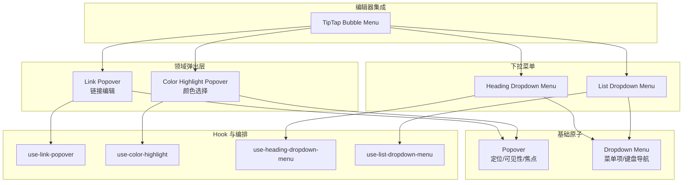
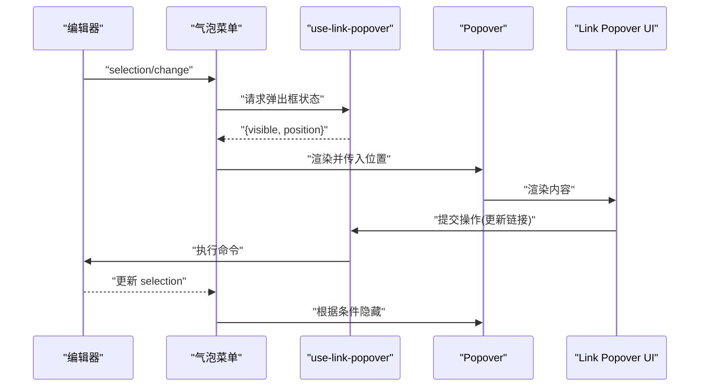
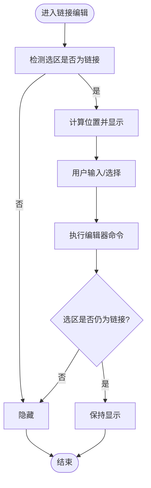
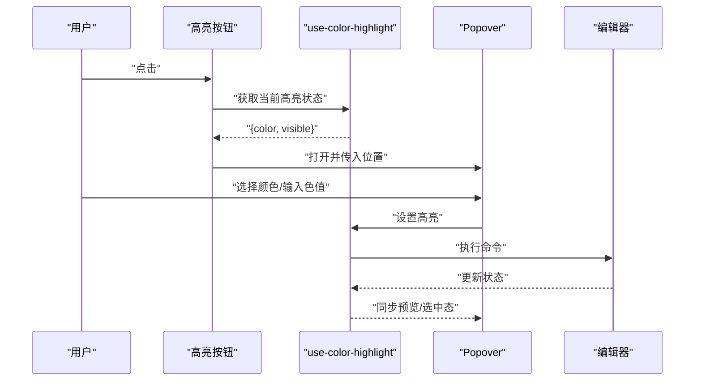
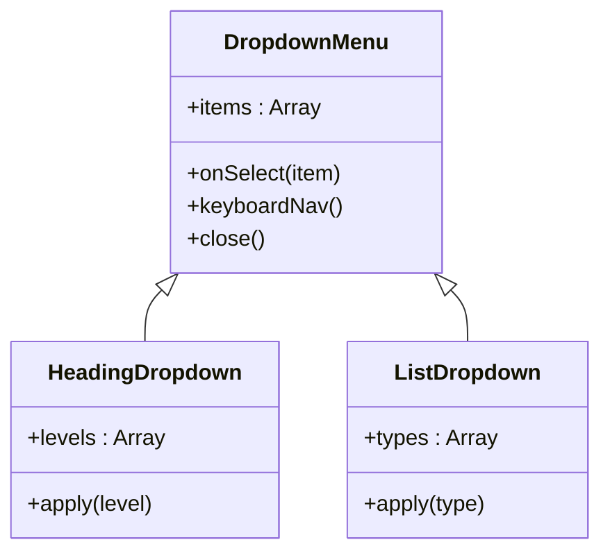
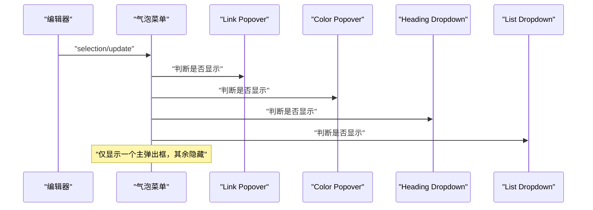
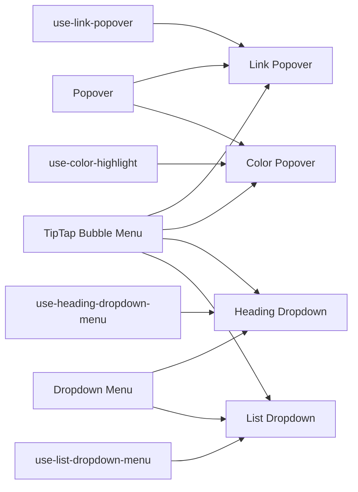

# 交互式弹出框

<cite>
**本文引用的文件**   
- [src/components/tiptap-ui/link-popover.tsx](file://src/components/tiptap-ui/link-popover.tsx)
- [src/components/tiptap-ui/use-link-popover.ts](file://src/components/tiptap-ui/use-link-popover.ts)
- [src/components/tiptap-ui/color-highlight-popover.tsx](file://src/components/tiptap-ui/color-highlight-popover.tsx)
- [src/components/tiptap-ui/color-highlight-button.tsx](file://src/components/tiptap-ui/color-highlight-button.tsx)
- [src/components/tiptap-ui/use-color-highlight.ts](file://src/components/tiptap-ui/use-color-highlight.ts)
- [src/components/tiptap-ui/heading-dropdown-menu.tsx](file://src/components/tiptap-ui/heading-dropdown-menu.tsx)
- [src/components/tiptap-ui/list-dropdown-menu.tsx](file://src/components/tiptap-ui/list-dropdown-menu.tsx)
- [src/components/tiptap-ui/use-heading-dropdown-menu.ts](file://src/components/tiptap-ui/use-heading-dropdown-menu.ts)
- [src/components/tiptap-ui/use-list-dropdown-menu.ts](file://src/components/tiptap-ui/use-list-dropdown-menu.ts)
- [src/components/tiptap-ui-primitive/popover.tsx](file://src/components/tiptap-ui-primitive/popover.tsx)
- [src/components/tiptap-ui-primitive/dropdown-menu.tsx](file://src/components/tiptap-ui-primitive/dropdown-menu.tsx)
- [src/hooks/use-menu-navigation.ts](file://src/hooks/use-menu-navigation.ts)
- [src/features/tiptap/TipTapBubbleMenu.tsx](file://src/features/tiptap/TipTapBubbleMenu.tsx)
</cite>

## 目录
1. [简介](#简介)
2. [项目结构](#项目结构)
3. [核心组件](#核心组件)
4. [架构总览](#架构总览)
5. [详细组件分析](#详细组件分析)
6. [依赖关系分析](#依赖关系分析)
7. [性能考虑](#性能考虑)
8. [故障排查指南](#故障排查指南)
9. [结论](#结论)
10. [附录](#附录)

## 简介
本技术文档聚焦富文本编辑器中的“交互式弹出框”体系，覆盖链接编辑弹窗、颜色高亮选择器、下拉菜单等复杂交互组件。重点阐述：
- 弹出框的定位算法与边界处理
- 焦点管理与键盘导航（Tab/Shift+Tab、方向键、Enter/Escape）
- 鼠标交互处理（点击打开/关闭、悬停、拖拽外边距）
- 生命周期管理（挂载/卸载、状态同步、事件传播）
- 定制化方案与主题适配策略

目标读者包括前端工程师、UI 组件开发者以及需要扩展或定制弹出行为的业务集成者。

## 项目结构
围绕弹出框的 UI 与交互逻辑主要分布在以下模块：
- 基础原子组件：Popover、Dropdown Menu、Button、Input 等
- 领域弹出层：Link Popover、Color Highlight Popover
- 下拉菜单：Heading Dropdown、List Dropdown
- 组合式 Hook：use-link-popover、use-color-highlight、use-heading-dropdown-menu、use-list-dropdown-menu
- 编辑器气泡菜单：TipTap Bubble Menu（作为弹出框触发与上下文来源）

图表来源
- [src/components/tiptap-ui-primitive/popover.tsx](file://src/components/tiptap-ui-primitive/popover.tsx)
- [src/components/tiptap-ui-primitive/dropdown-menu.tsx](file://src/components/tiptap-ui-primitive/dropdown-menu.tsx)
- [src/components/tiptap-ui/link-popover.tsx](file://src/components/tiptap-ui/link-popover.tsx)
- [src/components/tiptap-ui/color-highlight-popover.tsx](file://src/components/tiptap-ui/color-highlight-popover.tsx)
- [src/components/tiptap-ui/heading-dropdown-menu.tsx](file://src/components/tiptap-ui/heading-dropdown-menu.tsx)
- [src/components/tiptap-ui/list-dropdown-menu.tsx](file://src/components/tiptap-ui/list-dropdown-menu.tsx)
- [src/components/tiptap-ui/use-link-popover.ts](file://src/components/tiptap-ui/use-link-popover.ts)
- [src/components/tiptap-ui/use-color-highlight.ts](file://src/components/tiptap-ui/use-color-highlight.ts)
- [src/components/tiptap-ui/use-heading-dropdown-menu.ts](file://src/components/tiptap-ui/use-heading-dropdown-menu.ts)
- [src/components/tiptap-ui/use-list-dropdown-menu.ts](file://src/components/tiptap-ui/use-list-dropdown-menu.ts)
- [src/features/tiptap/TipTapBubbleMenu.tsx](file://src/features/tiptap/TipTapBubbleMenu.tsx)

章节来源
- [src/components/tiptap-ui-primitive/popover.tsx](file://src/components/tiptap-ui-primitive/popover.tsx)
- [src/components/tiptap-ui-primitive/dropdown-menu.tsx](file://src/components/tiptap-ui-primitive/dropdown-menu.tsx)
- [src/components/tiptap-ui/link-popover.tsx](file://src/components/tiptap-ui/link-popover.tsx)
- [src/components/tiptap-ui/color-highlight-popover.tsx](file://src/components/tiptap-ui/color-highlight-popover.tsx)
- [src/components/tiptap-ui/heading-dropdown-menu.tsx](file://src/components/tiptap-ui/heading-dropdown-menu.tsx)
- [src/components/tiptap-ui/list-dropdown-menu.tsx](file://src/components/tiptap-ui/list-dropdown-menu.tsx)
- [src/components/tiptap-ui/use-link-popover.ts](file://src/components/tiptap-ui/use-link-popover.ts)
- [src/components/tiptap-ui/use-color-highlight.ts](file://src/components/tiptap-ui/use-color-highlight.ts)
- [src/components/tiptap-ui/use-heading-dropdown-menu.ts](file://src/components/tiptap-ui/use-heading-dropdown-menu.ts)
- [src/components/tiptap-ui/use-list-dropdown-menu.ts](file://src/components/tiptap-ui/use-list-dropdown-menu.ts)
- [src/features/tiptap/TipTapBubbleMenu.tsx](file://src/features/tiptap/TipTapBubbleMenu.tsx)

## 核心组件
- 基础原子
  - Popover：负责弹出框的显示/隐藏、定位计算、层级与遮罩、焦点捕获与恢复、点击外部关闭、滚动监听重算位置等。
  - Dropdown Menu：负责菜单项集合、选中态、键盘导航（上下方向键）、回车确认、Esc 关闭、Tab 切换焦点等。
- 领域弹出层
  - Link Popover：在选中文本为链接时出现，提供 URL 输入、打开方式、删除链接等操作。
  - Color Highlight Popover：提供预设色板与自定义色值输入，支持实时预览与撤销/重做联动。
- 下拉菜单
  - Heading Dropdown：按标题级别分组展示，支持当前级别高亮与快速切换。
  - List Dropdown：有序/无序列表及任务列表的快速切换。
- 组合式 Hook
  - use-link-popover：封装链接弹出层的可见性、位置、数据绑定与命令执行。
  - use-color-highlight：封装高亮色的读取、设置与撤销/重做集成。
  - use-heading-dropdown-menu / use-list-dropdown-menu：封装对应菜单的状态与命令调用。

章节来源
- [src/components/tiptap-ui-primitive/popover.tsx](file://src/components/tiptap-ui-primitive/popover.tsx)
- [src/components/tiptap-ui-primitive/dropdown-menu.tsx](file://src/components/tiptap-ui-primitive/dropdown-menu.tsx)
- [src/components/tiptap-ui/link-popover.tsx](file://src/components/tiptap-ui/link-popover.tsx)
- [src/components/tiptap-ui/color-highlight-popover.tsx](file://src/components/tiptap-ui/color-highlight-popover.tsx)
- [src/components/tiptap-ui/heading-dropdown-menu.tsx](file://src/components/tiptap-ui/heading-dropdown-menu.tsx)
- [src/components/tiptap-ui/list-dropdown-menu.tsx](file://src/components/tiptap-ui/list-dropdown-menu.tsx)
- [src/components/tiptap-ui/use-link-popover.ts](file://src/components/tiptap-ui/use-link-popover.ts)
- [src/components/tiptap-ui/use-color-highlight.ts](file://src/components/tiptap-ui/use-color-highlight.ts)
- [src/components/tiptap-ui/use-heading-dropdown-menu.ts](file://src/components/tiptap-ui/use-heading-dropdown-menu.ts)
- [src/components/tiptap-ui/use-list-dropdown-menu.ts](file://src/components/tiptap-ui/use-list-dropdown-menu.ts)

## 架构总览
弹出框体系采用“原子 + 组合 Hook + 领域组件”的分层设计：
- 原子层（Popover/Dropdown）提供通用能力：定位、可见性、焦点、键盘导航。
- 组合层（use-*）将编辑器状态、命令与 UI 状态解耦，便于复用与测试。
- 领域层（Link/Color/Heading/List）聚合具体业务交互与样式。
- 编辑器集成层（TipTap Bubble Menu）作为触发源与上下文提供者。

图表来源
- [src/features/tiptap/TipTapBubbleMenu.tsx](file://src/features/tiptap/TipTapBubbleMenu.tsx)
- [src/components/tiptap-ui/use-link-popover.ts](file://src/components/tiptap-ui/use-link-popover.ts)
- [src/components/tiptap-ui-primitive/popover.tsx](file://src/components/tiptap-ui-primitive/popover.tsx)
- [src/components/tiptap-ui/link-popover.tsx](file://src/components/tiptap-ui/link-popover.tsx)

## 详细组件分析

### 链接编辑弹窗（Link Popover）
职责与行为
- 当存在链接选区时显示，包含 URL 输入、打开方式、删除链接等。
- 与编辑器命令集成，支持撤销/重做。
- 自动定位到选区附近，避免溢出视口。
- 焦点管理：打开后聚焦输入框；离开时恢复焦点至编辑器。

关键流程

图表来源
- [src/components/tiptap-ui/link-popover.tsx](file://src/components/tiptap-ui/link-popover.tsx)
- [src/components/tiptap-ui/use-link-popover.ts](file://src/components/tiptap-ui/use-link-popover.ts)
- [src/components/tiptap-ui-primitive/popover.tsx](file://src/components/tiptap-ui-primitive/popover.tsx)

章节来源
- [src/components/tiptap-ui/link-popover.tsx](file://src/components/tiptap-ui/link-popover.tsx)
- [src/components/tiptap-ui/use-link-popover.ts](file://src/components/tiptap-ui/use-link-popover.ts)
- [src/components/tiptap-ui-primitive/popover.tsx](file://src/components/tiptap-ui-primitive/popover.tsx)

### 颜色高亮选择器（Color Highlight Popover）
职责与行为
- 提供预设色板与自定义色值输入。
- 实时预览当前高亮效果，支持撤销/重做。
- 与编辑器标记状态同步，自动显示/隐藏。

交互要点
- 键盘：方向键在色板间移动，Enter 应用，Esc 关闭。
- 鼠标：点击色块应用，点击输入框聚焦，点击外部关闭。
- 定位：优先靠近光标选区，必要时翻转方向。

图表来源
- [src/components/tiptap-ui/color-highlight-popover.tsx](file://src/components/tiptap-ui/color-highlight-popover.tsx)
- [src/components/tiptap-ui/color-highlight-button.tsx](file://src/components/tiptap-ui/color-highlight-button.tsx)
- [src/components/tiptap-ui/use-color-highlight.ts](file://src/components/tiptap-ui/use-color-highlight.ts)
- [src/components/tiptap-ui-primitive/popover.tsx](file://src/components/tiptap-ui-primitive/popover.tsx)

章节来源
- [src/components/tiptap-ui/color-highlight-popover.tsx](file://src/components/tiptap-ui/color-highlight-popover.tsx)
- [src/components/tiptap-ui/color-highlight-button.tsx](file://src/components/tiptap-ui/color-highlight-button.tsx)
- [src/components/tiptap-ui/use-color-highlight.ts](file://src/components/tiptap-ui/use-color-highlight.ts)
- [src/components/tiptap-ui-primitive/popover.tsx](file://src/components/tiptap-ui-primitive/popover.tsx)

### 下拉菜单（Heading / List）
职责与行为
- 以分组形式展示可选条目（如标题级别、列表类型）。
- 支持键盘导航（上下方向键、Enter 确认、Esc 关闭、Tab 切换）。
- 与编辑器命令集成，实时更新选中态。

图表来源
- [src/components/tiptap-ui-primitive/dropdown-menu.tsx](file://src/components/tiptap-ui-primitive/dropdown-menu.tsx)
- [src/components/tiptap-ui/heading-dropdown-menu.tsx](file://src/components/tiptap-ui/heading-dropdown-menu.tsx)
- [src/components/tiptap-ui/list-dropdown-menu.tsx](file://src/components/tiptap-ui/list-dropdown-menu.tsx)

章节来源
- [src/components/tiptap-ui-primitive/dropdown-menu.tsx](file://src/components/tiptap-ui-primitive/dropdown-menu.tsx)
- [src/components/tiptap-ui/heading-dropdown-menu.tsx](file://src/components/tiptap-ui/heading-dropdown-menu.tsx)
- [src/components/tiptap-ui/list-dropdown-menu.tsx](file://src/components/tiptap-ui/list-dropdown-menu.tsx)

### 气泡菜单（TipTap Bubble Menu）
职责与行为
- 监听编辑器选区变化，决定显示哪些弹出框。
- 作为触发入口，向各弹出层传递位置与上下文。
- 协调多个弹出框的互斥显示与焦点转移。

图表来源
- [src/features/tiptap/TipTapBubbleMenu.tsx](file://src/features/tiptap/TipTapBubbleMenu.tsx)
- [src/components/tiptap-ui/link-popover.tsx](file://src/components/tiptap-ui/link-popover.tsx)
- [src/components/tiptap-ui/color-highlight-popover.tsx](file://src/components/tiptap-ui/color-highlight-popover.tsx)
- [src/components/tiptap-ui/heading-dropdown-menu.tsx](file://src/components/tiptap-ui/heading-dropdown-menu.tsx)
- [src/components/tiptap-ui/list-dropdown-menu.tsx](file://src/components/tiptap-ui/list-dropdown-menu.tsx)

章节来源
- [src/features/tiptap/TipTapBubbleMenu.tsx](file://src/features/tiptap/TipTapBubbleMenu.tsx)

## 依赖关系分析
- 组件耦合
  - 领域弹出层强依赖对应 Hook，弱依赖原子组件（Popover/Dropdown）。
  - 气泡菜单作为编排中心，依赖多个 Hook 与领域弹出层。
- 外部依赖
  - 编辑器命令系统（通过 Hook 调用），用于撤销/重做与状态同步。
  - DOM API 用于定位与尺寸测量。
- 潜在循环依赖
  - 通过 Hook 抽象命令与状态，避免组件直接反向依赖编辑器实例，降低耦合。

图表来源
- [src/components/tiptap-ui-primitive/popover.tsx](file://src/components/tiptap-ui-primitive/popover.tsx)
- [src/components/tiptap-ui-primitive/dropdown-menu.tsx](file://src/components/tiptap-ui-primitive/dropdown-menu.tsx)
- [src/components/tiptap-ui/link-popover.tsx](file://src/components/tiptap-ui/link-popover.tsx)
- [src/components/tiptap-ui/color-highlight-popover.tsx](file://src/components/tiptap-ui/color-highlight-popover.tsx)
- [src/components/tiptap-ui/heading-dropdown-menu.tsx](file://src/components/tiptap-ui/heading-dropdown-menu.tsx)
- [src/components/tiptap-ui/list-dropdown-menu.tsx](file://src/components/tiptap-ui/list-dropdown-menu.tsx)
- [src/components/tiptap-ui/use-link-popover.ts](file://src/components/tiptap-ui/use-link-popover.ts)
- [src/components/tiptap-ui/use-color-highlight.ts](file://src/components/tiptap-ui/use-color-highlight.ts)
- [src/components/tiptap-ui/use-heading-dropdown-menu.ts](file://src/components/tiptap-ui/use-heading-dropdown-menu.ts)
- [src/components/tiptap-ui/use-list-dropdown-menu.ts](file://src/components/tiptap-ui/use-list-dropdown-menu.ts)
- [src/features/tiptap/TipTapBubbleMenu.tsx](file://src/features/tiptap/TipTapBubbleMenu.tsx)

章节来源
- [src/components/tiptap-ui-primitive/popover.tsx](file://src/components/tiptap-ui-primitive/popover.tsx)
- [src/components/tiptap-ui-primitive/dropdown-menu.tsx](file://src/components/tiptap-ui-primitive/dropdown-menu.tsx)
- [src/components/tiptap-ui/link-popover.tsx](file://src/components/tiptap-ui/link-popover.tsx)
- [src/components/tiptap-ui/color-highlight-popover.tsx](file://src/components/tiptap-ui/color-highlight-popover.tsx)
- [src/components/tiptap-ui/heading-dropdown-menu.tsx](file://src/components/tiptap-ui/heading-dropdown-menu.tsx)
- [src/components/tiptap-ui/list-dropdown-menu.tsx](file://src/components/tiptap-ui/list-dropdown-menu.tsx)
- [src/components/tiptap-ui/use-link-popover.ts](file://src/components/tiptap-ui/use-link-popover.ts)
- [src/components/tiptap-ui/use-color-highlight.ts](file://src/components/tiptap-ui/use-color-highlight.ts)
- [src/components/tiptap-ui/use-heading-dropdown-menu.ts](file://src/components/tiptap-ui/use-heading-dropdown-menu.ts)
- [src/components/tiptap-ui/use-list-dropdown-menu.ts](file://src/components/tiptap-ui/use-list-dropdown-menu.ts)
- [src/features/tiptap/TipTapBubbleMenu.tsx](file://src/features/tiptap/TipTapBubbleMenu.tsx)

## 性能考虑
- 定位计算节流：在滚动/窗口缩放场景下对位置重算进行节流或防抖，减少频繁布局抖动。
- 最小化重绘：使用 transform 而非 top/left 进行位移，结合 will-change 提示浏览器优化合成层。
- 事件合并：批量处理 selection/change 事件，避免重复渲染。
- 惰性渲染：仅在可见时渲染复杂子树（如色板网格），提升首屏性能。
- 内存管理：组件卸载时移除全局事件监听与定时器，防止泄漏。

[本节为通用指导，不直接分析具体文件]

## 故障排查指南
常见问题与定位建议
- 弹出框被遮挡或错位
  - 检查容器 overflow 与 z-index 层级，确保 Popover 挂载于合适容器。
  - 验证定位计算是否受父级 transform 影响，必要时调整参考元素。
- 焦点丢失或无法回到编辑器
  - 确认关闭时是否正确恢复焦点，避免全局焦点劫持。
  - 检查 Tab 顺序与 aria-* 属性是否完整。
- 键盘导航异常
  - 核对菜单项可聚焦性与方向键处理逻辑，确保 Enter/Esc 行为一致。
- 状态不同步
  - 检查 Hook 中命令回调是否触发，编辑器状态变更是否回写 UI。
- 多次点击导致闪烁
  - 增加防抖与互斥显示逻辑，避免同时打开多个弹出框。

章节来源
- [src/components/tiptap-ui-primitive/popover.tsx](file://src/components/tiptap-ui-primitive/popover.tsx)
- [src/components/tiptap-ui-primitive/dropdown-menu.tsx](file://src/components/tiptap-ui-primitive/dropdown-menu.tsx)
- [src/components/tiptap-ui/link-popover.tsx](file://src/components/tiptap-ui/link-popover.tsx)
- [src/components/tiptap-ui/color-highlight-popover.tsx](file://src/components/tiptap-ui/color-highlight-popover.tsx)
- [src/components/tiptap-ui/heading-dropdown-menu.tsx](file://src/components/tiptap-ui/heading-dropdown-menu.tsx)
- [src/components/tiptap-ui/list-dropdown-menu.tsx](file://src/components/tiptap-ui/list-dropdown-menu.tsx)
- [src/components/tiptap-ui/use-link-popover.ts](file://src/components/tiptap-ui/use-link-popover.ts)
- [src/components/tiptap-ui/use-color-highlight.ts](file://src/components/tiptap-ui/use-color-highlight.ts)
- [src/components/tiptap-ui/use-heading-dropdown-menu.ts](file://src/components/tiptap-ui/use-heading-dropdown-menu.ts)
- [src/components/tiptap-ui/use-list-dropdown-menu.ts](file://src/components/tiptap-ui/use-list-dropdown-menu.ts)
- [src/features/tiptap/TipTapBubbleMenu.tsx](file://src/features/tiptap/TipTapBubbleMenu.tsx)

## 结论
该弹出框体系通过原子组件与组合 Hook 的清晰分层，实现了高内聚、低耦合的可复用交互能力。定位算法、焦点管理与键盘导航在原子层统一实现，领域层专注业务语义，气泡菜单负责编排与上下文分发。整体具备良好的可扩展性与主题适配能力，适合在富文本场景中持续演进。

[本节为总结，不直接分析具体文件]

## 附录

### 定位算法与边界处理
- 参考元素：以选区或触发按钮为锚点，计算相对坐标。
- 视口碰撞检测：检测水平/垂直溢出，必要时翻转方向或吸附边缘。
- 滚动与缩放：监听滚动与窗口尺寸变化，动态修正位置。
- 容器裁剪：若位于滚动容器内，需基于容器边界重新计算。

章节来源
- [src/components/tiptap-ui-primitive/popover.tsx](file://src/components/tiptap-ui-primitive/popover.tsx)

### 焦点管理与键盘导航
- 焦点捕获：打开时聚焦首个可交互元素，关闭时恢复原焦点。
- 菜单导航：上下方向键遍历，Enter 确认，Esc 关闭，Tab 切换焦点域。
- 无障碍：提供 aria-* 与 role 标注，确保屏幕阅读器可用。

章节来源
- [src/components/tiptap-ui-primitive/dropdown-menu.tsx](file://src/components/tiptap-ui-primitive/dropdown-menu.tsx)
- [src/hooks/use-menu-navigation.ts](file://src/hooks/use-menu-navigation.ts)

### 生命周期与事件传播
- 挂载/卸载：注册/注销全局事件（点击外部、滚动、resize）。
- 状态同步：与编辑器命令双向同步，保证撤销/重做一致性。
- 事件冒泡：阻止不必要的冒泡，避免误触关闭。

章节来源
- [src/components/tiptap-ui-primitive/popover.tsx](file://src/components/tiptap-ui-primitive/popover.tsx)
- [src/components/tiptap-ui/use-link-popover.ts](file://src/components/tiptap-ui/use-link-popover.ts)
- [src/components/tiptap-ui/use-color-highlight.ts](file://src/components/tiptap-ui/use-color-highlight.ts)

### 定制化与主题适配
- 主题变量：通过 CSS 变量定义间距、圆角、阴影、字体与色彩，便于一键换肤。
- 插槽与配置：暴露位置偏移、最大宽度、动画时长等配置项。
- 图标与文案：通过 props 注入图标与本地化文案，适配多语言与品牌风格。
- 扩展点：在 Hook 中注入自定义命令与校验逻辑，满足业务差异化需求。

章节来源
- [src/components/tiptap-ui-primitive/popover.tsx](file://src/components/tiptap-ui-primitive/popover.tsx)
- [src/components/tiptap-ui-primitive/dropdown-menu.tsx](file://src/components/tiptap-ui-primitive/dropdown-menu.tsx)
- [src/components/tiptap-ui/link-popover.tsx](file://src/components/tiptap-ui/link-popover.tsx)
- [src/components/tiptap-ui/color-highlight-popover.tsx](file://src/components/tiptap-ui/color-highlight-popover.tsx)
- [src/components/tiptap-ui/heading-dropdown-menu.tsx](file://src/components/tiptap-ui/heading-dropdown-menu.tsx)
- [src/components/tiptap-ui/list-dropdown-menu.tsx](file://src/components/tiptap-ui/list-dropdown-menu.tsx)