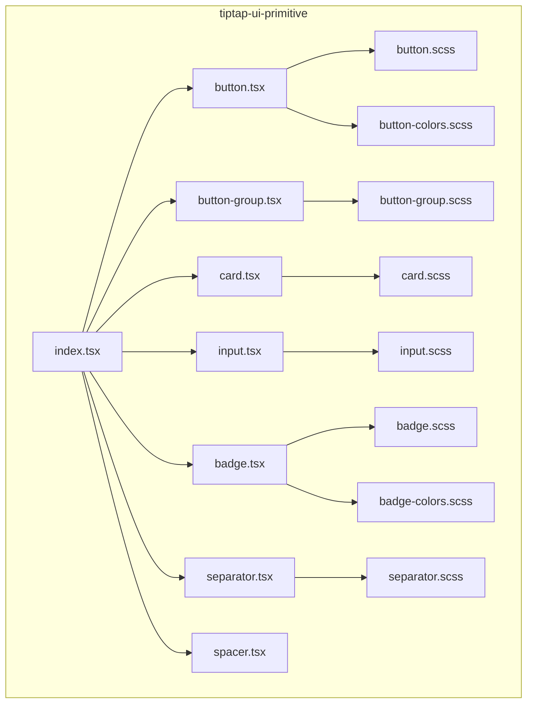
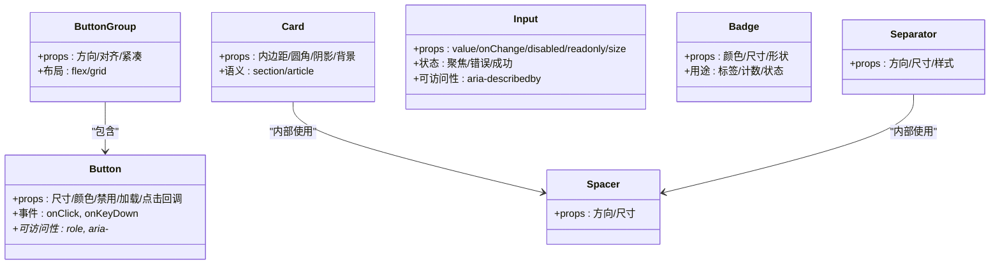
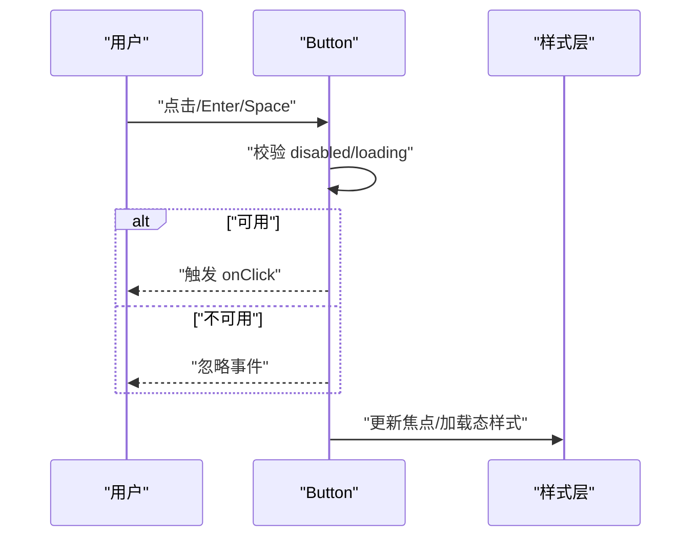
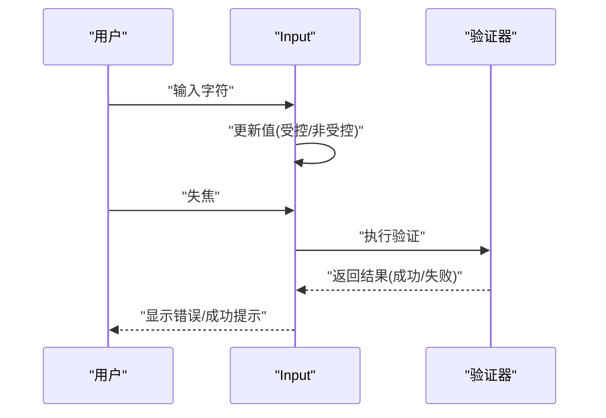
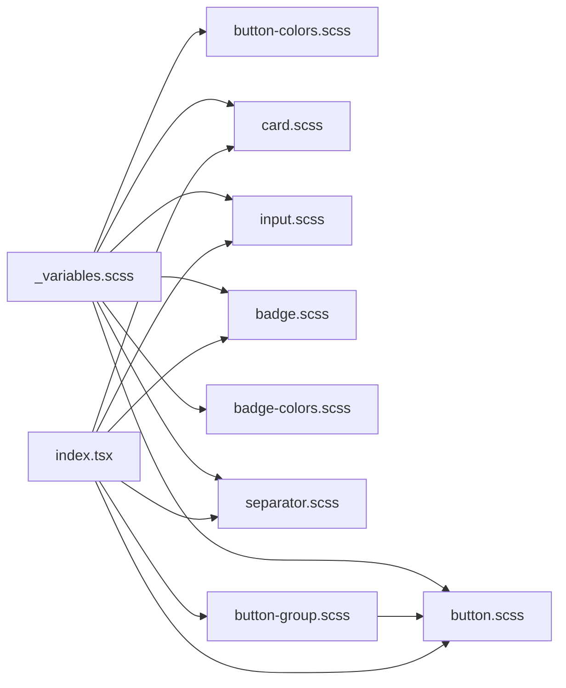

# 基础 UI 组件

<cite>
**本文引用的文件**   
- [src/components/tiptap-ui-primitive/button.tsx](file://src/components/tiptap-ui-primitive/button.tsx)
- [src/components/tiptap-ui-primitive/button.scss](file://src/components/tiptap-ui-primitive/button.scss)
- [src/components/tiptap-ui-primitive/button-colors.scss](file://src/components/tiptap-ui-primitive/button-colors.scss)
- [src/components/tiptap-ui-primitive/button-group.tsx](file://src/components/tiptap-ui-primitive/button-group.tsx)
- [src/components/tiptap-ui-primitive/button-group.scss](file://src/components/tiptap-ui-primitive/button-group.scss)
- [src/components/tiptap-ui-primitive/card.tsx](file://src/components/tiptap-ui-primitive/card.tsx)
- [src/components/tiptap-ui-primitive/card.scss](file://src/components/tiptap-ui-primitive/card.scss)
- [src/components/tiptap-ui-primitive/input.tsx](file://src/components/tiptap-ui-primitive/input.tsx)
- [src/components/tiptap-ui-primitive/input.scss](file://src/components/tiptap-ui-primitive/input.scss)
- [src/components/tiptap-ui-primitive/badge.tsx](file://src/components/tiptap-ui-primitive/badge.tsx)
- [src/components/tiptap-ui-primitive/badge.scss](file://src/components/tiptap-ui-primitive/badge.scss)
- [src/components/tiptap-ui-primitive/badge-colors.scss](file://src/components/tiptap-ui-primitive/badge-colors.scss)
- [src/components/tiptap-ui-primitive/separator.tsx](file://src/components/tiptap-ui-primitive/separator.tsx)
- [src/components/tiptap-ui-primitive/separator.scss](file://src/components/tiptap-ui-primitive/separator.scss)
- [src/components/tiptap-ui-primitive/spacer.tsx](file://src/components/tiptap-ui-primitive/spacer.tsx)
- [src/components/tiptap-ui-primitive/index.tsx](file://src/components/tiptap-ui-primitive/index.tsx)
- [src/styles/_variables.scss](file://src/styles/_variables.scss)
</cite>

## 目录
1. [简介](#简介)
2. [项目结构](#项目结构)
3. [核心组件](#核心组件)
4. [架构总览](#架构总览)
5. [详细组件分析](#详细组件分析)
6. [依赖关系分析](#依赖关系分析)
7. [性能考量](#性能考量)
8. [故障排查指南](#故障排查指南)
9. [结论](#结论)
10. [附录](#附录)

## 简介
本文件为“基础 UI 组件”技术文档，聚焦原子级 UI 组件：按钮、卡片、输入框、徽章、分隔符等。文档从设计模式与实现细节出发，系统说明各组件的 props 接口、样式定制选项、状态管理与事件处理机制，并覆盖可访问性支持、响应式设计与主题适配方案。同时提供使用示例与最佳实践，包括组合模式与性能优化建议，帮助读者在复杂业务场景中高效复用与扩展这些原子组件。

## 项目结构
基础 UI 组件位于 tiptap-ui-primitive 子目录中，采用“组件 + 样式 + 可选颜色变体”的组织方式，并通过统一入口进行导出，便于上层功能模块按需引入。

图表来源
- [src/components/tiptap-ui-primitive/button.tsx](file://src/components/tiptap-ui-primitive/button.tsx)
- [src/components/tiptap-ui-primitive/button.scss](file://src/components/tiptap-ui-primitive/button.scss)
- [src/components/tiptap-ui-primitive/button-colors.scss](file://src/components/tiptap-ui-primitive/button-colors.scss)
- [src/components/tiptap-ui-primitive/button-group.tsx](file://src/components/tiptap-ui-primitive/button-group.tsx)
- [src/components/tiptap-ui-primitive/button-group.scss](file://src/components/tiptap-ui-primitive/button-group.scss)
- [src/components/tiptap-ui-primitive/card.tsx](file://src/components/tiptap-ui-primitive/card.tsx)
- [src/components/tiptap-ui-primitive/card.scss](file://src/components/tiptap-ui-primitive/card.scss)
- [src/components/tiptap-ui-primitive/input.tsx](file://src/components/tiptap-ui-primitive/input.tsx)
- [src/components/tiptap-ui-primitive/input.scss](file://src/components/tiptap-ui-primitive/input.scss)
- [src/components/tiptap-ui-primitive/badge.tsx](file://src/components/tiptap-ui-primitive/badge.tsx)
- [src/components/tiptap-ui-primitive/badge.scss](file://src/components/tiptap-ui-primitive/badge.scss)
- [src/components/tiptap-ui-primitive/badge-colors.scss](file://src/components/tiptap-ui-primitive/badge-colors.scss)
- [src/components/tiptap-ui-primitive/separator.tsx](file://src/components/tiptap-ui-primitive/separator.tsx)
- [src/components/tiptap-ui-primitive/separator.scss](file://src/components/tiptap-ui-primitive/separator.scss)
- [src/components/tiptap-ui-primitive/spacer.tsx](file://src/components/tiptap-ui-primitive/spacer.tsx)
- [src/components/tiptap-ui-primitive/index.tsx](file://src/components/tiptap-ui-primitive/index.tsx)

章节来源
- [src/components/tiptap-ui-primitive/index.tsx](file://src/components/tiptap-ui-primitive/index.tsx)

## 核心组件
本节概述各原子组件的职责边界与设计原则：
- 按钮 Button：承载交互动作，支持多种尺寸、颜色、禁用态与加载态；可与图标组合；具备键盘可达性与焦点管理。
- 按钮组 ButtonGroup：将一组按钮以视觉分组呈现，支持紧凑布局与对齐策略。
- 卡片 Card：作为内容容器，提供圆角、阴影、内边距与背景色等外观能力，用于信息聚合展示。
- 输入框 Input：受控与非受控两种模式，支持占位符、只读、禁用、大小与错误提示等状态。
- 徽章 Badge：用于标签、计数或状态标识，支持颜色变体与尺寸控制。
- 分隔符 Separator：提供水平或垂直分割线，用于区域划分。
- 间距 Spacer：提供可控的空白间距，辅助排版节奏。

章节来源
- [src/components/tiptap-ui-primitive/button.tsx](file://src/components/tiptap-ui-primitive/button.tsx)
- [src/components/tiptap-ui-primitive/button-group.tsx](file://src/components/tiptap-ui-primitive/button-group.tsx)
- [src/components/tiptap-ui-primitive/card.tsx](file://src/components/tiptap-ui-primitive/card.tsx)
- [src/components/tiptap-ui-primitive/input.tsx](file://src/components/tiptap-ui-primitive/input.tsx)
- [src/components/tiptap-ui-primitive/badge.tsx](file://src/components/tiptap-ui-primitive/badge.tsx)
- [src/components/tiptap-ui-primitive/separator.tsx](file://src/components/tiptap-ui-primitive/separator.tsx)
- [src/components/tiptap-ui-primitive/spacer.tsx](file://src/components/tiptap-ui-primitive/spacer.tsx)

## 架构总览
基础 UI 组件遵循“低耦合、高内聚”的原子化设计：每个组件独立维护自身状态与样式，通过 props 暴露最小必要接口；样式采用 SCSS 模块化组织，颜色变体通过独立样式文件注入；统一入口 index.tsx 对外导出，降低上层引用成本。

图表来源
- [src/components/tiptap-ui-primitive/button.tsx](file://src/components/tiptap-ui-primitive/button.tsx)
- [src/components/tiptap-ui-primitive/button-group.tsx](file://src/components/tiptap-ui-primitive/button-group.tsx)
- [src/components/tiptap-ui-primitive/card.tsx](file://src/components/tiptap-ui-primitive/card.tsx)
- [src/components/tiptap-ui-primitive/input.tsx](file://src/components/tiptap-ui-primitive/input.tsx)
- [src/components/tiptap-ui-primitive/badge.tsx](file://src/components/tiptap-ui-primitive/badge.tsx)
- [src/components/tiptap-ui-primitive/separator.tsx](file://src/components/tiptap-ui-primitive/separator.tsx)
- [src/components/tiptap-ui-primitive/spacer.tsx](file://src/components/tiptap-ui-primitive/spacer.tsx)

## 详细组件分析

### 按钮 Button
- 设计要点
  - 行为：触发操作，支持点击、键盘回车/空格激活。
  - 状态：默认、悬停、聚焦、禁用、加载（旋转指示）。
  - 外观：尺寸（小/中/大）、颜色（主/次/危险/中性等）、边框与圆角。
  - 组合：可与图标前后排列，文本与图标对齐一致。
- Props 接口（概念）
  - 基础：children、disabled、loading、onClick、onKeyDown、id、className/style。
  - 外观：variant（颜色）、size（尺寸）、fullWidth、iconPosition（前/后）。
  - 可访问性：aria-label、aria-busy（加载时）、aria-disabled。
- 样式定制
  - 通过 CSS 变量或类名覆盖基础样式；颜色变体由 button-colors.scss 提供。
  - 尺寸与间距由 button.scss 控制，支持响应式断点下的字号与高度调整。
- 状态管理与事件处理
  - loading 状态下禁用交互并设置 aria-busy。
  - 键盘事件拦截 Enter/Space 以模拟点击，确保可达性。
- 可访问性
  - 语义角色与属性：role="button"（如非原生 button）、tabIndex、aria-*。
  - 焦点可见性：outline 与 focus-visible 样式。
- 响应式设计
  - 在小屏下自动缩小字号与高度，保持触控目标尺寸。
- 主题适配
  - 基于全局变量与颜色 token，支持明暗主题切换。
- 使用示例与最佳实践
  - 与图标组合时，优先使用 iconPosition 控制位置。
  - 长文本按钮避免换行，必要时截断或改用多行布局。
  - 批量操作建议使用按钮组，减少误触。

章节来源
- [src/components/tiptap-ui-primitive/button.tsx](file://src/components/tiptap-ui-primitive/button.tsx)
- [src/components/tiptap-ui-primitive/button.scss](file://src/components/tiptap-ui-primitive/button.scss)
- [src/components/tiptap-ui-primitive/button-colors.scss](file://src/components/tiptap-ui-primitive/button-colors.scss)

#### 交互序列图（点击与键盘）

图表来源
- [src/components/tiptap-ui-primitive/button.tsx](file://src/components/tiptap-ui-primitive/button.tsx)
- [src/components/tiptap-ui-primitive/button.scss](file://src/components/tiptap-ui-primitive/button.scss)

### 按钮组 ButtonGroup
- 设计要点
  - 将多个按钮按方向（水平/垂直）与对齐方式进行分组，增强操作关联性与视觉一致性。
- Props 接口（概念）
  - direction（horizontal/vertical）、align（start/center/end）、compact（紧凑模式）。
- 样式定制
  - 通过 button-group.scss 控制间距、对齐与紧凑模式下的重叠效果。
- 可访问性
  - 为组合中的按钮提供一致的 tab 顺序与焦点环。
- 响应式设计
  - 在小屏幕下自动折叠为纵向堆叠或启用滚动条。
- 使用示例与最佳实践
  - 将相关操作（保存/取消/删除）放入同一组，提升操作效率。
  - 避免在同一组中混入不同语义的按钮（如导航与操作）。

章节来源
- [src/components/tiptap-ui-primitive/button-group.tsx](file://src/components/tiptap-ui-primitive/button-group.tsx)
- [src/components/tiptap-ui-primitive/button-group.scss](file://src/components/tiptap-ui-primitive/button-group.scss)

### 卡片 Card
- 设计要点
  - 作为内容容器，提供统一的圆角、阴影、内边距与背景色，用于信息聚合与层次区分。
- Props 接口（概念）
  - padding、radius、shadow、background、hoverable、interactive。
- 样式定制
  - card.scss 定义基础外观，可通过 className/style 覆盖。
- 可访问性
  - 根据用途选择合适语义标签（section/article），并为交互卡片提供键盘可达性。
- 响应式设计
  - 在不同断点下调整内边距与阴影强度，保证可读性与层级感。
- 使用示例与最佳实践
  - 卡片内避免过多嵌套，保持内容密度适中。
  - 对重要信息使用标题与副标题分层，配合分隔符与间距提升可读性。

章节来源
- [src/components/tiptap-ui-primitive/card.tsx](file://src/components/tiptap-ui-primitive/card.tsx)
- [src/components/tiptap-ui-primitive/card.scss](file://src/components/tiptap-ui-primitive/card.scss)

### 输入框 Input
- 设计要点
  - 提供文本输入能力，支持受控与非受控模式，具备清晰的反馈与错误提示。
- Props 接口（概念）
  - value/onChange（受控）、defaultValue（非受控）、placeholder、disabled、readOnly、size、error、success、helperText、prefix/suffix。
- 样式定制
  - input.scss 控制边框、圆角、内边距、错误/成功态样式；可与图标组合。
- 状态管理与事件处理
  - 受控模式下由父组件管理值变化；非受控模式内部维护本地状态。
  - 失焦时触发验证，显示错误提示。
- 可访问性
  - 关联 label 与 helperText，使用 aria-describedby 指向提示信息。
- 响应式设计
  - 在小屏下增大触控区域，调整字号与行高。
- 使用示例与最佳实践
  - 始终提供明确的 label 与占位符提示。
  - 错误信息应具体且可操作，避免仅显示通用错误。

章节来源
- [src/components/tiptap-ui-primitive/input.tsx](file://src/components/tiptap-ui-primitive/input.tsx)
- [src/components/tiptap-ui-primitive/input.scss](file://src/components/tiptap-ui-primitive/input.scss)

#### 输入流程时序图

图表来源
- [src/components/tiptap-ui-primitive/input.tsx](file://src/components/tiptap-ui-primitive/input.tsx)

### 徽章 Badge
- 设计要点
  - 用于标签、计数或状态标识，强调关键信息，不承载主要交互。
- Props 接口（概念）
  - variant（颜色）、size（小/中/大）、shape（圆角/圆形）、content。
- 样式定制
  - badge.scss 定义基础样式；badge-colors.scss 提供颜色变体。
- 可访问性
  - 当用于传达状态时，提供 aria-live 或 role="status"。
- 响应式设计
  - 在小屏下减小字号与内边距，保持可读性。
- 使用示例与最佳实践
  - 计数徽章避免过长数字，必要时省略号或单位缩写。
  - 颜色需符合语义（成功/警告/错误），并与主题保持一致。

章节来源
- [src/components/tiptap-ui-primitive/badge.tsx](file://src/components/tiptap-ui-primitive/badge.tsx)
- [src/components/tiptap-ui-primitive/badge.scss](file://src/components/tiptap-ui-primitive/badge.scss)
- [src/components/tiptap-ui-primitive/badge-colors.scss](file://src/components/tiptap-ui-primitive/badge-colors.scss)

### 分隔符 Separator
- 设计要点
  - 提供水平或垂直分割线，用于区域划分与信息分组。
- Props 接口（概念）
  - orientation（horizontal/vertical）、thickness、color、style（实线/虚线）。
- 样式定制
  - separator.scss 控制线条粗细、颜色与样式。
- 可访问性
  - 作为装饰元素时使用 aria-hidden="true"，避免被读屏器朗读。
- 响应式设计
  - 在小屏下适当缩短长度或隐藏，避免占用过多空间。
- 使用示例与最佳实践
  - 在长列表或表单分区中使用，提升信息层次。

章节来源
- [src/components/tiptap-ui-primitive/separator.tsx](file://src/components/tiptap-ui-primitive/separator.tsx)
- [src/components/tiptap-ui-primitive/separator.scss](file://src/components/tiptap-ui-primitive/separator.scss)

### 间距 Spacer
- 设计要点
  - 提供可控的空白间距，辅助排版节奏与视觉呼吸感。
- Props 接口（概念）
  - direction（horizontal/vertical）、size（数值或 token）。
- 样式定制
  - 通过 size 映射到统一的间距 token，确保整体一致性。
- 使用示例与最佳实践
  - 在卡片、表单字段之间使用 Spacer 控制间距，避免硬编码 margin。

章节来源
- [src/components/tiptap-ui-primitive/spacer.tsx](file://src/components/tiptap-ui-primitive/spacer.tsx)

## 依赖关系分析
- 组件间依赖
  - ButtonGroup 依赖 Button 进行渲染与布局。
  - Card、Separator 内部可能使用 Spacer 控制间距。
- 样式依赖
  - 各组件样式文件相互独立，颜色变体通过独立的 *-colors.scss 注入。
  - 全局变量 _variables.scss 提供主题 token（颜色、间距、圆角等）。
- 入口导出
  - index.tsx 统一导出所有原子组件，简化上层引用路径。

图表来源
- [src/components/tiptap-ui-primitive/index.tsx](file://src/components/tiptap-ui-primitive/index.tsx)
- [src/components/tiptap-ui-primitive/button.tsx](file://src/components/tiptap-ui-primitive/button.tsx)
- [src/components/tiptap-ui-primitive/button.scss](file://src/components/tiptap-ui-primitive/button.scss)
- [src/components/tiptap-ui-primitive/button-colors.scss](file://src/components/tiptap-ui-primitive/button-colors.scss)
- [src/components/tiptap-ui-primitive/button-group.tsx](file://src/components/tiptap-ui-primitive/button-group.tsx)
- [src/components/tiptap-ui-primitive/button-group.scss](file://src/components/tiptap-ui-primitive/button-group.scss)
- [src/components/tiptap-ui-primitive/card.tsx](file://src/components/tiptap-ui-primitive/card.tsx)
- [src/components/tiptap-ui-primitive/card.scss](file://src/components/tiptap-ui-primitive/card.scss)
- [src/components/tiptap-ui-primitive/input.tsx](file://src/components/tiptap-ui-primitive/input.tsx)
- [src/components/tiptap-ui-primitive/input.scss](file://src/components/tiptap-ui-primitive/input.scss)
- [src/components/tiptap-ui-primitive/badge.tsx](file://src/components/tiptap-ui-primitive/badge.tsx)
- [src/components/tiptap-ui-primitive/badge.scss](file://src/components/tiptap-ui-primitive/badge.scss)
- [src/components/tiptap-ui-primitive/badge-colors.scss](file://src/components/tiptap-ui-primitive/badge-colors.scss)
- [src/components/tiptap-ui-primitive/separator.tsx](file://src/components/tiptap-ui-primitive/separator.tsx)
- [src/components/tiptap-ui-primitive/separator.scss](file://src/components/tiptap-ui-primitive/separator.scss)
- [src/styles/_variables.scss](file://src/styles/_variables.scss)

章节来源
- [src/components/tiptap-ui-primitive/index.tsx](file://src/components/tiptap-ui-primitive/index.tsx)
- [src/styles/_variables.scss](file://src/styles/_variables.scss)

## 性能考量
- 渲染优化
  - 按钮与输入框在频繁交互场景下避免不必要的重渲染，合理使用受控模式与防抖/节流。
  - 徽章与分隔符为纯展示组件，尽量无状态以减少计算开销。
- 样式优化
  - 颜色变体与尺寸通过类名切换，避免动态 style 注入导致的样式抖动。
  - 利用 CSS 变量与 token 减少重复计算，提高主题切换性能。
- 可访问性与性能平衡
  - 仅在需要时添加 aria-live 或 role，避免过度标注影响读屏器性能。

[本节为通用指导，无需特定文件来源]

## 故障排查指南
- 按钮无法点击
  - 检查 disabled/loading 状态是否被意外设置。
  - 确认 onClick 是否正确绑定，键盘事件是否被拦截。
- 输入框值未更新
  - 受控模式下确认 onChange 是否调用并更新 state。
  - 非受控模式下检查 defaultValue 与 ref 的使用。
- 样式未生效
  - 确认对应 *.scss 文件已正确导入。
  - 检查全局变量 _variables.scss 中的 token 是否被覆盖。
- 可访问性问题
  - 核对 aria-* 属性与语义标签是否符合预期。
  - 测试键盘导航与焦点可见性。

章节来源
- [src/components/tiptap-ui-primitive/button.tsx](file://src/components/tiptap-ui-primitive/button.tsx)
- [src/components/tiptap-ui-primitive/input.tsx](file://src/components/tiptap-ui-primitive/input.tsx)
- [src/styles/_variables.scss](file://src/styles/_variables.scss)

## 结论
基础 UI 组件以原子化、可组合、可定制为核心设计理念，通过清晰的 props 接口、完善的样式体系与可访问性支持，满足多样化业务场景需求。建议在项目中统一通过 index.tsx 引入，结合主题变量与颜色变体实现一致的外观与体验。在复杂页面中，优先使用按钮组、卡片与分隔符构建清晰的信息层次，并使用 Spacer 控制间距以提升可读性与美观度。

[本节为总结性内容，无需特定文件来源]

## 附录
- 主题适配建议
  - 使用 _variables.scss 中的 token 统一管理颜色、间距与圆角，确保明暗主题一致。
  - 新增颜色变体时，优先在对应的 *-colors.scss 中扩展，避免侵入组件逻辑。
- 组合使用模式
  - 表单：Card 包裹 Input 与 Separator，Spacer 控制字段间距。
  - 工具栏：ButtonGroup 包含多个 Button，配合 Badge 显示计数。
  - 列表项：Card 作为容器，内部使用 Separator 与 Spacer 划分区块。

章节来源
- [src/styles/_variables.scss](file://src/styles/_variables.scss)
- [src/components/tiptap-ui-primitive/index.tsx](file://src/components/tiptap-ui-primitive/index.tsx)