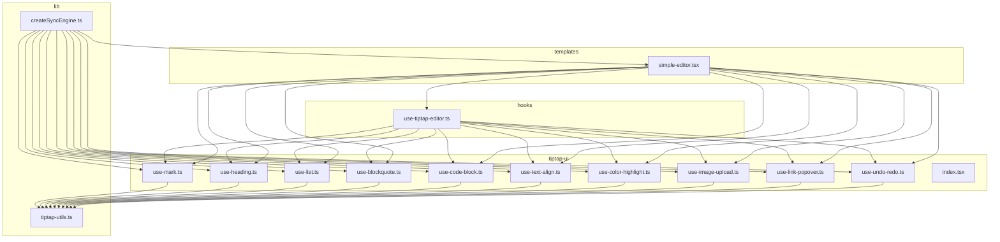
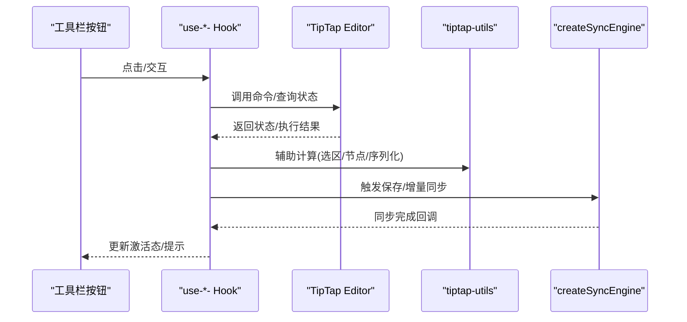
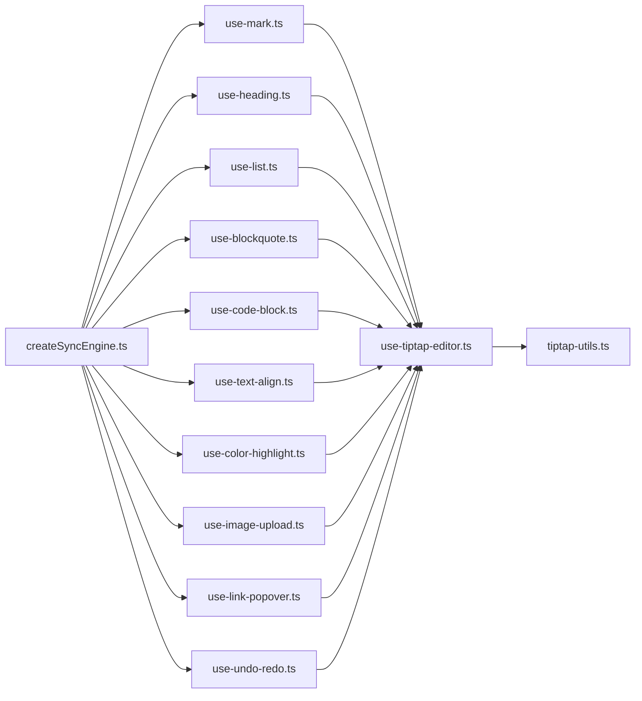

# 工具栏工具函数

<cite>
**本文引用的文件**   
- [use-tiptap-editor.ts](file://src/hooks/use-tiptap-editor.ts)
- [use-mark.ts](file://src/components/tiptap-ui/use-mark.ts)
- [use-heading.ts](file://src/components/tiptap-ui/use-heading.ts)
- [use-list.ts](file://src/components/tiptap-ui/use-list.ts)
- [use-blockquote.ts](file://src/components/tiptap-ui/use-blockquote.ts)
- [use-code-block.ts](file://src/components/tiptap-ui/use-code-block.ts)
- [use-text-align.ts](file://src/components/tiptap-ui/use-text-align.ts)
- [use-color-highlight.ts](file://src/components/tiptap-ui/use-color-highlight.ts)
- [use-image-upload.ts](file://src/components/tiptap-ui/use-image-upload.ts)
- [use-link-popover.ts](file://src/components/tiptap-ui/use-link-popover.ts)
- [use-undo-redo.ts](file://src/components/tiptap-ui/use-undo-redo.ts)
- [tiptap-utils.ts](file://src/lib/tiptap-utils.ts)
- [createSyncEngine.ts](file://src/lib/createSyncEngine.ts)
- [simple-editor.tsx](file://src/components/tiptap-templates/simple/simple-editor.tsx)
- [index.tsx](file://src/components/tiptap-ui/index.tsx)
</cite>

## 目录
1. [简介](#简介)
2. [项目结构](#项目结构)
3. [核心组件](#核心组件)
4. [架构总览](#架构总览)
5. [详细组件分析](#详细组件分析)
6. [依赖关系分析](#依赖关系分析)
7. [性能考量](#性能考量)
8. [故障排查指南](#故障排查指南)
9. [结论](#结论)
10. [附录](#附录)

## 简介
本文件聚焦于富文本编辑器工具栏中的“工具函数”（以 useHook 形式组织），系统性梳理其设计模式、实现原理与与 TipTap 的深度集成方式。文档覆盖以下关键主题：
- 编辑器状态监听与命令执行
- 状态同步与副作用管理
- 与 TipTap 的扩展点对接
- 工具函数的复用模式与自定义 Hook 开发指南

## 项目结构
围绕工具栏工具函数，代码主要分布在如下位置：
- hooks 层：提供与 TipTap 编辑器实例交互的基础能力
- tiptap-ui 层：面向具体编辑能力的 useHook 封装（如加粗、标题、列表、引用、代码块、对齐、高亮、图片上传、链接气泡、撤销重做）
- lib 层：通用工具与同步引擎，辅助编辑器数据持久化与外部同步
- templates 层：示例编辑器模板，演示如何组合使用上述 Hook

图表来源
- [use-tiptap-editor.ts:1-200](file://src/hooks/use-tiptap-editor.ts#L1-L200)
- [use-mark.ts:1-200](file://src/components/tiptap-ui/use-mark.ts#L1-L200)
- [use-heading.ts:1-200](file://src/components/tiptap-ui/use-heading.ts#L1-L200)
- [use-list.ts:1-200](file://src/components/tiptap-ui/use-list.ts#L1-L200)
- [use-blockquote.ts:1-200](file://src/components/tiptap-ui/use-blockquote.ts#L1-L200)
- [use-code-block.ts:1-200](file://src/components/tiptap-ui/use-code-block.ts#L1-L200)
- [use-text-align.ts:1-200](file://src/components/tiptap-ui/use-text-align.ts#L1-L200)
- [use-color-highlight.ts:1-200](file://src/components/tiptap-ui/use-color-highlight.ts#L1-L200)
- [use-image-upload.ts:1-200](file://src/components/tiptap-ui/use-image-upload.ts#L1-L200)
- [use-link-popover.ts:1-200](file://src/components/tiptap-ui/use-link-popover.ts#L1-L200)
- [use-undo-redo.ts:1-200](file://src/components/tiptap-ui/use-undo-redo.ts#L1-L200)
- [tiptap-utils.ts:1-200](file://src/lib/tiptap-utils.ts#L1-L200)
- [createSyncEngine.ts:1-200](file://src/lib/createSyncEngine.ts#L1-L200)
- [simple-editor.tsx:1-200](file://src/components/tiptap-templates/simple/simple-editor.tsx#L1-L200)
- [index.tsx:1-200](file://src/components/tiptap-ui/index.tsx#L1-L200)

章节来源
- [use-tiptap-editor.ts:1-200](file://src/hooks/use-tiptap-editor.ts#L1-L200)
- [tiptap-utils.ts:1-200](file://src/lib/tiptap-utils.ts#L1-L200)
- [createSyncEngine.ts:1-200](file://src/lib/createSyncEngine.ts#L1-L200)
- [simple-editor.tsx:1-200](file://src/components/tiptap-templates/simple/simple-editor.tsx#L1-L200)
- [index.tsx:1-200](file://src/components/tiptap-ui/index.tsx#L1-L200)

## 核心组件
本节从“设计模式 + 职责边界 + 典型用法”的角度，概述各工具函数在工具栏中的作用与协作方式。

- 基础能力层（hooks）
  - use-tiptap-editor：封装 TipTap Editor 实例生命周期、事件订阅、命令调用入口、状态选择器；为上层 Hook 提供统一访问点。
  
- 编辑能力层（tiptap-ui）
  - use-mark：对标记类操作（加粗/斜体/删除线等）进行统一封装，暴露 isMarkActive、toggleMark、focus 等能力。
  - use-heading：标题层级切换、当前层级检测、菜单联动。
  - use-list：有序/无序/任务列表切换与嵌套控制。
  - use-blockquote：引用块插入与状态判断。
  - use-code-block：代码块插入与语言标识处理。
  - use-text-align：段落对齐（左/中/右/两端）切换。
  - use-color-highlight：文字高亮色板与颜色应用。
  - use-image-upload：图片选择、预览、插入与占位处理。
  - use-link-popover：链接输入、校验、插入与气泡定位。
  - use-undo-redo：撤销/重做按钮状态与触发。

- 工具与同步层（lib）
  - tiptap-utils：通用工具（选区获取、节点类型判断、内容序列化/反序列化等）。
  - createSyncEngine：将编辑器内容与外部存储（本地/远端）进行双向同步，支持节流与冲突策略。

- 模板与聚合层（templates/ui index）
  - simple-editor：组合上述 Hook 构建最小可用编辑器。
  - tiptap-ui/index：统一导出常用 Hook，便于业务侧按需引入。

章节来源
- [use-tiptap-editor.ts:1-200](file://src/hooks/use-tiptap-editor.ts#L1-L200)
- [use-mark.ts:1-200](file://src/components/tiptap-ui/use-mark.ts#L1-L200)
- [use-heading.ts:1-200](file://src/components/tiptap-ui/use-heading.ts#L1-L200)
- [use-list.ts:1-200](file://src/components/tiptap-ui/use-list.ts#L1-L200)
- [use-blockquote.ts:1-200](file://src/components/tiptap-ui/use-blockquote.ts#L1-L200)
- [use-code-block.ts:1-200](file://src/components/tiptap-ui/use-code-block.ts#L1-L200)
- [use-text-align.ts:1-200](file://src/components/tiptap-ui/use-text-align.ts#L1-L200)
- [use-color-highlight.ts:1-200](file://src/components/tiptap-ui/use-color-highlight.ts#L1-L200)
- [use-image-upload.ts:1-200](file://src/components/tiptap-ui/use-image-upload.ts#L1-L200)
- [use-link-popover.ts:1-200](file://src/components/tiptap-ui/use-link-popover.ts#L1-L200)
- [use-undo-redo.ts:1-200](file://src/components/tiptap-ui/use-undo-redo.ts#L1-L200)
- [tiptap-utils.ts:1-200](file://src/lib/tiptap-utils.ts#L1-L200)
- [createSyncEngine.ts:1-200](file://src/lib/createSyncEngine.ts#L1-L200)
- [simple-editor.tsx:1-200](file://src/components/tiptap-templates/simple/simple-editor.tsx#L1-L200)
- [index.tsx:1-200](file://src/components/tiptap-ui/index.tsx#L1-L200)

## 架构总览
下图展示了工具栏工具函数与 TipTap 编辑器的整体协作关系：UI 组件通过 useHook 调用编辑器命令，编辑器变更经同步引擎落盘或推送至后端，同时 UI 根据编辑器状态更新按钮激活态。

图表来源
- [use-tiptap-editor.ts:1-200](file://src/hooks/use-tiptap-editor.ts#L1-L200)
- [tiptap-utils.ts:1-200](file://src/lib/tiptap-utils.ts#L1-L200)
- [createSyncEngine.ts:1-200](file://src/lib/createSyncEngine.ts#L1-L200)

## 详细组件分析

### 基础能力：use-tiptap-editor
- 职责
  - 创建并缓存 TipTap Editor 实例
  - 订阅编辑器事件（如 update、selection-change、focus、blur）
  - 提供命令调用包装（如 toggleMark、setBlockType、insertContent 等）
  - 暴露状态选择器（如 isActive、isEmpty、canUndo/canRedo）
- 设计要点
  - 生命周期：在 useEffect 中初始化，在清理函数中销毁，避免内存泄漏
  - 稳定性：对外暴露稳定的 API 引用，减少子组件重渲染
  - 错误边界：捕获命令执行异常并回退到安全状态
- 典型用法
  - 在自定义 Hook 中作为唯一入口访问编辑器实例
  - 结合 tiptap-utils 进行选区与节点判断

章节来源
- [use-tiptap-editor.ts:1-200](file://src/hooks/use-tiptap-editor.ts#L1-L200)

### 标记类：use-mark
- 职责
  - 统一处理标记类操作（加粗、斜体、删除线、下划线等）
  - 暴露 isMarkActive、toggleMark、focus 等方法
- 设计要点
  - 基于 TipTap 的 mark 系统，封装参数校验与默认值
  - 与 use-tiptap-editor 协作，确保命令在正确选区执行
- 适用场景
  - 工具栏按钮快速切换样式
  - 快捷键绑定

章节来源
- [use-mark.ts:1-200](file://src/components/tiptap-ui/use-mark.ts#L1-L200)
- [use-tiptap-editor.ts:1-200](file://src/hooks/use-tiptap-editor.ts#L1-L200)

### 标题：use-heading
- 职责
  - 切换 h1-h6 标题层级
  - 提供当前层级检测与菜单联动
- 设计要点
  - 利用 TipTap heading 节点能力
  - 维护选中项的高亮状态
- 适用场景
  - 标题下拉菜单、快捷设置

章节来源
- [use-heading.ts:1-200](file://src/components/tiptap-ui/use-heading.ts#L1-L200)
- [use-tiptap-editor.ts:1-200](file://src/hooks/use-tiptap-editor.ts#L1-L200)

### 列表：use-list
- 职责
  - 有序/无序/任务列表切换
  - 支持嵌套与缩进
- 设计要点
  - 基于 TipTap list 与 listItem 节点
  - 处理复杂选区下的批量转换
- 适用场景
  - 清单、待办、大纲视图

章节来源
- [use-list.ts:1-200](file://src/components/tiptap-ui/use-list.ts#L1-L200)
- [use-tiptap-editor.ts:1-200](file://src/hooks/use-tiptap-editor.ts#L1-L200)

### 引用：use-blockquote
- 职责
  - 插入/移除引用块
  - 判断当前是否处于引用上下文
- 设计要点
  - 与 blockquote 节点配合
  - 保持段落与引用的层次一致性
- 适用场景
  - 笔记、评论、引述

章节来源
- [use-blockquote.ts:1-200](file://src/components/tiptap-ui/use-blockquote.ts#L1-L200)
- [use-tiptap-editor.ts:1-200](file://src/hooks/use-tiptap-editor.ts#L1-L200)

### 代码块：use-code-block
- 职责
  - 插入/切换代码块
  - 可选语言标识
- 设计要点
  - 基于 code-block 节点
  - 与语法高亮扩展协同
- 适用场景
  - 技术文档、教程

章节来源
- [use-code-block.ts:1-200](file://src/components/tiptap-ui/use-code-block.ts#L1-L200)
- [use-tiptap-editor.ts:1-200](file://src/hooks/use-tiptap-editor.ts#L1-L200)

### 对齐：use-text-align
- 职责
  - 段落对齐（左/中/右/两端）
  - 检测当前对齐状态
- 设计要点
  - 通过 CSS class 或 TipTap 属性驱动
  - 与行内元素共存时的兼容处理
- 适用场景
  - 文章排版、卡片布局

章节来源
- [use-text-align.ts:1-200](file://src/components/tiptap-ui/use-text-align.ts#L1-L200)
- [use-tiptap-editor.ts:1-200](file://src/hooks/use-tiptap-editor.ts#L1-L200)

### 高亮：use-color-highlight
- 职责
  - 打开颜色面板、选择高亮色
  - 应用到选区文本
- 设计要点
  - 与 TipTap mark 或自定义扩展协作
  - 颜色合法性校验与无障碍对比度提示
- 适用场景
  - 重点标注、批注

章节来源
- [use-color-highlight.ts:1-200](file://src/components/tiptap-ui/use-color-highlight.ts#L1-L200)
- [use-tiptap-editor.ts:1-200](file://src/hooks/use-tiptap-editor.ts#L1-L200)

### 图片上传：use-image-upload
- 职责
  - 选择本地图片、生成预览
  - 插入图片节点（含占位与加载状态）
- 设计要点
  - 与 image 节点或自定义扩展协作
  - 大文件分片/压缩策略（可扩展）
- 适用场景
  - 图文混排、素材库

章节来源
- [use-image-upload.ts:1-200](file://src/components/tiptap-ui/use-image-upload.ts#L1-L200)
- [use-tiptap-editor.ts:1-200](file://src/hooks/use-tiptap-editor.ts#L1-L200)

### 链接气泡：use-link-popover
- 职责
  - 弹出气泡输入链接
  - 校验 URL 格式并插入链接
- 设计要点
  - 与 link mark 协作
  - 气泡定位与键盘导航
- 适用场景
  - 超链接插入、外链跳转

章节来源
- [use-link-popover.ts:1-200](file://src/components/tiptap-ui/use-link-popover.ts#L1-L200)
- [use-tiptap-editor.ts:1-200](file://src/hooks/use-tiptap-editor.ts#L1-L200)

### 撤销/重做：use-undo-redo
- 职责
  - 触发撤销/重做
  - 暴露 canUndo/canRedo 状态
- 设计要点
  - 与 TipTap history 扩展配合
  - 与同步引擎协调，避免重复写入
- 适用场景
  - 工具栏按钮、快捷键

章节来源
- [use-undo-redo.ts:1-200](file://src/components/tiptap-ui/use-undo-redo.ts#L1-L200)
- [use-tiptap-editor.ts:1-200](file://src/hooks/use-tiptap-editor.ts#L1-L200)

### 工具与同步：tiptap-utils 与 createSyncEngine
- tiptap-utils
  - 提供选区信息、节点类型判断、内容序列化/反序列化工具
  - 被各 useHook 复用，降低重复逻辑
- createSyncEngine
  - 监听编辑器内容变化，按策略（节流/去抖/增量）同步到外部存储
  - 提供 onSync、onError、onReady 等回调，供上层 Hook 接入

章节来源
- [tiptap-utils.ts:1-200](file://src/lib/tiptap-utils.ts#L1-L200)
- [createSyncEngine.ts:1-200](file://src/lib/createSyncEngine.ts#L1-L200)

### 模板与聚合：simple-editor 与 tiptap-ui/index
- simple-editor
  - 组合基础 Hook 与各编辑能力 Hook，展示最小可用编辑器
- tiptap-ui/index
  - 统一导出常用 Hook，简化业务侧引入路径

章节来源
- [simple-editor.tsx:1-200](file://src/components/tiptap-templates/simple/simple-editor.tsx#L1-L200)
- [index.tsx:1-200](file://src/components/tiptap-ui/index.tsx#L1-L200)

## 依赖关系分析
- 耦合与内聚
  - 各 use-*- Hook 仅依赖 use-tiptap-editor 与 tiptap-utils，内聚度高、耦合低
  - createSyncEngine 作为横切关注点，被多个 Hook 间接使用
- 外部依赖
  - TipTap 编辑器及其扩展（mark、node、extension）
  - React Hooks 生态（useState、useEffect、useRef、useCallback 等）
- 潜在循环依赖
  - 通过分层（hooks → ui → lib）避免循环引用
- 接口契约
  - use-tiptap-editor 对外暴露稳定方法签名
  - tiptap-utils 提供纯函数式工具集
  - createSyncEngine 提供可插拔的同步策略

图表来源
- [use-tiptap-editor.ts:1-200](file://src/hooks/use-tiptap-editor.ts#L1-L200)
- [tiptap-utils.ts:1-200](file://src/lib/tiptap-utils.ts#L1-L200)
- [createSyncEngine.ts:1-200](file://src/lib/createSyncEngine.ts#L1-L200)
- [use-mark.ts:1-200](file://src/components/tiptap-ui/use-mark.ts#L1-L200)
- [use-heading.ts:1-200](file://src/components/tiptap-ui/use-heading.ts#L1-L200)
- [use-list.ts:1-200](file://src/components/tiptap-ui/use-list.ts#L1-L200)
- [use-blockquote.ts:1-200](file://src/components/tiptap-ui/use-blockquote.ts#L1-L200)
- [use-code-block.ts:1-200](file://src/components/tiptap-ui/use-code-block.ts#L1-L200)
- [use-text-align.ts:1-200](file://src/components/tiptap-ui/use-text-align.ts#L1-L200)
- [use-color-highlight.ts:1-200](file://src/components/tiptap-ui/use-color-highlight.ts#L1-L200)
- [use-image-upload.ts:1-200](file://src/components/tiptap-ui/use-image-upload.ts#L1-L200)
- [use-link-popover.ts:1-200](file://src/components/tiptap-ui/use-link-popover.ts#L1-L200)
- [use-undo-redo.ts:1-200](file://src/components/tiptap-ui/use-undo-redo.ts#L1-L200)

## 性能考量
- 状态粒度
  - 将频繁变化的状态（如选区、激活态）拆分为细粒度 state，避免整树重渲染
- 命令合并
  - 对高频操作（如输入时）采用节流/去抖策略，减少同步引擎压力
- 计算优化
  - 使用 useMemo/useCallback 缓存昂贵计算与回调
- 资源加载
  - 图片上传采用懒加载与占位图，避免阻塞主线程
- 扩展裁剪
  - 按需启用 TipTap 扩展，减少运行时开销

[本节为通用指导，不直接分析具体文件]

## 故障排查指南
- 常见问题
  - 按钮状态不同步：检查对应 Hook 是否正确订阅编辑器状态事件
  - 命令无效：确认选区是否在目标节点范围内，必要时先聚焦再执行
  - 同步失败：查看 createSyncEngine 的错误回调与重试策略
  - 内存泄漏：确认编辑器实例在卸载时被正确销毁
- 调试建议
  - 在 use-tiptap-editor 的事件回调处打印关键日志
  - 使用浏览器开发者工具的 Performance 面板分析重渲染热点
  - 针对图片上传，检查网络请求与文件大小限制

章节来源
- [use-tiptap-editor.ts:1-200](file://src/hooks/use-tiptap-editor.ts#L1-L200)
- [createSyncEngine.ts:1-200](file://src/lib/createSyncEngine.ts#L1-L200)

## 结论
通过分层清晰的 Hook 体系与统一的编辑器入口，工具栏工具函数实现了高内聚、低耦合的可扩展架构。借助 tiptap-utils 与 createSyncEngine，既保证了编辑体验的流畅性，也提供了强大的数据同步能力。遵循本文提供的复用模式与开发指南，可快速扩展新的编辑功能并保持代码质量。

[本节为总结性内容，不直接分析具体文件]

## 附录

### 自定义 Hook 开发指南
- 步骤
  - 在 tiptap-ui 目录下新增 use-xxx.ts
  - 通过 use-tiptap-editor 获取编辑器实例与命令入口
  - 使用 tiptap-utils 进行选区与节点判断
  - 如需持久化，接入 createSyncEngine 的回调
  - 在 tiptap-ui/index.ts 中导出新 Hook
- 最佳实践
  - 单一职责：每个 Hook 只负责一个编辑能力
  - 稳定接口：对外暴露的方法签名保持稳定
  - 错误处理：对异常进行兜底与用户提示
  - 可测试性：尽量使用纯函数与可模拟的外部依赖

章节来源
- [use-tiptap-editor.ts:1-200](file://src/hooks/use-tiptap-editor.ts#L1-L200)
- [tiptap-utils.ts:1-200](file://src/lib/tiptap-utils.ts#L1-L200)
- [createSyncEngine.ts:1-200](file://src/lib/createSyncEngine.ts#L1-L200)
- [index.tsx:1-200](file://src/components/tiptap-ui/index.tsx#L1-L200)