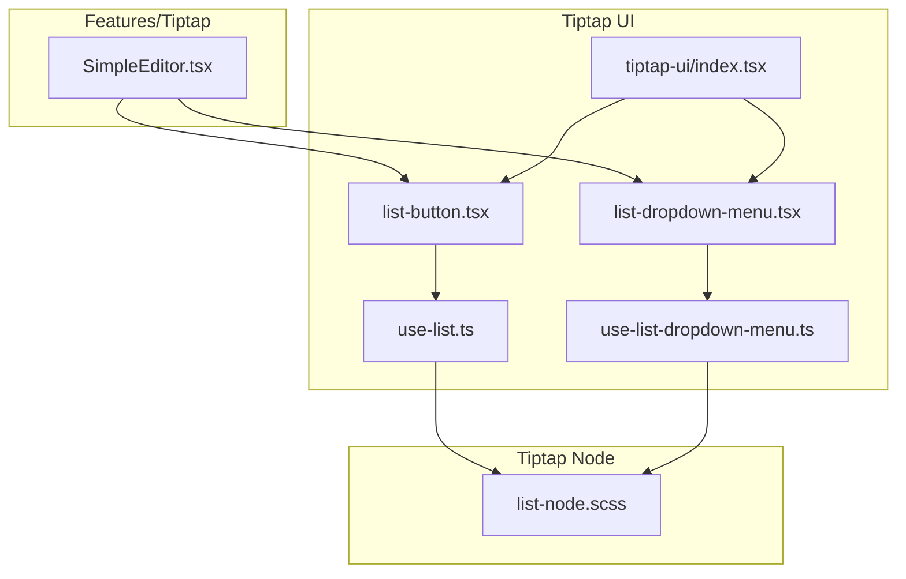
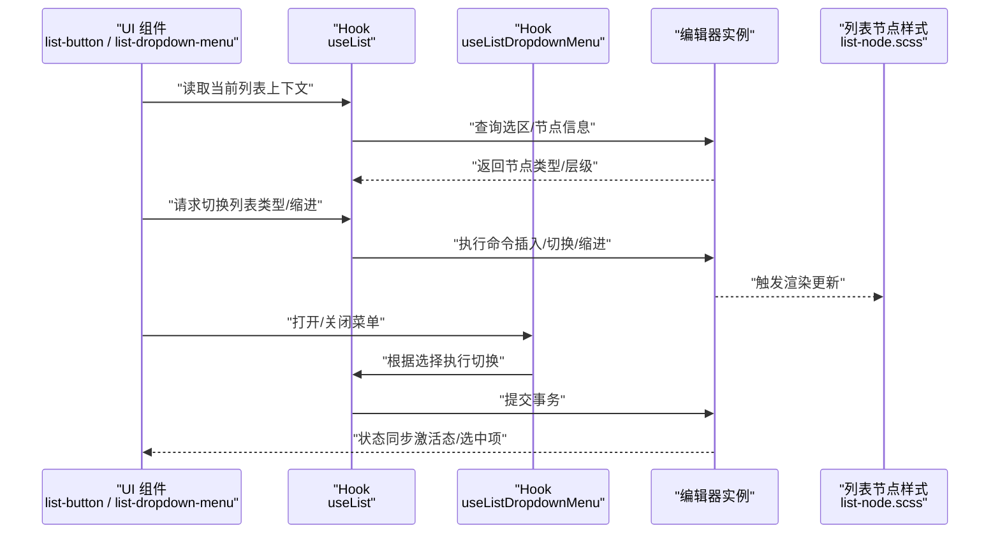
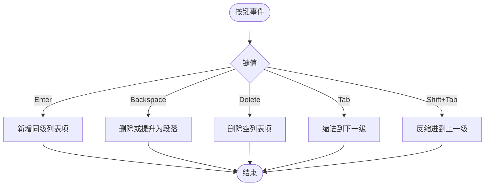
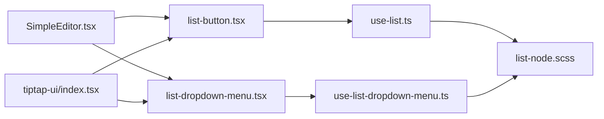

# 列表控制

<cite>
**本文引用的文件**   
- [list-button.tsx](file://src/components/tiptap-ui/list-button.tsx)
- [list-dropdown-menu.tsx](file://src/components/tiptap-ui/list-dropdown-menu.tsx)
- [use-list.ts](file://src/components/tiptap-ui/use-list.ts)
- [use-list-dropdown-menu.ts](file://src/components/tiptap-ui/use-list-dropdown-menu.ts)
- [index.tsx](file://src/components/tiptap-ui/index.tsx)
- [list-node.scss](file://src/components/tiptap-node/list-node.scss)
- [SimpleEditor.tsx](file://src/features/tiptap/SimpleEditor.tsx)
</cite>

## 目录
1. [简介](#简介)
2. [项目结构](#项目结构)
3. [核心组件与 Hook](#核心组件与-hook)
4. [架构总览](#架构总览)
5. [详细组件分析](#详细组件分析)
6. [依赖关系分析](#依赖关系分析)
7. [性能考量](#性能考量)
8. [故障排查指南](#故障排查指南)
9. [结论](#结论)
10. [附录](#附录)

## 简介
本技术文档聚焦于“列表控制”能力，覆盖有序/无序列表的实现机制、交互与状态管理。重点解析以下模块：
- 按钮与下拉菜单组件：list-button、list-dropdown-menu
- 状态与行为 Hook：useList、useListDropdownMenu
- 编辑器集成：在 SimpleEditor 中如何装配列表能力
- 键盘快捷键：Tab 缩进、Shift+Tab 反缩进
- 自定义样式与无障碍访问（a11y）最佳实践

## 项目结构
列表相关代码主要分布在 tiptap-ui 与 tiptap-node 两个子目录，并在 features/tiptap 的编辑器模板中进行集成。

图表来源
- [list-button.tsx:1-200](file://src/components/tiptap-ui/list-button.tsx#L1-L200)
- [list-dropdown-menu.tsx:1-200](file://src/components/tiptap-ui/list-dropdown-menu.tsx#L1-L200)
- [use-list.ts:1-200](file://src/components/tiptap-ui/use-list.ts#L1-L200)
- [use-list-dropdown-menu.ts:1-200](file://src/components/tiptap-ui/use-list-dropdown-menu.ts#L1-L200)
- [index.tsx:1-200](file://src/components/tiptap-ui/index.tsx#L1-L200)
- [list-node.scss:1-200](file://src/components/tiptap-node/list-node.scss#L1-L200)
- [SimpleEditor.tsx:1-200](file://src/features/tiptap/SimpleEditor.tsx#L1-L200)

章节来源
- [list-button.tsx:1-200](file://src/components/tiptap-ui/list-button.tsx#L1-L200)
- [list-dropdown-menu.tsx:1-200](file://src/components/tiptap-ui/list-dropdown-menu.tsx#L1-L200)
- [use-list.ts:1-200](file://src/components/tiptap-ui/use-list.ts#L1-L200)
- [use-list-dropdown-menu.ts:1-200](file://src/components/tiptap-ui/use-list-dropdown-menu.ts#L1-L200)
- [index.tsx:1-200](file://src/components/tiptap-ui/index.tsx#L1-L200)
- [list-node.scss:1-200](file://src/components/tiptap-node/list-node.scss#L1-L200)
- [SimpleEditor.tsx:1-200](file://src/features/tiptap/SimpleEditor.tsx#L1-L200)

## 核心组件与 Hook
本节从职责边界、输入输出、内部状态与副作用角度，梳理列表能力的核心构件。

- list-button
  - 职责：切换当前选区为有序/无序列表或取消列表；提供激活态反馈。
  - 关键输入：编辑器实例、可选的默认类型（ordered/unordered）。
  - 关键输出：点击回调、选中状态、可访问性属性。
  - 典型用法：作为工具栏按钮，调用 useList 提供的命令。

- list-dropdown-menu
  - 职责：以弹出菜单形式选择列表类型（有序/无序），并支持即时预览与切换。
  - 关键输入：编辑器实例、菜单打开/关闭状态、受控或本地状态。
  - 关键输出：菜单项渲染、选中高亮、键盘导航。
  - 典型用法：与 useListDropdownMenu 配合，实现更丰富的列表选择体验。

- useList
  - 职责：封装对 Tiptap 编辑器中列表节点的操作，包括：
    - 获取当前光标位置的列表上下文（是否处于列表、层级、类型）
    - 设置/切换列表类型（有序/无序）
    - 处理嵌套与层级变更（通过缩进/出缩进命令）
    - 同步内容到编辑器（确保视图与数据一致）
  - 关键状态：当前节点类型、层级深度、是否激活、最近一次操作结果。
  - 副作用：触发编辑器事务更新、维护撤销栈。

- useListDropdownMenu
  - 职责：管理列表下拉菜单的状态与交互，包括：
    - 菜单可见性与定位
    - 键盘导航（上下键选择、回车确认、Esc 关闭）
    - 与 useList 联动执行切换
  - 关键状态：open、activeIndex、position、lastTriggerEvent。
  - 副作用：绑定全局键盘事件、计算弹出位置、清理监听器。

章节来源
- [list-button.tsx:1-200](file://src/components/tiptap-ui/list-button.tsx#L1-L200)
- [list-dropdown-menu.tsx:1-200](file://src/components/tiptap-ui/list-dropdown-menu.tsx#L1-L200)
- [use-list.ts:1-200](file://src/components/tiptap-ui/use-list.ts#L1-L200)
- [use-list-dropdown-menu.ts:1-200](file://src/components/tiptap-ui/use-list-dropdown-menu.ts#L1-L200)

## 架构总览
下图展示了列表控制在编辑器中的整体协作关系：UI 层通过 Hook 驱动编辑器命令，Node 层负责渲染与样式，编辑器负责状态持久化与撤销重做。

图表来源
- [list-button.tsx:1-200](file://src/components/tiptap-ui/list-button.tsx#L1-L200)
- [list-dropdown-menu.tsx:1-200](file://src/components/tiptap-ui/list-dropdown-menu.tsx#L1-L200)
- [use-list.ts:1-200](file://src/components/tiptap-ui/use-list.ts#L1-L200)
- [use-list-dropdown-menu.ts:1-200](file://src/components/tiptap-ui/use-list-dropdown-menu.ts#L1-L200)
- [list-node.scss:1-200](file://src/components/tiptap-node/list-node.scss#L1-L200)

## 详细组件分析

### list-button 组件
- 设计模式
  - 受控/非受控混合：可通过外部传入激活态，也可内部维护。
  - 组合式：依赖 useList 暴露的 toggle/set 方法，避免直接操作编辑器。
- 关键流程
  - 初始化时订阅编辑器状态变化，计算当前激活态。
  - 点击时调用 useList 的切换逻辑，必要时根据参数决定有序/无序。
- 可访问性
  - role="button"、aria-pressed、aria-label 等语义属性。
  - 键盘可达，支持 Enter/Space 触发。
- 常见扩展点
  - 自定义图标、颜色、尺寸；通过 props 注入。

章节来源
- [list-button.tsx:1-200](file://src/components/tiptap-ui/list-button.tsx#L1-L200)

### list-dropdown-menu 组件
- 设计模式
  - 受控菜单：由父级控制 open 状态，组件专注渲染与交互。
  - 键盘优先：方向键导航、回车确认、Esc 关闭。
- 关键流程
  - 计算菜单定位（相对触发元素）。
  - 渲染菜单项（有序/无序），高亮当前选中项。
  - 选择后调用 useList 完成切换并关闭菜单。
- 可访问性
  - role="menu"、aria-haspopup、aria-expanded、aria-activedescendant。
  - 焦点管理与 Tab 顺序合理。

章节来源
- [list-dropdown-menu.tsx:1-200](file://src/components/tiptap-ui/list-dropdown-menu.tsx#L1-L200)

### useList Hook
- 状态与数据流
  - 读取当前光标所在节点的列表类型与层级。
  - 维护最近一次操作的结果与错误信息。
- 核心能力
  - setList(type): 将当前块设置为指定类型的列表。
  - toggleList(): 在有序/无序之间切换，若已为同类型则取消列表。
  - indent()/outdent(): 调整列表层级（对应 Tab/Shift+Tab）。
  - sync(): 强制同步编辑器内容与本地状态。
- 复杂度与性能
  - 查询与更新均基于编辑器事务，批量操作可减少重排。
  - 建议合并多次缩进/出缩进为单次事务。
- 错误处理
  - 当不在列表节点或选区无效时，给出明确提示或静默降级。

章节来源
- [use-list.ts:1-200](file://src/components/tiptap-ui/use-list.ts#L1-L200)

### useListDropdownMenu Hook
- 状态与数据流
  - 管理 open、activeIndex、position、triggerRef 等。
  - 监听窗口 resize 与滚动，动态修正定位。
- 核心能力
  - open/close: 打开/关闭菜单。
  - select(index): 选择菜单项并触发 useList 的切换。
  - onKeyDown(e): 处理方向键、回车、Esc。
- 可访问性
  - 与 ARIA 角色配合，确保屏幕阅读器正确播报。
  - 焦点在菜单内循环移动，关闭时归还焦点至触发元素。

章节来源
- [use-list-dropdown-menu.ts:1-200](file://src/components/tiptap-ui/use-list-dropdown-menu.ts#L1-L200)

### 列表项增删改与键盘快捷键
- 增
  - 在列表末尾按 Enter 自动新增同级项。
  - 在空行输入文本并按 Tab 提升为新层级项。
- 删
  - 在列表首行按 Backspace 删除该项或提升为段落。
  - 在空列表项按 Delete 移除该节点。
- 改
  - 使用 list-button 或下拉菜单切换有序/无序。
  - Tab 缩进（进入下一层级）、Shift+Tab 反缩进（回到上一层级）。
- 键盘流程图（概念）

[此图为概念流程，不直接映射具体源码，故无图表来源]

章节来源
- [use-list.ts:1-200](file://src/components/tiptap-ui/use-list.ts#L1-L200)
- [use-list-dropdown-menu.ts:1-200](file://src/components/tiptap-ui/use-list-dropdown-menu.ts#L1-L200)

### 编辑器集成与内容同步
- 集成方式
  - 在 SimpleEditor 中引入 list-button 与 list-dropdown-menu，并将其注册到工具栏。
  - 通过 useList 与 useListDropdownMenu 共享编辑器实例，保证状态一致。
- 同步策略
  - 使用受控模式时，外部状态驱动 UI；非受控模式下由 Hook 内部管理。
  - 在编辑器 onChange/onUpdate 中触发 sync()，确保视图与数据一致。

章节来源
- [SimpleEditor.tsx:1-200](file://src/features/tiptap/SimpleEditor.tsx#L1-L200)
- [index.tsx:1-200](file://src/components/tiptap-ui/index.tsx#L1-L200)

### 自定义样式与主题
- 样式入口
  - 列表节点样式集中在 list-node.scss，涵盖有序/无序、不同层级的标记与缩进。
- 定制建议
  - 通过 CSS 变量或 BEM 命名空间覆盖默认样式。
  - 针对深色/浅色主题分别定义标记色与背景。
  - 保持最小侵入，优先使用类名覆盖而非修改源码。

章节来源
- [list-node.scss:1-200](file://src/components/tiptap-node/list-node.scss#L1-L200)

## 依赖关系分析
- 组件与 Hook 的耦合
  - list-button 强依赖 useList；list-dropdown-menu 强依赖 useListDropdownMenu。
  - 两者共同依赖编辑器实例，并通过 index.tsx 统一导出。
- 外部依赖
  - Tiptap 编辑器 API（用于查询/更新列表节点）。
  - 基础 UI 组件（按钮、弹出菜单）用于构建交互。
- 潜在循环依赖
  - 通过 Hook 抽象业务逻辑，避免组件间直接互相引用。

图表来源
- [list-button.tsx:1-200](file://src/components/tiptap-ui/list-button.tsx#L1-L200)
- [list-dropdown-menu.tsx:1-200](file://src/components/tiptap-ui/list-dropdown-menu.tsx#L1-L200)
- [use-list.ts:1-200](file://src/components/tiptap-ui/use-list.ts#L1-L200)
- [use-list-dropdown-menu.ts:1-200](file://src/components/tiptap-ui/use-list-dropdown-menu.ts#L1-L200)
- [list-node.scss:1-200](file://src/components/tiptap-node/list-node.scss#L1-L200)
- [SimpleEditor.tsx:1-200](file://src/features/tiptap/SimpleEditor.tsx#L1-L200)
- [index.tsx:1-200](file://src/components/tiptap-ui/index.tsx#L1-L200)

章节来源
- [list-button.tsx:1-200](file://src/components/tiptap-ui/list-button.tsx#L1-L200)
- [list-dropdown-menu.tsx:1-200](file://src/components/tiptap-ui/list-dropdown-menu.tsx#L1-L200)
- [use-list.ts:1-200](file://src/components/tiptap-ui/use-list.ts#L1-L200)
- [use-list-dropdown-menu.ts:1-200](file://src/components/tiptap-ui/use-list-dropdown-menu.ts#L1-L200)
- [index.tsx:1-200](file://src/components/tiptap-ui/index.tsx#L1-L200)
- [list-node.scss:1-200](file://src/components/tiptap-node/list-node.scss#L1-L200)
- [SimpleEditor.tsx:1-200](file://src/features/tiptap/SimpleEditor.tsx#L1-L200)

## 性能考量
- 减少不必要的重渲染
  - 将 useList/useListDropdownMenu 的状态提升到合适层级，避免频繁重建。
  - 对高频操作（连续缩进/出缩进）进行批处理。
- 事件监听优化
  - 在菜单关闭或组件卸载时及时移除全局键盘/滚动监听。
- 样式与布局
  - 避免在列表项上应用昂贵的动画或复杂滤镜。
  - 合理使用 will-change 与 transform 提升滚动性能。

[本节为通用指导，无需源码引用]

## 故障排查指南
- 常见问题
  - 列表类型未生效：检查是否在有效的列表节点上执行命令；确认编辑器事务已提交。
  - 缩进异常：确认当前光标位于列表项且存在上级/下级层级；验证 Tab/Shift+Tab 事件未被拦截。
  - 菜单定位偏移：检查容器滚动与视口变化，确保重新计算位置。
  - 无障碍问题：核对 ARIA 属性与焦点管理是否符合规范。
- 调试建议
  - 打印 useList 的上下文信息（类型、层级、激活态）。
  - 在 useListDropdownMenu 中记录键盘事件与选择索引。
  - 使用浏览器开发者工具的“无障碍面板”验证语义与焦点顺序。

章节来源
- [use-list.ts:1-200](file://src/components/tiptap-ui/use-list.ts#L1-L200)
- [use-list-dropdown-menu.ts:1-200](file://src/components/tiptap-ui/use-list-dropdown-menu.ts#L1-L200)

## 结论
列表控制能力通过清晰的组件与 Hook 分层，实现了稳定的状态管理与良好的可扩展性。useList 与 useListDropdownMenu 将复杂的编辑器交互抽象为简洁的 API，配合合理的样式与无障碍支持，能够满足大多数编辑场景的需求。建议在后续迭代中持续优化批量操作与性能，并完善测试覆盖。

[本节为总结，无需源码引用]

## 附录
- 快速上手清单
  - 在工具栏中引入 list-button 与 list-dropdown-menu。
  - 使用 useList 提供的 setList/toggleList/indent/outdent 方法。
  - 使用 useListDropdownMenu 管理菜单状态与键盘交互。
  - 通过 list-node.scss 定制外观，遵循 a11y 规范添加语义属性。

[本节为补充说明，无需源码引用]