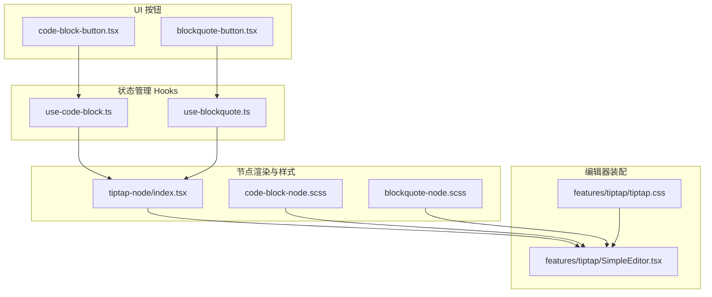
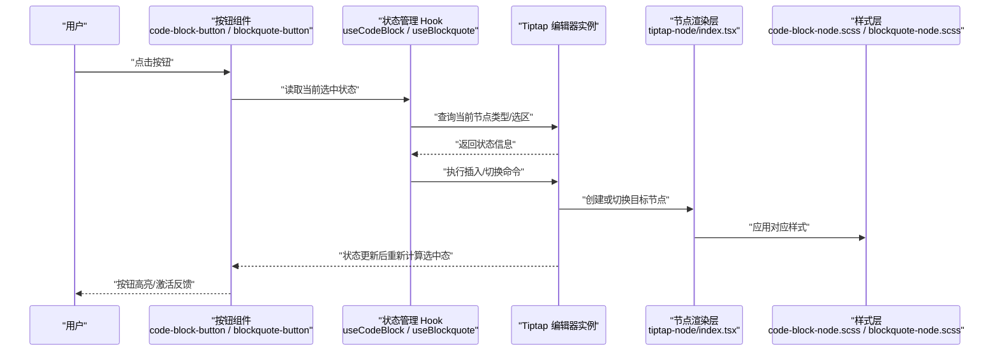
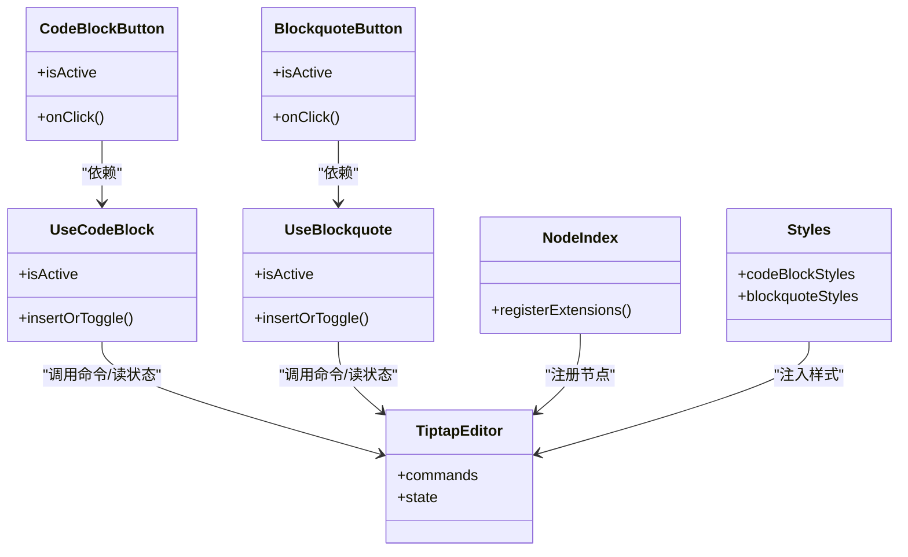
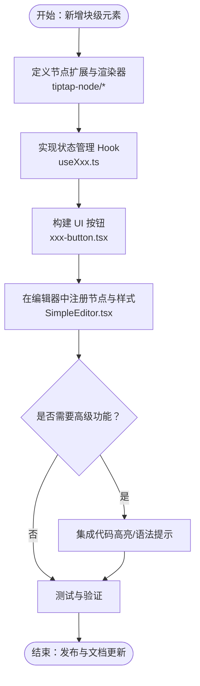

# 块级格式控件

<cite>
**本文引用的文件**   
- [code-block-button.tsx](file://src/components/tiptap-ui/code-block-button.tsx)
- [blockquote-button.tsx](file://src/components/tiptap-ui/blockquote-button.tsx)
- [use-code-block.ts](file://src/components/tiptap-ui/use-code-block.ts)
- [use-blockquote.ts](file://src/components/tiptap-ui/use-blockquote.ts)
- [code-block-node.scss](file://src/components/tiptap-node/code-block-node.scss)
- [blockquote-node.scss](file://src/components/tiptap-node/blockquote-node.scss)
- [index.tsx](file://src/components/tiptap-node/index.tsx)
- [SimpleEditor.tsx](file://src/features/tiptap/SimpleEditor.tsx)
- [tiptap.css](file://src/features/tiptap/tiptap.css)
</cite>

## 目录
1. [简介](#简介)
2. [项目结构](#项目结构)
3. [核心组件与 Hooks](#核心组件与-hooks)
4. [架构总览](#架构总览)
5. [详细组件分析](#详细组件分析)
6. [依赖关系分析](#依赖关系分析)
7. [性能考量](#性能考量)
8. [故障排查指南](#故障排查指南)
9. [结论](#结论)
10. [附录：自定义块级元素指南](#附录自定义块级元素指南)

## 简介
本技术文档聚焦于“块级格式控件”的实现，围绕代码块（Code Block）与引用块（Blockquote）两大典型块级节点，系统阐述其 UI 按钮、状态管理 Hook、节点渲染与样式、以及编辑器集成方式。文档同时给出扩展新块级元素的实践路径，包括节点类型定义、渲染逻辑与编辑行为的定制方法，帮助读者快速掌握在现有 Tiptap 编辑器基础上进行二次开发的最佳实践。

## 项目结构
与块级格式控件相关的源码主要分布在以下位置：
- UI 按钮层：位于 tiptap-ui 目录，提供 code-block-button 与 blockquote-button 两个交互入口
- 状态管理层：位于 tiptap-ui 目录，提供 useCodeBlock 与 useBlockquote 两个 Hook，封装对编辑器实例的调用与状态派生
- 节点渲染层：位于 tiptap-node 目录，包含对应节点的 SCSS 样式与节点索引导出
- 编辑器装配层：位于 features/tiptap 目录，将上述按钮与节点整合到 SimpleEditor 中，并注入全局样式

图表来源
- [code-block-button.tsx:1-200](file://src/components/tiptap-ui/code-block-button.tsx#L1-L200)
- [blockquote-button.tsx:1-200](file://src/components/tiptap-ui/blockquote-button.tsx#L1-L200)
- [use-code-block.ts:1-200](file://src/components/tiptap-ui/use-code-block.ts#L1-L200)
- [use-blockquote.ts:1-200](file://src/components/tiptap-ui/use-blockquote.ts#L1-L200)
- [code-block-node.scss:1-200](file://src/components/tiptap-node/code-block-node.scss#L1-L200)
- [blockquote-node.scss:1-200](file://src/components/tiptap-node/blockquote-node.scss#L1-L200)
- [index.tsx](file://src/components/tiptap-node/index.tsx)
- [SimpleEditor.tsx](file://src/features/tiptap/SimpleEditor.tsx)
- [tiptap.css](file://src/features/tiptap/tiptap.css)

章节来源
- [code-block-button.tsx:1-200](file://src/components/tiptap-ui/code-block-button.tsx#L1-L200)
- [blockquote-button.tsx:1-200](file://src/components/tiptap-ui/blockquote-button.tsx#L1-L200)
- [use-code-block.ts:1-200](file://src/components/tiptap-ui/use-code-block.ts#L1-L200)
- [use-blockquote.ts:1-200](file://src/components/tiptap-ui/use-blockquote.ts#L1-L200)
- [index.tsx](file://src/components/tiptap-node/index.tsx)
- [SimpleEditor.tsx](file://src/features/tiptap/SimpleEditor.tsx)

## 核心组件与 Hooks
本节从职责边界与交互契约角度，梳理四个关键实现点：
- code-block-button：触发插入/切换代码块的 UI 按钮
- blockquote-button：触发插入/切换引用块的 UI 按钮
- useCodeBlock：封装代码块相关命令与选中态判断
- useBlockquote：封装引用块相关命令与选中态判断

这些组件与 Hook 通过 Tiptap 的 Editor 实例协作，完成“用户点击 -> 状态查询 -> 执行命令 -> 更新视图”的闭环。

章节来源
- [code-block-button.tsx:1-200](file://src/components/tiptap-ui/code-block-button.tsx#L1-L200)
- [blockquote-button.tsx:1-200](file://src/components/tiptap-ui/blockquote-button.tsx#L1-L200)
- [use-code-block.ts:1-200](file://src/components/tiptap-ui/use-code-block.ts#L1-L200)
- [use-blockquote.ts:1-200](file://src/components/tiptap-ui/use-blockquote.ts#L1-L200)

## 架构总览
下图展示了从用户操作到编辑器内部状态变更的整体流程，涵盖按钮、Hook、Tiptap 命令与节点渲染的关系。

图表来源
- [code-block-button.tsx:1-200](file://src/components/tiptap-ui/code-block-button.tsx#L1-L200)
- [blockquote-button.tsx:1-200](file://src/components/tiptap-ui/blockquote-button.tsx#L1-L200)
- [use-code-block.ts:1-200](file://src/components/tiptap-ui/use-code-block.ts#L1-L200)
- [use-blockquote.ts:1-200](file://src/components/tiptap-ui/use-blockquote.ts#L1-L200)
- [index.tsx](file://src/components/tiptap-node/index.tsx)
- [code-block-node.scss:1-200](file://src/components/tiptap-node/code-block-node.scss#L1-L200)
- [blockquote-node.scss:1-200](file://src/components/tiptap-node/blockquote-node.scss#L1-L200)

## 详细组件分析

### code-block-button 组件
- 职责
  - 作为代码块操作的入口，负责展示图标与激活态
  - 委托 useCodeBlock 获取当前是否处于代码块上下文
  - 调用 useCodeBlock 提供的插入/切换方法
- 交互流程
  - 点击时先查询当前选区是否为代码块节点
  - 若已是代码块则执行切换/退出逻辑；否则插入新的代码块节点
  - 根据 Hook 返回的选中态更新按钮外观
- 设计模式
  - 表现型组件 + 状态 Hook 分离：UI 只关注展示与事件转发，业务逻辑下沉至 Hook
  - 受控模式：按钮状态由 Hook 驱动，避免重复维护选中态

章节来源
- [code-block-button.tsx:1-200](file://src/components/tiptap-ui/code-block-button.tsx#L1-L200)
- [use-code-block.ts:1-200](file://src/components/tiptap-ui/use-code-block.ts#L1-L200)

### useCodeBlock Hook
- 职责
  - 封装代码块相关命令与状态派生
  - 对外暴露：是否处于代码块上下文、插入/切换代码块的方法
- 状态管理要点
  - 基于 Tiptap 的选区与节点类型判断当前是否处于代码块
  - 使用编辑器命令进行插入或切换，确保撤销栈正确
  - 在编辑器状态变化时自动重算选中态，保持 UI 同步
- 生命周期与内容同步
  - 挂载时订阅编辑器状态变化
  - 卸载时清理监听，避免内存泄漏
  - 保证命令执行后视图与数据一致

章节来源
- [use-code-block.ts:1-200](file://src/components/tiptap-ui/use-code-block.ts#L1-L200)

### blockquote-button 组件
- 职责
  - 作为引用块操作的入口，负责展示图标与激活态
  - 委托 useBlockquote 获取当前是否处于引用块上下文
  - 调用 useBlockquote 提供的插入/切换方法
- 交互流程
  - 点击时先查询当前选区是否为引用块节点
  - 若已是引用块则执行切换/退出逻辑；否则插入新的引用块节点
  - 根据 Hook 返回的选中态更新按钮外观
- 设计模式
  - 与 code-block-button 保持一致的“表现型组件 + 状态 Hook”拆分

章节来源
- [blockquote-button.tsx:1-200](file://src/components/tiptap-ui/blockquote-button.tsx#L1-L200)
- [use-blockquote.ts:1-200](file://src/components/tiptap-ui/use-blockquote.ts#L1-L200)

### useBlockquote Hook
- 职责
  - 封装引用块相关命令与状态派生
  - 对外暴露：是否处于引用块上下文、插入/切换引用块的方法
- 状态管理要点
  - 基于 Tiptap 的选区与节点类型判断当前是否处于引用块
  - 使用编辑器命令进行插入或切换，确保撤销栈正确
  - 在编辑器状态变化时自动重算选中态，保持 UI 同步
- 生命周期与内容同步
  - 挂载时订阅编辑器状态变化
  - 卸载时清理监听，避免内存泄漏
  - 保证命令执行后视图与数据一致

章节来源
- [use-blockquote.ts:1-200](file://src/components/tiptap-ui/use-blockquote.ts#L1-L200)

### 节点渲染与样式
- 节点索引
  - tiptap-node/index.tsx 统一导出各节点扩展与渲染器，供编辑器装配层按需引入
- 样式
  - code-block-node.scss 为代码块容器、行号、滚动条等提供主题化样式
  - blockquote-node.scss 为引用块边框、缩进、背景色等提供主题化样式
- 与编辑器的集成
  - SimpleEditor.tsx 在初始化时注册节点扩展，并将对应样式注入页面

章节来源
- [index.tsx](file://src/components/tiptap-node/index.tsx)
- [code-block-node.scss:1-200](file://src/components/tiptap-node/code-block-node.scss#L1-L200)
- [blockquote-node.scss:1-200](file://src/components/tiptap-node/blockquote-node.scss#L1-L200)
- [SimpleEditor.tsx](file://src/features/tiptap/SimpleEditor.tsx)
- [tiptap.css](file://src/features/tiptap/tiptap.css)

## 依赖关系分析
- 组件与 Hook 的耦合
  - code-block-button 仅依赖 useCodeBlock，不直接访问编辑器实例，降低耦合度
  - blockquote-button 仅依赖 useBlockquote，遵循相同解耦策略
- Hook 与编辑器
  - useCodeBlock 与 useBlockquote 均依赖 Tiptap 编辑器实例的命令与状态 API
- 节点与样式
  - 节点渲染层通过 index.tsx 聚合导出，便于编辑器装配层集中注册
  - 样式文件以 SCSS 模块化组织，按节点维度隔离样式作用域

图表来源
- [code-block-button.tsx:1-200](file://src/components/tiptap-ui/code-block-button.tsx#L1-L200)
- [use-code-block.ts:1-200](file://src/components/tiptap-ui/use-code-block.ts#L1-L200)
- [blockquote-button.tsx:1-200](file://src/components/tiptap-ui/blockquote-button.tsx#L1-L200)
- [use-blockquote.ts:1-200](file://src/components/tiptap-ui/use-blockquote.ts#L1-L200)
- [index.tsx](file://src/components/tiptap-node/index.tsx)

章节来源
- [code-block-button.tsx:1-200](file://src/components/tiptap-ui/code-block-button.tsx#L1-L200)
- [use-code-block.ts:1-200](file://src/components/tiptap-ui/use-code-block.ts#L1-L200)
- [blockquote-button.tsx:1-200](file://src/components/tiptap-ui/blockquote-button.tsx#L1-L200)
- [use-blockquote.ts:1-200](file://src/components/tiptap-ui/use-blockquote.ts#L1-L200)
- [index.tsx](file://src/components/tiptap-node/index.tsx)

## 性能考量
- 状态派生最小化
  - 仅在必要时计算 isActive，避免频繁重渲染
- 命令合并与节流
  - 对于高频操作（如快速切换），可在 Hook 层做防抖/节流处理，减少不必要的命令派发
- 样式与渲染
  - 使用 SCSS 模块隔离样式，避免全局污染导致的回流重绘
- 资源加载
  - 代码高亮等重型功能建议按需懒加载，避免首屏阻塞

[本节为通用指导，无需具体文件来源]

## 故障排查指南
- 按钮无法切换
  - 检查 useCodeBlock/useBlockquote 是否正确订阅编辑器状态变化
  - 确认编辑器实例是否在组件树中可用
- 插入后未显示样式
  - 确认对应节点的 SCSS 已随编辑器初始化注入
  - 检查浏览器开发者工具中是否存在样式覆盖冲突
- 撤销/重做异常
  - 确认通过 Tiptap 命令而非直接修改 DOM 来改变内容
  - 检查是否在 Hook 中正确使用了 editor.commands

章节来源
- [use-code-block.ts:1-200](file://src/components/tiptap-ui/use-code-block.ts#L1-L200)
- [use-blockquote.ts:1-200](file://src/components/tiptap-ui/use-blockquote.ts#L1-L200)
- [code-block-node.scss:1-200](file://src/components/tiptap-node/code-block-node.scss#L1-L200)
- [blockquote-node.scss:1-200](file://src/components/tiptap-node/blockquote-node.scss#L1-L200)
- [SimpleEditor.tsx](file://src/features/tiptap/SimpleEditor.tsx)

## 结论
通过将 UI 按钮与状态管理 Hook 解耦，并以节点渲染层与样式层独立组织，本项目实现了可扩展、可维护的块级格式控件体系。useCodeBlock 与 useBlockquote 提供了统一的命令与状态抽象，使新增块级元素具备一致的接入体验。在此基础上，结合按需加载与样式隔离策略，可在保证性能的同时持续扩展高级能力（如语法高亮、智能提示）。

[本节为总结性内容，无需具体文件来源]

## 附录：自定义块级元素指南
本节提供在现有架构下新增自定义块级元素的步骤清单，适用于任意新节点类型（例如“表格块”、“媒体块”等）。

- 定义节点类型与扩展
  - 在 tiptap-node 目录下新增节点扩展与渲染器，并在 index.tsx 中统一导出
  - 为新节点编写独立的 SCSS 样式文件，确保样式作用域隔离
- 实现状态管理 Hook
  - 参考 useCodeBlock/useBlockquote 的模式，新建 useXxx Hook
  - 在 Hook 中封装“是否处于该节点上下文”的判断与“插入/切换”命令
- 构建 UI 按钮
  - 新建 xxx-button.tsx，复用“表现型组件 + 状态 Hook”的设计模式
  - 在按钮中调用 Hook 的 isActive 与 insertOrToggle 方法
- 编辑器装配
  - 在 SimpleEditor.tsx 中注册新节点扩展与样式
  - 将新按钮加入工具栏或气泡菜单
- 高级功能集成（可选）
  - 代码高亮：在节点渲染器中按需引入高亮库，并根据语言选择配置
  - 语法提示：在编辑器初始化时注册相应插件，并与节点内容联动
- 测试与验证
  - 验证插入/切换/删除行为
  - 验证撤销/重做链完整性
  - 验证样式在不同主题下的表现

图表来源
- [index.tsx](file://src/components/tiptap-node/index.tsx)
- [use-code-block.ts:1-200](file://src/components/tiptap-ui/use-code-block.ts#L1-L200)
- [use-blockquote.ts:1-200](file://src/components/tiptap-ui/use-blockquote.ts#L1-L200)
- [code-block-button.tsx:1-200](file://src/components/tiptap-ui/code-block-button.tsx#L1-L200)
- [blockquote-button.tsx:1-200](file://src/components/tiptap-ui/blockquote-button.tsx#L1-L200)
- [SimpleEditor.tsx](file://src/features/tiptap/SimpleEditor.tsx)

章节来源
- [index.tsx](file://src/components/tiptap-node/index.tsx)
- [use-code-block.ts:1-200](file://src/components/tiptap-ui/use-code-block.ts#L1-L200)
- [use-blockquote.ts:1-200](file://src/components/tiptap-ui/use-blockquote.ts#L1-L200)
- [code-block-button.tsx:1-200](file://src/components/tiptap-ui/code-block-button.tsx#L1-L200)
- [blockquote-button.tsx:1-200](file://src/components/tiptap-ui/blockquote-button.tsx#L1-L200)
- [SimpleEditor.tsx](file://src/features/tiptap/SimpleEditor.tsx)