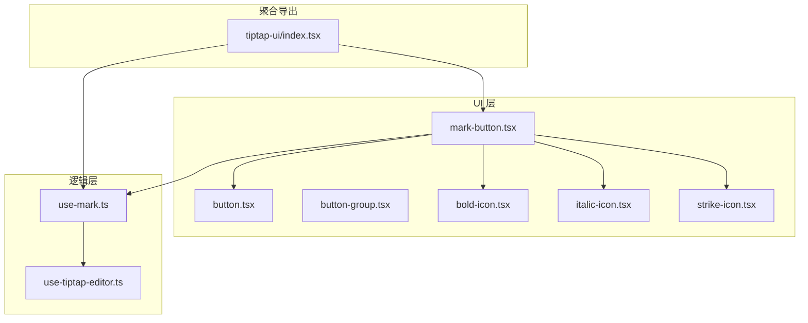
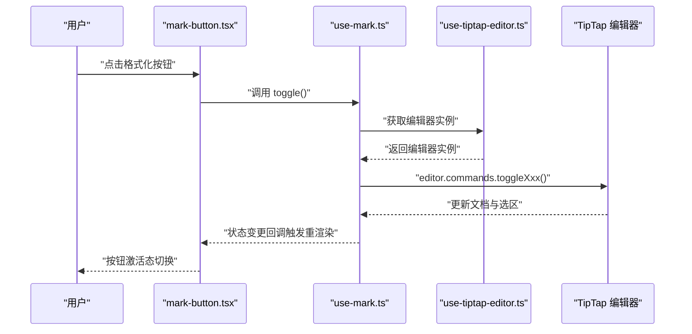
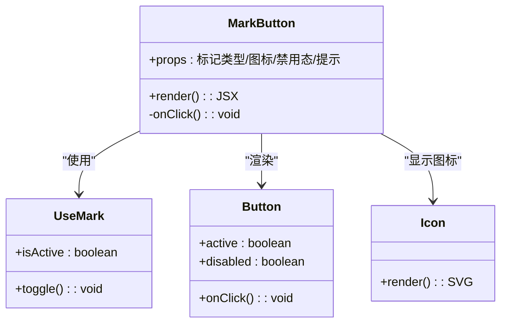
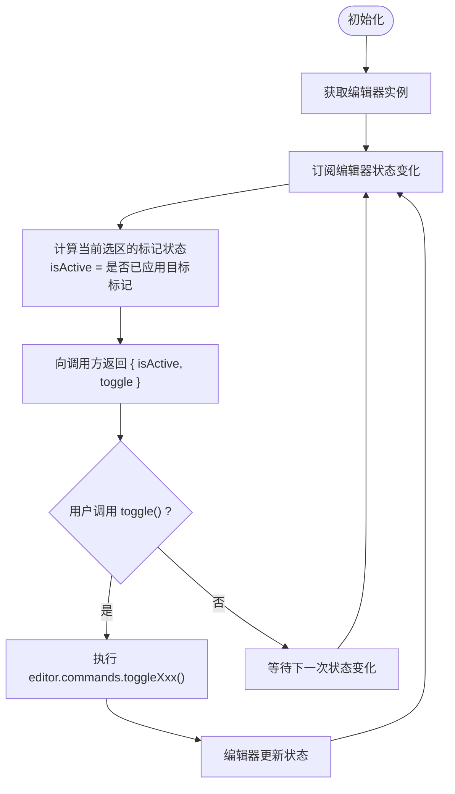
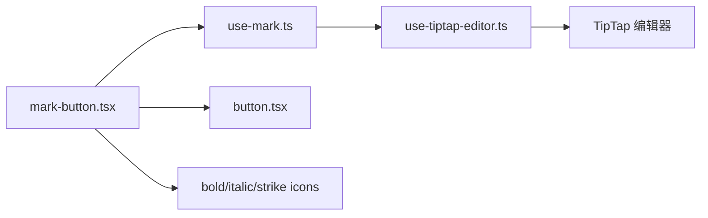

# 文本格式控件

<cite>
**本文引用的文件**   
- [src/components/tiptap-ui/mark-button.tsx](file://src/components/tiptap-ui/mark-button.tsx)
- [src/components/tiptap-ui/use-mark.ts](file://src/components/tiptap-ui/use-mark.ts)
- [src/hooks/use-tiptap-editor.ts](file://src/hooks/use-tiptap-editor.ts)
- [src/components/tiptap-icons/bold-icon.tsx](file://src/components/tiptap-icons/bold-icon.tsx)
- [src/components/tiptap-icons/italic-icon.tsx](file://src/components/tiptap-icons/italic-icon.tsx)
- [src/components/tiptap-icons/strike-icon.tsx](file://src/components/tiptap-icons/strike-icon.tsx)
- [src/components/tiptap-ui-primitive/button.tsx](file://src/components/tiptap-ui-primitive/button.tsx)
- [src/components/tiptap-ui-primitive/button-group.tsx](file://src/components/tiptap-ui-primitive/button-group.tsx)
- [src/components/tiptap-ui/index.tsx](file://src/components/tiptap-ui/index.tsx)
</cite>

## 目录
1. [简介](#简介)
2. [项目结构](#项目结构)
3. [核心组件](#核心组件)
4. [架构总览](#架构总览)
5. [详细组件分析](#详细组件分析)
6. [依赖关系分析](#依赖关系分析)
7. [性能考量](#性能考量)
8. [故障排查指南](#故障排查指南)
9. [结论](#结论)
10. [附录：自定义格式化标记实现指南](#附录自定义格式化标记实现指南)

## 简介
本技术文档聚焦于“文本格式控件”，围绕加粗、斜体、删除线等基础文本格式化的实现原理，深入解析 mark-button 组件的架构设计与 useMark hook 的工作机制，说明其与 TipTap 编辑器的集成方式。文档还涵盖格式化状态的管理（选中状态检测、命令执行与样式切换），并提供扩展与新增自定义格式化标记的实践指南。

## 项目结构
与文本格式控件相关的代码主要分布在以下模块：
- UI 按钮层：mark-button.tsx 提供通用标记按钮；图标组件位于 tiptap-icons 下；基础按钮与分组来自 tiptap-ui-primitive。
- 逻辑层：use-mark.ts 封装了标记状态的查询与命令执行；use-tiptap-editor.ts 提供编辑器实例的统一访问。
- 聚合导出：tiptap-ui/index.tsx 统一暴露常用按钮与 hooks，便于上层组合使用。

图表来源
- [src/components/tiptap-ui/mark-button.tsx](file://src/components/tiptap-ui/mark-button.tsx)
- [src/components/tiptap-ui/use-mark.ts](file://src/components/tiptap-ui/use-mark.ts)
- [src/hooks/use-tiptap-editor.ts](file://src/hooks/use-tiptap-editor.ts)
- [src/components/tiptap-icons/bold-icon.tsx](file://src/components/tiptap-icons/bold-icon.tsx)
- [src/components/tiptap-icons/italic-icon.tsx](file://src/components/tiptap-icons/italic-icon.tsx)
- [src/components/tiptap-icons/strike-icon.tsx](file://src/components/tiptap-icons/strike-icon.tsx)
- [src/components/tiptap-ui-primitive/button.tsx](file://src/components/tiptap-ui-primitive/button.tsx)
- [src/components/tiptap-ui-primitive/button-group.tsx](file://src/components/tiptap-ui-primitive/button-group.tsx)
- [src/components/tiptap-ui/index.tsx](file://src/components/tiptap-ui/index.tsx)

章节来源
- [src/components/tiptap-ui/mark-button.tsx](file://src/components/tiptap-ui/mark-button.tsx)
- [src/components/tiptap-ui/use-mark.ts](file://src/components/tiptap-ui/use-mark.ts)
- [src/hooks/use-tiptap-editor.ts](file://src/hooks/use-tiptap-editor.ts)
- [src/components/tiptap-ui/index.tsx](file://src/components/tiptap-ui/index.tsx)

## 核心组件
- mark-button 组件
  - 职责：渲染一个可点击的格式化按钮，根据当前选区是否处于某标记状态来切换激活态，并调用底层命令执行格式化。
  - 关键能力：接收标记类型、图标、提示文案、禁用态等属性；内部通过 useMark 获取状态与命令；将点击事件委托给命令执行。
- useMark hook
  - 职责：封装对 TipTap 编辑器中某标记的状态查询与命令执行，返回 { isActive, toggle } 或等价接口。
  - 关键能力：基于编辑器选区判断当前是否已应用该标记；调用 editor.commands.toggleXxx() 完成切换；在编辑器状态变化时自动更新 React 状态。
- 编辑器接入
  - 通过 use-tiptap-editor.ts 提供的编辑器实例，确保所有命令与状态读取均作用于同一编辑器上下文。

章节来源
- [src/components/tiptap-ui/mark-button.tsx](file://src/components/tiptap-ui/mark-button.tsx)
- [src/components/tiptap-ui/use-mark.ts](file://src/components/tiptap-ui/use-mark.ts)
- [src/hooks/use-tiptap-editor.ts](file://src/hooks/use-tiptap-editor.ts)

## 架构总览
下图展示了从用户交互到编辑器命令执行的完整链路，以及状态如何回传到 UI 以驱动按钮激活态。

图表来源
- [src/components/tiptap-ui/mark-button.tsx](file://src/components/tiptap-ui/mark-button.tsx)
- [src/components/tiptap-ui/use-mark.ts](file://src/components/tiptap-ui/use-mark.ts)
- [src/hooks/use-tiptap-editor.ts](file://src/hooks/use-tiptap-editor.ts)

## 详细组件分析

### mark-button 组件
- 设计要点
  - 作为通用标记按钮，支持传入不同标记类型（如 bold、italic、strike）与对应图标。
  - 内部通过 useMark 获取 isActive 与 toggle 方法，结合按钮组件渲染激活态与点击行为。
  - 与 button-group 配合，形成工具栏中的格式化按钮组。
- 交互流程
  - 点击按钮 -> 调用 toggle -> 触发编辑器命令 -> 状态更新 -> 按钮激活态切换。
- 可配置项
  - 标记类型、图标、禁用态、提示文案、样式类名等（具体字段以组件定义为准）。

图表来源
- [src/components/tiptap-ui/mark-button.tsx](file://src/components/tiptap-ui/mark-button.tsx)
- [src/components/tiptap-ui/use-mark.ts](file://src/components/tiptap-ui/use-mark.ts)
- [src/components/tiptap-ui-primitive/button.tsx](file://src/components/tiptap-ui-primitive/button.tsx)
- [src/components/tiptap-icons/bold-icon.tsx](file://src/components/tiptap-icons/bold-icon.tsx)
- [src/components/tiptap-icons/italic-icon.tsx](file://src/components/tiptap-icons/italic-icon.tsx)
- [src/components/tiptap-icons/strike-icon.tsx](file://src/components/tiptap-icons/strike-icon.tsx)

章节来源
- [src/components/tiptap-ui/mark-button.tsx](file://src/components/tiptap-ui/mark-button.tsx)
- [src/components/tiptap-ui-primitive/button.tsx](file://src/components/tiptap-ui-primitive/button.tsx)
- [src/components/tiptap-ui-primitive/button-group.tsx](file://src/components/tiptap-ui-primitive/button-group.tsx)
- [src/components/tiptap-icons/bold-icon.tsx](file://src/components/tiptap-icons/bold-icon.tsx)
- [src/components/tiptap-icons/italic-icon.tsx](file://src/components/tiptap-icons/italic-icon.tsx)
- [src/components/tiptap-icons/strike-icon.tsx](file://src/components/tiptap-icons/strike-icon.tsx)

### useMark hook
- 职责
  - 封装对 TipTap 编辑器中某标记的状态查询与命令执行。
  - 对外暴露 isActive 与 toggle 两个核心能力。
- 状态管理
  - 通过监听编辑器状态变化，计算当前选区是否包含目标标记，从而更新 isActive。
  - 调用 editor.commands.toggleXxx() 完成标记的添加或移除。
- 与编辑器集成
  - 通过 use-tiptap-editor.ts 获取编辑器实例，保证命令与状态读取的一致性。

图表来源
- [src/components/tiptap-ui/use-mark.ts](file://src/components/tiptap-ui/use-mark.ts)
- [src/hooks/use-tiptap-editor.ts](file://src/hooks/use-tiptap-editor.ts)

章节来源
- [src/components/tiptap-ui/use-mark.ts](file://src/components/tiptap-ui/use-mark.ts)
- [src/hooks/use-tiptap-editor.ts](file://src/hooks/use-tiptap-editor.ts)

### 编辑器接入与状态同步
- 编辑器实例来源
  - 通过 use-tiptap-editor.ts 提供的钩子获取全局编辑器实例，避免重复创建与上下文不一致问题。
- 状态同步策略
  - 使用 TipTap 的 onTransaction/onUpdate 等事件，结合选区信息计算标记状态，驱动 React 状态更新。
- 命令执行
  - 使用 editor.commands.toggleXxx() 进行标记切换，确保撤销栈与历史记录正确维护。

章节来源
- [src/hooks/use-tiptap-editor.ts](file://src/hooks/use-tiptap-editor.ts)

## 依赖关系分析
- 组件耦合
  - mark-button 依赖 useMark 与基础按钮组件，低耦合、高内聚。
  - useMark 仅依赖编辑器实例与 TipTap 命令集，职责单一。
- 外部依赖
  - TipTap 编辑器及其命令系统。
  - 图标库（SVG 组件）。
  - 基础 UI 组件（按钮、按钮组）。

图表来源
- [src/components/tiptap-ui/mark-button.tsx](file://src/components/tiptap-ui/mark-button.tsx)
- [src/components/tiptap-ui/use-mark.ts](file://src/components/tiptap-ui/use-mark.ts)
- [src/hooks/use-tiptap-editor.ts](file://src/hooks/use-tiptap-editor.ts)
- [src/components/tiptap-icons/bold-icon.tsx](file://src/components/tiptap-icons/bold-icon.tsx)
- [src/components/tiptap-icons/italic-icon.tsx](file://src/components/tiptap-icons/italic-icon.tsx)
- [src/components/tiptap-icons/strike-icon.tsx](file://src/components/tiptap-icons/strike-icon.tsx)
- [src/components/tiptap-ui-primitive/button.tsx](file://src/components/tiptap-ui-primitive/button.tsx)

章节来源
- [src/components/tiptap-ui/mark-button.tsx](file://src/components/tiptap-ui/mark-button.tsx)
- [src/components/tiptap-ui/use-mark.ts](file://src/components/tiptap-ui/use-mark.ts)
- [src/hooks/use-tiptap-editor.ts](file://src/hooks/use-tiptap-editor.ts)

## 性能考量
- 状态更新频率
  - 编辑器频繁更新时，useMark 应避免不必要的重渲染，可通过精确选择器或节流策略优化。
- 命令执行开销
  - toggleXxx 命令本身由 TipTap 处理，注意批量操作时的撤销栈合并与事务提交。
- 图标与样式
  - 图标组件保持轻量，避免在高频路径中进行复杂计算。

[本节为通用指导，不直接分析具体文件]

## 故障排查指南
- 按钮激活态不更新
  - 检查 useMark 是否正确订阅编辑器状态变化，确认 isActive 的计算逻辑覆盖边界情况（如空选区、跨节点选区）。
- 点击无效或未生效
  - 确认编辑器实例可用且未被销毁；检查命令名称是否与 TipTap 内置标记一致。
- 撤销/重做异常
  - 确认命令通过 editor.commands 执行，而非直接修改文档内容。
- 多编辑器场景
  - 确保每个编辑器拥有独立实例，use-tiptap-editor.ts 的上下文绑定正确。

章节来源
- [src/components/tiptap-ui/use-mark.ts](file://src/components/tiptap-ui/use-mark.ts)
- [src/hooks/use-tiptap-editor.ts](file://src/hooks/use-tiptap-editor.ts)

## 结论
mark-button 与 useMark 的组合实现了简洁、可扩展的文本格式化能力。通过统一的编辑器接入与清晰的状态管理，既保证了用户体验的一致性，也为后续扩展新格式提供了稳定基础。

[本节为总结性内容，不直接分析具体文件]

## 附录：自定义格式化标记实现指南
- 新增一种标记的步骤
  1. 在 use-mark.ts 中新增对应的状态查询与命令执行逻辑，例如针对自定义标记 xxx，实现 isActive 计算与 toggleXxx 命令调用。
  2. 在 mark-button.tsx 中复用现有模式，传入新的标记类型与图标，即可生成新的格式化按钮。
  3. 在 tiptap-ui/index.tsx 中导出新按钮与 hook，供上层组合使用。
- 扩展现有格式
  - 若需为已有格式增加参数（如带颜色的加粗），可在 use-mark.ts 中扩展命令签名，并在 mark-button.tsx 中增加参数输入与传递逻辑。
- 注意事项
  - 确保 TipTap 编辑器已注册相应标记与命令。
  - 保持状态计算与命令执行的一致性，避免 UI 与文档状态不同步。
  - 在多编辑器场景中，明确编辑器实例的作用域与生命周期。

章节来源
- [src/components/tiptap-ui/use-mark.ts](file://src/components/tiptap-ui/use-mark.ts)
- [src/components/tiptap-ui/mark-button.tsx](file://src/components/tiptap-ui/mark-button.tsx)
- [src/components/tiptap-ui/index.tsx](file://src/components/tiptap-ui/index.tsx)