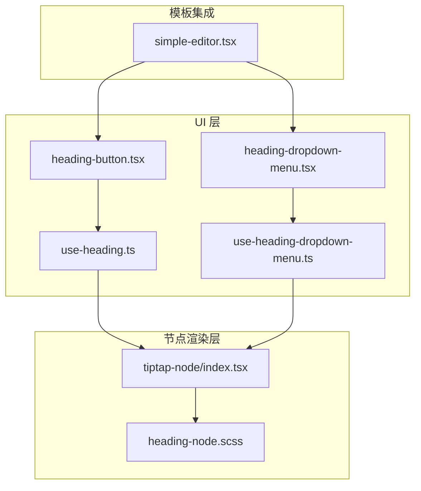
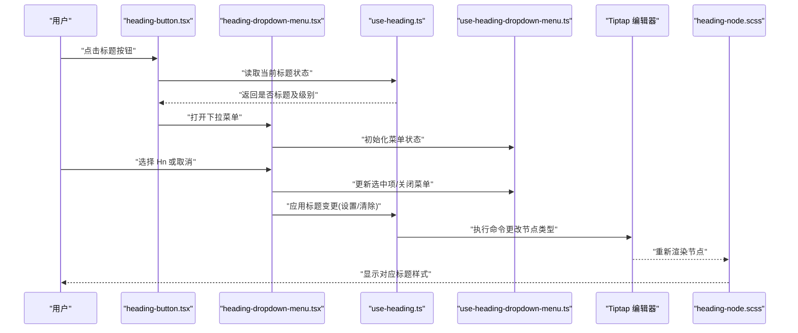
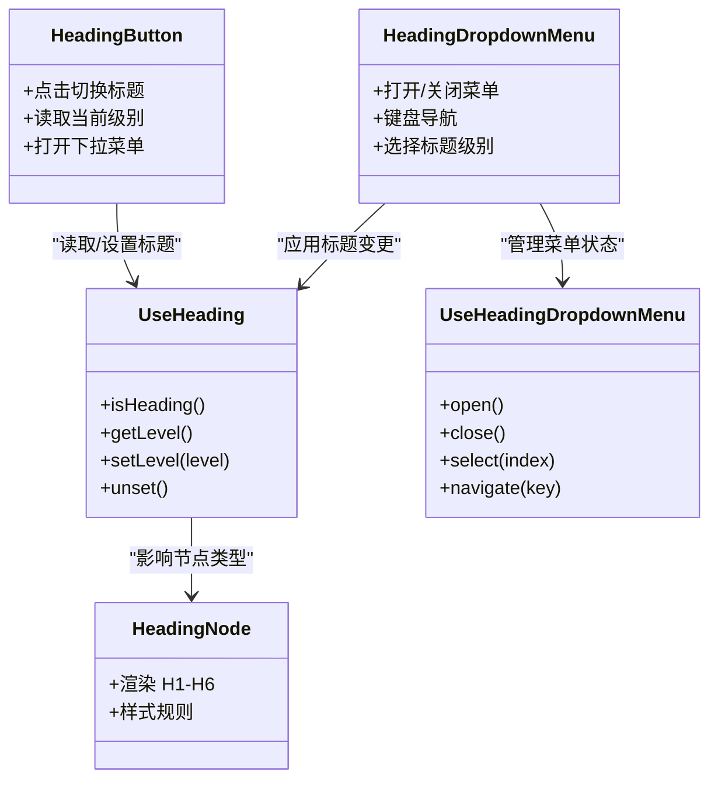

# 标题控制

<cite>
**本文引用的文件**   
- [heading-button.tsx](file://src/components/tiptap-ui/heading-button.tsx)
- [heading-dropdown-menu.tsx](file://src/components/tiptap-ui/heading-dropdown-menu.tsx)
- [use-heading.ts](file://src/components/tiptap-ui/use-heading.ts)
- [use-heading-dropdown-menu.ts](file://src/components/tiptap-ui/use-heading-dropdown-menu.ts)
- [heading-node.scss](file://src/components/tiptap-node/heading-node.scss)
- [index.tsx](file://src/components/tiptap-node/index.tsx)
- [simple-editor.tsx](file://src/components/tiptap-templates/simple/simple-editor.tsx)
</cite>

## 目录
1. [简介](#简介)
2. [项目结构](#项目结构)
3. [核心组件与 Hook](#核心组件与-hook)
4. [架构总览](#架构总览)
5. [详细组件分析](#详细组件分析)
6. [依赖关系分析](#依赖关系分析)
7. [性能考量](#性能考量)
8. [故障排查指南](#故障排查指南)
9. [结论](#结论)
10. [附录](#附录)

## 简介
本技术文档聚焦于编辑器中的“标题控制”能力，围绕以下目标展开：
- 深入解析 heading-button 与 heading-dropdown-menu 组件的实现与交互逻辑
- 说明 H1-H6 各级标题的选择与应用流程
- 解释 useHeading 与 useHeadingDropdownMenu hooks 如何管理标题状态
- 阐述标题节点的创建、修改与删除机制，以及与编辑器内容的同步方式
- 提供标题样式的自定义方法与主题适配指南

## 项目结构
标题控制相关代码主要分布在 tiptap-ui（UI 层）与 tiptap-node（节点渲染层），并通过模板示例进行集成。

图表来源
- [heading-button.tsx](file://src/components/tiptap-ui/heading-button.tsx)
- [heading-dropdown-menu.tsx](file://src/components/tiptap-ui/heading-dropdown-menu.tsx)
- [use-heading.ts](file://src/components/tiptap-ui/use-heading.ts)
- [use-heading-dropdown-menu.ts](file://src/components/tiptap-ui/use-heading-dropdown-menu.ts)
- [heading-node.scss](file://src/components/tiptap-node/heading-node.scss)
- [index.tsx](file://src/components/tiptap-node/index.tsx)
- [simple-editor.tsx](file://src/components/tiptap-templates/simple/simple-editor.tsx)

章节来源
- [heading-button.tsx](file://src/components/tiptap-ui/heading-button.tsx)
- [heading-dropdown-menu.tsx](file://src/components/tiptap-ui/heading-dropdown-menu.tsx)
- [use-heading.ts](file://src/components/tiptap-ui/use-heading.ts)
- [use-heading-dropdown-menu.ts](file://src/components/tiptap-ui/use-heading-dropdown-menu.ts)
- [heading-node.scss](file://src/components/tiptap-node/heading-node.scss)
- [index.tsx](file://src/components/tiptap-node/index.tsx)
- [simple-editor.tsx](file://src/components/tiptap-templates/simple/simple-editor.tsx)

## 核心组件与 Hook
- heading-button：触发标题操作的基础按钮，通常用于切换当前段落为指定级别标题或恢复为普通段落。
- heading-dropdown-menu：提供 H1-H6 的菜单选择，支持键盘导航与无障碍访问。
- useHeading：封装对 Tiptap 编辑器的标题状态查询与变更方法，包括判断当前块是否为标题、获取当前级别、设置/清除标题等。
- useHeadingDropdownMenu：封装下拉菜单的状态与行为，如打开/关闭、选中项高亮、键盘上下键导航、回车确认等。

章节来源
- [heading-button.tsx](file://src/components/tiptap-ui/heading-button.tsx)
- [heading-dropdown-menu.tsx](file://src/components/tiptap-ui/heading-dropdown-menu.tsx)
- [use-heading.ts](file://src/components/tiptap-ui/use-heading.ts)
- [use-heading-dropdown-menu.ts](file://src/components/tiptap-ui/use-heading-dropdown-menu.ts)

## 架构总览
标题控制的调用链从 UI 组件到 Hook，再到编辑器内容模型，最终由节点样式生效。

图表来源
- [heading-button.tsx](file://src/components/tiptap-ui/heading-button.tsx)
- [heading-dropdown-menu.tsx](file://src/components/tiptap-ui/heading-dropdown-menu.tsx)
- [use-heading.ts](file://src/components/tiptap-ui/use-heading.ts)
- [use-heading-dropdown-menu.ts](file://src/components/tiptap-ui/use-heading-dropdown-menu.ts)
- [heading-node.scss](file://src/components/tiptap-node/heading-node.scss)

## 详细组件分析

### heading-button 组件
- 职责：展示当前标题状态，点击后切换为指定级别标题或恢复为段落；可配合下拉菜单使用。
- 关键交互：
  - 读取当前光标所在块的标题级别
  - 根据级别决定按钮激活态与提示文本
  - 点击时调用 Hook 执行标题切换
- 可访问性：提供 aria-label、role 与键盘事件处理，确保屏幕阅读器可用。

章节来源
- [heading-button.tsx](file://src/components/tiptap-ui/heading-button.tsx)

### heading-dropdown-menu 组件
- 职责：提供 H1-H6 选项的下拉菜单，支持键盘导航与无障碍访问。
- 关键交互：
  - 打开/关闭菜单
  - 高亮当前选中项
  - 通过键盘上下键移动焦点，回车确认选择
  - 选择后调用 Hook 应用标题变更并关闭菜单
- 数据绑定：与 useHeadingDropdownMenu 协作，维护菜单状态与选中项。

章节来源
- [heading-dropdown-menu.tsx](file://src/components/tiptap-ui/heading-dropdown-menu.tsx)

### useHeading Hook
- 职责：封装标题相关的状态与命令，供 UI 组件复用。
- 主要能力：
  - 判断当前块是否为标题节点
  - 获取当前标题级别（H1-H6）
  - 设置标题级别（将当前块转换为指定级别的标题）
  - 清除标题（将当前块恢复为段落）
- 与编辑器同步：通过 Tiptap 的命令 API 在编辑器中执行变更，保证内容与视图一致。

章节来源
- [use-heading.ts](file://src/components/tiptap-ui/use-heading.ts)

### useHeadingDropdownMenu Hook
- 职责：管理下拉菜单的交互状态与行为。
- 主要能力：
  - 打开/关闭菜单
  - 维护选中项索引与可见列表
  - 键盘导航（上/下/回车/Esc）
  - 与 useHeading 联动，完成标题应用与菜单关闭
- 可访问性：管理 focus 顺序与 aria-* 属性，提升可用性。

章节来源
- [use-heading-dropdown-menu.ts](file://src/components/tiptap-ui/use-heading-dropdown-menu.ts)

### 标题节点渲染与样式
- 节点注册：在 tiptap-node/index.tsx 中注册 heading 节点，使其在编辑器中可被识别与渲染。
- 样式定义：heading-node.scss 定义了 H1-H6 的视觉样式（字号、行高、边距等），并与主题变量结合实现适配。

章节来源
- [index.tsx](file://src/components/tiptap-node/index.tsx)
- [heading-node.scss](file://src/components/tiptap-node/heading-node.scss)

### 模板集成示例
- simple-editor.tsx 展示了如何在实际编辑器中引入 heading-button 与 heading-dropdown-menu，并将它们组合到工具栏中。

章节来源
- [simple-editor.tsx](file://src/components/tiptap-templates/simple/simple-editor.tsx)

## 依赖关系分析
标题控制模块的依赖关系如下：

图表来源
- [heading-button.tsx](file://src/components/tiptap-ui/heading-button.tsx)
- [heading-dropdown-menu.tsx](file://src/components/tiptap-ui/heading-dropdown-menu.tsx)
- [use-heading.ts](file://src/components/tiptap-ui/use-heading.ts)
- [use-heading-dropdown-menu.ts](file://src/components/tiptap-ui/use-heading-dropdown-menu.ts)
- [index.tsx](file://src/components/tiptap-node/index.tsx)
- [heading-node.scss](file://src/components/tiptap-node/heading-node.scss)

章节来源
- [heading-button.tsx](file://src/components/tiptap-ui/heading-button.tsx)
- [heading-dropdown-menu.tsx](file://src/components/tiptap-ui/heading-dropdown-menu.tsx)
- [use-heading.ts](file://src/components/tiptap-ui/use-heading.ts)
- [use-heading-dropdown-menu.ts](file://src/components/tiptap-ui/use-heading-dropdown-menu.ts)
- [index.tsx](file://src/components/tiptap-node/index.tsx)
- [heading-node.scss](file://src/components/tiptap-node/heading-node.scss)

## 性能考量
- 状态最小化：useHeading 仅暴露必要的状态与方法，避免不必要的重渲染。
- 事件节流：在频繁输入场景下，建议对菜单打开/关闭与键盘事件做适当节流或防抖，减少计算开销。
- 样式合并：heading-node.scss 应利用 CSS 变量与层级选择器，避免深层嵌套导致的样式计算成本。
- 懒加载：若标题菜单项较多，可采用虚拟滚动或按需渲染策略。

[本节为通用指导，不直接分析具体文件]

## 故障排查指南
- 问题：点击标题按钮无响应
  - 检查 useHeading 是否正确注入编辑器实例
  - 确认当前光标是否在可转换的块内
- 问题：下拉菜单无法通过键盘导航
  - 验证 useHeadingDropdownMenu 的键盘事件绑定与焦点管理
  - 检查 aria-* 属性是否正确设置
- 问题：标题样式未生效
  - 确认 heading-node.scss 已正确引入且未被覆盖
  - 检查主题变量是否与当前主题匹配
- 问题：标题变更后内容不同步
  - 确认 useHeading 调用的命令是否正确提交到编辑器
  - 检查是否有外部状态与编辑器内容不一致

章节来源
- [use-heading.ts](file://src/components/tiptap-ui/use-heading.ts)
- [use-heading-dropdown-menu.ts](file://src/components/tiptap-ui/use-heading-dropdown-menu.ts)
- [heading-node.scss](file://src/components/tiptap-node/heading-node.scss)

## 结论
标题控制功能通过 heading-button 与 heading-dropdown-menu 两个 UI 组件，结合 useHeading 与 useHeadingDropdownMenu 两个 Hook，实现了完整的 H1-H6 标题选择与应用流程。该方案具备良好的可访问性与可扩展性，同时通过节点样式与主题变量支持灵活的样式定制。建议在后续迭代中继续优化键盘体验与性能表现。

[本节为总结性内容，不直接分析具体文件]

## 附录

### 标题级别与语义
- H1：主标题，通常用于页面或文章标题
- H2：一级子标题，用于主要章节
- H3：二级子标题，用于小节
- H4-H6：更细粒度的子标题，用于细分内容

[本节为概念性说明，不直接分析具体文件]

### 样式自定义与主题适配
- 在 heading-node.scss 中调整各标题级别的字号、行高、边距等属性
- 使用 CSS 变量统一颜色与间距，便于多主题切换
- 确保在不同分辨率与字体缩放下的可读性与一致性

章节来源
- [heading-node.scss](file://src/components/tiptap-node/heading-node.scss)