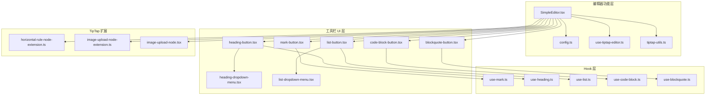
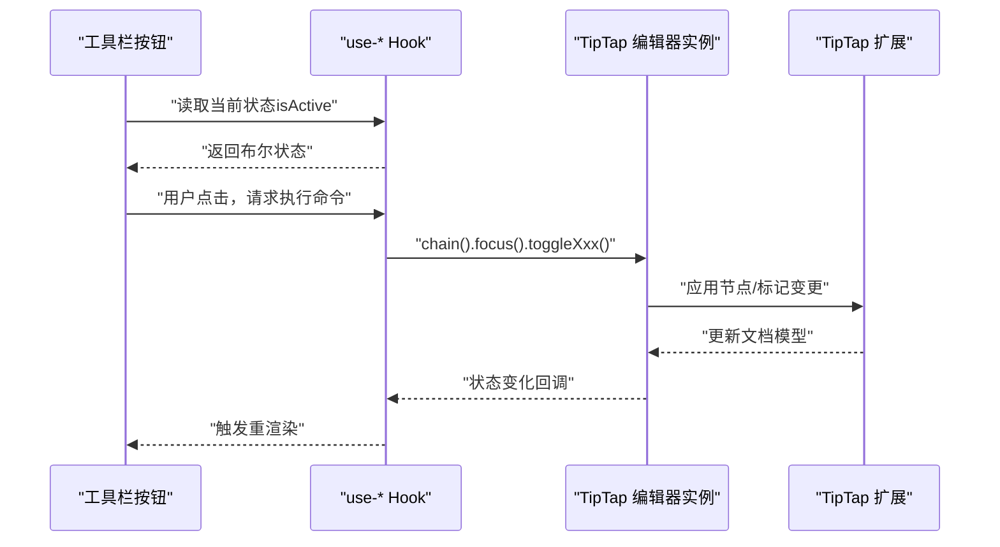
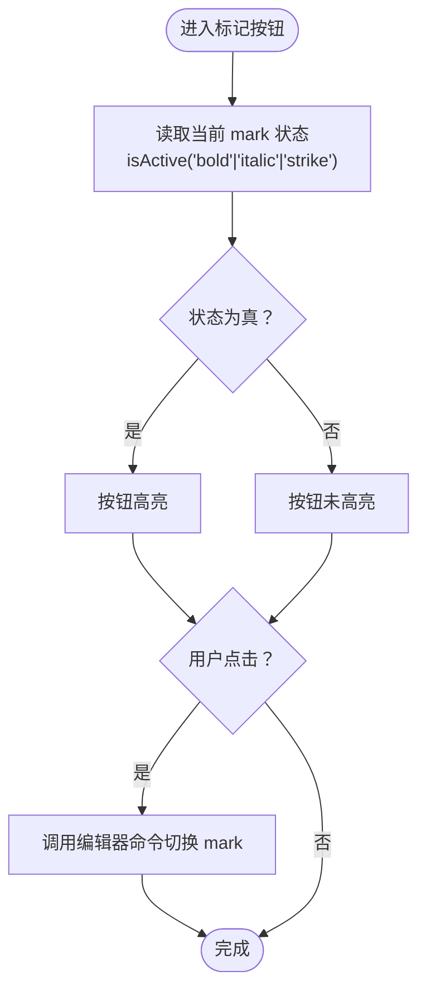
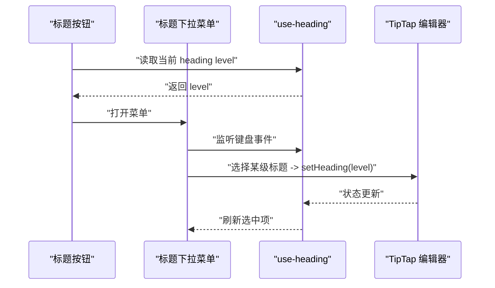
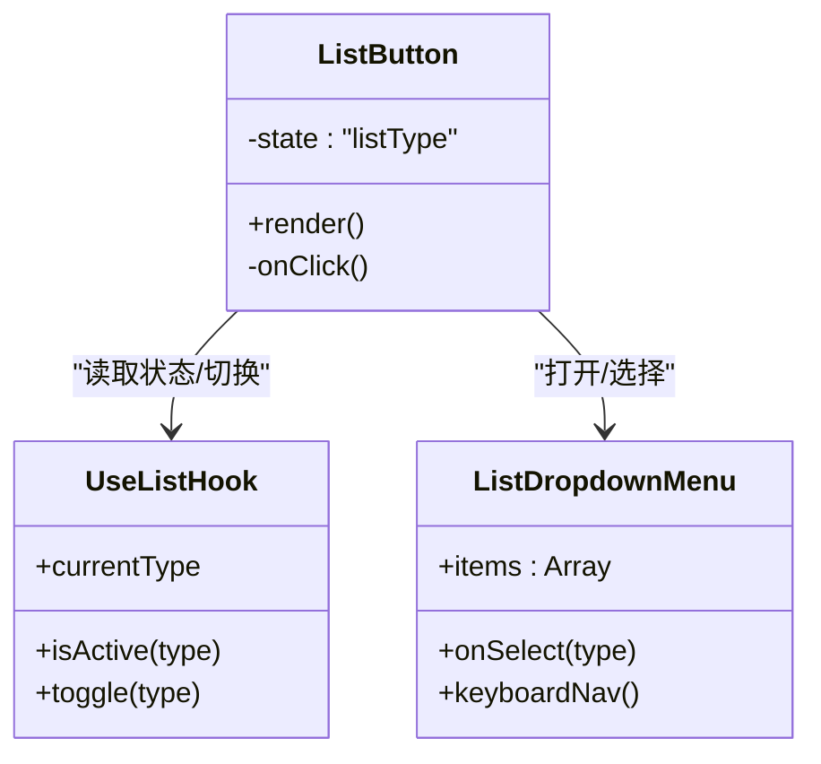
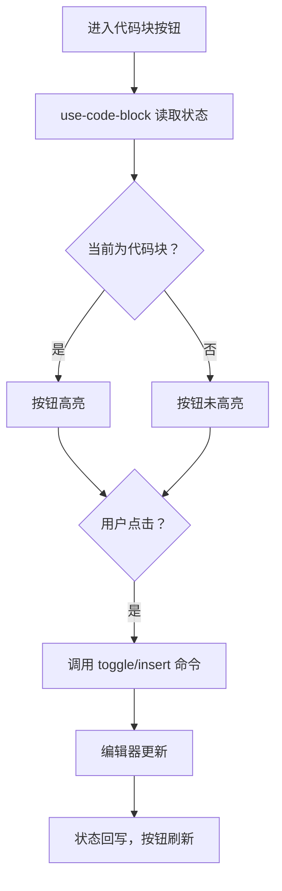
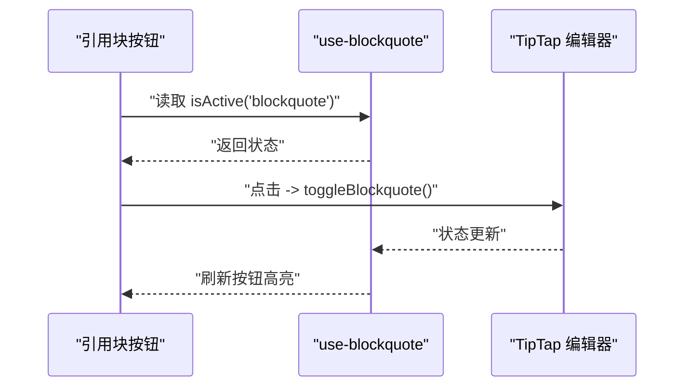
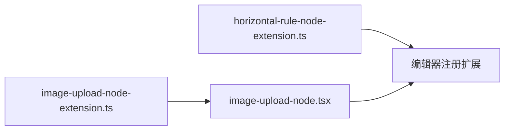
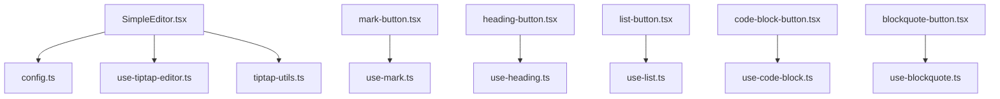

# 编辑器控件

<cite>
**本文引用的文件**   
- [src/components/tiptap-ui/mark-button.tsx](file://src/components/tiptap-ui/mark-button.tsx)
- [src/components/tiptap-ui/use-mark.ts](file://src/components/tiptap-ui/use-mark.ts)
- [src/components/tiptap-ui/heading-button.tsx](file://src/components/tiptap-ui/heading-button.tsx)
- [src/components/tiptap-ui/heading-dropdown-menu.tsx](file://src/components/tiptap-ui/heading-dropdown-menu.tsx)
- [src/components/tiptap-ui/use-heading.ts](file://src/components/tiptap-ui/use-heading.ts)
- [src/components/tiptap-ui/list-button.tsx](file://src/components/tiptap-ui/list-button.tsx)
- [src/components/tiptap-ui/list-dropdown-menu.tsx](file://src/components/tiptap-ui/list-dropdown-menu.tsx)
- [src/components/tiptap-ui/use-list.ts](file://src/components/tiptap-ui/use-list.ts)
- [src/components/tiptap-ui/code-block-button.tsx](file://src/components/tiptap-ui/code-block-button.tsx)
- [src/components/tiptap-ui/use-code-block.ts](file://src/components/tiptap-ui/use-code-block.ts)
- [src/components/tiptap-ui/blockquote-button.tsx](file://src/components/tiptap-ui/blockquote-button.tsx)
- [src/components/tiptap-ui/use-blockquote.ts](file://src/components/tiptap-ui/use-blockquote.ts)
- [src/components/tiptap-node/horizontal-rule-node-extension.ts](file://src/components/tiptap-node/horizontal-rule-node-extension.ts)
- [src/components/tiptap-node/image-upload-node-extension.ts](file://src/components/tiptap-node/image上传节点扩展.ts)
- [src/components/tiptap-node/image-upload-node.tsx](file://src/components/tiptap-node/image-upload-node.tsx)
- [src/features/tiptap/SimpleEditor.tsx](file://src/features/tiptap/SimpleEditor.tsx)
- [src/features/tiptap/config.ts](file://src/features/tiptap/config.ts)
- [src/hooks/use-tiptap-editor.ts](file://src/hooks/use-tiptap-editor.ts)
- [src/lib/tiptap-utils.ts](file://src/lib/tiptap-utils.ts)
</cite>

## 目录
1. [简介](#简介)
2. [项目结构](#项目结构)
3. [核心组件](#核心组件)
4. [架构总览](#架构总览)
5. [详细组件分析](#详细组件分析)
6. [依赖分析](#依赖分析)
7. [性能考虑](#性能考虑)
8. [故障排查指南](#故障排查指南)
9. [结论](#结论)
10. [附录](#附录)

## 简介
本技术文档聚焦于富文本编辑器的核心控件，包括标记按钮（加粗、斜体、删除线）、标题选择器、列表控制、代码块与引用块等。文档将深入说明这些控件如何与 TipTap 编辑器集成，如何通过命令模式调用编辑器能力，并阐述状态同步、快捷键绑定、键盘导航和无障碍访问支持。同时提供控件扩展与自定义的实现指南，帮助开发者快速构建可维护、可扩展的编辑器工具栏与交互体验。

## 项目结构
编辑器相关代码主要分布在以下目录：
- 工具栏 UI 组件与 Hook：src/components/tiptap-ui
- 基础 UI 原语（按钮、下拉菜单、气泡提示等）：src/components/tiptap-ui-primitive
- 图标资源：src/components/tiptap-icons
- TipTap 节点扩展与样式：src/components/tiptap-node
- 简单编辑器示例与配置：src/features/tiptap
- 通用 Hook 与工具：src/hooks, src/lib

图表来源
- [src/features/tiptap/SimpleEditor.tsx](file://src/features/tiptap/SimpleEditor.tsx)
- [src/features/tiptap/config.ts](file://src/features/tiptap/config.ts)
- [src/hooks/use-tiptap-editor.ts](file://src/hooks/use-tiptap-editor.ts)
- [src/lib/tiptap-utils.ts](file://src/lib/tiptap-utils.ts)
- [src/components/tiptap-ui/mark-button.tsx](file://src/components/tiptap-ui/mark-button.tsx)
- [src/components/tiptap-ui/heading-button.tsx](file://src/components/tiptap-ui/heading-button.tsx)
- [src/components/tiptap-ui/heading-dropdown-menu.tsx](file://src/components/tiptap-ui/heading-dropdown-menu.tsx)
- [src/components/tiptap-ui/list-button.tsx](file://src/components/tiptap-ui/list-button.tsx)
- [src/components/tiptap-ui/list-dropdown-menu.tsx](file://src/components/tiptap-ui/list-dropdown-menu.tsx)
- [src/components/tiptap-ui/code-block-button.tsx](file://src/components/tiptap-ui/code-block-button.tsx)
- [src/components/tiptap-ui/blockquote-button.tsx](file://src/components/tiptap-ui/blockquote-button.tsx)
- [src/components/tiptap-ui/use-mark.ts](file://src/components/tiptap-ui/use-mark.ts)
- [src/components/tiptap-ui/use-heading.ts](file://src/components/tiptap-ui/use-heading.ts)
- [src/components/tiptap-ui/use-list.ts](file://src/components/tiptap-ui/use-list.ts)
- [src/components/tiptap-ui/use-code-block.ts](file://src/components/tiptap-ui/use-code-block.ts)
- [src/components/tiptap-ui/use-blockquote.ts](file://src/components/tiptap-ui/use-blockquote.ts)
- [src/components/tiptap-node/horizontal-rule-node-extension.ts](file://src/components/tiptap-node/horizontal-rule-node-extension.ts)
- [src/components/tiptap-node/image-upload-node-extension.ts](file://src/components/tiptap-node/image上传节点扩展.ts)
- [src/components/tiptap-node/image-upload-node.tsx](file://src/components/tiptap-node/image-upload-node.tsx)

章节来源
- [src/features/tiptap/SimpleEditor.tsx](file://src/features/tiptap/SimpleEditor.tsx)
- [src/features/tiptap/config.ts](file://src/features/tiptap/config.ts)
- [src/hooks/use-tiptap-editor.ts](file://src/hooks/use-tiptap-editor.ts)
- [src/lib/tiptap-utils.ts](file://src/lib/tiptap-utils.ts)

## 核心组件
本节概述各核心控件的职责与协作方式：
- 标记按钮（加粗、斜体、删除线）：通过 use-mark Hook 获取当前选区是否处于对应 mark 状态，点击时调用编辑器命令切换 mark。
- 标题选择器：包含单个标题按钮与下拉菜单，使用 use-heading Hook 管理当前段落级别，并在选择后应用相应 heading 命令。
- 列表控制：支持有序、无序与待办列表，use-list Hook 负责检测与切换列表类型，list-dropdown-menu 提供交互入口。
- 代码块：use-code-block Hook 检测当前节点是否为 code block，code-block-button 触发插入或切换命令。
- 引用块：use-blockquote Hook 管理 blockquote 状态，blockquote-button 用于插入或切换引用块。

上述控件均遵循“状态读取 + 命令执行”的模式，确保 UI 与编辑器内容一致。

章节来源
- [src/components/tiptap-ui/mark-button.tsx](file://src/components/tiptap-ui/mark-button.tsx)
- [src/components/tiptap-ui/use-mark.ts](file://src/components/tiptap-ui/use-mark.ts)
- [src/components/tiptap-ui/heading-button.tsx](file://src/components/tiptap-ui/heading-button.tsx)
- [src/components/tiptap-ui/heading-dropdown-menu.tsx](file://src/components/tiptap-ui/heading-dropdown-menu.tsx)
- [src/components/tiptap-ui/use-heading.ts](file://src/components/tiptap-ui/use-heading.ts)
- [src/components/tiptap-ui/list-button.tsx](file://src/components/tiptap-ui/list-button.tsx)
- [src/components/tiptap-ui/list-dropdown-menu.tsx](file://src/components/tiptap-ui/list-dropdown-menu.tsx)
- [src/components/tiptap-ui/use-list.ts](file://src/components/tiptap-ui/use-list.ts)
- [src/components/tiptap-ui/code-block-button.tsx](file://src/components/tiptap-ui/code-block-button.tsx)
- [src/components/tiptap-ui/use-code-block.ts](file://src/components/tiptap-ui/use-code-block.ts)
- [src/components/tiptap-ui/blockquote-button.tsx](file://src/components/tiptap-ui/blockquote-button.tsx)
- [src/components/tiptap-ui/use-blockquote.ts](file://src/components/tiptap-ui/use-blockquote.ts)

## 架构总览
编辑器整体采用分层设计：
- 编辑器实例层：由 SimpleEditor 初始化 TipTap 编辑器，注入扩展与配置。
- 工具栏层：各按钮与下拉菜单通过 Hook 读取编辑器状态并调用命令。
- Hook 层：封装对 editor.isActive、editor.chain().focus().command() 的调用逻辑，统一处理焦点与撤销栈。
- 扩展层：自定义节点与扩展（如水平分割线、图片上传节点）在编辑器启动时注册。

图表来源
- [src/features/tiptap/SimpleEditor.tsx](file://src/features/tiptap/SimpleEditor.tsx)
- [src/features/tiptap/config.ts](file://src/features/tiptap/config.ts)
- [src/components/tiptap-ui/use-mark.ts](file://src/components/tiptap-ui/use-mark.ts)
- [src/components/tiptap-ui/use-heading.ts](file://src/components/tiptap-ui/use-heading.ts)
- [src/components/tiptap-ui/use-list.ts](file://src/components/tiptap-ui/use-list.ts)
- [src/components/tiptap-ui/use-code-block.ts](file://src/components/tiptap-ui/use-code-block.ts)
- [src/components/tiptap-ui/use-blockquote.ts](file://src/components/tiptap-ui/use-blockquote.ts)

## 详细组件分析

### 标记按钮（加粗、斜体、删除线）
- 职责：显示当前选区是否处于加粗/斜体/删除线状态；点击时切换对应 mark。
- 状态同步：通过 use-mark Hook 判断 isActive，驱动按钮激活态。
- 命令调用：点击后调用编辑器链式命令进行 toggle。
- 无障碍：为按钮设置 aria-pressed、aria-label 等属性，配合键盘 Enter/Space 触发。
- 快捷键：可在编辑器全局注册快捷键以切换 mark。

图表来源
- [src/components/tiptap-ui/mark-button.tsx](file://src/components/tiptap-ui/mark-button.tsx)
- [src/components/tiptap-ui/use-mark.ts](file://src/components/tiptap-ui/use-mark.ts)

章节来源
- [src/components/tiptap-ui/mark-button.tsx](file://src/components/tiptap-ui/mark-button.tsx)
- [src/components/tiptap-ui/use-mark.ts](file://src/components/tiptap-ui/use-mark.ts)

### 标题选择器（单按钮 + 下拉菜单）
- 职责：展示当前段落级别；下拉菜单提供 h1-h6 选项；选择后应用对应 heading。
- 状态同步：use-heading Hook 检测当前节点 level，驱动按钮与菜单选中项。
- 命令调用：选择后调用 chain().focus().setHeading({level})。
- 键盘导航：下拉菜单支持方向键上下移动、Enter 确认、Esc 关闭。
- 无障碍：为菜单项设置 role="menuitem"、aria-selected 等。

图表来源
- [src/components/tiptap-ui/heading-button.tsx](file://src/components/tiptap-ui/heading-button.tsx)
- [src/components/tiptap-ui/heading-dropdown-menu.tsx](file://src/components/tiptap-ui/heading-dropdown-menu.tsx)
- [src/components/tiptap-ui/use-heading.ts](file://src/components/tiptap-ui/use-heading.ts)

章节来源
- [src/components/tiptap-ui/heading-button.tsx](file://src/components/tiptap-ui/heading-button.tsx)
- [src/components/tiptap-ui/heading-dropdown-menu.tsx](file://src/components/tiptap-ui/heading-dropdown-menu.tsx)
- [src/components/tiptap-ui/use-heading.ts](file://src/components/tiptap-ui/use-heading.ts)

### 列表控制（有序、无序、待办）
- 职责：切换当前段落的列表类型；支持嵌套与层级调整。
- 状态同步：use-list Hook 检测当前节点是否为 list、ordered、taskList，并返回类型信息。
- 命令调用：根据目标类型调用对应的 toggleList/setOrderedList/setTaskList 命令。
- 键盘导航：下拉菜单支持方向键与回车选择。
- 无障碍：为菜单项设置 role、aria-checked（待办）等。

图表来源
- [src/components/tiptap-ui/list-button.tsx](file://src/components/tiptap-ui/list-button.tsx)
- [src/components/tiptap-ui/list-dropdown-menu.tsx](file://src/components/tiptap-ui/list-dropdown-menu.tsx)
- [src/components/tiptap-ui/use-list.ts](file://src/components/tiptap-ui/use-list.ts)

章节来源
- [src/components/tiptap-ui/list-button.tsx](file://src/components/tiptap-ui/list-button.tsx)
- [src/components/tiptap-ui/list-dropdown-menu.tsx](file://src/components/tiptap-ui/list-dropdown-menu.tsx)
- [src/components/tiptap-ui/use-list.ts](file://src/components/tiptap-ui/use-list.ts)

### 代码块
- 职责：检测当前节点是否为代码块；点击后插入或切换代码块。
- 状态同步：use-code-block Hook 基于 isActive('codeBlock') 判断。
- 命令调用：toggleCodeBlock 或 insertCodeBlock。
- 键盘导航：工具栏按钮支持 Tab 顺序与 Enter/Space 触发。
- 无障碍：为按钮设置 aria-pressed、aria-label。

图表来源
- [src/components/tiptap-ui/code-block-button.tsx](file://src/components/tiptap-ui/code-block-button.tsx)
- [src/components/tiptap-ui/use-code-block.ts](file://src/components/tiptap-ui/use-code-block.ts)

章节来源
- [src/components/tiptap-ui/code-block-button.tsx](file://src/components/tiptap-ui/code-block-button.tsx)
- [src/components/tiptap-ui/use-code-block.ts](file://src/components/tiptap-ui/use-code-block.ts)

### 引用块
- 职责：检测当前段落是否为引用块；点击后插入或切换引用块。
- 状态同步：use-blockquote Hook 基于 isActive('blockquote') 判断。
- 命令调用：toggleBlockquote。
- 键盘导航：按钮支持键盘操作，菜单/气泡中也可触发。
- 无障碍：设置 aria-pressed、aria-label。

图表来源
- [src/components/tiptap-ui/blockquote-button.tsx](file://src/components/tiptap-ui/blockquote-button.tsx)
- [src/components/tiptap-ui/use-blockquote.ts](file://src/components/tiptap-ui/use-blockquote.ts)

章节来源
- [src/components/tiptap-ui/blockquote-button.tsx](file://src/components/tiptap-ui/blockquote-button.tsx)
- [src/components/tiptap-ui/use-blockquote.ts](file://src/components/tiptap-ui/use-blockquote.ts)

### 编辑器扩展（水平分割线与图片上传节点）
- 水平分割线：自定义节点扩展，注册到编辑器，提供相应的样式与行为。
- 图片上传节点：自定义节点扩展与组件，支持拖拽/选择文件上传，渲染图片预览与占位。

图表来源
- [src/components/tiptap-node/horizontal-rule-node-extension.ts](file://src/components/tiptap-node/horizontal-rule-node-extension.ts)
- [src/components/tiptap-node/image-upload-node-extension.ts](file://src/components/tiptap-node/image上传节点扩展.ts)
- [src/components/tiptap-node/image-upload-node.tsx](file://src/components/tiptap-node/image-upload-node.tsx)

章节来源
- [src/components/tiptap-node/horizontal-rule-node-extension.ts](file://src/components/tiptap-node/horizontal-rule-node-extension.ts)
- [src/components/tiptap-node/image-upload-node-extension.ts](file://src/components/tiptap-node/image上传节点扩展.ts)
- [src/components/tiptap-node/image-upload-node.tsx](file://src/components/tiptap-node/image-upload-node.tsx)

## 依赖分析
- 组件与 Hook 的耦合关系：
  - 每个按钮组件仅依赖对应的 use-* Hook，避免直接耦合编辑器实例，提升可测试性与复用性。
  - Hook 内部封装了 isActive 与 chain().focus().command() 的调用，保证焦点管理与撤销栈一致性。
- 编辑器实例来源：
  - SimpleEditor 负责创建与配置 TipTap 编辑器，并通过上下文或 props 向子组件传递实例。
  - config.ts 集中管理扩展与插件配置，便于统一维护。
- 外部依赖：
  - TipTap 核心库与官方扩展（如 Heading、BulletList、OrderedList、TaskList、Blockquote、CodeBlock）。
  - 自定义扩展（水平分割线、图片上传节点）在编辑器初始化时注册。

图表来源
- [src/features/tiptap/SimpleEditor.tsx](file://src/features/tiptap/SimpleEditor.tsx)
- [src/features/tiptap/config.ts](file://src/features/tiptap/config.ts)
- [src/hooks/use-tiptap-editor.ts](file://src/hooks/use-tiptap-editor.ts)
- [src/lib/tiptap-utils.ts](file://src/lib/tiptap-utils.ts)
- [src/components/tiptap-ui/mark-button.tsx](file://src/components/tiptap-ui/mark-button.tsx)
- [src/components/tiptap-ui/heading-button.tsx](file://src/components/tiptap-ui/heading-button.tsx)
- [src/components/tiptap-ui/list-button.tsx](file://src/components/tiptap-ui/list-button.tsx)
- [src/components/tiptap-ui/code-block-button.tsx](file://src/components/tiptap-ui/code-block-button.tsx)
- [src/components/tiptap-ui/blockquote-button.tsx](file://src/components/tiptap-ui/blockquote-button.tsx)
- [src/components/tiptap-ui/use-mark.ts](file://src/components/tiptap-ui/use-mark.ts)
- [src/components/tiptap-ui/use-heading.ts](file://src/components/tiptap-ui/use-heading.ts)
- [src/components/tiptap-ui/use-list.ts](file://src/components/tiptap-ui/use-list.ts)
- [src/components/tiptap-ui/use-code-block.ts](file://src/components/tiptap-ui/use-code-block.ts)
- [src/components/tiptap-ui/use-blockquote.ts](file://src/components/tiptap-ui/use-blockquote.ts)

章节来源
- [src/features/tiptap/SimpleEditor.tsx](file://src/features/tiptap/SimpleEditor.tsx)
- [src/features/tiptap/config.ts](file://src/features/tiptap/config.ts)
- [src/hooks/use-tiptap-editor.ts](file://src/hooks/use-tiptap-editor.ts)
- [src/lib/tiptap-utils.ts](file://src/lib/tiptap-utils.ts)

## 性能考虑
- 状态读取优化：
  - 使用 editor.isActive 仅在必要时计算，避免频繁重渲染。
  - 将状态订阅范围最小化，例如按按钮粒度拆分 Hook，减少无关组件重绘。
- 命令执行优化：
  - 使用 chain().focus().command() 批量执行，减少多次更新带来的抖动。
  - 对于复杂操作（如插入大段内容），考虑节流或分片更新。
- 扩展与节点：
  - 自定义节点尽量保持轻量，避免在 render 中进行昂贵计算。
  - 图片上传节点应实现懒加载与缩略图缓存。

[本节为通用指导，不直接分析具体文件]

## 故障排查指南
- 按钮状态不同步：
  - 检查 use-* Hook 是否正确订阅 editor.on('update') 或依赖 isActive。
  - 确认焦点管理：在执行命令前调用 focus()，避免状态读取失败。
- 快捷键无效：
  - 确认快捷键注册位置与优先级，避免被其他扩展覆盖。
  - 检查浏览器兼容性与组合键冲突。
- 键盘导航异常：
  - 验证菜单项的 tabindex、role、aria-* 属性是否正确设置。
  - 确认方向键与回车事件的冒泡与默认行为处理。
- 自定义扩展未生效：
  - 检查扩展是否在编辑器初始化时正确注册。
  - 查看控制台错误日志，确认节点 schema 与渲染函数无冲突。

章节来源
- [src/components/tiptap-ui/use-mark.ts](file://src/components/tiptap-ui/use-mark.ts)
- [src/components/tiptap-ui/use-heading.ts](file://src/components/tiptap-ui/use-heading.ts)
- [src/components/tiptap-ui/use-list.ts](file://src/components/tiptap-ui/use-list.ts)
- [src/components/tiptap-ui/use-code-block.ts](file://src/components/tiptap-ui/use-code-block.ts)
- [src/components/tiptap-ui/use-blockquote.ts](file://src/components/tiptap-ui/use-blockquote.ts)
- [src/features/tiptap/config.ts](file://src/features/tiptap/config.ts)

## 结论
本文系统梳理了富文本编辑器核心控件的实现与集成方式，明确了“状态读取 + 命令执行”的统一模式，并提供了键盘导航与无障碍支持的实践建议。通过分层设计与 Hook 封装，控件具备高内聚、低耦合的特性，便于扩展与定制。开发者可在此基础上快速添加新的工具栏按钮与交互逻辑，满足多样化的编辑需求。

[本节为总结，不直接分析具体文件]

## 附录
- 扩展与自定义指南：
  - 新增标记按钮：参考 mark-button 与 use-mark，复制模板并替换 mark 名称与命令。
  - 新增块级元素：参考 code-block-button 与 use-code-block，实现 isActive 判断与 toggle 命令。
  - 自定义节点：参考 image-upload-node-extension 与 image-upload-node，定义 schema、renderHTML 与 React 组件。
  - 快捷键绑定：在编辑器配置中注册全局快捷键，确保与现有扩展无冲突。
  - 无障碍增强：为所有交互元素补充 aria-* 与键盘事件处理，确保屏幕阅读器友好。

章节来源
- [src/components/tiptap-ui/mark-button.tsx](file://src/components/tiptap-ui/mark-button.tsx)
- [src/components/tiptap-ui/use-mark.ts](file://src/components/tiptap-ui/use-mark.ts)
- [src/components/tiptap-ui/code-block-button.tsx](file://src/components/tiptap-ui/code-block-button.tsx)
- [src/components/tiptap-ui/use-code-block.ts](file://src/components/tiptap-ui/use-code-block.ts)
- [src/components/tiptap-node/image-upload-node-extension.ts](file://src/components/tiptap-node/image上传节点扩展.ts)
- [src/components/tiptap-node/image-upload-node.tsx](file://src/components/tiptap-node/image-upload-node.tsx)
- [src/features/tiptap/config.ts](file://src/features/tiptap/config.ts)