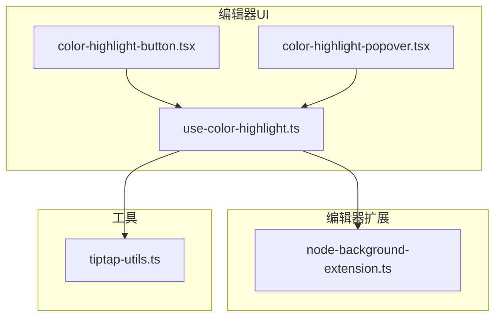
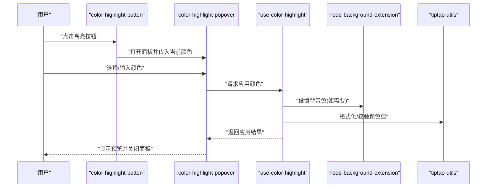
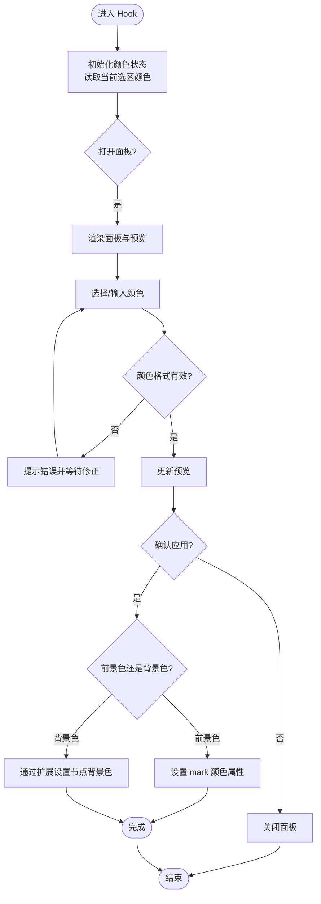
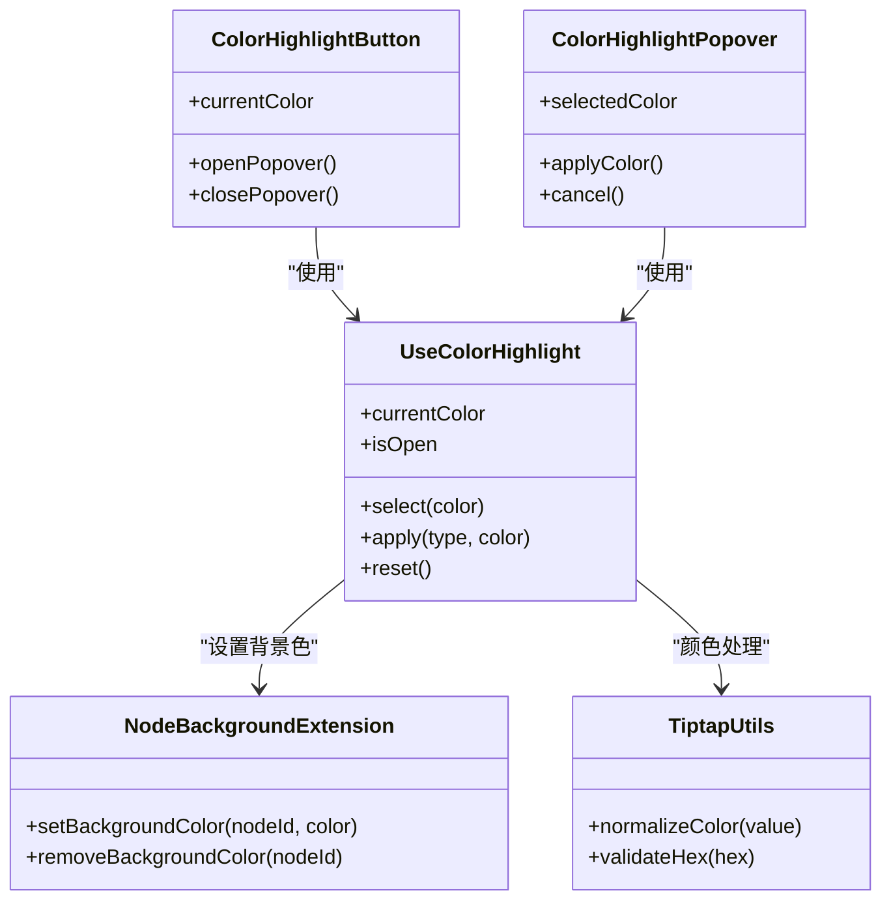

# 颜色高亮控件

<cite>
**本文引用的文件**   
- [color-highlight-button.tsx](file://src/components/tiptap-ui/color-highlight-button.tsx)
- [color-highlight-popover.tsx](file://src/components/tiptap-ui/color-highlight-popover.tsx)
- [use-color-highlight.ts](file://src/components/tiptap-ui/use-color-highlight.ts)
- [node-background-extension.ts](file://src/components/tiptap-extension/node-background-extension.ts)
- [tiptap-utils.ts](file://src/lib/tiptap-utils.ts)
</cite>

## 目录
1. [简介](#简介)
2. [项目结构](#项目结构)
3. [核心组件与 Hook](#核心组件与-hook)
4. [架构总览](#架构总览)
5. [详细组件分析](#详细组件分析)
6. [依赖关系分析](#依赖关系分析)
7. [性能考虑](#性能考虑)
8. [故障排查指南](#故障排查指南)
9. [结论](#结论)
10. [附录](#附录)

## 简介
本技术文档围绕“颜色高亮控件”的实现进行深入解析，覆盖文本高亮（前景色）与背景色设置功能。重点说明以下要点：
- color-highlight-button 与 color-highlight-popover 的交互设计与协作方式
- useColorHighlight hook 的颜色状态管理、选择/预览/应用流程
- 颜色值的数据格式约定、预设颜色库维护与新颜色添加方法
- 对比度检查、无障碍访问支持与主题适配的实现建议

## 项目结构
颜色高亮相关代码位于编辑器 UI 层与扩展层，主要包含：
- 按钮与弹出面板：color-highlight-button、color-highlight-popover
- 状态与逻辑：use-color-highlight
- 编辑器扩展：node-background-extension（用于背景色）
- 工具函数：tiptap-utils（可能包含颜色处理辅助）

图表来源
- [color-highlight-button.tsx](file://src/components/tiptap-ui/color-highlight-button.tsx)
- [color-highlight-popover.tsx](file://src/components/tiptap-ui/color-highlight-popover.tsx)
- [use-color-highlight.ts](file://src/components/tiptap-ui/use-color-highlight.ts)
- [node-background-extension.ts](file://src/components/tiptap-extension/node-background-extension.ts)
- [tiptap-utils.ts](file://src/lib/tiptap-utils.ts)

章节来源
- [color-highlight-button.tsx](file://src/components/tiptap-ui/color-highlight-button.tsx)
- [color-highlight-popover.tsx](file://src/components/tiptap-ui/color-highlight-popover.tsx)
- [use-color-highlight.ts](file://src/components/tiptap-ui/use-color-highlight.ts)
- [node-background-extension.ts](file://src/components/tiptap-extension/node-background-extension.ts)
- [tiptap-utils.ts](file://src/lib/tiptap-utils.ts)

## 核心组件与 Hook
- color-highlight-button：触发颜色选择面板的入口按钮，负责打开/关闭 popover 并传递当前选中颜色到面板。
- color-highlight-popover：展示预设颜色网格、自定义输入框与预览区域，支持点击应用或取消。
- use-color-highlight：封装颜色选择的状态与行为，包括：
  - 当前选中的颜色值（前景色/背景色）
  - 打开/关闭面板
  - 选择新颜色后的预览与应用
  - 与 Tiptap 编辑器的集成（设置 mark 或 node 属性）

章节来源
- [color-highlight-button.tsx](file://src/components/tiptap-ui/color-highlight-button.tsx)
- [color-highlight-popover.tsx](file://src/components/tiptap-ui/color-highlight-popover.tsx)
- [use-color-highlight.ts](file://src/components/tiptap-ui/use-color-highlight.ts)

## 架构总览
颜色高亮的整体流程如下：
- 用户点击“高亮”按钮，打开颜色选择面板
- 在面板中选择预设颜色或输入自定义颜色
- 通过 useColorHighlight 将颜色应用到编辑器内容（前景色或背景色）
- 背景色通过 node-background-extension 写入节点样式；前景色通过 mark 属性写入

图表来源
- [color-highlight-button.tsx](file://src/components/tiptap-ui/color-highlight-button.tsx)
- [color-highlight-popover.tsx](file://src/components/tiptap-ui/color-highlight-popover.tsx)
- [use-color-highlight.ts](file://src/components/tiptap-ui/use-color-highlight.ts)
- [node-background-extension.ts](file://src/components/tiptap-extension/node-background-extension.ts)
- [tiptap-utils.ts](file://src/lib/tiptap-utils.ts)

## 详细组件分析

### color-highlight-button 组件
- 职责
  - 作为颜色选择的触发器，控制 popover 的显隐
  - 向 popover 传递当前颜色上下文（前景色/背景色）
- 交互设计
  - 点击后打开面板，再次点击或点击外部可关闭
  - 提供键盘可达性与焦点管理（结合基础 UI 组件）
- 与 Hook 的关系
  - 使用 useColorHighlight 获取当前颜色与打开面板的方法

章节来源
- [color-highlight-button.tsx](file://src/components/tiptap-ui/color-highlight-button.tsx)

### color-highlight-popover 组件
- 职责
  - 展示预设颜色网格与自定义输入框
  - 提供实时预览区域，帮助用户确认效果
  - 调用 Hook 完成颜色的应用与撤销
- 交互设计
  - 点击预设颜色立即预览并可确认应用
  - 输入自定义颜色时进行基本校验（如十六进制格式）
  - 支持 ESC 键关闭与 Tab 导航
- 与 Hook 的关系
  - 接收 Hook 暴露的选择、预览与应用接口

章节来源
- [color-highlight-popover.tsx](file://src/components/tiptap-ui/color-highlight-popover.tsx)

### useColorHighlight Hook
- 状态管理
  - 当前颜色值（支持多种数据格式，如 #RRGGBB、rgb()、hsl()）
  - 面板开关状态
  - 操作类型（前景色/背景色）
- 核心流程
  - 选择颜色：校验格式、更新预览
  - 应用颜色：根据操作类型调用不同策略（mark 或 node）
  - 撤销/重置：恢复上一次有效颜色
- 与编辑器集成
  - 前景色：通过 Tiptap mark 属性设置文本颜色
  - 背景色：通过 node-background-extension 设置节点背景色
- 工具函数
  - 使用 tiptap-utils 进行颜色规范化与兼容性处理

图表来源
- [use-color-highlight.ts](file://src/components/tiptap-ui/use-color-highlight.ts)
- [node-background-extension.ts](file://src/components/tiptap-extension/node-background-extension.ts)
- [tiptap-utils.ts](file://src/lib/tiptap-utils.ts)

章节来源
- [use-color-highlight.ts](file://src/components/tiptap-ui/use-color-highlight.ts)
- [node-background-extension.ts](file://src/components/tiptap-extension/node-background-extension.ts)
- [tiptap-utils.ts](file://src/lib/tiptap-utils.ts)

### 背景色扩展：node-background-extension
- 职责
  - 为指定节点注入背景色样式
  - 与 useColorHighlight 协作，确保背景色持久化到文档模型
- 关键点
  - 节点属性中存储颜色值
  - 渲染阶段将颜色映射到 CSS 样式
  - 与前景色 mark 互不干扰

章节来源
- [node-background-extension.ts](file://src/components/tiptap-extension/node-background-extension.ts)

## 依赖关系分析
- 组件与 Hook
  - color-highlight-button 依赖 useColorHighlight 以获取状态与控制方法
  - color-highlight-popover 依赖 useColorHighlight 以执行选择与应用
- Hook 与扩展/工具
  - useColorHighlight 依赖 node-background-extension 实现背景色
  - useColorHighlight 依赖 tiptap-utils 进行颜色值处理与兼容

图表来源
- [color-highlight-button.tsx](file://src/components/tiptap-ui/color-highlight-button.tsx)
- [color-highlight-popover.tsx](file://src/components/tiptap-ui/color-highlight-popover.tsx)
- [use-color-highlight.ts](file://src/components/tiptap-ui/use-color-highlight.ts)
- [node-background-extension.ts](file://src/components/tiptap-extension/node-background-extension.ts)
- [tiptap-utils.ts](file://src/lib/tiptap-utils.ts)

章节来源
- [color-highlight-button.tsx](file://src/components/tiptap-ui/color-highlight-button.tsx)
- [color-highlight-popover.tsx](file://src/components/tiptap-ui/color-highlight-popover.tsx)
- [use-color-highlight.ts](file://src/components/tiptap-ui/use-color-highlight.ts)
- [node-background-extension.ts](file://src/components/tiptap-extension/node-background-extension.ts)
- [tiptap-utils.ts](file://src/lib/tiptap-utils.ts)

## 性能考虑
- 颜色计算与预览
  - 避免在每次渲染中进行昂贵的颜色转换，必要时缓存结果
  - 对大量预设颜色网格采用虚拟滚动或分页加载
- 编辑器更新频率
  - 合并多次颜色变更，减少不必要的重渲染
  - 仅在确认应用时写入文档模型，预览阶段仅更新本地状态
- 无障碍与主题
  - 颜色切换不应导致布局抖动
  - 主题切换时批量更新颜色映射，避免逐元素重绘

[本节为通用指导，无需具体文件引用]

## 故障排查指南
- 颜色未生效
  - 检查是否选择了正确的操作类型（前景色/背景色）
  - 确认颜色格式合法（十六进制、rgb/hsl）
  - 验证扩展是否正确注册并挂载到编辑器
- 预览与实际不一致
  - 检查 CSS 变量与主题覆盖
  - 确认节点层级与样式优先级
- 无障碍问题
  - 为颜色按钮与面板提供 aria-label 与 role
  - 确保键盘导航顺序合理，焦点可见

章节来源
- [use-color-highlight.ts](file://src/components/tiptap-ui/use-color-highlight.ts)
- [node-background-extension.ts](file://src/components/tiptap-extension/node-background-extension.ts)

## 结论
颜色高亮控件通过清晰的组件分层与 Hook 抽象，实现了灵活的前景色与背景色设置能力。配合扩展与工具函数，保证了颜色值的规范化和编辑器集成的稳定性。建议在后续迭代中完善预设颜色库、增强对比度检查与无障碍支持，以提升用户体验与可访问性。

[本节为总结性内容，无需具体文件引用]

## 附录

### 颜色值数据格式与预设颜色库
- 推荐格式
  - 十六进制：#RRGGBB 或 #RGBA
  - RGB/HSL：rgb(r,g,b)、hsl(h,s,l)
- 预设颜色库维护
  - 集中定义颜色常量，按语义分组（如品牌色、中性色、警示色）
  - 提供导出接口供按钮与面板消费
- 新增颜色步骤
  - 在预设库中添加新条目（名称、值、用途）
  - 在面板中刷新列表并测试预览与应用
  - 更新对比度规则与主题映射（如有）

章节来源
- [use-color-highlight.ts](file://src/components/tiptap-ui/use-color-highlight.ts)
- [color-highlight-popover.tsx](file://src/components/tiptap-ui/color-highlight-popover.tsx)

### 对比度检查与无障碍访问
- 对比度检查
  - 基于 WCAG 标准计算前景色与背景色的对比度
  - 当对比度低于阈值时给出警告或自动调整亮度
- 无障碍支持
  - 为颜色选择控件提供合适的标签与描述
  - 支持键盘操作与屏幕阅读器播报
  - 在高对比度模式下保持可读性

章节来源
- [use-color-highlight.ts](file://src/components/tiptap-ui/use-color-highlight.ts)
- [tiptap-utils.ts](file://src/lib/tiptap-utils.ts)

### 主题适配指南
- 使用 CSS 变量管理主题色，便于一键切换
- 在主题切换时重新计算颜色映射与对比度
- 为深色/浅色模式分别配置最佳可读性的颜色组合

章节来源
- [node-background-extension.ts](file://src/components/tiptap-extension/node-background-extension.ts)
- [tiptap-utils.ts](file://src/lib/tiptap-utils.ts)