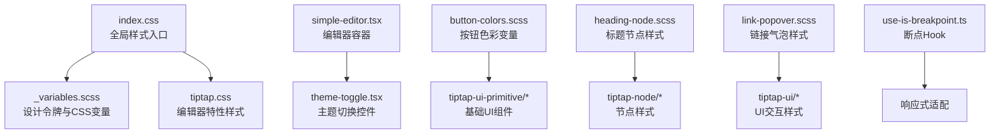
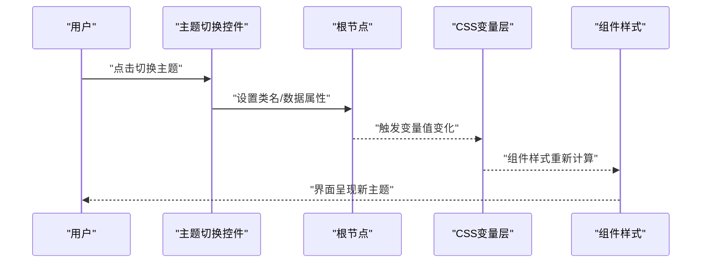
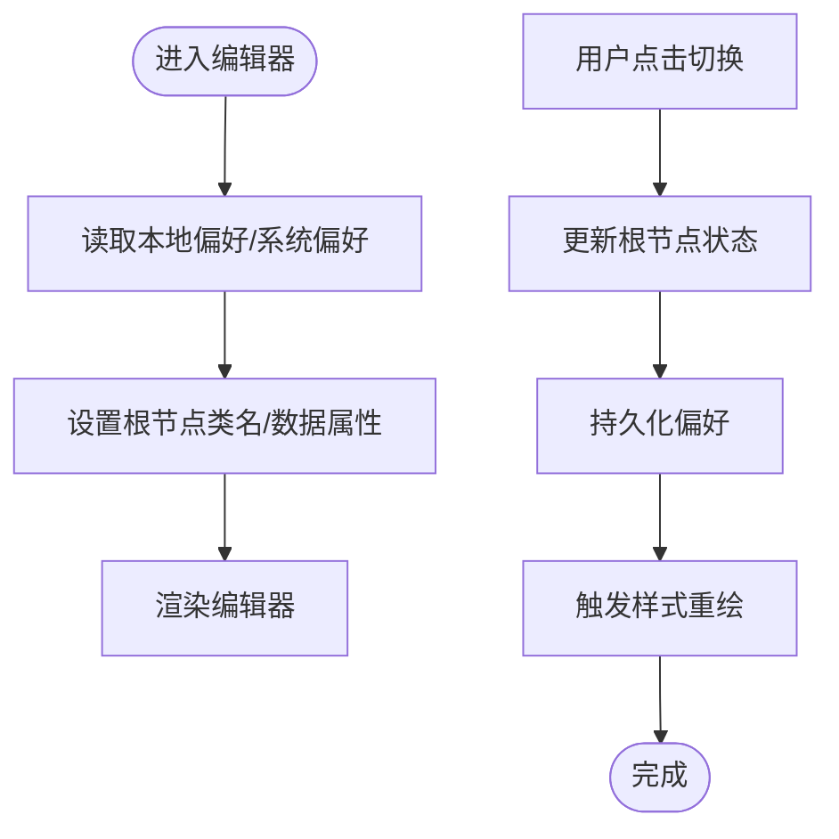
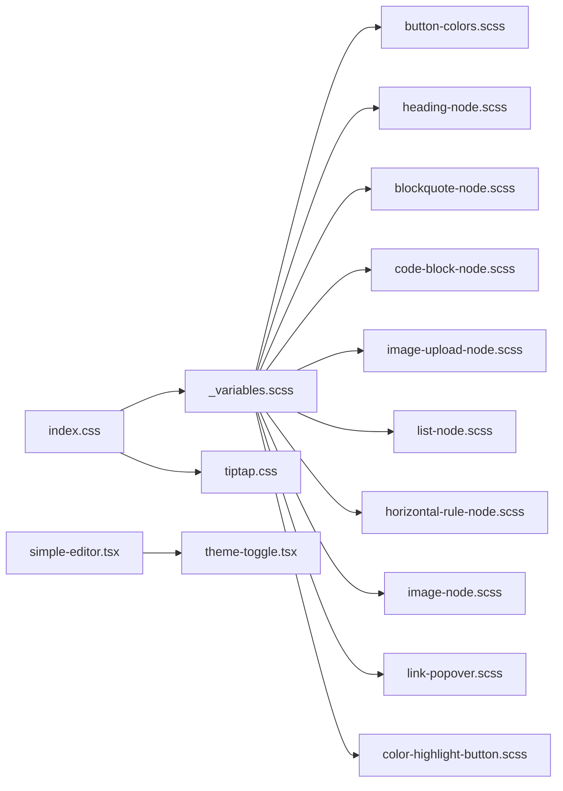

# 主题定制系统

<cite>
**本文引用的文件**   
- [src/styles/_variables.scss](file://src/styles/_variables.scss)
- [src/index.css](file://src/index.css)
- [src/components/tiptap-templates/simple/simple-editor.tsx](file://src/components/tiptap-templates/simple/simple-editor.tsx)
- [src/components/tiptap-templates/simple/theme-toggle.tsx](file://src/components/tiptap-templates/simple/theme-toggle.tsx)
- [src/components/tiptap-ui-primitive/button-colors.scss](file://src/components/tiptap-ui-primitive/button-colors.scss)
- [src/components/tiptap-ui-primitive/badge-colors.scss](file://src/components/tiptap-ui-primitive/badge-colors.scss)
- [src/components/tiptap-node/heading-node.scss](file://src/components/tiptap-node/heading-node.scss)
- [src/components/tiptap-node/blockquote-node.scss](file://src/components/tiptap-node/blockquote-node.scss)
- [src/components/tiptap-node/code-block-node.scss](file://src/components/tiptap-node/code-block-node.scss)
- [src/components/tiptap-node/image-upload-node.scss](file://src/components/tiptap-node/image-upload-node.scss)
- [src/components/tiptap-node/list-node.scss](file://src/components/tiptap-node/list-node.scss)
- [src/components/tiptap-node/horizontal-rule-node.scss](file://src/components/tiptap-node/horizontal-rule-node.scss)
- [src/components/tiptap-node/image-node.scss](file://src/components/tiptap-node/image-node.scss)
- [src/components/tiptap-ui/link-popover.scss](file://src/components/tiptap-ui/link-popover.scss)
- [src/components/tiptap-ui/color-highlight-button.scss](file://src/components/tiptap-ui/color-highlight-button.scss)
- [src/features/tiptap/tiptap.css](file://src/features/tiptap/tiptap.css)
- [src/hooks/use-is-breakpoint.ts](file://src/hooks/use-is-breakpoint.ts)
</cite>

## 目录
1. [简介](#简介)
2. [项目结构](#项目结构)
3. [核心组件](#核心组件)
4. [架构总览](#架构总览)
5. [详细组件分析](#详细组件分析)
6. [依赖关系分析](#依赖关系分析)
7. [性能考虑](#性能考虑)
8. [故障排查指南](#故障排查指南)
9. [结论](#结论)
10. [附录](#附录)

## 简介
本技术文档围绕富文本编辑器的主题定制系统，系统性阐述其架构设计与实现要点。内容涵盖：
- CSS 变量体系与设计令牌（颜色、字体、间距等）的组织方式
- 暗色模式切换机制与动态样式注入策略
- 样式隔离与覆盖原则，确保组件级可定制性
- 响应式适配与断点管理
- 品牌化定制方法与最佳实践

目标是帮助开发者快速理解并扩展编辑器主题，同时保证可维护性与一致性。

## 项目结构
主题相关代码主要分布在以下位置：
- 全局样式与变量定义：styles 目录与入口 CSS
- 编辑器模板与主题切换：tiptap-templates/simple
- 基础 UI 组件样式：tiptap-ui-primitive
- 节点与气泡菜单样式：tiptap-node、tiptap-ui
- 编辑器特性样式：features/tiptap
- 响应式断点 Hook：hooks

图表来源
- [src/index.css:1-200](file://src/index.css#L1-L200)
- [src/styles/_variables.scss:1-200](file://src/styles/_variables.scss#L1-L200)
- [src/components/tiptap-templates/simple/simple-editor.tsx:1-200](file://src/components/tiptap-templates/simple/simple-editor.tsx#L1-L200)
- [src/components/tiptap-templates/simple/theme-toggle.tsx:1-200](file://src/components/tiptap-templates/simple/theme-toggle.tsx#L1-L200)
- [src/components/tiptap-ui-primitive/button-colors.scss:1-200](file://src/components/tiptap-ui-primitive/button-colors.scss#L1-L200)
- [src/components/tiptap-node/heading-node.scss:1-200](file://src/components/tiptap-node/heading-node.scss#L1-L200)
- [src/components/tiptap-ui/link-popover.scss:1-200](file://src/components/tiptap-ui/link-popover.scss#L1-L200)
- [src/features/tiptap/tiptap.css:1-200](file://src/features/tiptap/tiptap.css#L1-L200)
- [src/hooks/use-is-breakpoint.ts:1-200](file://src/hooks/use-is-breakpoint.ts#L1-L200)

章节来源
- [src/index.css:1-200](file://src/index.css#L1-L200)
- [src/styles/_variables.scss:1-200](file://src/styles/_variables.scss#L1-L200)
- [src/components/tiptap-templates/simple/simple-editor.tsx:1-200](file://src/components/tiptap-templates/simple/simple-editor.tsx#L1-L200)
- [src/components/tiptap-templates/simple/theme-toggle.tsx:1-200](file://src/components/tiptap-templates/simple/theme-toggle.tsx#L1-L200)
- [src/components/tiptap-ui-primitive/button-colors.scss:1-200](file://src/components/tiptap-ui-primitive/button-colors.scss#L1-L200)
- [src/components/tiptap-node/heading-node.scss:1-200](file://src/components/tiptap-node/heading-node.scss#L1-L200)
- [src/components/tiptap-ui/link-popover.scss:1-200](file://src/components/tiptap-ui/link-popover.scss#L1-L200)
- [src/features/tiptap/tiptap.css:1-200](file://src/features/tiptap/tiptap.css#L1-L200)
- [src/hooks/use-is-breakpoint.ts:1-200](file://src/hooks/use-is-breakpoint.ts#L1-L200)

## 核心组件
- 设计令牌与变量层
  - 通过 SCSS 变量集中定义颜色、字体、间距等设计令牌，并在构建时映射为 CSS 自定义属性（CSS 变量），供全应用消费。
  - 建议按语义分组命名，如“背景”、“前景”、“强调”、“中性”、“状态”等，便于暗色模式与品牌化替换。
- 主题切换层
  - 在编辑器模板中提供主题切换控件，运行时根据用户选择切换根节点的类名或数据属性，从而触发不同的 CSS 变量值集合。
  - 支持持久化用户偏好（例如本地存储），并在初始化时恢复。
- 组件样式层
  - 基础 UI 组件与编辑器节点各自维护独立的样式文件，使用 CSS 变量进行着色与布局，避免硬编码颜色与尺寸。
  - 通过作用域化的类名与层级控制，确保组件样式隔离与可控覆盖。
- 响应式适配层
  - 使用断点 Hook 获取当前屏幕宽度，结合媒体查询与条件类名，实现不同尺寸下的布局与交互优化。

章节来源
- [src/styles/_variables.scss:1-200](file://src/styles/_variables.scss#L1-L200)
- [src/components/tiptap-templates/simple/theme-toggle.tsx:1-200](file://src/components/tiptap-templates/simple/theme-toggle.tsx#L1-L200)
- [src/components/tiptap-ui-primitive/button-colors.scss:1-200](file://src/components/tiptap-ui-primitive/button-colors.scss#L1-L200)
- [src/components/tiptap-node/heading-node.scss:1-200](file://src/components/tiptap-node/heading-node.scss#L1-L200)
- [src/hooks/use-is-breakpoint.ts:1-200](file://src/hooks/use-is-breakpoint.ts#L1-L200)

## 架构总览
主题系统的分层如下：
- 变量层：SCSS 变量 → CSS 变量（设计令牌）
- 主题层：根节点类名/数据属性 → 变量值集合（亮/暗/品牌）
- 组件层：各组件样式文件引用变量，形成可组合的视觉风格
- 运行时层：主题切换控件更新根节点状态，驱动变量重算与样式刷新
- 响应式层：断点 Hook + 媒体查询，适配多设备

图表来源
- [src/components/tiptap-templates/simple/theme-toggle.tsx:1-200](file://src/components/tiptap-templates/simple/theme-toggle.tsx#L1-L200)
- [src/components/tiptap-templates/simple/simple-editor.tsx:1-200](file://src/components/tiptap-templates/simple/simple-editor.tsx#L1-L200)
- [src/styles/_variables.scss:1-200](file://src/styles/_variables.scss#L1-L200)

## 详细组件分析

### 变量与令牌组织（_variables.scss）
- 职责
  - 集中定义设计令牌（颜色、字体、间距、阴影、圆角等）
  - 将 SCSS 变量导出为 CSS 变量，供运行时读取与覆盖
- 组织结构建议
  - 按用途分组：背景、前景、强调、中性、状态、边框、阴影、圆角、字号、行高、间距
  - 按主题分组：默认（亮）、暗色、品牌变体
- 复杂度与性能
  - 变量解析发生在编译期，运行期仅读取 CSS 变量，开销极低
  - 合理命名与分组有助于减少重复与冲突

章节来源
- [src/styles/_variables.scss:1-200](file://src/styles/_variables.scss#L1-L200)

### 主题切换实现（theme-toggle.tsx 与 simple-editor.tsx）
- 职责
  - 提供主题切换 UI
  - 在编辑器容器上设置/移除主题相关的类名或数据属性
- 关键流程
  - 监听用户操作
  - 更新根节点的状态标记
  - 持久化用户偏好（可选）
  - 触发浏览器样式重绘
- 注意事项
  - 避免频繁 DOM 操作，合并状态更新
  - 确保初始加载时正确恢复主题

图表来源
- [src/components/tiptap-templates/simple/theme-toggle.tsx:1-200](file://src/components/tiptap-templates/simple/theme-toggle.tsx#L1-L200)
- [src/components/tiptap-templates/simple/simple-editor.tsx:1-200](file://src/components/tiptap-templates/simple/simple-editor.tsx#L1-L200)

章节来源
- [src/components/tiptap-templates/simple/theme-toggle.tsx:1-200](file://src/components/tiptap-templates/simple/theme-toggle.tsx#L1-L200)
- [src/components/tiptap-templates/simple/simple-editor.tsx:1-200](file://src/components/tiptap-templates/simple/simple-editor.tsx#L1-L200)

### 基础 UI 组件样式（button-colors.scss、badge-colors.scss）
- 职责
  - 为按钮、徽章等基础组件提供基于变量的色彩方案
- 设计要点
  - 使用语义化变量名，避免直接写死颜色值
  - 区分默认态、悬停态、激活态、禁用态
  - 保持对比度符合无障碍标准
- 覆盖策略
  - 通过更高层级的 CSS 变量覆盖或组件级类名限定范围

章节来源
- [src/components/tiptap-ui-primitive/button-colors.scss:1-200](file://src/components/tiptap-ui-primitive/button-colors.scss#L1-L200)
- [src/components/tiptap-ui-primitive/badge-colors.scss:1-200](file://src/components/tiptap-ui-primitive/badge-colors.scss#L1-L200)

### 编辑器节点样式（heading-node.scss、blockquote-node.scss、code-block-node.scss、image-upload-node.scss、list-node.scss、horizontal-rule-node.scss、image-node.scss）
- 职责
  - 为各类节点提供排版、间距、背景、边框等样式
- 设计要点
  - 使用变量控制字号、行高、边距、背景与前景色
  - 针对暗色模式调整对比度与可读性
  - 图片上传节点需考虑占位、拖拽反馈与错误提示
- 覆盖策略
  - 通过节点专属类名与作用域限制，避免全局污染
  - 在品牌主题中统一替换变量即可实现整体风格变更

章节来源
- [src/components/tiptap-node/heading-node.scss:1-200](file://src/components/tiptap-node/heading-node.scss#L1-L200)
- [src/components/tiptap-node/blockquote-node.scss:1-200](file://src/components/tiptap-node/blockquote-node.scss#L1-L200)
- [src/components/tiptap-node/code-block-node.scss:1-200](file://src/components/tiptap-node/code-block-node.scss#L1-L200)
- [src/components/tiptap-node/image-upload-node.scss:1-200](file://src/components/tiptap-node/image-upload-node.scss#L1-L200)
- [src/components/tiptap-node/list-node.scss:1-200](file://src/components/tiptap-node/list-node.scss#L1-L200)
- [src/components/tiptap-node/horizontal-rule-node.scss:1-200](file://src/components/tiptap-node/horizontal-rule-node.scss#L1-L200)
- [src/components/tiptap-node/image-node.scss:1-200](file://src/components/tiptap-node/image-node.scss#L1-L200)

### 气泡与交互样式（link-popover.scss、color-highlight-button.scss）
- 职责
  - 为链接气泡、高亮按钮等交互元素提供定位、层级、动效与配色
- 设计要点
  - 使用 z-index 与容器边界检测，避免溢出与遮挡
  - 使用变量控制背景、边框、阴影与文字颜色
  - 关注键盘可达性与焦点样式
- 覆盖策略
  - 通过气泡容器类名限定样式作用域，避免影响其他弹出层

章节来源
- [src/components/tiptap-ui/link-popover.scss:1-200](file://src/components/tiptap-ui/link-popover.scss#L1-L200)
- [src/components/tiptap-ui/color-highlight-button.scss:1-200](file://src/components/tiptap-ui/color-highlight-button.scss#L1-L200)

### 编辑器特性样式（tiptap.css）
- 职责
  - 提供编辑器整体行为与外观的基础样式，包括滚动条、选区、工具栏等
- 设计要点
  - 尽量使用变量而非硬编码值
  - 与节点样式解耦，便于主题替换
- 覆盖策略
  - 在品牌主题中通过变量覆盖或新增规则实现差异化

章节来源
- [src/features/tiptap/tiptap.css:1-200](file://src/features/tiptap/tiptap.css#L1-L200)

### 响应式适配（use-is-breakpoint.ts）
- 职责
  - 提供断点判断能力，用于在不同屏幕尺寸下调整布局与交互
- 使用建议
  - 结合媒体查询与条件类名，最小化 JS 干预
  - 对复杂布局，可在 Hook 中缓存断点结果，减少重排

章节来源
- [src/hooks/use-is-breakpoint.ts:1-200](file://src/hooks/use-is-breakpoint.ts#L1-L200)

## 依赖关系分析
主题系统的关键依赖关系如下：
- index.css 引入全局样式与变量
- _variables.scss 作为变量源，被各组件样式消费
- simple-editor.tsx 与 theme-toggle.tsx 负责运行时主题切换
- tiptap.css 提供编辑器特性样式
- 各节点与 UI 组件样式文件依赖变量与基础样式

图表来源
- [src/index.css:1-200](file://src/index.css#L1-L200)
- [src/styles/_variables.scss:1-200](file://src/styles/_variables.scss#L1-L200)
- [src/components/tiptap-templates/simple/simple-editor.tsx:1-200](file://src/components/tiptap-templates/simple/simple-editor.tsx#L1-L200)
- [src/components/tiptap-templates/simple/theme-toggle.tsx:1-200](file://src/components/tiptap-templates/simple/theme-toggle.tsx#L1-L200)
- [src/components/tiptap-ui-primitive/button-colors.scss:1-200](file://src/components/tiptap-ui-primitive/button-colors.scss#L1-L200)
- [src/components/tiptap-node/heading-node.scss:1-200](file://src/components/tiptap-node/heading-node.scss#L1-L200)
- [src/components/tiptap-node/blockquote-node.scss:1-200](file://src/components/tiptap-node/blockquote-node.scss#L1-L200)
- [src/components/tiptap-node/code-block-node.scss:1-200](file://src/components/tiptap-node/code-block-node.scss#L1-L200)
- [src/components/tiptap-node/image-upload-node.scss:1-200](file://src/components/tiptap-node/image-upload-node.scss#L1-L200)
- [src/components/tiptap-node/list-node.scss:1-200](file://src/components/tiptap-node/list-node.scss#L1-L200)
- [src/components/tiptap-node/horizontal-rule-node.scss:1-200](file://src/components/tiptap-node/horizontal-rule-node.scss#L1-L200)
- [src/components/tiptap-node/image-node.scss:1-200](file://src/components/tiptap-node/image-node.scss#L1-L200)
- [src/components/tiptap-ui/link-popover.scss:1-200](file://src/components/tiptap-ui/link-popover.scss#L1-L200)
- [src/components/tiptap-ui/color-highlight-button.scss:1-200](file://src/components/tiptap-ui/color-highlight-button.scss#L1-L200)
- [src/features/tiptap/tiptap.css:1-200](file://src/features/tiptap/tiptap.css#L1-L200)

章节来源
- [src/index.css:1-200](file://src/index.css#L1-L200)
- [src/styles/_variables.scss:1-200](file://src/styles/_variables.scss#L1-L200)
- [src/components/tiptap-templates/simple/simple-editor.tsx:1-200](file://src/components/tiptap-templates/simple/simple-editor.tsx#L1-L200)
- [src/components/tiptap-templates/simple/theme-toggle.tsx:1-200](file://src/components/tiptap-templates/simple/theme-toggle.tsx#L1-L200)
- [src/components/tiptap-ui-primitive/button-colors.scss:1-200](file://src/components/tiptap-ui-primitive/button-colors.scss#L1-L200)
- [src/components/tiptap-node/heading-node.scss:1-200](file://src/components/tiptap-node/heading-node.scss#L1-L200)
- [src/components/tiptap-node/blockquote-node.scss:1-200](file://src/components/tiptap-node/blockquote-node.scss#L1-L200)
- [src/components/tiptap-node/code-block-node.scss:1-200](file://src/components/tiptap-node/code-block-node.scss#L1-L200)
- [src/components/tiptap-node/image-upload-node.scss:1-200](file://src/components/tiptap-node/image-upload-node.scss#L1-L200)
- [src/components/tiptap-node/list-node.scss:1-200](file://src/components/tiptap-node/list-node.scss#L1-L200)
- [src/components/tiptap-node/horizontal-rule-node.scss:1-200](file://src/components/tiptap-node/horizontal-rule-node.scss#L1-L200)
- [src/components/tiptap-node/image-node.scss:1-200](file://src/components/tiptap-node/image-node.scss#L1-L200)
- [src/components/tiptap-ui/link-popover.scss:1-200](file://src/components/tiptap-ui/link-popover.scss#L1-L200)
- [src/components/tiptap-ui/color-highlight-button.scss:1-200](file://src/components/tiptap-ui/color-highlight-button.scss#L1-L200)
- [src/features/tiptap/tiptap.css:1-200](file://src/features/tiptap/tiptap.css#L1-L200)

## 性能考虑
- 变量解析在编译期完成，运行期仅读取 CSS 变量，性能开销低
- 主题切换应尽量减少 DOM 操作次数，批量更新类名或数据属性
- 避免在高频事件中执行样式计算，必要时使用节流/防抖
- 合理使用媒体查询与条件类名，降低 JS 介入带来的重排重绘

## 故障排查指南
- 主题未生效
  - 检查根节点是否正确设置了主题类名或数据属性
  - 确认 CSS 变量是否已正确注入并被组件样式引用
- 颜色不一致
  - 核对组件样式是否使用了正确的变量名
  - 检查是否存在硬编码颜色覆盖了变量
- 暗色模式下对比度不足
  - 调整前景/背景变量，确保满足无障碍对比度要求
- 气泡或弹窗被遮挡
  - 检查 z-index 层级与容器边界检测逻辑
- 响应式布局异常
  - 验证断点 Hook 返回值与媒体查询阈值是否一致
  - 检查条件类名是否正确应用到目标节点

章节来源
- [src/components/tiptap-templates/simple/theme-toggle.tsx:1-200](file://src/components/tiptap-templates/simple/theme-toggle.tsx#L1-L200)
- [src/components/tiptap-ui/link-popover.scss:1-200](file://src/components/tiptap-ui/link-popover.scss#L1-L200)
- [src/hooks/use-is-breakpoint.ts:1-200](file://src/hooks/use-is-breakpoint.ts#L1-L200)

## 结论
本主题定制系统以 CSS 变量为核心，结合运行时主题切换与组件级样式隔离，实现了灵活且可维护的品牌化定制能力。通过合理的变量组织、清晰的覆盖策略与响应式适配，能够在多设备与多场景下保持一致的用户体验。建议在后续迭代中持续完善变量文档与示例主题，提升团队协作效率与主题开发体验。

## 附录
- 主题开发最佳实践
  - 使用语义化变量名，按用途与主题分组
  - 优先覆盖变量而非重写样式规则
  - 为每个主题提供完整的颜色与尺寸令牌集
  - 在暗色模式下重点校验对比度与可读性
  - 为气泡与弹窗提供边界检测与层级管理
  - 使用断点 Hook 与媒体查询协同实现响应式
  - 记录主题差异与兼容性说明，便于团队共享与维护