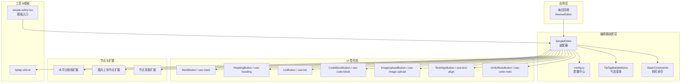
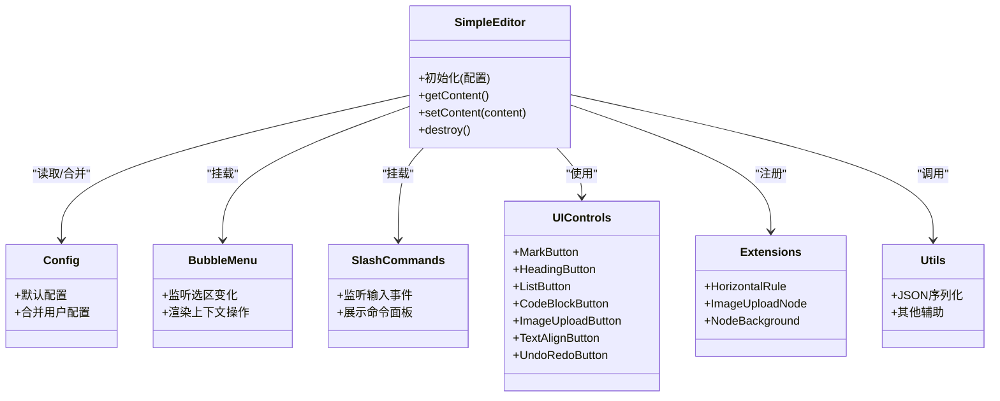
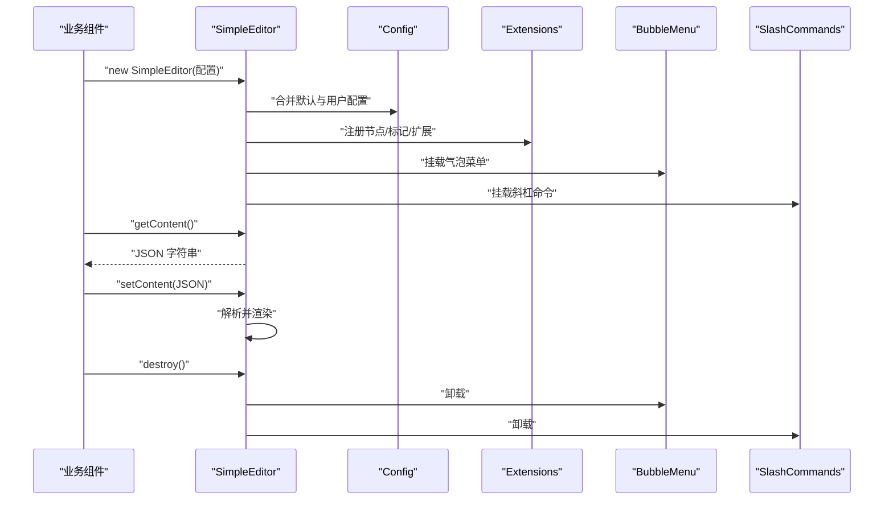
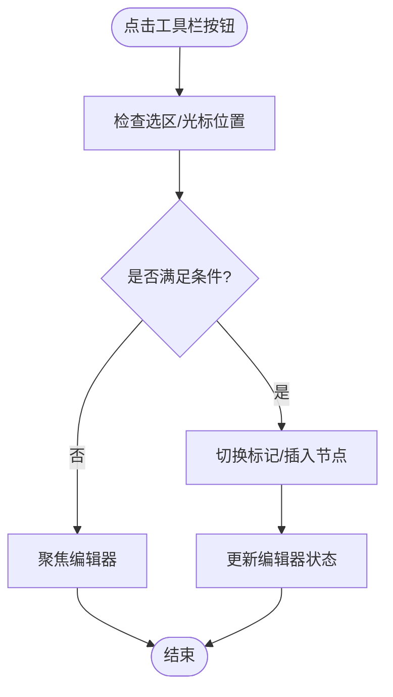
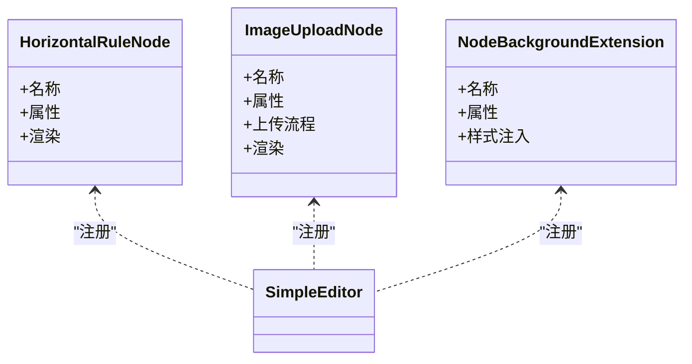
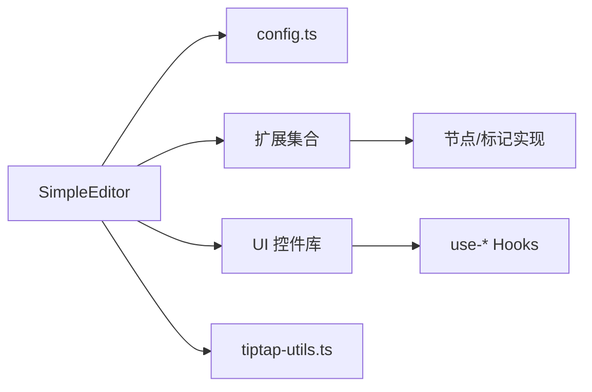

# 富文本编辑器

<cite>
**本文引用的文件**   
- [src/features/tiptap/SimpleEditor.tsx](file://src/features/tiptap/SimpleEditor.tsx)
- [src/features/tiptap/config.ts](file://src/features/tiptap/config.ts)
- [src/features/tiptap/TipTapBubbleMenu.tsx](file://src/features/tiptap/TipTapBubbleMenu.tsx)
- [src/features/tiptap/SlashCommands.ts](file://src/features/tiptap/SlashCommands.ts)
- [src/features/tiptap/SlashCommandsList.tsx](file://src/features/tiptap/SlashCommandsList.tsx)
- [src/hooks/use-tiptap-editor.ts](file://src/hooks/use-tiptap-editor.ts)
- [src/components/tiptap-templates/simple/simple-editor.tsx](file://src/components/tiptap-templates/simple/simple-editor.tsx)
- [src/components/tiptap-templates/simple/theme-toggle.tsx](file://src/components/tiptap-templates/simple/theme-toggle.tsx)
- [src/components/tiptap-ui/index.tsx](file://src/components/tiptap-ui/index.tsx)
- [src/components/tiptap-ui/mark-button.tsx](file://src/components/tiptap-ui/mark-button.tsx)
- [src/components/tiptap-ui/use-mark.ts](file://src/components/tiptap-ui/use-mark.ts)
- [src/components/tiptap-ui/heading-button.tsx](file://src/components/tiptap-ui/heading-button.tsx)
- [src/components/tiptap-ui/heading-dropdown-menu.tsx](file://src/components/tiptap-ui/heading-dropdown-menu.tsx)
- [src/components/tiptap-ui/use-heading.ts](file://src/components/tiptap-ui/use-heading.ts)
- [src/components/tiptap-ui/list-button.tsx](file://src/components/tiptap-ui/list-button.tsx)
- [src/components/tiptap-ui/list-dropdown-menu.tsx](file://src/components/tiptap-ui/list-dropdown-menu.tsx)
- [src/components/tiptap-ui/use-list.ts](file://src/components/tiptap-ui/use-list.ts)
- [src/components/tiptap-ui/code-block-button.tsx](file://src/components/tiptap-ui/code-block-button.tsx)
- [src/components/tiptap-ui/use-code-block.ts](file://src/components/tiptap-ui/use-code-block.ts)
- [src/components/tiptap-ui/image-upload-button.tsx](file://src/components/tiptap-ui/image-upload-button.tsx)
- [src/components/tiptap-ui/use-image-upload.ts](file://src/components/tiptap-ui/use-image-upload.ts)
- [src/components/tiptap-ui/text-align-button.tsx](file://src/components/tiptap-ui/text-align-button.tsx)
- [src/components/tiptap-ui/use-text-align.ts](file://src/components/tiptap-ui/use-text-align.ts)
- [src/components/tiptap-ui/undo-redo-button.tsx](file://src/components/tiptap-ui/undo-redo-button.tsx)
- [src/components/tiptap-ui/use-undo-redo.ts](file://src/components/tiptap-ui/use-undo-redo.ts)
- [src/components/tiptap-node/horizontal-rule-node-extension.ts](file://src/components/tiptap-node/horizontal-rule-node-extension.ts)
- [src/components/tiptap-node/image-upload-node-extension.ts](file://src/components/tiptap-node/image-upload-node-extension.ts)
- [src/components/tiptap-node/image-upload-node.tsx](file://src/components/tiptap-node/image-upload-node.tsx)
- [src/components/tiptap-extension/node-background-extension.ts](file://src/components/tiptap-extension/node-background-extension.ts)
- [src/lib/tiptap-utils.ts](file://src/lib/tiptap-utils.ts)
- [src/features/daily-review/ReviewEditor.tsx](file://src/features/daily-review/ReviewEditor.tsx)
</cite>

## 目录
1. [简介](#简介)
2. [项目结构](#项目结构)
3. [核心组件](#核心组件)
4. [架构总览](#架构总览)
5. [详细组件分析](#详细组件分析)
6. [依赖关系分析](#依赖关系分析)
7. [性能考虑](#性能考虑)
8. [故障排查指南](#故障排查指南)
9. [结论](#结论)
10. [附录](#附录)

## 简介
本技术文档围绕 FishWorker 的富文本编辑器系统，系统化梳理基于 TipTap 的编辑器架构与扩展机制。内容涵盖：
- 简单编辑器模板与集成模式
- 自定义节点与标记扩展
- UI 控件库与主题定制方案
- 基础编辑能力（文本、格式化、图片上传、代码块、列表等）
- 高级特性（状态管理、撤销重做、快捷键绑定、气泡菜单、斜杠命令）
- 配置项、样式定制与性能优化建议
- 实际扩展开发示例与集成方式

## 项目结构
编辑器相关代码主要分布在以下模块：
- features/tiptap：编辑器装配层，负责组合配置、插件、UI 与交互
- components/tiptap-*：可复用的 UI 控件、节点渲染与扩展实现
- hooks：编辑器生命周期与状态 Hook
- lib：通用工具函数（如 JSON 序列化等）
- features/daily-review：业务侧对编辑器的集成示例

图表来源
- [src/features/tiptap/SimpleEditor.tsx](file://src/features/tiptap/SimpleEditor.tsx)
- [src/features/tiptap/config.ts](file://src/features/tiptap/config.ts)
- [src/features/tiptap/TipTapBubbleMenu.tsx](file://src/features/tiptap/TipTapBubbleMenu.tsx)
- [src/features/tiptap/SlashCommands.ts](file://src/features/tiptap/SlashCommands.ts)
- [src/components/tiptap-ui/mark-button.tsx](file://src/components/tiptap-ui/mark-button.tsx)
- [src/components/tiptap-ui/heading-button.tsx](file://src/components/tiptap-ui/heading-button.tsx)
- [src/components/tiptap-ui/list-button.tsx](file://src/components/tiptap-ui/list-button.tsx)
- [src/components/tiptap-ui/code-block-button.tsx](file://src/components/tiptap-ui/code-block-button.tsx)
- [src/components/tiptap-ui/image-upload-button.tsx](file://src/components/tiptap-ui/image-upload-button.tsx)
- [src/components/tiptap-ui/text-align-button.tsx](file://src/components/tiptap-ui/text-align-button.tsx)
- [src/components/tiptap-ui/undo-redo-button.tsx](file://src/components/tiptap-ui/undo-redo-button.tsx)
- [src/components/tiptap-node/horizontal-rule-node-extension.ts](file://src/components/tiptap-node/horizontal-rule-node-extension.ts)
- [src/components/tiptap-node/image-upload-node-extension.ts](file://src/components/tiptap-node/image-upload-node-extension.ts)
- [src/components/tiptap-extension/node-background-extension.ts](file://src/components/tiptap-extension/node-background-extension.ts)
- [src/lib/tiptap-utils.ts](file://src/lib/tiptap-utils.ts)
- [src/components/tiptap-templates/simple/simple-editor.tsx](file://src/components/tiptap-templates/simple/simple-editor.tsx)

章节来源
- [src/features/tiptap/SimpleEditor.tsx](file://src/features/tiptap/SimpleEditor.tsx)
- [src/features/tiptap/config.ts](file://src/features/tiptap/config.ts)
- [src/components/tiptap-templates/simple/simple-editor.tsx](file://src/components/tiptap-templates/simple/simple-editor.tsx)

## 核心组件
- 装配器 SimpleEditor：集中注册扩展、配置工具栏、挂载气泡菜单与斜杠命令，统一暴露 API（获取/设置内容、销毁等）。
- 配置中心 config.ts：提供默认配置与可覆盖项，便于在不同场景快速组装不同能力的编辑器。
- 气泡菜单 TipTapBubbleMenu：在选区或特定节点上显示上下文操作（如链接、对齐、删除等）。
- 斜杠命令 SlashCommands：输入“/”触发命令面板，支持快速插入节点或执行动作。
- UI 控件库：以按钮 + Hook 的形式封装常用操作（加粗、标题、列表、代码块、图片上传、对齐、撤销重做），与编辑器实例解耦。
- 节点与扩展：水平分割线、图片上传节点、节点背景等扩展，增强编辑器表现力。
- 工具函数 tiptap-utils.ts：JSON 序列化/反序列化等辅助方法，保障数据一致性。

章节来源
- [src/features/tiptap/SimpleEditor.tsx](file://src/features/tiptap/SimpleEditor.tsx)
- [src/features/tiptap/config.ts](file://src/features/tiptap/config.ts)
- [src/features/tiptap/TipTapBubbleMenu.tsx](file://src/features/tiptap/TipTapBubbleMenu.tsx)
- [src/features/tiptap/SlashCommands.ts](file://src/features/tiptap/SlashCommands.ts)
- [src/components/tiptap-ui/index.tsx](file://src/components/tiptap-ui/index.tsx)
- [src/lib/tiptap-utils.ts](file://src/lib/tiptap-utils.ts)

## 架构总览
编辑器采用“装配器 + 扩展 + UI 控件 + 工具”的分层设计：
- 装配层负责组合所有扩展与 UI，对外暴露最小 API
- 扩展层通过 TipTap 的 Node/Mark/Extension 机制注入能力
- UI 层通过 Hook 与编辑器实例交互，保持无侵入
- 工具层提供跨组件共享的辅助逻辑

图表来源
- [src/features/tiptap/SimpleEditor.tsx](file://src/features/tiptap/SimpleEditor.tsx)
- [src/features/tiptap/config.ts](file://src/features/tiptap/config.ts)
- [src/features/tiptap/TipTapBubbleMenu.tsx](file://src/features/tiptap/TipTapBubbleMenu.tsx)
- [src/features/tiptap/SlashCommands.ts](file://src/features/tiptap/SlashCommands.ts)
- [src/components/tiptap-ui/index.tsx](file://src/components/tiptap-ui/index.tsx)
- [src/components/tiptap-node/horizontal-rule-node-extension.ts](file://src/components/tiptap-node/horizontal-rule-node-extension.ts)
- [src/components/tiptap-node/image-upload-node-extension.ts](file://src/components/tiptap-node/image-upload-node-extension.ts)
- [src/components/tiptap-extension/node-background-extension.ts](file://src/components/tiptap-extension/node-background-extension.ts)
- [src/lib/tiptap-utils.ts](file://src/lib/tiptap-utils.ts)

## 详细组件分析

### 装配器 SimpleEditor
- 职责：聚合配置、注册扩展、挂载气泡菜单与斜杠命令、暴露内容读写 API。
- 关键点：
  - 通过配置中心生成最终配置对象
  - 将 UI 控件与编辑器实例进行绑定（通过 Hook）
  - 处理编辑器生命周期（创建、更新、销毁）
  - 提供统一的 JSON 序列化接口

图表来源
- [src/features/tiptap/SimpleEditor.tsx](file://src/features/tiptap/SimpleEditor.tsx)
- [src/features/tiptap/config.ts](file://src/features/tiptap/config.ts)
- [src/features/tiptap/TipTapBubbleMenu.tsx](file://src/features/tiptap/TipTapBubbleMenu.tsx)
- [src/features/tiptap/SlashCommands.ts](file://src/features/tiptap/SlashCommands.ts)

章节来源
- [src/features/tiptap/SimpleEditor.tsx](file://src/features/tiptap/SimpleEditor.tsx)
- [src/features/tiptap/config.ts](file://src/features/tiptap/config.ts)

### 配置中心 config.ts
- 职责：定义默认配置项（如扩展开关、工具栏可见性、初始内容等），并提供合并策略。
- 使用方式：业务组件传入部分配置，装配器自动合并为最终配置。

章节来源
- [src/features/tiptap/config.ts](file://src/features/tiptap/config.ts)

### 气泡菜单 TipTapBubbleMenu
- 职责：根据当前选区或节点类型动态显示上下文操作（如链接、对齐、删除等）。
- 行为：监听选区变化，计算位置，渲染操作按钮。

章节来源
- [src/features/tiptap/TipTapBubbleMenu.tsx](file://src/features/tiptap/TipTapBubbleMenu.tsx)

### 斜杠命令 SlashCommands
- 职责：监听输入“/”，弹出命令面板，支持插入节点或执行动作。
- 交互：键盘导航、回车确认、ESC 关闭。

章节来源
- [src/features/tiptap/SlashCommands.ts](file://src/features/tiptap/SlashCommands.ts)
- [src/features/tiptap/SlashCommandsList.tsx](file://src/features/tiptap/SlashCommandsList.tsx)

### UI 控件库与 Hook
- Mark 类（加粗、斜体、下划线、删除线等）：
  - 按钮：mark-button.tsx
  - Hook：use-mark.ts
- 标题 Heading：
  - 按钮：heading-button.tsx
  - 下拉菜单：heading-dropdown-menu.tsx
  - Hook：use-heading.ts
- 列表 List：
  - 按钮：list-button.tsx
  - 下拉菜单：list-dropdown-menu.tsx
  - Hook：use-list.ts
- 代码块 Code Block：
  - 按钮：code-block-button.tsx
  - Hook：use-code-block.ts
- 图片上传 Image Upload：
  - 按钮：image-upload-button.tsx
  - Hook：use-image-upload.ts
- 文本对齐 Text Align：
  - 按钮：text-align-button.tsx
  - Hook：use-text-align.ts
- 撤销重做 Undo/Redo：
  - 按钮：undo-redo-button.tsx
  - Hook：use-undo-redo.ts

图表来源
- [src/components/tiptap-ui/mark-button.tsx](file://src/components/tiptap-ui/mark-button.tsx)
- [src/components/tiptap-ui/use-mark.ts](file://src/components/tiptap-ui/use-mark.ts)
- [src/components/tiptap-ui/heading-button.tsx](file://src/components/tiptap-ui/heading-button.tsx)
- [src/components/tiptap-ui/use-heading.ts](file://src/components/tiptap-ui/use-heading.ts)
- [src/components/tiptap-ui/list-button.tsx](file://src/components/tiptap-ui/list-button.tsx)
- [src/components/tiptap-ui/use-list.ts](file://src/components/tiptap-ui/use-list.ts)
- [src/components/tiptap-ui/code-block-button.tsx](file://src/components/tiptap-ui/code-block-button.tsx)
- [src/components/tiptap-ui/use-code-block.ts](file://src/components/tiptap-ui/use-code-block.ts)
- [src/components/tiptap-ui/image-upload-button.tsx](file://src/components/tiptap-ui/image-upload-button.tsx)
- [src/components/tiptap-ui/use-image-upload.ts](file://src/components/tiptap-ui/use-image-upload.ts)
- [src/components/tiptap-ui/text-align-button.tsx](file://src/components/tiptap-ui/text-align-button.tsx)
- [src/components/tiptap-ui/use-text-align.ts](file://src/components/tiptap-ui/use-text-align.ts)
- [src/components/tiptap-ui/undo-redo-button.tsx](file://src/components/tiptap-ui/undo-redo-button.tsx)
- [src/components/tiptap-ui/use-undo-redo.ts](file://src/components/tiptap-ui/use-undo-redo.ts)

章节来源
- [src/components/tiptap-ui/index.tsx](file://src/components/tiptap-ui/index.tsx)
- [src/components/tiptap-ui/mark-button.tsx](file://src/components/tiptap-ui/mark-button.tsx)
- [src/components/tiptap-ui/use-mark.ts](file://src/components/tiptap-ui/use-mark.ts)
- [src/components/tiptap-ui/heading-button.tsx](file://src/components/tiptap-ui/heading-button.tsx)
- [src/components/tiptap-ui/heading-dropdown-menu.tsx](file://src/components/tiptap-ui/heading-dropdown-menu.tsx)
- [src/components/tiptap-ui/use-heading.ts](file://src/components/tiptap-ui/use-heading.ts)
- [src/components/tiptap-ui/list-button.tsx](file://src/components/tiptap-ui/list-button.tsx)
- [src/components/tiptap-ui/list-dropdown-menu.tsx](file://src/components/tiptap-ui/list-dropdown-menu.tsx)
- [src/components/tiptap-ui/use-list.ts](file://src/components/tiptap-ui/use-list.ts)
- [src/components/tiptap-ui/code-block-button.tsx](file://src/components/tiptap-ui/code-block-button.tsx)
- [src/components/tiptap-ui/use-code-block.ts](file://src/components/tiptap-ui/use-code-block.ts)
- [src/components/tiptap-ui/image-upload-button.tsx](file://src/components/tiptap-ui/image-upload-button.tsx)
- [src/components/tiptap-ui/use-image-upload.ts](file://src/components/tiptap-ui/use-image-upload.ts)
- [src/components/tiptap-ui/text-align-button.tsx](file://src/components/tiptap-ui/text-align-button.tsx)
- [src/components/tiptap-ui/use-text-align.ts](file://src/components/tiptap-ui/use-text-align.ts)
- [src/components/tiptap-ui/undo-redo-button.tsx](file://src/components/tiptap-ui/undo-redo-button.tsx)
- [src/components/tiptap-ui/use-undo-redo.ts](file://src/components/tiptap-ui/use-undo-redo.ts)

### 节点与扩展
- 水平分割线扩展：提供分隔节点的插入与渲染。
- 图片上传节点扩展：支持选择本地图片后插入到编辑器中，包含预览与占位处理。
- 节点背景扩展：为任意节点添加背景样式能力。

图表来源
- [src/components/tiptap-node/horizontal-rule-node-extension.ts](file://src/components/tiptap-node/horizontal-rule-node-extension.ts)
- [src/components/tiptap-node/image-upload-node-extension.ts](file://src/components/tiptap-node/image-upload-node-extension.ts)
- [src/components/tiptap-node/image-upload-node.tsx](file://src/components/tiptap-node/image-upload-node.tsx)
- [src/components/tiptap-extension/node-background-extension.ts](file://src/components/tiptap-extension/node-background-extension.ts)

章节来源
- [src/components/tiptap-node/horizontal-rule-node-extension.ts](file://src/components/tiptap-node/horizontal-rule-node-extension.ts)
- [src/components/tiptap-node/image-upload-node-extension.ts](file://src/components/tiptap-node/image-upload-node-extension.ts)
- [src/components/tiptap-node/image-upload-node.tsx](file://src/components/tiptap-node/image-upload-node.tsx)
- [src/components/tiptap-extension/node-background-extension.ts](file://src/components/tiptap-extension/node-background-extension.ts)

### 工具函数 tiptap-utils.ts
- 提供 JSON 序列化/反序列化工具，确保编辑器内容与外部存储格式一致。
- 被装配器用于 getContent/setContent 的数据转换。

章节来源
- [src/lib/tiptap-utils.ts](file://src/lib/tiptap-utils.ts)

### 简单编辑器模板与主题切换
- 模板入口 simple-editor.tsx：演示如何快速集成 SimpleEditor。
- 主题切换 theme-toggle.tsx：提供明暗主题切换能力，配合全局样式变量生效。

章节来源
- [src/components/tiptap-templates/simple/simple-editor.tsx](file://src/components/tiptap-templates/simple/simple-editor.tsx)
- [src/components/tiptap-templates/simple/theme-toggle.tsx](file://src/components/tiptap-templates/simple/theme-toggle.tsx)

### 业务集成示例：每日回顾 ReviewEditor
- 展示如何在业务页面中引入 SimpleEditor，并绑定保存/加载逻辑。
- 结合 store/service 完成持久化。

章节来源
- [src/features/daily-review/ReviewEditor.tsx](file://src/features/daily-review/ReviewEditor.tsx)

## 依赖关系分析
- 装配器依赖配置中心与各类扩展/UI 控件
- UI 控件通过 Hook 与编辑器实例交互，避免直接耦合
- 节点扩展独立于 UI，仅关注数据模型与渲染
- 工具函数被多处复用，降低重复逻辑

图表来源
- [src/features/tiptap/SimpleEditor.tsx](file://src/features/tiptap/SimpleEditor.tsx)
- [src/features/tiptap/config.ts](file://src/features/tiptap/config.ts)
- [src/components/tiptap-ui/index.tsx](file://src/components/tiptap-ui/index.tsx)
- [src/lib/tiptap-utils.ts](file://src/lib/tiptap-utils.ts)

章节来源
- [src/features/tiptap/SimpleEditor.tsx](file://src/features/tiptap/SimpleEditor.tsx)
- [src/components/tiptap-ui/index.tsx](file://src/components/tiptap-ui/index.tsx)
- [src/lib/tiptap-utils.ts](file://src/lib/tiptap-utils.ts)

## 性能考虑
- 按需启用扩展：仅在需要时开启图片上传、代码块等扩展，减少初始化开销。
- 懒加载 UI 控件：对不常用的工具按钮进行延迟渲染，降低首屏压力。
- 控制气泡菜单与斜杠命令的触发频率：节流/防抖处理高频事件。
- 大文档渲染优化：分页/虚拟滚动（若后续引入）；避免一次性渲染过多复杂节点。
- 序列化与反序列化：使用高效 JSON 工具，避免不必要的深拷贝。

[本节为通用指导，无需源码引用]

## 故障排查指南
- 内容无法保存/加载：
  - 检查 getContent/setContent 使用的 JSON 格式是否与 tiptap-utils 保持一致
  - 确认外部存储的编码与长度限制
- 图片上传失败：
  - 检查 use-image-upload Hook 中的回调是否正确触发
  - 确认网络权限与后端接口可用性
- 气泡菜单不出现：
  - 检查选区是否存在，以及 TipTapBubbleMenu 的挂载时机
- 斜杠命令无效：
  - 确认输入事件监听是否被其他组件拦截
  - 检查命令列表是否按预期注册

章节来源
- [src/lib/tiptap-utils.ts](file://src/lib/tiptap-utils.ts)
- [src/components/tiptap-ui/use-image-upload.ts](file://src/components/tiptap-ui/use-image-upload.ts)
- [src/features/tiptap/TipTapBubbleMenu.tsx](file://src/features/tiptap/TipTapBubbleMenu.tsx)
- [src/features/tiptap/SlashCommands.ts](file://src/features/tiptap/SlashCommands.ts)

## 结论
FishWorker 的富文本编辑器以 TipTap 为核心，通过装配器统一编排扩展与 UI，形成高内聚、低耦合的可插拔架构。借助 UI 控件库与 Hook，开发者可以便捷地扩展功能；通过配置中心与工具函数，保证一致性与可维护性。建议在业务集成中遵循最小可用原则，按需启用能力，并结合性能优化策略提升用户体验。

[本节为总结性内容，无需源码引用]

## 附录

### 编辑器配置选项（示例）
- 启用/禁用扩展：如图片上传、代码块、列表、对齐等
- 工具栏可见性：控制各按钮显示
- 初始内容：支持从 JSON 或 HTML 初始化
- 主题：明/暗主题切换
- 国际化：多语言文案（若后续扩展）

章节来源
- [src/features/tiptap/config.ts](file://src/features/tiptap/config.ts)

### 样式定制指南
- 使用 CSS 变量覆盖主题色、字号、行高等
- 针对节点扩展（如图片上传、水平分割线）编写独立样式文件
- 通过主题切换组件联动全局样式变量

章节来源
- [src/components/tiptap-templates/simple/theme-toggle.tsx](file://src/components/tiptap-templates/simple/theme-toggle.tsx)
- [src/components/tiptap-node/horizontal-rule-node-extension.ts](file://src/components/tiptap-node/horizontal-rule-node-extension.ts)
- [src/components/tiptap-node/image-upload-node-extension.ts](file://src/components/tiptap-node/image-upload-node-extension.ts)

### 扩展开发示例（步骤）
- 自定义节点：
  - 新建节点扩展文件，定义名称、属性、渲染逻辑
  - 在装配器中注册该节点
  - 如需 UI 操作，新增对应按钮与 Hook
- 自定义标记：
  - 新建标记扩展文件，定义名称、属性、样式
  - 在装配器中注册该标记
  - 提供对应的标记按钮与 Hook
- 扩展现有功能：
  - 在配置中心增加开关项
  - 在装配器中根据开关决定是否注册扩展
  - 在 UI 控件中增加相应按钮与交互

章节来源
- [src/components/tiptap-node/horizontal-rule-node-extension.ts](file://src/components/tiptap-node/horizontal-rule-node-extension.ts)
- [src/components/tiptap-node/image-upload-node-extension.ts](file://src/components/tiptap-node/image-upload-node-extension.ts)
- [src/components/tiptap-extension/node-background-extension.ts](file://src/components/tiptap-extension/node-background-extension.ts)
- [src/features/tiptap/config.ts](file://src/features/tiptap/config.ts)
- [src/features/tiptap/SimpleEditor.tsx](file://src/features/tiptap/SimpleEditor.tsx)