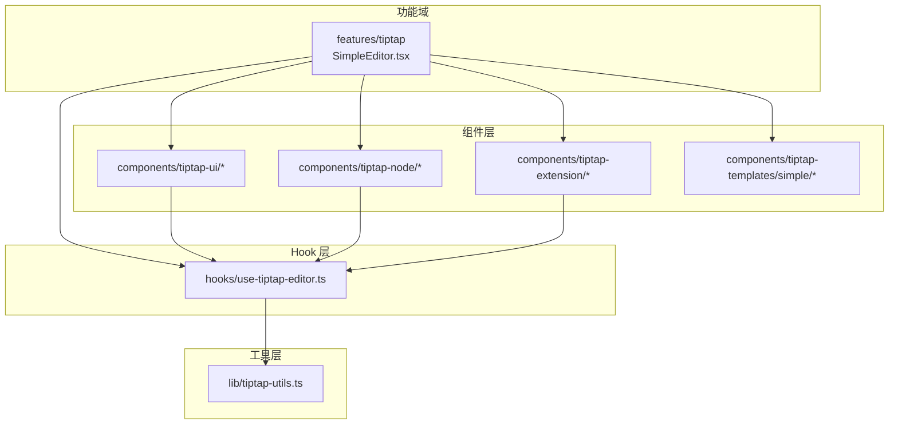
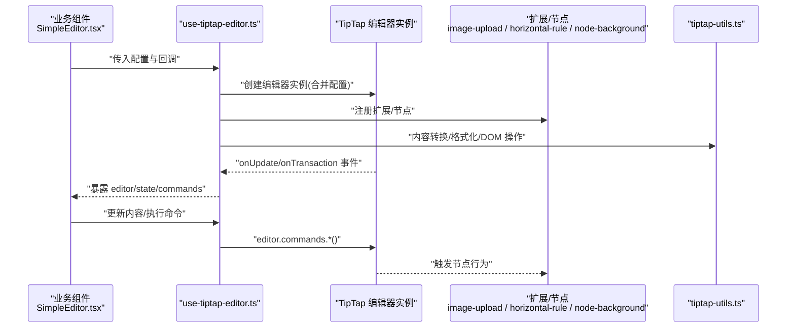
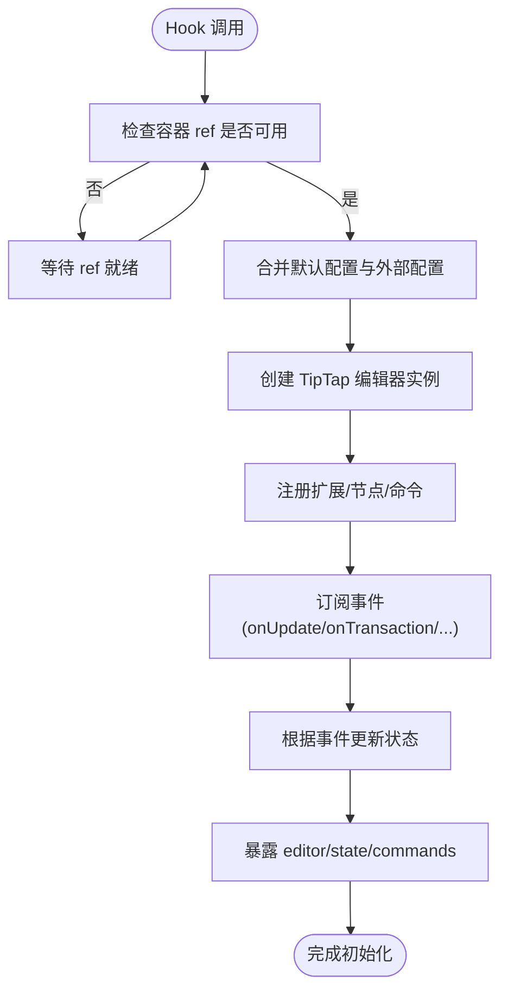
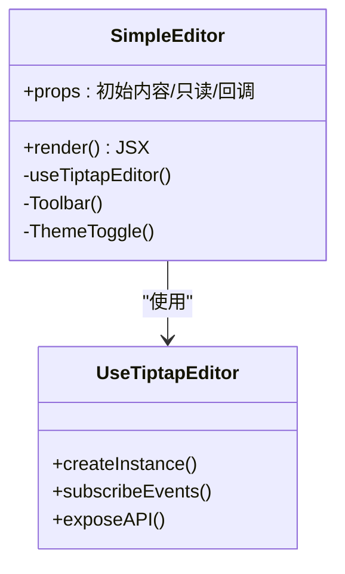
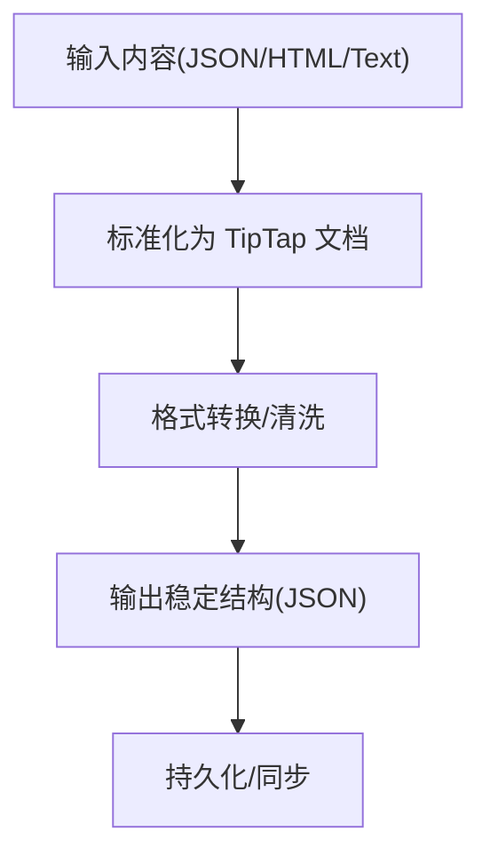
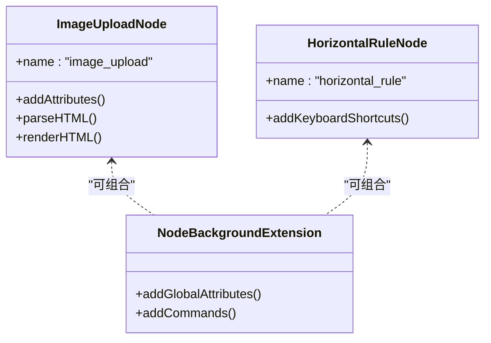
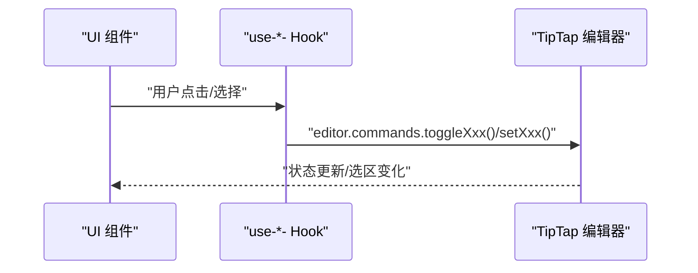
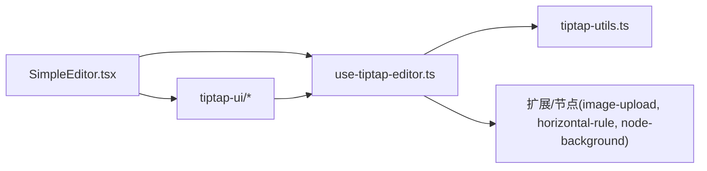

# 编辑器核心架构

<cite>
**本文引用的文件**   
- [use-tiptap-editor.ts](file://src/hooks/use-tiptap-editor.ts)
- [SimpleEditor.tsx](file://src/features/tiptap/SimpleEditor.tsx)
- [config.ts](file://src/features/tiptap/config.ts)
- [tiptap-utils.ts](file://src/lib/tiptap-utils.ts)
- [simple-editor.tsx](file://src/components/tiptap-templates/simple/simple-editor.tsx)
- [index.tsx](file://src/components/tiptap-ui/index.tsx)
- [use-heading.ts](file://src/components/tiptap-ui/use-heading.ts)
- [use-list.ts](file://src/components/tiptap-ui/use-list.ts)
- [use-link-popover.ts](file://src/components/tiptap-ui/use-link-popover.ts)
- [image-upload-node-extension.ts](file://src/components/tiptap-node/image-upload-node-extension.ts)
- [horizontal-rule-node-extension.ts](file://src/components/tiptap-node/horizontal-rule-node-extension.ts)
- [node-background-extension.ts](file://src/components/tiptap-extension/node-background-extension.ts)
</cite>

## 目录
1. [简介](#简介)
2. [项目结构](#项目结构)
3. [核心组件](#核心组件)
4. [架构总览](#架构总览)
5. [详细组件分析](#详细组件分析)
6. [依赖关系分析](#依赖关系分析)
7. [性能考量](#性能考量)
8. [故障排查指南](#故障排查指南)
9. [结论](#结论)
10. [附录](#附录)

## 简介
本技术文档聚焦于富文本编辑器的核心架构，围绕基于 TipTap 的初始化配置、编辑器实例管理、状态同步机制展开。重点解析 use-tiptap-editor Hook 的实现原理（生命周期管理、事件监听、内容变更处理），并说明简单编辑器模板的封装思路与可复用组件设计。同时，对编辑器工具函数库（内容转换、格式处理、DOM 操作）进行文档化，并提供配置选项说明与最佳实践建议。

## 项目结构
本项目采用“功能域 + 通用能力”的分层组织方式：
- features/tiptap：业务侧的编辑器组合与页面集成（如 SimpleEditor）
- components/tiptap-*：TipTap 扩展、节点、UI 控件与模板
- hooks：跨组件复用的逻辑封装（含 use-tiptap-editor）
- lib：通用工具与引擎（含 tiptap-utils）

图表来源
- [SimpleEditor.tsx:1-200](file://src/features/tiptap/SimpleEditor.tsx#L1-L200)
- [use-tiptap-editor.ts:1-200](file://src/hooks/use-tiptap-editor.ts#L1-L200)
- [tiptap-utils.ts:1-200](file://src/lib/tiptap-utils.ts#L1-L200)
- [index.tsx:1-200](file://src/components/tiptap-ui/index.tsx#L1-L200)
- [image-upload-node-extension.ts:1-200](file://src/components/tiptap-node/image-upload-node-extension.ts#L1-L200)
- [horizontal-rule-node-extension.ts:1-200](file://src/components/tiptap-node/horizontal-rule-node-extension.ts#L1-L200)
- [node-background-extension.ts:1-200](file://src/components/tiptap-extension/node-background-extension.ts#L1-L200)
- [simple-editor.tsx:1-200](file://src/components/tiptap-templates/simple/simple-editor.tsx#L1-L200)

章节来源
- [SimpleEditor.tsx:1-200](file://src/features/tiptap/SimpleEditor.tsx#L1-L200)
- [use-tiptap-editor.ts:1-200](file://src/hooks/use-tiptap-editor.ts#L1-L200)
- [tiptap-utils.ts:1-200](file://src/lib/tiptap-utils.ts#L1-L200)
- [index.tsx:1-200](file://src/components/tiptap-ui/index.tsx#L1-L200)
- [image-upload-node-extension.ts:1-200](file://src/components/tiptap-node/image-upload-node-extension.ts#L1-L200)
- [horizontal-rule-node-extension.ts:1-200](file://src/components/tiptap-node/horizontal-rule-node-extension.ts#L1-L200)
- [node-background-extension.ts:1-200](file://src/components/tiptap-extension/node-background-extension.ts#L1-L200)
- [simple-editor.tsx:1-200](file://src/components/tiptap-templates/simple/simple-editor.tsx#L1-L200)

## 核心组件
- use-tiptap-editor Hook：负责 TipTap 编辑器实例的创建、销毁、配置注入、事件订阅与内容同步。
- SimpleEditor 组件：在业务层聚合基础节点/标记、工具栏与气泡菜单，提供开箱即用的编辑器体验。
- 工具函数库 tiptap-utils：提供内容转换、格式处理、DOM 操作等通用方法，供 Hook 与 UI 组件复用。
- 模板 simple-editor：封装一套最小可用的编辑器界面与主题切换，便于快速集成。

章节来源
- [use-tiptap-editor.ts:1-200](file://src/hooks/use-tiptap-editor.ts#L1-L200)
- [SimpleEditor.tsx:1-200](file://src/features/tiptap/SimpleEditor.tsx#L1-L200)
- [tiptap-utils.ts:1-200](file://src/lib/tiptap-utils.ts#L1-L200)
- [simple-editor.tsx:1-200](file://src/components/tiptap-templates/simple/simple-editor.tsx#L1-L200)

## 架构总览
下图展示了从业务组件到 Hook、再到 TipTap 实例与扩展/节点的调用关系，以及工具函数的支撑作用。

图表来源
- [SimpleEditor.tsx:1-200](file://src/features/tiptap/SimpleEditor.tsx#L1-L200)
- [use-tiptap-editor.ts:1-200](file://src/hooks/use-tiptap-editor.ts#L1-L200)
- [tiptap-utils.ts:1-200](file://src/lib/tiptap-utils.ts#L1-L200)
- [image-upload-node-extension.ts:1-200](file://src/components/tiptap-node/image-upload-node-extension.ts#L1-L200)
- [horizontal-rule-node-extension.ts:1-200](file://src/components/tiptap-node/horizontal-rule-node-extension.ts#L1-L200)
- [node-background-extension.ts:1-200](file://src/components/tiptap-extension/node-background-extension.ts#L1-L200)

## 详细组件分析

### use-tiptap-editor Hook 实现原理
职责边界
- 生命周期管理：在组件挂载时创建编辑器实例，卸载时安全销毁，避免内存泄漏。
- 配置注入：将默认配置与外部传入的配置合并，支持动态更新。
- 事件监听：订阅 onUpdate、onTransaction、onFocus、onBlur 等关键事件，驱动上层状态同步。
- 内容变更处理：统一拦截内容变化，结合工具函数进行清洗、转换或持久化准备。
- API 暴露：向调用方返回 editor 实例、当前状态与常用命令集合，便于 UI 控制。

关键流程
- 初始化阶段：校验容器引用、构建扩展列表、合并配置、创建实例。
- 运行阶段：事件回调中更新 React 状态，保持视图与编辑器内部状态一致。
- 清理阶段：移除事件监听、销毁编辑器实例、释放资源。

图表来源
- [use-tiptap-editor.ts:1-200](file://src/hooks/use-tiptap-editor.ts#L1-L200)

章节来源
- [use-tiptap-editor.ts:1-200](file://src/hooks/use-tiptap-editor.ts#L1-L200)

### 简单编辑器模板（simple-editor）
设计目标
- 以最小成本提供可复用的编辑器外壳：包含基础工具栏、主题切换、占位内容与样式隔离。
- 通过 props 暴露可定制项（如初始内容、只读模式、禁用项、回调）。
- 内部复用 use-tiptap-editor Hook 与 tiptap-ui 控件，降低业务接入复杂度。

交互要点
- 主题切换：通过上下文或状态驱动样式变量与图标主题。
- 内容初始化：支持 JSON/HTML 字符串等多种输入形式，内部统一转换为 TipTap 文档。
- 事件透传：将编辑器的 onReady、onChange、onFocus、onBlur 等事件向上抛出。

图表来源
- [simple-editor.tsx:1-200](file://src/components/tiptap-templates/simple/simple-editor.tsx#L1-L200)
- [use-tiptap-editor.ts:1-200](file://src/hooks/use-tiptap-editor.ts#L1-L200)

章节来源
- [simple-editor.tsx:1-200](file://src/components/tiptap-templates/simple/simple-editor.tsx#L1-L200)

### 编辑器工具函数库（tiptap-utils）
能力范围
- 内容转换：JSON ↔ HTML ↔ 纯文本；清洗不安全的标签与属性。
- 格式处理：批量应用/撤销格式、规范化段落与列表结构。
- DOM 操作：定位光标、插入节点、替换选区内容、获取选中范围信息。
- 辅助方法：判断节点类型、计算选区长度、生成唯一 ID 等。

典型用法
- 在 Hook 的 onChange 回调中调用转换函数，确保落盘数据一致性。
- 在 UI 按钮点击事件中调用命令式方法，触发编辑器内部变更。

图表来源
- [tiptap-utils.ts:1-200](file://src/lib/tiptap-utils.ts#L1-L200)

章节来源
- [tiptap-utils.ts:1-200](file://src/lib/tiptap-utils.ts#L1-L200)

### 扩展与节点（示例）
- 图片上传节点：扩展图像节点，增加本地上传、预览与错误处理。
- 水平分割线节点：自定义渲染与快捷键插入。
- 节点背景扩展：为任意节点添加背景色能力，配合 UI 选择器联动。

图表来源
- [image-upload-node-extension.ts:1-200](file://src/components/tiptap-node/image-upload-node-extension.ts#L1-L200)
- [horizontal-rule-node-extension.ts:1-200](file://src/components/tiptap-node/horizontal-rule-node-extension.ts#L1-L200)
- [node-background-extension.ts:1-200](file://src/components/tiptap-extension/node-background-extension.ts#L1-L200)

章节来源
- [image-upload-node-extension.ts:1-200](file://src/components/tiptap-node/image-upload-node-extension.ts#L1-L200)
- [horizontal-rule-node-extension.ts:1-200](file://src/components/tiptap-node/horizontal-rule-node-extension.ts#L1-L200)
- [node-background-extension.ts:1-200](file://src/components/tiptap-extension/node-background-extension.ts#L1-L200)

### UI 控件与命令 Hook（示例）
- 标题下拉菜单：use-heading 提供标题级别切换与激活态判断。
- 列表下拉菜单：use-list 提供有序/无序列表切换与嵌套控制。
- 链接气泡：use-link-popover 管理链接插入、编辑与跳转。
- 工具栏入口：index.tsx 汇总导出常用按钮与 Popover 组件。

图表来源
- [use-heading.ts:1-200](file://src/components/tiptap-ui/use-heading.ts#L1-L200)
- [use-list.ts:1-200](file://src/components/tiptap-ui/use-list.ts#L1-L200)
- [use-link-popover.ts:1-200](file://src/components/tiptap-ui/use-link-popover.ts#L1-L200)
- [index.tsx:1-200](file://src/components/tiptap-ui/index.tsx#L1-L200)

章节来源
- [use-heading.ts:1-200](file://src/components/tiptap-ui/use-heading.ts#L1-L200)
- [use-list.ts:1-200](file://src/components/tiptap-ui/use-list.ts#L1-L200)
- [use-link-popover.ts:1-200](file://src/components/tiptap-ui/use-link-popover.ts#L1-L200)
- [index.tsx:1-200](file://src/components/tiptap-ui/index.tsx#L1-L200)

## 依赖关系分析
- 低耦合：Hook 屏蔽 TipTap 细节，UI 仅依赖暴露的命令与状态。
- 高内聚：工具函数集中处理格式与 DOM 操作，减少重复逻辑。
- 可扩展：扩展与节点通过 Hook 注册，新增能力无需改动主流程。

图表来源
- [SimpleEditor.tsx:1-200](file://src/features/tiptap/SimpleEditor.tsx#L1-L200)
- [use-tiptap-editor.ts:1-200](file://src/hooks/use-tiptap-editor.ts#L1-L200)
- [tiptap-utils.ts:1-200](file://src/lib/tiptap-utils.ts#L1-L200)
- [image-upload-node-extension.ts:1-200](file://src/components/tiptap-node/image-upload-node-extension.ts#L1-L200)
- [horizontal-rule-node-extension.ts:1-200](file://src/components/tiptap-node/horizontal-rule-node-extension.ts#L1-L200)
- [node-background-extension.ts:1-200](file://src/components/tiptap-extension/node-background-extension.ts#L1-L200)
- [index.tsx:1-200](file://src/components/tiptap-ui/index.tsx#L1-L200)

章节来源
- [SimpleEditor.tsx:1-200](file://src/features/tiptap/SimpleEditor.tsx#L1-L200)
- [use-tiptap-editor.ts:1-200](file://src/hooks/use-tiptap-editor.ts#L1-L200)
- [tiptap-utils.ts:1-200](file://src/lib/tiptap-utils.ts#L1-L200)
- [index.tsx:1-200](file://src/components/tiptap-ui/index.tsx#L1-L200)

## 性能考量
- 延迟初始化：仅在容器 ref 可用后创建编辑器实例，避免无效渲染。
- 事件节流：对高频事件（如滚动、输入）做节流/防抖，降低重排压力。
- 增量更新：利用 TipTap 的 transaction 事件，精准更新受影响的局部状态。
- 资源回收：组件卸载时销毁实例并清理事件监听，防止内存泄漏。
- 大文档优化：分页加载、懒渲染长列表与图片，必要时引入虚拟滚动。

[本节为通用指导，不涉及具体文件分析]

## 故障排查指南
常见问题与定位步骤
- 编辑器未渲染：检查容器 ref 是否正确传递与更新；确认 Hook 是否在有效 DOM 上创建实例。
- 内容不同步：核对 onChange/onUpdate 回调是否被正确订阅；确认工具函数转换逻辑是否与期望一致。
- 扩展未生效：确认扩展已在 Hook 初始化阶段注册；检查 addAttributes/addCommands 是否冲突。
- 图片上传失败：查看上传节点的错误分支与重试策略；确认网络与权限设置。
- 键盘快捷键失效：检查全局快捷键与编辑器内部快捷键是否存在覆盖。

章节来源
- [use-tiptap-editor.ts:1-200](file://src/hooks/use-tiptap-editor.ts#L1-L200)
- [tiptap-utils.ts:1-200](file://src/lib/tiptap-utils.ts#L1-L200)
- [image-upload-node-extension.ts:1-200](file://src/components/tiptap-node/image-upload-node-extension.ts#L1-L200)

## 结论
通过 use-tiptap-editor Hook 抽象编辑器生命周期与状态同步，结合 tiptap-utils 工具函数与模块化扩展/节点，项目实现了高内聚、低耦合且易于扩展的富文本编辑器核心架构。简单编辑器模板进一步降低了接入成本，使业务能快速获得一致的编辑体验。

[本节为总结性内容，不涉及具体文件分析]

## 附录

### 编辑器配置选项说明（概览）
- 基础配置
  - content：初始内容（JSON/HTML/Text）
  - editable：是否只读
  - autofocus：是否自动聚焦
  - placeholder：占位提示
- 扩展与节点
  - extensions：数组，按需启用/禁用扩展
  - nodes：自定义节点映射
  - marks：自定义标记
- 事件与回调
  - onCreate/onReady：实例创建完成
  - onUpdate/onTransaction：内容变更
  - onFocus/onBlur：焦点变化
  - onDestroy：销毁前钩子
- 工具函数
  - transformInput：输入内容预处理
  - sanitizeOutput：输出内容清洗
  - domHelpers：DOM 操作辅助

章节来源
- [config.ts:1-200](file://src/features/tiptap/config.ts#L1-L200)
- [use-tiptap-editor.ts:1-200](file://src/hooks/use-tiptap-editor.ts#L1-L200)
- [tiptap-utils.ts:1-200](file://src/lib/tiptap-utils.ts#L1-L200)

### 最佳实践指南
- 将编辑器实例与 UI 解耦：通过 Hook 暴露命令与状态，UI 仅消费接口。
- 统一内容格式：在 Hook 的变更回调中统一转换与清洗，保证落盘一致性。
- 渐进增强：先启用必要扩展，再按需叠加复杂能力，降低维护成本。
- 可测试性：为工具函数编写单测；对 Hook 的行为通过 Mock 编辑器实例验证。
- 可访问性：为所有工具按钮提供 aria-label 与键盘导航支持。

[本节为通用指导，不涉及具体文件分析]