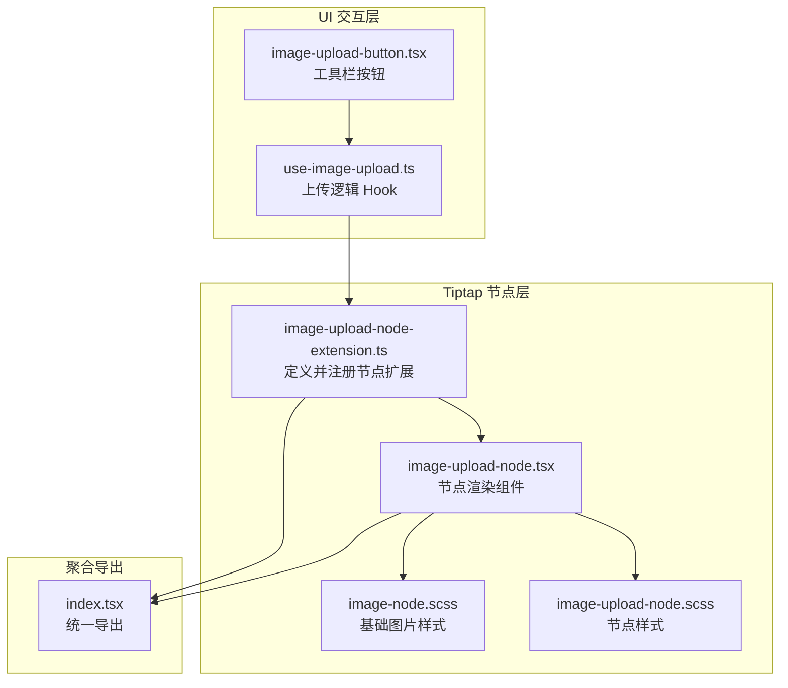
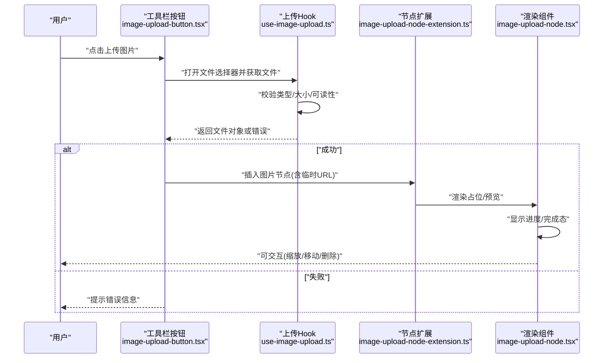
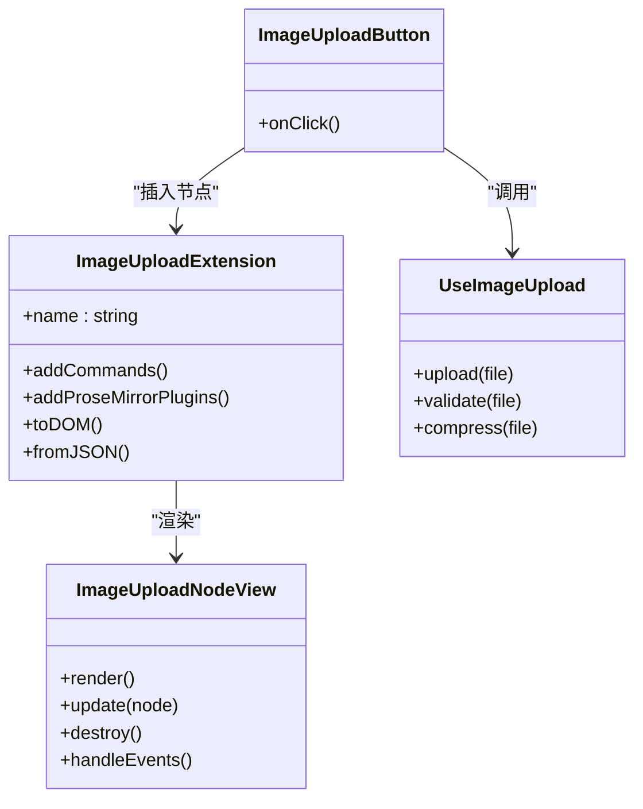

# 图片上传节点

<cite>
**本文引用的文件**   
- [image-upload-node-extension.ts](file://src/components/tiptap-node/image-upload-node-extension.ts)
- [image-upload-node.tsx](file://src/components/tiptap-node/image-upload-node.tsx)
- [image-upload-node.scss](file://src/components/tiptap-node/image-upload-node.scss)
- [image-node.scss](file://src/components/tiptap-node/image-node.scss)
- [use-image-upload.ts](file://src/components/tiptap-ui/use-image-upload.ts)
- [image-upload-button.tsx](file://src/components/tiptap-ui/image-upload-button.tsx)
- [index.tsx](file://src/components/tiptap-node/index.tsx)
</cite>

## 目录
1. [简介](#简介)
2. [项目结构](#项目结构)
3. [核心组件](#核心组件)
4. [架构总览](#架构总览)
5. [详细组件分析](#详细组件分析)
6. [依赖关系分析](#依赖关系分析)
7. [性能与存储策略](#性能与存储策略)
8. [自定义配置与样式定制](#自定义配置与样式定制)
9. [集成示例](#集成示例)
10. [故障排查指南](#故障排查指南)
11. [结论](#结论)

## 简介
本文件为“图片上传节点”的完整技术文档，覆盖以下能力：
- 文件选择、拖拽上传、预览显示、尺寸调整
- 扩展实现细节：文件验证、进度显示、错误处理
- 渲染组件：多格式支持（JPEG/PNG/GIF/WEBP/SVG）、操作（缩放、移动、删除）
- 数据模型与存储策略：本地缓存机制与性能优化
- 自定义配置项与样式定制方法
- 集成示例与常见问题解决方案

## 项目结构
图片上传功能位于 Tiptap 编辑器生态中，围绕“节点扩展 + 渲染组件 + UI 交互 + 工具 Hook”组织。关键位置如下：
- 节点扩展定义与注册：src/components/tiptap-node/image-upload-node-extension.ts
- 节点渲染组件：src/components/tiptap-node/image-upload-node.tsx
- 节点样式：src/components/tiptap-node/image-upload-node.scss
- 基础图片节点样式：src/components/tiptap-node/image-node.scss
- 上传交互 Hook：src/components/tiptap-ui/use-image-upload.ts
- 工具栏按钮：src/components/tiptap-ui/image-upload-button.tsx
- 节点索引与导出：src/components/tiptap-node/index.tsx

图示来源
- [image-upload-node-extension.ts](file://src/components/tiptap-node/image-upload-node-extension.ts)
- [image-upload-node.tsx](file://src/components/tiptap-node/image-upload-node.tsx)
- [image-upload-node.scss](file://src/components/tiptap-node/image-upload-node.scss)
- [image-node.scss](file://src/components/tiptap-node/image-node.scss)
- [use-image-upload.ts](file://src/components/tiptap-ui/use-image-upload.ts)
- [image-upload-button.tsx](file://src/components/tiptap-ui/image-upload-button.tsx)
- [index.tsx](file://src/components/tiptap-node/index.tsx)

章节来源
- [image-upload-node-extension.ts](file://src/components/tiptap-node/image-upload-node-extension.ts)
- [image-upload-node.tsx](file://src/components/tiptap-node/image-upload-node.tsx)
- [image-upload-node.scss](file://src/components/tiptap-node/image-upload-node.scss)
- [image-node.scss](file://src/components/tiptap-node/image-node.scss)
- [use-image-upload.ts](file://src/components/tiptap-ui/use-image-upload.ts)
- [image-upload-button.tsx](file://src/components/tiptap-ui/image-upload-button.tsx)
- [index.tsx](file://src/components/tiptap-node/index.tsx)

## 核心组件
- 节点扩展（Extension）
  - 职责：声明节点 schema、解析/序列化 JSON、提供拖拽插入能力、与编辑器命令集成。
  - 关键点：在创建时注入拖拽处理器；在 toDOM/fromJSON 中映射到渲染组件所需的数据结构。
- 渲染组件（Node View）
  - 职责：负责图片预览、占位、加载状态、错误态、用户交互（缩放、移动、删除）。
  - 关键点：监听 DOM 事件（点击、拖拽、滚轮缩放等），通过命令更新编辑器内容。
- 上传 Hook
  - 职责：封装文件选择、校验、读取、压缩/转码、进度回调、错误上报。
  - 关键点：返回统一的 Promise/回调接口，供按钮或拖拽流程调用。
- 工具栏按钮
  - 职责：触发文件选择对话框，调用上传 Hook，成功后插入节点。
- 样式
  - 职责：节点容器、图片占位、选中态、拖拽高亮、响应式布局。

章节来源
- [image-upload-node-extension.ts](file://src/components/tiptap-node/image-upload-node-extension.ts)
- [image-upload-node.tsx](file://src/components/tiptap-node/image-upload-node.tsx)
- [use-image-upload.ts](file://src/components/tiptap-ui/use-image-upload.ts)
- [image-upload-button.tsx](file://src/components/tiptap-ui/image-upload-button.tsx)
- [image-upload-node.scss](file://src/components/tiptap-node/image-upload-node.scss)
- [image-node.scss](file://src/components/tiptap-node/image-node.scss)

## 架构总览
下图展示从用户操作到编辑器内容更新的端到端流程。

图示来源
- [image-upload-button.tsx](file://src/components/tiptap-ui/image-upload-button.tsx)
- [use-image-upload.ts](file://src/components/tiptap-ui/use-image-upload.ts)
- [image-upload-node-extension.ts](file://src/components/tiptap-node/image-upload-node-extension.ts)
- [image-upload-node.tsx](file://src/components/tiptap-node/image-upload-node.tsx)

## 详细组件分析

### 节点扩展（image-upload-node-extension.ts）
- 设计要点
  - 定义节点名称、schema（包含 src、alt、width、height、status、progress 等字段）。
  - 提供 toDOM 将数据映射为 DOM 结构，fromJSON 将 JSON 还原为节点。
  - 在 create() 中注册拖拽处理器，允许从外部拖入图片文件直接插入。
  - 暴露命令以编程方式插入图片节点。
- 数据结构建议
  - src: string（本地 URL 或远程地址）
  - alt: string（替代文本）
  - width/height: number（像素值）
  - status: "idle" | "loading" | "success" | "error"
  - progress: number（0-100）
  - error: string（可选，错误描述）
- 复杂度
  - 插入/更新操作 O(1)，序列化/反序列化 O(n)（n 为属性数量）。
- 错误处理
  - 对非法 JSON 进行容错回退；对缺失必填字段设置默认值。

章节来源
- [image-upload-node-extension.ts](file://src/components/tiptap-node/image-upload-node-extension.ts)

### 渲染组件（image-upload-node.tsx）
- 渲染职责
  - 根据 status 显示不同态：占位、加载中（进度条）、成功（图片预览）、错误（重试/删除）。
  - 支持交互：点击选中、拖拽移动、滚轮/手柄缩放、键盘删除。
- 事件绑定
  - 使用 onMount/onUnmount 生命周期管理事件监听与清理。
  - 通过命令更新节点属性（如宽高、状态、进度）。
- 多格式支持
  - 浏览器原生  标签自动兼容 JPEG/PNG/GIF/WEBP/SVG。
  - 针对 GIF 动画，避免不必要的重绘；SVG 注意 viewBox 与缩放一致性。
- 性能
  - 懒加载：仅在可见区域加载大图（IntersectionObserver）。
  - 防抖/节流：缩放与拖拽更新时合并多次变更。
  - 内存释放：组件卸载时撤销 URL.createObjectURL 引用。

章节来源
- [image-upload-node.tsx](file://src/components/tiptap-node/image-upload-node.tsx)
- [image-upload-node.scss](file://src/components/tiptap-node/image-upload-node.scss)
- [image-node.scss](file://src/components/tiptap-node/image-node.scss)

### 上传 Hook（use-image-upload.ts）
- 能力清单
  - 文件选择：支持 input[type=file] 与剪贴板粘贴。
  - 文件校验：类型白名单、大小上限、最小/最大边长限制。
  - 读取与预览：FileReader 生成 dataURL 或 URL.createObjectURL。
  - 压缩/转码：Canvas 压缩、GIF 帧数控制、WEBP 优先策略（可选）。
  - 进度上报：onProgress(percent)、onSuccess(fileInfo)、onError(message)。
  - 错误处理：网络/权限/解码异常的统一捕获与提示。
- 返回值
  - 提供 upload(file): Promise<{url, info}> 或回调风格 API。
- 复杂度
  - 压缩与转码取决于图像尺寸与算法，通常为 O(w*h)。

章节来源
- [use-image-upload.ts](file://src/components/tiptap-ui/use-image-upload.ts)

### 工具栏按钮（image-upload-button.tsx）
- 行为
  - 点击触发文件选择，调用上传 Hook，成功后通过扩展命令插入节点。
  - 支持禁用态与 Tooltip 提示。
- 集成点
  - 与编辑器实例解耦，通过 props 注入命令与上下文。

章节来源
- [image-upload-button.tsx](file://src/components/tiptap-ui/image-upload-button.tsx)

### 节点索引与导出（index.tsx）
- 作用
  - 统一导出节点扩展与渲染组件，便于上层按需引入。
- 约定
  - 命名导出扩展名、默认导出扩展实例。

章节来源
- [index.tsx](file://src/components/tiptap-node/index.tsx)

## 依赖关系分析

图示来源
- [image-upload-node-extension.ts](file://src/components/tiptap-node/image-upload-node-extension.ts)
- [image-upload-node.tsx](file://src/components/tiptap-node/image-upload-node.tsx)
- [use-image-upload.ts](file://src/components/tiptap-ui/use-image-upload.ts)
- [image-upload-button.tsx](file://src/components/tiptap-ui/image-upload-button.tsx)

章节来源
- [image-upload-node-extension.ts](file://src/components/tiptap-node/image-upload-node-extension.ts)
- [image-upload-node.tsx](file://src/components/tiptap-node/image-upload-node.tsx)
- [use-image-upload.ts](file://src/components/tiptap-ui/use-image-upload.ts)
- [image-upload-button.tsx](file://src/components/tiptap-ui/image-upload-button.tsx)

## 性能与存储策略
- 本地缓存
  - 使用 IndexedDB 缓存已上传成功的图片二进制或缩略图，键由文件指纹（文件名+大小+修改时间）生成。
  - 命中缓存时直接复用 URL，减少重复压缩与上传。
- 内存管理
  - 及时 revokeObjectURL，避免内存泄漏。
  - 大图片分块加载与懒加载，结合 IntersectionObserver 仅加载可视区域。
- 计算优化
  - 压缩参数按目标尺寸动态计算，避免过度压缩导致质量损失。
  - 对 GIF 做帧率/尺寸降采样，降低动画体积。
- 网络优化
  - 断点续传与并发限制（可选）。
  - 失败重试与指数退避。

[本节为通用指导，不直接分析具体文件]

## 自定义配置与样式定制
- 扩展配置项（建议）
  - maxSize: number（字节）
  - allowedTypes: string[]（MIME 白名单）
  - maxWidth/maxHeight: number（像素）
  - compressQuality: number（0-1）
  - preferWebp: boolean
  - enableDragDrop: boolean
  - enableResize: boolean
  - enableMove: boolean
  - enableDelete: boolean
  - placeholderText: string
  - onError: (msg) => void
  - onProgress: (percent) => void
- 样式定制
  - 覆盖节点容器类名，调整边框、阴影、圆角。
  - 自定义选中态、拖拽高亮、进度条样式。
  - 适配暗色主题与高对比度模式。

章节来源
- [image-upload-node-extension.ts](file://src/components/tiptap-node/image-upload-node-extension.ts)
- [image-upload-node.scss](file://src/components/tiptap-node/image-upload-node.scss)
- [image-node.scss](file://src/components/tiptap-node/image-node.scss)

## 集成示例
- 基本集成
  - 在编辑器初始化时注册图片上传节点扩展。
  - 在工具栏添加“上传图片”按钮，绑定点击事件。
- 高级用法
  - 启用拖拽插入：从桌面拖入图片文件直接插入。
  - 启用剪贴板粘贴：Ctrl/Cmd+V 粘贴截图自动插入。
  - 自定义上传策略：替换 Hook 中的上传函数，接入后端服务。
- 典型流程
  - 选择文件 → 校验 → 压缩/转码 → 上传 → 插入节点 → 渲染预览。

章节来源
- [image-upload-button.tsx](file://src/components/tiptap-ui/image-upload-button.tsx)
- [use-image-upload.ts](file://src/components/tiptap-ui/use-image-upload.ts)
- [image-upload-node-extension.ts](file://src/components/tiptap-node/image-upload-node-extension.ts)
- [image-upload-node.tsx](file://src/components/tiptap-node/image-upload-node.tsx)

## 故障排查指南
- 无法选择文件
  - 检查 input[type=file] 是否被遮挡或禁用。
  - 确认 MIME 白名单包含所选类型。
- 上传失败
  - 查看 onProgress/onError 回调输出，定位是网络还是服务端错误。
  - 检查文件大小是否超过 maxSize。
- 预览不显示
  - 确认 src 是否为有效 URL 或 dataURL。
  - 检查 CORS 与跨域资源访问策略。
- 性能问题
  - 大图未压缩导致卡顿，调整 compressQuality 与目标尺寸。
  - 大量图片同时加载导致内存占用过高，启用懒加载与缓存。
- 交互异常
  - 缩放/移动无效：确认事件绑定未被其他组件拦截。
  - 删除后仍显示：检查命令执行与视图同步。

章节来源
- [use-image-upload.ts](file://src/components/tiptap-ui/use-image-upload.ts)
- [image-upload-node.tsx](file://src/components/tiptap-node/image-upload-node.tsx)

## 结论
图片上传节点通过“扩展 + 渲染 + Hook + 按钮”的分层设计，实现了完整的文件选择、拖拽上传、预览与编辑体验。借助本地缓存、懒加载与压缩策略，兼顾了可用性与性能。通过灵活的配置与样式定制，可快速适配不同业务场景与品牌风格。