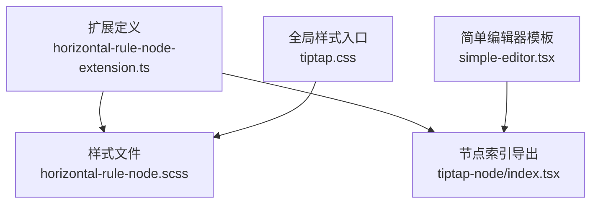
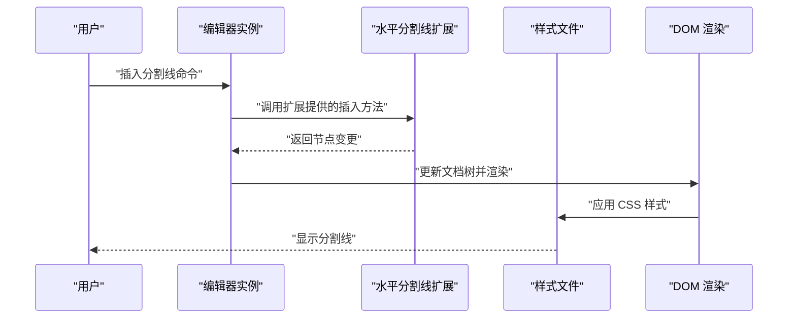
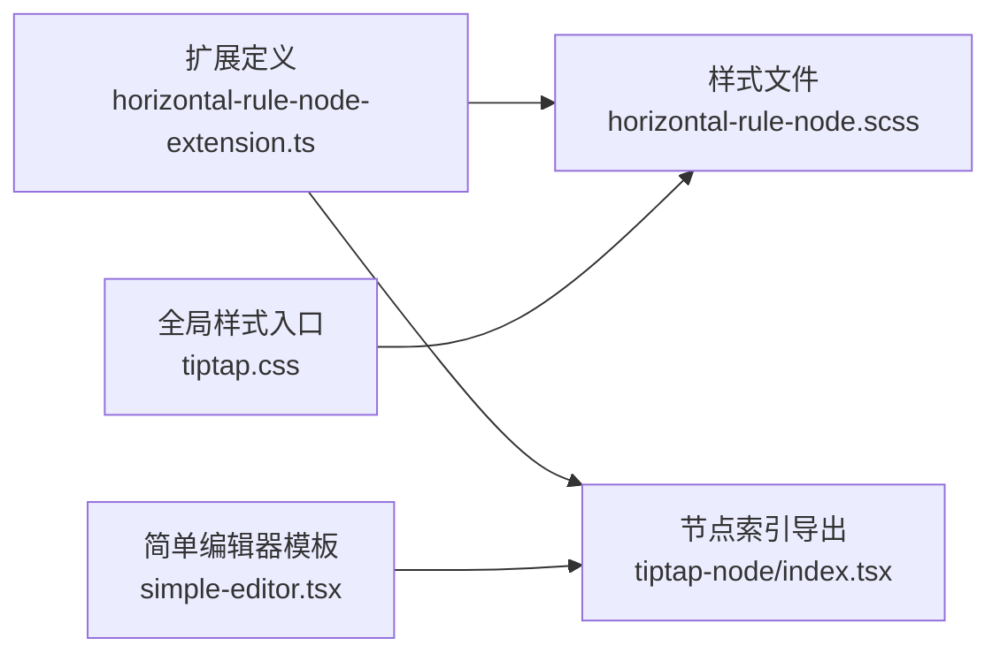

# 水平分割线节点

<cite>
**本文引用的文件**   
- [horizontal-rule-node-extension.ts](file://src/components/tiptap-node/horizontal-rule-node-extension.ts)
- [horizontal-rule-node.scss](file://src/components/tiptap-node/horizontal-rule-node.scss)
- [index.tsx](file://src/components/tiptap-node/index.tsx)
- [tiptap.css](file://src/features/tiptap/tiptap.css)
- [simple-editor.tsx](file://src/components/tiptap-templates/simple/simple-editor.tsx)
</cite>

## 目录
1. [简介](#简介)
2. [项目结构](#项目结构)
3. [核心组件](#核心组件)
4. [架构总览](#架构总览)
5. [详细组件分析](#详细组件分析)
6. [依赖分析](#依赖分析)
7. [性能考虑](#性能考虑)
8. [故障排查指南](#故障排查指南)
9. [结论](#结论)
10. [附录](#附录)

## 简介
本文件为“水平分割线节点”的技术文档，聚焦于该节点在编辑器中的定义、渲染与样式设计，覆盖可配置属性（颜色、粗细、样式等）、交互行为（插入、选择、删除）、序列化/反序列化机制、主题适配与响应式策略，并提供使用示例及与其他节点的协作模式。

## 项目结构
水平分割线节点的实现位于 Tiptap 扩展层与样式层：
- 扩展定义与注册：位于 tiptap-node 目录下的扩展文件
- 样式定义：对应 SCSS 文件
- 编辑器模板集成：简单编辑器模板中引入并使用该节点
- 全局样式注入：通过主样式文件统一注入

图表来源
- [horizontal-rule-node-extension.ts](file://src/components/tiptap-node/horizontal-rule-node-extension.ts)
- [horizontal-rule-node.scss](file://src/components/tiptap-node/horizontal-rule-node.scss)
- [index.tsx](file://src/components/tiptap-node/index.tsx)
- [simple-editor.tsx](file://src/components/tiptap-templates/simple/simple-editor.tsx)
- [tiptap.css](file://src/features/tiptap/tiptap.css)

章节来源
- [horizontal-rule-node-extension.ts](file://src/components/tiptap-node/horizontal-rule-node-extension.ts)
- [horizontal-rule-node.scss](file://src/components/tiptap-node/horizontal-rule-node.scss)
- [index.tsx](file://src/components/tiptap-node/index.tsx)
- [simple-editor.tsx](file://src/components/tiptap-templates/simple/simple-editor.tsx)
- [tiptap.css](file://src/features/tiptap/tiptap.css)

## 核心组件
- 扩展定义与注册：负责将“水平分割线”作为 Tiptap 块级节点加入编辑器，提供默认选项与序列化规则。
- 样式文件：控制分割线的视觉呈现（颜色、粗细、边距、对齐等）。
- 编辑器集成：在简单编辑器模板中启用并演示插入分割线。
- 全局样式：确保分割线在不同主题下保持一致的显示效果。

章节来源
- [horizontal-rule-node-extension.ts](file://src/components/tiptap-node/horizontal-rule-node-extension.ts)
- [horizontal-rule-node.scss](file://src/components/tiptap-node/horizontal-rule-node.scss)
- [simple-editor.tsx](file://src/components/tiptap-templates/simple/simple-editor.tsx)
- [tiptap.css](file://src/features/tiptap/tiptap.css)

## 架构总览
下图展示了从编辑器到节点渲染的关键路径：编辑器初始化时加载扩展，扩展注册节点类型；用户触发插入操作后，编辑器生成对应的 DOM 元素并由样式文件驱动外观。

图表来源
- [horizontal-rule-node-extension.ts](file://src/components/tiptap-node/horizontal-rule-node-extension.ts)
- [horizontal-rule-node.scss](file://src/components/tiptap-node/horizontal-rule-node.scss)
- [simple-editor.tsx](file://src/components/tiptap-templates/simple/simple-editor.tsx)

## 详细组件分析

### 扩展定义与注册
- 职责
  - 声明节点名称与类型
  - 提供默认选项（如颜色、粗细、样式）
  - 定义序列化/反序列化逻辑，保证 JSON 数据持久化一致
  - 可选：提供键盘或菜单交互支持
- 关键点
  - 节点应为块级元素，避免与文本流冲突
  - 序列化键名需稳定，便于跨版本迁移
  - 默认值应兼容常见主题色板

章节来源
- [horizontal-rule-node-extension.ts](file://src/components/tiptap-node/horizontal-rule-node-extension.ts)
- [index.tsx](file://src/components/tiptap-node/index.tsx)

### 渲染与样式设计
- 目标
  - 清晰区分内容区块
  - 与主题系统联动（明暗主题、品牌色）
  - 响应式适配（不同屏幕宽度下的间距与粗细）
- 实现要点
  - 使用 CSS 变量或主题类名控制颜色与粗细
  - 合理设置上下外边距，避免与相邻段落拥挤
  - 提供多种样式变体（实线、虚线、渐变等）

章节来源
- [horizontal-rule-node.scss](file://src/components/tiptap-node/horizontal-rule-node.scss)
- [tiptap.css](file://src/features/tiptap/tiptap.css)

### 可配置属性
- 颜色
  - 支持主题色、自定义十六进制或 HSL 值
  - 建议通过 CSS 变量注入，便于切换主题
- 粗细
  - 以像素为单位，推荐默认值与最小/最大限制
- 样式
  - 实线、虚线、点线、双线等
  - 圆角端点（可选）
- 对齐与间距
  - 居中/左对齐/右对齐
  - 左右内边距与上下外边距
- 响应式
  - 在小屏设备上自动调整粗细与间距

章节来源
- [horizontal-rule-node.scss](file://src/components/tiptap-node/horizontal-rule-node.scss)
- [tiptap.css](file://src/features/tiptap/tiptap.css)

### 交互行为（插入、选择、删除）
- 插入
  - 通过工具栏按钮或快捷键插入
  - 插入后光标定位至下一行，便于继续编辑
- 选择
  - 点击分割线区域选中节点，显示气泡菜单（可选）
  - 支持键盘方向键在节点间移动
- 删除
  - Backspace/Delete 删除当前分割线
  - 合并相邻段落时保持布局一致性

章节来源
- [horizontal-rule-node-extension.ts](file://src/components/tiptap-node/horizontal-rule-node-extension.ts)
- [simple-editor.tsx](file://src/components/tiptap-templates/simple/simple-editor.tsx)

### 序列化与反序列化
- 序列化
  - 将节点转换为稳定的 JSON 结构，包含类型标识与所有可配置属性
- 反序列化
  - 读取 JSON 并重建节点，缺失字段时使用默认值
- 兼容性
  - 保留向后兼容的字段映射
  - 对非法值进行回退处理

章节来源
- [horizontal-rule-node-extension.ts](file://src/components/tiptap-node/horizontal-rule-node-extension.ts)

### 主题适配与响应式设计
- 主题适配
  - 基于 CSS 变量或主题类名动态切换颜色与粗细
  - 在深色模式下提高对比度
- 响应式
  - 使用媒体查询调整间距与粗细
  - 在大屏上提供更丰富的样式变体

章节来源
- [horizontal-rule-node.scss](file://src/components/tiptap-node/horizontal-rule-node.scss)
- [tiptap.css](file://src/features/tiptap/tiptap.css)

### 使用示例与协作模式
- 基本用法
  - 在简单编辑器模板中启用分割线节点
  - 通过工具栏或快捷键插入
- 与其他节点协作
  - 与段落、标题、列表、引用块组合使用，提升可读性
  - 在长文档中作为章节分隔符

章节来源
- [simple-editor.tsx](file://src/components/tiptap-templates/simple/simple-editor.tsx)

## 依赖分析
- 内部依赖
  - 扩展文件依赖样式文件以完成视觉呈现
  - 编辑器模板依赖扩展的导出接口以启用功能
- 外部依赖
  - 基于 Tiptap 的节点扩展体系
  - 浏览器 CSS 渲染引擎

图表来源
- [horizontal-rule-node-extension.ts](file://src/components/tiptap-node/horizontal-rule-node-extension.ts)
- [horizontal-rule-node.scss](file://src/components/tiptap-node/horizontal-rule-node.scss)
- [index.tsx](file://src/components/tiptap-node/index.tsx)
- [simple-editor.tsx](file://src/components/tiptap-templates/simple/simple-editor.tsx)
- [tiptap.css](file://src/features/tiptap/tiptap.css)

章节来源
- [horizontal-rule-node-extension.ts](file://src/components/tiptap-node/horizontal-rule-node-extension.ts)
- [horizontal-rule-node.scss](file://src/components/tiptap-node/horizontal-rule-node.scss)
- [index.tsx](file://src/components/tiptap-node/index.tsx)
- [simple-editor.tsx](file://src/components/tiptap-templates/simple/simple-editor.tsx)
- [tiptap.css](file://src/features/tiptap/tiptap.css)

## 性能考虑
- 渲染开销
  - 分割线为轻量 DOM 元素，影响较小
  - 避免在频繁重排场景中进行复杂计算
- 样式优化
  - 使用 CSS 变量减少重复计算
  - 合理使用 will-change 与 transform 提升动画性能（如需）
- 序列化效率
  - 仅序列化必要字段，避免冗余数据

[本节为通用指导，不直接分析具体文件]

## 故障排查指南
- 常见问题
  - 分割线未显示：检查样式是否被覆盖或未被加载
  - 颜色异常：确认主题变量是否正确注入
  - 插入失败：验证扩展是否已正确注册
- 调试步骤
  - 打开开发者工具查看 DOM 结构与 computed styles
  - 检查控制台是否有扩展注册错误
  - 验证序列化 JSON 是否符合预期结构

章节来源
- [horizontal-rule-node-extension.ts](file://src/components/tiptap-node/horizontal-rule-node-extension.ts)
- [horizontal-rule-node.scss](file://src/components/tiptap-node/horizontal-rule-node.scss)
- [tiptap.css](file://src/features/tiptap/tiptap.css)

## 结论
水平分割线节点通过扩展定义与样式文件的协同工作，提供了灵活且易用的内容分隔能力。其可配置属性、交互行为与序列化机制确保了在编辑器中的稳定表现与数据持久化。结合主题适配与响应式设计，可在多平台与多主题环境下保持一致的用户体验。

[本节为总结性内容，不直接分析具体文件]

## 附录
- 最佳实践
  - 在长文档中使用分割线划分章节，提升可读性
  - 遵循主题规范，确保颜色与粗细的一致性
  - 在移动端测试分割线的显示效果与触控体验
- 参考路径
  - 扩展定义：[horizontal-rule-node-extension.ts](file://src/components/tiptap-node/horizontal-rule-node-extension.ts)
  - 样式文件：[horizontal-rule-node.scss](file://src/components/tiptap-node/horizontal-rule-node.scss)
  - 编辑器模板：[simple-editor.tsx](file://src/components/tiptap-templates/simple/simple-editor.tsx)
  - 全局样式：[tiptap.css](file://src/features/tiptap/tiptap.css)