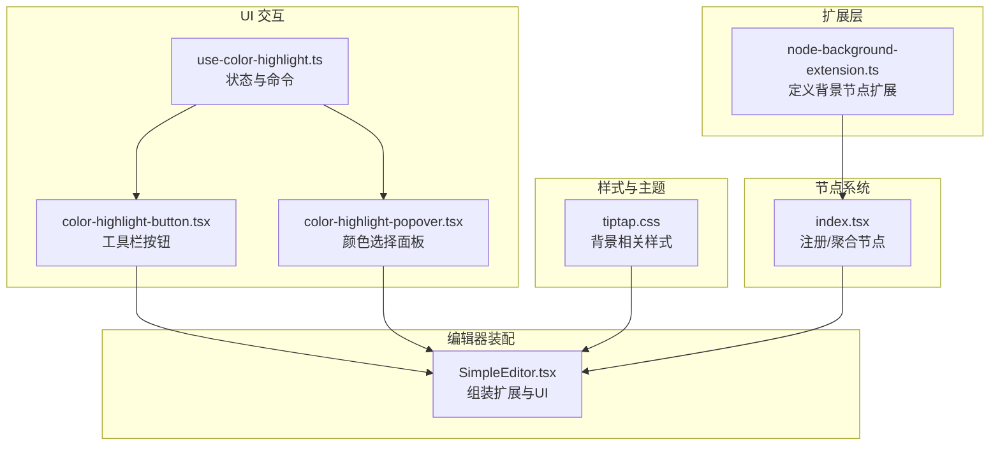
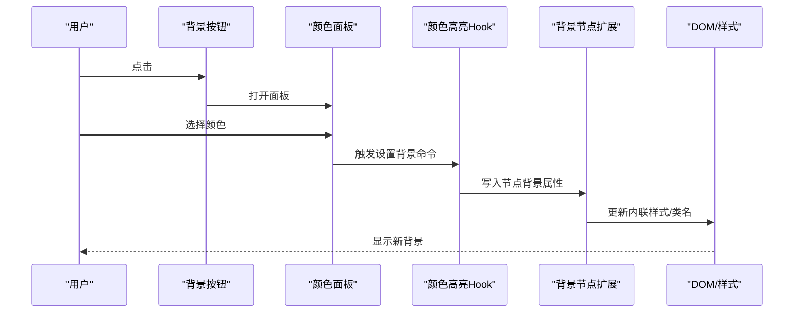
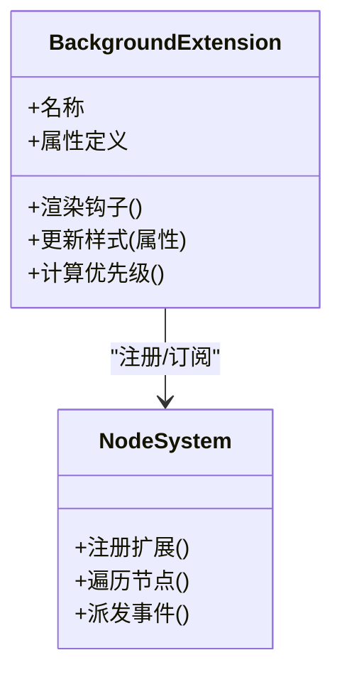
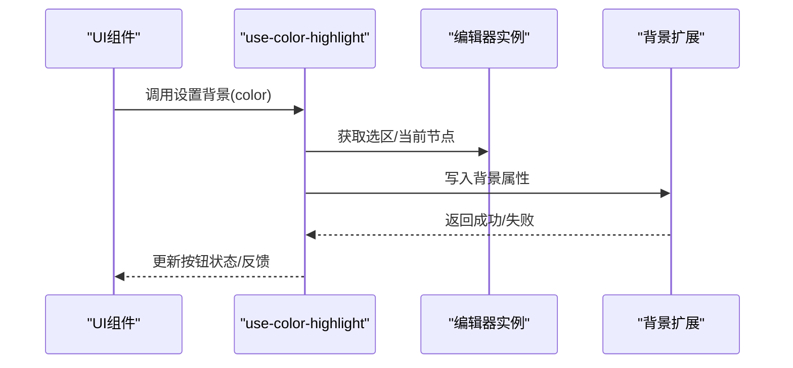
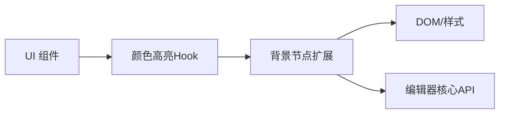

# 背景节点扩展

<cite>
**本文引用的文件**   
- [node-background-extension.ts](file://src/components/tiptap-extension/node-background-extension.ts)
- [index.tsx](file://src/components/tiptap-node/index.tsx)
- [use-color-highlight.ts](file://src/components/tiptap-ui/use-color-highlight.ts)
- [color-highlight-button.tsx](file://src/components/tiptap-ui/color-highlight-button.tsx)
- [color-highlight-popover.tsx](file://src/components/tiptap-ui/color-highlight-popover.tsx)
- [tiptap.css](file://src/features/tiptap/tiptap.css)
- [SimpleEditor.tsx](file://src/features/tiptap/SimpleEditor.tsx)
</cite>

## 目录
1. [简介](#简介)
2. [项目结构](#项目结构)
3. [核心组件](#核心组件)
4. [架构总览](#架构总览)
5. [详细组件分析](#详细组件分析)
6. [依赖关系分析](#依赖关系分析)
7. [性能考虑](#性能考虑)
8. [故障排查指南](#故障排查指南)
9. [结论](#结论)
10. [附录](#附录)

## 简介
本技术文档围绕“背景节点扩展”展开，聚焦于在编辑器中为节点提供动态背景色能力。内容涵盖：
- 背景色的动态应用、样式继承与优先级处理机制
- 背景节点与现有节点系统的集成方式
- 支持的背景类型与颜色格式
- 生命周期管理（更新、重计算）与性能优化策略
- 配置接口与自定义选项
- 使用示例（单色、渐变、条件背景）
- 调试技巧与性能监控方法

## 项目结构
与背景节点扩展相关的代码主要分布在以下位置：
- 扩展实现：src/components/tiptap-extension/node-background-extension.ts
- 节点注册入口：src/components/tiptap-node/index.tsx
- UI 交互：src/components/tiptap-ui/use-color-highlight.ts、color-highlight-button.tsx、color-highlight-popover.tsx
- 样式与主题：src/features/tiptap/tiptap.css
- 编辑器装配：src/features/tiptap/SimpleEditor.tsx

图表来源
- [node-background-extension.ts](file://src/components/tiptap-extension/node-background-extension.ts)
- [index.tsx](file://src/components/tiptap-node/index.tsx)
- [use-color-highlight.ts](file://src/components/tiptap-ui/use-color-highlight.ts)
- [color-highlight-button.tsx](file://src/components/tiptap-ui/color-highlight-button.tsx)
- [color-highlight-popover.tsx](file://src/components/tiptap-ui/color-highlight-popover.tsx)
- [tiptap.css](file://src/features/tiptap/tiptap.css)
- [SimpleEditor.tsx](file://src/features/tiptap/SimpleEditor.tsx)

章节来源
- [node-background-extension.ts](file://src/components/tiptap-extension/node-background-extension.ts)
- [index.tsx](file://src/components/tiptap-node/index.tsx)
- [use-color-highlight.ts](file://src/components/tiptap-ui/use-color-highlight.ts)
- [color-highlight-button.tsx](file://src/components/tiptap-ui/color-highlight-button.tsx)
- [color-highlight-popover.tsx](file://src/components/tiptap-ui/color-highlight-popover.tsx)
- [tiptap.css](file://src/features/tiptap/tiptap.css)
- [SimpleEditor.tsx](file://src/features/tiptap/SimpleEditor.tsx)

## 核心组件
- 背景节点扩展：负责将背景属性注入到目标节点的 DOM 上，并参与编辑器的渲染管线。
- 颜色高亮 Hook：封装了获取当前选中节点、设置背景、切换背景等命令逻辑。
- 工具栏按钮与弹出面板：提供用户交互入口，触发背景设置命令。
- 样式表：定义背景类名或内联样式的默认表现，确保可被主题覆盖。
- 编辑器装配：将扩展与 UI 组合进编辑器实例。

章节来源
- [node-background-extension.ts](file://src/components/tiptap-extension/node-background-extension.ts)
- [use-color-highlight.ts](file://src/components/tiptap-ui/use-color-highlight.ts)
- [color-highlight-button.tsx](file://src/components/tiptap-ui/color-highlight-button.tsx)
- [color-highlight-popover.tsx](file://src/components/tiptap-ui/color-highlight-popover.tsx)
- [tiptap.css](file://src/features/tiptap/tiptap.css)
- [SimpleEditor.tsx](file://src/features/tiptap/SimpleEditor.tsx)

## 架构总览
背景节点扩展通过以下步骤完成一次背景变更：
- 用户在工具栏点击“背景”按钮，打开颜色选择面板
- 选择颜色后，调用 Hook 中的命令
- 命令定位当前选区所在的节点，写入背景属性
- 扩展监听属性变化，更新对应 DOM 的样式
- 样式层根据优先级规则生效（内联 > 类名 > 全局）

图表来源
- [use-color-highlight.ts](file://src/components/tiptap-ui/use-color-highlight.ts)
- [color-highlight-button.tsx](file://src/components/tiptap-ui/color-highlight-button.tsx)
- [color-highlight-popover.tsx](file://src/components/tiptap-ui/color-highlight-popover.tsx)
- [node-background-extension.ts](file://src/components/tiptap-extension/node-background-extension.ts)

## 详细组件分析

### 背景节点扩展（node-background-extension.ts）
- 职责
  - 定义背景节点扩展，将背景属性映射到节点 DOM
  - 处理属性变更时的样式更新
  - 与编辑器渲染流程协作，避免不必要的重排
- 关键行为
  - 属性读取：从节点属性中解析背景值
  - 样式写入：优先使用内联样式，必要时回退到类名
  - 样式继承：当未显式设置时，向上查找父节点或主题默认值
  - 优先级：内联样式 > 类名 > 全局样式
- 性能要点
  - 批量更新：合并多次属性变更
  - 最小化重绘：仅对受影响节点进行局部更新
  - 防抖/节流：在频繁输入场景下减少样式计算

章节来源
- [node-background-extension.ts](file://src/components/tiptap-extension/node-background-extension.ts)

#### 类图（概念映射）

图表来源
- [node-background-extension.ts](file://src/components/tiptap-extension/node-background-extension.ts)
- [index.tsx](file://src/components/tiptap-node/index.tsx)

### 颜色高亮 Hook（use-color-highlight.ts）
- 职责
  - 暴露设置/清除背景的命令
  - 维护当前选区上下文
  - 与扩展的属性系统对接
- 关键行为
  - 获取当前节点：基于选区定位
  - 写入属性：将颜色值写入节点属性
  - 撤销/重做：与编辑器历史系统集成
- 错误处理
  - 无选中节点时提示或忽略
  - 非法颜色值时回退到默认或拒绝写入

章节来源
- [use-color-highlight.ts](file://src/components/tiptap-ui/use-color-highlight.ts)

#### 序列图（设置背景）

图表来源
- [use-color-highlight.ts](file://src/components/tiptap-ui/use-color-highlight.ts)
- [node-background-extension.ts](file://src/components/tiptap-extension/node-background-extension.ts)

### 工具栏按钮与颜色面板（color-highlight-button.tsx / color-highlight-popover.tsx）
- 职责
  - 提供“背景”按钮与颜色选择面板
  - 绑定 Hook 的命令到用户操作
  - 展示当前节点的背景状态（如已设置则高亮按钮）
- 交互流程
  - 点击按钮打开面板
  - 选择颜色后关闭面板并应用
  - 支持清空背景

章节来源
- [color-highlight-button.tsx](file://src/components/tiptap-ui/color-highlight-button.tsx)
- [color-highlight-popover.tsx](file://src/components/tiptap-ui/color-highlight-popover.tsx)
- [use-color-highlight.ts](file://src/components/tiptap-ui/use-color-highlight.ts)

### 样式与主题（tiptap.css）
- 职责
  - 定义背景相关的基础样式
  - 提供可被覆盖的类名或变量
- 优先级说明
  - 内联样式由扩展直接写入，优先级最高
  - 类名样式用于统一主题风格
  - 全局样式作为兜底

章节来源
- [tiptap.css](file://src/features/tiptap/tiptap.css)

### 编辑器装配（SimpleEditor.tsx）
- 职责
  - 将背景扩展与 UI 组件装配到编辑器
  - 初始化必要的上下文与状态
- 集成点
  - 注册扩展
  - 挂载工具栏按钮与面板
  - 连接主题与样式

章节来源
- [SimpleEditor.tsx](file://src/features/tiptap/SimpleEditor.tsx)

## 依赖关系分析
- 低耦合设计
  - 扩展只关注属性与样式映射，不关心 UI 细节
  - UI 通过 Hook 与扩展交互，避免直接依赖扩展内部实现
- 可能的循环依赖
  - 若 UI 反向依赖扩展内部状态，需解耦为事件或回调
- 外部依赖
  - 编辑器核心 API（选区、属性、渲染钩子）
  - CSS 样式系统（内联与类名）

图表来源
- [use-color-highlight.ts](file://src/components/tiptap-ui/use-color-highlight.ts)
- [node-background-extension.ts](file://src/components/tiptap-extension/node-background-extension.ts)

章节来源
- [use-color-highlight.ts](file://src/components/tiptap-ui/use-color-highlight.ts)
- [node-background-extension.ts](file://src/components/tiptap-extension/node-background-extension.ts)

## 性能考虑
- 更新策略
  - 仅在属性变化时更新受影响的节点
  - 合并高频更新，避免抖动
- 样式计算
  - 缓存最近计算的背景值，减少重复计算
  - 使用类名批量切换代替逐个内联样式
- 渲染优化
  - 利用编辑器的批处理机制
  - 避免在滚动或输入过程中执行昂贵操作

[本节为通用指导，无需具体文件引用]

## 故障排查指南
- 背景未生效
  - 检查是否选中有效节点
  - 确认颜色值格式合法
  - 查看浏览器开发者工具的样式优先级（内联 vs 类名）
- 样式冲突
  - 调整类名命名空间，避免与全局样式冲突
  - 使用更具体的选择器或提高内联样式优先级
- 性能问题
  - 开启性能面板观察重绘/回流
  - 降低更新频率，增加防抖/节流
- 调试技巧
  - 在 Hook 中打印选区与节点信息
  - 在扩展中记录属性变更日志
  - 使用断点跟踪命令执行路径

章节来源
- [use-color-highlight.ts](file://src/components/tiptap-ui/use-color-highlight.ts)
- [node-background-extension.ts](file://src/components/tiptap-extension/node-background-extension.ts)

## 结论
背景节点扩展通过清晰的职责划分与良好的集成点，实现了灵活的背景色管理能力。配合 UI 组件与样式系统，能够在保证性能的前提下提供一致的用户体验。建议在生产环境中结合性能监控与调试手段，持续优化更新与渲染路径。

[本节为总结性内容，无需具体文件引用]

## 附录

### 支持的背景类型与颜色格式
- 单色背景：支持常见颜色表示法（如十六进制、RGB、HSL、CSS 关键字）
- 渐变背景：支持线性渐变与径向渐变的字符串格式
- 透明背景：支持 transparent 或 alpha 通道为零的颜色值

[本节为概念性说明，无需具体文件引用]

### 配置接口与自定义选项
- 背景属性键名：用于存储与读取背景值的键
- 默认背景：未设置时的回退值
- 样式策略：内联或类名的默认策略
- 主题变量：允许通过 CSS 变量覆盖默认样式

章节来源
- [node-background-extension.ts](file://src/components/tiptap-extension/node-background-extension.ts)
- [tiptap.css](file://src/features/tiptap/tiptap.css)

### 使用示例
- 单色背景
  - 在工具栏选择颜色，应用到当前段落或块级节点
- 渐变背景
  - 传入渐变字符串，扩展将其写入内联样式
- 条件背景
  - 根据节点属性或外部状态动态决定背景值

章节来源
- [use-color-highlight.ts](file://src/components/tiptap-ui/use-color-highlight.ts)
- [color-highlight-button.tsx](file://src/components/tiptap-ui/color-highlight-button.tsx)
- [color-highlight-popover.tsx](file://src/components/tiptap-ui/color-highlight-popover.tsx)

### 生命周期管理与重计算
- 初始化：扩展注册到编辑器，准备默认样式
- 更新：属性变化触发样式重计算
- 销毁：清理监听与缓存，释放资源

章节来源
- [node-background-extension.ts](file://src/components/tiptap-extension/node-background-extension.ts)