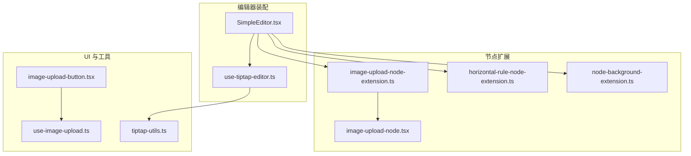
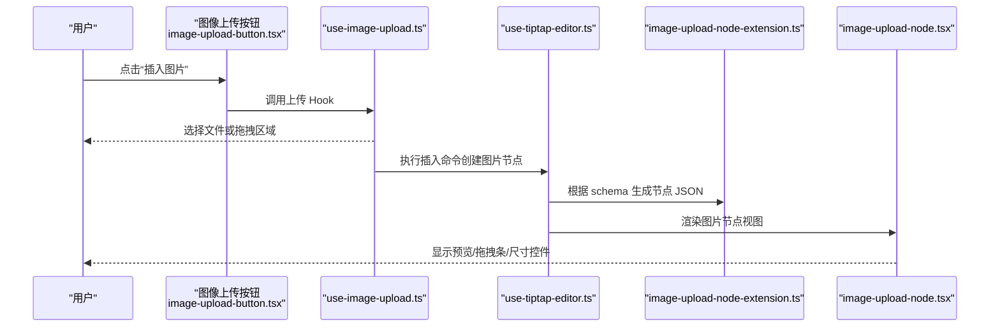
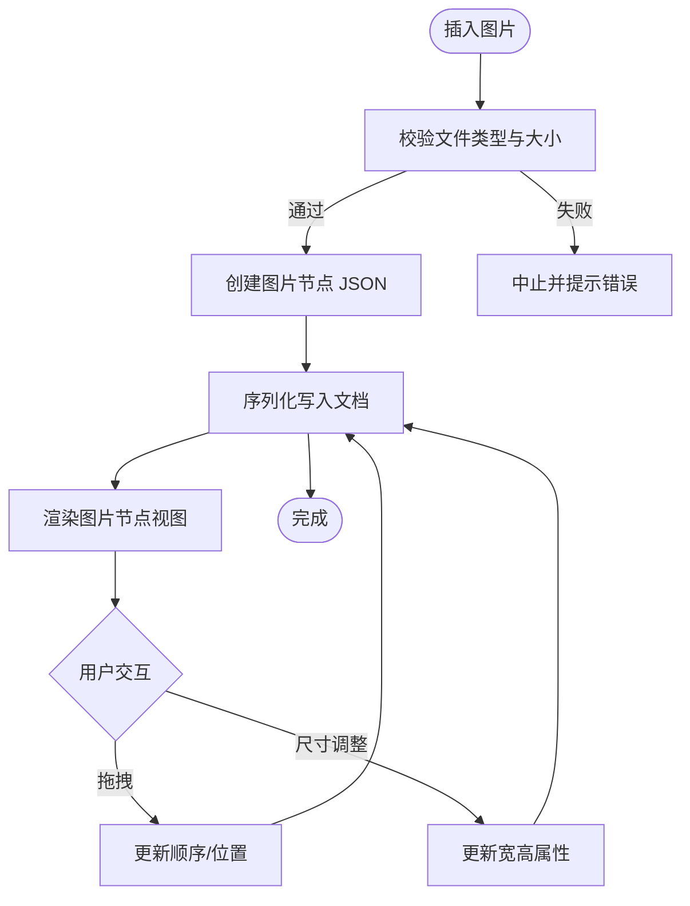
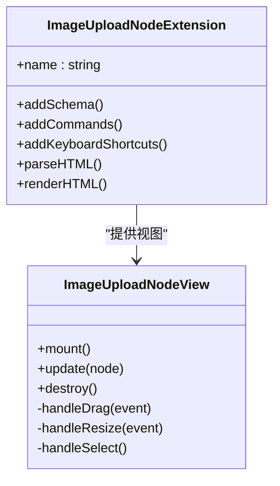
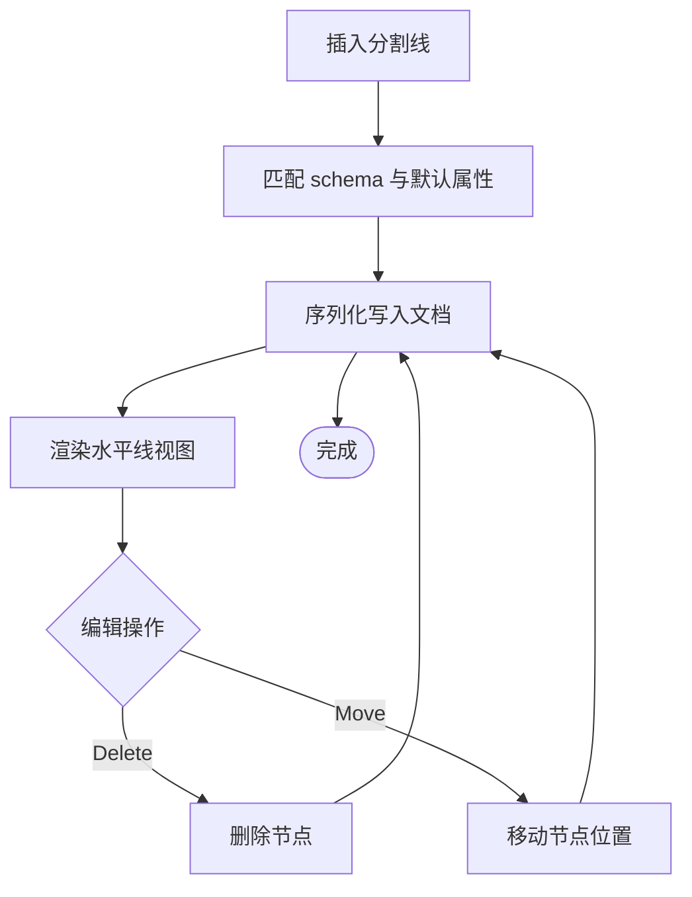
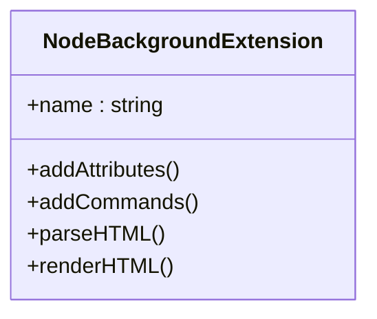
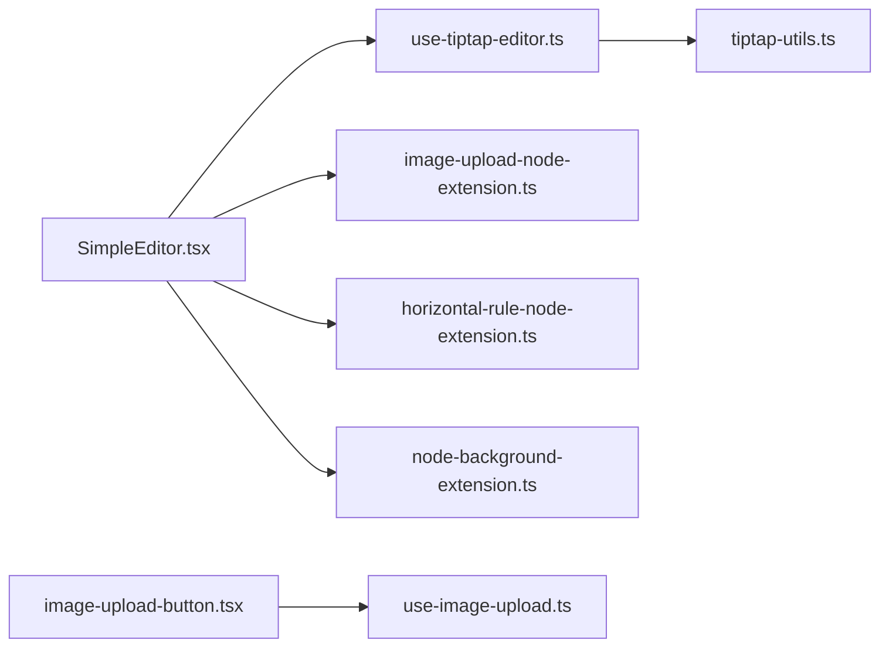

# 自定义节点扩展

<cite>
**本文引用的文件**
- [src/components/tiptap-node/image-upload-node-extension.ts](file://src/components/tiptap-node/image-upload-node-extension.ts)
- [src/components/tiptap-node/image-upload-node.tsx](file://src/components/tiptap-node/image-upload-node.tsx)
- [src/components/tiptap-node/image-upload-node.scss](file://src/components/tiptap-node/image-upload-node.scss)
- [src/components/tiptap-node/horizontal-rule-node-extension.ts](file://src/components/tiptap-node/horizontal-rule-node-extension.ts)
- [src/components/tiptap-node/horizontal-rule-node.scss](file://src/components/tiptap-node/horizontal-rule-node.scss)
- [src/components/tiptap-extension/node-background-extension.ts](file://src/components/tiptap-extension/node-background-extension.ts)
- [src/features/tiptap/SimpleEditor.tsx](file://src/features/tiptap/SimpleEditor.tsx)
- [src/hooks/use-tiptap-editor.ts](file://src/hooks/use-tiptap-editor.ts)
- [src/lib/tiptap-utils.ts](file://src/lib/tiptap-utils.ts)
- [src/components/tiptap-ui/image-upload-button.tsx](file://src/components/tiptap-ui/image-upload-button.tsx)
- [src/components/tiptap-ui/use-image-upload.ts](file://src/components/tiptap-ui/use-image-upload.ts)
</cite>

## 目录
1. [简介](#简介)
2. [项目结构](#项目结构)
3. [核心组件](#核心组件)
4. [架构总览](#架构总览)
5. [详细组件分析](#详细组件分析)
6. [依赖关系分析](#依赖关系分析)
7. [性能考量](#性能考量)
8. [故障排查指南](#故障排查指南)
9. [结论](#结论)
10. [附录](#附录)

## 简介
本文件面向富文本编辑器的自定义节点扩展系统，聚焦于 TipTap 的节点扩展机制与本项目已实现的自定义节点：图片上传节点（支持拖拽上传、预览、尺寸调整）、水平分割线节点、背景节点扩展。文档将系统性阐述节点定义、渲染逻辑、序列化/反序列化流程，并给出开发新节点类型的模式、插入/删除/修改操作的处理方式、样式管理、交互行为定制与数据绑定机制，同时提供完整的开发示例与调试技巧。

## 项目结构
围绕编辑器与自定义节点的相关代码主要分布在以下位置：
- 节点扩展与视图：src/components/tiptap-node/*
- 全局扩展（如背景）：src/components/tiptap-extension/*
- 编辑器装配与配置：src/features/tiptap/SimpleEditor.tsx、src/hooks/use-tiptap-editor.ts
- 工具函数与通用能力：src/lib/tiptap-utils.ts
- UI 按钮与 Hook（用于触发节点插入等）：src/components/tiptap-ui/*

图表来源
- [src/features/tiptap/SimpleEditor.tsx](file://src/features/tiptap/SimpleEditor.tsx)
- [src/hooks/use-tiptap-editor.ts](file://src/hooks/use-tiptap-editor.ts)
- [src/components/tiptap-node/image-upload-node-extension.ts](file://src/components/tiptap-node/image-upload-node-extension.ts)
- [src/components/tiptap-node/image-upload-node.tsx](file://src/components/tiptap-node/image-upload-node.tsx)
- [src/components/tiptap-node/horizontal-rule-node-extension.ts](file://src/components/tiptap-node/horizontal-rule-node-extension.ts)
- [src/components/tiptap-extension/node-background-extension.ts](file://src/components/tiptap-extension/node-background-extension.ts)
- [src/components/tiptap-ui/image-upload-button.tsx](file://src/components/tiptap-ui/image-upload-button.tsx)
- [src/components/tiptap-ui/use-image-upload.ts](file://src/components/tiptap-ui/use-image-upload.ts)
- [src/lib/tiptap-utils.ts](file://src/lib/tiptap-utils.ts)

章节来源
- [src/features/tiptap/SimpleEditor.tsx](file://src/features/tiptap/SimpleEditor.tsx)
- [src/hooks/use-tiptap-editor.ts](file://src/hooks/use-tiptap-editor.ts)
- [src/components/tiptap-node/image-upload-node-extension.ts](file://src/components/tiptap-node/image-upload-node-extension.ts)
- [src/components/tiptap-node/image-upload-node.tsx](file://src/components/tiptap-node/image-upload-node.tsx)
- [src/components/tiptap-node/horizontal-rule-node-extension.ts](file://src/components/tiptap-node/horizontal-rule-node-extension.ts)
- [src/components/tiptap-extension/node-background-extension.ts](file://src/components/tiptap-extension/node-background-extension.ts)
- [src/components/tiptap-ui/image-upload-button.tsx](file://src/components/tiptap-ui/image-upload-button.tsx)
- [src/components/tiptap-ui/use-image-upload.ts](file://src/components/tiptap-ui/use-image-upload.ts)
- [src/lib/tiptap-utils.ts](file://src/lib/tiptap-utils.ts)

## 核心组件
本节概述已实现的三个关键扩展及其职责边界：
- 图片上传节点扩展：负责在编辑器中注册“图片上传”节点类型，定义其 schema、序列化/反序列化规则，并提供可交互的 React 视图（拖拽上传、预览、尺寸调整）。
- 水平分割线节点扩展：注册“水平分割线”节点类型，定义最小化 schema 与渲染视图，确保插入/删除/移动等行为符合预期。
- 背景节点扩展：作为全局扩展，为节点或文档层提供背景样式能力，通常通过属性控制背景色或背景图。

章节来源
- [src/components/tiptap-node/image-upload-node-extension.ts](file://src/components/tiptap-node/image-upload-node-extension.ts)
- [src/components/tiptap-node/image-upload-node.tsx](file://src/components/tiptap-node/image-upload-node.tsx)
- [src/components/tiptap-node/horizontal-rule-node-extension.ts](file://src/components/tiptap-node/horizontal-rule-node-extension.ts)
- [src/components/tiptap-extension/node-background-extension.ts](file://src/components/tiptap-extension/node-background-extension.ts)

## 架构总览
TipTap 的节点扩展由三部分组成：
- 节点定义（Extension）：声明节点名称、schema、序列化/反序列化策略、命令与键盘快捷键等。
- 视图（React Component）：渲染节点内容，处理用户交互（如拖拽、点击、尺寸调整）。
- 装配（Editor 初始化）：在编辑器启动时将扩展注册到编辑器实例，并通过 UI 按钮或命令触发插入。

图表来源
- [src/components/tiptap-ui/image-upload-button.tsx](file://src/components/tiptap-ui/image-upload-button.tsx)
- [src/components/tiptap-ui/use-image-upload.ts](file://src/components/tiptap-ui/use-image-upload.ts)
- [src/hooks/use-tiptap-editor.ts](file://src/hooks/use-tiptap-editor.ts)
- [src/components/tiptap-node/image-upload-node-extension.ts](file://src/components/tiptap-node/image-upload-node-extension.ts)
- [src/components/tiptap-node/image-upload-node.tsx](file://src/components/tiptap-node/image-upload-node.tsx)

## 详细组件分析

### 图片上传节点（Image Upload Node）
该节点是富文本中最复杂的自定义节点之一，涉及文件选择、预览、拖拽排序、尺寸调整以及持久化序列化。

#### 节点定义与序列化/反序列化
- 节点名称与属性：包含图片 URL、宽度、高度、对齐等必要字段。
- Schema：定义必填字段与默认值，确保插入时数据结构完整。
- 序列化：将节点转换为 JSON，供存储或导出。
- 反序列化：从 JSON 恢复节点状态，包括尺寸与对齐信息。

图表来源
- [src/components/tiptap-node/image-upload-node-extension.ts](file://src/components/tiptap-node/image-upload-node-extension.ts)
- [src/components/tiptap-node/image-upload-node.tsx](file://src/components/tiptap-node/image-upload-node.tsx)

#### 视图与交互
- 拖拽上传：监听拖拽事件，解析文件并触发插入命令。
- 预览与占位：在上传前显示占位图，上传成功后替换为真实预览。
- 尺寸调整：提供拖拽手柄或输入框，实时更新节点属性并同步到文档。
- 选中态与气泡菜单：结合气泡菜单进行删除、复制等操作。

图表来源
- [src/components/tiptap-node/image-upload-node-extension.ts](file://src/components/tiptap-node/image-upload-node-extension.ts)
- [src/components/tiptap-node/image-upload-node.tsx](file://src/components/tiptap-node/image-upload-node.tsx)

章节来源
- [src/components/tiptap-node/image-upload-node-extension.ts](file://src/components/tiptap-node/image-upload-node-extension.ts)
- [src/components/tiptap-node/image-upload-node.tsx](file://src/components/tiptap-node/image-upload-node.tsx)
- [src/components/tiptap-node/image-upload-node.scss](file://src/components/tiptap-node/image-upload-node.scss)
- [src/components/tiptap-ui/image-upload-button.tsx](file://src/components/tiptap-ui/image-upload-button.tsx)
- [src/components/tiptap-ui/use-image-upload.ts](file://src/components/tiptap-ui/use-image-upload.ts)

### 水平分割线节点（Horizontal Rule Node）
水平分割线是一个轻量级节点，主要用于分隔段落或区块。

#### 节点定义与渲染
- 节点名称与属性：通常为最小化 schema，可能包含可选的对齐或样式属性。
- 序列化/反序列化：保持简洁，仅保留必要字段。
- 渲染视图：渲染一条水平线，支持选中态与键盘删除。

图表来源
- [src/components/tiptap-node/horizontal-rule-node-extension.ts](file://src/components/tiptap-node/horizontal-rule-node-extension.ts)

章节来源
- [src/components/tiptap-node/horizontal-rule-node-extension.ts](file://src/components/tiptap-node/horizontal-rule-node-extension.ts)
- [src/components/tiptap-node/horizontal-rule-node.scss](file://src/components/tiptap-node/horizontal-rule-node.scss)

### 背景节点扩展（Node Background Extension）
背景扩展用于为节点或文档层添加背景样式能力，常见用法是通过属性控制背景色或背景图。

#### 扩展职责
- 提供背景相关的命令与属性。
- 在渲染阶段注入背景样式。
- 与主题系统协作，支持动态切换。

图表来源
- [src/components/tiptap-extension/node-background-extension.ts](file://src/components/tiptap-extension/node-background-extension.ts)

章节来源
- [src/components/tiptap-extension/node-background-extension.ts](file://src/components/tiptap-extension/node-background-extension.ts)

## 依赖关系分析
- SimpleEditor 负责装配所有扩展与插件，并将 UI 按钮与编辑器命令关联。
- use-tiptap-editor 封装编辑器实例与常用命令，供上层组件复用。
- tiptap-utils 提供通用工具函数，辅助节点序列化、DOM 解析等。
- image-upload-button 与 use-image-upload 组合实现插入图片的入口与业务逻辑。

图表来源
- [src/features/tiptap/SimpleEditor.tsx](file://src/features/tiptap/SimpleEditor.tsx)
- [src/hooks/use-tiptap-editor.ts](file://src/hooks/use-tiptap-editor.ts)
- [src/components/tiptap-node/image-upload-node-extension.ts](file://src/components/tiptap-node/image-upload-node-extension.ts)
- [src/components/tiptap-node/horizontal-rule-node-extension.ts](file://src/components/tiptap-node/horizontal-rule-node-extension.ts)
- [src/components/tiptap-extension/node-background-extension.ts](file://src/components/tiptap-extension/node-background-extension.ts)
- [src/components/tiptap-ui/image-upload-button.tsx](file://src/components/tiptap-ui/image-upload-button.tsx)
- [src/components/tiptap-ui/use-image-upload.ts](file://src/components/tiptap-ui/use-image-upload.ts)
- [src/lib/tiptap-utils.ts](file://src/lib/tiptap-utils.ts)

章节来源
- [src/features/tiptap/SimpleEditor.tsx](file://src/features/tiptap/SimpleEditor.tsx)
- [src/hooks/use-tiptap-editor.ts](file://src/hooks/use-tiptap-editor.ts)
- [src/lib/tiptap-utils.ts](file://src/lib/tiptap-utils.ts)
- [src/components/tiptap-ui/image-upload-button.tsx](file://src/components/tiptap-ui/image-upload-button.tsx)
- [src/components/tiptap-ui/use-image-upload.ts](file://src/components/tiptap-ui/use-image-upload.ts)

## 性能考量
- 大图片优化：建议在上传前进行压缩与缩略图生成，避免阻塞主线程。
- 懒加载与虚拟滚动：长文档场景下对图片节点采用懒加载，减少初始渲染压力。
- 事件节流：尺寸调整与拖拽事件使用节流或防抖，降低频繁重排与重绘。
- 序列化缓存：对稳定不变的节点属性进行缓存，减少重复计算。

[本节为通用指导，不直接分析具体文件]

## 故障排查指南
- 节点未渲染：检查扩展是否正确注册，schema 是否匹配，parseHTML/renderHTML 是否实现。
- 序列化异常：确认节点属性齐全且类型正确，JSON 结构符合预期。
- 拖拽失效：验证 DOM 事件监听是否挂载，阻止默认行为与冒泡是否正确。
- 样式冲突：检查 SCSS 作用域与类名命名，避免与全局样式冲突。
- 命令无效：确认命令名称与参数一致，编辑器实例可用且未被销毁。

章节来源
- [src/components/tiptap-node/image-upload-node-extension.ts](file://src/components/tiptap-node/image-upload-node-extension.ts)
- [src/components/tiptap-node/image-upload-node.tsx](file://src/components/tiptap-node/image-upload-node.tsx)
- [src/components/tiptap-node/horizontal-rule-node-extension.ts](file://src/components/tiptap-node/horizontal-rule-node-extension.ts)
- [src/components/tiptap-extension/node-background-extension.ts](file://src/components/tiptap-extension/node-background-extension.ts)

## 结论
通过 TipTap 的节点扩展机制，本项目实现了图片上传、水平分割线与背景节点等关键能力。遵循“节点定义—视图渲染—序列化/反序列化—装配集成”的开发模式，可以高效地扩展新的节点类型。建议在实际项目中持续完善错误处理、性能优化与可访问性，以提升用户体验与维护性。

[本节为总结性内容，不直接分析具体文件]

## 附录

### 如何创建新的节点类型（步骤清单）
- 定义节点扩展：设置 name、schema、commands、keyboardShortcuts、parseHTML、renderHTML。
- 编写视图组件：实现 mount/update/destroy 生命周期，处理用户交互与状态同步。
- 注册到编辑器：在 SimpleEditor 或 use-tiptap-editor 中引入并启用扩展。
- 提供插入入口：通过 UI 按钮或命令触发插入，确保传入正确的节点属性。
- 样式与主题：为节点编写独立 SCSS，避免全局污染；必要时接入主题系统。
- 测试与调试：覆盖插入、删除、移动、序列化/反序列化路径；使用浏览器开发者工具与日志定位问题。

章节来源
- [src/features/tiptap/SimpleEditor.tsx](file://src/features/tiptap/SimpleEditor.tsx)
- [src/hooks/use-tiptap-editor.ts](file://src/hooks/use-tiptap-editor.ts)
- [src/components/tiptap-node/image-upload-node-extension.ts](file://src/components/tiptap-node/image-upload-node-extension.ts)
- [src/components/tiptap-node/image-upload-node.tsx](file://src/components/tiptap-node/image-upload-node.tsx)
- [src/components/tiptap-node/horizontal-rule-node-extension.ts](file://src/components/tiptap-node/horizontal-rule-node-extension.ts)
- [src/components/tiptap-extension/node-background-extension.ts](file://src/components/tiptap-extension/node-background-extension.ts)