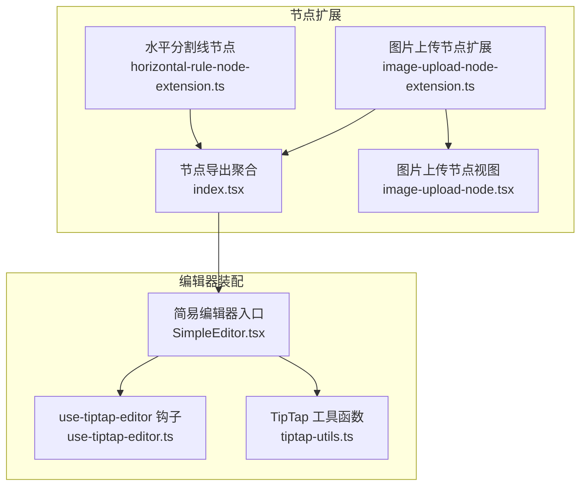
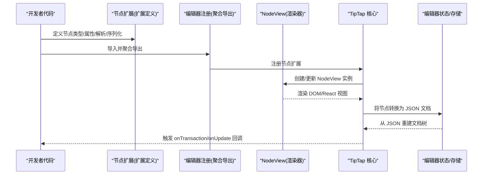
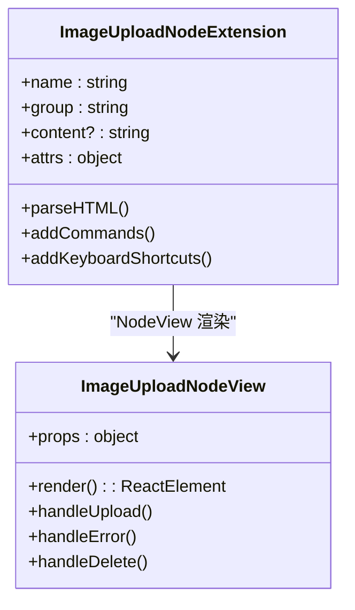
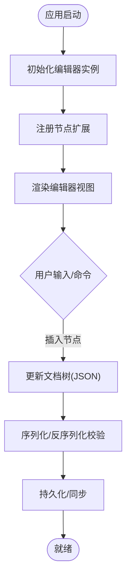
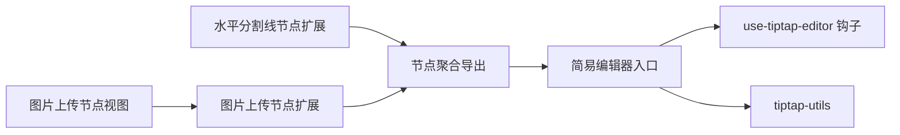

# 节点扩展基础概念

<cite>
**本文引用的文件**   
- [src/components/tiptap-node/horizontal-rule-node-extension.ts](file://src/components/tiptap-node/horizontal-rule-node-extension.ts)
- [src/components/tiptap-node/image-upload-node-extension.ts](file://src/components/tiptap-node/image-upload-node-extension.ts)
- [src/components/tiptap-node/image-upload-node.tsx](file://src/components/tiptap-node/image-upload-node.tsx)
- [src/components/tiptap-node/index.tsx](file://src/components/tiptap-node/index.tsx)
- [src/features/tiptap/SimpleEditor.tsx](file://src/features/tiptap/SimpleEditor.tsx)
- [src/hooks/use-tiptap-editor.ts](file://src/hooks/use-tiptap-editor.ts)
- [src/lib/tiptap-utils.ts](file://src/lib/tiptap-utils.ts)
</cite>

## 目录
1. [简介](#简介)
2. [项目结构](#项目结构)
3. [核心组件](#核心组件)
4. [架构总览](#架构总览)
5. [详细组件分析](#详细组件分析)
6. [依赖分析](#依赖分析)
7. [性能考虑](#性能考虑)
8. [故障排查指南](#故障排查指南)
9. [结论](#结论)
10. [附录](#附录)

## 简介
本文件围绕 TipTap 的“节点扩展”基础概念，结合仓库中已有的节点实现与编辑器集成方式，系统梳理以下主题：
- 节点定义语法、生命周期方法、渲染器实现
- 序列化/反序列化过程与数据一致性保障
- 节点与标记的区别及选用策略
- 节点扩展的注册机制、配置选项与最佳实践
- 从简单文本节点到复杂交互节点的渐进式开发模板与常见陷阱

## 项目结构
本项目在 src/components/tiptap-node 下提供若干节点扩展与对应的 UI 渲染组件；在 features/tiptap 与 hooks 层完成编辑器的装配与使用。下图展示了与“节点扩展”相关的核心文件关系。

图表来源
- [src/components/tiptap-node/horizontal-rule-node-extension.ts](file://src/components/tiptap-node/horizontal-rule-node-extension.ts)
- [src/components/tiptap-node/image-upload-node-extension.ts](file://src/components/tiptap-node/image-upload-node-extension.ts)
- [src/components/tiptap-node/image-upload-node.tsx](file://src/components/tiptap-node/image-upload-node.tsx)
- [src/components/tiptap-node/index.tsx](file://src/components/tiptap-node/index.tsx)
- [src/features/tiptap/SimpleEditor.tsx](file://src/features/tiptap/SimpleEditor.tsx)
- [src/hooks/use-tiptap-editor.ts](file://src/hooks/use-tiptap-editor.ts)
- [src/lib/tiptap-utils.ts](file://src/lib/tiptap-utils.ts)

章节来源
- [src/components/tiptap-node/index.tsx](file://src/components/tiptap-node/index.tsx)
- [src/features/tiptap/SimpleEditor.tsx](file://src/features/tiptap/SimpleEditor.tsx)
- [src/hooks/use-tiptap-editor.ts](file://src/hooks/use-tiptap-editor.ts)
- [src/lib/tiptap-utils.ts](file://src/lib/tiptap-utils.ts)

## 核心组件
本节聚焦仓库中与“节点扩展”直接相关的核心文件，说明其职责与协作方式。

- 水平分割线节点扩展：提供一个块级节点，用于插入一条水平分割线。通常包含节点类型名、可解析/可序列化的 JSON 结构、以及可选的键盘或命令支持。
- 图片上传节点扩展：封装一个可上传图片的块级节点，负责将本地或远程图片资源持久化为稳定的数据结构（如 URL），并在编辑器中渲染为自定义视图。
- 图片上传节点视图：React 组件，作为 TipTap 的 NodeView 渲染该节点，处理图片加载状态、占位图、错误提示等交互。
- 节点导出聚合：集中导出各节点扩展，便于上层统一注册。
- 简易编辑器入口：组装 TipTap 编辑器实例，注册必要的扩展（包括上述节点扩展），并绑定事件与工具函数。
- use-tiptap-editor 钩子：封装编辑器初始化、销毁、内容读写等常用操作，供页面复用。
- tiptap-utils：封装与 TipTap 相关的通用工具方法（例如内容转换、命令封装等）。

章节来源
- [src/components/tiptap-node/horizontal-rule-node-extension.ts](file://src/components/tiptap-node/horizontal-rule-node-extension.ts)
- [src/components/tiptap-node/image-upload-node-extension.ts](file://src/components/tiptap-node/image-upload-node-extension.ts)
- [src/components/tiptap-node/image-upload-node.tsx](file://src/components/tiptap-node/image-upload-node.tsx)
- [src/components/tiptap-node/index.tsx](file://src/components/tiptap-node/index.tsx)
- [src/features/tiptap/SimpleEditor.tsx](file://src/features/tiptap/SimpleEditor.tsx)
- [src/hooks/use-tiptap-editor.ts](file://src/hooks/use-tiptap-editor.ts)
- [src/lib/tiptap-utils.ts](file://src/lib/tiptap-utils.ts)

## 架构总览
下图展示“节点扩展”在编辑器中的整体流程：扩展定义 → 注册 → 渲染 → 序列化/反序列化 → 内容同步。

图表来源
- [src/components/tiptap-node/horizontal-rule-node-extension.ts](file://src/components/tiptap-node/horizontal-rule-node-extension.ts)
- [src/components/tiptap-node/image-upload-node-extension.ts](file://src/components/tiptap-node/image-upload-node-extension.ts)
- [src/components/tiptap-node/image-upload-node.tsx](file://src/components/tiptap-node/image-upload-node.tsx)
- [src/components/tiptap-node/index.tsx](file://src/components/tiptap-node/index.tsx)
- [src/features/tiptap/SimpleEditor.tsx](file://src/features/tiptap/SimpleEditor.tsx)
- [src/hooks/use-tiptap-editor.ts](file://src/hooks/use-tiptap-editor.ts)
- [src/lib/tiptap-utils.ts](file://src/lib/tiptap-utils.ts)

## 详细组件分析

### 水平分割线节点扩展
- 角色定位：块级节点，表示不可编辑的分隔元素。
- 关键能力：
  - 定义节点名称与属性（如有）
  - 指定解析规则（从 HTML/JSON 解析为该节点）
  - 指定序列化规则（将该节点输出为稳定 JSON/HTML）
  - 可选：键盘行为、命令插入、拖拽/选择边界控制
- 典型用法：通过聚合导出被编辑器注册，随后可在输入时以命令或快捷键插入。

章节来源
- [src/components/tiptap-node/horizontal-rule-node-extension.ts](file://src/components/tiptap-node/horizontal-rule-node-extension.ts)
- [src/components/tiptap-node/index.tsx](file://src/components/tiptap-node/index.tsx)

### 图片上传节点扩展与视图
- 角色定位：块级节点，承载图片资源及其元信息，并提供交互式视图。
- 关键能力：
  - 节点属性：如图片地址、宽高、加载状态、错误信息等
  - 解析/序列化：确保图片信息在 JSON 与 DOM 之间稳定往返
  - NodeView：React 组件渲染图片、占位符、错误态与交互按钮
  - 事件处理：上传进度、失败重试、删除等
- 数据一致性要点：
  - 使用稳定字段（如 URL）作为唯一标识
  - 避免在视图中保存会随时间变化的临时状态到文档
  - 对网络请求结果进行幂等处理，防止重复上传

图表来源
- [src/components/tiptap-node/image-upload-node-extension.ts](file://src/components/tiptap-node/image-upload-node-extension.ts)
- [src/components/tiptap-node/image-upload-node.tsx](file://src/components/tiptap-node/image-upload-node.tsx)

章节来源
- [src/components/tiptap-node/image-upload-node-extension.ts](file://src/components/tiptap-node/image-upload-node-extension.ts)
- [src/components/tiptap-node/image-upload-node.tsx](file://src/components/tiptap-node/image-upload-node.tsx)

### 编辑器装配与使用
- 简易编辑器入口：
  - 引入并注册节点扩展（来自聚合导出）
  - 配置编辑器初始内容、事件回调（onUpdate、onTransaction 等）
  - 暴露 API 给父组件（获取/设置内容、清空、撤销重做等）
- use-tiptap-editor 钩子：
  - 封装编辑器实例的生命周期管理
  - 提供便捷的内容读写方法与状态订阅
- tiptap-utils：
  - 封装与 TipTap 相关的通用逻辑（如内容转换、命令封装）

图表来源
- [src/features/tiptap/SimpleEditor.tsx](file://src/features/tiptap/SimpleEditor.tsx)
- [src/hooks/use-tiptap-editor.ts](file://src/hooks/use-tiptap-editor.ts)
- [src/lib/tiptap-utils.ts](file://src/lib/tiptap-utils.ts)

章节来源
- [src/features/tiptap/SimpleEditor.tsx](file://src/features/tiptap/SimpleEditor.tsx)
- [src/hooks/use-tiptap-editor.ts](file://src/hooks/use-tiptap-editor.ts)
- [src/lib/tiptap-utils.ts](file://src/lib/tiptap-utils.ts)

## 依赖分析
- 内聚性：每个节点扩展自包含其解析/序列化与视图逻辑，职责清晰。
- 耦合点：
  - 聚合导出文件集中对外暴露节点扩展，降低上层耦合
  - 编辑器入口仅依赖聚合导出，不直接感知具体扩展细节
- 外部依赖：TipTap 核心库（节点/标记/命令/插件体系）、React（NodeView 渲染）

图表来源
- [src/components/tiptap-node/horizontal-rule-node-extension.ts](file://src/components/tiptap-node/horizontal-rule-node-extension.ts)
- [src/components/tiptap-node/image-upload-node-extension.ts](file://src/components/tiptap-node/image-upload-node-extension.ts)
- [src/components/tiptap-node/image-upload-node.tsx](file://src/components/tiptap-node/image-upload-node.tsx)
- [src/components/tiptap-node/index.tsx](file://src/components/tiptap-node/index.tsx)
- [src/features/tiptap/SimpleEditor.tsx](file://src/features/tiptap/SimpleEditor.tsx)
- [src/hooks/use-tiptap-editor.ts](file://src/hooks/use-tiptap-editor.ts)
- [src/lib/tiptap-utils.ts](file://src/lib/tiptap-utils.ts)

章节来源
- [src/components/tiptap-node/index.tsx](file://src/components/tiptap-node/index.tsx)
- [src/features/tiptap/SimpleEditor.tsx](file://src/features/tiptap/SimpleEditor.tsx)

## 性能考虑
- 大文档渲染：
  - 合理使用惰性加载与虚拟滚动（针对大量图片节点）
  - 避免在每次更新中执行昂贵计算
- 网络请求：
  - 图片上传需去抖/节流，失败重试需带退避策略
  - 缓存已上传的资源 URL，避免重复请求
- 内存管理：
  - 及时解绑事件监听与定时器
  - 在组件卸载时清理副作用

[本节为通用指导，无需源码引用]

## 故障排查指南
- 节点无法解析/序列化不一致：
  - 检查 parseHTML/addAttributes 与 toDOM/toJSON 的字段映射是否一致
  - 确认 JSON schema 的必填字段与默认值
- 视图不更新：
  - 确认 NodeView 的 props 变化是否正确传递
  - 避免在视图中修改受控状态导致循环更新
- 上传失败：
  - 检查网络与权限
  - 记录错误日志并提示用户重试
- 编辑器卡顿：
  - 减少不必要的 re-render
  - 拆分重型逻辑至 Web Worker 或异步任务

章节来源
- [src/components/tiptap-node/image-upload-node-extension.ts](file://src/components/tiptap-node/image-upload-node-extension.ts)
- [src/components/tiptap-node/image-upload-node.tsx](file://src/components/tiptap-node/image-upload-node.tsx)
- [src/features/tiptap/SimpleEditor.tsx](file://src/features/tiptap/SimpleEditor.tsx)

## 结论
通过本仓库的实践可以看出，TipTap 节点扩展的关键在于：
- 清晰的节点模型与稳定的序列化格式
- 独立的 NodeView 负责渲染与交互
- 统一的注册与装配流程
遵循这些原则，可以在保证数据一致性的同时，快速构建从简单到复杂的节点能力。

[本节为总结，无需源码引用]

## 附录

### 节点 vs 标记：何时使用节点而非标记
- 节点：表示文档树中的块级或行内单元，拥有自己的子树与属性，适合承载结构化内容（如图片、列表、引用块、分割线等）。
- 标记：作用于文本范围，不改变文档树结构，适合样式与轻量语义（如加粗、斜体、链接、高亮等）。
- 选择建议：
  - 需要独立渲染容器与交互 → 节点
  - 仅对文本施加样式/语义 → 标记
  - 需要嵌套子内容 → 节点
  - 跨多段落/非连续文本 → 标记更合适

[本节为概念说明，无需源码引用]

### 节点扩展开发模板（步骤清单）
- 定义节点扩展
  - 指定 name、group、content（如需）
  - 定义 attrs 与默认值
  - 实现 parseHTML 与 addAttributes（如需）
  - 实现 toDOM 与 toJSON，确保双向一致
  - 可选：addCommands、addKeyboardShortcuts、addNodeView
- 编写 NodeView（React）
  - 接收 props（node、updateAttributes、deleteNode 等）
  - 渲染主视图与交互控件
  - 处理上传/错误/删除等事件
- 注册与装配
  - 在聚合导出文件中统一导出
  - 在编辑器入口注册扩展
  - 在工具函数中封装常用命令
- 测试与验证
  - 单元测试：解析/序列化往返一致
  - 集成测试：插入、编辑、删除、撤销/重做
  - 性能测试：大数据量下的渲染与交互

[本节为方法论，无需源码引用]

### 常见陷阱与规避
- 属性命名不一致：parseHTML 与 toDOM 的字段名必须严格对应
- 视图状态污染文档：不要在 NodeView 中将临时 UI 状态写入 node.attrs
- 未处理空值/异常路径：对缺失属性、网络失败、资源不可用等场景做好兜底
- 过度渲染：避免在高频事件中触发全量更新，采用局部更新或防抖
- 忘记清理副作用：在组件卸载时移除监听器、取消请求、释放资源

[本节为经验总结，无需源码引用]