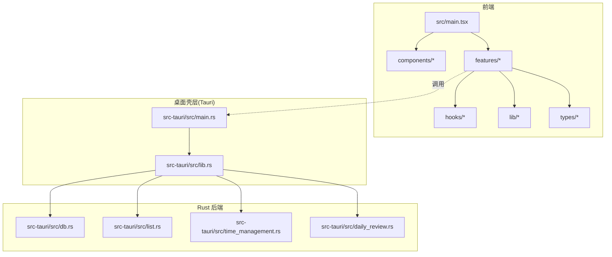
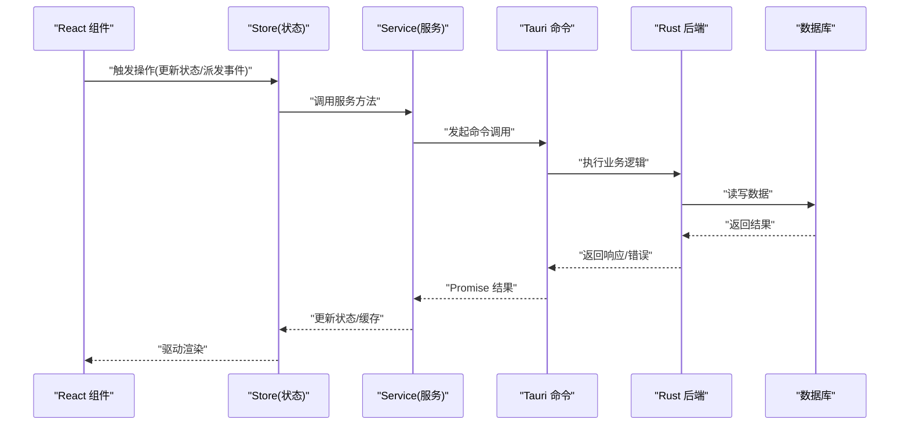
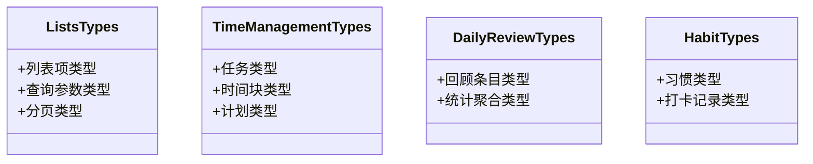
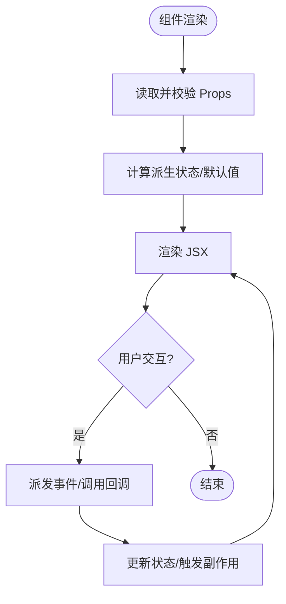
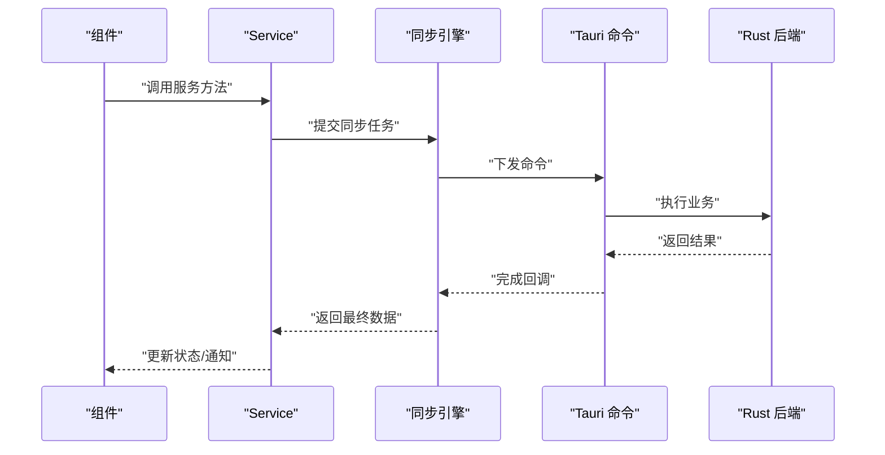
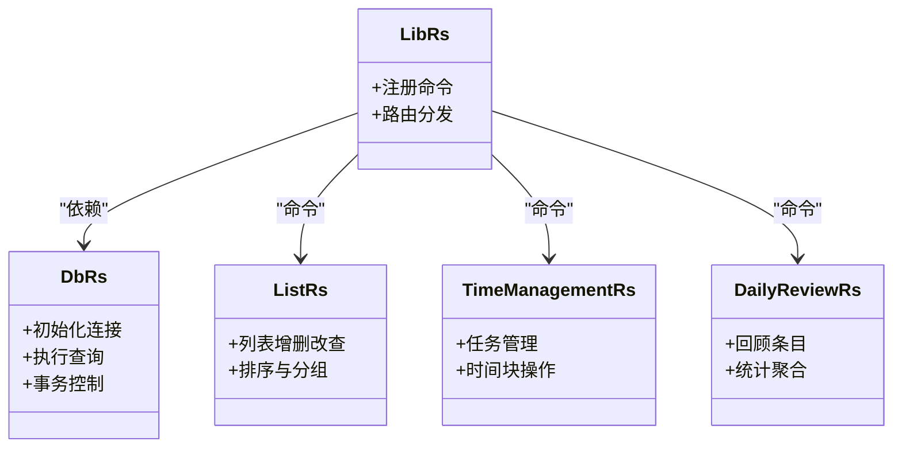
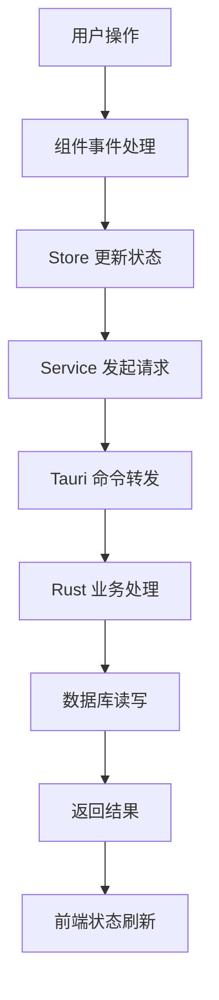
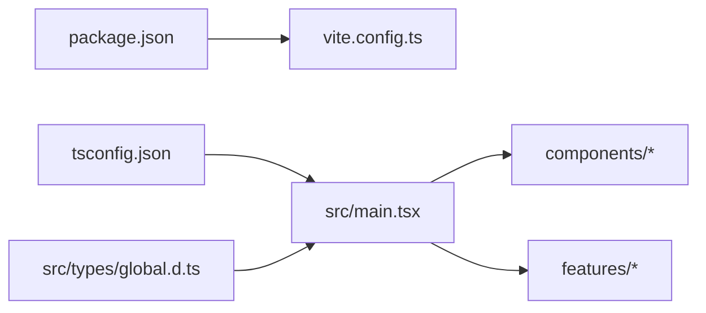

# 代码规范

<cite>
**本文引用的文件**   
- [package.json](file://package.json)
- [tsconfig.json](file://tsconfig.json)
- [vite.config.ts](file://vite.config.ts)
- [src/main.tsx](file://src/main.tsx)
- [src/types/global.d.ts](file://src/types/global.d.ts)
- [src/components/layout/AppLayout.tsx](file://src/components/layout/AppLayout.tsx)
- [src/components/layout/types.ts](file://src/components/layout/types.ts)
- [src/features/lists/listsTypes.ts](file://src/features/lists/listsTypes.ts)
- [src/features/time-management/timeManagementTypes.ts](file://src/features/time-management/timeManagementTypes.ts)
- [src/features/daily-review/dailyReviewTypes.ts](file://src/features/daily-review/dailyReviewTypes.ts)
- [src/features/habits/habitTypes.ts](file://src/features/habits/habitTypes.ts)
- [src/features/lists/listsStore.ts](file://src/features/lists/listsStore.ts)
- [src/features/time-management/timeManagementStore.ts](file://src/features/time-management/timeManagementStore.ts)
- [src/features/daily-review/dailyReviewStore.ts](file://src/features/daily-review/dailyReviewStore.ts)
- [src/features/lists/listsService.ts](file://src/features/lists/listsService.ts)
- [src/features/time-management/timeManagementService.ts](file://src/features/time-management/timeManagementService.ts)
- [src/features/daily-review/dailyReviewService.ts](file://src/features/daily-review/dailyReviewService.ts)
- [src/lib/createSyncEngine.ts](file://src/lib/createSyncEngine.ts)
- [src-tauri/Cargo.toml](file://src-tauri/Cargo.toml)
- [src-tauri/src/lib.rs](file://src-tauri/src/lib.rs)
- [src-tauri/src/main.rs](file://src-tauri/src/main.rs)
- [src-tauri/src/db.rs](file://src-tauri/src/db.rs)
- [src-tauri/src/list.rs](file://src-tauri/src/list.rs)
- [src-tauri/src/time_management.rs](file://src-tauri/src/time_management.rs)
- [src-tauri/src/daily_review.rs](file://src-tauri/src/daily_review.rs)
</cite>

## 目录
1. [简介](#简介)
2. [项目结构](#项目结构)
3. [核心组件](#核心组件)
4. [架构总览](#架构总览)
5. [详细组件分析](#详细组件分析)
6. [依赖分析](#依赖分析)
7. [性能考虑](#性能考虑)
8. [故障排查指南](#故障排查指南)
9. [结论](#结论)
10. [附录](#附录)

## 简介
本规范面向 FishWorker 项目的 TypeScript、React 与 Rust 三层技术栈，目标是统一编码风格、类型约定、组件结构与文档注释标准，并明确 ESLint/Prettier（如启用）及静态检查工具的使用方式。同时给出 Tauri 后端 Rust 模块的命名与错误处理约定，确保前后端协作一致、可维护性与可读性提升。

## 项目结构
FishWorker 采用前端 React + TypeScript（Vite 构建）、Tauri 桌面壳层与 Rust 后端服务、以及按功能域划分的 features 组织方式。根级配置包含包管理、TypeScript 编译与 Vite 构建；Rust 侧位于 src-tauri，提供数据库与业务 API。

图示来源
- [src/main.tsx:1-50](file://src/main.tsx#L1-L50)
- [src-tauri/src/main.rs:1-50](file://src-tauri/src/main.rs#L1-L50)
- [src-tauri/src/lib.rs:1-50](file://src-tauri/src/lib.rs#L1-L50)

章节来源
- [package.json](file://package.json)
- [tsconfig.json](file://tsconfig.json)
- [vite.config.ts](file://vite.config.ts)
- [src/main.tsx](file://src/main.tsx)
- [src-tauri/Cargo.toml](file://src-tauri/Cargo.toml)
- [src-tauri/src/main.rs](file://src-tauri/src/main.rs)
- [src-tauri/src/lib.rs](file://src-tauri/src/lib.rs)

## 核心组件
本节定义跨语言的核心规范要点，覆盖类型、接口、函数命名、组件结构、事件处理、Rust 模块与错误处理等。

- TypeScript 类型与接口
  - 使用显式类型标注，避免 any；优先使用 interface/enum/type 表达领域模型。
  - 类型文件集中存放于各 feature 的 types 或同名 .ts 文件中，保持“就近声明、集中导出”。
  - 对外暴露的类型需具备稳定语义，变更遵循向后兼容原则。
- 函数与模块命名
  - 函数与方法使用小驼峰；常量使用全大写加下划线；模块名使用小写短横线或短横线分隔路径。
  - 副作用函数以动词开头（如 fetch、update、create），纯函数体现输入输出关系。
- React 组件规范
  - 组件文件以 PascalCase 命名，组件内 Props 使用独立 interface 定义，默认值通过解构赋值设置。
  - 事件处理函数以 onXxx 命名，回调参数具名且类型明确；复杂逻辑下沉至 hooks。
  - 样式文件与组件同目录，使用 CSS/SCSS 模块化或主题变量，避免全局污染。
- Tauri/Rust 模块规范
  - 模块按领域划分（list、time_management、daily_review），每个模块提供清晰的命令入口与错误类型。
  - 错误类型使用枚举+Result 返回，前端统一解析为友好提示。
  - 数据库访问封装在 db 模块，避免业务层直接耦合 SQL。

章节来源
- [src/components/layout/types.ts](file://src/components/layout/types.ts)
- [src/features/lists/listsTypes.ts](file://src/features/lists/listsTypes.ts)
- [src/features/time-management/timeManagementTypes.ts](file://src/features/time-management/timeManagementTypes.ts)
- [src/features/daily-review/dailyReviewTypes.ts](file://src/features/daily-review/dailyReviewTypes.ts)
- [src/features/habits/habitTypes.ts](file://src/features/habits/habitTypes.ts)
- [src-tauri/src/db.rs](file://src-tauri/src/db.rs)
- [src-tauri/src/list.rs](file://src-tauri/src/list.rs)
- [src-tauri/src/time_management.rs](file://src-tauri/src/time_management.rs)
- [src-tauri/src/daily_review.rs](file://src-tauri/src/daily_review.rs)

## 架构总览
前端通过 Tauri 命令调用 Rust 后端，后端经 db 模块访问持久化存储。状态管理采用 store 模式，服务层负责数据获取与转换。

图示来源
- [src/features/lists/listsStore.ts](file://src/features/lists/listsStore.ts)
- [src/features/lists/listsService.ts](file://src/features/lists/listsService.ts)
- [src-tauri/src/lib.rs](file://src-tauri/src/lib.rs)
- [src-tauri/src/db.rs](file://src-tauri/src/db.rs)

## 详细组件分析

### TypeScript 类型与接口规范
- 类型文件组织：每个 feature 目录下维护 types 文件或同名类型文件，保证高内聚。
- 命名约定：类型使用名词短语，复数形式表示集合；可选字段使用 ?；联合类型使用字面量联合。
- 版本演进：新增字段默认可选，废弃字段保留一段时间并提供迁移说明。

图示来源
- [src/features/lists/listsTypes.ts](file://src/features/lists/listsTypes.ts)
- [src/features/time-management/timeManagementTypes.ts](file://src/features/time-management/timeManagementTypes.ts)
- [src/features/daily-review/dailyReviewTypes.ts](file://src/features/daily-review/dailyReviewTypes.ts)
- [src/features/habits/habitTypes.ts](file://src/features/habits/habitTypes.ts)

章节来源
- [src/features/lists/listsTypes.ts](file://src/features/lists/listsTypes.ts)
- [src/features/time-management/timeManagementTypes.ts](file://src/features/time-management/timeManagementTypes.ts)
- [src/features/daily-review/dailyReviewTypes.ts](file://src/features/daily-review/dailyReviewTypes.ts)
- [src/features/habits/habitTypes.ts](file://src/features/habits/habitTypes.ts)

### React 组件开发规范
- 组件结构：文件内先导入依赖，再定义 Props 接口，随后实现组件主体，最后导出。
- Props 设计：最小必要集、具名必填、可选字段提供默认值；复杂对象拆分为子组件。
- 事件处理：将复杂逻辑放入自定义 hook，组件仅做分发；事件参数类型严格约束。
- 样式与资源：样式文件与组件同级，使用 CSS Modules 或 SCSS 局部作用域。

章节来源
- [src/components/layout/AppLayout.tsx](file://src/components/layout/AppLayout.tsx)
- [src/components/layout/types.ts](file://src/components/layout/types.ts)

### Store 与服务层规范
- Store：单一职责，只负责状态与副作用调度；不直接进行网络请求。
- Service：封装数据获取、转换与重试策略；对上层暴露 Promise 接口。
- 同步引擎：通用同步逻辑抽取到 lib 中，避免重复实现。

图示来源
- [src/features/lists/listsStore.ts](file://src/features/lists/listsStore.ts)
- [src/features/lists/listsService.ts](file://src/features/lists/listsService.ts)
- [src/lib/createSyncEngine.ts](file://src/lib/createSyncEngine.ts)
- [src-tauri/src/lib.rs](file://src-tauri/src/lib.rs)

章节来源
- [src/features/lists/listsStore.ts](file://src/features/lists/listsStore.ts)
- [src/features/lists/listsService.ts](file://src/features/lists/listsService.ts)
- [src/features/time-management/timeManagementStore.ts](file://src/features/time-management/timeManagementStore.ts)
- [src/features/time-management/timeManagementService.ts](file://src/features/time-management/timeManagementService.ts)
- [src/features/daily-review/dailyReviewStore.ts](file://src/features/daily-review/dailyReviewStore.ts)
- [src/features/daily-review/dailyReviewService.ts](file://src/features/daily-review/dailyReviewService.ts)
- [src/lib/createSyncEngine.ts](file://src/lib/createSyncEngine.ts)

### Tauri 与 Rust 后端规范
- 模块划分：按领域拆分 list、time_management、daily_review，统一在 lib.rs 注册命令。
- 错误处理：业务错误定义为枚举，统一包装 Result；前端捕获并展示友好信息。
- 数据库：db 模块提供连接、事务与基础 CRUD，业务层仅调用抽象接口。

图示来源
- [src-tauri/src/lib.rs](file://src-tauri/src/lib.rs)
- [src-tauri/src/db.rs](file://src-tauri/src/db.rs)
- [src-tauri/src/list.rs](file://src-tauri/src/list.rs)
- [src-tauri/src/time_management.rs](file://src-tauri/src/time_management.rs)
- [src-tauri/src/daily_review.rs](file://src-tauri/src/daily_review.rs)

章节来源
- [src-tauri/src/lib.rs](file://src-tauri/src/lib.rs)
- [src-tauri/src/db.rs](file://src-tauri/src/db.rs)
- [src-tauri/src/list.rs](file://src-tauri/src/list.rs)
- [src-tauri/src/time_management.rs](file://src-tauri/src/time_management.rs)
- [src-tauri/src/daily_review.rs](file://src-tauri/src/daily_review.rs)

### 概念性概览
以下流程图展示通用的“从用户操作到数据落库”的端到端流程，便于理解整体交互链路。

## 依赖分析
- 前端依赖：由 package.json 管理，构建脚本与插件在 vite.config.ts 中配置。
- 类型系统：tsconfig.json 控制编译选项与路径映射；global.d.ts 扩展全局类型。
- 运行时入口：main.tsx 作为应用启动点，挂载根组件与全局样式。

图示来源
- [package.json](file://package.json)
- [vite.config.ts](file://vite.config.ts)
- [tsconfig.json](file://tsconfig.json)
- [src/main.tsx](file://src/main.tsx)
- [src/types/global.d.ts](file://src/types/global.d.ts)

章节来源
- [package.json](file://package.json)
- [vite.config.ts](file://vite.config.ts)
- [tsconfig.json](file://tsconfig.json)
- [src/main.tsx](file://src/main.tsx)
- [src/types/global.d.ts](file://src/types/global.d.ts)

## 性能考虑
- 组件渲染优化：合理使用 memo/useMemo/useCallback，避免不必要的重渲染。
- 状态粒度：将频繁更新的局部状态与全局状态分离，减少大范围重绘。
- 网络与同步：利用 createSyncEngine 合并请求、去抖与重试，降低后端压力。
- 资源加载：按需懒加载大组件与图标，减小首屏体积。

## 故障排查指南
- 前端调试
  - 打开浏览器控制台查看错误堆栈；确认 Store 与 Service 返回值是否符合预期。
  - 若涉及 Tauri 命令失败，检查 Rust 侧日志与错误类型映射。
- 后端调试
  - 定位具体模块（list/time_management/daily_review）的错误分支，核对 db 层返回码。
  - 对数据库连接与事务边界进行断点验证。
- 常见问题
  - 类型不匹配：检查 types 文件与接口契约是否一致。
  - 事件未触发：确认组件 props 传递与回调绑定是否正确。
  - 同步冲突：审查 createSyncEngine 的重试与幂等策略。

章节来源
- [src/lib/createSyncEngine.ts](file://src/lib/createSyncEngine.ts)
- [src-tauri/src/db.rs](file://src-tauri/src/db.rs)
- [src-tauri/src/list.rs](file://src-tauri/src/list.rs)
- [src-tauri/src/time_management.rs](file://src-tauri/src/time_management.rs)
- [src-tauri/src/daily_review.rs](file://src-tauri/src/daily_review.rs)

## 结论
本规范围绕类型安全、组件一致性、Rust 模块清晰性与错误处理标准化展开，结合现有仓库结构给出落地建议。建议在团队内推广并配合自动化检查工具持续保障质量。

## 附录

### TypeScript 编码规范细则
- 类型定义
  - 使用 interface 描述对象形状，type 用于联合/交叉/映射类型。
  - 禁止使用 any，必要时使用 unknown 并在入口处收窄。
  - 枚举优先使用字面量联合，避免运行时开销。
- 接口设计
  - 对外 API 接口使用 Request/Response 后缀区分入参与出参。
  - 分页统一使用 page、pageSize、total 字段。
- 函数命名
  - 动词+名词：fetchList、updateTask、deleteHabit。
  - 布尔谓词：isValid、hasPermission。
- 文件与模块
  - 单文件单职责，导出尽量具名；公共能力放入 lib 或 shared。
- 注释与文档字符串
  - 公共函数/类型使用 JSDoc 描述用途、参数、返回值与异常。
  - 复杂算法添加步骤说明与复杂度备注。

章节来源
- [src/features/lists/listsTypes.ts](file://src/features/lists/listsTypes.ts)
- [src/features/time-management/timeManagementTypes.ts](file://src/features/time-management/timeManagementTypes.ts)
- [src/features/daily-review/dailyReviewTypes.ts](file://src/features/daily-review/dailyReviewTypes.ts)
- [src/features/habits/habitTypes.ts](file://src/features/habits/habitTypes.ts)

### React 组件开发规范细则
- 组件结构
  - 顺序：导入 -> 类型 -> 组件实现 -> 导出。
  - 默认导出主组件，具名导出辅助组件与常量。
- Props 定义
  - 所有 Props 使用 interface，必填字段不加 ?，可选字段加 ? 并提供默认值。
  - 事件回调参数具名且类型明确，避免隐式 any。
- 事件处理
  - 复杂逻辑下沉到 hooks；组件只做分发与展示。
  - 防抖/节流封装在 hooks 中复用。
- 样式与主题
  - 样式文件与组件同目录，使用 CSS Modules 或 SCSS 局部作用域。
  - 颜色与尺寸通过变量统一管理。

章节来源
- [src/components/layout/AppLayout.tsx](file://src/components/layout/AppLayout.tsx)
- [src/components/layout/types.ts](file://src/components/layout/types.ts)

### Rust 代码规范细则
- 模块与命名
  - 模块按领域划分，文件名与模块名一致；函数使用 snake_case。
  - 常量使用 UPPER_SNAKE_CASE；类型使用 PascalCase。
- 错误处理
  - 业务错误使用 enum 定义，统一通过 Result<T, AppError> 返回。
  - 错误消息对用户友好，内部错误带上下文。
- 数据库访问
  - 连接与事务在 db 模块封装；SQL 语句集中管理。
  - 批量操作使用事务保证一致性。
- 测试与文档
  - 关键函数编写单元测试；复杂逻辑添加 doctest。

章节来源
- [src-tauri/src/lib.rs](file://src-tauri/src/lib.rs)
- [src-tauri/src/db.rs](file://src-tauri/src/db.rs)
- [src-tauri/src/list.rs](file://src-tauri/src/list.rs)
- [src-tauri/src/time_management.rs](file://src-tauri/src/time_management.rs)
- [src-tauri/src/daily_review.rs](file://src-tauri/src/daily_review.rs)

### ESLint 与 Prettier 配置说明
- 安装与初始化
  - 在项目根目录安装 eslint、prettier 及相关插件。
  - 生成配置文件并选择 TypeScript 与 React 预设。
- 规则建议
  - 开启严格类型检查与无 unused 变量规则。
  - 强制使用分号/引号/缩进等格式规则，交由 Prettier 统一格式化。
- 集成工作流
  - 在 pre-commit 钩子中运行 lint 与 format，阻止不规范提交。
  - 在 CI 中添加 lint 与 build 步骤，确保质量门禁。

[本节为通用指导，无需特定文件引用]

### 代码质量检查与静态分析
- 工具链
  - 使用 ESLint 进行语法与风格检查；Prettier 进行格式化。
  - 使用 TypeScript 编译器进行类型检查与增量构建。
- 配置要点
  - 在 tsconfig.json 中启用 strict 模式与路径映射。
  - 在 vite.config.ts 中集成插件以提升构建体验。
- 运行方式
  - 本地：pnpm run lint / pnpm run format。
  - CI：在流水线中执行相同命令并输出报告。

章节来源
- [tsconfig.json](file://tsconfig.json)
- [vite.config.ts](file://vite.config.ts)
- [package.json](file://package.json)