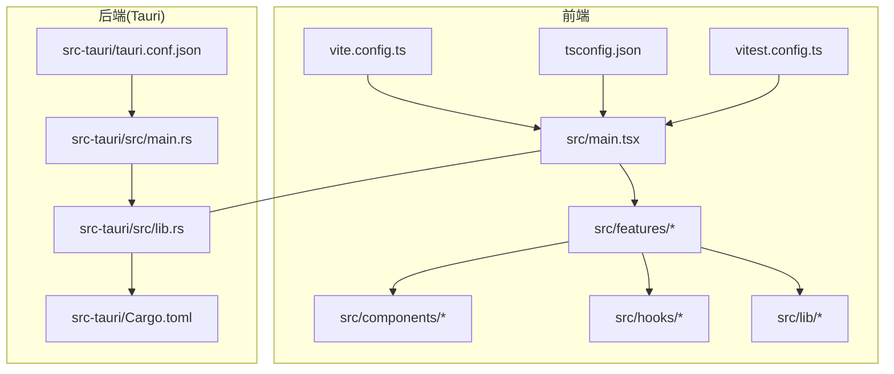
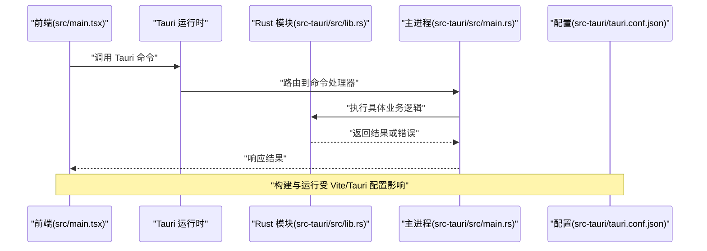
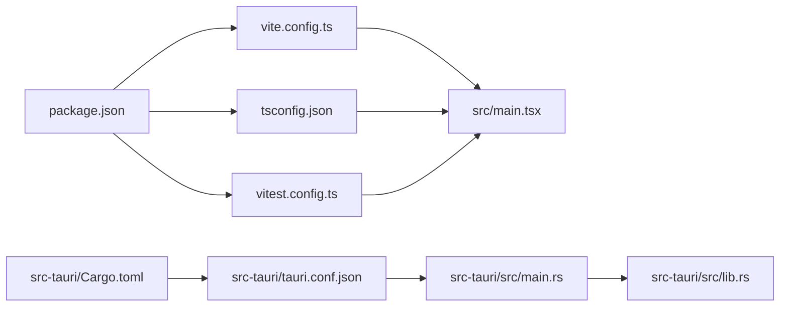

# 代码规范

<cite>
**本文引用的文件**   
- [package.json](file://package.json)
- [tsconfig.json](file://tsconfig.json)
- [vite.config.ts](file://vite.config.ts)
- [vitest.config.ts](file://vitest.config.ts)
- [src/main.tsx](file://src/main.tsx)
- [src-tauri/Cargo.toml](file://src-tauri/Cargo.toml)
- [src-tauri/src/lib.rs](file://src-tauri/src/lib.rs)
- [src-tauri/src/main.rs](file://src-tauri/src/main.rs)
- [src-tauri/tauri.conf.json](file://src-tauri/tauri.conf.json)
</cite>

## 目录
1. [简介](#简介)
2. [项目结构](#项目结构)
3. [核心组件](#核心组件)
4. [架构总览](#架构总览)
5. [详细组件分析](#详细组件分析)
6. [依赖分析](#依赖分析)
7. [性能考虑](#性能考虑)
8. [故障排查指南](#故障排查指南)
9. [结论](#结论)
10. [附录](#附录)

## 简介
本规范面向 FishWorker 项目的 TypeScript、React 与 Rust 开发，目标是统一团队编码风格、提升可维护性与协作效率。内容覆盖：
- TypeScript 编码规范（类型、模块、命名、错误处理等）
- React 组件开发标准（函数式组件、Hooks、状态管理、样式组织）
- Rust 代码风格约定（Tauri 后端、模块化、错误处理、配置）
- ESLint、Prettier 等工具的配置与使用方式（以仓库现有配置为准）
- Git 工作流规范（分支策略、提交信息格式、代码审查流程）

## 项目结构
FishWorker 采用 Tauri + Vite 的前后端一体化工程结构：
- 前端：TypeScript + React + Vite，按功能域拆分 features，UI 组件位于 components，通用逻辑在 hooks 与 lib
- 后端：Rust (Tauri)，通过 src-tauri 暴露 API，数据库与业务逻辑位于对应模块
- 构建与测试：Vite 构建、Vitest 测试、TS 编译由 tsconfig 控制

图示来源
- [src/main.tsx:1-50](file://src/main.tsx#L1-L50)
- [vite.config.ts:1-50](file://vite.config.ts#L1-L50)
- [tsconfig.json:1-50](file://tsconfig.json#L1-L50)
- [vitest.config.ts:1-50](file://vitest.config.ts#L1-L50)
- [src-tauri/src/main.rs:1-50](file://src-tauri/src/main.rs#L1-L50)
- [src-tauri/src/lib.rs:1-50](file://src-tauri/src/lib.rs#L1-L50)
- [src-tauri/Cargo.toml:1-50](file://src-tauri/Cargo.toml#L1-L50)
- [src-tauri/tauri.conf.json:1-50](file://src-tauri/tauri.conf.json#L1-L50)

章节来源
- [package.json:1-100](file://package.json#L1-L100)
- [tsconfig.json:1-100](file://tsconfig.json#L1-L100)
- [vite.config.ts:1-100](file://vite.config.ts#L1-L100)
- [vitest.config.ts:1-100](file://vitest.config.ts#L1-L100)
- [src/main.tsx:1-100](file://src/main.tsx#L1-L100)
- [src-tauri/Cargo.toml:1-100](file://src-tauri/Cargo.toml#L1-L100)
- [src-tauri/src/lib.rs:1-100](file://src-tauri/src/lib.rs#L1-L100)
- [src-tauri/src/main.rs:1-100](file://src-tauri/src/main.rs#L1-L100)
- [src-tauri/tauri.conf.json:1-100](file://src-tauri/tauri.conf.json#L1-L100)

## 核心组件
本节聚焦工程级关键配置与入口，确保团队对构建、类型系统与运行时行为有一致理解。

- 应用入口与初始化
  - 前端入口：src/main.tsx 负责挂载 React 应用与全局初始化
  - 后端入口：src-tauri/src/main.rs 启动 Tauri 应用并加载能力与插件
  - 模块导出：src-tauri/src/lib.rs 集中导出 Tauri 命令与模块

- 构建与类型系统
  - tsconfig.json：定义 TS 编译选项、路径映射、严格模式等
  - vite.config.ts：Vite 构建配置、插件与代理设置
  - vitest.config.ts：单元测试配置与匹配规则

- 包管理与脚本
  - package.json：依赖、脚本命令、工作区与工作集配置

章节来源
- [src/main.tsx:1-100](file://src/main.tsx#L1-L100)
- [src-tauri/src/main.rs:1-100](file://src-tauri/src/main.rs#L1-L100)
- [src-tauri/src/lib.rs:1-100](file://src-tauri/src/lib.rs#L1-L100)
- [tsconfig.json:1-100](file://tsconfig.json#L1-L100)
- [vite.config.ts:1-100](file://vite.config.ts#L1-L100)
- [vitest.config.ts:1-100](file://vitest.config.ts#L1-L100)
- [package.json:1-100](file://package.json#L1-L100)

## 架构总览
FishWorker 采用前后端分离但同仓管理的架构：前端通过 Tauri 调用 Rust 提供的命令，实现本地数据访问与持久化。

图示来源
- [src/main.tsx:1-100](file://src/main.tsx#L1-L100)
- [src-tauri/src/lib.rs:1-100](file://src-tauri/src/lib.rs#L1-L100)
- [src-tauri/src/main.rs:1-100](file://src-tauri/src/main.rs#L1-L100)
- [src-tauri/tauri.conf.json:1-100](file://src-tauri/tauri.conf.json#L1-L100)

## 详细组件分析

### TypeScript 编码规范
- 类型与接口
  - 优先使用 interface 描述对象形状，type 用于联合、交叉与计算类型
  - 禁止使用 any；必要时使用 unknown 并在入口处收窄
  - 为所有公共 API 提供明确的参数与返回值类型
- 模块与导入
  - 使用相对路径与路径别名（参考 tsconfig 的路径映射）
  - 避免循环依赖；必要时引入中间层或重构
- 命名约定
  - 变量与函数使用小驼峰；类型与接口使用大驼峰
  - 常量使用全大写加下划线
- 错误处理
  - 使用 Result/Either 风格在前端封装异步操作
  - 明确区分用户可见错误与内部错误
- 注释与文档
  - 复杂逻辑添加行内注释；对外 API 使用 JSDoc 或 README 说明

章节来源
- [tsconfig.json:1-100](file://tsconfig.json#L1-L100)
- [vite.config.ts:1-100](file://vite.config.ts#L1-L100)

### React 组件开发标准
- 组件形态
  - 优先使用函数式组件与 Hooks；避免类组件
  - 将 UI 与业务逻辑解耦，逻辑放入自定义 Hook 或 Store
- 状态管理
  - 局部状态使用 useState/useReducer；跨组件状态使用集中式 Store（如 Zustand）
  - 避免在组件中直接操作外部副作用，统一在服务层处理
- 事件与副作用
  - 使用 useCallback/useMemo 优化性能，避免不必要的重渲染
  - 网络请求与本地存储封装在 service 层
- 样式组织
  - 组件样式就近管理（CSS/SCSS），全局样式集中在 styles
  - 使用语义化类名，避免过度嵌套
- 可访问性与国际化
  - 为交互元素提供 aria-* 属性
  - 文本抽离至 i18n 资源文件

章节来源
- [src/main.tsx:1-100](file://src/main.tsx#L1-L100)
- [vite.config.ts:1-100](file://vite.config.ts#L1-L100)

### Rust 代码风格约定（Tauri 后端）
- 模块与导出
  - 在 lib.rs 中集中注册 Tauri 命令与模块，保持清晰的边界
  - 每个功能域独立文件（如 daily_review.rs、list.rs、mission.rs、time_management.rs）
- 错误处理
  - 使用 Result 与自定义错误类型，向上层传播错误上下文
  - 对用户可见的错误进行友好提示
- 配置与能力
  - tauri.conf.json 管理权限、窗口与打包配置
  - capabilities/default.json 声明安全能力
- 命名与可读性
  - 函数与变量使用 snake_case；类型使用 PascalCase
  - 为复杂函数添加注释与示例

章节来源
- [src-tauri/src/lib.rs:1-100](file://src-tauri/src/lib.rs#L1-L100)
- [src-tauri/src/main.rs:1-100](file://src-tauri/src/main.rs#L1-L100)
- [src-tauri/Cargo.toml:1-100](file://src-tauri/Cargo.toml#L1-L100)
- [src-tauri/tauri.conf.json:1-100](file://src-tauri/tauri.conf.json#L1-L100)

### ESLint 与 Prettier 使用规范
- 配置现状
  - 当前仓库未包含独立的 .eslintrc 与 .prettierrc 配置文件
  - 相关规则可能通过 IDE 扩展或 monorepo 工具链继承
- 建议实践
  - 在项目根目录新增统一的 ESLint 与 Prettier 配置，并通过 package.json scripts 集成
  - 在 pre-commit 钩子中自动格式化与校验，保证提交质量
- 编辑器集成
  - VS Code 推荐启用保存时自动修复与格式化
  - 团队统一插件版本，避免差异

章节来源
- [package.json:1-100](file://package.json#L1-L100)

### Git 工作流规范
- 分支策略
  - main：稳定发布分支
  - develop：集成开发分支
  - feature/*：功能分支
  - hotfix/*：紧急修复分支
  - release/*：预发布分支
- 提交信息格式
  - 遵循 Conventional Commits：type(scope): subject
  - type 包括 feat、fix、docs、style、refactor、perf、test、chore、build、ci
- 代码审查流程
  - 所有变更需通过 Pull Request 合并
  - 至少一名 reviewer 批准后方可合并
  - CI 检查通过后才能合入目标分支
- 标签与版本
  - 使用语义化版本号（SemVer）打 tag
  - 发布说明自动生成

[本节为概念性规范，不直接分析具体文件]

## 依赖分析
前端与后端的依赖关系如下：

图示来源
- [package.json:1-100](file://package.json#L1-L100)
- [vite.config.ts:1-100](file://vite.config.ts#L1-L100)
- [tsconfig.json:1-100](file://tsconfig.json#L1-L100)
- [vitest.config.ts:1-100](file://vitest.config.ts#L1-L100)
- [src/main.tsx:1-100](file://src/main.tsx#L1-L100)
- [src-tauri/Cargo.toml:1-100](file://src-tauri/Cargo.toml#L1-L100)
- [src-tauri/tauri.conf.json:1-100](file://src-tauri/tauri.conf.json#L1-L100)
- [src-tauri/src/main.rs:1-100](file://src-tauri/src/main.rs#L1-L100)
- [src-tauri/src/lib.rs:1-100](file://src-tauri/src/lib.rs#L1-L100)

章节来源
- [package.json:1-100](file://package.json#L1-L100)
- [vite.config.ts:1-100](file://vite.config.ts#L1-L100)
- [tsconfig.json:1-100](file://tsconfig.json#L1-L100)
- [vitest.config.ts:1-100](file://vitest.config.ts#L1-L100)
- [src/main.tsx:1-100](file://src/main.tsx#L1-L100)
- [src-tauri/Cargo.toml:1-100](file://src-tauri/Cargo.toml#L1-L100)
- [src-tauri/tauri.conf.json:1-100](file://src-tauri/tauri.conf.json#L1-L100)
- [src-tauri/src/main.rs:1-100](file://src-tauri/src/main.rs#L1-L100)
- [src-tauri/src/lib.rs:1-100](file://src-tauri/src/lib.rs#L1-L100)

## 性能考虑
- 前端
  - 合理使用 useMemo/useCallback 减少重渲染
  - 图片与静态资源按需加载与压缩
  - 列表虚拟化与分页加载
- 后端
  - 数据库查询优化与索引设计
  - 避免阻塞型操作，使用异步 IO
  - 合理划分模块，减少重复计算

[本节为通用指导，不直接分析具体文件]

## 故障排查指南
- 构建失败
  - 检查 tsconfig 与 vite.config 的兼容性
  - 清理缓存后重试构建
- 运行时错误
  - 前端：查看浏览器控制台与网络面板
  - 后端：查看 Tauri 日志与 Rust panic 堆栈
- 权限与能力
  - 确认 tauri.conf.json 与 capabilities 配置正确
- 测试问题
  - 检查 vitest.config 的匹配规则与环境变量

章节来源
- [tsconfig.json:1-100](file://tsconfig.json#L1-L100)
- [vite.config.ts:1-100](file://vite.config.ts#L1-L100)
- [vitest.config.ts:1-100](file://vitest.config.ts#L1-L100)
- [src-tauri/tauri.conf.json:1-100](file://src-tauri/tauri.conf.json#L1-L100)

## 结论
通过统一 TypeScript、React 与 Rust 的编码规范，完善工具链与 Git 工作流，FishWorker 项目可在团队协作中保持一致性与可维护性。建议在后续迭代中逐步落地 ESLint/Prettier 配置与自动化检查，持续改进代码质量。

[本节为总结性内容，不直接分析具体文件]

## 附录
- 术语表
  - Tauri：基于 Rust 的桌面应用框架
  - Vite：现代前端构建工具
  - Vitest：轻量级单元测试框架
- 参考链接
  - 仓库根目录下的 README 与文档

[本节为补充信息，不直接分析具体文件]