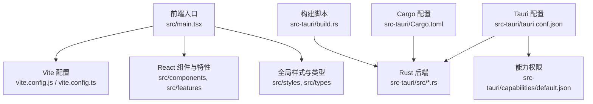
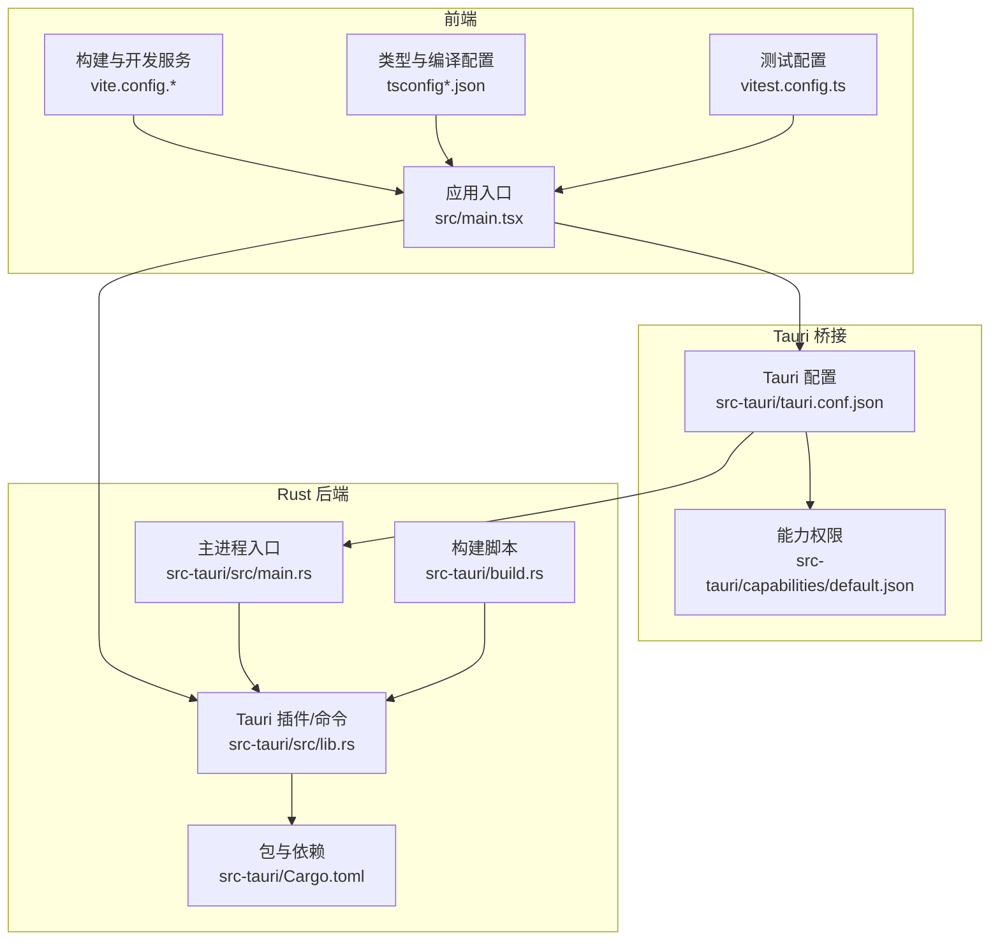
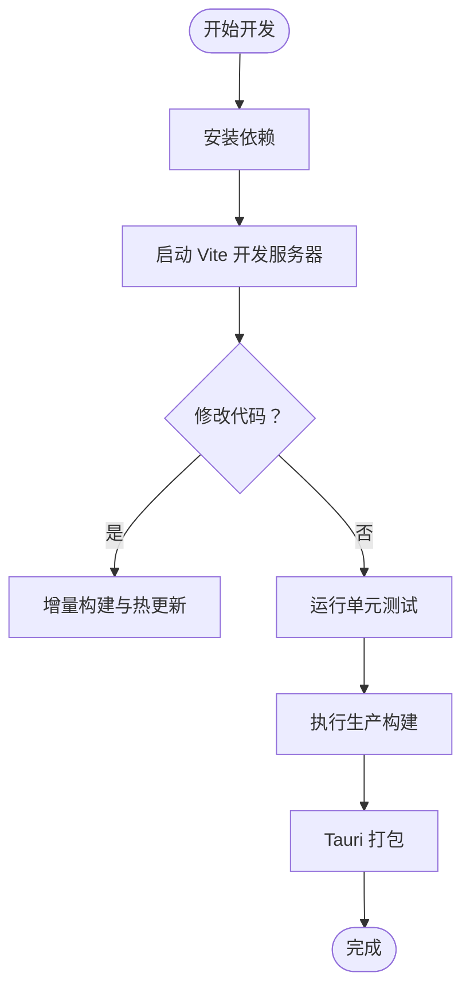
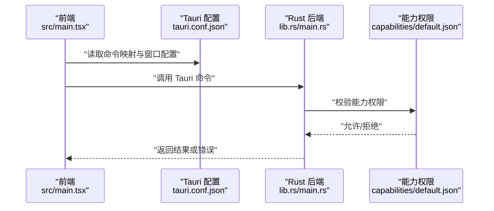
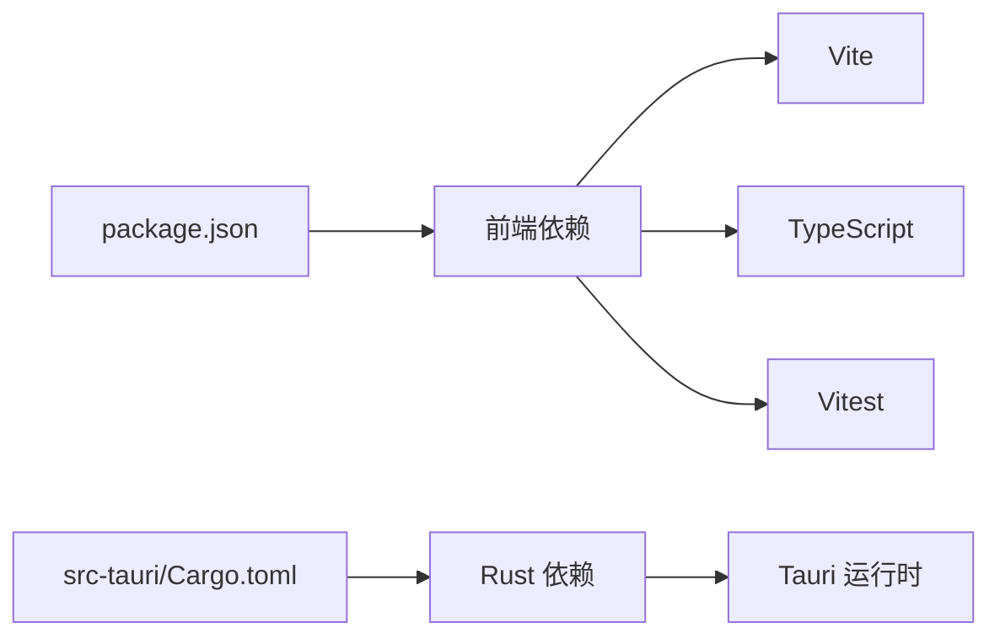

# 开发指南

<cite>
**本文引用的文件**   
- [README.md](file://README.md)
- [package.json](file://package.json)
- [vite.config.js](file://vite.config.js)
- [vite.config.ts](file://vite.config.ts)
- [tsconfig.json](file://tsconfig.json)
- [tsconfig.node.json](file://tsconfig.node.json)
- [vitest.config.ts](file://vitest.config.ts)
- [src/main.tsx](file://src/main.tsx)
- [src-tauri/tauri.conf.json](file://src-tauri/tauri.conf.json)
- [src-tauri/Cargo.toml](file://src-tauri/Cargo.toml)
- [src-tauri/build.rs](file://src-tauri/build.rs)
- [src-tauri/src/lib.rs](file://src-tauri/src/lib.rs)
- [src-tauri/src/main.rs](file://src-tauri/src/main.rs)
- [src-tauri/capabilities/default.json](file://src-tauri/capabilities/default.json)
</cite>

## 目录
1. [简介](#简介)
2. [项目结构](#项目结构)
3. [核心组件](#核心组件)
4. [架构总览](#架构总览)
5. [详细组件分析](#详细组件分析)
6. [依赖分析](#依赖分析)
7. [性能考虑](#性能考虑)
8. [故障排除指南](#故障排除指南)
9. [结论](#结论)
10. [附录](#附录)

## 简介
本指南面向 FishWorker 项目的开发者，覆盖从环境搭建、代码规范、开发工作流到构建打包与调试的全流程。FishWorker 是一个基于 Tauri + Vite + React + TypeScript 的桌面应用，前端使用 Vite 进行开发与构建，后端 Rust 通过 Tauri 暴露能力给前端，提供本地数据与系统级功能集成。

## 项目结构
仓库采用前后端分离的组织方式：
- 前端源码位于 src，包含 React 组件、特性模块（features）、通用样式与工具库；入口为 src/main.tsx。
- 构建配置集中在根目录，包括 Vite、TypeScript、Vitest 等。
- 后端源码位于 src-tauri，遵循 Cargo 工程结构，Tauri 配置在 tauri.conf.json，能力权限在 capabilities/default.json。

图表来源
- [src/main.tsx](file://src/main.tsx)
- [vite.config.js](file://vite.config.js)
- [vite.config.ts](file://vite.config.ts)
- [src-tauri/tauri.conf.json](file://src-tauri/tauri.conf.json)
- [src-tauri/Cargo.toml](file://src-tauri/Cargo.toml)
- [src-tauri/build.rs](file://src-tauri/build.rs)
- [src-tauri/capabilities/default.json](file://src-tauri/capabilities/default.json)

章节来源
- [README.md](file://README.md)
- [package.json](file://package.json)
- [vite.config.js](file://vite.config.js)
- [vite.config.ts](file://vite.config.ts)
- [tsconfig.json](file://tsconfig.json)
- [tsconfig.node.json](file://tsconfig.node.json)
- [vitest.config.ts](file://vitest.config.ts)
- [src/main.tsx](file://src/main.tsx)
- [src-tauri/tauri.conf.json](file://src-tauri/tauri.conf.json)
- [src-tauri/Cargo.toml](file://src-tauri/Cargo.toml)
- [src-tauri/build.rs](file://src-tauri/build.rs)
- [src-tauri/capabilities/default.json](file://src-tauri/capabilities/default.json)

## 核心组件
- 前端运行时
  - 入口与路由挂载点由 src/main.tsx 负责初始化应用。
  - 构建与开发服务器由 Vite 驱动，配置文件见 vite.config.js 或 vite.config.ts。
  - 类型系统与编译选项由 tsconfig.json 与 tsconfig.node.json 管理。
  - 单元测试框架 Vitest 的配置在 vitest.config.ts。
- 后端运行时
  - Tauri 应用配置在 src-tauri/tauri.conf.json，定义窗口、资源路径、命令映射等。
  - Rust 后端逻辑位于 src-tauri/src 下，lib.rs 与 main.rs 分别承载 Tauri 插件与主进程入口。
  - Cargo 包管理与依赖声明在 src-tauri/Cargo.toml。
  - 构建期脚本 build.rs 用于生成或预处理资源。
  - 能力权限控制由 src-tauri/capabilities/default.json 管理。

章节来源
- [src/main.tsx](file://src/main.tsx)
- [vite.config.js](file://vite.config.js)
- [vite.config.ts](file://vite.config.ts)
- [tsconfig.json](file://tsconfig.json)
- [tsconfig.node.json](file://tsconfig.node.json)
- [vitest.config.ts](file://vitest.config.ts)
- [src-tauri/tauri.conf.json](file://src-tauri/tauri.conf.json)
- [src-tauri/Cargo.toml](file://src-tauri/Cargo.toml)
- [src-tauri/build.rs](file://src-tauri/build.rs)
- [src-tauri/src/lib.rs](file://src-tauri/src/lib.rs)
- [src-tauri/src/main.rs](file://src-tauri/src/main.rs)
- [src-tauri/capabilities/default.json](file://src-tauri/capabilities/default.json)

## 架构总览
FishWorker 采用“前端 UI + 后端能力”的分层架构：
- 前端通过 Tauri 的命令通道调用 Rust 提供的能力（如数据库访问、文件系统操作等）。
- Tauri 作为桥接层，将 Rust 函数暴露为 JS 可调用接口，同时管理窗口生命周期与平台差异。
- Vite 负责前端资源的开发时热更新与生产构建。

图表来源
- [src/main.tsx](file://src/main.tsx)
- [vite.config.js](file://vite.config.js)
- [vite.config.ts](file://vite.config.ts)
- [tsconfig.json](file://tsconfig.json)
- [tsconfig.node.json](file://tsconfig.node.json)
- [vitest.config.ts](file://vitest.config.ts)
- [src-tauri/tauri.conf.json](file://src-tauri/tauri.conf.json)
- [src-tauri/capabilities/default.json](file://src-tauri/capabilities/default.json)
- [src-tauri/src/main.rs](file://src-tauri/src/main.rs)
- [src-tauri/src/lib.rs](file://src-tauri/src/lib.rs)
- [src-tauri/Cargo.toml](file://src-tauri/Cargo.toml)
- [src-tauri/build.rs](file://src-tauri/build.rs)

## 详细组件分析

### 前端构建与开发工作流
- 开发模式
  - 使用 Vite 启动开发服务器，支持热重载与快速反馈。
  - 入口文件 src/main.tsx 负责挂载 React 应用。
- 构建产物
  - 生产构建输出静态资源，供 Tauri 打包进桌面应用。
- 类型检查
  - TypeScript 严格模式与路径别名由 tsconfig.json 与 tsconfig.node.json 管理。
- 测试
  - Vitest 配置在 vitest.config.ts，支持单测与覆盖率统计。

章节来源
- [src/main.tsx](file://src/main.tsx)
- [vite.config.js](file://vite.config.js)
- [vite.config.ts](file://vite.config.ts)
- [tsconfig.json](file://tsconfig.json)
- [tsconfig.node.json](file://tsconfig.node.json)
- [vitest.config.ts](file://vitest.config.ts)

### Tauri 后端与命令通道
- 配置与权限
  - tauri.conf.json 定义窗口、资源路径、命令映射与平台相关设置。
  - capabilities/default.json 控制可用能力（如文件系统、网络等）的白名单。
- 后端实现
  - main.rs 作为 Tauri 主进程入口，初始化应用并加载插件。
  - lib.rs 注册 Tauri 命令，暴露给前端调用。
  - Cargo.toml 声明 Rust 依赖与版本约束。
  - build.rs 可在构建阶段生成代码或处理资源。

图表来源
- [src/main.tsx](file://src/main.tsx)
- [src-tauri/tauri.conf.json](file://src-tauri/tauri.conf.json)
- [src-tauri/src/lib.rs](file://src-tauri/src/lib.rs)
- [src-tauri/src/main.rs](file://src-tauri/src/main.rs)
- [src-tauri/capabilities/default.json](file://src-tauri/capabilities/default.json)

章节来源
- [src-tauri/tauri.conf.json](file://src-tauri/tauri.conf.json)
- [src-tauri/src/lib.rs](file://src-tauri/src/lib.rs)
- [src-tauri/src/main.rs](file://src-tauri/src/main.rs)
- [src-tauri/Cargo.toml](file://src-tauri/Cargo.toml)
- [src-tauri/build.rs](file://src-tauri/build.rs)
- [src-tauri/capabilities/default.json](file://src-tauri/capabilities/default.json)

### 代码规范与命名约定
- 文件与模块组织
  - 前端按特性划分 features，组件放在 components，公共样式与类型在 styles 与 types。
  - 后端按职责拆分 .rs 文件，命令集中注册于 lib.rs。
- 命名约定
  - 前端组件使用 PascalCase，Hook 以 use 前缀，常量使用 UPPER_SNAKE_CASE。
  - Rust 模块与函数使用 snake_case，类型与模块名使用 PascalCase。
- 类型与接口
  - 使用 TypeScript 严格模式，避免 any，尽量显式声明类型。
  - 前后端交互的数据模型建议在前端定义类型并在 Rust 侧保持兼容。

章节来源
- [tsconfig.json](file://tsconfig.json)
- [tsconfig.node.json](file://tsconfig.node.json)
- [src/main.tsx](file://src/main.tsx)
- [src-tauri/src/lib.rs](file://src-tauri/src/lib.rs)

### 常用开发命令与工作流
- 安装依赖
  - 使用 pnpm 或 npm 安装项目依赖。
- 开发
  - 启动 Vite 开发服务器，自动打开浏览器预览。
- 测试
  - 运行 Vitest 单测，支持 watch 模式与覆盖率报告。
- 构建与打包
  - 执行生产构建后，使用 Tauri CLI 进行打包与分发。

说明：具体命令请参见 package.json 中的 scripts 字段与 Tauri CLI 文档。

章节来源
- [package.json](file://package.json)

### 构建配置详解
- Vite 配置
  - 开发服务器端口、代理、插件扩展与资源路径在 vite.config.js 或 vite.config.ts 中定义。
  - 生产构建优化项（如代码分割、压缩、Tree Shaking）可通过配置调整。
- Tauri 配置
  - tauri.conf.json 定义应用元信息、窗口大小、图标、资源目录、命令映射与平台特定行为。
  - capabilities/default.json 控制可用能力，按需开启以减少攻击面。
- 构建脚本
  - build.rs 可用于预生成代码、拷贝资源或执行自定义构建步骤。

章节来源
- [vite.config.js](file://vite.config.js)
- [vite.config.ts](file://vite.config.ts)
- [src-tauri/tauri.conf.json](file://src-tauri/tauri.conf.json)
- [src-tauri/capabilities/default.json](file://src-tauri/capabilities/default.json)
- [src-tauri/build.rs](file://src-tauri/build.rs)

### 调试与性能分析
- 前端调试
  - 使用浏览器开发者工具进行断点调试与性能分析。
  - 结合 Vite 的 Source Map 定位问题。
- 后端调试
  - 在 Rust 侧启用日志输出，配合 Tauri 控制台查看错误堆栈。
- 性能分析
  - 前端使用 Performance 面板与 Lighthouse 评估加载与渲染性能。
  - 后端可使用 cargo bench 进行基准测试。

章节来源
- [vite.config.js](file://vite.config.js)
- [vite.config.ts](file://vite.config.ts)
- [src-tauri/src/lib.rs](file://src-tauri/src/lib.rs)

## 依赖分析
- 前端依赖
  - React、Vite、TypeScript、Vitest 为核心依赖，其他第三方库按需引入。
- 后端依赖
  - Tauri 运行时与 Rust 生态库通过 Cargo.toml 管理，确保版本稳定与安全。
- 外部集成
  - 若涉及数据库或网络请求，建议在 Rust 侧封装统一接口，并通过 Tauri 命令暴露。

图表来源
- [package.json](file://package.json)
- [src-tauri/Cargo.toml](file://src-tauri/Cargo.toml)

章节来源
- [package.json](file://package.json)
- [src-tauri/Cargo.toml](file://src-tauri/Cargo.toml)

## 性能考虑
- 前端
  - 合理使用懒加载与代码分割，减少首屏体积。
  - 避免不必要的重渲染，利用 React.memo 与 useMemo/useCallback。
- 后端
  - 对耗时操作使用异步任务，避免阻塞主线程。
  - 合理设计缓存策略，降低重复计算与 IO 开销。
- 构建优化
  - 启用生产构建的压缩与 Tree Shaking。
  - 按需引入第三方库，避免全量引入。

[本节为通用指导，不直接分析具体文件]

## 故障排除指南
- 常见问题
  - 端口占用：修改 Vite 开发服务器端口配置。
  - 权限不足：检查 capabilities/default.json 是否启用了所需能力。
  - 类型错误：确认 tsconfig 严格模式与类型定义一致。
  - 打包失败：检查 Tauri 配置与资源路径是否正确。
- 调试技巧
  - 前端：使用浏览器控制台与 Network 面板排查请求与状态。
  - 后端：在 Rust 侧添加日志输出，定位异常位置。
  - 构建：清理目标目录后重新构建，排除缓存干扰。

章节来源
- [vite.config.js](file://vite.config.js)
- [vite.config.ts](file://vite.config.ts)
- [src-tauri/capabilities/default.json](file://src-tauri/capabilities/default.json)
- [tsconfig.json](file://tsconfig.json)
- [src-tauri/tauri.conf.json](file://src-tauri/tauri.conf.json)

## 结论
FishWorker 采用现代前端与高效后端结合的架构，具备良好的可扩展性与可维护性。通过规范的代码组织、严格的类型系统与完善的构建与测试流程，团队可以高效迭代与交付高质量产品。建议持续优化性能与安全性，完善监控与日志体系，提升用户体验与稳定性。

[本节为总结性内容，不直接分析具体文件]

## 附录
- 参考文档
  - README.md 提供项目背景与概览。
  - Tauri 官方文档与 Vite 文档可作为深入配置的权威参考。
- 最佳实践
  - 小步提交与清晰注释，便于协作与回溯。
  - 自动化测试与代码审查，保障质量与一致性。

章节来源
- [README.md](file://README.md)