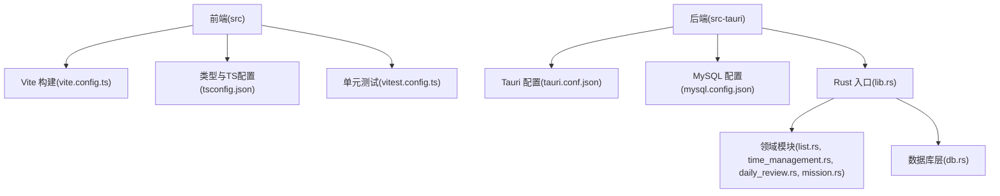
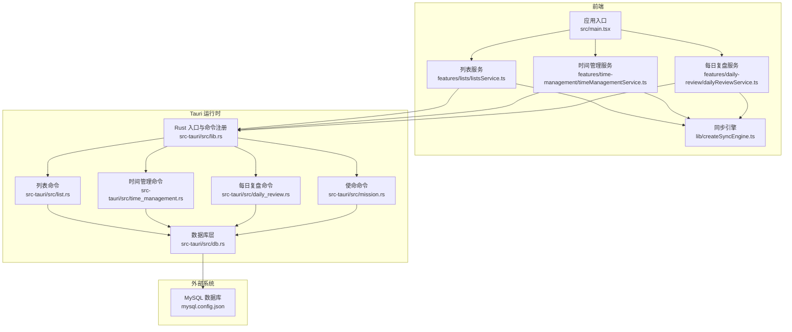
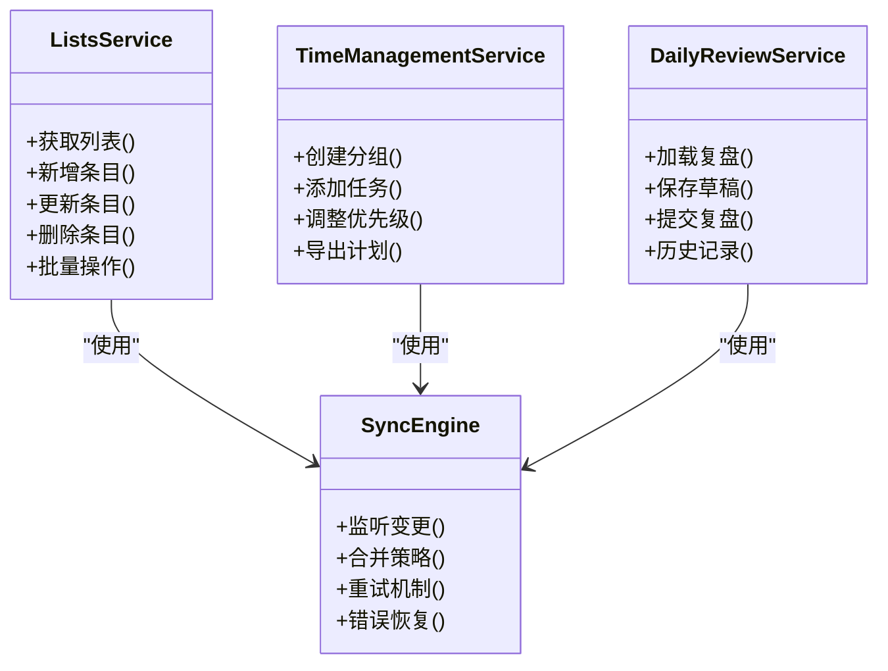
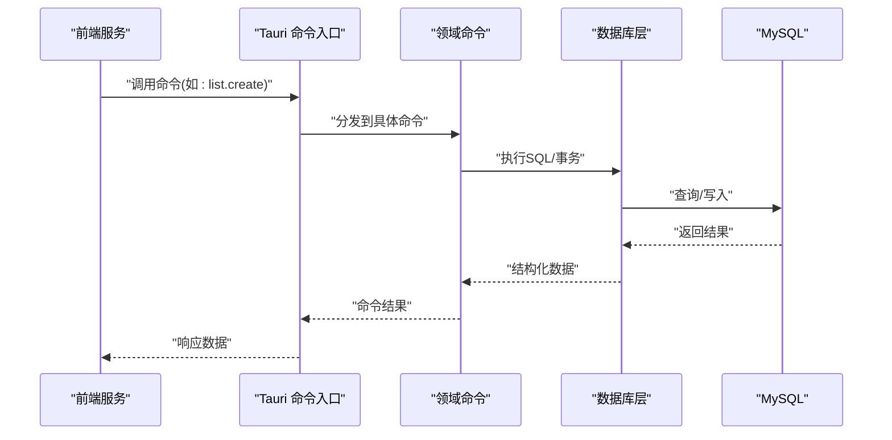
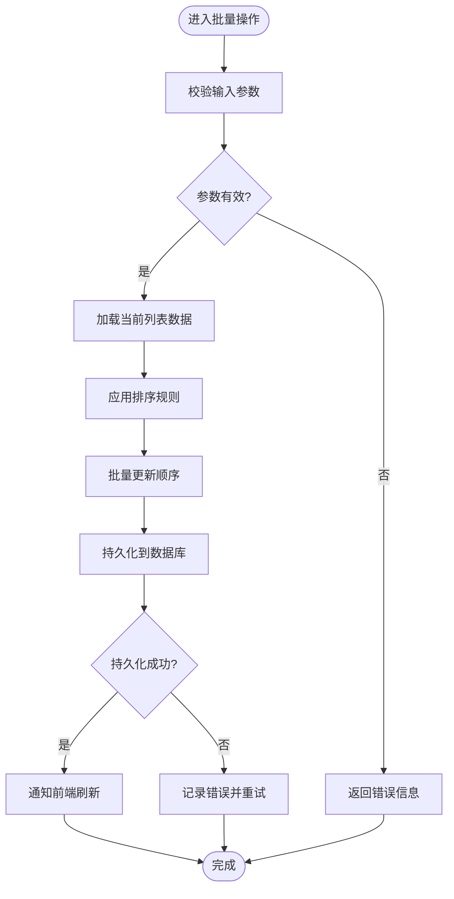
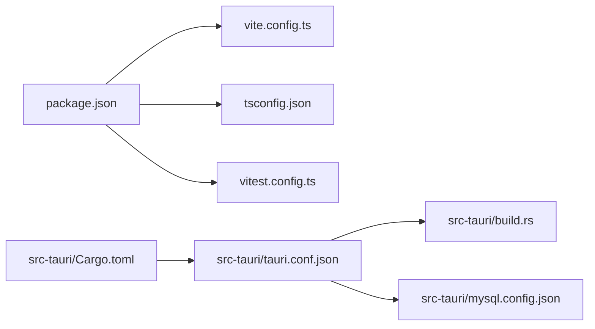

# 开发指南

<cite>
**本文引用的文件**   
- [README.md](file://README.md)
- [package.json](file://package.json)
- [vite.config.ts](file://vite.config.ts)
- [tsconfig.json](file://tsconfig.json)
- [vitest.config.ts](file://vitest.config.ts)
- [src/main.tsx](file://src/main.tsx)
- [src/features/lists/listsService.ts](file://src/features/lists/listsService.ts)
- [src/features/time-management/timeManagementService.ts](file://src/features/time-management/timeManagementService.ts)
- [src/features/daily-review/dailyReviewService.ts](file://src/features/daily-review/dailyReviewService.ts)
- [src/lib/createSyncEngine.ts](file://src/lib/createSyncEngine.ts)
- [src-tauri/Cargo.toml](file://src-tauri/Cargo.toml)
- [src-tauri/tauri.conf.json](file://src-tauri/tauri.conf.json)
- [src-tauri/mysql.config.json](file://src-tauri/mysql.config.json)
- [src-tauri/src/lib.rs](file://src-tauri/src/lib.rs)
- [src-tauri/src/db.rs](file://src-tauri/src/db.rs)
- [src-tauri/src/list.rs](file://src-tauri/src/list.rs)
- [src-tauri/src/time_management.rs](file://src-tauri/src/time_management.rs)
- [src-tauri/src/daily_review.rs](file://src-tauri/src/daily_review.rs)
- [src-tauri/src/mission.rs](file://src-tauri/src/mission.rs)
- [src-tauri/build.rs](file://src-tauri/build.rs)
</cite>

## 目录
1. [简介](#简介)
2. [项目结构](#项目结构)
3. [核心组件](#核心组件)
4. [架构总览](#架构总览)
5. [详细组件分析](#详细组件分析)
6. [依赖分析](#依赖分析)
7. [性能考虑](#性能考虑)
8. [故障排查指南](#故障排查指南)
9. [结论](#结论)
10. [附录](#附录)

## 简介
本指南面向 FishWorker 项目的开发者，覆盖环境搭建、开发工作流、代码规范与最佳实践、调试与性能分析、测试编写、持续集成与自动化部署等关键主题。FishWorker 是一个基于 Tauri（Rust 后端 + Web 前端）的桌面应用，使用 TypeScript/Vite 构建前端，通过 Tauri 命令调用 Rust 后端访问 MySQL 数据库，并提供列表、时间管理、每日复盘、任务使命等多个功能模块。

## 项目结构
仓库采用前后端分离的 Tauri 工程组织方式：
- 前端位于 src 目录，使用 Vite 构建，TypeScript 配置在 tsconfig.json，Vitest 用于单元测试。
- 后端位于 src-tauri 目录，Rust 源码按领域拆分（list、time_management、daily_review、mission），Tauri 配置在 tauri.conf.json，MySQL 连接配置在 mysql.config.json。
- 根目录包含 package.json、pnpm-workspace.yaml、vite.config.ts 等构建与脚本配置。

图表来源
- [vite.config.ts](file://vite.config.ts)
- [tsconfig.json](file://tsconfig.json)
- [vitest.config.ts](file://vitest.config.ts)
- [src-tauri/tauri.conf.json](file://src-tauri/tauri.conf.json)
- [src-tauri/mysql.config.json](file://src-tauri/mysql.config.json)
- [src-tauri/src/lib.rs](file://src-tauri/src/lib.rs)
- [src-tauri/src/db.rs](file://src-tauri/src/db.rs)
- [src-tauri/src/list.rs](file://src-tauri/src/list.rs)
- [src-tauri/src/time_management.rs](file://src-tauri/src/time_management.rs)
- [src-tauri/src/daily_review.rs](file://src-tauri/src/daily_review.rs)
- [src-tauri/src/mission.rs](file://src-tauri/src/mission.rs)

章节来源
- [README.md](file://README.md)
- [package.json](file://package.json)
- [vite.config.ts](file://vite.config.ts)
- [tsconfig.json](file://tsconfig.json)
- [vitest.config.ts](file://vitest.config.ts)
- [src-tauri/Cargo.toml](file://src-tauri/Cargo.toml)
- [src-tauri/tauri.conf.json](file://src-tauri/tauri.conf.json)
- [src-tauri/mysql.config.json](file://src-tauri/mysql.config.json)

## 核心组件
- 前端入口与页面挂载
  - 主入口位于 src/main.tsx，负责初始化应用与渲染根组件。
- 业务服务层
  - 列表模块：src/features/lists/listsService.ts
  - 时间管理模块：src/features/time-management/timeManagementService.ts
  - 每日复盘模块：src/features/daily-review/dailyReviewService.ts
- 同步引擎
  - 通用同步能力封装于 src/lib/createSyncEngine.ts，为各模块提供数据同步与状态管理支持。
- Tauri 后端
  - Rust 入口与命令注册：src-tauri/src/lib.rs
  - 数据库连接与操作：src-tauri/src/db.rs
  - 领域命令实现：src-tauri/src/list.rs、src-tauri/src/time_management.rs、src-tauri/src/daily_review.rs、src-tauri/src/mission.rs
- 构建与运行
  - 前端构建：vite.config.ts
  - 类型与编译：tsconfig.json
  - 测试框架：vitest.config.ts
  - Tauri 打包与权限：src-tauri/tauri.conf.json、src-tauri/build.rs
  - 依赖与脚本：package.json、src-tauri/Cargo.toml

章节来源
- [src/main.tsx](file://src/main.tsx)
- [src/features/lists/listsService.ts](file://src/features/lists/listsService.ts)
- [src/features/time-management/timeManagementService.ts](file://src/features/time-management/timeManagementService.ts)
- [src/features/daily-review/dailyReviewService.ts](file://src/features/daily-review/dailyReviewService.ts)
- [src/lib/createSyncEngine.ts](file://src/lib/createSyncEngine.ts)
- [src-tauri/src/lib.rs](file://src-tauri/src/lib.rs)
- [src-tauri/src/db.rs](file://src-tauri/src/db.rs)
- [src-tauri/src/list.rs](file://src-tauri/src/list.rs)
- [src-tauri/src/time_management.rs](file://src-tauri/src/time_management.rs)
- [src-tauri/src/daily_review.rs](file://src-tauri/src/daily_review.rs)
- [src-tauri/src/mission.rs](file://src-tauri/src/mission.rs)
- [vite.config.ts](file://vite.config.ts)
- [tsconfig.json](file://tsconfig.json)
- [vitest.config.ts](file://vitest.config.ts)
- [src-tauri/tauri.conf.json](file://src-tauri/tauri.conf.json)
- [src-tauri/build.rs](file://src-tauri/build.rs)
- [package.json](file://package.json)
- [src-tauri/Cargo.toml](file://src-tauri/Cargo.toml)

## 架构总览
FishWorker 采用“前端 UI + Tauri 命令 + Rust 后端 + MySQL”的分层架构。前端通过 Tauri 命令调用后端 API，后端执行数据库操作并返回结构化结果；同步引擎在各模块间复用，保证状态一致性与离线可用性。

图表来源
- [src/main.tsx](file://src/main.tsx)
- [src/features/lists/listsService.ts](file://src/features/lists/listsService.ts)
- [src/features/time-management/timeManagementService.ts](file://src/features/time-management/timeManagementService.ts)
- [src/features/daily-review/dailyReviewService.ts](file://src/features/daily-review/dailyReviewService.ts)
- [src/lib/createSyncEngine.ts](file://src/lib/createSyncEngine.ts)
- [src-tauri/src/lib.rs](file://src-tauri/src/lib.rs)
- [src-tauri/src/db.rs](file://src-tauri/src/db.rs)
- [src-tauri/src/list.rs](file://src-tauri/src/list.rs)
- [src-tauri/src/time_management.rs](file://src-tauri/src/time_management.rs)
- [src-tauri/src/daily_review.rs](file://src-tauri/src/daily_review.rs)
- [src-tauri/src/mission.rs](file://src-tauri/src/mission.rs)
- [src-tauri/mysql.config.json](file://src-tauri/mysql.config.json)

## 详细组件分析

### 前端服务层与同步引擎
- 列表服务（listsService.ts）
  - 职责：封装列表数据的增删改查、排序与批量操作，调用 Tauri 命令获取或持久化数据。
  - 交互：通过 createSyncEngine 提供的同步接口，确保本地状态与后端一致性。
- 时间管理服务（timeManagementService.ts）
  - 职责：处理任务分组、日程安排、周计划等逻辑，协调与后端的时间管理命令。
  - 交互：利用同步引擎进行增量更新与冲突解决。
- 每日复盘服务（dailyReviewService.ts）
  - 职责：维护每日复盘内容、自动保存策略与版本历史。
  - 交互：与同步引擎协作，保障编辑过程中的数据安全。
- 同步引擎（createSyncEngine.ts）
  - 职责：抽象数据同步流程，包括变更收集、去重、重试与错误恢复。
  - 复杂度：典型操作为 O(n) 遍历变更集，空间复杂度取决于缓存大小。
  - 优化点：可引入差异合并算法与批处理以提升吞吐。

图表来源
- [src/features/lists/listsService.ts](file://src/features/lists/listsService.ts)
- [src/features/time-management/timeManagementService.ts](file://src/features/time-management/timeManagementService.ts)
- [src/features/daily-review/dailyReviewService.ts](file://src/features/daily-review/dailyReviewService.ts)
- [src/lib/createSyncEngine.ts](file://src/lib/createSyncEngine.ts)

章节来源
- [src/features/lists/listsService.ts](file://src/features/lists/listsService.ts)
- [src/features/time-management/timeManagementService.ts](file://src/features/time-management/timeManagementService.ts)
- [src/features/daily-review/dailyReviewService.ts](file://src/features/daily-review/dailyReviewService.ts)
- [src/lib/createSyncEngine.ts](file://src/lib/createSyncEngine.ts)

### Tauri 后端命令与数据库层
- Rust 入口与命令注册（lib.rs）
  - 职责：初始化 Tauri 应用、注册命令路由、加载配置。
- 数据库层（db.rs）
  - 职责：建立 MySQL 连接池、执行 SQL、事务管理与错误映射。
- 领域命令
  - 列表命令（list.rs）：实现列表相关 CRUD 与排序逻辑。
  - 时间管理命令（time_management.rs）：实现任务与计划的持久化。
  - 每日复盘命令（daily_review.rs）：实现复盘内容的读写与版本控制。
  - 使命命令（mission.rs）：实现目标与角色相关的业务逻辑。

图表来源
- [src-tauri/src/lib.rs](file://src-tauri/src/lib.rs)
- [src-tauri/src/db.rs](file://src-tauri/src/db.rs)
- [src-tauri/src/list.rs](file://src-tauri/src/list.rs)
- [src-tauri/src/time_management.rs](file://src-tauri/src/time_management.rs)
- [src-tauri/src/daily_review.rs](file://src-tauri/src/daily_review.rs)
- [src-tauri/src/mission.rs](file://src-tauri/src/mission.rs)

章节来源
- [src-tauri/src/lib.rs](file://src-tauri/src/lib.rs)
- [src-tauri/src/db.rs](file://src-tauri/src/db.rs)
- [src-tauri/src/list.rs](file://src-tauri/src/list.rs)
- [src-tauri/src/time_management.rs](file://src-tauri/src/time_management.rs)
- [src-tauri/src/daily_review.rs](file://src-tauri/src/daily_review.rs)
- [src-tauri/src/mission.rs](file://src-tauri/src/mission.rs)

### 复杂逻辑流程图（示例：列表排序与批量操作）
以下流程图展示列表模块中常见的排序与批量操作逻辑，便于理解数据流转与边界条件处理。

图表来源
- [src/features/lists/listsService.ts](file://src/features/lists/listsService.ts)
- [src-tauri/src/list.rs](file://src-tauri/src/list.rs)
- [src-tauri/src/db.rs](file://src-tauri/src/db.rs)

章节来源
- [src/features/lists/listsService.ts](file://src/features/lists/listsService.ts)
- [src-tauri/src/list.rs](file://src-tauri/src/list.rs)
- [src-tauri/src/db.rs](file://src-tauri/src/db.rs)

## 依赖分析
- 前端依赖
  - 构建工具：Vite（vite.config.ts）
  - 类型系统：TypeScript（tsconfig.json）
  - 测试框架：Vitest（vitest.config.ts）
  - 包管理：pnpm（pnpm-workspace.yaml）
- 后端依赖
  - 语言与工具链：Rust（Cargo.toml）
  - Tauri 运行时与打包：tauri.conf.json、build.rs
  - 数据库驱动：MySQL（mysql.config.json）

图表来源
- [package.json](file://package.json)
- [vite.config.ts](file://vite.config.ts)
- [tsconfig.json](file://tsconfig.json)
- [vitest.config.ts](file://vitest.config.ts)
- [src-tauri/Cargo.toml](file://src-tauri/Cargo.toml)
- [src-tauri/tauri.conf.json](file://src-tauri/tauri.conf.json)
- [src-tauri/build.rs](file://src-tauri/build.rs)
- [src-tauri/mysql.config.json](file://src-tauri/mysql.config.json)

章节来源
- [package.json](file://package.json)
- [vite.config.ts](file://vite.config.ts)
- [tsconfig.json](file://tsconfig.json)
- [vitest.config.ts](file://vitest.config.ts)
- [src-tauri/Cargo.toml](file://src-tauri/Cargo.toml)
- [src-tauri/tauri.conf.json](file://src-tauri/tauri.conf.json)
- [src-tauri/build.rs](file://src-tauri/build.rs)
- [src-tauri/mysql.config.json](file://src-tauri/mysql.config.json)

## 性能考虑
- 前端
  - 使用 Vite 的按需加载与热更新提升开发体验。
  - 对大数据列表采用虚拟滚动与分页加载，减少 DOM 压力。
  - 同步引擎应合并高频变更，避免频繁网络请求。
- 后端
  - 数据库连接池大小需根据并发量调优。
  - 批量操作尽量使用事务与批量 SQL，降低往返开销。
  - 对热点查询增加索引与缓存策略。
- 跨进程通信
  - Tauri 命令序列化/反序列化成本较高，建议合并小消息为大批次。
  - 避免在主线程执行耗时计算，必要时使用后台任务。

[本节为通用指导，不直接分析具体文件]

## 故障排查指南
- 常见问题定位
  - 前端构建失败：检查 vite.config.ts 与 tsconfig.json 的路径与别名配置。
  - 测试无法运行：确认 vitest.config.ts 的解析器与路径映射。
  - Tauri 命令未注册：核对 lib.rs 中的命令注册与命名空间。
  - 数据库连接失败：验证 mysql.config.json 的连接信息与权限。
- 日志与调试
  - 前端：使用浏览器控制台与网络面板观察请求与错误堆栈。
  - 后端：启用 Tauri 日志输出，结合 Rust 的 tracing/logging 定位问题。
- 回滚与恢复
  - 同步引擎应具备幂等与重试机制，确保异常后可安全恢复。
  - 数据库事务失败时，保持数据一致性并提示用户重试。

章节来源
- [vite.config.ts](file://vite.config.ts)
- [tsconfig.json](file://tsconfig.json)
- [vitest.config.ts](file://vitest.config.ts)
- [src-tauri/src/lib.rs](file://src-tauri/src/lib.rs)
- [src-tauri/mysql.config.json](file://src-tauri/mysql.config.json)

## 结论
FishWorker 以清晰的模块化设计与分层架构为基础，结合 Tauri 的高性能与跨平台能力，提供了稳定的桌面应用体验。遵循本指南的环境搭建、开发流程与最佳实践，将有助于团队高效协作与持续交付。

[本节为总结性内容，不直接分析具体文件]

## 附录

### 环境搭建步骤
- Node.js 与 pnpm
  - 安装 Node.js（推荐 LTS 版本）。
  - 使用 pnpm 作为包管理器，执行依赖安装。
- Rust 与 Tauri CLI
  - 安装 Rust 工具链与 cargo。
  - 安装 Tauri CLI 以便开发与打包。
- MySQL
  - 安装并启动 MySQL 服务。
  - 创建数据库与用户，配置 mysql.config.json 的连接信息。
- 首次运行
  - 安装前端依赖并启动开发服务器。
  - 使用 Tauri 开发模式运行桌面应用。

章节来源
- [package.json](file://package.json)
- [src-tauri/mysql.config.json](file://src-tauri/mysql.config.json)
- [src-tauri/tauri.conf.json](file://src-tauri/tauri.conf.json)

### 开发工作流程
- 代码编写
  - 前端：在 features 目录下按模块划分，服务层与 UI 组件解耦。
  - 后端：在 src-tauri/src 下按领域拆分命令与数据库层。
- 测试
  - 单元测试：使用 Vitest 编写前端测试用例，关注服务层与同步引擎。
  - 集成测试：针对 Tauri 命令与数据库交互编写端到端用例。
- 调试
  - 前端：使用浏览器开发者工具与日志输出。
  - 后端：启用 Tauri 日志，结合 Rust 调试器进行断点调试。
- 构建与发布
  - 前端构建：执行构建命令生成静态资源。
  - 桌面打包：使用 Tauri 打包为平台原生安装包。

章节来源
- [vite.config.ts](file://vite.config.ts)
- [vitest.config.ts](file://vitest.config.ts)
- [src-tauri/tauri.conf.json](file://src-tauri/tauri.conf.json)
- [src-tauri/build.rs](file://src-tauri/build.rs)

### 代码规范与最佳实践
- TypeScript 配置
  - 严格模式开启，统一路径别名与模块解析。
- ESLint 与格式化
  - 在项目根目录配置 ESLint 与 Prettier，统一代码风格。
- Git 工作流
  - 采用分支模型（如 GitFlow），提交信息遵循约定式提交。
  - 使用 pre-commit 钩子进行代码质量检查。

章节来源
- [tsconfig.json](file://tsconfig.json)
- [package.json](file://package.json)

### 调试技巧与性能分析方法
- 前端
  - 使用 React DevTools 分析组件渲染与状态变化。
  - 使用 Performance 面板识别瓶颈与内存泄漏。
- 后端
  - 使用 Rust Profiler 分析 CPU 与内存占用。
  - 监控数据库慢查询与连接池使用情况。

[本节为通用指导，不直接分析具体文件]

### 测试编写指南
- 单元测试
  - 针对服务层函数与同步引擎逻辑编写用例，覆盖正常与异常路径。
  - 使用 Mock 隔离外部依赖（如文件系统与网络）。
- 集成测试
  - 模拟 Tauri 命令调用与数据库交互，验证端到端流程。
  - 使用测试数据库与固定数据集保证可重复性。

章节来源
- [vitest.config.ts](file://vitest.config.ts)
- [src/lib/createSyncEngine.ts](file://src/lib/createSyncEngine.ts)
- [src-tauri/src/db.rs](file://src-tauri/src/db.rs)

### 持续集成与自动化部署
- CI 流水线
  - 安装依赖、运行 lint 与测试、构建前端与打包桌面应用。
- 自动化部署
  - 将构建产物上传至制品库或发布渠道。
  - 使用环境变量管理敏感配置（如数据库连接信息）。

[本节为通用指导，不直接分析具体文件]