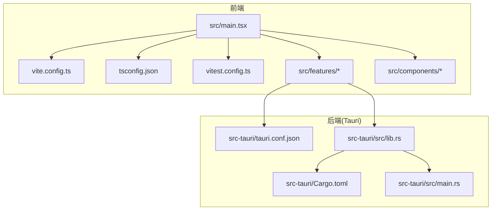
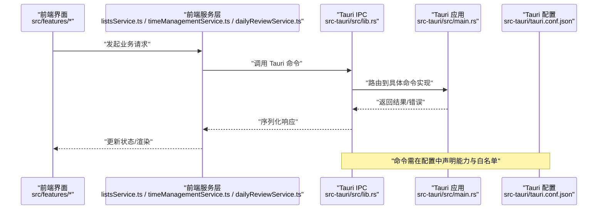
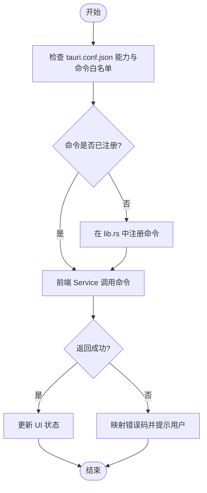
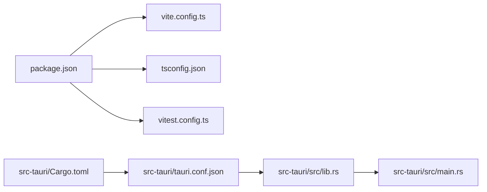

# 开发流程

<cite>
**本文引用的文件**   
- [README.md](file://README.md)
- [package.json](file://package.json)
- [vite.config.ts](file://vite.config.ts)
- [tsconfig.json](file://tsconfig.json)
- [vitest.config.ts](file://vitest.config.ts)
- [src/main.tsx](file://src/main.tsx)
- [src-tauri/Cargo.toml](file://src-tauri/Cargo.toml)
- [src-tauri/tauri.conf.json](file://src-tauri/tauri.conf.json)
- [src-tauri/src/lib.rs](file://src-tauri/src/lib.rs)
- [src-tauri/src/main.rs](file://src-tauri/src/main.rs)
- [src/features/lists/listsService.ts](file://src/features/lists/listsService.ts)
- [src/features/time-management/timeManagementService.ts](file://src/features/time-management/timeManagementService.ts)
- [src/features/daily-review/dailyReviewService.ts](file://src/features/daily-review/dailyReviewService.ts)
</cite>

## 目录
1. [简介](#简介)
2. [项目结构](#项目结构)
3. [核心组件](#核心组件)
4. [架构总览](#架构总览)
5. [详细组件分析](#详细组件分析)
6. [依赖分析](#依赖分析)
7. [性能考虑](#性能考虑)
8. [故障排查指南](#故障排查指南)
9. [结论](#结论)
10. [附录](#附录)

## 简介
本指南面向 FishWorker 项目的开发者，覆盖从需求到提交的完整工作流、日常开发任务（启动、热重载、构建与测试）、前后端协同模式、Tauri IPC 通信调试方法、代码提交规范、分支管理策略、代码审查流程、性能分析与内存泄漏检测工具使用，以及团队协作最佳实践与效率提升技巧。目标是让新成员快速上手，老成员高效协作。

## 项目结构
FishWorker 采用 Tauri + Vite + React 的前后端一体化桌面应用架构：
- 前端：Vite + React + TypeScript，按功能域 features 组织，UI 组件位于 components，通用逻辑在 hooks 与 lib。
- 后端：Rust/Tauri，通过 tauri.conf.json 配置能力与命令路由，业务命令分布在 src-tauri/src/*.rs。
- 工程化：pnpm 包管理，Vitest 单元测试，TS 编译与类型检查由 tsconfig 控制。

图表来源
- [src/main.tsx](file://src/main.tsx)
- [vite.config.ts](file://vite.config.ts)
- [tsconfig.json](file://tsconfig.json)
- [vitest.config.ts](file://vitest.config.ts)
- [src-tauri/tauri.conf.json](file://src-tauri/tauri.conf.json)
- [src-tauri/Cargo.toml](file://src-tauri/Cargo.toml)
- [src-tauri/src/lib.rs](file://src-tauri/src/lib.rs)
- [src-tauri/src/main.rs](file://src-tauri/src/main.rs)

章节来源
- [README.md](file://README.md)
- [package.json](file://package.json)
- [vite.config.ts](file://vite.config.ts)
- [tsconfig.json](file://tsconfig.json)
- [vitest.config.ts](file://vitest.config.ts)
- [src-tauri/tauri.conf.json](file://src-tauri/tauri.conf.json)
- [src-tauri/Cargo.toml](file://src-tauri/Cargo.toml)
- [src-tauri/src/lib.rs](file://src-tauri/src/lib.rs)
- [src-tauri/src/main.rs](file://src-tauri/src/main.rs)

## 核心组件
- 前端入口与构建
  - 入口：src/main.tsx 负责挂载应用与初始化模块。
  - 构建：vite.config.ts 定义开发服务器、代理、插件等；tsconfig.json 统一 TS 编译选项；vitest.config.ts 配置测试运行器。
- 后端入口与能力
  - Tauri 配置：src-tauri/tauri.conf.json 声明能力、窗口、命令白名单等。
  - Rust 入口：src-tauri/src/main.rs 与 src-tauri/src/lib.rs 注册命令、初始化运行时。
  - 依赖：src-tauri/Cargo.toml 声明 Rust 依赖与特性。
- 领域服务层（示例）
  - listsService.ts、timeManagementService.ts、dailyReviewService.ts 封装对 Tauri 后端的调用与数据转换。

章节来源
- [src/main.tsx](file://src/main.tsx)
- [vite.config.ts](file://vite.config.ts)
- [tsconfig.json](file://tsconfig.json)
- [vitest.config.ts](file://vitest.config.ts)
- [src-tauri/tauri.conf.json](file://src-tauri/tauri.conf.json)
- [src-tauri/src/lib.rs](file://src-tauri/src/lib.rs)
- [src-tauri/src/main.rs](file://src-tauri/src/main.rs)
- [src-tauri/Cargo.toml](file://src-tauri/Cargo.toml)
- [src/features/lists/listsService.ts](file://src/features/lists/listsService.ts)
- [src/features/time-management/timeManagementService.ts](file://src/features/time-management/timeManagementService.ts)
- [src/features/daily-review/dailyReviewService.ts](file://src/features/daily-review/dailyReviewService.ts)

## 架构总览
整体为“前端 UI + Tauri 命令 + Rust 业务”的三层架构。前端通过 Tauri IPC 调用后端命令，后端执行数据库或系统级操作并返回结果。

图表来源
- [src/features/lists/listsService.ts](file://src/features/lists/listsService.ts)
- [src/features/time-management/timeManagementService.ts](file://src/features/time-management/timeManagementService.ts)
- [src/features/daily-review/dailyReviewService.ts](file://src/features/daily-review/dailyReviewService.ts)
- [src-tauri/src/lib.rs](file://src-tauri/src/lib.rs)
- [src-tauri/src/main.rs](file://src-tauri/src/main.rs)
- [src-tauri/tauri.conf.json](file://src-tauri/tauri.conf.json)

## 详细组件分析

### 新功能开发全流程
- 需求分析
  - 明确用户故事、验收标准、边界条件与异常路径。
  - 输出最小可验证方案（MVP），标注前后端职责划分。
- 设计阶段
  - 定义 API 契约（前端 Service 与 Tauri 命令接口）。
  - 绘制关键流程图/时序图，确认数据流向与错误处理。
- 环境准备
  - 安装依赖、初始化本地数据库/配置文件（如存在）。
  - 确认 IDE 插件（TS/Vite/Rust/Tauri）与 Lint/格式化规则。
- 分支与任务拆分
  - 基于分支策略创建 feature 分支，拆分为小 PR。
- 实现
  - 先写单测（可选但推荐），再实现服务层与 UI。
  - 同步实现 Tauri 命令与错误码映射。
- 联调与自测
  - 启动开发服务器，进行端到端验证。
  - 覆盖正常路径与异常路径，记录日志以便定位。
- 代码审查与合并
  - 提交前自检（Lint、类型检查、测试）。
  - 发起 PR，完成评审与修复，合入主干。
- 发布与回归
  - 构建产物验证，回归关键用例，必要时打标签。

[本节为方法论说明，不直接分析具体文件]

### 日常开发任务与常用命令
- 安装依赖
  - 使用 pnpm 安装前端依赖。
- 启动开发服务器
  - 启动 Vite 开发服务器，支持热重载。
  - 若需要同时启动 Tauri 后端，参考 package.json 中的脚本组合命令。
- 构建与打包
  - 构建生产版本，生成桌面安装包。
- 测试
  - 运行 Vitest 单测，查看覆盖率报告。
- 类型检查与格式化
  - 执行类型检查与代码格式化，确保一致性。

章节来源
- [package.json](file://package.json)
- [vite.config.ts](file://vite.config.ts)
- [vitest.config.ts](file://vitest.config.ts)
- [tsconfig.json](file://tsconfig.json)

### 前后端协同开发模式
- 约定优先
  - 以 Service 层为契约中心，明确输入输出、错误码与重试策略。
- 并行开发
  - 前端 Mock 后端接口，后端独立实现命令；双方通过契约对齐。
- 联调节奏
  - 每日定时联调，及时暴露接口差异与兼容问题。

章节来源
- [src/features/lists/listsService.ts](file://src/features/lists/listsService.ts)
- [src/features/time-management/timeManagementService.ts](file://src/features/time-management/timeManagementService.ts)
- [src/features/daily-review/dailyReviewService.ts](file://src/features/daily-review/dailyReviewService.ts)
- [src-tauri/src/lib.rs](file://src-tauri/src/lib.rs)

### Tauri IPC 通信调试方法
- 命令注册与能力
  - 确认命令已在 lib.rs 中注册，并在 tauri.conf.json 中声明能力与白名单。
- 前端调用
  - 通过 Service 层调用 Tauri 命令，统一处理成功与失败分支。
- 日志与断点
  - 前端控制台查看网络/IPC 日志；Rust 侧启用日志输出，配合 Tauri 窗口调试。
- 常见问题
  - 权限不足：检查 capabilities 与白名单。
  - 参数序列化：确认前后端类型一致。
  - 跨线程：避免在主线程执行耗时操作。

图表来源
- [src-tauri/tauri.conf.json](file://src-tauri/tauri.conf.json)
- [src-tauri/src/lib.rs](file://src-tauri/src/lib.rs)
- [src/features/lists/listsService.ts](file://src/features/lists/listsService.ts)
- [src/features/time-management/timeManagementService.ts](file://src/features/time-management/timeManagementService.ts)
- [src/features/daily-review/dailyReviewService.ts](file://src/features/daily-review/dailyReviewService.ts)

章节来源
- [src-tauri/tauri.conf.json](file://src-tauri/tauri.conf.json)
- [src-tauri/src/lib.rs](file://src-tauri/src/lib.rs)
- [src/features/lists/listsService.ts](file://src/features/lists/listsService.ts)
- [src/features/time-management/timeManagementService.ts](file://src/features/time-management/timeManagementService.ts)
- [src/features/daily-review/dailyReviewService.ts](file://src/features/daily-review/dailyReviewService.ts)

### 代码提交规范、分支管理与代码审查
- 分支策略
  - main 为主干，feature/* 用于功能开发，hotfix/* 用于紧急修复。
- 提交信息
  - 遵循约定式提交（如 feat/fix/docs/chore），描述变更动机与影响范围。
- 代码审查
  - 每个 PR 至少一名 reviewer，关注契约一致性、错误处理与性能。
- 自动化门禁
  - 提交前运行 Lint、类型检查与测试，确保质量基线。

[本节为方法论说明，不直接分析具体文件]

### 性能分析与内存泄漏检测
- 前端
  - 使用浏览器 DevTools Performance/Memory 面板分析重渲染与内存占用。
  - 结合 React Profiler 定位瓶颈组件。
- 后端
  - 使用 Rust 性能剖析工具（如 cargo bench、perf）评估热点函数。
  - 关注长耗时 I/O 与锁竞争。
- 建议
  - 减少不必要的状态更新，合理拆分组件。
  - 将耗时任务下沉至后端或异步队列。

[本节为方法论说明，不直接分析具体文件]

### 团队协作最佳实践与效率提升
- 文档先行
  - 重要变更附带设计说明与接口文档，保持契约同步。
- 小步快跑
  - 短周期迭代，频繁集成与反馈。
- 知识共享
  - 建立团队 Wiki，沉淀常见问题与解决方案。
- 工具链
  - 统一编辑器配置、预提交钩子与 CI 流水线，减少摩擦。

[本节为方法论说明，不直接分析具体文件]

## 依赖分析
- 前端依赖
  - Vite 作为开发与构建工具，TypeScript 提供类型安全，Vitest 负责测试。
- 后端依赖
  - Tauri 运行时与 Rust 生态库，Cargo 管理依赖。
- 耦合关系
  - 前端通过 Service 层与 Tauri 命令解耦，降低前后端耦合度。

图表来源
- [package.json](file://package.json)
- [vite.config.ts](file://vite.config.ts)
- [tsconfig.json](file://tsconfig.json)
- [vitest.config.ts](file://vitest.config.ts)
- [src-tauri/Cargo.toml](file://src-tauri/Cargo.toml)
- [src-tauri/tauri.conf.json](file://src-tauri/tauri.conf.json)
- [src-tauri/src/lib.rs](file://src-tauri/src/lib.rs)
- [src-tauri/src/main.rs](file://src-tauri/src/main.rs)

章节来源
- [package.json](file://package.json)
- [vite.config.ts](file://vite.config.ts)
- [tsconfig.json](file://tsconfig.json)
- [vitest.config.ts](file://vitest.config.ts)
- [src-tauri/Cargo.toml](file://src-tauri/Cargo.toml)
- [src-tauri/tauri.conf.json](file://src-tauri/tauri.conf.json)
- [src-tauri/src/lib.rs](file://src-tauri/src/lib.rs)
- [src-tauri/src/main.rs](file://src-tauri/src/main.rs)

## 性能考虑
- 前端
  - 合理使用状态管理，避免过度重渲染；按需加载大组件与资源。
  - 列表虚拟化、图片懒加载与缓存策略。
- 后端
  - 数据库查询优化，索引与分页；避免阻塞主线程。
  - 批量操作与事务控制，减少往返次数。
- 监控
  - 埋点关键指标（首屏时间、交互延迟、错误率），持续改进。

[本节为方法论说明，不直接分析具体文件]

## 故障排查指南
- 启动失败
  - 检查端口占用与代理配置；清理缓存后重启。
- 类型错误
  - 统一 TS 配置，确保前后端类型一致；必要时增加校验层。
- IPC 调用失败
  - 核对命令注册与能力声明；查看前后端日志与错误码映射。
- 构建失败
  - 检查依赖版本与平台兼容性；逐步缩小变更范围定位问题。

章节来源
- [vite.config.ts](file://vite.config.ts)
- [tsconfig.json](file://tsconfig.json)
- [src-tauri/tauri.conf.json](file://src-tauri/tauri.conf.json)
- [src-tauri/src/lib.rs](file://src-tauri/src/lib.rs)

## 结论
通过明确的流程、清晰的契约与完善的工具链，FishWorker 项目可实现高效稳定的前后端协同开发。建议持续完善自动化门禁与文档沉淀，推动团队工程化水平不断提升。

[本节为总结性内容，不直接分析具体文件]

## 附录
- 术语表
  - Tauri：跨平台桌面框架，允许前端与 Rust 后端通过 IPC 通信。
  - Vite：现代前端构建工具，提供快速开发与热重载。
  - Vitest：轻量级单元测试框架，与 Vite 生态无缝集成。
- 参考链接
  - 项目 README 与文档目录 docx 下的接口与 PRD 文档。

[本节为补充信息，不直接分析具体文件]