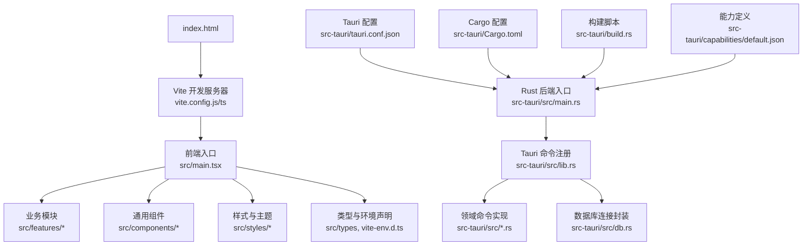
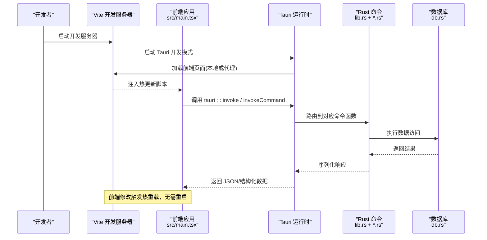
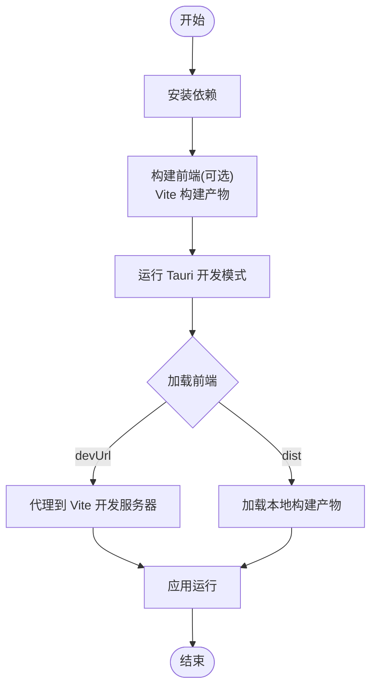
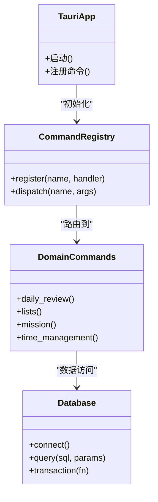
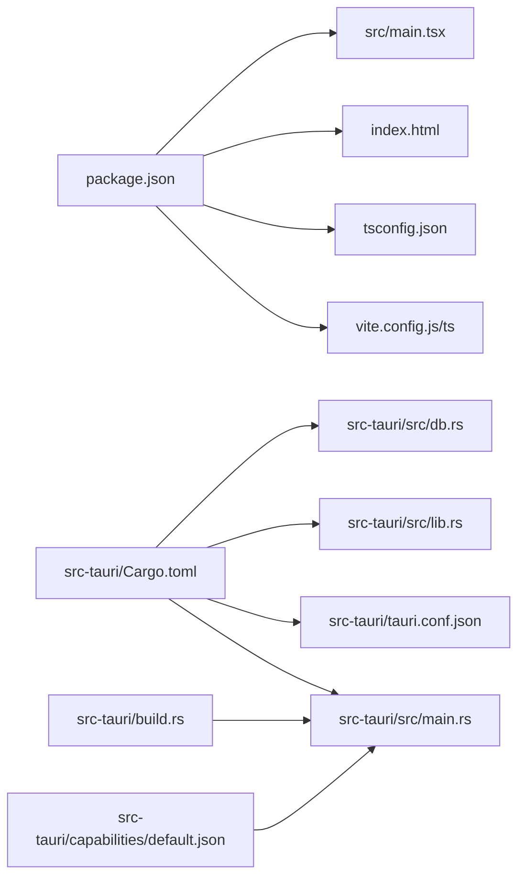

# 开发流程

<cite>
**本文引用的文件**   
- [package.json](file://package.json)
- [vite.config.js](file://vite.config.js)
- [vite.config.ts](file://vite.config.ts)
- [tsconfig.json](file://tsconfig.json)
- [index.html](file://index.html)
- [src/main.tsx](file://src/main.tsx)
- [src-tauri/Cargo.toml](file://src-tauri/Cargo.toml)
- [src-tauri/tauri.conf.json](file://src-tauri/tauri.conf.json)
- [src-tauri/build.rs](file://src-tauri/build.rs)
- [src-tauri/src/lib.rs](file://src-tauri/src/lib.rs)
- [src-tauri/src/main.rs](file://src-tauri/src/main.rs)
- [src-tauri/src/db.rs](file://src-tauri/src/db.rs)
- [src-tauri/capabilities/default.json](file://src-tauri/capabilities/default.json)
</cite>

## 目录
1. [简介](#简介)
2. [项目结构](#项目结构)
3. [核心组件](#核心组件)
4. [架构总览](#架构总览)
5. [详细组件分析](#详细组件分析)
6. [依赖分析](#依赖分析)
7. [性能考虑](#性能考虑)
8. [故障排查指南](#故障排查指南)
9. [结论](#结论)
10. [附录](#附录)

## 简介
本文件面向 FishWorker 项目的开发者，提供从代码编写到构建部署的完整工作流说明。内容覆盖：
- 前端开发服务器启动与热重载
- 后端 Rust 服务运行与 Tauri 集成
- 前后端联调方法与调试技巧
- 日常开发最佳实践与效率工具推荐

FishWorker 采用 Tauri 桌面应用架构：前端基于 Vite + TypeScript/React，后端使用 Rust（Tauri 命令），通过 Tauri 能力与系统资源交互。

## 项目结构
仓库采用“前端源码 src + Tauri 后端 src-tauri”的双仓式组织：
- 前端工程位于根目录，使用 Vite 作为构建与开发服务器，入口为 index.html 与 src/main.tsx
- Tauri 后端位于 src-tauri，包含 Cargo 配置、Rust 源文件、Tauri 配置与能力定义

图表来源
- [index.html:1-200](file://index.html#L1-L200)
- [vite.config.js:1-200](file://vite.config.js#L1-L200)
- [vite.config.ts:1-200](file://vite.config.ts#L1-L200)
- [src/main.tsx:1-200](file://src/main.tsx#L1-L200)
- [src-tauri/tauri.conf.json:1-200](file://src-tauri/tauri.conf.json#L1-L200)
- [src-tauri/src/main.rs:1-200](file://src-tauri/src/main.rs#L1-L200)
- [src-tauri/src/lib.rs:1-200](file://src-tauri/src/lib.rs#L1-L200)
- [src-tauri/src/db.rs:1-200](file://src-tauri/src/db.rs#L1-L200)
- [src-tauri/Cargo.toml:1-200](file://src-tauri/Cargo.toml#L1-L200)
- [src-tauri/build.rs:1-200](file://src-tauri/build.rs#L1-L200)
- [src-tauri/capabilities/default.json:1-200](file://src-tauri/capabilities/default.json#L1-L200)

章节来源
- [package.json:1-200](file://package.json#L1-L200)
- [vite.config.js:1-200](file://vite.config.js#L1-L200)
- [vite.config.ts:1-200](file://vite.config.ts#L1-L200)
- [tsconfig.json:1-200](file://tsconfig.json#L1-L200)
- [index.html:1-200](file://index.html#L1-L200)
- [src/main.tsx:1-200](file://src/main.tsx#L1-L200)
- [src-tauri/Cargo.toml:1-200](file://src-tauri/Cargo.toml#L1-L200)
- [src-tauri/tauri.conf.json:1-200](file://src-tauri/tauri.conf.json#L1-L200)
- [src-tauri/build.rs:1-200](file://src-tauri/build.rs#L1-L200)
- [src-tauri/src/lib.rs:1-200](file://src-tauri/src/lib.rs#L1-L200)
- [src-tauri/src/main.rs:1-200](file://src-tauri/src/main.rs#L1-L200)
- [src-tauri/src/db.rs:1-200](file://src-tauri/src/db.rs#L1-L200)
- [src-tauri/capabilities/default.json:1-200](file://src-tauri/capabilities/default.json#L1-L200)

## 核心组件
- 前端工程
  - 构建与开发：Vite（支持 TS/JSX、SCSS、静态资源处理）
  - 入口：index.html 加载 Vite 客户端；src/main.tsx 初始化应用
  - 状态与服务：按功能域拆分（features），配合 store/service 分层
- Tauri 后端
  - 运行时：Tauri 桌面壳，负责渲染前端并桥接系统能力
  - 命令层：在 lib.rs 中注册命令，具体逻辑分布在各 .rs 文件
  - 数据访问：db.rs 封装数据库连接与常用操作
  - 配置：tauri.conf.json 控制窗口、协议、能力等；capabilities/default.json 声明权限

章节来源
- [vite.config.js:1-200](file://vite.config.js#L1-L200)
- [vite.config.ts:1-200](file://vite.config.ts#L1-L200)
- [src/main.tsx:1-200](file://src/main.tsx#L1-L200)
- [src-tauri/src/lib.rs:1-200](file://src-tauri/src/lib.rs#L1-L200)
- [src-tauri/src/db.rs:1-200](file://src-tauri/src/db.rs#L1-L200)
- [src-tauri/tauri.conf.json:1-200](file://src-tauri/tauri.conf.json#L1-L200)
- [src-tauri/capabilities/default.json:1-200](file://src-tauri/capabilities/default.json#L1-L200)

## 架构总览
下图展示开发模式下的关键路径：Vite 开发服务器提供前端页面与热更新；Tauri 在开发模式下通常直接加载本地构建产物或代理到 Vite 地址；Rust 命令通过 Tauri 暴露给前端调用。

图表来源
- [vite.config.js:1-200](file://vite.config.js#L1-L200)
- [vite.config.ts:1-200](file://vite.config.ts#L1-L200)
- [src/main.tsx:1-200](file://src/main.tsx#L1-L200)
- [src-tauri/src/lib.rs:1-200](file://src-tauri/src/lib.rs#L1-L200)
- [src-tauri/src/db.rs:1-200](file://src-tauri/src/db.rs#L1-L200)
- [src-tauri/tauri.conf.json:1-200](file://src-tauri/tauri.conf.json#L1-L200)

## 详细组件分析

### 前端开发服务器与热重载
- 启动方式
  - 使用包管理器安装依赖后，执行开发脚本以启动 Vite 开发服务器
  - 默认监听本地端口，浏览器自动打开或通过 Tauri 窗口加载
- 热重载机制
  - Vite 在开发模式下注入 HMR 脚本，修改 JS/TSX/SCSS 等资源即时生效
  - 建议开启 sourcemap 以便调试
- 常见配置项
  - 代理后端接口（如需要）
  - 静态资源路径与输出目录
  - 环境变量注入

章节来源
- [package.json:1-200](file://package.json#L1-L200)
- [vite.config.js:1-200](file://vite.config.js#L1-L200)
- [vite.config.ts:1-200](file://vite.config.ts#L1-L200)
- [index.html:1-200](file://index.html#L1-L200)
- [src/main.tsx:1-200](file://src/main.tsx#L1-L200)

### Tauri 应用开发模式
- 开发模式行为
  - Tauri 在开发模式下可加载本地构建产物或直接代理到 Vite 地址
  - 通过 tauri.conf.json 指定 devUrl、build 输出目录等
- 构建产物
  - 前端构建产物由 Vite 生成，Tauri 打包时嵌入
  - build.rs 可用于自定义构建前/后处理
- 能力与权限
  - capabilities/default.json 声明应用所需能力，影响安全策略

图表来源
- [src-tauri/tauri.conf.json:1-200](file://src-tauri/tauri.conf.json#L1-L200)
- [src-tauri/build.rs:1-200](file://src-tauri/build.rs#L1-L200)
- [src-tauri/capabilities/default.json:1-200](file://src-tauri/capabilities/default.json#L1-L200)

章节来源
- [src-tauri/tauri.conf.json:1-200](file://src-tauri/tauri.conf.json#L1-L200)
- [src-tauri/build.rs:1-200](file://src-tauri/build.rs#L1-L200)
- [src-tauri/capabilities/default.json:1-200](file://src-tauri/capabilities/default.json#L1-L200)

### Rust 后端与命令层
- 命令注册
  - 在 lib.rs 中集中注册 Tauri 命令，将前端调用映射到具体函数
- 领域实现
  - 各业务命令分散在独立 .rs 文件中，便于维护与测试
- 数据库访问
  - db.rs 封装连接与查询，供命令层复用
- 错误处理
  - 建议在命令层统一包装错误，返回明确的状态码与消息

图表来源
- [src-tauri/src/lib.rs:1-200](file://src-tauri/src/lib.rs#L1-L200)
- [src-tauri/src/db.rs:1-200](file://src-tauri/src/db.rs#L1-L200)

章节来源
- [src-tauri/src/lib.rs:1-200](file://src-tauri/src/lib.rs#L1-L200)
- [src-tauri/src/db.rs:1-200](file://src-tauri/src/db.rs#L1-L200)
- [src-tauri/Cargo.toml:1-200](file://src-tauri/Cargo.toml#L1-L200)

### 前后端联调方法
- 开发环境
  - 同时启动 Vite 与 Tauri 开发模式，确保 devUrl 指向 Vite 地址
  - 使用浏览器开发者工具观察网络请求与 Tauri 调用栈
- 日志与断点
  - 前端：console.log、断点调试
  - 后端：Rust 日志输出，IDE 断点调试
- 接口契约
  - 明确前后端数据结构与错误码约定，避免联调歧义

章节来源
- [src-tauri/tauri.conf.json:1-200](file://src-tauri/tauri.conf.json#L1-L200)
- [src/main.tsx:1-200](file://src/main.tsx#L1-L200)

### 调试技巧
- 前端
  - 启用 sourcemap，定位 TS/SCSS 源码
  - 使用 React DevTools 检查组件状态
- 后端
  - 在命令函数入口设置断点，追踪参数与返回值
  - 对数据库操作增加事务与回滚保护，便于复现问题
- 全链路
  - 记录关键请求 ID，串联前后端日志

章节来源
- [vite.config.js:1-200](file://vite.config.js#L1-L200)
- [vite.config.ts:1-200](file://vite.config.ts#L1-L200)
- [src-tauri/src/lib.rs:1-200](file://src-tauri/src/lib.rs#L1-L200)

## 依赖分析
- 前端依赖
  - 包管理：pnpm（见 pnpm-lock.yaml、pnpm-workspace.yaml）
  - 构建工具：Vite（vite.config.js/ts）
  - 类型与编译：TypeScript（tsconfig.json）
- 后端依赖
  - 语言与工具链：Rust + Cargo（src-tauri/Cargo.toml）
  - 框架：Tauri（src-tauri/tauri.conf.json）
  - 构建脚本：build.rs

图表来源
- [package.json:1-200](file://package.json#L1-L200)
- [vite.config.js:1-200](file://vite.config.js#L1-L200)
- [vite.config.ts:1-200](file://vite.config.ts#L1-L200)
- [tsconfig.json:1-200](file://tsconfig.json#L1-L200)
- [index.html:1-200](file://index.html#L1-L200)
- [src/main.tsx:1-200](file://src/main.tsx#L1-L200)
- [src-tauri/Cargo.toml:1-200](file://src-tauri/Cargo.toml#L1-L200)
- [src-tauri/tauri.conf.json:1-200](file://src-tauri/tauri.conf.json#L1-L200)
- [src-tauri/src/lib.rs:1-200](file://src-tauri/src/lib.rs#L1-L200)
- [src-tauri/src/main.rs:1-200](file://src-tauri/src/main.rs#L1-L200)
- [src-tauri/src/db.rs:1-200](file://src-tauri/src/db.rs#L1-L200)
- [src-tauri/build.rs:1-200](file://src-tauri/build.rs#L1-L200)
- [src-tauri/capabilities/default.json:1-200](file://src-tauri/capabilities/default.json#L1-L200)

章节来源
- [package.json:1-200](file://package.json#L1-L200)
- [src-tauri/Cargo.toml:1-200](file://src-tauri/Cargo.toml#L1-L200)

## 性能考虑
- 前端
  - 按需引入与代码分割，减少首屏体积
  - 合理使用缓存与懒加载，降低重复计算
- 后端
  - 数据库连接池与批量操作，减少往返开销
  - 命令层避免阻塞主线程，必要时异步化
- 构建
  - 生产构建开启压缩与 Tree-shaking
  - 合理配置 sourcemap 仅在调试环境启用

[本节为通用指导，不直接分析具体文件]

## 故障排查指南
- 常见问题
  - 端口占用：修改 Vite 监听端口或关闭占用进程
  - 跨域与协议：确认 devUrl 与 Tauri 安全策略一致
  - 权限不足：检查 capabilities/default.json 是否声明所需能力
- 快速定位
  - 前端：Network 面板查看失败请求与响应体
  - 后端：在命令入口打印入参与异常堆栈
  - 数据库：核对连接串与表结构变更

章节来源
- [src-tauri/tauri.conf.json:1-200](file://src-tauri/tauri.conf.json#L1-L200)
- [src-tauri/capabilities/default.json:1-200](file://src-tauri/capabilities/default.json#L1-L200)
- [src-tauri/src/lib.rs:1-200](file://src-tauri/src/lib.rs#L1-L200)

## 结论
FishWorker 的开发流程围绕 Vite 与 Tauri 展开：前端享受即时热重载，后端通过命令层提供稳定 API。遵循本文档的流程与最佳实践，可显著提升联调效率与稳定性。

[本节为总结性内容，不直接分析具体文件]

## 附录
- 常用命令
  - 安装依赖：使用 pnpm install
  - 启动前端开发服务器：执行 package.json 中的开发脚本
  - 启动 Tauri 开发模式：执行 Tauri 提供的开发命令
- 配置文件要点
  - vite.config.js/ts：代理、别名、插件
  - tsconfig.json：模块解析、目标版本、严格模式
  - tauri.conf.json：devUrl、窗口、协议、能力
  - capabilities/default.json：最小权限原则

章节来源
- [package.json:1-200](file://package.json#L1-L200)
- [vite.config.js:1-200](file://vite.config.js#L1-L200)
- [vite.config.ts:1-200](file://vite.config.ts#L1-L200)
- [tsconfig.json:1-200](file://tsconfig.json#L1-L200)
- [src-tauri/tauri.conf.json:1-200](file://src-tauri/tauri.conf.json#L1-L200)
- [src-tauri/capabilities/default.json:1-200](file://src-tauri/capabilities/default.json#L1-L200)