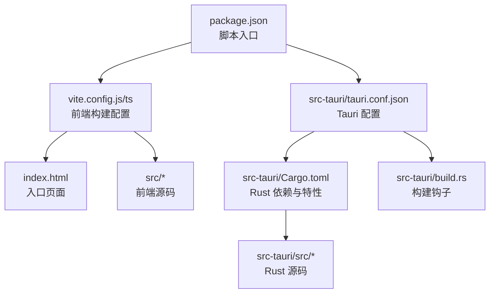
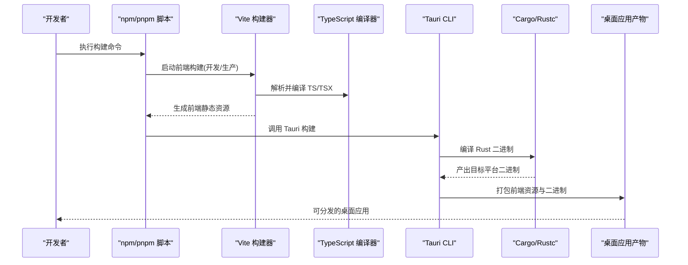
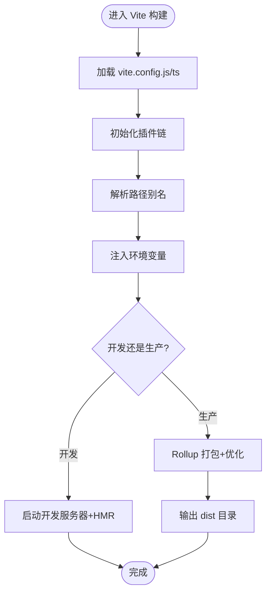
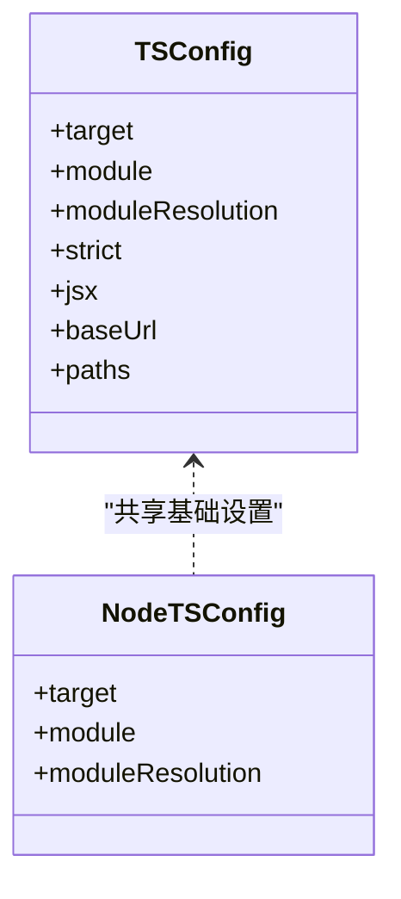
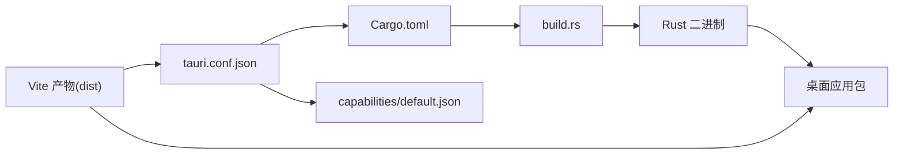
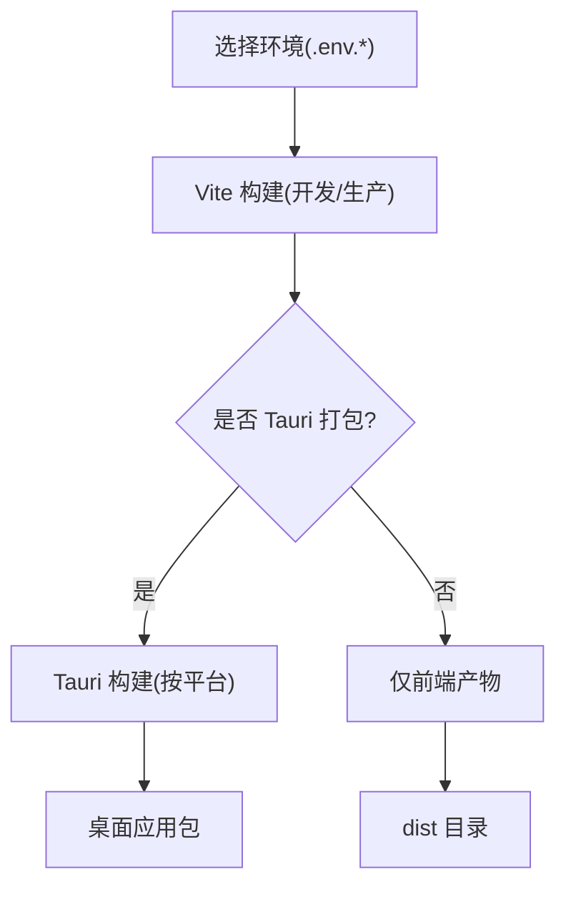
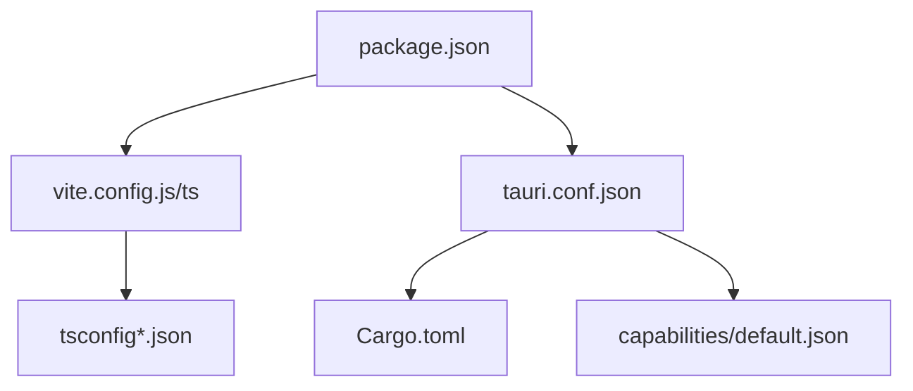

# 构建配置

<cite>
**本文引用的文件**   
- [vite.config.js](file://vite.config.js)
- [vite.config.ts](file://vite.config.ts)
- [tsconfig.json](file://tsconfig.json)
- [tsconfig.node.json](file://tsconfig.node.json)
- [package.json](file://package.json)
- [tauri.conf.json](file://src-tauri/tauri.conf.json)
- [Cargo.toml](file://src-tauri/Cargo.toml)
- [build.rs](file://src-tauri/build.rs)
- [index.html](file://index.html)
</cite>

## 目录
1. [简介](#简介)
2. [项目结构](#项目结构)
3. [核心组件](#核心组件)
4. [架构总览](#架构总览)
5. [详细组件分析](#详细组件分析)
6. [依赖关系分析](#依赖关系分析)
7. [性能考虑](#性能考虑)
8. [故障排查指南](#故障排查指南)
9. [结论](#结论)
10. [附录](#附录)

## 简介
本文件面向 FishWorker 项目的构建系统，聚焦以下方面：
- Vite 前端构建配置（插件、路径别名、环境变量等）
- TypeScript 编译配置（严格模式、模块解析规则）
- Tauri 构建系统（Cargo 配置、Rust 编译优化与打包选项）
- 开发与生产环境的差异化构建策略
- 资源文件的处理与优化
- 自定义构建脚本的编写方法与扩展点
- 构建性能优化技巧与常见问题排查

## 项目结构
FishWorker 采用“前端 + Tauri 桌面壳”的混合工程组织方式。前端基于 Vite + React + TypeScript，后端 Rust 通过 Tauri 暴露能力给前端。关键构建相关根级与 src-tauri 目录如下：
- 根目录
  - vite.config.js / vite.config.ts：Vite 构建配置（存在双版本，需确认实际生效项）
  - tsconfig.json / tsconfig.node.json：TypeScript 编译配置
  - package.json：npm/pnpm 脚本入口
  - index.html：应用入口 HTML
- src-tauri
  - tauri.conf.json：Tauri 应用元数据与打包配置
  - Cargo.toml：Rust 依赖与特性开关
  - build.rs：Rust 构建前/后钩子脚本
  - capabilities/default.json：Tauri 权限能力定义

图表来源
- [package.json](file://package.json)
- [vite.config.js](file://vite.config.js)
- [vite.config.ts](file://vite.config.ts)
- [index.html](file://index.html)
- [tauri.conf.json](file://src-tauri/tauri.conf.json)
- [Cargo.toml](file://src-tauri/Cargo.toml)
- [build.rs](file://src-tauri/build.rs)

章节来源
- [package.json](file://package.json)
- [vite.config.js](file://vite.config.js)
- [vite.config.ts](file://vite.config.ts)
- [tsconfig.json](file://tsconfig.json)
- [tsconfig.node.json](file://tsconfig.node.json)
- [tauri.conf.json](file://src-tauri/tauri.conf.json)
- [Cargo.toml](file://src-tauri/Cargo.toml)
- [build.rs](file://src-tauri/build.rs)
- [index.html](file://index.html)

## 核心组件
本节概述各构建子系统职责与交互关系：
- Vite 前端构建：负责 TS/JS/TSX 编译、样式预处理、静态资源处理、开发服务器与热更新、产物输出与优化。
- TypeScript 编译：提供类型检查、严格模式、模块解析、路径映射等。
- Tauri 构建：将前端产物与 Rust 二进制打包为桌面应用，支持平台特定优化与签名。
- 构建脚本：在 package.json 中编排 dev/build/tauri 命令，串联前后端构建流程。

章节来源
- [package.json](file://package.json)
- [vite.config.js](file://vite.config.js)
- [vite.config.ts](file://vite.config.ts)
- [tsconfig.json](file://tsconfig.json)
- [tsconfig.node.json](file://tsconfig.node.json)
- [tauri.conf.json](file://src-tauri/tauri.conf.json)
- [Cargo.toml](file://src-tauri/Cargo.toml)
- [build.rs](file://src-tauri/build.rs)

## 架构总览
下图展示了从 npm 脚本到最终产物的端到端构建链路，包括 Vite 与 Tauri 的协作。

图表来源
- [package.json](file://package.json)
- [vite.config.js](file://vite.config.js)
- [vite.config.ts](file://vite.config.ts)
- [tauri.conf.json](file://src-tauri/tauri.conf.json)
- [Cargo.toml](file://src-tauri/Cargo.toml)

## 详细组件分析

### Vite 前端构建配置
- 配置文件位置与选择
  - 仓库同时存在 vite.config.js 与 vite.config.ts。请根据实际使用的包管理器与工具链选择其一作为主配置；若两者并存，建议统一为一种格式以避免歧义。
- 插件体系
  - 常见插件包括 React、TypeScript、SCSS、图片/字体资源、代码分割与压缩等。请在配置文件中定位插件数组，按需启用或调整顺序。
- 路径别名
  - 在 resolve.alias 中定义常用路径映射，例如将 @ 指向 src 目录，提升导入可读性与稳定性。
- 环境变量
  - 使用 import.meta.env 读取以 VITE_ 开头的变量。可通过 .env/.env.development/.env.production 管理不同环境。
- 开发服务器与热更新
  - 配置端口、代理、HMR 行为，便于本地联调与跨域请求转发。
- 构建输出与优化
  - 设置 outDir、sourcemap、minify、rollup 优化参数（如代码分割、预加载提示）。
- 资源处理
  - 静态资源放置于 public 或通过 import 引入 assets，自动进行哈希与优化。

图表来源
- [vite.config.js](file://vite.config.js)
- [vite.config.ts](file://vite.config.ts)
- [index.html](file://index.html)

章节来源
- [vite.config.js](file://vite.config.js)
- [vite.config.ts](file://vite.config.ts)
- [index.html](file://index.html)

### TypeScript 编译配置
- 主配置 tsconfig.json
  - 指定 target、module、moduleResolution、strict、jsx、baseUrl、paths 等。
  - strict 模式开启后，包含 noImplicitAny、strictNullChecks、noUnusedLocals 等细粒度开关。
- Node 侧配置 tsconfig.node.json
  - 针对构建脚本与工具链的独立类型与模块解析设置，避免与业务逻辑互相干扰。
- 模块解析与路径映射
  - 通过 baseUrl 与 paths 实现短路径导入，配合 IDE 与 Vite 的解析保持一致。
- 类型声明与环境
  - 在 src/types 与 vite-env.d.ts 中补充第三方库与 Vite 注入的类型。

图表来源
- [tsconfig.json](file://tsconfig.json)
- [tsconfig.node.json](file://tsconfig.node.json)

章节来源
- [tsconfig.json](file://tsconfig.json)
- [tsconfig.node.json](file://tsconfig.node.json)

### Tauri 构建系统与 Rust 集成
- Tauri 配置 tauri.conf.json
  - 定义应用名称、版本、窗口尺寸、图标、前端入口、打包目标平台等。
  - 与 Vite 产物目录关联，确保打包时能正确引用前端资源。
- Cargo 配置 Cargo.toml
  - 声明 tauri 依赖与特性（如系统托盘、通知、数据库驱动等）。
  - 可针对不同 profile 配置优化级别与 LTO、strip 等。
- 构建钩子 build.rs
  - 在构建前后执行自定义逻辑，如生成代码、拷贝资源、校验环境等。
- 能力与权限 capabilities/default.json
  - 控制 Tauri 命令与系统能力的访问范围，遵循最小权限原则。

图表来源
- [tauri.conf.json](file://src-tauri/tauri.conf.json)
- [Cargo.toml](file://src-tauri/Cargo.toml)
- [build.rs](file://src-tauri/build.rs)
- [src-tauri/capabilities/default.json](file://src-tauri/capabilities/default.json)

章节来源
- [tauri.conf.json](file://src-tauri/tauri.conf.json)
- [Cargo.toml](file://src-tauri/Cargo.toml)
- [build.rs](file://src-tauri/build.rs)
- [src-tauri/capabilities/default.json](file://src-tauri/capabilities/default.json)

### 开发与生产环境的构建策略
- 开发环境
  - 使用 Vite 开发服务器，启用 HMR、SourceMap、调试友好配置。
  - 通过 .env.development 注入开发期环境变量。
- 生产环境
  - 关闭 SourceMap 或按需开启，启用代码压缩、Tree Shaking、代码分割。
  - 通过 .env.production 注入生产期环境变量。
- Tauri 打包
  - 先构建前端产物，再调用 Tauri 打包；可按平台分别构建与签名。

图表来源
- [package.json](file://package.json)
- [vite.config.js](file://vite.config.js)
- [vite.config.ts](file://vite.config.ts)
- [tauri.conf.json](file://src-tauri/tauri.conf.json)

章节来源
- [package.json](file://package.json)
- [vite.config.js](file://vite.config.js)
- [vite.config.ts](file://vite.config.ts)
- [tauri.conf.json](file://src-tauri/tauri.conf.json)

### 资源文件的处理与优化
- 静态资源
  - 放入 public 的资源将被原样复制到输出目录，适合 favicon、外部文档等。
- 动态资源
  - 通过 import 引入 assets，Vite 会进行哈希、压缩与懒加载优化。
- 媒体与字体
  - 配置合适的 loader 与缓存策略，减少首屏体积。
- 多语言与主题
  - 可将主题与文案作为资源或模块按需加载，结合路由懒加载降低初始包体。

章节来源
- [index.html](file://index.html)
- [vite.config.js](file://vite.config.js)
- [vite.config.ts](file://vite.config.ts)

### 自定义构建脚本与扩展点
- npm/pnpm 脚本
  - 在 package.json 中定义 dev、build、tauri:dev、tauri:build 等命令，串联 Vite 与 Tauri。
- Vite 插件扩展
  - 通过自定义插件在构建生命周期中插入逻辑（如代码注入、资源替换、统计上报）。
- Tauri 构建钩子
  - 在 build.rs 中执行前置/后置任务，如生成常量、校验依赖、复制资源。
- CI/CD 集成
  - 在流水线中缓存 node_modules 与 Cargo 依赖，并行构建前端与 Rust 二进制。

章节来源
- [package.json](file://package.json)
- [vite.config.js](file://vite.config.js)
- [vite.config.ts](file://vite.config.ts)
- [build.rs](file://src-tauri/build.rs)

## 依赖关系分析
- 前端依赖
  - Vite 生态（React、TypeScript、样式处理器、资源插件）由 vite.config.js/ts 驱动。
- 后端依赖
  - Tauri 与 Rust 标准库及第三方 crate 由 Cargo.toml 管理。
- 交叉依赖
  - tauri.conf.json 桥接前端产物与 Rust 二进制，形成统一的桌面应用。

图表来源
- [package.json](file://package.json)
- [vite.config.js](file://vite.config.js)
- [vite.config.ts](file://vite.config.ts)
- [tsconfig.json](file://tsconfig.json)
- [tsconfig.node.json](file://tsconfig.node.json)
- [tauri.conf.json](file://src-tauri/tauri.conf.json)
- [Cargo.toml](file://src-tauri/Cargo.toml)
- [src-tauri/capabilities/default.json](file://src-tauri/capabilities/default.json)

章节来源
- [package.json](file://package.json)
- [vite.config.js](file://vite.config.js)
- [vite.config.ts](file://vite.config.ts)
- [tsconfig.json](file://tsconfig.json)
- [tsconfig.node.json](file://tsconfig.node.json)
- [tauri.conf.json](file://src-tauri/tauri.conf.json)
- [Cargo.toml](file://src-tauri/Cargo.toml)
- [src-tauri/capabilities/default.json](file://src-tauri/capabilities/default.json)

## 性能考虑
- 前端构建
  - 合理拆分路由与组件，启用代码分割与预加载提示。
  - 按需引入第三方库，避免全量引入导致包体膨胀。
  - 对大图片与字体进行压缩与懒加载。
- 开发体验
  - 使用 HMR、增量编译与缓存，缩短冷启动时间。
- Rust 构建
  - 在生产 profile 启用 LTO、strip 与优化等级，减小二进制体积。
  - 按需启用 Tauri 特性，避免不必要的依赖。
- 缓存与并行
  - 在 CI 中缓存 node_modules 与 Cargo registry，并行构建前端与后端。

[本节为通用指导，不直接分析具体文件]

## 故障排查指南
- 构建失败
  - 检查 Vite 与 Tauri 的版本兼容性，确认 tauri.conf.json 的前端入口与 dist 目录一致。
  - 查看 Cargo 编译日志，定位缺失的系统依赖或工具链问题。
- 运行时错误
  - 确认环境变量是否正确注入（VITE_ 前缀），区分开发/生产环境。
  - 检查 Tauri 权限配置，确保所需能力已开放。
- 性能问题
  - 分析 bundle 大小，定位大依赖并进行按需引入或替换。
  - 评估 Rust 二进制体积，关闭未使用特性或启用 strip/LTO。

章节来源
- [tauri.conf.json](file://src-tauri/tauri.conf.json)
- [Cargo.toml](file://src-tauri/Cargo.toml)
- [vite.config.js](file://vite.config.js)
- [vite.config.ts](file://vite.config.ts)

## 结论
FishWorker 的构建体系以 Vite 为核心，结合 TypeScript 与 Tauri 完成跨平台桌面应用的开发与分发。通过合理的插件与路径配置、严格的类型检查、精细的环境变量管理与 Tauri 的打包能力，可实现高效的开发与稳定的发布流程。建议在团队内统一构建脚本与配置规范，并在 CI 中固化缓存与并行策略，持续提升构建性能与可靠性。

[本节为总结性内容，不直接分析具体文件]

## 附录
- 快速参考
  - 修改前端构建：编辑 vite.config.js/ts
  - 调整类型与模块解析：编辑 tsconfig.json 与 tsconfig.node.json
  - 配置 Tauri 应用与打包：编辑 tauri.conf.json 与 Cargo.toml
  - 添加构建钩子：编辑 build.rs
  - 编排脚本：编辑 package.json

章节来源
- [vite.config.js](file://vite.config.js)
- [vite.config.ts](file://vite.config.ts)
- [tsconfig.json](file://tsconfig.json)
- [tsconfig.node.json](file://tsconfig.node.json)
- [tauri.conf.json](file://src-tauri/tauri.conf.json)
- [Cargo.toml](file://src-tauri/Cargo.toml)
- [build.rs](file://src-tauri/build.rs)
- [package.json](file://package.json)