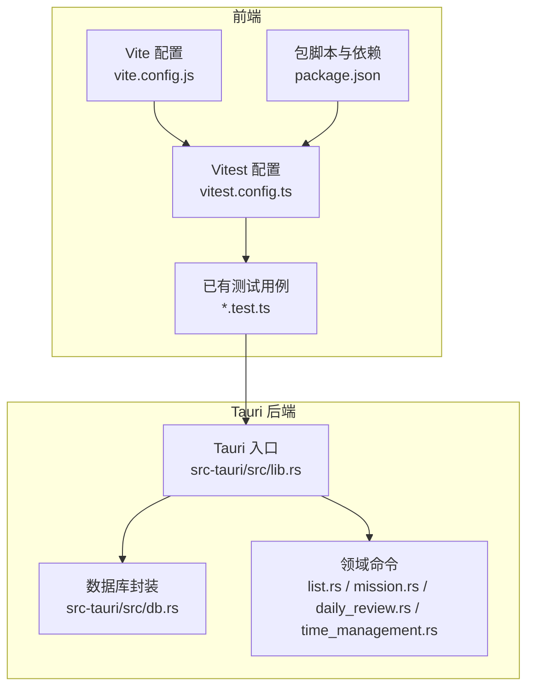
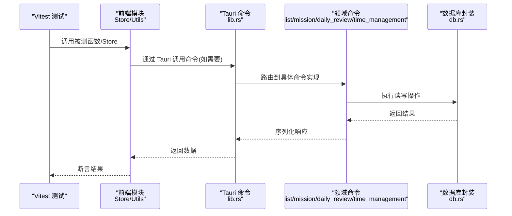
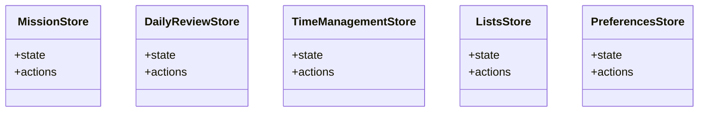
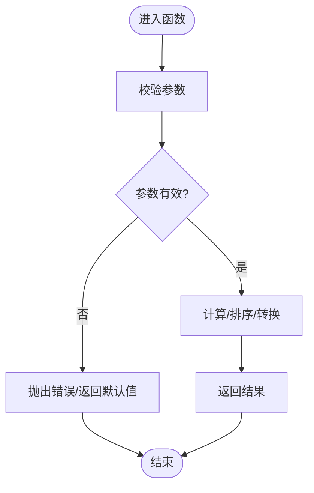
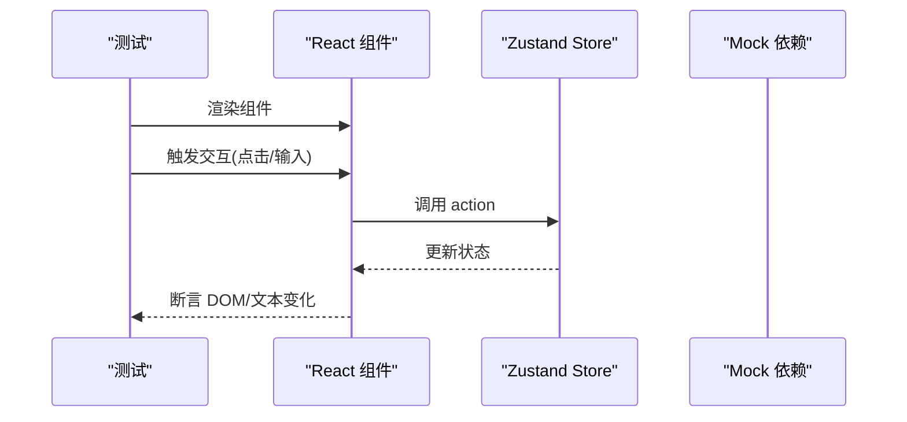
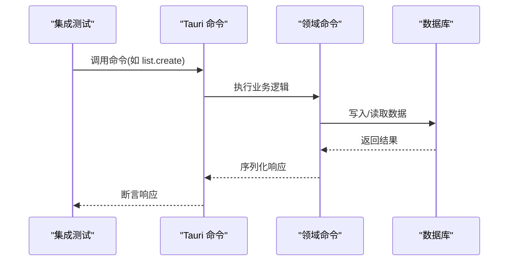
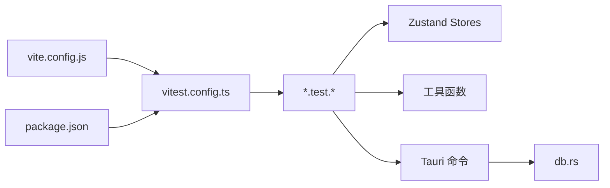

# 测试指南

<cite>
**本文引用的文件**   
- [vitest.config.ts](file://vitest.config.ts)
- [vite.config.js](file://vite.config.js)
- [package.json](file://package.json)
- [MissionStore.test.ts](file://src/features/mission/MissionStore.test.ts)
- [listsReorder.test.ts](file://src/features/lists/listsReorder.test.ts)
- [createSyncEngine.test.ts](file://src/lib/createSyncEngine.test.ts)
- [MissionStore.ts](file://src/features/mission/MissionStore.ts)
- [listsReorder.ts](file://src/features/lists/listsReorder.ts)
- [createSyncEngine.ts](file://src/lib/createSyncEngine.ts)
- [dailyReviewStore.ts](file://src/features/daily-review/dailyReviewStore.ts)
- [timeManagementStore.ts](file://src/features/time-management/timeManagementStore.ts)
- [listsStore.ts](file://src/features/lists/listsStore.ts)
- [preferencesStore.ts](file://src/features/settings/preferencesStore.ts)
- [lib.rs](file://src-tauri/src/lib.rs)
- [db.rs](file://src-tauri/src/db.rs)
- [list.rs](file://src-tauri/src/list.rs)
- [mission.rs](file://src-tauri/src/mission.rs)
- [daily_review.rs](file://src-tauri/src/daily_review.rs)
- [time_management.rs](file://src-tauri/src/time_management.rs)
</cite>

## 目录
1. [简介](#简介)
2. [项目结构](#项目结构)
3. [核心组件](#核心组件)
4. [架构总览](#架构总览)
5. [详细组件分析](#详细组件分析)
6. [依赖分析](#依赖分析)
7. [性能考虑](#性能考虑)
8. [故障排查指南](#故障排查指南)
9. [结论](#结论)
10. [附录](#附录)

## 简介
本指南面向 FishWorker 项目的测试实践，覆盖单元测试、集成测试与端到端测试的编写方法与最佳实践。基于仓库中现有的 Vitest 配置与已有测试文件，提供可操作的示例路径与策略说明，并给出针对 React 组件、Zustand store、Tauri 命令与数据库操作的具体测试建议。同时包含覆盖率要求与持续集成中的测试策略建议。

## 项目结构
FishWorker 采用前端 TypeScript + React（Vite）+ Tauri（Rust）的混合架构：
- 前端使用 Vite 构建，测试框架为 Vitest；部分功能模块已包含 .test.ts 文件。
- 后端通过 Tauri 暴露 Rust 命令，负责持久化与系统级能力。
- 现有测试主要位于 src 目录下，按特性或库组织。

图表来源
- [vitest.config.ts](file://vitest.config.ts)
- [vite.config.js](file://vite.config.js)
- [package.json](file://package.json)
- [lib.rs](file://src-tauri/src/lib.rs)
- [db.rs](file://src-tauri/src/db.rs)
- [list.rs](file://src-tauri/src/list.rs)
- [mission.rs](file://src-tauri/src/mission.rs)
- [daily_review.rs](file://src-tauri/src/daily_review.rs)
- [time_management.rs](file://src-tauri/src/time_management.rs)

章节来源
- [vitest.config.ts](file://vitest.config.ts)
- [vite.config.js](file://vite.config.js)
- [package.json](file://package.json)

## 核心组件
本节聚焦现有测试与关键被测对象，梳理其职责与测试切入点。

- 已有测试文件
  - MissionStore.test.ts：对任务目标状态管理进行单测
  - listsReorder.test.ts：对列表重排算法进行单测
  - createSyncEngine.test.ts：对同步引擎初始化逻辑进行单测

- 关键被测对象
  - Zustand Store：MissionStore.ts、dailyReviewStore.ts、timeManagementStore.ts、listsStore.ts、preferencesStore.ts
  - 工具函数：listsReorder.ts、createSyncEngine.ts
  - Tauri 命令：lib.rs 注册命令，具体实现位于 list.rs、mission.rs、daily_review.rs、time_management.rs
  - 数据库层：db.rs

章节来源
- [MissionStore.test.ts](file://src/features/mission/MissionStore.test.ts)
- [listsReorder.test.ts](file://src/features/lists/listsReorder.test.ts)
- [createSyncEngine.test.ts](file://src/lib/createSyncEngine.test.ts)
- [MissionStore.ts](file://src/features/mission/MissionStore.ts)
- [listsReorder.ts](file://src/features/lists/listsReorder.ts)
- [createSyncEngine.ts](file://src/lib/createSyncEngine.ts)
- [dailyReviewStore.ts](file://src/features/daily-review/dailyReviewStore.ts)
- [timeManagementStore.ts](file://src/features/time-management/timeManagementStore.ts)
- [listsStore.ts](file://src/features/lists/listsStore.ts)
- [preferencesStore.ts](file://src/features/settings/preferencesStore.ts)
- [lib.rs](file://src-tauri/src/lib.rs)
- [db.rs](file://src-tauri/src/db.rs)
- [list.rs](file://src-tauri/src/list.rs)
- [mission.rs](file://src-tauri/src/mission.rs)
- [daily_review.rs](file://src-tauri/src/daily_review.rs)
- [time_management.rs](file://src-tauri/src/time_management.rs)

## 架构总览
下图展示从前端测试到 Tauri 命令与数据库层的调用关系，便于理解测试边界与隔离点。

图表来源
- [lib.rs](file://src-tauri/src/lib.rs)
- [list.rs](file://src-tauri/src/list.rs)
- [mission.rs](file://src-tauri/src/mission.rs)
- [daily_review.rs](file://src-tauri/src/daily_review.rs)
- [time_management.rs](file://src-tauri/src/time_management.rs)
- [db.rs](file://src-tauri/src/db.rs)

## 详细组件分析

### 单元测试：Zustand Store
- 目标
  - 验证状态变更的正确性、副作用触发时机、选择器返回值。
- 建议方法
  - 使用 zustand/testing 提供的 renderHook 与 act 模拟渲染与更新。
  - 将外部依赖（网络、文件系统、Tauri 命令）通过 mock 替换，确保纯逻辑可测。
  - 对复杂状态快照使用 toBe 或自定义比较器。
- 参考路径
  - [MissionStore.test.ts](file://src/features/mission/MissionStore.test.ts)
  - [MissionStore.ts](file://src/features/mission/MissionStore.ts)
  - [dailyReviewStore.ts](file://src/features/daily-review/dailyReviewStore.ts)
  - [timeManagementStore.ts](file://src/features/time-management/timeManagementStore.ts)
  - [listsStore.ts](file://src/features/lists/listsStore.ts)
  - [preferencesStore.ts](file://src/features/settings/preferencesStore.ts)

图表来源
- [MissionStore.ts](file://src/features/mission/MissionStore.ts)
- [dailyReviewStore.ts](file://src/features/daily-review/dailyReviewStore.ts)
- [timeManagementStore.ts](file://src/features/time-management/timeManagementStore.ts)
- [listsStore.ts](file://src/features/lists/listsStore.ts)
- [preferencesStore.ts](file://src/features/settings/preferencesStore.ts)

章节来源
- [MissionStore.test.ts](file://src/features/mission/MissionStore.test.ts)
- [MissionStore.ts](file://src/features/mission/MissionStore.ts)
- [dailyReviewStore.ts](file://src/features/daily-review/dailyReviewStore.ts)
- [timeManagementStore.ts](file://src/features/time-management/timeManagementStore.ts)
- [listsStore.ts](file://src/features/lists/listsStore.ts)
- [preferencesStore.ts](file://src/features/settings/preferencesStore.ts)

### 单元测试：工具函数与算法
- 目标
  - 验证纯函数的输入输出、边界条件与异常分支。
- 建议方法
  - 构造多组输入（正常、边界、非法），断言返回值与副作用。
  - 对时间相关逻辑使用虚拟时钟或固定时间源。
- 参考路径
  - [listsReorder.test.ts](file://src/features/lists/listsReorder.test.ts)
  - [listsReorder.ts](file://src/features/lists/listsReorder.ts)
  - [createSyncEngine.test.ts](file://src/lib/createSyncEngine.test.ts)
  - [createSyncEngine.ts](file://src/lib/createSyncEngine.ts)

图表来源
- [listsReorder.ts](file://src/features/lists/listsReorder.ts)
- [createSyncEngine.ts](file://src/lib/createSyncEngine.ts)

章节来源
- [listsReorder.test.ts](file://src/features/lists/listsReorder.test.ts)
- [listsReorder.ts](file://src/features/lists/listsReorder.ts)
- [createSyncEngine.test.ts](file://src/lib/createSyncEngine.test.ts)
- [createSyncEngine.ts](file://src/lib/createSyncEngine.ts)

### 单元测试：React 组件
- 目标
  - 验证渲染结果、交互行为与状态联动。
- 建议方法
  - 使用 @testing-library/react 渲染组件，配合 user-event 模拟用户操作。
  - 对异步更新使用 waitFor 或 findBy* 查询。
  - 对外部依赖（store、API、Tauri）进行 mock。
- 参考路径
  - 可在 features 下对应组件目录新增 *.test.tsx 文件，例如：
    - [HabitPanel.tsx](file://src/features/habits/HabitPanel.tsx)
    - [MissionPanel.tsx](file://src/features/mission/MissionPanel.tsx)
    - [TimeManagementPanel.tsx](file://src/features/time-management/TimeManagementPanel.tsx)
    - [ListsPanel.tsx](file://src/features/lists/ListsPanel.tsx)

[此图为概念流程，不直接映射具体源码文件]

### 集成测试：Tauri 命令与数据库
- 目标
  - 验证前端到 Tauri 命令再到数据库的完整链路。
- 建议方法
  - 在 Node/Vitest 环境下，避免真实 GUI，仅调用 Tauri 命令接口。
  - 对 db.rs 的底层连接进行替换（内存数据库或测试夹具）。
  - 使用事务与回滚保证测试环境幂等。
- 参考路径
  - [lib.rs](file://src-tauri/src/lib.rs)
  - [list.rs](file://src-tauri/src/list.rs)
  - [mission.rs](file://src-tauri/src/mission.rs)
  - [daily_review.rs](file://src-tauri/src/daily_review.rs)
  - [time_management.rs](file://src-tauri/src/time_management.rs)
  - [db.rs](file://src-tauri/src/db.rs)

图表来源
- [lib.rs](file://src-tauri/src/lib.rs)
- [list.rs](file://src-tauri/src/list.rs)
- [mission.rs](file://src-tauri/src/mission.rs)
- [daily_review.rs](file://src-tauri/src/daily_review.rs)
- [time_management.rs](file://src-tauri/src/time_management.rs)
- [db.rs](file://src-tauri/src/db.rs)

### 端到端测试（E2E）
- 目标
  - 验证用户场景在真实桌面应用中的闭环体验。
- 建议方法
  - 使用 Playwright/Electron/Tauri 自带的 e2e 工具启动应用，驱动界面交互。
  - 以真实数据库实例运行，或使用容器化测试数据库。
  - 设置合理的超时与重试，避免不稳定。
- 参考路径
  - 可在项目根目录新增 e2e 目录与配置文件，结合 package.json 的脚本入口。

[此节为概念性指导，不直接映射具体源码文件]

## 依赖分析
- 测试框架与构建
  - Vitest 作为测试运行时，由 vitest.config.ts 控制匹配规则与环境。
  - Vite 配置用于解析别名与插件，影响测试加载。
  - package.json 定义测试脚本与依赖版本。
- 被测模块耦合
  - Store 之间尽量保持低耦合，必要时通过组合 store 或事件总线解耦。
  - Tauri 命令与 db.rs 的耦合集中在数据访问层，可通过接口抽象提升可测性。

图表来源
- [vitest.config.ts](file://vitest.config.ts)
- [vite.config.js](file://vite.config.js)
- [package.json](file://package.json)
- [db.rs](file://src-tauri/src/db.rs)
- [lib.rs](file://src-tauri/src/lib.rs)

章节来源
- [vitest.config.ts](file://vitest.config.ts)
- [vite.config.js](file://vite.config.js)
- [package.json](file://package.json)

## 性能考虑
- 测试并行度
  - 合理设置 Vitest 的并发数，避免 I/O 竞争导致不稳定。
- 资源隔离
  - 每个测试用例使用独立的事务或临时数据，避免相互污染。
- 慢路径优化
  - 对耗时操作（网络、磁盘）进行 mock 或缓存预热。
- 快照与对比
  - 谨慎使用快照，优先断言关键属性，减少维护成本。

[本节为通用建议，不直接分析具体文件]

## 故障排查指南
- 常见问题
  - 测试无法解析模块：检查 vite.config.js 的别名与 Vitest 的 resolve 配置是否一致。
  - Tauri 命令不可用：在 Node 环境中需正确 stub/mock Tauri API 或切换到兼容模式。
  - 数据库连接失败：确认测试数据库地址、凭据与表结构初始化。
- 定位技巧
  - 缩小范围：先复现最小用例，逐步添加依赖。
  - 日志与断点：在关键路径打印上下文信息，辅助定位。
  - 隔离外部依赖：将网络、文件系统、Tauri 命令全部替换为可控桩。

[本节为通用建议，不直接分析具体文件]

## 结论
通过分层测试策略（单元、集成、端到端）与清晰的依赖隔离，FishWorker 可以在保证质量的同时快速迭代。建议以现有测试为起点，逐步扩展至更多 Store、组件与 Tauri 命令，并建立覆盖率基线与 CI 门禁。

## 附录

### 覆盖率要求与报告
- 推荐阈值
  - 语句/分支/函数/行覆盖率均不低于 80%。
- 生成方式
  - 在 Vitest 中启用 coverage 选项，输出 HTML 或 JSON 报告。
- 基线维护
  - 提交覆盖率报告到制品库，CI 中比对阈值。

[本节为通用建议，不直接分析具体文件]

### 持续集成中的测试策略
- 阶段划分
  - 快速反馈：仅运行单元测试与 lint。
  - 深度验证：运行集成测试与少量端到端用例。
- 缓存与并行
  - 缓存依赖与构建产物，并行执行测试套件。
- 失败处理
  - 收集日志与截图，失败时通知团队并保留工件。

[本节为通用建议，不直接分析具体文件]

### 测试用例清单与示例路径
- 单元测试
  - Store：[MissionStore.test.ts](file://src/features/mission/MissionStore.test.ts)、[MissionStore.ts](file://src/features/mission/MissionStore.ts)
  - 工具函数：[listsReorder.test.ts](file://src/features/lists/listsReorder.test.ts)、[listsReorder.ts](file://src/features/lists/listsReorder.ts)
  - 同步引擎：[createSyncEngine.test.ts](file://src/lib/createSyncEngine.test.ts)、[createSyncEngine.ts](file://src/lib/createSyncEngine.ts)
- 集成测试
  - Tauri 命令与数据库：[lib.rs](file://src-tauri/src/lib.rs)、[db.rs](file://src-tauri/src/db.rs)、[list.rs](file://src-tauri/src/list.rs)、[mission.rs](file://src-tauri/src/mission.rs)、[daily_review.rs](file://src-tauri/src/daily_review.rs)、[time_management.rs](file://src-tauri/src/time_management.rs)
- 端到端测试
  - 建议在根目录新增 e2e 目录，并在 package.json 中添加脚本入口。

章节来源
- [MissionStore.test.ts](file://src/features/mission/MissionStore.test.ts)
- [MissionStore.ts](file://src/features/mission/MissionStore.ts)
- [listsReorder.test.ts](file://src/features/lists/listsReorder.test.ts)
- [listsReorder.ts](file://src/features/lists/listsReorder.ts)
- [createSyncEngine.test.ts](file://src/lib/createSyncEngine.test.ts)
- [createSyncEngine.ts](file://src/lib/createSyncEngine.ts)
- [lib.rs](file://src-tauri/src/lib.rs)
- [db.rs](file://src-tauri/src/db.rs)
- [list.rs](file://src-tauri/src/list.rs)
- [mission.rs](file://src-tauri/src/mission.rs)
- [daily_review.rs](file://src-tauri/src/daily_review.rs)
- [time_management.rs](file://src-tauri/src/time_management.rs)