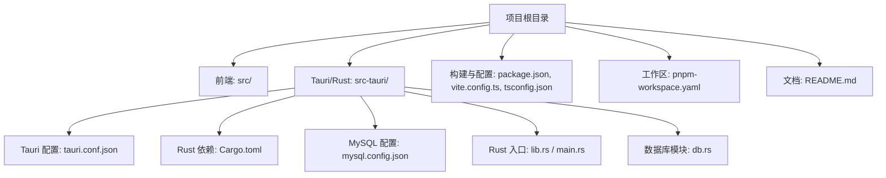
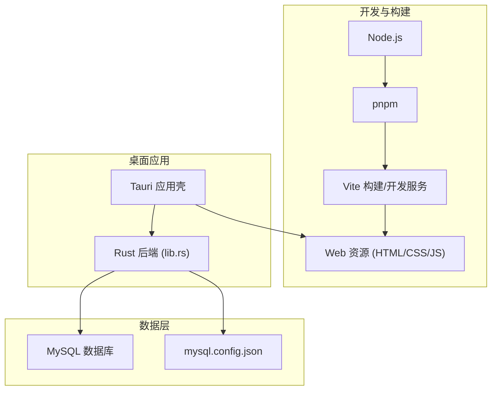
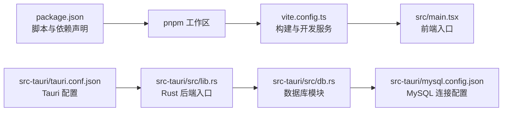

# 环境搭建

<cite>
**本文引用的文件**   
- [README.md](file://README.md)
- [package.json](file://package.json)
- [pnpm-workspace.yaml](file://pnpm-workspace.yaml)
- [vite.config.ts](file://vite.config.ts)
- [tsconfig.json](file://tsconfig.json)
- [src/main.tsx](file://src/main.tsx)
- [src-tauri/Cargo.toml](file://src-tauri/Cargo.toml)
- [src-tauri/tauri.conf.json](file://src-tauri/tauri.conf.json)
- [src-tauri/mysql.config.json](file://src-tauri/mysql.config.json)
- [src-tauri/src/lib.rs](file://src-tauri/src/lib.rs)
- [src-tauri/src/db.rs](file://src-tauri/src/db.rs)
</cite>

## 目录
1. [简介](#简介)
2. [项目结构](#项目结构)
3. [核心组件](#核心组件)
4. [架构总览](#架构总览)
5. [详细组件分析](#详细组件分析)
6. [依赖分析](#依赖分析)
7. [性能考虑](#性能考虑)
8. [故障排除指南](#故障排除指南)
9. [结论](#结论)
10. [附录](#附录)

## 简介
本指南面向首次参与 FishWorker 项目的开发者，目标是帮助你在本地快速、稳定地搭建完整的开发环境。FishWorker 是一个基于 Tauri（Rust 后端 + Web 前端）的桌面应用，使用 Vite 构建前端，pnpm 作为包管理器，MySQL 作为持久化数据库。本文将覆盖 Node.js、pnpm、Rust、MySQL 的安装与配置，以及项目克隆、依赖安装、数据库连接配置等初始化步骤，并提供常见问题排查方法。

## 项目结构
FishWorker 采用前后端分离的 Tauri 工程组织方式：
- 前端代码位于 src 目录，使用 TypeScript/React/Vite 构建
- Rust 后端代码位于 src-tauri 目录，通过 Tauri 能力暴露给前端
- 根目录包含包管理、构建配置与文档

图表来源
- [package.json](file://package.json)
- [vite.config.ts](file://vite.config.ts)
- [tsconfig.json](file://tsconfig.json)
- [pnpm-workspace.yaml](file://pnpm-workspace.yaml)
- [README.md](file://README.md)
- [src-tauri/tauri.conf.json](file://src-tauri/tauri.conf.json)
- [src-tauri/Cargo.toml](file://src-tauri/Cargo.toml)
- [src-tauri/mysql.config.json](file://src-tauri/mysql.config.json)
- [src-tauri/src/lib.rs](file://src-tauri/src/lib.rs)
- [src-tauri/src/db.rs](file://src-tauri/src/db.rs)

章节来源
- [README.md](file://README.md)
- [package.json](file://package.json)
- [pnpm-workspace.yaml](file://pnpm-workspace.yaml)
- [vite.config.ts](file://vite.config.ts)
- [tsconfig.json](file://tsconfig.json)
- [src/main.tsx](file://src/main.tsx)
- [src-tauri/Cargo.toml](file://src-tauri/Cargo.toml)
- [src-tauri/tauri.conf.json](file://src-tauri/tauri.conf.json)
- [src-tauri/mysql.config.json](file://src-tauri/mysql.config.json)
- [src-tauri/src/lib.rs](file://src-tauri/src/lib.rs)
- [src-tauri/src/db.rs](file://src-tauri/src/db.rs)

## 核心组件
- 前端运行时：Vite + React + TypeScript，入口为 src/main.tsx
- 构建与类型：vite.config.ts、tsconfig.json
- 包管理与工作区：pnpm-workspace.yaml、package.json
- Tauri 应用壳：src-tauri/tauri.conf.json、Cargo.toml
- Rust 后端入口：src-tauri/src/lib.rs
- 数据库模块：src-tauri/src/db.rs
- MySQL 连接配置：src-tauri/mysql.config.json

章节来源
- [src/main.tsx](file://src/main.tsx)
- [vite.config.ts](file://vite.config.ts)
- [tsconfig.json](file://tsconfig.json)
- [package.json](file://package.json)
- [pnpm-workspace.yaml](file://pnpm-workspace.yaml)
- [src-tauri/tauri.conf.json](file://src-tauri/tauri.conf.json)
- [src-tauri/Cargo.toml](file://src-tauri/Cargo.toml)
- [src-tauri/src/lib.rs](file://src-tauri/src/lib.rs)
- [src-tauri/src/db.rs](file://src-tauri/src/db.rs)
- [src-tauri/mysql.config.json](file://src-tauri/mysql.config.json)

## 架构总览
下图展示了开发环境与运行时的关键依赖关系：Node.js/pnpm 负责前端构建与脚本执行；Vite 提供开发服务器与打包；Tauri 将 Rust 后端与前端资源集成；Rust 通过 MySQL 驱动访问数据库。

图表来源
- [package.json](file://package.json)
- [vite.config.ts](file://vite.config.ts)
- [src-tauri/tauri.conf.json](file://src-tauri/tauri.conf.json)
- [src-tauri/src/lib.rs](file://src-tauri/src/lib.rs)
- [src-tauri/mysql.config.json](file://src-tauri/mysql.config.json)

## 详细组件分析

### 前置依赖安装与配置
本节按顺序说明各依赖的安装与验证方法。请根据操作系统选择对应命令。

- Node.js
  - 建议版本：参见 package.json 中的引擎要求或官方 LTS 版本
  - 安装后验证：node -v
  - 若需多版本管理，可使用 nvm/nvm-windows

- pnpm
  - 推荐通过 npm 全局安装：npm install -g pnpm
  - 安装后验证：pnpm --version
  - 如需镜像源加速，可配置 .npmrc 或 pnpm 配置

- Rust 工具链
  - 使用 rustup 安装：https://rustup.rs/
  - 安装后验证：rustc --version、cargo --version
  - Windows 需要安装 Visual Studio Build Tools 或 MSVC 编译器

- MySQL
  - 安装并启动 MySQL 服务（推荐使用 8.x）
  - 创建数据库与用户，确保允许本地连接
  - 验证连接：mysql -u <user> -p -h 127.0.0.1 -P 3306

章节来源
- [package.json](file://package.json)

### 项目克隆与初始化
- 克隆仓库到本地
- 进入项目根目录
- 安装前端依赖：pnpm install
- 可选：检查 pnpm 工作区配置是否生效（pnpm-workspace.yaml）

章节来源
- [pnpm-workspace.yaml](file://pnpm-workspace.yaml)
- [package.json](file://package.json)

### 数据库连接配置
- 编辑 MySQL 配置文件：src-tauri/mysql.config.json
  - 填写主机地址、端口、用户名、密码、数据库名等字段
  - 确保与已创建的数据库实例一致
- 在 Rust 后端中加载该配置并进行连接（参考 db.rs 与 lib.rs 的调用位置）
- 启动应用前，确认 MySQL 服务正在运行且网络可达

章节来源
- [src-tauri/mysql.config.json](file://src-tauri/mysql.config.json)
- [src-tauri/src/db.rs](file://src-tauri/src/db.rs)
- [src-tauri/src/lib.rs](file://src-tauri/src/lib.rs)

### 开发模式启动
- 启动前端开发服务器：pnpm dev（或等价脚本）
- 启动 Tauri 开发模式：pnpm tauri dev（或等价脚本）
- 浏览器窗口将自动打开并加载前端页面，同时 Rust 后端进程会被拉起

章节来源
- [package.json](file://package.json)
- [vite.config.ts](file://vite.config.ts)
- [src-tauri/tauri.conf.json](file://src-tauri/tauri.conf.json)

### 生产构建与打包
- 构建前端资源：pnpm build（或等价脚本）
- 打包桌面应用：pnpm tauri build（或等价脚本）
- 产物输出路径请参考 tauri.conf.json 的配置

章节来源
- [package.json](file://package.json)
- [src-tauri/tauri.conf.json](file://src-tauri/tauri.conf.json)

## 依赖分析
下图展示主要依赖关系与职责边界：

图表来源
- [package.json](file://package.json)
- [vite.config.ts](file://vite.config.ts)
- [src/main.tsx](file://src/main.tsx)
- [src-tauri/tauri.conf.json](file://src-tauri/tauri.conf.json)
- [src-tauri/src/lib.rs](file://src-tauri/src/lib.rs)
- [src-tauri/src/db.rs](file://src-tauri/src/db.rs)
- [src-tauri/mysql.config.json](file://src-tauri/mysql.config.json)

章节来源
- [package.json](file://package.json)
- [vite.config.ts](file://vite.config.ts)
- [src/main.tsx](file://src/main.tsx)
- [src-tauri/tauri.conf.json](file://src-tauri/tauri.conf.json)
- [src-tauri/src/lib.rs](file://src-tauri/src/lib.rs)
- [src-tauri/src/db.rs](file://src-tauri/src/db.rs)
- [src-tauri/mysql.config.json](file://src-tauri/mysql.config.json)

## 性能考虑
- 使用 pnpm 提升依赖安装与更新速度
- 合理配置 Vite 热更新与按需编译，减少开发迭代时间
- 数据库连接池与查询优化应在 Rust 后端实现，避免频繁建立连接
- 生产构建时启用压缩与代码分割，减小资源体积

[本节为通用指导，不直接分析具体文件]

## 故障排除指南
- Node.js 版本不匹配
  - 现象：安装依赖时报错或构建失败
  - 处理：切换至 package.json 指定的 Node.js 版本或使用 nvm 管理

- pnpm 安装缓慢或失败
  - 现象：下载依赖超时或失败
  - 处理：配置国内镜像源；检查代理设置；清理缓存后重试

- Rust 编译失败（Windows）
  - 现象：缺少 MSVC 工具链或链接器错误
  - 处理：安装 Visual Studio Build Tools 或 MSVC 组件；确保 PATH 中包含 cargo/rustc

- MySQL 连接失败
  - 现象：应用启动后无法连接数据库
  - 处理：检查 mysql.config.json 的主机、端口、用户名、密码、数据库名；确认 MySQL 服务状态与防火墙规则

- Tauri 开发模式无法启动
  - 现象：tauri dev 报错或窗口空白
  - 处理：查看终端日志；确认前端构建成功；检查 tauri.conf.json 的资源路径与端口占用

章节来源
- [package.json](file://package.json)
- [src-tauri/tauri.conf.json](file://src-tauri/tauri.conf.json)
- [src-tauri/mysql.config.json](file://src-tauri/mysql.config.json)

## 结论
按照本指南完成 Node.js、pnpm、Rust、MySQL 的安装与配置，并完成项目克隆、依赖安装与数据库连接设置后，即可顺利启动 FishWorker 的开发与调试流程。建议在团队内统一依赖版本与镜像源，以减少环境差异带来的问题。

[本节为总结性内容，不直接分析具体文件]

## 附录
- 常用命令速查
  - 安装依赖：pnpm install
  - 开发模式：pnpm dev 与 pnpm tauri dev
  - 构建与打包：pnpm build 与 pnpm tauri build
- 配置文件位置
  - 前端构建：vite.config.ts
  - 类型配置：tsconfig.json
  - Tauri 配置：src-tauri/tauri.conf.json
  - MySQL 配置：src-tauri/mysql.config.json

章节来源
- [vite.config.ts](file://vite.config.ts)
- [tsconfig.json](file://tsconfig.json)
- [src-tauri/tauri.conf.json](file://src-tauri/tauri.conf.json)
- [src-tauri/mysql.config.json](file://src-tauri/mysql.config.json)