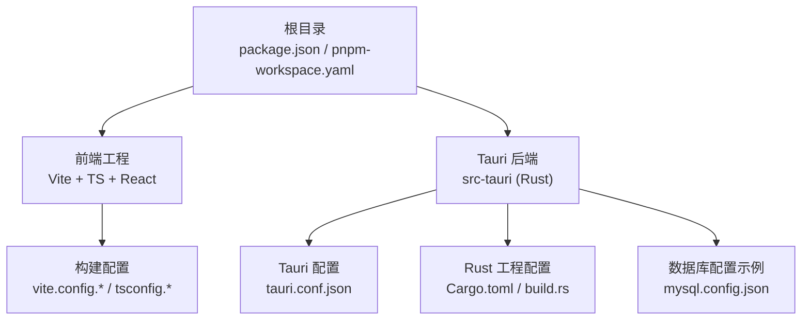
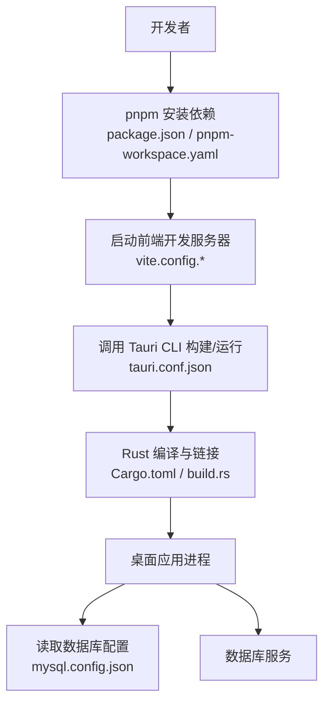
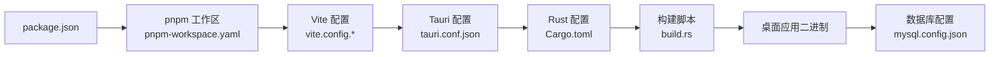

# 环境搭建

<cite>
**本文引用的文件**   
- [package.json](file://package.json)
- [pnpm-workspace.yaml](file://pnpm-workspace.yaml)
- [vite.config.js](file://vite.config.js)
- [vite.config.ts](file://vite.config.ts)
- [tsconfig.json](file://tsconfig.json)
- [tsconfig.node.json](file://tsconfig.node.json)
- [tauri.conf.json](file://src-tauri/tauri.conf.json)
- [Cargo.toml](file://src-tauri/Cargo.toml)
- [build.rs](file://src-tauri/build.rs)
- [mysql.config.json](file://src-tauri/mysql.config.json)
- [README.md](file://README.md)
</cite>

## 目录
1. [简介](#简介)
2. [项目结构](#项目结构)
3. [核心组件](#核心组件)
4. [架构总览](#架构总览)
5. [详细组件分析](#详细组件分析)
6. [依赖分析](#依赖分析)
7. [性能考虑](#性能考虑)
8. [故障排查指南](#故障排查指南)
9. [结论](#结论)
10. [附录](#附录)

## 简介
本指南面向首次参与 FishWorker 项目的开发者，目标是帮助你在本地快速、稳定地搭建开发环境。内容涵盖：
- 必需工具链安装与配置（Node.js、Rust、Tauri CLI）
- 包管理器与工作区（pnpm）
- 前端构建与后端 Rust/Tauri 集成
- 环境变量与数据库连接设置
- 不同操作系统注意事项
- 常见问题排查与环境验证清单

## 项目结构
FishWorker 采用 Tauri + Vite + TypeScript 的前端工程化方案，后端使用 Rust 并通过 Tauri 能力暴露给前端。根目录包含前端工程配置与脚本，src-tauri 为 Rust 应用与 Tauri 配置。

图表来源
- [package.json](file://package.json)
- [pnpm-workspace.yaml](file://pnpm-workspace.yaml)
- [vite.config.js](file://vite.config.js)
- [vite.config.ts](file://vite.config.ts)
- [tsconfig.json](file://tsconfig.json)
- [tsconfig.node.json](file://tsconfig.node.json)
- [tauri.conf.json](file://src-tauri/tauri.conf.json)
- [Cargo.toml](file://src-tauri/Cargo.toml)
- [build.rs](file://src-tauri/build.rs)
- [mysql.config.json](file://src-tauri/mysql.config.json)

章节来源
- [package.json](file://package.json)
- [pnpm-workspace.yaml](file://pnpm-workspace.yaml)
- [vite.config.js](file://vite.config.js)
- [vite.config.ts](file://vite.config.ts)
- [tsconfig.json](file://tsconfig.json)
- [tsconfig.node.json](file://tsconfig.node.json)
- [tauri.conf.json](file://src-tauri/tauri.conf.json)
- [Cargo.toml](file://src-tauri/Cargo.toml)
- [build.rs](file://src-tauri/build.rs)
- [mysql.config.json](file://src-tauri/mysql.config.json)

## 核心组件
本节聚焦环境搭建所需的核心工程文件与职责说明，帮助你理解各配置文件的作用与相互关系。

- package.json
  - 定义 Node.js 版本要求、包管理命令、脚本入口等。用于校验运行环境与执行构建/开发命令。
- pnpm-workspace.yaml
  - 声明工作区范围与包组织方式，确保多包协作与依赖一致性。
- vite.config.js / vite.config.ts
  - 前端构建与开发服务器配置，决定端口、代理、别名、插件等。
- tsconfig.json / tsconfig.node.json
  - TypeScript 编译选项与模块解析策略，保证前后端类型一致性与构建正确性。
- src-tauri/tauri.conf.json
  - Tauri 应用元数据、窗口行为、安全策略、能力集等。
- src-tauri/Cargo.toml
  - Rust 依赖与特性开关，决定后端功能与平台相关编译项。
- src-tauri/build.rs
  - 构建期脚本，常用于生成代码或注入资源。
- src-tauri/mysql.config.json
  - 数据库连接配置示例（如 MySQL），供后端在运行时读取。

章节来源
- [package.json](file://package.json)
- [pnpm-workspace.yaml](file://pnpm-workspace.yaml)
- [vite.config.js](file://vite.config.js)
- [vite.config.ts](file://vite.config.ts)
- [tsconfig.json](file://tsconfig.json)
- [tsconfig.node.json](file://tsconfig.node.json)
- [tauri.conf.json](file://src-tauri/tauri.conf.json)
- [Cargo.toml](file://src-tauri/Cargo.toml)
- [build.rs](file://src-tauri/build.rs)
- [mysql.config.json](file://src-tauri/mysql.config.json)

## 架构总览
下图展示了从源码到可运行桌面应用的构建与运行流程，以及关键配置文件的位置与作用。

图表来源
- [package.json](file://package.json)
- [pnpm-workspace.yaml](file://pnpm-workspace.yaml)
- [vite.config.js](file://vite.config.js)
- [vite.config.ts](file://vite.config.ts)
- [tauri.conf.json](file://src-tauri/tauri.conf.json)
- [Cargo.toml](file://src-tauri/Cargo.toml)
- [build.rs](file://src-tauri/build.rs)
- [mysql.config.json](file://src-tauri/mysql.config.json)

## 详细组件分析

### 工具链安装与配置
- Node.js
  - 建议通过版本管理器安装并锁定项目所需版本，避免全局版本冲突。
  - 参考 package.json 中的版本约束进行安装。
- Rust 工具链
  - 安装 rustup 与 stable 工具链；确保目标平台支持（Windows/macOS/Linux）。
  - 若需特定平台特性，按 Cargo.toml 的依赖与特性开启对应目标。
- Tauri CLI
  - 通过 npm/pnpm 全局或项目内安装 Tauri CLI，确保与 tauri.conf.json 的版本兼容。
  - 在 Windows 上可能需要安装系统级依赖（如 Visual Studio Build Tools、WebView2 运行时等），具体以 Tauri 官方文档为准。

章节来源
- [package.json](file://package.json)
- [Cargo.toml](file://src-tauri/Cargo.toml)
- [tauri.conf.json](file://src-tauri/tauri.conf.json)

### 包管理与工作区
- 使用 pnpm 作为包管理器，遵循 pnpm-workspace.yaml 的工作区约定。
- 在项目根目录执行依赖安装，确保所有子包与工作区依赖被正确解析与缓存。
- 如需自定义镜像源或缓存路径，可在 pnpm 配置中设置。

章节来源
- [package.json](file://package.json)
- [pnpm-workspace.yaml](file://pnpm-workspace.yaml)

### 前端构建与开发服务器
- Vite 配置位于 vite.config.js 与 vite.config.ts，二者可能共存于项目中，请根据实际生效的配置调整。
- 常见配置项包括：
  - 开发服务器端口与热重载
  - 静态资源与 API 代理
  - TypeScript 路径别名与模块解析
- 通过 package.json 中的脚本命令启动开发模式或构建产物。

章节来源
- [vite.config.js](file://vite.config.js)
- [vite.config.ts](file://vite.config.ts)
- [package.json](file://package.json)

### TypeScript 编译与类型检查
- tsconfig.json 控制整体编译与模块解析策略。
- tsconfig.node.json 针对 Node 侧工具链（如构建脚本、测试框架）的类型与模块规则。
- 建议在 IDE 中启用基于 tsconfig 的类型检查与自动修复。

章节来源
- [tsconfig.json](file://tsconfig.json)
- [tsconfig.node.json](file://tsconfig.node.json)

### Tauri 与 Rust 后端
- tauri.conf.json 定义应用名称、窗口行为、能力集与安全策略。
- Cargo.toml 声明 Rust 依赖与平台相关特性；必要时在 build.rs 中生成代码或处理资源。
- 运行 Tauri 时，前端由 Vite 提供，后端由 Rust 编译产物承载，两者通过 Tauri IPC 通信。

章节来源
- [tauri.conf.json](file://src-tauri/tauri.conf.json)
- [Cargo.toml](file://src-tauri/Cargo.toml)
- [build.rs](file://src-tauri/build.rs)

### 数据库连接配置
- mysql.config.json 提供数据库连接参数示例（如主机、端口、用户名、密码、库名等）。
- 后端在启动或初始化阶段读取该配置，建立连接池并对外提供服务。
- 生产环境建议将敏感信息移至环境变量或密钥管理服务，而非明文保存在配置文件中。

章节来源
- [mysql.config.json](file://src-tauri/mysql.config.json)

## 依赖分析
下图展示关键依赖与配置文件之间的关系，便于定位问题与理解构建链路。

图表来源
- [package.json](file://package.json)
- [pnpm-workspace.yaml](file://pnpm-workspace.yaml)
- [vite.config.js](file://vite.config.js)
- [vite.config.ts](file://vite.config.ts)
- [tauri.conf.json](file://src-tauri/tauri.conf.json)
- [Cargo.toml](file://src-tauri/Cargo.toml)
- [build.rs](file://src-tauri/build.rs)
- [mysql.config.json](file://src-tauri/mysql.config.json)

章节来源
- [package.json](file://package.json)
- [pnpm-workspace.yaml](file://pnpm-workspace.yaml)
- [vite.config.js](file://vite.config.js)
- [vite.config.ts](file://vite.config.ts)
- [tauri.conf.json](file://src-tauri/tauri.conf.json)
- [Cargo.toml](file://src-tauri/Cargo.toml)
- [build.rs](file://src-tauri/build.rs)
- [mysql.config.json](file://src-tauri/mysql.config.json)

## 性能考虑
- 使用 pnpm 的缓存与硬链接机制提升依赖安装速度。
- 合理配置 Vite 的 HMR 与按需加载，减少冷启动时间。
- 对 Rust 后端进行增量编译优化，必要时启用并行编译与 LTO（视平台而定）。
- 数据库连接池大小与超时参数应根据业务负载调优。

## 故障排查指南
- Node.js 版本不匹配
  - 现象：安装依赖或运行脚本时报版本错误。
  - 排查：核对 package.json 中的版本约束，使用版本管理器切换至指定版本。
- pnpm 安装失败或网络问题
  - 现象：下载依赖超时或失败。
  - 排查：检查网络代理与镜像源配置，清理缓存后重试。
- Tauri 构建失败（Windows）
  - 现象：缺少编译器或 WebView2 运行时导致构建失败。
  - 排查：安装 Visual Studio Build Tools 与 WebView2 运行时，确认 PATH 与权限。
- Tauri 构建失败（macOS）
  - 现象：签名或证书问题导致打包失败。
  - 排查：检查 Xcode 命令行工具与签名配置，确保 tauri.conf.json 中签名相关字段正确。
- Tauri 构建失败（Linux）
  - 现象：缺少系统依赖（如 GTK、WebKitGTK、libssl 等）。
  - 排查：根据发行版安装必要系统包，参考 Tauri 官方文档。
- 数据库连接失败
  - 现象：后端启动后无法连接数据库。
  - 排查：检查 mysql.config.json 的连接参数是否正确，确认数据库服务可达且账号权限无误。

章节来源
- [package.json](file://package.json)
- [tauri.conf.json](file://src-tauri/tauri.conf.json)
- [mysql.config.json](file://src-tauri/mysql.config.json)

## 结论
完成上述步骤后，你的本地开发环境应能正常运行 FishWorker 的前端与 Tauri 后端。建议在执行任何变更前先运行环境验证清单中的命令，确保一切正常后再进入功能开发与调试。

## 附录

### 环境准备清单
- 已安装 Node.js（与 package.json 约束一致）
- 已安装 Rust 工具链（stable）
- 已安装 Tauri CLI（与 tauri.conf.json 兼容）
- 已安装 pnpm 并可用
- 已安装必要的系统依赖（按操作系统）

### 安装与初始化步骤
- 克隆仓库并进入项目根目录
- 安装依赖（pnpm）
- 配置数据库连接（编辑 mysql.config.json）
- 启动前端开发服务器（Vite）
- 启动 Tauri 开发模式（构建并运行桌面应用）

### 不同操作系统注意事项
- Windows
  - 需要 Visual Studio Build Tools 与 WebView2 运行时
  - 注意路径与权限，避免 UAC 限制影响构建
- macOS
  - 需要 Xcode 命令行工具
  - 如需打包签名，需配置证书与钥匙串
- Linux
  - 需要安装系统级依赖（如 GTK、WebKitGTK、libssl 等）
  - 某些发行版需额外启用仓库或安装开发头文件

### 常见安装问题与解决方案
- 依赖安装缓慢或失败
  - 更换镜像源或使用代理
  - 清理 pnpm 缓存后重试
- 构建报错提示缺少工具链
  - 重新安装或更新 Rust 工具链
  - 确认目标平台与特性匹配
- 数据库连接异常
  - 校验 mysql.config.json 参数
  - 检查防火墙与数据库白名单

### 环境验证清单与测试命令
- 基础环境检查
  - 检查 Node.js 版本是否符合 package.json 约束
  - 检查 Rust 工具链是否可用
  - 检查 Tauri CLI 是否可用
- 依赖安装检查
  - 执行依赖安装命令，确认无报错
- 前端构建检查
  - 启动 Vite 开发服务器，确认页面可访问
- Tauri 运行检查
  - 启动 Tauri 开发模式，确认桌面应用窗口打开
- 数据库连通性检查
  - 启动应用后观察日志，确认数据库连接成功

章节来源
- [README.md](file://README.md)
- [package.json](file://package.json)
- [tauri.conf.json](file://src-tauri/tauri.conf.json)
- [mysql.config.json](file://src-tauri/mysql.config.json)