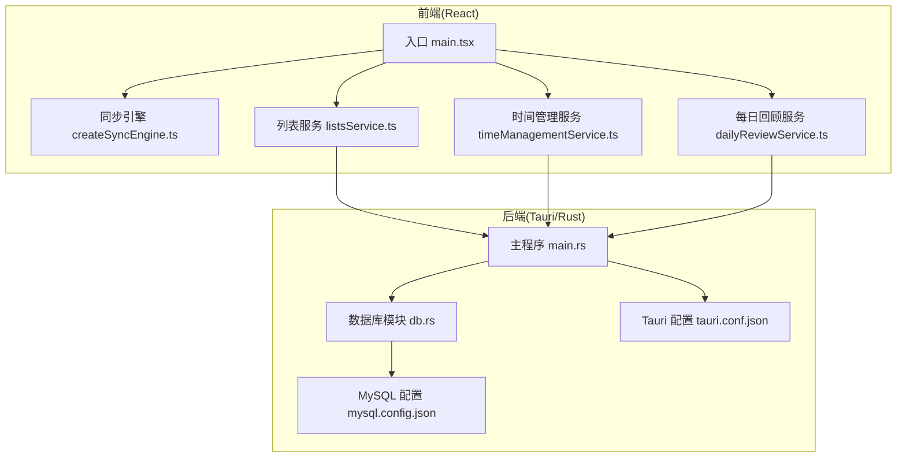
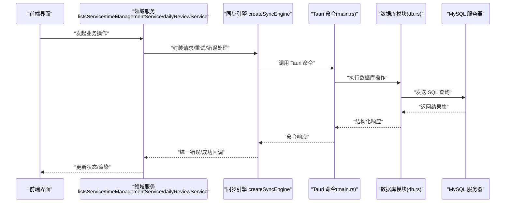
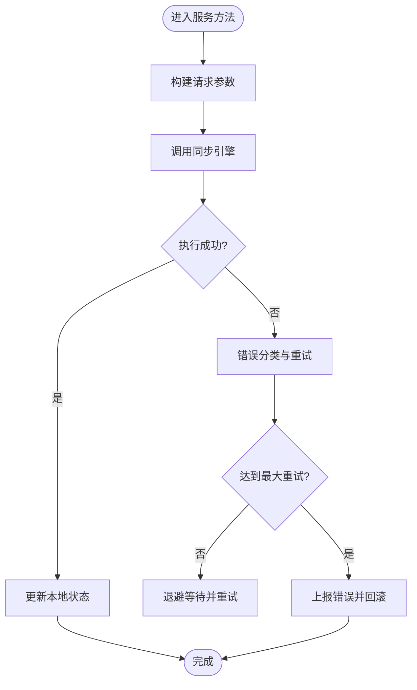
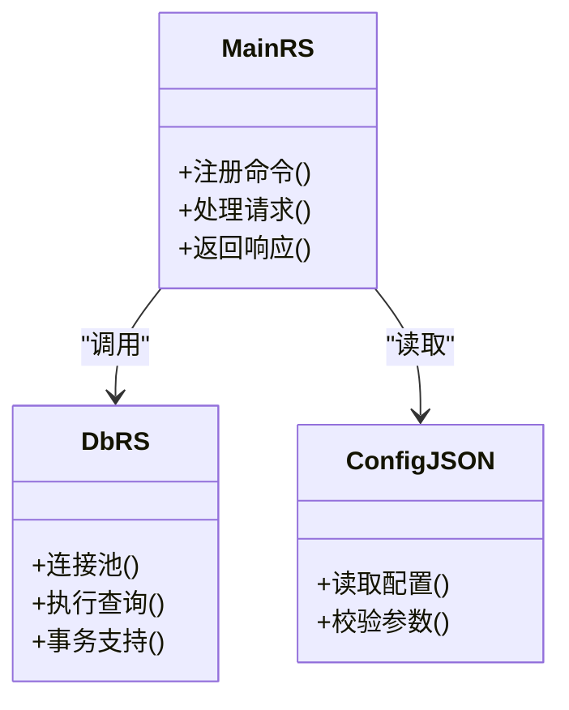
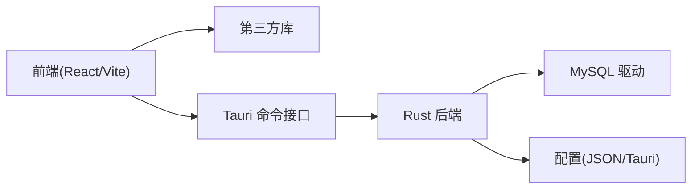

# 调试与故障排除

<cite>
**本文引用的文件**   
- [src/main.tsx](file://src/main.tsx)
- [vite.config.js](file://vite.config.js)
- [package.json](file://package.json)
- [src/lib/createSyncEngine.ts](file://src/lib/createSyncEngine.ts)
- [src/features/lists/listsService.ts](file://src/features/lists/listsService.ts)
- [src/features/time-management/timeManagementService.ts](file://src/features/time-management/timeManagementService.ts)
- [src/features/daily-review/dailyReviewService.ts](file://src/features/daily-review/dailyReviewService.ts)
- [src-tauri/src/main.rs](file://src-tauri/src/main.rs)
- [src-tauri/src/db.rs](file://src-tauri/src/db.rs)
- [src-tauri/Cargo.toml](file://src-tauri/Cargo.toml)
- [src-tauri/tauri.conf.json](file://src-tauri/tauri.conf.json)
- [src-tauri/mysql.config.json](file://src-tauri/mysql.config.json)
</cite>

## 目录
1. [简介](#简介)
2. [项目结构](#项目结构)
3. [核心组件](#核心组件)
4. [架构总览](#架构总览)
5. [详细组件分析](#详细组件分析)
6. [依赖分析](#依赖分析)
7. [性能考虑](#性能考虑)
8. [故障排除指南](#故障排除指南)
9. [结论](#结论)
10. [附录](#附录)

## 简介
本指南面向 FishWorker 项目的开发与运维人员，聚焦于前端 React 应用、Rust Tauri 后端以及数据库连接的调试方法与工具使用技巧。内容涵盖常见错误的诊断与解决方案、性能瓶颈分析与优化建议、日志收集与分析方法，以及生产环境问题的排查流程，并提供开发环境与生产环境的差异化调试策略。

## 项目结构
FishWorker 采用 Tauri + React 的桌面应用架构：
- 前端：React + Vite，按功能域组织（features），通过服务层调用 Tauri 命令访问后端能力。
- 后端：Rust Tauri，负责系统级能力与数据库连接（MySQL）。
- 配置：Tauri 配置、MySQL 配置文件位于 src-tauri 目录。

图表来源
- [src/main.tsx:1-200](file://src/main.tsx#L1-L200)
- [src/lib/createSyncEngine.ts:1-200](file://src/lib/createSyncEngine.ts#L1-L200)
- [src/features/lists/listsService.ts:1-200](file://src/features/lists/listsService.ts#L1-L200)
- [src/features/time-management/timeManagementService.ts:1-200](file://src/features/time-management/timeManagementService.ts#L1-L200)
- [src/features/daily-review/dailyReviewService.ts:1-200](file://src/features/daily-review/dailyReviewService.ts#L1-L200)
- [src-tauri/src/main.rs:1-200](file://src-tauri/src/main.rs#L1-L200)
- [src-tauri/src/db.rs:1-200](file://src-tauri/src/db.rs#L1-L200)
- [src-tauri/tauri.conf.json:1-200](file://src-tauri/tauri.conf.json#L1-L200)
- [src-tauri/mysql.config.json:1-200](file://src-tauri/mysql.config.json#L1-L200)

章节来源
- [src/main.tsx:1-200](file://src/main.tsx#L1-L200)
- [vite.config.js:1-200](file://vite.config.js#L1-L200)
- [package.json:1-200](file://package.json#L1-L200)

## 核心组件
- 前端入口与构建
  - 入口文件负责初始化应用与路由挂载；Vite 配置控制开发服务器、代理与产物输出；包管理脚本定义常用命令。
- 同步引擎
  - 提供跨端数据同步能力，封装请求重试、错误处理与状态更新逻辑。
- 领域服务
  - 列表、时间管理、每日回顾等服务分别封装业务 API 调用与本地状态交互。
- Tauri 后端
  - Rust 主程序注册命令并暴露给前端；数据库模块负责 MySQL 连接与查询；配置项来自 Tauri 与外部 JSON 配置。

章节来源
- [src/main.tsx:1-200](file://src/main.tsx#L1-L200)
- [src/lib/createSyncEngine.ts:1-200](file://src/lib/createSyncEngine.ts#L1-L200)
- [src/features/lists/listsService.ts:1-200](file://src/features/lists/listsService.ts#L1-L200)
- [src/features/time-management/timeManagementService.ts:1-200](file://src/features/time-management/timeManagementService.ts#L1-L200)
- [src/features/daily-review/dailyReviewService.ts:1-200](file://src/features/daily-review/dailyReviewService.ts#L1-L200)
- [src-tauri/src/main.rs:1-200](file://src-tauri/src/main.rs#L1-L200)
- [src-tauri/src/db.rs:1-200](file://src-tauri/src/db.rs#L1-L200)
- [src-tauri/tauri.conf.json:1-200](file://src-tauri/tauri.conf.json#L1-L200)
- [src-tauri/mysql.config.json:1-200](file://src-tauri/mysql.config.json#L1-L200)

## 架构总览
下图展示从前端到后端的典型调用路径，包括 Tauri 命令与数据库访问。

图表来源
- [src/features/lists/listsService.ts:1-200](file://src/features/lists/listsService.ts#L1-L200)
- [src/features/time-management/timeManagementService.ts:1-200](file://src/features/time-management/timeManagementService.ts#L1-L200)
- [src/features/daily-review/dailyReviewService.ts:1-200](file://src/features/daily-review/dailyReviewService.ts#L1-L200)
- [src/lib/createSyncEngine.ts:1-200](file://src/lib/createSyncEngine.ts#L1-L200)
- [src-tauri/src/main.rs:1-200](file://src-tauri/src/main.rs#L1-L200)
- [src-tauri/src/db.rs:1-200](file://src-tauri/src/db.rs#L1-L200)

## 详细组件分析

### 前端入口与构建调试
- 关键要点
  - 检查入口文件是否正确挂载应用与路由。
  - 确认 Vite 开发服务器端口、热重载与代理设置。
  - 验证 package.json 中的启动脚本与环境变量。
- 常见问题
  - 端口占用导致无法启动开发服务器。
  - 环境变量未注入导致运行时行为异常。
  - 资源路径或静态文件加载失败。
- 调试步骤
  - 在浏览器开发者工具的 Sources 面板断点入口文件。
  - 使用 Network 面板检查资源加载与代理转发。
  - 在控制台查看构建警告与运行时错误堆栈。

章节来源
- [src/main.tsx:1-200](file://src/main.tsx#L1-L200)
- [vite.config.js:1-200](file://vite.config.js#L1-L200)
- [package.json:1-200](file://package.json#L1-L200)

### 同步引擎与服务层
- 关键要点
  - 同步引擎负责请求重试、错误分类与状态回滚。
  - 各领域服务封装具体业务 API 调用，保持与 Tauri 命令解耦。
- 常见问题
  - 网络超时或重复提交导致数据不一致。
  - 错误信息不够明确，难以定位问题来源。
- 调试步骤
  - 在服务层添加请求/响应日志与耗时统计。
  - 在同步引擎中捕获并记录错误类型与重试次数。
  - 使用浏览器 Performance 面板分析长任务与阻塞。

图表来源
- [src/lib/createSyncEngine.ts:1-200](file://src/lib/createSyncEngine.ts#L1-L200)
- [src/features/lists/listsService.ts:1-200](file://src/features/lists/listsService.ts#L1-L200)
- [src/features/time-management/timeManagementService.ts:1-200](file://src/features/time-management/timeManagementService.ts#L1-L200)
- [src/features/daily-review/dailyReviewService.ts:1-200](file://src/features/daily-review/dailyReviewService.ts#L1-L200)

章节来源
- [src/lib/createSyncEngine.ts:1-200](file://src/lib/createSyncEngine.ts#L1-L200)
- [src/features/lists/listsService.ts:1-200](file://src/features/lists/listsService.ts#L1-L200)
- [src/features/time-management/timeManagementService.ts:1-200](file://src/features/time-management/timeManagementService.ts#L1-L200)
- [src/features/daily-review/dailyReviewService.ts:1-200](file://src/features/daily-review/dailyReviewService.ts#L1-L200)

### Tauri 后端与数据库连接
- 关键要点
  - Rust 主程序注册命令，接收前端调用并执行业务逻辑。
  - 数据库模块负责 MySQL 连接池、查询与事务。
  - 配置来源于 Tauri 配置与外部 MySQL 配置文件。
- 常见问题
  - 数据库连接失败（认证、网络、权限）。
  - SQL 语法错误或字段映射异常。
  - 命令参数解析失败导致崩溃或无响应。
- 调试步骤
  - 启用 Rust 日志输出，记录连接建立与查询执行。
  - 校验 mysql.config.json 的连接信息与凭据。
  - 使用 Tauri 调试模式获取更详细的错误上下文。

图表来源
- [src-tauri/src/main.rs:1-200](file://src-tauri/src/main.rs#L1-L200)
- [src-tauri/src/db.rs:1-200](file://src-tauri/src/db.rs#L1-L200)
- [src-tauri/mysql.config.json:1-200](file://src-tauri/mysql.config.json#L1-L200)

章节来源
- [src-tauri/src/main.rs:1-200](file://src-tauri/src/main.rs#L1-L200)
- [src-tauri/src/db.rs:1-200](file://src-tauri/src/db.rs#L1-L200)
- [src-tauri/tauri.conf.json:1-200](file://src-tauri/tauri.conf.json#L1-L200)
- [src-tauri/mysql.config.json:1-200](file://src-tauri/mysql.config.json#L1-L200)
- [src-tauri/Cargo.toml:1-200](file://src-tauri/Cargo.toml#L1-L200)

## 依赖分析
- 前端依赖
  - React 生态与 Vite 构建链；第三方库按需引入。
- 后端依赖
  - Tauri 框架与 Rust 标准库；MySQL 驱动与配置解析。
- 潜在风险
  - 版本不兼容导致构建失败或运行期异常。
  - 外部配置缺失或格式错误引发启动失败。

图表来源
- [package.json:1-200](file://package.json#L1-200)
- [src-tauri/Cargo.toml:1-200](file://src-tauri/Cargo.toml#L1-200)
- [src-tauri/tauri.conf.json:1-200](file://src-tauri/tauri.conf.json#L1-200)

章节来源
- [package.json:1-200](file://package.json#L1-200)
- [src-tauri/Cargo.toml:1-200](file://src-tauri/Cargo.toml#L1-200)

## 性能考虑
- 前端
  - 减少不必要的重渲染，使用状态管理与懒加载。
  - 对大数据列表进行虚拟滚动与分页。
  - 使用浏览器 Performance 面板识别长任务与内存泄漏。
- 后端
  - 合理设置连接池大小与超时时间。
  - 避免 N+1 查询，使用批量操作与索引优化。
  - 对热点命令进行缓存与去抖。
- 端到端
  - 监控请求耗时与错误率，建立告警阈值。
  - 在生产环境开启采样日志与指标采集。

[本节为通用指导，无需特定文件引用]

## 故障排除指南

### 前端调试
- 工具与方法
  - 浏览器开发者工具：Sources 断点、Console 日志、Network 请求、Performance 分析。
  - Vite 插件：启用源码映射与调试信息。
- 常见问题
  - 路由跳转失败：检查路由配置与导航参数。
  - 样式未生效：确认 SCSS 编译与 CSS 覆盖顺序。
  - 状态不同步：检查 Store 更新与副作用触发时机。
- 操作步骤
  - 在关键函数入口设置断点，逐步执行观察变量变化。
  - 过滤 Network 面板仅显示 XHR/Fetch，定位失败请求。
  - 使用 Performance 录制页面交互，识别卡顿点。

章节来源
- [src/main.tsx:1-200](file://src/main.tsx#L1-L200)
- [vite.config.js:1-200](file://vite.config.js#L1-L200)

### 后端调试
- 工具与方法
  - Rust 日志：启用 info/debug 级别，输出关键路径与错误。
  - Tauri 调试模式：获取更详细的命令调用与错误上下文。
- 常见问题
  - 命令未注册或参数解析失败：检查命令声明与参数绑定。
  - 数据库连接失败：核对用户名、密码、主机与端口。
  - SQL 执行异常：检查表结构与字段映射。
- 操作步骤
  - 在命令入口处打印入参与返回值。
  - 在数据库模块记录连接建立与查询语句。
  - 使用独立客户端连接数据库验证配置。

章节来源
- [src-tauri/src/main.rs:1-200](file://src-tauri/src/main.rs#L1-L200)
- [src-tauri/src/db.rs:1-200](file://src-tauri/src/db.rs#L1-L200)
- [src-tauri/mysql.config.json:1-200](file://src-tauri/mysql.config.json#L1-L200)

### 数据库连接调试
- 检查清单
  - 网络连接可达性与防火墙规则。
  - 用户权限与默认数据库选择。
  - SSL/TLS 配置与证书有效性。
- 诊断步骤
  - 使用命令行客户端直连数据库，验证凭据与权限。
  - 在应用内打印连接字符串与错误码。
  - 调整连接池参数，观察连接复用情况。

章节来源
- [src-tauri/src/db.rs:1-200](file://src-tauri/src/db.rs#L1-L200)
- [src-tauri/mysql.config.json:1-200](file://src-tauri/mysql.config.json#L1-L200)

### 日志收集与分析
- 前端日志
  - 在同步引擎与服务层记录请求/响应摘要与错误堆栈。
  - 将关键事件上报至集中式日志平台。
- 后端日志
  - 使用分层日志（info/warn/error）区分严重性。
  - 包含请求 ID、用户标识与上下文信息以便追踪。
- 分析方法
  - 基于时间窗口聚合错误频率与耗时分布。
  - 关联前后端日志，定位端到端问题根因。

章节来源
- [src/lib/createSyncEngine.ts:1-200](file://src/lib/createSyncEngine.ts#L1-L200)
- [src-tauri/src/main.rs:1-200](file://src-tauri/src/main.rs#L1-L200)

### 生产环境问题排查流程
- 快速定位
  - 查看错误率与延迟指标，确定受影响范围。
  - 检索最近部署变更与配置修改。
- 深入分析
  - 拉取相关时间段的日志与快照。
  - 复现问题并对比开发/测试环境差异。
- 恢复与改进
  - 回滚或热修复，优先恢复服务可用性。
  - 补充监控与告警，完善故障预案。

[本节为通用流程，无需特定文件引用]

### 开发环境与生产环境的差异化调试策略
- 开发环境
  - 启用详细日志与源码映射。
  - 使用 Mock 数据与本地数据库加速迭代。
- 生产环境
  - 限制日志量，启用采样与异步写入。
  - 使用只读副本与灰度发布降低风险。
- 切换方式
  - 通过环境变量控制日志级别与功能开关。
  - 使用配置中心动态调整行为。

[本节为通用策略，无需特定文件引用]

## 结论
通过系统化的前端、后端与数据库调试方法，结合完善的日志与监控体系，可以显著提升 FishWorker 项目的可观测性与稳定性。建议在团队内推广标准化调试流程与最佳实践，持续优化性能与用户体验。

[本节为总结，无需特定文件引用]

## 附录
- 常用命令与脚本
  - 启动开发服务器、构建产物、运行测试等命令见包管理脚本。
- 参考文档
  - 项目 README 与架构说明文档可作为补充资料。

章节来源
- [package.json:1-200](file://package.json#L1-200)