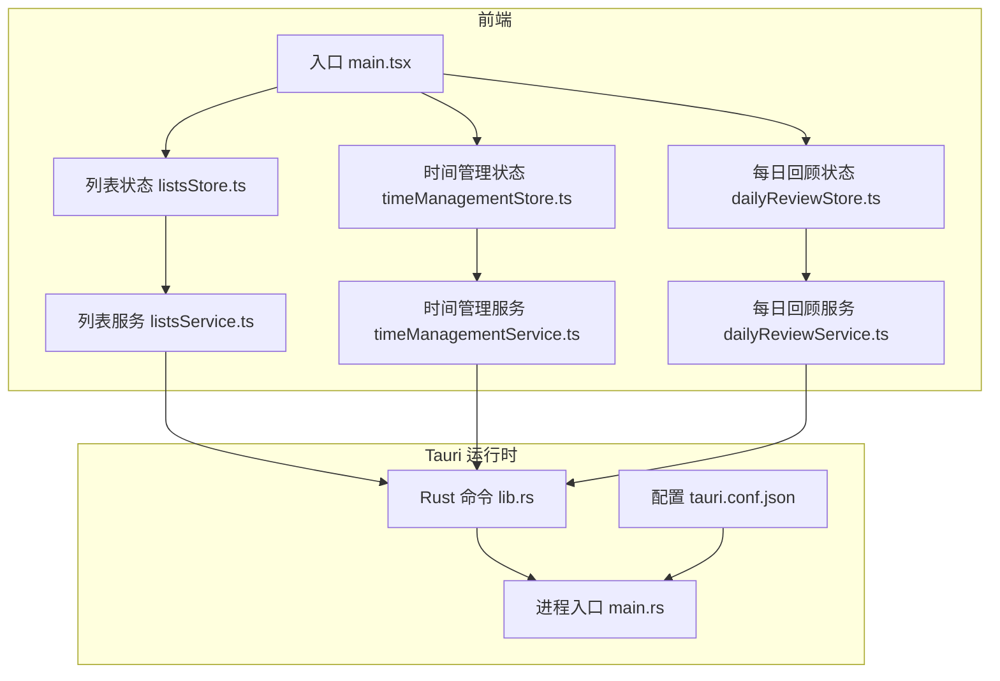
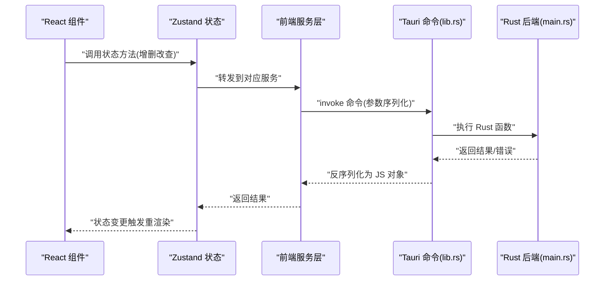
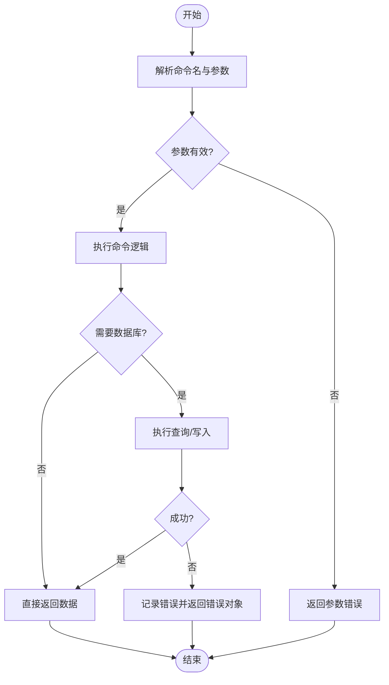
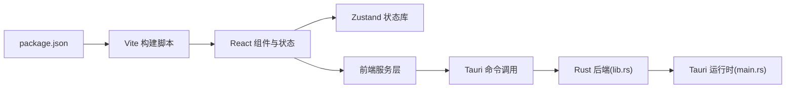

# 调试指南

<cite>
**本文引用的文件**   
- [src/main.tsx](file://src/main.tsx)
- [vite.config.js](file://vite.config.js)
- [package.json](file://package.json)
- [src/features/lists/listsStore.ts](file://src/features/lists/listsStore.ts)
- [src/features/time-management/timeManagementStore.ts](file://src/features/time-management/timeManagementStore.ts)
- [src/features/daily-review/dailyReviewStore.ts](file://src/features/daily-review/dailyReviewStore.ts)
- [src/features/settings/preferencesStore.ts](file://src/features/settings/preferencesStore.ts)
- [src/features/lists/listsService.ts](file://src/features/lists/listsService.ts)
- [src/features/time-management/timeManagementService.ts](file://src/features/time-management/timeManagementService.ts)
- [src/features/daily-review/dailyReviewService.ts](file://src/features/daily-review/dailyReviewService.ts)
- [src-tauri/src/lib.rs](file://src-tauri/src/lib.rs)
- [src-tauri/src/main.rs](file://src-tauri/src/main.rs)
- [src-tauri/Cargo.toml](file://src-tauri/Cargo.toml)
- [src-tauri/tauri.conf.json](file://src-tauri/tauri.conf.json)
</cite>

## 目录
1. [简介](#简介)
2. [项目结构](#项目结构)
3. [核心组件](#核心组件)
4. [架构总览](#架构总览)
5. [详细组件分析](#详细组件分析)
6. [依赖分析](#依赖分析)
7. [性能考虑](#性能考虑)
8. [故障排查指南](#故障排查指南)
9. [结论](#结论)
10. [附录](#附录)

## 简介
本指南面向 FishWorker 项目的开发与维护人员，提供一套从前端到后端、从桌面端到跨平台的系统化调试方法。内容覆盖：
- 前端调试：React DevTools、Zustand 状态调试、网络请求监控与拦截
- Rust 后端调试：日志输出、错误追踪、性能剖析
- Tauri IPC 通信：前后端数据流跟踪、命令调用链定位
- 浏览器开发者工具高级用法与 Chrome DevTools 技巧
- 移动端调试（如适用）与跨平台兼容性问题的排查思路
- 常见调试场景案例与最佳实践

## 项目结构
FishWorker 采用 Tauri + React 的混合架构：
- 前端基于 Vite + React + TypeScript，使用 Zustand 管理应用状态，通过服务层发起 API 或 Tauri 命令
- 后端基于 Rust + Tauri，暴露命令给前端调用，负责数据库访问与业务逻辑

图表来源
- [src/main.tsx:1-200](file://src/main.tsx#L1-L200)
- [src/features/lists/listsStore.ts:1-200](file://src/features/lists/listsStore.ts#L1-L200)
- [src/features/time-management/timeManagementStore.ts:1-200](file://src/features/time-management/timeManagementStore.ts#L1-L200)
- [src/features/daily-review/dailyReviewStore.ts:1-200](file://src/features/daily-review/dailyReviewStore.ts#L1-L200)
- [src/features/lists/listsService.ts:1-200](file://src/features/lists/listsService.ts#L1-L200)
- [src/features/time-management/timeManagementService.ts:1-200](file://src/features/time-management/timeManagementService.ts#L1-L200)
- [src/features/daily-review/dailyReviewService.ts:1-200](file://src/features/daily-review/dailyReviewService.ts#L1-L200)
- [src-tauri/src/lib.rs:1-200](file://src-tauri/src/lib.rs#L1-L200)
- [src-tauri/src/main.rs:1-200](file://src-tauri/src/main.rs#L1-L200)
- [src-tauri/tauri.conf.json:1-200](file://src-tauri/tauri.conf.json#L1-L200)

章节来源
- [src/main.tsx:1-200](file://src/main.tsx#L1-L200)
- [vite.config.js:1-200](file://vite.config.js#L1-L200)
- [package.json:1-200](file://package.json#L1-L200)

## 核心组件
- 前端状态管理（Zustand）
  - 列表模块状态：[listsStore.ts](file://src/features/lists/listsStore.ts)
  - 时间管理模块状态：[timeManagementStore.ts](file://src/features/time-management/timeManagementStore.ts)
  - 每日回顾模块状态：[dailyReviewStore.ts](file://src/features/daily-review/dailyReviewStore.ts)
  - 设置偏好状态：[preferencesStore.ts](file://src/features/settings/preferencesStore.ts)
- 前端服务层（API/Tauri 调用封装）
  - 列表服务：[listsService.ts](file://src/features/lists/listsService.ts)
  - 时间管理服务：[timeManagementService.ts](file://src/features/time-management/timeManagementService.ts)
  - 每日回顾服务：[dailyReviewService.ts](file://src/features/daily-review/dailyReviewService.ts)
- Tauri 后端（Rust）
  - 命令注册与实现：[lib.rs](file://src-tauri/src/lib.rs)
  - 进程入口与窗口初始化：[main.rs](file://src-tauri/src/main.rs)
  - 构建与依赖：[Cargo.toml](file://src-tauri/Cargo.toml)
  - Tauri 配置：[tauri.conf.json](file://src-tauri/tauri.conf.json)

章节来源
- [src/features/lists/listsStore.ts:1-200](file://src/features/lists/listsStore.ts#L1-L200)
- [src/features/time-management/timeManagementStore.ts:1-200](file://src/features/time-management/timeManagementStore.ts#L1-L200)
- [src/features/daily-review/dailyReviewStore.ts:1-200](file://src/features/daily-review/dailyReviewStore.ts#L1-L200)
- [src/features/settings/preferencesStore.ts:1-200](file://src/features/settings/preferencesStore.ts#L1-L200)
- [src/features/lists/listsService.ts:1-200](file://src/features/lists/listsService.ts#L1-L200)
- [src/features/time-management/timeManagementService.ts:1-200](file://src/features/time-management/timeManagementService.ts#L1-L200)
- [src/features/daily-review/dailyReviewService.ts:1-200](file://src/features/daily-review/dailyReviewService.ts#L1-L200)
- [src-tauri/src/lib.rs:1-200](file://src-tauri/src/lib.rs#L1-L200)
- [src-tauri/src/main.rs:1-200](file://src-tauri/src/main.rs#L1-L200)
- [src-tauri/Cargo.toml:1-200](file://src-tauri/Cargo.toml#L1-L200)
- [src-tauri/tauri.conf.json:1-200](file://src-tauri/tauri.conf.json#L1-L200)

## 架构总览
下图展示了典型的数据流：UI 触发状态更新 → 状态层调用服务层 → 服务层通过 Tauri 命令与 Rust 后端交互 → 后端返回结果 → 状态层持久化并驱动 UI 重渲染。

图表来源
- [src/features/lists/listsStore.ts:1-200](file://src/features/lists/listsStore.ts#L1-L200)
- [src/features/lists/listsService.ts:1-200](file://src/features/lists/listsService.ts#L1-L200)
- [src-tauri/src/lib.rs:1-200](file://src-tauri/src/lib.rs#L1-L200)
- [src-tauri/src/main.rs:1-200](file://src-tauri/src/main.rs#L1-L200)

## 详细组件分析

### 前端调试技巧
- React DevTools
  - 组件树检查：查看组件层级、props 与 state 变化
  - Profiler 模式：记录渲染耗时，识别不必要的重渲染
  - Hooks 面板：观察自定义 Hook 的状态与副作用
- Zustand 状态调试
  - 在开发环境启用中间件以打印状态快照与变更历史
  - 使用订阅器监听特定切片，快速定位状态异常来源
  - 结合 React DevTools 的“组件更新”视图，确认状态变更是否引发预期渲染
- 网络请求监控
  - 使用浏览器 Network 面板过滤 XHR/Fetch 请求，查看请求头、载荷与响应体
  - 在服务层添加统一拦截器，记录请求/响应时间与错误堆栈
  - 对 Tauri 命令调用，可在前端侧打印 invoke 的参数与返回值，便于比对前后端数据结构

章节来源
- [src/features/lists/listsStore.ts:1-200](file://src/features/lists/listsStore.ts#L1-L200)
- [src/features/time-management/timeManagementStore.ts:1-200](file://src/features/time-management/timeManagementStore.ts#L1-L200)
- [src/features/daily-review/dailyReviewStore.ts:1-200](file://src/features/daily-review/dailyReviewStore.ts#L1-L200)
- [src/features/lists/listsService.ts:1-200](file://src/features/lists/listsService.ts#L1-L200)
- [src/features/time-management/timeManagementService.ts:1-200](file://src/features/time-management/timeManagementService.ts#L1-L200)
- [src/features/daily-review/dailyReviewService.ts:1-200](file://src/features/daily-review/dailyReviewService.ts#L1-L200)

### Rust 后端调试方法
- 日志输出
  - 在关键路径插入结构化日志，包含上下文信息（用户 ID、操作类型、输入摘要）
  - 区分日志级别（debug/info/warn/error），生产环境仅保留必要级别
- 错误追踪
  - 使用带上下文的错误类型，附带调用栈与失败原因
  - 将错误码与消息映射到前端，便于统一提示与定位
- 性能分析
  - 使用 CPU/内存剖析工具定位热点函数与内存泄漏
  - 对数据库查询进行慢查询分析与索引优化验证

章节来源
- [src-tauri/src/lib.rs:1-200](file://src-tauri/src/lib.rs#L1-L200)
- [src-tauri/src/main.rs:1-200](file://src-tauri/src/main.rs#L1-L200)
- [src-tauri/Cargo.toml:1-200](file://src-tauri/Cargo.toml#L1-L200)

### Tauri IPC 通信调试策略
- 命令注册与调用
  - 在前端服务层集中定义命令名称与参数结构，避免硬编码字符串
  - 在后端命令注册处为每个命令添加入参校验与出参序列化
- 数据流跟踪
  - 在 invoke 前后打印请求 ID、命令名、参数摘要与返回耗时
  - 在后端命令入口处打印相同请求 ID，形成端到端链路
- 错误处理
  - 统一包装错误为可序列化的错误对象，包含错误码、消息与可选详情
  - 前端根据错误码分类提示，必要时打开调试面板展示原始错误

图表来源
- [src/features/lists/listsService.ts:1-200](file://src/features/lists/listsService.ts#L1-L200)
- [src-tauri/src/lib.rs:1-200](file://src-tauri/src/lib.rs#L1-L200)

章节来源
- [src/features/lists/listsService.ts:1-200](file://src/features/lists/listsService.ts#L1-L200)
- [src-tauri/src/lib.rs:1-200](file://src-tauri/src/lib.rs#L1-L200)

### 浏览器开发者工具高级用法与 Chrome DevTools 技巧
- 性能面板
  - 录制页面交互，分析主线程阻塞点与长任务
  - 对比不同版本或配置的差异，定位回归问题
- 内存面板
  - 拍摄堆快照，比较两次快照的差异，查找未释放引用
  - 检测闭包导致的意外引用
- 控制台与断点
  - 使用条件断点精准命中目标路径
  - 利用 console.table/console.group 组织复杂数据结构输出
- 网络面板
  - 过滤特定域名或请求类型，查看缓存命中情况
  - 导出 HAR 文件用于离线分析

章节来源
- [vite.config.js:1-200](file://vite.config.js#L1-L200)
- [package.json:1-200](file://package.json#L1-L200)

### 移动端调试与跨平台兼容性排查
- 移动端调试（如适用）
  - 使用远程调试连接设备，开启 WebKit/Chromium 调试端口
  - 在移动端浏览器中启用开发者选项，查看控制台与网络请求
- 跨平台兼容性
  - 针对 Windows/macOS/Linux 分别测试文件系统路径、权限与字体渲染差异
  - 关注 Tauri 平台相关配置差异，确保能力与权限声明正确

章节来源
- [src-tauri/tauri.conf.json:1-200](file://src-tauri/tauri.conf.json#L1-L200)

## 依赖分析
前端与后端的依赖关系如下：
- 前端依赖 Vite 构建与 React 生态，状态与服务层解耦清晰
- 后端依赖 Tauri 框架与 Rust 生态，命令与业务逻辑分层明确

图表来源
- [package.json:1-200](file://package.json#L1-L200)
- [vite.config.js:1-200](file://vite.config.js#L1-L200)
- [src-tauri/src/lib.rs:1-200](file://src-tauri/src/lib.rs#L1-L200)
- [src-tauri/src/main.rs:1-200](file://src-tauri/src/main.rs#L1-L200)

章节来源
- [package.json:1-200](file://package.json#L1-L200)
- [vite.config.js:1-200](file://vite.config.js#L1-L200)
- [src-tauri/Cargo.toml:1-200](file://src-tauri/Cargo.toml#L1-L200)

## 性能考虑
- 前端
  - 减少不必要的状态订阅范围，避免全局状态过大导致频繁重渲染
  - 对大数据列表使用虚拟滚动与分页加载
  - 合并多次状态更新，降低渲染次数
- 后端
  - 对高频命令进行批处理与缓存
  - 数据库查询增加索引与查询计划分析
  - 避免在热路径中进行 I/O 阻塞操作

## 故障排查指南
- 常见问题与解决步骤
  - 状态不一致：在 Zustand 中启用中间件打印变更历史，结合 React DevTools 定位触发源
  - 网络请求失败：检查前端服务层错误处理与后端命令返回的错误对象，核对错误码映射
  - Tauri 命令未注册：确认前端命令名与后端注册一致，检查 tauri.conf.json 的能力与权限
  - 性能退化：使用性能面板与内存面板对比快照，定位瓶颈与泄漏
- 调试清单
  - 确认开发环境与生产环境的配置差异
  - 验证前后端数据结构序列化/反序列化一致性
  - 检查跨域与安全策略（如适用）
  - 收集日志与 HAR 文件，便于复现与分析

章节来源
- [src/features/lists/listsStore.ts:1-200](file://src/features/lists/listsStore.ts#L1-L200)
- [src/features/lists/listsService.ts:1-200](file://src/features/lists/listsService.ts#L1-L200)
- [src-tauri/src/lib.rs:1-200](file://src-tauri/src/lib.rs#L1-L200)
- [src-tauri/tauri.conf.json:1-200](file://src-tauri/tauri.conf.json#L1-L200)

## 结论
通过系统化的前端与后端调试方法、清晰的 Tauri IPC 数据流跟踪以及完善的错误与性能分析手段，可以显著提升 FishWorker 的问题定位效率与修复质量。建议在日常开发中固化调试流程与清单，持续完善日志与监控，保障跨平台稳定性与用户体验。

## 附录
- 常用命令与工具
  - 启动开发服务器与打包构建（参考 package.json 脚本）
  - 运行 Tauri 应用与构建产物（参考 Cargo.toml 与 tauri.conf.json）
- 参考文档
  - 前端接口与状态文档（位于 docx 目录）
  - 后端命令与数据库 schema（位于 src-tauri 目录）