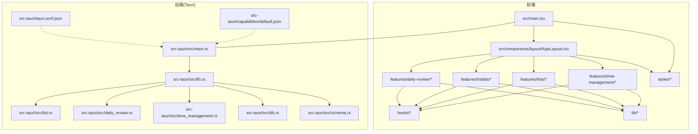
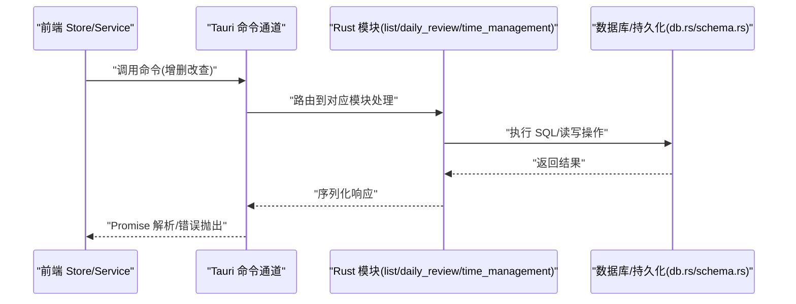
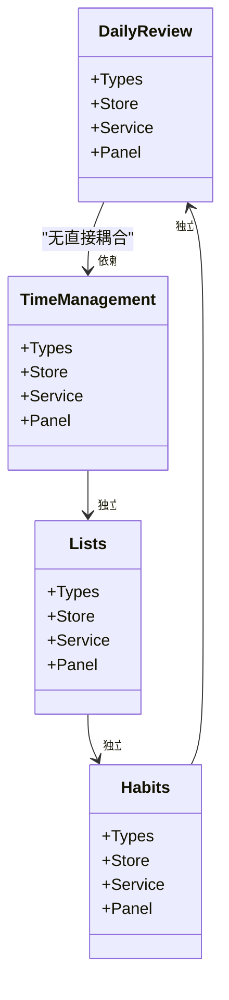
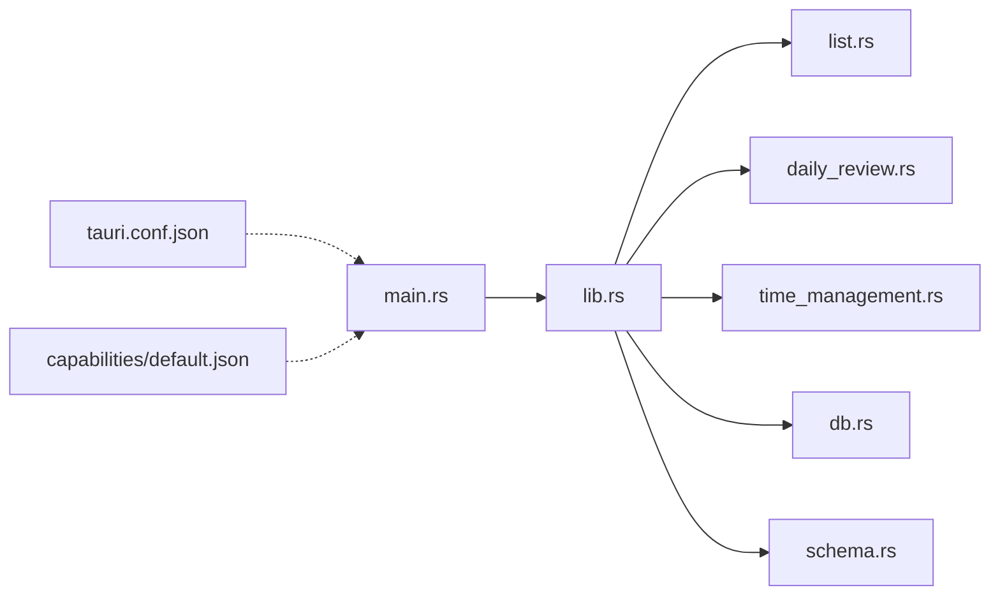
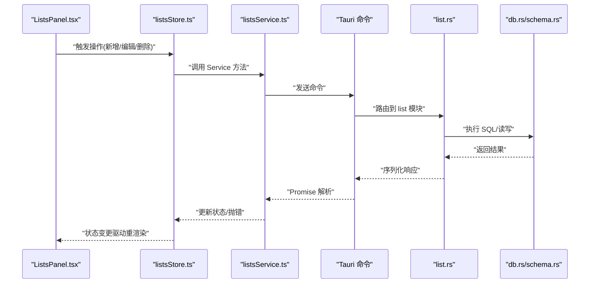
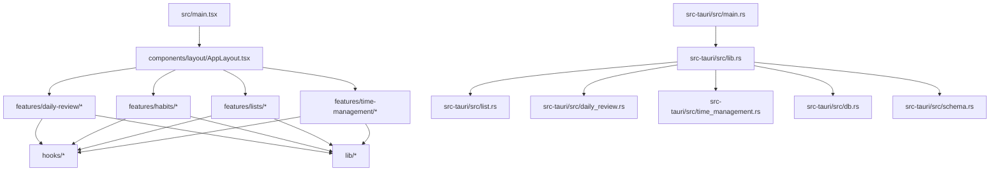

# 项目结构

<cite>
**本文引用的文件**   
- [src/main.tsx](file://src/main.tsx)
- [src/components/layout/AppLayout.tsx](file://src/components/layout/AppLayout.tsx)
- [src/features/daily-review/DailyReviewPanel.tsx](file://src/features/daily-review/DailyReviewPanel.tsx)
- [src/features/daily-review/dailyReviewStore.ts](file://src/features/daily-review/dailyReviewStore.ts)
- [src/features/daily-review/dailyReviewService.ts](file://src/features/daily-review/dailyReviewService.ts)
- [src/features/daily-review/dailyReviewTypes.ts](file://src/features/daily-review/dailyReviewTypes.ts)
- [src/features/habits/HabitPanel.tsx](file://src/features/habits/HabitPanel.tsx)
- [src/features/habits/habitTypes.ts](file://src/features/habits/habitTypes.ts)
- [src/features/lists/ListsPanel.tsx](file://src/features/lists/ListsPanel.tsx)
- [src/features/lists/listsStore.ts](file://src/features/lists/listsStore.ts)
- [src/features/lists/listsService.ts](file://src/features/lists/listsService.ts)
- [src/features/lists/listsTypes.ts](file://src/features/lists/listsTypes.ts)
- [src/features/time-management/TimeManagementPanel.tsx](file://src/features/time-management/TimeManagementPanel.tsx)
- [src/features/time-management/timeManagementStore.ts](file://src/features/time-management/timeManagementStore.ts)
- [src/features/time-management/timeManagementService.ts](file://src/features/time-management/timeManagementService.ts)
- [src/features/time-management/timeManagementTypes.ts](file://src/features/time-management/timeManagementTypes.ts)
- [src/hooks/use-tiptap-editor.ts](file://src/hooks/use-tiptap-editor.ts)
- [src/lib/createSyncEngine.ts](file://src/lib/createSyncEngine.ts)
- [src/styles/shared.css](file://src/styles/shared.css)
- [src/index.css](file://src/index.css)
- [src-tauri/src/lib.rs](file://src-tauri/src/lib.rs)
- [src-tauri/src/main.rs](file://src-tauri/src/main.rs)
- [src-tauri/src/db.rs](file://src-tauri/src/db.rs)
- [src-tauri/src/schema.rs](file://src-tauri/src/schema.rs)
- [src-tauri/src/list.rs](file://src-tauri/src/list.rs)
- [src-tauri/src/daily_review.rs](file://src-tauri/src/daily_review.rs)
- [src-tauri/src/time_management.rs](file://src-tauri/src/time_management.rs)
- [src-tauri/Cargo.toml](file://src-tauri/Cargo.toml)
- [src-tauri/tauri.conf.json](file://src-tauri/tauri.conf.json)
</cite>

## 目录
1. [简介](#简介)
2. [项目结构](#项目结构)
3. [核心组件](#核心组件)
4. [架构总览](#架构总览)
5. [详细组件分析](#详细组件分析)
6. [依赖分析](#依赖分析)
7. [性能考虑](#性能考虑)
8. [故障排查指南](#故障排查指南)
9. [结论](#结论)
10. [附录](#附录)

## 简介
本文件为 FishWorker 项目的“项目结构”说明文档，聚焦于前端 src 与后端 src-tauri 的目录组织、职责划分、命名约定与开发规范。文档面向不同技术背景的读者，提供从高层到代码级的结构化解读，并给出新模块开发的目录创建规范与模板建议，帮助团队保持一致的代码风格与可维护性。

## 项目结构
FishWorker 采用 Tauri 桌面应用架构：前端基于 React + TypeScript（Vite 构建），后端使用 Rust（Tauri 插件化）。整体分为两大目录：
- 前端 src：按“功能域 + 通用能力”分层组织，包含 features（业务特性）、components（UI 组件库）、hooks（复用逻辑）、lib（工具与引擎）、styles（样式）等。
- 后端 src-tauri：Rust 源码位于 src-tauri/src，按领域拆分模块；Tauri 配置位于 tauri.conf.json；能力权限在 capabilities/default.json。

图表来源
- [src/main.tsx](file://src/main.tsx)
- [src/components/layout/AppLayout.tsx](file://src/components/layout/AppLayout.tsx)
- [src/features/daily-review/DailyReviewPanel.tsx](file://src/features/daily-review/DailyReviewPanel.tsx)
- [src/features/habits/HabitPanel.tsx](file://src/features/habits/HabitPanel.tsx)
- [src/features/lists/ListsPanel.tsx](file://src/features/lists/ListsPanel.tsx)
- [src/features/time-management/TimeManagementPanel.tsx](file://src/features/time-management/TimeManagementPanel.tsx)
- [src-tauri/src/main.rs](file://src-tauri/src/main.rs)
- [src-tauri/src/lib.rs](file://src-tauri/src/lib.rs)
- [src-tauri/tauri.conf.json](file://src-tauri/tauri.conf.json)

章节来源
- [src/main.tsx](file://src/main.tsx)
- [src/components/layout/AppLayout.tsx](file://src/components/layout/AppLayout.tsx)
- [src-tauri/src/main.rs](file://src-tauri/src/main.rs)
- [src-tauri/src/lib.rs](file://src-tauri/src/lib.rs)
- [src-tauri/tauri.conf.json](file://src-tauri/tauri.conf.json)

## 核心组件
本节概述各子目录的职责与组织规范：
- components：可复用的 UI 组件与布局。layout 下放置页面级布局组件；tiptap-* 系列围绕编辑器扩展、节点、图标、基础控件与组合式 UI 进行模块化拆分。
- features：按业务域划分的特性目录，内部通常包含面板入口、Store（状态）、Service（数据与服务）、Types（类型定义）、以及该特性的样式与子组件。
- hooks：跨特性复用的自定义 Hook，如编辑器集成、窗口尺寸、滚动行为等。
- lib：与业务无关的工具与引擎，例如同步引擎 createSyncEngine。
- styles：全局样式与共享样式，index.css 作为入口引入。
- types：全局类型声明（global.d.ts）。

章节来源
- [src/components/layout/AppLayout.tsx](file://src/components/layout/AppLayout.tsx)
- [src/features/daily-review/DailyReviewPanel.tsx](file://src/features/daily-review/DailyReviewPanel.tsx)
- [src/features/habits/HabitPanel.tsx](file://src/features/habits/HabitPanel.tsx)
- [src/features/lists/ListsPanel.tsx](file://src/features/lists/ListsPanel.tsx)
- [src/features/time-management/TimeManagementPanel.tsx](file://src/features/time-management/TimeManagementPanel.tsx)
- [src/hooks/use-tiptap-editor.ts](file://src/hooks/use-tiptap-editor.ts)
- [src/lib/createSyncEngine.ts](file://src/lib/createSyncEngine.ts)
- [src/styles/shared.css](file://src/styles/shared.css)
- [src/index.css](file://src/index.css)

## 架构总览
前后端通过 Tauri 命令通道交互。前端 Store 调用 Service，Service 通过 Tauri 调用 Rust 侧 API，Rust 侧再访问数据库与持久化层。

图表来源
- [src/features/lists/listsService.ts](file://src/features/lists/listsService.ts)
- [src/features/daily-review/dailyReviewService.ts](file://src/features/daily-review/dailyReviewService.ts)
- [src/features/time-management/timeManagementService.ts](file://src/features/time-management/timeManagementService.ts)
- [src-tauri/src/lib.rs](file://src-tauri/src/lib.rs)
- [src-tauri/src/list.rs](file://src-tauri/src/list.rs)
- [src-tauri/src/daily_review.rs](file://src-tauri/src/daily_review.rs)
- [src-tauri/src/time_management.rs](file://src-tauri/src/time_management.rs)
- [src-tauri/src/db.rs](file://src-tauri/src/db.rs)
- [src-tauri/src/schema.rs](file://src-tauri/src/schema.rs)

## 详细组件分析

### 前端 features 分层设计（Store / Service / Types）
每个 feature 遵循统一的分层模式：
- Types：定义领域模型与接口类型，供前后端一致契约。
- Store：管理本地状态与副作用（如 Zustand store），订阅变化驱动 UI。
- Service：封装数据访问与外部调用（Tauri 命令、网络请求等），对 Store 暴露 Promise 方法。
- Panel/组件：消费 Store 的状态与方法，渲染界面。

图表来源
- [src/features/daily-review/dailyReviewTypes.ts](file://src/features/daily-review/dailyReviewTypes.ts)
- [src/features/daily-review/dailyReviewStore.ts](file://src/features/daily-review/dailyReviewStore.ts)
- [src/features/daily-review/dailyReviewService.ts](file://src/features/daily-review/dailyReviewService.ts)
- [src/features/daily-review/DailyReviewPanel.tsx](file://src/features/daily-review/DailyReviewPanel.tsx)
- [src/features/habits/habitTypes.ts](file://src/features/habits/habitTypes.ts)
- [src/features/habits/HabitPanel.tsx](file://src/features/habits/HabitPanel.tsx)
- [src/features/lists/listsTypes.ts](file://src/features/lists/listsTypes.ts)
- [src/features/lists/listsStore.ts](file://src/features/lists/listsStore.ts)
- [src/features/lists/listsService.ts](file://src/features/lists/listsService.ts)
- [src/features/lists/ListsPanel.tsx](file://src/features/lists/ListsPanel.tsx)
- [src/features/time-management/timeManagementTypes.ts](file://src/features/time-management/timeManagementTypes.ts)
- [src/features/time-management/timeManagementStore.ts](file://src/features/time-management/timeManagementStore.ts)
- [src/features/time-management/timeManagementService.ts](file://src/features/time-management/timeManagementService.ts)
- [src/features/time-management/TimeManagementPanel.tsx](file://src/features/time-management/TimeManagementPanel.tsx)

章节来源
- [src/features/daily-review/dailyReviewTypes.ts](file://src/features/daily-review/dailyReviewTypes.ts)
- [src/features/daily-review/dailyReviewStore.ts](file://src/features/daily-review/dailyReviewStore.ts)
- [src/features/daily-review/dailyReviewService.ts](file://src/features/daily-review/dailyReviewService.ts)
- [src/features/daily-review/DailyReviewPanel.tsx](file://src/features/daily-review/DailyReviewPanel.tsx)
- [src/features/habits/habitTypes.ts](file://src/features/habits/habitTypes.ts)
- [src/features/habits/HabitPanel.tsx](file://src/features/habits/HabitPanel.tsx)
- [src/features/lists/listsTypes.ts](file://src/features/lists/listsTypes.ts)
- [src/features/lists/listsStore.ts](file://src/features/lists/listsStore.ts)
- [src/features/lists/listsService.ts](file://src/features/lists/listsService.ts)
- [src/features/lists/ListsPanel.tsx](file://src/features/lists/ListsPanel.tsx)
- [src/features/time-management/timeManagementTypes.ts](file://src/features/time-management/timeManagementTypes.ts)
- [src/features/time-management/timeManagementStore.ts](file://src/features/time-management/timeManagementStore.ts)
- [src/features/time-management/timeManagementService.ts](file://src/features/time-management/timeManagementService.ts)
- [src/features/time-management/TimeManagementPanel.tsx](file://src/features/time-management/TimeManagementPanel.tsx)

### 组件库组织结构与命名约定
- layout：页面级布局容器，负责整体框架与导航区域。
- tiptap-*：围绕编辑器生态的模块化拆分
  - extension：编辑器扩展
  - node：富文本节点实现与样式
  - icons：SVG 图标组件
  - ui-primitive：基础原子控件（按钮、卡片、输入、弹出框等）
  - ui：组合型 UI 控件（工具栏、下拉菜单等）
  - templates：示例模板与主题切换
- 命名约定
  - 组件文件使用 PascalCase，如 Button.tsx、Card.tsx
  - 样式文件与组件同名或语义化命名，如 button.scss、card.scss
  - 图标以 *-icon.tsx 结尾
  - Hooks 以 use- 前缀，如 use-tiptap-editor.ts
  - 服务与存储以 *Service.ts、*Store.ts 命名
  - 类型以 *Types.ts 或 *.ts 中导出类型为主

章节来源
- [src/components/layout/AppLayout.tsx](file://src/components/layout/AppLayout.tsx)
- [src/hooks/use-tiptap-editor.ts](file://src/hooks/use-tiptap-editor.ts)
- [src/styles/shared.css](file://src/styles/shared.css)

### 后端 src-tauri 模块划分与配置文件
- 模块划分
  - main.rs：应用入口与生命周期
  - lib.rs：Tauri 命令注册与模块装配
  - list.rs、daily_review.rs、time_management.rs：按领域划分的命令实现
  - db.rs：数据库连接与通用操作
  - schema.rs：表结构与迁移相关
- 配置文件
  - tauri.conf.json：应用元信息、窗口、命令白名单、打包资源等
  - Cargo.toml：Rust 依赖与包名
  - capabilities/default.json：安全能力与权限策略

图表来源
- [src-tauri/src/main.rs](file://src-tauri/src/main.rs)
- [src-tauri/src/lib.rs](file://src-tauri/src/lib.rs)
- [src-tauri/src/list.rs](file://src-tauri/src/list.rs)
- [src-tauri/src/daily_review.rs](file://src-tauri/src/daily_review.rs)
- [src-tauri/src/time_management.rs](file://src-tauri/src/time_management.rs)
- [src-tauri/src/db.rs](file://src-tauri/src/db.rs)
- [src-tauri/src/schema.rs](file://src-tauri/src/schema.rs)
- [src-tauri/tauri.conf.json](file://src-tauri/tauri.conf.json)
- [src-tauri/Cargo.toml](file://src-tauri/Cargo.toml)

章节来源
- [src-tauri/src/main.rs](file://src-tauri/src/main.rs)
- [src-tauri/src/lib.rs](file://src-tauri/src/lib.rs)
- [src-tauri/src/list.rs](file://src-tauri/src/list.rs)
- [src-tauri/src/daily_review.rs](file://src-tauri/src/daily_review.rs)
- [src-tauri/src/time_management.rs](file://src-tauri/src/time_management.rs)
- [src-tauri/src/db.rs](file://src-tauri/src/db.rs)
- [src-tauri/src/schema.rs](file://src-tauri/src/schema.rs)
- [src-tauri/tauri.conf.json](file://src-tauri/tauri.conf.json)
- [src-tauri/Cargo.toml](file://src-tauri/Cargo.toml)

### 典型工作流序列图（以列表为例）

图表来源
- [src/features/lists/ListsPanel.tsx](file://src/features/lists/ListsPanel.tsx)
- [src/features/lists/listsStore.ts](file://src/features/lists/listsStore.ts)
- [src/features/lists/listsService.ts](file://src/features/lists/listsService.ts)
- [src-tauri/src/lib.rs](file://src-tauri/src/lib.rs)
- [src-tauri/src/list.rs](file://src-tauri/src/list.rs)
- [src-tauri/src/db.rs](file://src-tauri/src/db.rs)
- [src-tauri/src/schema.rs](file://src-tauri/src/schema.rs)

## 依赖分析
- 前端
  - main.tsx 作为入口，挂载 AppLayout 与全局样式
  - features 之间尽量保持低耦合，通过 hooks 与 lib 共享能力
  - components 提供跨特性复用能力
- 后端
  - lib.rs 集中注册命令，避免在 main.rs 中散落逻辑
  - 领域模块仅依赖 db.rs 与 schema.rs，保持单一职责
  - tauri.conf.json 控制命令可见性与打包资源

图表来源
- [src/main.tsx](file://src/main.tsx)
- [src/components/layout/AppLayout.tsx](file://src/components/layout/AppLayout.tsx)
- [src/features/daily-review/DailyReviewPanel.tsx](file://src/features/daily-review/DailyReviewPanel.tsx)
- [src/features/habits/HabitPanel.tsx](file://src/features/habits/HabitPanel.tsx)
- [src/features/lists/ListsPanel.tsx](file://src/features/lists/ListsPanel.tsx)
- [src/features/time-management/TimeManagementPanel.tsx](file://src/features/time-management/TimeManagementPanel.tsx)
- [src-tauri/src/main.rs](file://src-tauri/src/main.rs)
- [src-tauri/src/lib.rs](file://src-tauri/src/lib.rs)
- [src-tauri/src/list.rs](file://src-tauri/src/list.rs)
- [src-tauri/src/daily_review.rs](file://src-tauri/src/daily_review.rs)
- [src-tauri/src/time_management.rs](file://src-tauri/src/time_management.rs)
- [src-tauri/src/db.rs](file://src-tauri/src/db.rs)
- [src-tauri/src/schema.rs](file://src-tauri/src/schema.rs)

章节来源
- [src/main.tsx](file://src/main.tsx)
- [src/components/layout/AppLayout.tsx](file://src/components/layout/AppLayout.tsx)
- [src-tauri/src/main.rs](file://src-tauri/src/main.rs)
- [src-tauri/src/lib.rs](file://src-tauri/src/lib.rs)

## 性能考虑
- 前端
  - 将重型计算与副作用下沉至 hooks 与 lib，避免在组件内重复执行
  - 合理使用 Store 选择器，减少不必要的重渲染
  - 图片与静态资源按需加载，样式局部作用域化
- 后端
  - 数据库连接池与事务批量操作，减少往返次数
  - 命令参数校验前置，尽早失败
  - 大对象分块传输与分页查询

[本节为通用指导，不直接分析具体文件]

## 故障排查指南
- 前端
  - 检查 Store 是否被正确订阅与更新，确认 Service 的错误分支是否向上抛出
  - 确认全局样式与组件样式冲突，必要时使用更具体的选择器或 CSS Modules
- 后端
  - 核对 tauri.conf.json 的命令白名单与能力权限
  - 查看 Rust 模块日志与错误栈，定位 SQL 或序列化问题

章节来源
- [src-tauri/tauri.conf.json](file://src-tauri/tauri.conf.json)
- [src-tauri/src/lib.rs](file://src-tauri/src/lib.rs)

## 结论
FishWorker 的前后端均遵循清晰的分层与模块化原则：前端以 features 为核心，配合 components、hooks、lib 与 styles 形成高内聚、低耦合的结构；后端以领域模块划分并通过 Tauri 命令对外暴露能力。统一的命名约定与分层模式有助于团队协作与新模块快速接入。

## 附录

### 新模块开发规范（建议）
- 前端
  - 在 features 下新建目录，命名为小写短横线风格，如 new-feature
  - 必备文件
    - NewFeaturePanel.tsx：面板入口
    - newFeatureStore.ts：状态管理
    - newFeatureService.ts：数据与服务
    - newFeatureTypes.ts：类型定义
    - newFeature.css：特性样式（可选）
  - 若涉及编辑器，参考 tiptap-* 的拆分方式，将扩展、节点、图标、UI 分离
- 后端
  - 在 src-tauri/src 下新增 new_feature.rs，并在 lib.rs 中注册命令
  - 如需新表，更新 schema.rs 与 db.rs 中的通用方法
  - 在 tauri.conf.json 中确保命令可见性与权限

[本节为概念性指导，不直接分析具体文件]