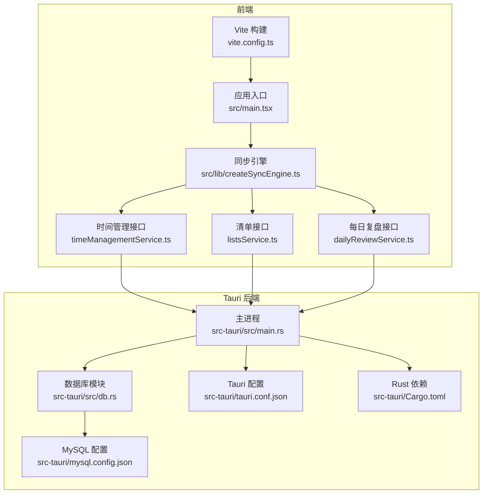
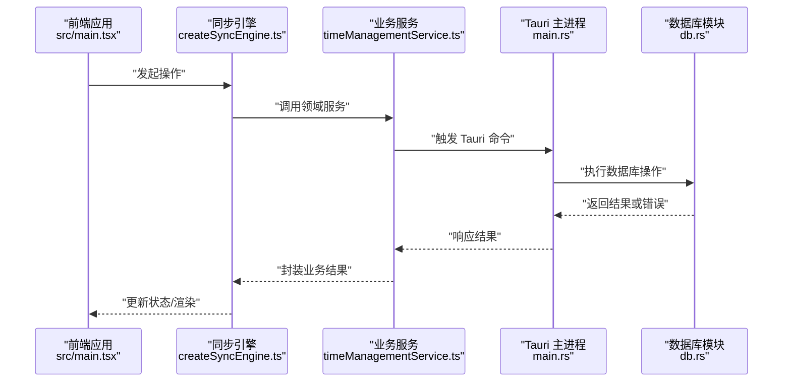
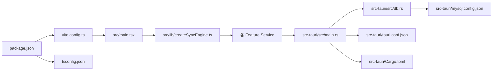

# 故障排除

<cite>
**本文引用的文件**   
- [README.md](file://README.md)
- [package.json](file://package.json)
- [vite.config.ts](file://vite.config.ts)
- [tsconfig.json](file://tsconfig.json)
- [src/main.tsx](file://src/main.tsx)
- [src/lib/createSyncEngine.ts](file://src/lib/createSyncEngine.ts)
- [src/features/time-management/timeManagementService.ts](file://src/features/time-management/timeManagementService.ts)
- [src/features/lists/listsService.ts](file://src/features/lists/listsService.ts)
- [src/features/daily-review/dailyReviewService.ts](file://src/features/daily-review/dailyReviewService.ts)
- [src-tauri/src/main.rs](file://src-tauri/src/main.rs)
- [src-tauri/src/db.rs](file://src-tauri/src/db.rs)
- [src-tauri/Cargo.toml](file://src-tauri/Cargo.toml)
- [src-tauri/tauri.conf.json](file://src-tauri/tauri.conf.json)
- [src-tauri/mysql.config.json](file://src-tauri/mysql.config.json)
</cite>

## 目录
1. [简介](#简介)
2. [项目结构](#项目结构)
3. [核心组件](#核心组件)
4. [架构总览](#架构总览)
5. [详细组件分析](#详细组件分析)
6. [依赖关系分析](#依赖关系分析)
7. [性能考虑](#性能考虑)
8. [故障排除指南](#故障排除指南)
9. [结论](#结论)
10. [附录](#附录)

## 简介
本指南面向 FishWorker 应用的开发者与运维人员，聚焦于环境问题、构建失败、运行时错误、日志与性能监控、内存泄漏检测、数据库连接问题、网络通信异常、第三方依赖冲突等常见问题的系统化排查方法与解决步骤。文档同时提供社区支持与问题反馈渠道建议，帮助快速定位并解决问题。

## 项目结构
FishWorker 采用 Tauri + Vite + React 的前后端混合架构：
- 前端使用 Vite 构建，React 作为 UI 框架，业务逻辑分布在 features 目录下，服务层通过 createSyncEngine 与 Rust 后端交互。
- 后端使用 Tauri（Rust），负责本地持久化与数据库访问，配置集中在 tauri.conf.json 与 mysql.config.json。

**图示来源**
- [vite.config.ts](file://vite.config.ts)
- [src/main.tsx](file://src/main.tsx)
- [src/lib/createSyncEngine.ts](file://src/lib/createSyncEngine.ts)
- [src/features/time-management/timeManagementService.ts](file://src/features/time-management/timeManagementService.ts)
- [src/features/lists/listsService.ts](file://src/features/lists/listsService.ts)
- [src/features/daily-review/dailyReviewService.ts](file://src/features/daily-review/dailyReviewService.ts)
- [src-tauri/src/main.rs](file://src-tauri/src/main.rs)
- [src-tauri/src/db.rs](file://src-tauri/src/db.rs)
- [src-tauri/tauri.conf.json](file://src-tauri/tauri.conf.json)
- [src-tauri/mysql.config.json](file://src-tauri/mysql.config.json)
- [src-tauri/Cargo.toml](file://src-tauri/Cargo.toml)

**章节来源**
- [README.md](file://README.md)
- [package.json](file://package.json)
- [vite.config.ts](file://vite.config.ts)
- [tsconfig.json](file://tsconfig.json)
- [src/main.tsx](file://src/main.tsx)
- [src/lib/createSyncEngine.ts](file://src/lib/createSyncEngine.ts)
- [src/features/time-management/timeManagementService.ts](file://src/features/time-management/timeManagementService.ts)
- [src/features/lists/listsService.ts](file://src/features/lists/listsService.ts)
- [src/features/daily-review/dailyReviewService.ts](file://src/features/daily-review/dailyReviewService.ts)
- [src-tauri/src/main.rs](file://src-tauri/src/main.rs)
- [src-tauri/src/db.rs](file://src-tauri/src/db.rs)
- [src-tauri/Cargo.toml](file://src-tauri/Cargo.toml)
- [src-tauri/tauri.conf.json](file://src-tauri/tauri.conf.json)
- [src-tauri/mysql.config.json](file://src-tauri/mysql.config.json)

## 核心组件
- 同步引擎（createSyncEngine）：统一封装前后端数据同步与状态管理，是跨功能模块的共享基础设施。
- 服务层（各 feature 下的 Service）：将领域操作抽象为可测试的服务函数，便于错误处理与重试策略。
- Tauri 主进程（main.rs）：注册命令、初始化资源、桥接前端调用与后端能力。
- 数据库模块（db.rs）：封装 MySQL 连接、查询与事务，集中处理连接池与错误映射。

**章节来源**
- [src/lib/createSyncEngine.ts](file://src/lib/createSyncEngine.ts)
- [src/features/time-management/timeManagementService.ts](file://src/features/time-management/timeManagementService.ts)
- [src/features/lists/listsService.ts](file://src/features/lists/listsService.ts)
- [src/features/daily-review/dailyReviewService.ts](file://src/features/daily-review/dailyReviewService.ts)
- [src-tauri/src/main.rs](file://src-tauri/src/main.rs)
- [src-tauri/src/db.rs](file://src-tauri/src/db.rs)

## 架构总览
下图展示了从前端到后端的典型请求流程，包括 Tauri 命令路由、数据库访问与错误返回路径。

**图示来源**
- [src/main.tsx](file://src/main.tsx)
- [src/lib/createSyncEngine.ts](file://src/lib/createSyncEngine.ts)
- [src/features/time-management/timeManagementService.ts](file://src/features/time-management/timeManagementService.ts)
- [src-tauri/src/main.rs](file://src-tauri/src/main.rs)
- [src-tauri/src/db.rs](file://src-tauri/src/db.rs)

## 详细组件分析

### 同步引擎（createSyncEngine）
- 职责：统一状态同步、错误传播、重试与降级策略；为各功能模块提供一致的调用体验。
- 常见问题：
  - 状态不同步：检查是否遗漏了状态更新回调或事件订阅。
  - 重复提交：确保幂等键或去抖机制生效。
  - 错误未捕获：确认全局错误边界与局部 try/catch 覆盖关键路径。
- 调试技巧：
  - 在关键分支添加结构化日志，记录输入参数与返回值摘要。
  - 使用浏览器开发者工具的网络面板观察 Tauri 命令调用栈。

**章节来源**
- [src/lib/createSyncEngine.ts](file://src/lib/createSyncEngine.ts)

### 时间管理服务（timeManagementService）
- 职责：封装时间管理领域的 CRUD 与聚合计算，协调同步引擎进行状态更新。
- 常见问题：
  - 数据不一致：检查事务边界与回滚逻辑。
  - 性能瓶颈：避免在循环中频繁触发重渲染，合并批量更新。
- 调试技巧：
  - 对耗时操作打点计时，定位慢查询或阻塞调用。
  - 使用断点与条件断点缩小问题范围。

**章节来源**
- [src/features/time-management/timeManagementService.ts](file://src/features/time-management/timeManagementService.ts)

### 清单服务（listsService）
- 职责：管理清单与子项的增删改查、排序与模板导入导出。
- 常见问题：
  - 拖拽排序异常：校验索引边界与稳定性算法。
  - 模板导入失败：检查 JSON 结构与字段映射。
- 调试技巧：
  - 输出变更集差异，对比预期与实际状态。
  - 使用快照测试验证复杂场景。

**章节来源**
- [src/features/lists/listsService.ts](file://src/features/lists/listsService.ts)

### 每日复盘服务（dailyReviewService）
- 职责：汇总统计、自动保存与编辑协作。
- 常见问题：
  - 自动保存冲突：实现乐观锁或最后写入优先策略。
  - 统计不准确：核对聚合函数的边界条件。
- 调试技巧：
  - 开启详细日志，记录每次保存的增量与最终结果。
  - 模拟并发写入，验证一致性。

**章节来源**
- [src/features/daily-review/dailyReviewService.ts](file://src/features/daily-review/dailyReviewService.ts)

### Tauri 主进程（main.rs）
- 职责：注册命令、生命周期管理、错误映射与权限控制。
- 常见问题：
  - 命令未注册：检查命令名与路由表。
  - 权限不足：确认 capabilities 与窗口权限配置。
- 调试技巧：
  - 启用 Tauri 开发日志，查看命令调用链。
  - 使用最小复现用例隔离问题。

**章节来源**
- [src-tauri/src/main.rs](file://src-tauri/src/main.rs)

### 数据库模块（db.rs）
- 职责：连接池管理、SQL 执行、事务与错误转换。
- 常见问题：
  - 连接超时：检查网络连通性与认证信息。
  - 死锁与长事务：优化 SQL 与缩短事务范围。
- 调试技巧：
  - 打印慢查询日志，结合 EXPLAIN 分析执行计划。
  - 使用连接池监控指标评估容量。

**章节来源**
- [src-tauri/src/db.rs](file://src-tauri/src/db.rs)

## 依赖关系分析
- 前端依赖：
  - Vite 构建配置与 TypeScript 编译选项影响打包与类型检查。
  - React 生态库版本需与 Tauri 前端 SDK 兼容。
- 后端依赖：
  - Rust 工具链与 Cargo 包管理器决定构建行为。
  - MySQL 客户端驱动与连接参数影响数据库访问。

**图示来源**
- [package.json](file://package.json)
- [vite.config.ts](file://vite.config.ts)
- [tsconfig.json](file://tsconfig.json)
- [src/main.tsx](file://src/main.tsx)
- [src/lib/createSyncEngine.ts](file://src/lib/createSyncEngine.ts)
- [src-tauri/src/main.rs](file://src-tauri/src/main.rs)
- [src-tauri/src/db.rs](file://src-tauri/src/db.rs)
- [src-tauri/tauri.conf.json](file://src-tauri/tauri.conf.json)
- [src-tauri/mysql.config.json](file://src-tauri/mysql.config.json)
- [src-tauri/Cargo.toml](file://src-tauri/Cargo.toml)

**章节来源**
- [package.json](file://package.json)
- [vite.config.ts](file://vite.config.ts)
- [tsconfig.json](file://tsconfig.json)
- [src-tauri/Cargo.toml](file://src-tauri/Cargo.toml)

## 性能考虑
- 前端渲染：
  - 减少不必要的重渲染，使用 memo 与选择性更新。
  - 大列表虚拟化与分页加载。
- 同步策略：
  - 合并多次写操作，降低 Tauri 命令调用频率。
  - 合理设置重试退避与最大重试次数。
- 数据库：
  - 索引优化与查询精简，避免 N+1 问题。
  - 连接池大小与超时参数调优。

[本节为通用指导，不直接分析具体文件]

## 故障排除指南

### 环境与安装问题
- Node.js 与 pnpm 版本不匹配：
  - 现象：依赖解析失败或脚本运行报错。
  - 排查：检查 package.json 的 engines 与 pnpm-workspace.yaml 配置。
  - 解决：使用指定版本管理器切换环境。
- Rust 工具链缺失：
  - 现象：Tauri 构建失败，提示找不到 rustc 或 cargo。
  - 排查：运行 rustup show 确认安装与 PATH。
  - 解决：安装稳定版工具链并刷新环境变量。
- 系统权限与防火墙：
  - 现象：端口占用或无法启动本地服务。
  - 排查：netstat 或 lsof 检查端口占用；关闭安全软件拦截。
  - 解决：更换端口或调整防火墙规则。

**章节来源**
- [package.json](file://package.json)
- [vite.config.ts](file://vite.config.ts)
- [src-tauri/Cargo.toml](file://src-tauri/Cargo.toml)

### 构建失败
- TypeScript 类型错误：
  - 现象：tsc 或 Vite 构建报类型不匹配。
  - 排查：根据错误定位 tsconfig.json 的严格模式与模块解析。
  - 解决：修正类型定义或放宽必要时的类型约束。
- Vite 插件冲突：
  - 现象：构建阶段插件报错或产物异常。
  - 排查：逐一禁用插件定位冲突源。
  - 解决：升级或替换插件，调整构建顺序。
- Tauri 构建失败：
  - 现象：cargo build 或 tauri build 报错。
  - 排查：查看 Cargo.lock 与依赖版本；检查平台特定依赖。
  - 解决：清理 target 目录并重新生成锁文件。

**章节来源**
- [tsconfig.json](file://tsconfig.json)
- [vite.config.ts](file://vite.config.ts)
- [src-tauri/Cargo.toml](file://src-tauri/Cargo.toml)

### 运行时错误
- 前端崩溃：
  - 现象：页面白屏或控制台抛出异常。
  - 排查：打开开发者工具，查看堆栈与网络请求。
  - 解决：修复空引用、异步竞态与未捕获异常。
- Tauri 命令未找到：
  - 现象：前端调用后端方法无响应。
  - 排查：确认 main.rs 中的命令注册与名称一致。
  - 解决：补全命令注册或修正调用名。
- 状态不同步：
  - 现象：UI 显示与数据不一致。
  - 排查：检查 createSyncEngine 的状态更新路径与副作用。
  - 解决：增加幂等键与去抖，确保单次操作的原子性。

**章节来源**
- [src/main.tsx](file://src/main.tsx)
- [src/lib/createSyncEngine.ts](file://src/lib/createSyncEngine.ts)
- [src-tauri/src/main.rs](file://src-tauri/src/main.rs)

### 日志分析与调试技巧
- 前端日志：
  - 使用 console 结构化输出，包含上下文与追踪 ID。
  - 利用浏览器“性能”面板录制用户交互与渲染过程。
- Tauri 日志：
  - 启用开发模式日志，查看命令调用链与错误码。
  - 将关键路径日志落盘，便于离线分析。
- 数据库日志：
  - 开启慢查询日志，结合 EXPLAIN 优化 SQL。
  - 监控连接池使用率与等待队列长度。

**章节来源**
- [src/lib/createSyncEngine.ts](file://src/lib/createSyncEngine.ts)
- [src-tauri/src/main.rs](file://src-tauri/src/main.rs)
- [src-tauri/src/db.rs](file://src-tauri/src/db.rs)

### 性能监控与内存泄漏检测
- 前端：
  - 使用“内存”面板进行堆快照对比，识别未释放对象。
  - 监听组件卸载事件，确保清理定时器与订阅。
- 后端：
  - 使用 Rust 性能剖析工具（如 perf 或 flamegraph）定位热点。
  - 监控连接池与线程池指标，避免资源耗尽。
- 端到端：
  - 埋点关键路径耗时，建立基线与告警阈值。
  - 压测高并发场景，观察错误率与延迟分布。

**章节来源**
- [src/lib/createSyncEngine.ts](file://src/lib/createSyncEngine.ts)
- [src-tauri/src/db.rs](file://src-tauri/src/db.rs)

### 数据库连接问题
- 连接失败：
  - 现象：启动时报连接拒绝或认证失败。
  - 排查：检查 mysql.config.json 的地址、端口、用户名与密码。
  - 解决：修正配置并确保 MySQL 服务可达。
- 连接池耗尽：
  - 现象：请求长时间等待或超时。
  - 排查：查看连接池配置与活跃连接数。
  - 解决：增大池大小或优化长事务。
- 字符集与编码：
  - 现象：中文乱码或插入失败。
  - 排查：核对数据库与连接字符串的字符集设置。
  - 解决：统一为 UTF-8 并重启连接。

**章节来源**
- [src-tauri/mysql.config.json](file://src-tauri/mysql.config.json)
- [src-tauri/src/db.rs](file://src-tauri/src/db.rs)

### 网络通信异常
- 跨域与权限：
  - 现象：前端调用被拒绝或 CORS 错误。
  - 排查：检查 tauri.conf.json 的窗口与协议配置。
  - 解决：调整权限白名单与协议绑定。
- 超时与重试：
  - 现象：偶发请求失败。
  - 排查：在网络面板查看请求耗时与错误码。
  - 解决：增加指数退避重试与熔断保护。
- 代理与证书：
  - 现象：企业网络下无法访问外部服务。
  - 排查：确认代理与 CA 证书配置。
  - 解决：配置系统代理或导入证书。

**章节来源**
- [src-tauri/tauri.conf.json](file://src-tauri/tauri.conf.json)
- [src/lib/createSyncEngine.ts](file://src/lib/createSyncEngine.ts)

### 第三方依赖冲突
- 前端依赖：
  - 现象：构建时报版本不兼容或重复依赖。
  - 排查：使用 pnpm why 与 tree 查看依赖树。
  - 解决：锁定版本或使用 overrides 强制统一。
- Rust 依赖：
  - 现象：编译失败或链接错误。
  - 排查：检查 Cargo.toml 的版本与特性开关。
  - 解决：升级驱动或调整目标平台特性。
- 插件与扩展：
  - 现象：Vite 插件冲突导致构建异常。
  - 排查：逐个禁用插件定位问题。
  - 解决：升级插件或寻找替代方案。

**章节来源**
- [package.json](file://package.json)
- [src-tauri/Cargo.toml](file://src-tauri/Cargo.toml)

### 社区支持与问题反馈
- 官方仓库 Issues：
  - 提交前搜索已有问题，附上复现步骤与环境信息。
- 讨论区与论坛：
  - 分享经验与最佳实践，获取社区建议。
- 贡献指南：
  - 遵循代码规范与提交流程，提高问题修复效率。

[本节为通用指导，不直接分析具体文件]

## 结论
通过系统化的问题分类、清晰的诊断流程与针对性的解决步骤，FishWorker 的故障排除效率可显著提升。建议在日常开发与发布流程中引入自动化检查与监控告警，持续优化用户体验与系统稳定性。

[本节为总结性内容，不直接分析具体文件]

## 附录
- 常用命令参考：
  - 前端开发：启动开发服务器、构建产物、类型检查。
  - Tauri 开发：运行桌面应用、打包分发、查看日志。
- 配置文件要点：
  - vite.config.ts：构建优化与插件配置。
  - tauri.conf.json：窗口、协议与权限设置。
  - mysql.config.json：数据库连接参数与字符集。

**章节来源**
- [vite.config.ts](file://vite.config.ts)
- [src-tauri/tauri.conf.json](file://src-tauri/tauri.conf.json)
- [src-tauri/mysql.config.json](file://src-tauri/mysql.config.json)