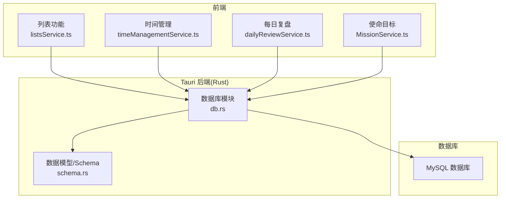
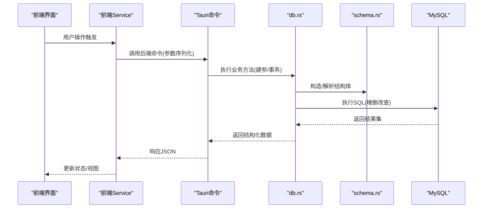
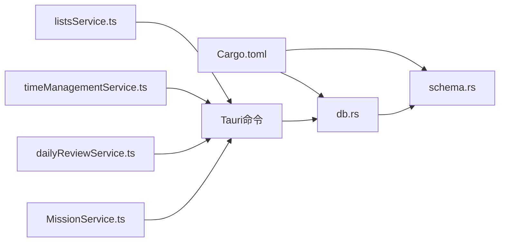

# 数据库设计

<cite>
**本文引用的文件**
- [src-tauri/src/db.rs](file://src-tauri/src/db.rs)
- [src-tauri/src/schema.rs](file://src-tauri/src/schema.rs)
- [src-tauri/mysql.config.json](file://src-tauri/mysql.config.json)
- [src-tauri/Cargo.toml](file://src-tauri/Cargo.toml)
- [src/features/lists/listsService.ts](file://src/features/lists/listsService.ts)
- [src/features/time-management/timeManagementService.ts](file://src/features/time-management/timeManagementService.ts)
- [src/features/daily-review/dailyReviewService.ts](file://src/features/daily-review/dailyReviewService.ts)
- [src/features/mission/MissionService.ts](file://src/features/mission/MissionService.ts)
</cite>

## 目录
1. [引言](#引言)
2. [项目结构](#项目结构)
3. [核心组件](#核心组件)
4. [架构总览](#架构总览)
5. [详细组件分析](#详细组件分析)
6. [依赖分析](#依赖分析)
7. [性能考虑](#性能考虑)
8. [故障排查指南](#故障排查指南)
9. [结论](#结论)
10. [附录](#附录)

## 引言
本文件为 FishWorker 应用的数据库设计文档，聚焦于 MySQL 数据库的表结构设计、实体关系与字段定义、主键/外键/索引/约束设计原则、数据访问模式与查询优化策略、数据验证与业务规则实现、数据生命周期管理（备份恢复与迁移）、数据安全与隐私要求、访问控制机制，以及数据库配置与连接池设置。文档同时结合前端服务层调用路径，说明从 UI 到后端 Rust 再到 MySQL 的数据流与一致性保障。

## 项目结构
FishWorker 采用 Tauri + React 的前后端一体化桌面应用架构：
- 前端 TypeScript 通过 Service 层发起请求；
- 后端 Rust 提供 Tauri 命令接口，封装数据库访问逻辑；
- MySQL 作为持久化存储。

图表来源
- [src/features/lists/listsService.ts](file://src/features/lists/listsService.ts)
- [src/features/time-management/timeManagementService.ts](file://src/features/time-management/timeManagementService.ts)
- [src/features/daily-review/dailyReviewService.ts](file://src/features/daily-review/dailyReviewService.ts)
- [src/features/mission/MissionService.ts](file://src/features/mission/MissionService.ts)
- [src-tauri/src/db.rs](file://src-tauri/src/db.rs)
- [src-tauri/src/schema.rs](file://src-tauri/src/schema.rs)

章节来源
- [src-tauri/src/db.rs](file://src-tauri/src/db.rs)
- [src-tauri/src/schema.rs](file://src-tauri/src/schema.rs)
- [src/features/lists/listsService.ts](file://src/features/lists/listsService.ts)
- [src/features/time-management/timeManagementService.ts](file://src/features/time-management/timeManagementService.ts)
- [src/features/daily-review/dailyReviewService.ts](file://src/features/daily-review/dailyReviewService.ts)
- [src/features/mission/MissionService.ts](file://src/features/mission/MissionService.ts)

## 核心组件
- 数据库模块(db.rs)：负责连接 MySQL、执行 SQL、事务处理、错误返回等。
- 数据模型(schema.rs)：定义与数据库表对应的数据结构及映射。
- 配置文件(mysql.config.json)：保存 MySQL 连接参数（主机、端口、用户名、密码、库名等）。
- 前端服务层：各功能模块的 Service 文件，统一封装对后端的调用。

章节来源
- [src-tauri/src/db.rs](file://src-tauri/src/db.rs)
- [src-tauri/src/schema.rs](file://src-tauri/src/schema.rs)
- [src-tauri/mysql.config.json](file://src-tauri/mysql.config.json)
- [src/features/lists/listsService.ts](file://src/features/lists/listsService.ts)
- [src/features/time-management/timeManagementService.ts](file://src/features/time-management/timeManagementService.ts)
- [src/features/daily-review/dailyReviewService.ts](file://src/features/daily-review/dailyReviewService.ts)
- [src/features/mission/MissionService.ts](file://src/features/mission/MissionService.ts)

## 架构总览
整体数据流遵循“前端 Service → Tauri 命令 → db.rs → schema.rs → MySQL”的路径。db.rs 中集中管理连接与执行，schema.rs 提供类型安全的结构体映射，确保前后端数据契约一致。

图表来源
- [src-tauri/src/db.rs](file://src-tauri/src/db.rs)
- [src-tauri/src/schema.rs](file://src-tauri/src/schema.rs)

## 详细组件分析

### 数据库连接与配置
- 连接参数来源于 mysql.config.json，包含主机、端口、用户名、密码、数据库名等。
- db.rs 在启动或首次使用时加载配置并建立连接池，复用连接以提升性能。
- 建议将敏感信息（如密码）通过环境变量注入，避免硬编码。

章节来源
- [src-tauri/mysql.config.json](file://src-tauri/mysql.config.json)
- [src-tauri/src/db.rs](file://src-tauri/src/db.rs)

### 数据模型与映射
- schema.rs 定义了与 MySQL 表对应的结构体，用于序列化和反序列化。
- 字段命名与数据库列名保持一致或通过注解映射。
- 所有对外暴露的数据均通过 schema.rs 中的结构体进行约束，保证类型安全。

章节来源
- [src-tauri/src/schema.rs](file://src-tauri/src/schema.rs)

### 数据访问模式
- 读多写少场景：使用只读连接或共享连接池，减少锁竞争。
- 批量写入：合并多次插入为批量语句，降低往返开销。
- 事务边界：跨表更新必须包裹在事务中，失败时回滚，保证一致性。
- 分页与过滤：在服务层组装 LIMIT/OFFSET 与 WHERE 条件，避免全表扫描。

章节来源
- [src-tauri/src/db.rs](file://src-tauri/src/db.rs)

### 表结构与字段定义（概念性）
以下为概念性表结构建议，实际以 schema.rs 与 db.rs 的实现为准：
- 任务表：id(主键)、标题、描述、优先级、状态、创建时间、更新时间、所属项目ID(外键)。
- 习惯表：id(主键)、名称、频率、开始日期、结束日期、完成记录(JSON或关联表)、创建时间、更新时间。
- 清单表：id(主键)、名称、排序、父级ID(自引用外键)、创建时间、更新时间。
- 复盘日志表：id(主键)、日期、内容、创建时间、更新时间。
- 目标/使命表：id(主键)、标题、阶段、进度、创建时间、更新时间。

注意：以上为通用领域建模建议，具体字段需与现有 schema.rs 对齐。

[本节为概念性说明，不直接分析具体文件]

### 主键、外键、索引与约束设计原则
- 主键：使用自增整数或 UUID，确保唯一性与稳定性。
- 外键：明确一对多、多对一关系，必要时启用 ON DELETE CASCADE/RESTRICT 策略。
- 索引：
  - 高频查询列建立单列索引；
  - 复合查询建立复合索引，遵循最左前缀原则；
  - 唯一索引用于业务唯一性约束（如用户名、邮箱）。
- 约束：
  - NOT NULL 用于必填字段；
  - DEFAULT 提供合理默认值；
  - CHECK 约束用于范围校验（如状态枚举）。

[本节为通用设计原则说明，不直接分析具体文件]

### 数据验证规则与业务规则实现
- 前端验证：表单输入格式、必填项、长度限制等。
- 后端验证：在 db.rs 或命令层对入参进行二次校验，拒绝非法数据。
- 业务规则：
  - 任务状态机：仅允许合法状态转换；
  - 习惯打卡：同一日不可重复提交；
  - 清单排序：保持顺序一致性，使用事务更新。

章节来源
- [src-tauri/src/db.rs](file://src-tauri/src/db.rs)
- [src/features/lists/listsService.ts](file://src/features/lists/listsService.ts)
- [src/features/time-management/timeManagementService.ts](file://src/features/time-management/timeManagementService.ts)
- [src/features/daily-review/dailyReviewService.ts](file://src/features/daily-review/dailyReviewService.ts)
- [src/features/mission/MissionService.ts](file://src/features/mission/MissionService.ts)

### 数据生命周期管理（备份恢复与迁移）
- 备份策略：
  - 定期全量备份（mysqldump）+ 增量备份（binlog）；
  - 异地容灾存储，保留周期按合规要求设定。
- 恢复演练：
  - 定期在测试环境演练恢复流程，验证 RTO/RPO。
- 迁移策略：
  - 使用版本化迁移脚本，按序执行；
  - 支持回滚脚本，确保变更可逆；
  - 发布前在预发环境验证。

[本节为通用运维实践说明，不直接分析具体文件]

### 数据安全、隐私与访问控制
- 传输加密：启用 TLS/SSL 连接 MySQL。
- 存储加密：敏感字段（如个人身份信息）加密存储。
- 最小权限：应用账号仅授予必要权限，禁止 root 直连。
- 审计日志：记录关键数据变更与访问行为。
- 隐私合规：遵循最小收集原则，提供数据导出与删除能力。

[本节为通用安全实践说明，不直接分析具体文件]

### 数据库配置与连接池设置
- 连接池大小：根据并发量与 CPU 核数调整，避免过大导致上下文切换开销。
- 超时设置：连接超时、查询超时、读写分离超时。
- 重试与熔断：网络抖动时自动重试，失败快速失败。
- 监控指标：活跃连接数、等待队列、慢查询统计。

章节来源
- [src-tauri/mysql.config.json](file://src-tauri/mysql.config.json)
- [src-tauri/src/db.rs](file://src-tauri/src/db.rs)

## 依赖分析
Rust 侧依赖由 Cargo.toml 声明，主要包括 Tauri 运行时、MySQL 驱动、序列化库等。前端依赖由各功能 Service 文件引入。

图表来源
- [src-tauri/Cargo.toml](file://src-tauri/Cargo.toml)
- [src-tauri/src/db.rs](file://src-tauri/src/db.rs)
- [src-tauri/src/schema.rs](file://src-tauri/src/schema.rs)
- [src/features/lists/listsService.ts](file://src/features/lists/listsService.ts)
- [src/features/time-management/timeManagementService.ts](file://src/features/time-management/timeManagementService.ts)
- [src/features/daily-review/dailyReviewService.ts](file://src/features/daily-review/dailyReviewService.ts)
- [src/features/mission/MissionService.ts](file://src/features/mission/MissionService.ts)

章节来源
- [src-tauri/Cargo.toml](file://src-tauri/Cargo.toml)
- [src-tauri/src/db.rs](file://src-tauri/src/db.rs)
- [src-tauri/src/schema.rs](file://src-tauri/src/schema.rs)
- [src/features/lists/listsService.ts](file://src/features/lists/listsService.ts)
- [src/features/time-management/timeManagementService.ts](file://src/features/time-management/timeManagementService.ts)
- [src/features/daily-review/dailyReviewService.ts](file://src/features/daily-review/dailyReviewService.ts)
- [src/features/mission/MissionService.ts](file://src/features/mission/MissionService.ts)

## 性能考虑
- 索引优化：针对热点查询建立合适索引，避免选择性低的列单独建索引。
- 查询计划：使用 EXPLAIN 分析执行计划，消除全表扫描与临时表。
- 批处理：批量插入/更新减少网络往返。
- 缓存策略：热点数据可在应用层缓存，缩短响应时间。
- 连接池调优：根据负载动态调整最大连接数与空闲回收策略。

[本节为通用性能优化建议，不直接分析具体文件]

## 故障排查指南
- 连接失败：检查 mysql.config.json 配置、网络连通性、防火墙策略。
- 权限不足：确认数据库账号权限是否满足需求。
- 慢查询：定位慢查询日志，优化 SQL 或补充索引。
- 事务冲突：增加重试逻辑或调整隔离级别。
- 数据不一致：核对事务边界与异常回滚路径。

章节来源
- [src-tauri/mysql.config.json](file://src-tauri/mysql.config.json)
- [src-tauri/src/db.rs](file://src-tauri/src/db.rs)

## 结论
FishWorker 的数据库设计围绕清晰的数据模型、严格的访问控制与稳健的连接管理展开。通过 db.rs 与 schema.rs 的协作，实现了类型安全与可维护性。建议在后续迭代中完善索引策略、监控告警与自动化迁移流程，进一步提升系统可靠性与扩展性。

[本节为总结性内容，不直接分析具体文件]

## 附录
- 术语表：
  - 连接池：复用数据库连接的资源池，提升吞吐与降低延迟。
  - 事务：一组操作的原子单元，要么全部成功，要么全部回滚。
  - 索引：加速查询的数据结构，常见 B-Tree、Hash 等。
- 参考路径：
  - 数据库模块：[src-tauri/src/db.rs](file://src-tauri/src/db.rs)
  - 数据模型：[src-tauri/src/schema.rs](file://src-tauri/src/schema.rs)
  - 连接配置：[src-tauri/mysql.config.json](file://src-tauri/mysql.config.json)
  - 依赖声明：[src-tauri/Cargo.toml](file://src-tauri/Cargo.toml)
  - 前端服务：
    - [src/features/lists/listsService.ts](file://src/features/lists/listsService.ts)
    - [src/features/time-management/timeManagementService.ts](file://src/features/time-management/timeManagementService.ts)
    - [src/features/daily-review/dailyReviewService.ts](file://src/features/daily-review/dailyReviewService.ts)
    - [src/features/mission/MissionService.ts](file://src/features/mission/MissionService.ts)